# API Integration

<cite>
**Referenced Files in This Document**   
- [client.ts](file://src/integrations/supabase/client.ts)
- [types.ts](file://src/integrations/supabase/types.ts)
- [supabaseHelpers.ts](file://src/lib/supabaseHelpers.ts)
- [aiQuote.ts](file://src/lib/api/aiQuote.ts)
- [useQuotes.ts](file://src/hooks/useQuotes.ts)
- [useOrderManagement.ts](file://src/hooks/useOrderManagement.ts)
- [useSupplierOrders.ts](file://src/hooks/useSupplierOrders.ts)
- [useRealtimeMessages.ts](file://src/hooks/useRealtimeMessages.ts)
- [useNotifications.ts](file://src/hooks/useNotifications.ts)
- [useAdminAuth.ts](file://src/hooks/useAdminAuth.ts)
- [submit-quote/index.ts](file://supabase/functions/submit-quote/index.ts)
- [ai-quote-generator/index.ts](file://supabase/functions/ai-quote-generator/index.ts)
- [logger.ts](file://supabase/functions/_shared/logger.ts)
</cite>

## Table of Contents
1. [Introduction](#introduction)
2. [Supabase Client Integration](#supabase-client-integration)
3. [Serverless Functions](#serverless-functions)
4. [Real-time Subscriptions](#real-time-subscriptions)
5. [Authentication and Authorization](#authentication-and-authorization)
6. [Error Handling and Network Resilience](#error-handling-and-network-resilience)
7. [Security Considerations](#security-considerations)
8. [Rate Limiting and Quotas](#rate-limiting-and-quotas)
9. [Common Use Cases](#common-use-cases)
10. [Client Implementation Guidelines](#client-implementation-guidelines)
11. [Performance Optimization](#performance-optimization)
12. [Monitoring and Debugging](#monitoring-and-debugging)
13. [Migration Guide](#migration-guide)

## Introduction

This document provides comprehensive API documentation for the Supabase integration and serverless functions in the sleekapp-v100 application. The system enables seamless interaction between frontend components and backend services for quote management, order processing, real-time communication, and administrative operations.

The architecture leverages Supabase as the primary backend-as-a-service platform, utilizing its PostgreSQL database, authentication system, real-time capabilities, and edge functions. Serverless functions handle business logic, data validation, rate limiting, and external API integrations, while the client-side implementation uses React hooks and type-safe helpers for efficient data management.

This documentation covers authentication methods, real-time subscription patterns, RESTful API calls, serverless function endpoints, error handling strategies, security considerations, and performance optimization techniques to ensure robust and scalable application development.

## Supabase Client Integration

The Supabase client is configured with environment variables and proper authentication settings to ensure secure communication between the frontend and backend services. The client initialization includes session persistence and automatic token refresh capabilities.

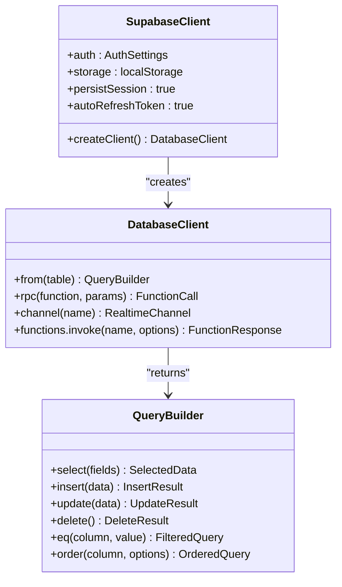

**Diagram sources**
- [client.ts](file://src/integrations/supabase/client.ts#L1-L20)

**Section sources**
- [client.ts](file://src/integrations/supabase/client.ts#L1-L20)
- [types.ts](file://src/integrations/supabase/types.ts#L1-L800)

## Serverless Functions

The serverless function architecture provides a scalable backend for handling API requests, business logic, and external integrations. Functions are implemented using Deno runtime with proper CORS handling, input validation, and error management.

### HTTP Methods and URL Patterns

Serverless functions follow RESTful principles with standardized URL patterns and HTTP methods:

- **POST** `/functions/v1/submit-quote` - Submit a new quote request
- **POST** `/functions/v1/ai-quote-generator` - Generate AI-powered quote estimates
- **GET** `/functions/v1/ai-quote-generator` - Health check endpoint
- **POST** `/functions/v1/admin-check` - Admin role validation
- **POST** `/functions/v1/create-payment-intent` - Payment processing

### Request/Response Schemas

Each function implements strict request validation using Zod schemas to ensure data integrity and security.

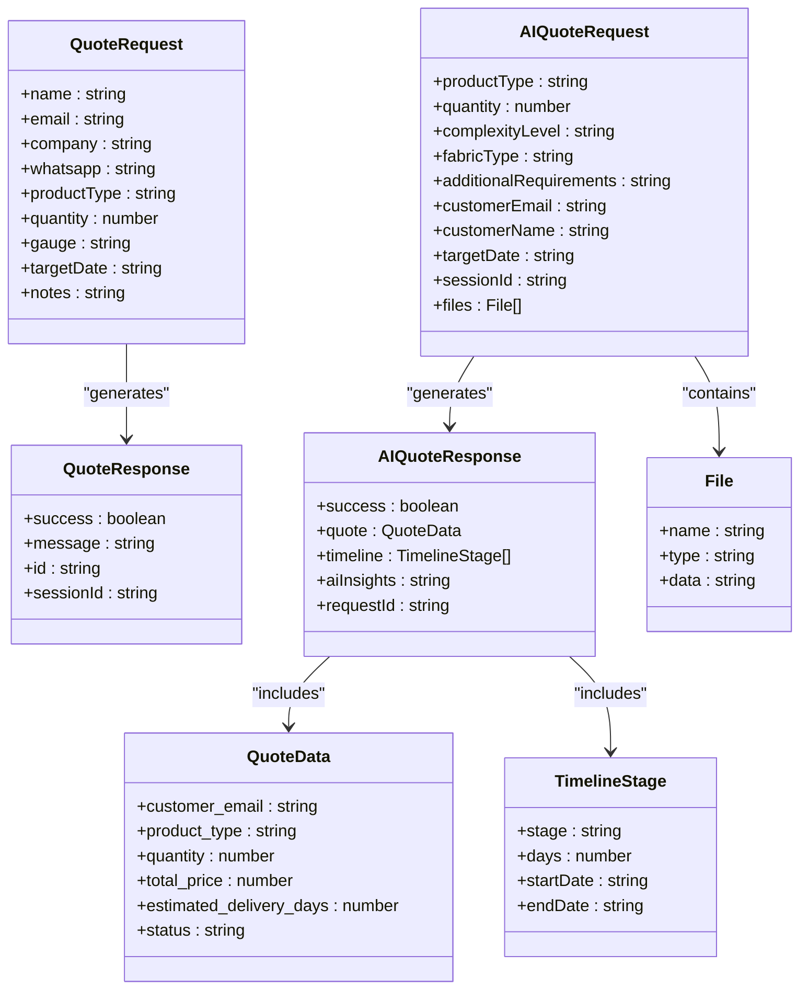

**Diagram sources**
- [submit-quote/index.ts](file://supabase/functions/submit-quote/index.ts#L1-L222)
- [ai-quote-generator/index.ts](file://supabase/functions/ai-quote-generator/index.ts#L1-L753)

**Section sources**
- [submit-quote/index.ts](file://supabase/functions/submit-quote/index.ts#L1-L222)
- [ai-quote-generator/index.ts](file://supabase/functions/ai-quote-generator/index.ts#L1-L753)
- [aiQuote.ts](file://src/lib/api/aiQuote.ts#L1-L203)

### Authentication Requirements

Serverless functions implement multiple authentication layers:

1. **JWT Token Validation**: Functions validate Bearer tokens from Supabase auth
2. **Role-Based Access Control**: Admin functions require admin role verification
3. **Origin Validation**: CORS protection with allowed origin checking
4. **Session Management**: Anonymous users tracked via session IDs

The authentication flow follows this sequence:

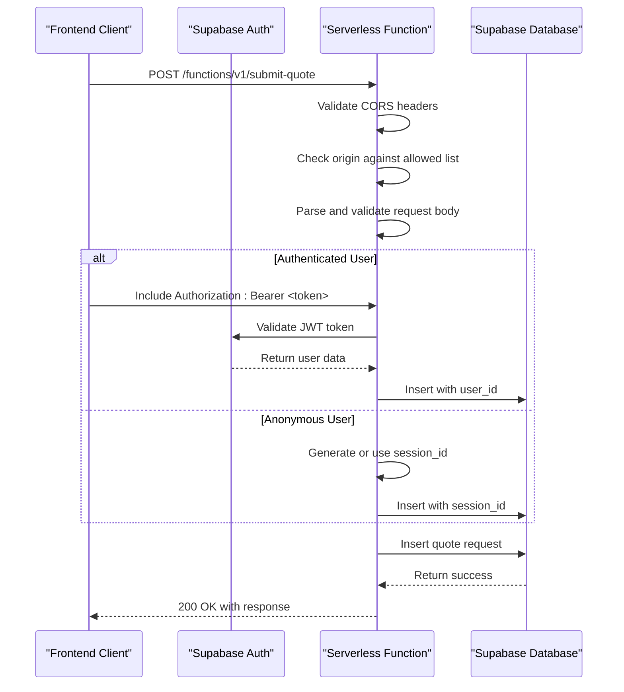

**Diagram sources**
- [submit-quote/index.ts](file://supabase/functions/submit-quote/index.ts#L1-L222)
- [useAdminAuth.ts](file://src/hooks/useAdminAuth.ts#L1-L47)

**Section sources**
- [submit-quote/index.ts](file://supabase/functions/submit-quote/index.ts#L1-L222)
- [ai-quote-generator/index.ts](file://supabase/functions/ai-quote-generator/index.ts#L1-L753)
- [useAdminAuth.ts](file://src/hooks/useAdminAuth.ts#L1-L47)

## Real-time Subscriptions

The application implements real-time updates using Supabase's real-time capabilities for instant notifications and message delivery.

### Subscription Patterns

Real-time subscriptions follow a channel-based pattern with filtered event listening:

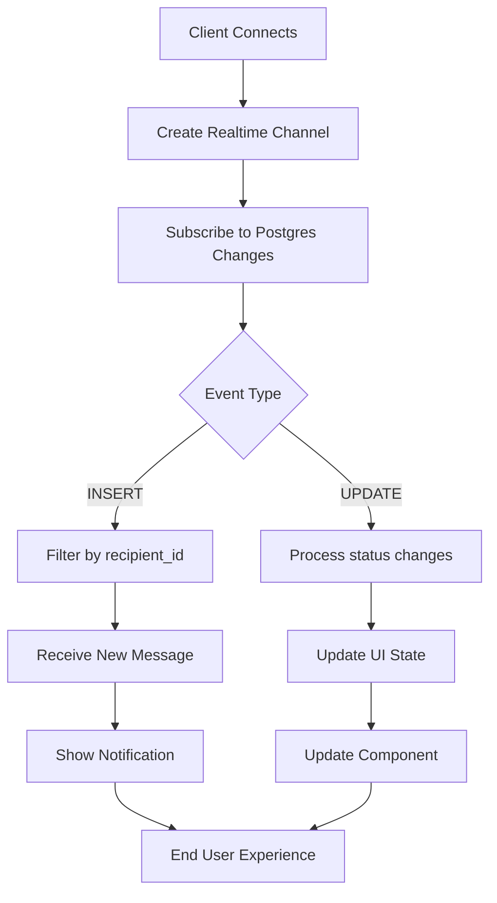

**Diagram sources**
- [useRealtimeMessages.ts](file://src/hooks/useRealtimeMessages.ts#L1-L61)
- [useNotifications.ts](file://src/hooks/useNotifications.ts#L1-L106)

**Section sources**
- [useRealtimeMessages.ts](file://src/hooks/useRealtimeMessages.ts#L1-L61)
- [useNotifications.ts](file://src/hooks/useNotifications.ts#L1-L106)

### Protocol-Specific Examples

Real-time updates for quote requests and order tracking:

```typescript
// Subscribe to new messages for current user
const { channel } = useRealtimeMessages(userId, (message) => {
  // Handle new message
  console.log('New message received:', message);
  // Update UI with new message
});

// Subscribe to notifications
useEffect(() => {
  const channel = supabase
    .channel('notifications')
    .on(
      'postgres_changes',
      {
        event: 'INSERT',
        schema: 'public',
        table: 'notifications',
      },
      (payload) => {
        const newNotification = payload.new as UserNotification;
        // Show toast notification
        toast({
          title: newNotification.title,
          description: newNotification.message,
        });
      }
    )
    .subscribe();

  return () => {
    channel.unsubscribe();
  };
}, []);
```

**Section sources**
- [useRealtimeMessages.ts](file://src/hooks/useRealtimeMessages.ts#L1-L61)
- [useNotifications.ts](file://src/hooks/useNotifications.ts#L1-L106)

## Authentication and Authorization

The authentication system combines Supabase Auth with custom role-based access control for secure application access.

### Authentication Flow

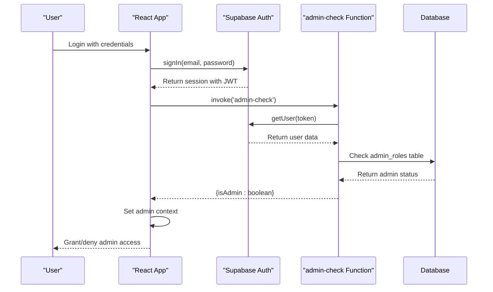

**Diagram sources**
- [useAdminAuth.ts](file://src/hooks/useAdminAuth.ts#L1-L47)

**Section sources**
- [useAdminAuth.ts](file://src/hooks/useAdminAuth.ts#L1-L47)

## Error Handling and Network Resilience

The application implements comprehensive error handling strategies for network failures and API errors.

### Error Handling Strategies

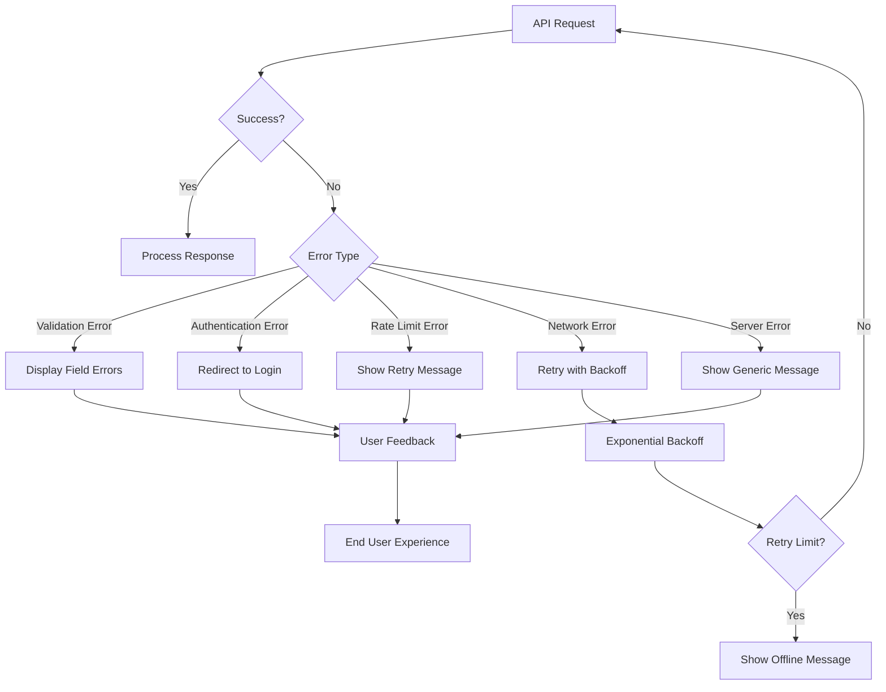

**Diagram sources**
- [aiQuote.ts](file://src/lib/api/aiQuote.ts#L1-L203)
- [submit-quote/index.ts](file://supabase/functions/submit-quote/index.ts#L1-L222)

**Section sources**
- [aiQuote.ts](file://src/lib/api/aiQuote.ts#L1-L203)
- [submit-quote/index.ts](file://supabase/functions/submit-quote/index.ts#L1-L222)
- [ai-quote-generator/index.ts](file://supabase/functions/ai-quote-generator/index.ts#L1-L753)

### Common Error Responses

| Status Code | Error Type | Response Structure | Retry Strategy |
|------------|------------|-------------------|----------------|
| 400 | Validation Error | `{ error: 'Invalid input data', details: [...] }` | Fix input and retry |
| 401 | Authentication Error | `{ error: 'Unauthorized' }` | Re-authenticate |
| 403 | Forbidden | `{ error: 'Unauthorized origin' }` | Contact support |
| 404 | Not Found | `{ error: 'Product configuration unavailable' }` | Verify parameters |
| 429 | Rate Limited | `{ error: 'Too many requests', retryAfter: seconds }` | Wait and retry |
| 500 | Server Error | `{ error: 'Failed to generate quote' }` | Retry with backoff |

**Section sources**
- [submit-quote/index.ts](file://supabase/functions/submit-quote/index.ts#L1-L222)
- [ai-quote-generator/index.ts](file://supabase/functions/ai-quote-generator/index.ts#L1-L753)

## Security Considerations

The application implements multiple security layers to protect data and prevent unauthorized access.

### Security Measures

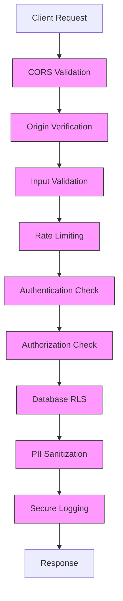

**Diagram sources**
- [submit-quote/index.ts](file://supabase/functions/submit-quote/index.ts#L1-L222)
- [ai-quote-generator/index.ts](file://supabase/functions/ai-quote-generator/index.ts#L1-L753)
- [logger.ts](file://supabase/functions/_shared/logger.ts#L1-L173)

**Section sources**
- [submit-quote/index.ts](file://supabase/functions/submit-quote/index.ts#L1-L222)
- [ai-quote-generator/index.ts](file://supabase/functions/ai-quote-generator/index.ts#L1-L753)
- [logger.ts](file://supabase/functions/_shared/logger.ts#L1-L173)

### PII Sanitization

All logs are automatically sanitized to protect personally identifiable information:

- Email addresses: `john.doe@example.com` → `joh***@example.com`
- Phone numbers: `+8801234567890` → `+880****90`
- Order IDs: `550e8400-e29b-41d4-a716-446655440000` → `550e8400-****`
- Passwords, tokens, and secrets are completely redacted

**Section sources**
- [logger.ts](file://supabase/functions/_shared/logger.ts#L1-L173)

## Rate Limiting and Quotas

The application implements tiered rate limiting to prevent abuse and ensure fair usage.

### Rate Limiting Implementation

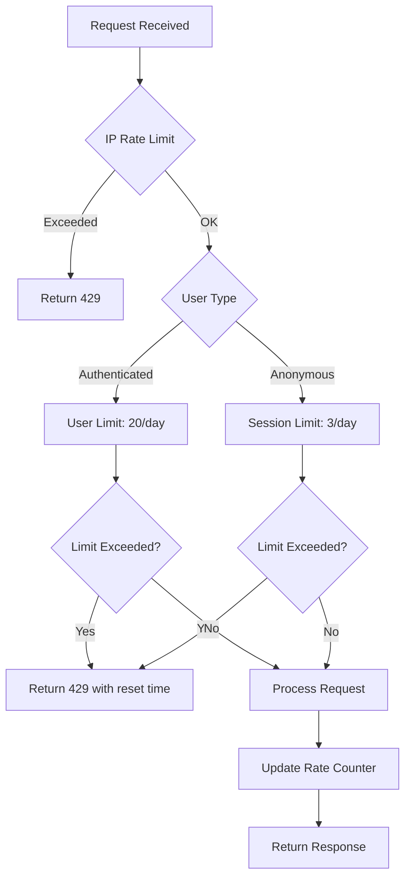

**Diagram sources**
- [ai-quote-generator/index.ts](file://supabase/functions/ai-quote-generator/index.ts#L1-L753)

**Section sources**
- [ai-quote-generator/index.ts](file://supabase/functions/ai-quote-generator/index.ts#L1-L753)

### Rate Limit Headers

Successful responses include rate limit information:

- `X-RateLimit-Limit`: Maximum requests allowed
- `X-RateLimit-Remaining`: Remaining requests in current window
- `X-RateLimit-Reset`: Time when limit resets (ISO format)

Rate limits are enforced at multiple levels:
- IP address: 15 requests per day
- Authenticated users: 20 requests per day
- Anonymous sessions: 3 requests per day

**Section sources**
- [ai-quote-generator/index.ts](file://supabase/functions/ai-quote-generator/index.ts#L1-L753)

## Common Use Cases

### Submitting a Quote Request

The quote submission process involves collecting customer requirements and generating an AI-powered estimate.

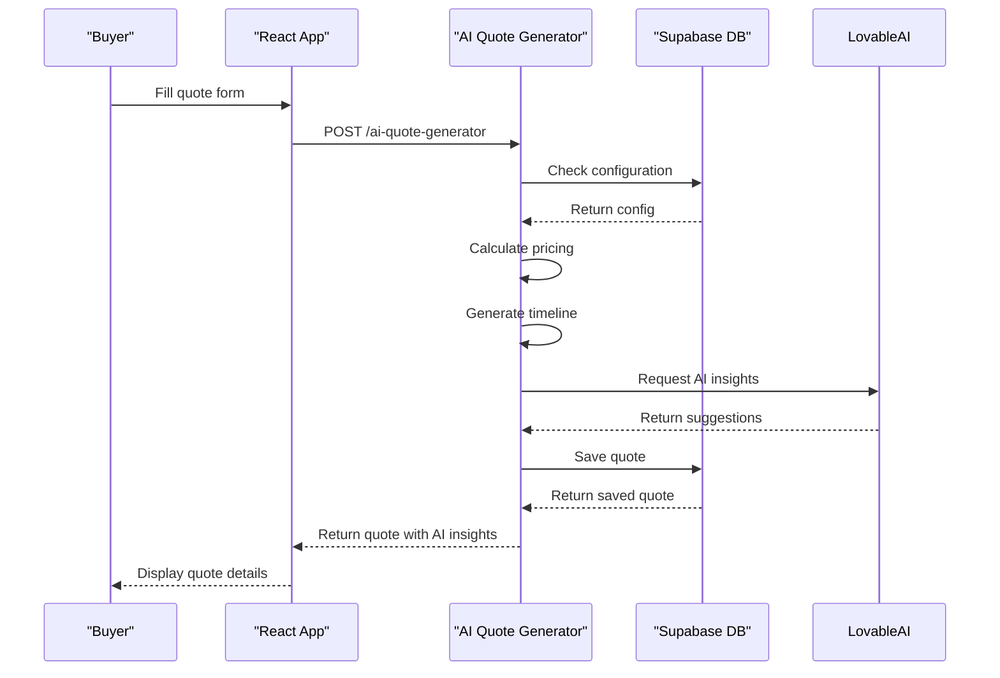

**Diagram sources**
- [aiQuote.ts](file://src/lib/api/aiQuote.ts#L1-L203)
- [ai-quote-generator/index.ts](file://supabase/functions/ai-quote-generator/index.ts#L1-L753)

**Section sources**
- [aiQuote.ts](file://src/lib/api/aiQuote.ts#L1-L203)
- [ai-quote-generator/index.ts](file://supabase/functions/ai-quote-generator/index.ts#L1-L753)
- [useQuotes.ts](file://src/hooks/useQuotes.ts#L1-L261)

### Tracking Order Updates

Real-time order tracking allows suppliers and buyers to monitor production progress.

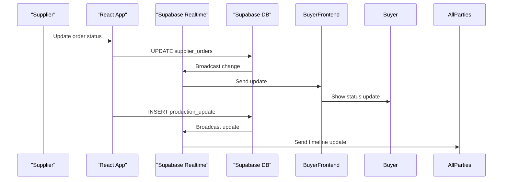

**Diagram sources**
- [useSupplierOrders.ts](file://src/hooks/useSupplierOrders.ts#L1-L208)
- [useRealtimeMessages.ts](file://src/hooks/useRealtimeMessages.ts#L1-L61)

**Section sources**
- [useSupplierOrders.ts](file://src/hooks/useSupplierOrders.ts#L1-L208)
- [useRealtimeMessages.ts](file://src/hooks/useRealtimeMessages.ts#L1-L61)
- [useOrderManagement.ts](file://src/hooks/useOrderManagement.ts#L1-L130)

## Client Implementation Guidelines

### React Component Patterns

The application uses custom hooks for data management and state synchronization.

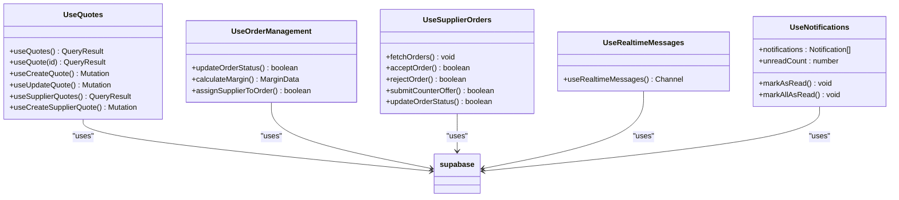

**Diagram sources**
- [useQuotes.ts](file://src/hooks/useQuotes.ts#L1-L261)
- [useOrderManagement.ts](file://src/hooks/useOrderManagement.ts#L1-L130)
- [useSupplierOrders.ts](file://src/hooks/useSupplierOrders.ts#L1-L208)
- [useRealtimeMessages.ts](file://src/hooks/useRealtimeMessages.ts#L1-L61)
- [useNotifications.ts](file://src/hooks/useNotifications.ts#L1-L106)

**Section sources**
- [useQuotes.ts](file://src/hooks/useQuotes.ts#L1-L261)
- [useOrderManagement.ts](file://src/hooks/useOrderManagement.ts#L1-L130)
- [useSupplierOrders.ts](file://src/hooks/useSupplierOrders.ts#L1-L208)
- [useRealtimeMessages.ts](file://src/hooks/useRealtimeMessages.ts#L1-L61)
- [useNotifications.ts](file://src/hooks/useNotifications.ts#L1-L106)

### Data Fetching and Caching

The application uses React Query for efficient data fetching and caching:

- Automatic caching of query results
- Background refetching for stale data
- Optimistic updates for better UX
- Error retry with exponential backoff
- Cache invalidation on mutations

**Section sources**
- [useQuotes.ts](file://src/hooks/useQuotes.ts#L1-L261)
- [useOrderManagement.ts](file://src/hooks/useOrderManagement.ts#L1-L130)
- [useSupplierOrders.ts](file://src/hooks/useSupplierOrders.ts#L1-L208)

## Performance Optimization

### Query Optimization

The application implements several query optimization techniques:

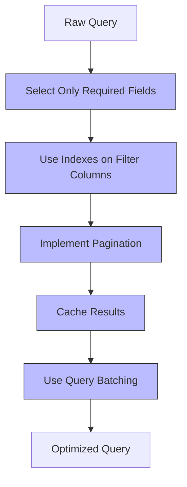

**Diagram sources**
- [supabaseHelpers.ts](file://src/lib/supabaseHelpers.ts#L1-L376)

**Section sources**
- [supabaseHelpers.ts](file://src/lib/supabaseHelpers.ts#L1-L376)
- [useQuotes.ts](file://src/hooks/useQuotes.ts#L1-L261)

### Caching Strategies

Multiple caching layers improve performance:

1. **Client-Side Caching**: React Query caches data with configurable TTL
2. **Session Storage**: Session IDs persist for anonymous users
3. **Database Indexing**: Critical columns are indexed for fast lookups
4. **CDN Caching**: Static assets served through CDN

**Section sources**
- [supabaseHelpers.ts](file://src/lib/supabaseHelpers.ts#L1-L376)
- [useQuotes.ts](file://src/hooks/useQuotes.ts#L1-L261)

## Monitoring and Debugging

### Logging and Monitoring

The application implements structured logging with PII sanitization:

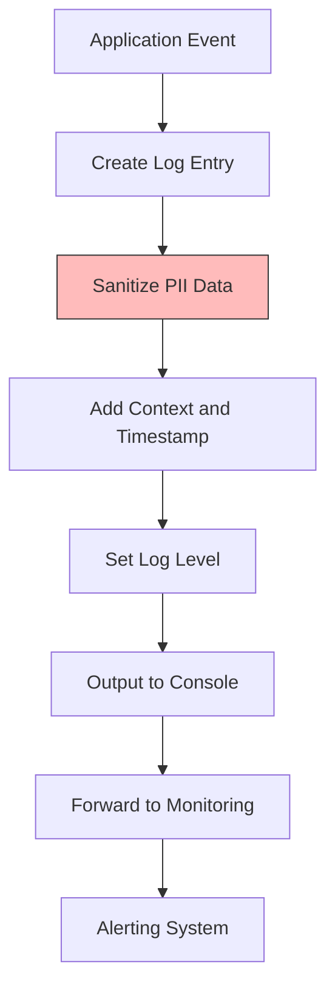

**Diagram sources**
- [logger.ts](file://supabase/functions/_shared/logger.ts#L1-L173)

**Section sources**
- [logger.ts](file://supabase/functions/_shared/logger.ts#L1-L173)

### Debugging Tools

Available debugging approaches:

- **Structured Logs**: JSON-formatted logs with consistent schema
- **Request IDs**: Unique IDs for tracing requests across services
- **Error Codes**: Standardized error codes for troubleshooting
- **Health Checks**: GET endpoints for monitoring function status
- **Rate Limit Headers**: Visibility into usage limits

**Section sources**
- [logger.ts](file://supabase/functions/_shared/logger.ts#L1-L173)
- [ai-quote-generator/index.ts](file://supabase/functions/ai-quote-generator/index.ts#L1-L753)

## Migration Guide

### Deprecated API Patterns

The following API patterns have been deprecated and should be replaced:

1. **Direct Database Access**: Replace direct Supabase client calls with helper functions
   - **Deprecated**: `supabase.from('quotes').select('*')`
   - **Recommended**: `quoteHelpers.getByEmail(email)`

2. **Unauthenticated Function Calls**: Always include proper authentication
   - **Deprecated**: `supabase.functions.invoke('admin-function')`
   - **Recommended**: Ensure user is authenticated before invoking

3. **Insecure Error Handling**: Use standardized error responses
   - **Deprecated**: Exposing detailed database errors to clients
   - **Recommended**: Generic error messages with support contact

4. **Missing Rate Limit Headers**: Always include rate limit information
   - **Deprecated**: Simple 429 responses without retry information
   - **Recommended**: Include `Retry-After` and rate limit headers

**Section sources**
- [supabaseHelpers.ts](file://src/lib/supabaseHelpers.ts#L1-L376)
- [aiQuote.ts](file://src/lib/api/aiQuote.ts#L1-L203)
- [submit-quote/index.ts](file://supabase/functions/submit-quote/index.ts#L1-L222)