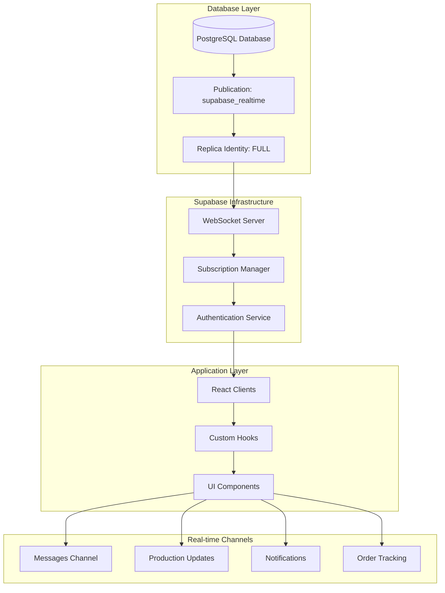
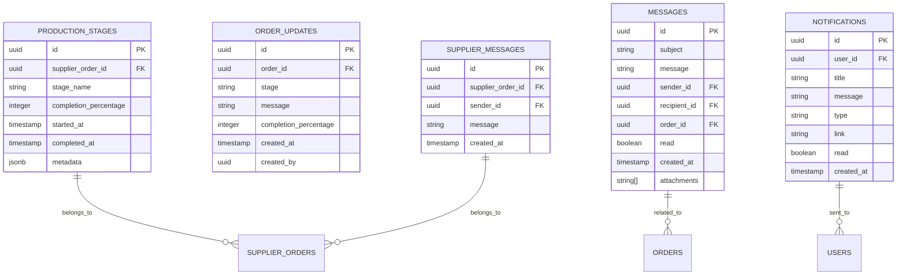
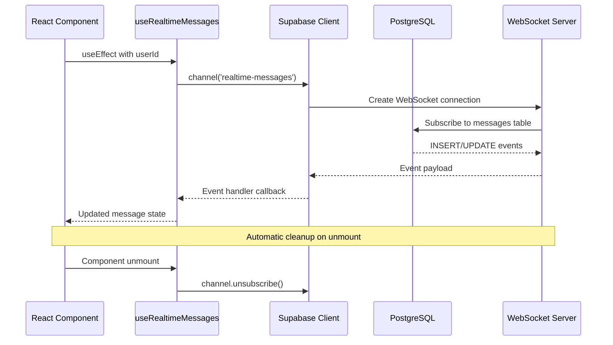
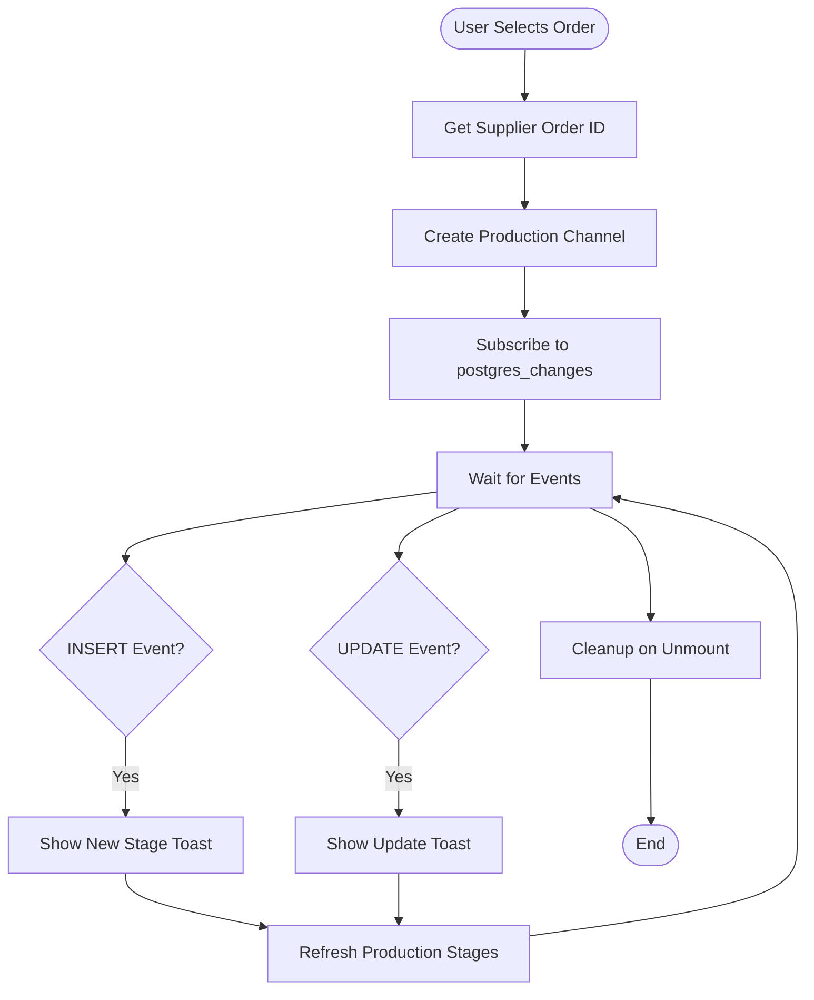
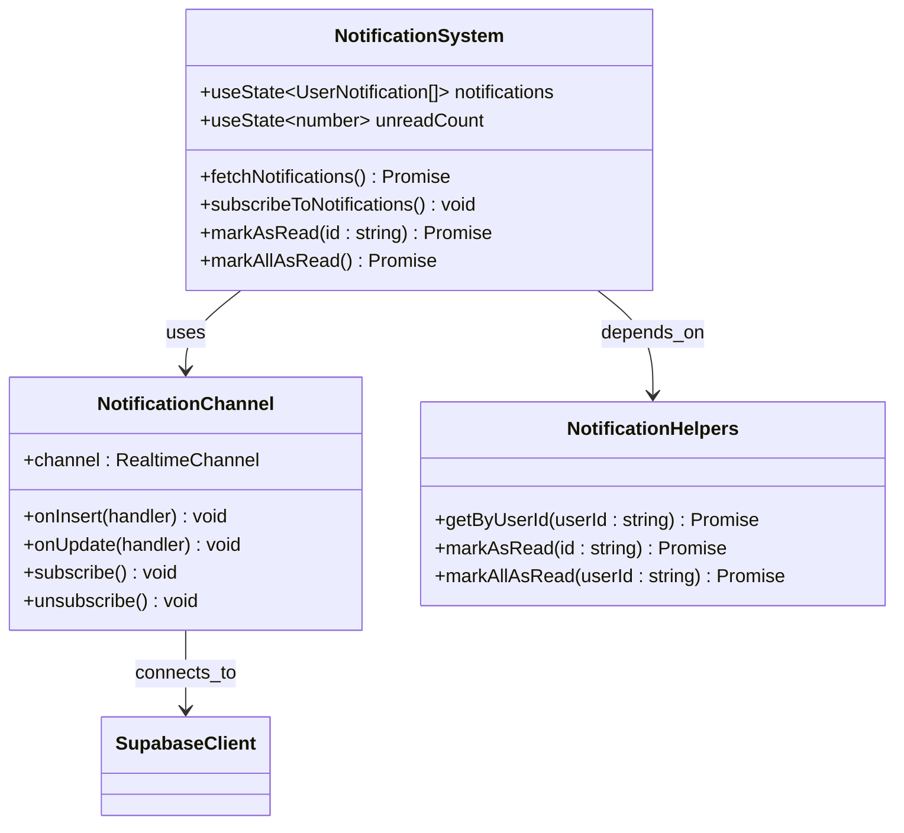
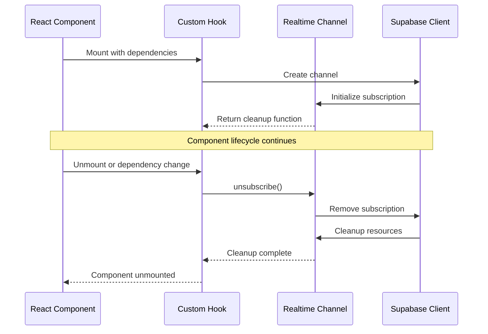
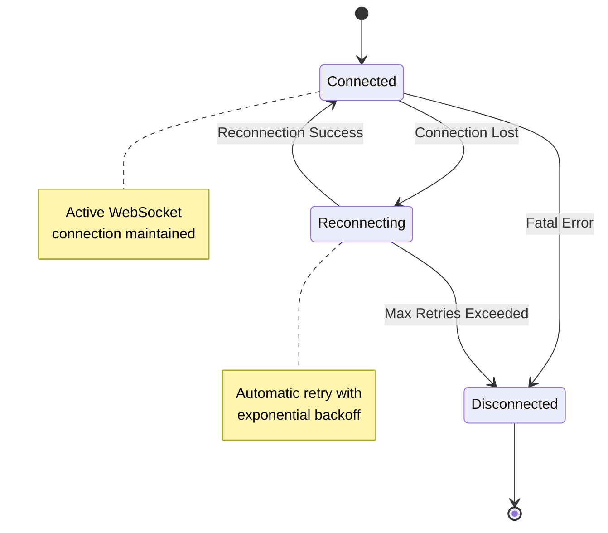

# Realtime Data Synchronization

<cite>
**Referenced Files in This Document**
- [useRealtimeMessages.ts](file://src/hooks/useRealtimeMessages.ts)
- [CommunicationCenter.tsx](file://src/components/shared/CommunicationCenter.tsx)
- [client.ts](file://src/integrations/supabase/client.ts)
- [OrderMessaging.tsx](file://src/components/supplier/OrderMessaging.tsx)
- [ConnectionStatusIndicator.tsx](file://src/components/production/ConnectionStatusIndicator.tsx)
- [LoopTraceOrderTracking.tsx](file://src/components/buyer/LoopTraceOrderTracking.tsx)
- [ProductionTracking.tsx](file://src/pages/ProductionTracking.tsx)
- [ProductionUpdatesFeed.tsx](file://src/components/ProductionUpdatesFeed.tsx)
- [NotificationBell.tsx](file://src/components/NotificationBell.tsx)
- [NotificationCenter.tsx](file://src/components/NotificationCenter.tsx)
- [useNotifications.ts](file://src/hooks/useNotifications.ts)
- [20251121033912_261eea9c-4366-46d4-bb30-fed5b5f232a6.sql](file://supabase/migrations/20251121033912_261eea9c-4366-46d4-bb30-fed5b5f232a6.sql)
- [database.ts](file://src/types/database.ts)
</cite>

## Table of Contents
1. [Introduction](#introduction)
2. [System Architecture](#system-architecture)
3. [Supabase Real-time Infrastructure](#supabase-real-time-infrastructure)
4. [Core Real-time Components](#core-real-time-components)
5. [Event Subscription Patterns](#event-subscription-patterns)
6. [Channel Management and Lifecycle](#channel-management-and-lifecycle)
7. [Security and Row-Level Security](#security-and-row-level-security)
8. [Error Handling and Reconnection](#error-handling-and-reconnection)
9. [Performance Optimization](#performance-optimization)
10. [Debugging and Monitoring](#debugging-and-monitoring)
11. [Best Practices](#best-practices)
12. [Troubleshooting Guide](#troubleshooting-guide)

## Introduction

The sleekapp-v100 real-time data synchronization system leverages Supabase's Postgres replication capabilities combined with WebSocket connections to provide instant updates across the application. This system enables real-time communication between buyers, suppliers, and administrators through synchronized messaging, production stage updates, and notification systems.

The architecture utilizes PostgreSQL's logical replication to capture database changes and deliver them to connected clients via WebSockets, ensuring data consistency and immediate synchronization across all application participants.

## System Architecture

The real-time system follows a layered architecture that separates concerns between database operations, real-time delivery, and client-side consumption:

**Diagram sources**
- [client.ts](file://src/integrations/supabase/client.ts#L14-L20)
- [20251121033912_261eea9c-4366-46d4-bb30-fed5b5f232a6.sql](file://supabase/migrations/20251121033912_261eea9c-4366-46d4-bb30-fed5b5f232a6.sql#L1-L7)

**Section sources**
- [client.ts](file://src/integrations/supabase/client.ts#L1-L20)
- [20251121033912_261eea9c-4366-46d4-bb30-fed5b5f232a6.sql](file://supabase/migrations/20251121033912_261eea9c-4366-46d4-bb30-fed5b5f232a6.sql#L1-L7)

## Supabase Real-time Infrastructure

### Postgres Replication Setup

The foundation of the real-time system relies on PostgreSQL's logical replication capabilities. Supabase enables real-time functionality by configuring specific database tables for replication:

**Diagram sources**
- [20251121033912_261eea9c-4366-46d4-bb30-fed5b5f232a6.sql](file://supabase/migrations/20251121033912_261eea9c-4366-46d4-bb30-fed5b5f232a6.sql#L1-L7)

### WebSocket Connection Management

The Supabase client establishes persistent WebSocket connections that maintain real-time communication with the server. These connections handle automatic reconnection, heartbeat management, and error recovery.

**Section sources**
- [client.ts](file://src/integrations/supabase/client.ts#L14-L20)
- [20251121033912_261eea9c-4366-46d4-bb30-fed5b5f232a6.sql](file://supabase/migrations/20251121033912_261eea9c-4366-46d4-bb30-fed5b5f232a6.sql#L1-L7)

## Core Real-time Components

### Message Real-time System

The messaging system provides bidirectional real-time communication between users through the `useRealtimeMessages` hook and `CommunicationCenter` component.

#### Message Subscription Implementation

**Diagram sources**
- [useRealtimeMessages.ts](file://src/hooks/useRealtimeMessages.ts#L17-L61)
- [CommunicationCenter.tsx](file://src/components/shared/CommunicationCenter.tsx#L44-L87)

#### CommunicationCenter Features

The CommunicationCenter provides a comprehensive messaging interface with real-time updates:

- **Bidirectional Messaging**: Supports both sending and receiving messages
- **File Attachments**: Real-time file upload and sharing capabilities
- **Search Functionality**: Real-time message filtering and search
- **Read Status Tracking**: Automatic read/unread status management
- **Multiple Recipients**: Support for group conversations

**Section sources**
- [useRealtimeMessages.ts](file://src/hooks/useRealtimeMessages.ts#L1-L61)
- [CommunicationCenter.tsx](file://src/components/shared/CommunicationCenter.tsx#L1-L451)

### Production Stage Updates

Real-time production stage updates enable instant visibility into manufacturing processes:

#### Production Tracking Implementation

**Diagram sources**
- [LoopTraceOrderTracking.tsx](file://src/components/buyer/LoopTraceOrderTracking.tsx#L58-L119)
- [ProductionTracking.tsx](file://src/pages/ProductionTracking.tsx#L63-L88)

**Section sources**
- [LoopTraceOrderTracking.tsx](file://src/components/buyer/LoopTraceOrderTracking.tsx#L43-L128)
- [ProductionTracking.tsx](file://src/pages/ProductionTracking.tsx#L55-L101)

### Notification System

The notification system provides real-time alerts and updates across the application:

#### Notification Subscription Pattern

**Diagram sources**
- [useNotifications.ts](file://src/hooks/useNotifications.ts#L7-L106)
- [NotificationBell.tsx](file://src/components/NotificationBell.tsx#L23-L151)

**Section sources**
- [useNotifications.ts](file://src/hooks/useNotifications.ts#L1-L106)
- [NotificationBell.tsx](file://src/components/NotificationBell.tsx#L1-L151)
- [NotificationCenter.tsx](file://src/components/NotificationCenter.tsx#L1-L87)

## Event Subscription Patterns

### Table-Level Subscriptions

The system implements various event subscription patterns depending on the use case:

#### INSERT Event Pattern
Used for new message notifications and fresh data loading:
- **Messages**: New messages arrive for specific recipients
- **Notifications**: New alerts and updates appear
- **Production Stages**: New manufacturing stages begin

#### UPDATE Event Pattern
Handles modifications to existing records:
- **Messages**: Read status changes and content updates
- **Production Stages**: Progress percentage and completion updates
- **Notifications**: Read status and metadata changes

#### Wildcard (*) Event Pattern
Captures all database changes for comprehensive monitoring:
- **Order Tracking**: Complete visibility into order state changes
- **Production Monitoring**: Full lifecycle tracking of manufacturing processes

### Filter-Based Subscriptions

Advanced filtering enables targeted real-time updates:

| Filter Type | Example | Purpose |
|-------------|---------|---------|
| Equality Filter | `recipient_id=eq.${userId}` | Target specific users |
| Foreign Key Filter | `supplier_order_id=eq.${orderId}` | Link to parent records |
| Status Filter | `status=eq.in_progress` | Filter by state |
| Role-Based Filter | `user_role=eq.admin` | Administrative access |

**Section sources**
- [useRealtimeMessages.ts](file://src/hooks/useRealtimeMessages.ts#L23-L51)
- [CommunicationCenter.tsx](file://src/components/shared/CommunicationCenter.tsx#L47-L81)
- [OrderMessaging.tsx](file://src/components/supplier/OrderMessaging.tsx#L22-L35)

## Channel Management and Lifecycle

### Proper Cleanup Strategies

Effective channel management prevents memory leaks and ensures optimal performance:

#### React Hook Cleanup Pattern

**Diagram sources**
- [useRealtimeMessages.ts](file://src/hooks/useRealtimeMessages.ts#L55-L57)
- [ConnectionStatusIndicator.tsx](file://src/components/production/ConnectionStatusIndicator.tsx#L45-L48)

### Concurrent Subscription Management

The system handles multiple simultaneous subscriptions efficiently:

#### Subscription Aggregation
- **Channel Pooling**: Reuse channels for related events
- **Event Coalescing**: Combine multiple small updates
- **Memory Optimization**: Clean up unused channels promptly

#### Resource Management
- **Automatic Cleanup**: Built-in garbage collection for disconnected channels
- **Connection Limits**: Respect browser WebSocket connection limits
- **Priority Queuing**: Handle high-frequency vs. low-frequency updates differently

**Section sources**
- [useRealtimeMessages.ts](file://src/hooks/useRealtimeMessages.ts#L17-L61)
- [ConnectionStatusIndicator.tsx](file://src/components/production/ConnectionStatusIndicator.tsx#L1-L76)
- [OrderMessaging.tsx](file://src/components/supplier/OrderMessaging.tsx#L1-L136)

## Security and Row-Level Security

### Authentication Integration

Real-time subscriptions integrate seamlessly with Supabase's authentication system:

#### User Context Preservation
- **Automatic Token Refresh**: JWT tokens maintained across reconnections
- **Session Validation**: Real-time events validated against current session
- **Access Control**: Immediate enforcement of permission changes

#### Channel Security
- **Private Channels**: User-specific channels encrypted and isolated
- **Permission Checking**: Events filtered based on user permissions
- **Cross-Site Protection**: CSRF and XSS prevention built-in

### Row-Level Security Policies

The database enforces strict access controls:

#### Message Security Policies
- **View Policy**: Users can only see messages where they are sender or recipient
- **Send Policy**: Users can only send messages with their own user ID
- **Update Policy**: Recipients can only update their received messages

#### Production Data Security
- **Supplier Access**: Suppliers only see their assigned orders
- **Admin Visibility**: Administrators have comprehensive access
- **Role-Based Filtering**: Different data access based on user roles

**Section sources**
- [client.ts](file://src/integrations/supabase/client.ts#L14-L20)
- [ConnectionStatusIndicator.tsx](file://src/components/production/ConnectionStatusIndicator.tsx#L15-L23)

## Error Handling and Reconnection

### Connection Status Monitoring

The system provides comprehensive connection health monitoring:

**Diagram sources**
- [ConnectionStatusIndicator.tsx](file://src/components/production/ConnectionStatusIndicator.tsx#L11-L76)

### Reconnection Strategies

#### Automatic Recovery
- **Immediate Retry**: Fast reconnection attempts for transient failures
- **Exponential Backoff**: Gradually increasing delays for persistent issues
- **Max Retry Limits**: Prevent infinite loops during prolonged outages
- **Graceful Degradation**: Continue operation with cached data during disconnection

#### Error Classification
- **Network Errors**: Temporary connectivity issues
- **Authentication Errors**: Expired tokens or invalid sessions
- **Server Errors**: Database or infrastructure problems
- **Client Errors**: Application-level issues

### Network Condition Adaptation

The system adapts to varying network conditions:

#### Bandwidth Optimization
- **Payload Compression**: Reduce data transfer sizes
- **Selective Updates**: Send only changed fields
- **Batch Processing**: Combine multiple updates into single messages

#### Latency Management
- **Local Caching**: Maintain recent data during connection issues
- **Predictive Updates**: Anticipate likely user actions
- **Progressive Loading**: Show partial data while waiting for complete updates

**Section sources**
- [ConnectionStatusIndicator.tsx](file://src/components/production/ConnectionStatusIndicator.tsx#L1-L76)

## Performance Optimization

### Payload Size Optimization

Efficient data transmission minimizes bandwidth usage:

#### Data Serialization
- **Minimal Payloads**: Send only necessary fields
- **Compression**: Enable gzip compression for WebSocket traffic
- **Field Selection**: Use database field selection to reduce data transfer

#### Update Frequency Management
- **Debouncing**: Prevent excessive updates for rapid changes
- **Throttling**: Limit update frequency for high-change scenarios
- **Intelligent Polling**: Use real-time updates when beneficial

### Memory Management

#### Efficient State Updates
- **Immutable Updates**: Use functional updates to prevent unnecessary re-renders
- **State Normalization**: Store data in normalized structures
- **Cleanup Timing**: Remove old data after appropriate retention periods

#### Component Optimization
- **Memoization**: Use React.memo for expensive components
- **Lazy Loading**: Load real-time components only when needed
- **Virtual Scrolling**: Handle large lists efficiently

### Scalability Considerations

#### Horizontal Scaling
- **Load Balancing**: Distribute WebSocket connections across servers
- **Database Replication**: Maintain read replicas for heavy read loads
- **Caching Layers**: Implement Redis caching for frequently accessed data

#### Vertical Scaling
- **Connection Limits**: Monitor and limit concurrent connections
- **Resource Monitoring**: Track memory and CPU usage
- **Performance Metrics**: Collect and analyze real-time performance data

**Section sources**
- [useRealtimeMessages.ts](file://src/hooks/useRealtimeMessages.ts#L1-L61)
- [CommunicationCenter.tsx](file://src/components/shared/CommunicationCenter.tsx#L1-L451)

## Debugging and Monitoring

### Connection Health Monitoring

#### Real-time Diagnostics
- **Connection Status**: Visual indicators for connection state
- **Event Counters**: Track successful and failed event deliveries
- **Latency Measurements**: Monitor round-trip times for WebSocket operations

#### Logging and Tracing
- **Event Logging**: Comprehensive logging of all real-time events
- **Error Tracking**: Detailed error reporting with stack traces
- **Performance Metrics**: Track response times and throughput

### Subscription Health Monitoring

#### Channel Monitoring
- **Active Subscriptions**: Track currently active real-time channels
- **Event Delivery**: Monitor successful event delivery rates
- **Subscription Counts**: Track number of active subscriptions per user

#### Performance Metrics
- **Memory Usage**: Monitor memory consumption of real-time components
- **CPU Utilization**: Track CPU usage during real-time operations
- **Network Traffic**: Monitor data transfer rates and patterns

### Debug Tools and Utilities

#### Development Tools
- **Console Logging**: Extensive logging for development environments
- **Browser DevTools**: WebSocket inspection capabilities
- **Network Monitoring**: Track WebSocket traffic patterns

#### Production Monitoring
- **Error Reporting**: Integrate with error tracking services
- **Performance Monitoring**: Track real-time performance metrics
- **User Experience**: Monitor real-time feature adoption and usage

**Section sources**
- [ConnectionStatusIndicator.tsx](file://src/components/production/ConnectionStatusIndicator.tsx#L1-L76)

## Best Practices

### Implementation Guidelines

#### Channel Naming Conventions
- **Descriptive Names**: Use clear, descriptive channel names
- **Namespace Organization**: Group related channels under namespaces
- **Versioning**: Include version information in channel names for future compatibility

#### Event Handler Design
- **Pure Functions**: Keep event handlers pure and predictable
- **Error Boundaries**: Wrap event handlers in try-catch blocks
- **Performance Awareness**: Minimize work done in event handlers

#### State Management
- **Atomic Updates**: Make state updates atomic to prevent race conditions
- **Consistency Checks**: Validate data consistency after updates
- **Rollback Mechanisms**: Implement rollback for failed updates

### Security Best Practices

#### Access Control
- **Principle of Least Privilege**: Grant minimal necessary permissions
- **Regular Audits**: Review and audit real-time access patterns
- **Rate Limiting**: Implement rate limiting for real-time operations

#### Data Protection
- **Encryption**: Ensure all real-time data is encrypted in transit
- **Validation**: Validate all incoming data before processing
- **Sanitization**: Sanitize data to prevent injection attacks

### Performance Best Practices

#### Resource Management
- **Proper Cleanup**: Always clean up subscriptions on component unmount
- **Memory Monitoring**: Monitor memory usage of real-time components
- **Connection Limits**: Respect browser connection limits

#### Optimization Strategies
- **Selective Subscriptions**: Subscribe only to necessary data
- **Efficient Updates**: Minimize data transfer size
- **Caching Strategies**: Implement appropriate caching for static data

## Troubleshooting Guide

### Common Issues and Solutions

#### Connection Problems

**Issue**: WebSocket connections failing to establish
**Symptoms**: No real-time updates, connection status shows offline
**Solutions**:
- Verify internet connectivity
- Check firewall settings for WebSocket ports
- Validate Supabase credentials
- Review browser console for error messages

**Issue**: Frequent disconnections
**Symptoms**: Intermittent real-time functionality
**Solutions**:
- Check network stability
- Review connection timeout settings
- Monitor server load
- Implement proper reconnection logic

#### Subscription Issues

**Issue**: Events not received for specific users
**Symptoms**: Some users miss real-time updates
**Solutions**:
- Verify user authentication
- Check row-level security policies
- Review filter conditions
- Confirm channel subscription

**Issue**: Duplicate events received
**Symptoms**: Same event processed multiple times
**Solutions**:
- Check for multiple subscriptions
- Review event handler logic
- Implement deduplication mechanisms
- Verify database triggers

#### Performance Issues

**Issue**: Slow real-time updates
**Symptoms**: Delayed or laggy updates
**Solutions**:
- Optimize database queries
- Reduce payload sizes
- Implement debouncing
- Review network latency

**Issue**: High memory usage
**Symptoms**: Browser performance degradation
**Solutions**:
- Implement proper cleanup
- Reduce subscription scope
- Optimize state management
- Monitor memory usage

### Diagnostic Tools

#### Browser Developer Tools
- **Network Tab**: Monitor WebSocket connections
- **Console**: View real-time error messages
- **Application Tab**: Inspect local storage and session data

#### Supabase Console
- **Realtime Logs**: Monitor real-time event delivery
- **Connection Metrics**: Track connection statistics
- **Error Reports**: View error logs and patterns

#### Custom Monitoring
- **Performance Counters**: Track custom performance metrics
- **Event Tracking**: Monitor event occurrence patterns
- **User Behavior**: Analyze real-time feature usage

**Section sources**
- [ConnectionStatusIndicator.tsx](file://src/components/production/ConnectionStatusIndicator.tsx#L1-L76)
- [useRealtimeMessages.ts](file://src/hooks/useRealtimeMessages.ts#L1-L61)