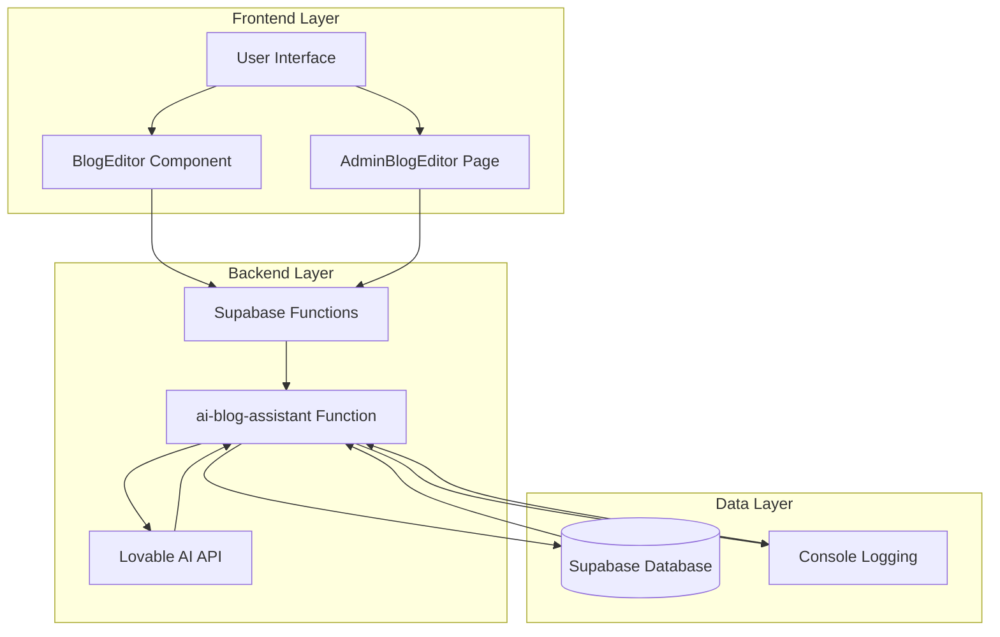
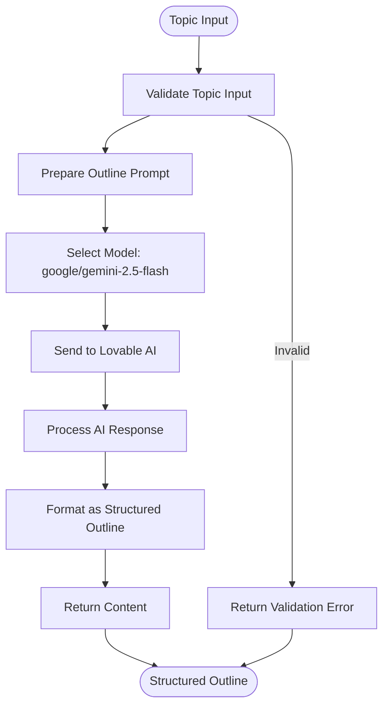
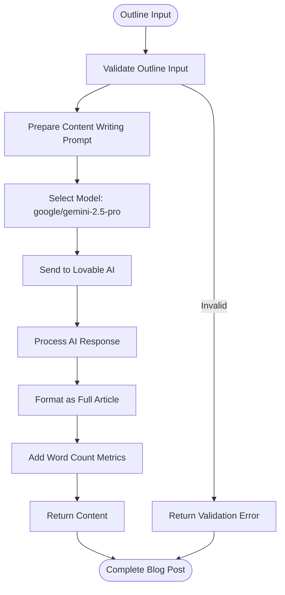
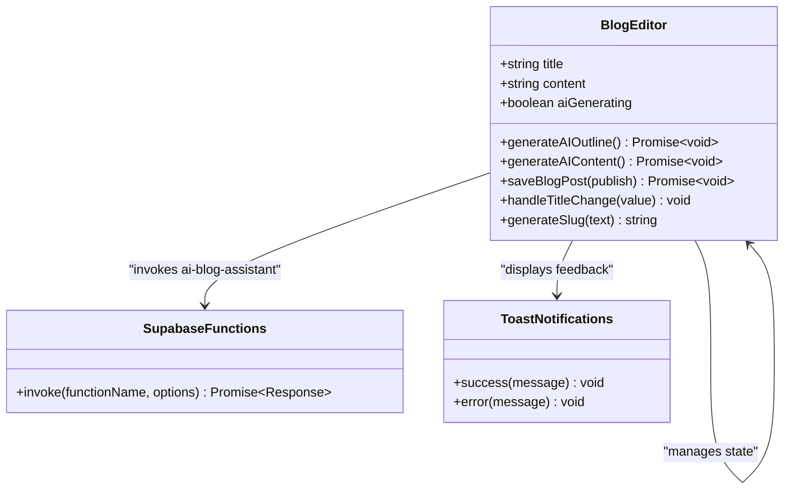
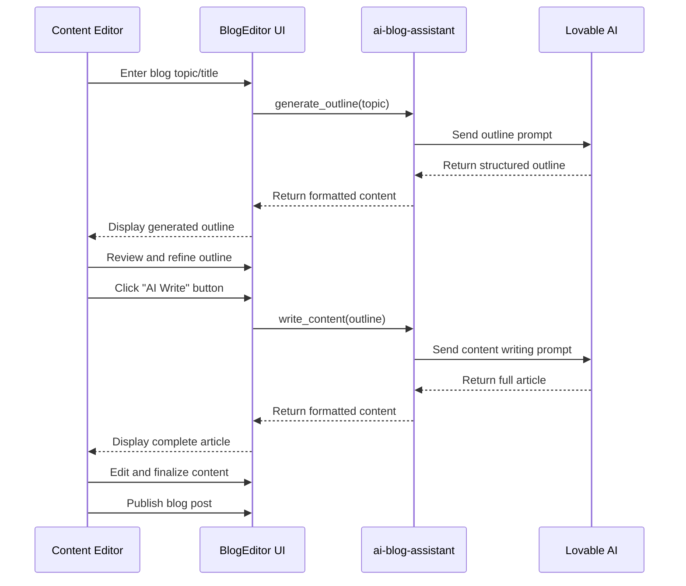

# AI Blog Assistant

<cite>
**Referenced Files in This Document**
- [BlogEditor.tsx](file://src/components/blog/BlogEditor.tsx)
- [AdminBlogEditor.tsx](file://src/pages/AdminBlogEditor.tsx)
- [index.ts](file://supabase/functions/ai-blog-assistant/index.ts)
- [config.toml](file://supabase/config.toml)
- [Blog.tsx](file://src/pages/Blog.tsx)
- [seed_MINIMAL.sql](file://supabase/seed_MINIMAL.sql)
</cite>

## Table of Contents
1. [Introduction](#introduction)
2. [System Architecture](#system-architecture)
3. [Two-Operation System](#two-operation-system)
4. [Prompt Engineering and Content Generation](#prompt-engineering-and-content-generation)
5. [Integration with BlogEditor Component](#integration-with-blogeditor-component)
6. [Response Format and Error Handling](#response-format-and-error-handling)
7. [Lovable AI Configuration](#lovable-ai-configuration)
8. [Blog Topics and Examples](#blog-topics-and-examples)
9. [Usage Patterns and Best Practices](#usage-patterns-and-best-practices)
10. [Troubleshooting Guide](#troubleshooting-guide)

## Introduction

The AI Blog Assistant is a sophisticated content generation system designed to streamline the creation of SEO-optimized blog content for the Sleek Apparels company blog. Built on a two-operation architecture, it transforms simple topic inputs into comprehensive, professionally formatted blog articles suitable for publication. The system leverages advanced AI models through the Lovable AI platform to produce high-quality content that meets industry standards for apparel manufacturing and sustainability topics.

The assistant operates through a seamless integration between a React frontend component and a serverless backend function, providing administrators with powerful AI-driven content creation capabilities while maintaining strict control over content quality and SEO optimization.

## System Architecture

The AI Blog Assistant follows a distributed architecture pattern with clear separation of concerns between the frontend presentation layer and the AI processing backend.



**Diagram sources**
- [BlogEditor.tsx](file://src/components/blog/BlogEditor.tsx#L1-L297)
- [AdminBlogEditor.tsx](file://src/pages/AdminBlogEditor.tsx#L1-L326)
- [index.ts](file://supabase/functions/ai-blog-assistant/index.ts#L1-L84)

The architecture consists of three primary layers:

1. **Frontend Layer**: React components that provide user interaction and content editing capabilities
2. **Backend Layer**: Serverless functions that handle AI integration and business logic
3. **Data Layer**: Database storage and external AI service integration

**Section sources**
- [BlogEditor.tsx](file://src/components/blog/BlogEditor.tsx#L1-L50)
- [AdminBlogEditor.tsx](file://src/pages/AdminBlogEditor.tsx#L1-L50)
- [index.ts](file://supabase/functions/ai-blog-assistant/index.ts#L1-L30)

## Two-Operation System

The AI Blog Assistant implements a two-stage content generation process designed to progressively enhance content quality and completeness.

### Operation 1: generate_outline

The first operation creates a structured outline from a given topic, serving as the foundation for comprehensive content development.



**Diagram sources**
- [index.ts](file://supabase/functions/ai-blog-assistant/index.ts#L25-L34)

The outline generation process includes:

- **Professional Content Strategy**: The AI acts as an expert content strategist for the apparel manufacturing industry
- **Comprehensive Structure**: Creates engaging titles, introductions, 5-7 main sections with subpoints, and conclusions
- **SEO Integration**: Automatically identifies and targets relevant keywords for the specified topic
- **Industry-Specific Expertise**: Tailored prompts for apparel manufacturing and sustainability domains

### Operation 2: write_content

The second operation expands the generated outline into a full-length article meeting professional publishing standards.



**Diagram sources**
- [index.ts](file://supabase/functions/ai-blog-assistant/index.ts#L35-L48)

The content writing operation produces:

- **Professional Tone**: Maintains appropriate business and industry-specific language
- **Statistical Content**: Incorporates relevant statistics and factual information where applicable
- **SEO Optimization**: Implements natural keyword placement and SEO best practices
- **Actionable Insights**: Provides practical takeaways and actionable information for readers
- **Structured Formatting**: Uses clear section headers and logical content progression

**Section sources**
- [index.ts](file://supabase/functions/ai-blog-assistant/index.ts#L25-L48)

## Prompt Engineering and Content Generation

The AI Blog Assistant employs sophisticated prompt engineering techniques to ensure consistent quality and adherence to professional standards across all generated content.

### System Prompts

The system uses specialized system prompts tailored to each operation:

**For Outline Generation:**
```
"You are an expert content strategist for apparel manufacturing industry."
```

**For Content Writing:**
```
"You are an expert content writer specializing in apparel manufacturing, creating comprehensive, SEO-optimized blog posts."
```

These prompts establish the AI's role and expertise level, ensuring appropriate tone and depth of content.

### User Prompts

The user prompts are carefully crafted to guide the AI toward specific content requirements:

**Outline Generation Prompt:**
```
Create a comprehensive blog post outline for: "{topic}"
  
Include:
- Engaging title
- Introduction hook
- 5-7 main sections with subpoints
- Conclusion
- SEO keywords to target
```

**Content Writing Prompt:**
```
Write a full blog post (1800-2500 words) based on this outline:

{outline}

Requirements:
- Professional yet engaging tone
- Include statistics and facts where relevant
- SEO-optimized with natural keyword placement
- Clear section headers
- Actionable insights for readers
- Strong conclusion with CTA
```

### Content Quality Standards

The prompts enforce several key quality standards:

- **Word Count Range**: Targeting 1800-2500 words for comprehensive coverage
- **Professional Tone**: Balancing expertise with accessibility
- **SEO Optimization**: Natural keyword integration and metadata consideration
- **Actionable Content**: Providing practical value to readers
- **Structured Format**: Logical organization with clear headings

**Section sources**
- [index.ts](file://supabase/functions/ai-blog-assistant/index.ts#L21-L48)

## Integration with BlogEditor Component

The AI Blog Assistant integrates seamlessly with the BlogEditor component, providing intuitive AI-powered content generation capabilities within the editorial workflow.

### Component Architecture



**Diagram sources**
- [BlogEditor.tsx](file://src/components/blog/BlogEditor.tsx#L12-L297)

### AI Generation Buttons

The BlogEditor component provides dedicated AI generation buttons that trigger the appropriate operations:

**AI Outline Button:**
- Triggers `generate_outline` operation
- Requires title input before activation
- Disabled during AI generation to prevent conflicts
- Provides visual feedback with loading indicators

**AI Write Button:**
- Triggers `write_content` operation
- Requires existing content (outline) before activation
- Disabled during AI generation to prevent conflicts
- Provides visual feedback with loading indicators

### State Management

The component manages AI generation state through React hooks:

- **aiGenerating**: Controls button states and prevents concurrent operations
- **content**: Stores generated content for editing and refinement
- **title**: Used as input for outline generation

### Error Handling Integration

The component implements comprehensive error handling:

- **Validation Errors**: Immediate feedback for missing required fields
- **API Errors**: Graceful handling of network and service errors
- **User Feedback**: Toast notifications for success and failure scenarios

**Section sources**
- [BlogEditor.tsx](file://src/components/blog/BlogEditor.tsx#L45-L96)

## Response Format and Error Handling

The AI Blog Assistant implements robust response formatting and error handling mechanisms to ensure reliable operation and meaningful user feedback.

### Response Format

The system returns standardized JSON responses for both successful operations and error conditions:

**Successful Response Format:**
```json
{
  "success": true,
  "content": "Generated content string"
}
```

**Error Response Format:**
```json
{
  "error": "Error message describing the issue"
}
```

### Error Handling Strategies

The system implements multiple layers of error handling:

**Frontend Error Handling:**
- Input validation before API calls
- Network error detection and user notification
- Graceful degradation when AI services are unavailable

**Backend Error Handling:**
- Environment variable validation
- AI API response validation
- Comprehensive logging for debugging

**Error Categories:**

1. **Validation Errors**: Invalid input parameters or missing required fields
2. **Network Errors**: API connectivity issues or timeout problems
3. **AI Service Errors**: Lovable AI API failures or quota limitations
4. **Processing Errors**: Internal system errors during content generation

### Logging and Monitoring

The system includes comprehensive logging for debugging and monitoring:

- **Console Logging**: Detailed logs of AI requests and responses
- **Error Tracking**: Structured error reporting with context information
- **Performance Monitoring**: Response time tracking for optimization

**Section sources**
- [index.ts](file://supabase/functions/ai-blog-assistant/index.ts#L72-L84)
- [BlogEditor.tsx](file://src/components/blog/BlogEditor.tsx#L64-L96)

## Lovable AI Configuration

The AI Blog Assistant leverages the Lovable AI platform for advanced content generation capabilities, configured with specific models optimized for different content types.

### Model Selection Strategy

The system uses different AI models based on content requirements:

**For Outline Generation:**
- **Model**: `google/gemini-2.5-flash`
- **Rationale**: Fast response times for initial content structure
- **Use Case**: Quick generation of comprehensive outlines

**For Content Writing:**
- **Model**: `google/gemini-2.5-pro`
- **Rationale**: Higher quality and longer context for full articles
- **Use Case**: Detailed, professional content creation

### API Configuration

The system communicates with the Lovable AI API through a standardized configuration:

**Authentication:**
- Uses Bearer token authentication with API key
- Environment variable `LOVABLE_API_KEY` for secure credential management

**Endpoint Configuration:**
- Base URL: `https://ai.gateway.lovable.dev/v1/chat/completions`
- Method: POST for chat completions
- Content Type: `application/json`

**Request Structure:**
```json
{
  "model": "selected-model",
  "messages": [
    { "role": "system", "content": "system-prompt" },
    { "role": "user", "content": "user-prompt" }
  ]
}
```

### Environment Configuration

The system requires proper environment configuration for secure operation:

**Required Environment Variables:**
- `LOVABLE_API_KEY`: Authentication key for Lovable AI services
- `SUPABASE_URL`: Supabase database connection URL
- `SUPABASE_SERVICE_ROLE_KEY`: Database service role credentials

**Security Considerations:**
- API keys stored as environment variables
- Secure transmission using HTTPS
- Minimal credential exposure in logs

**Section sources**
- [index.ts](file://supabase/functions/ai-blog-assistant/index.ts#L18-L24)
- [index.ts](file://supabase/functions/ai-blog-assistant/index.ts#L51-L62)

## Blog Topics and Examples

The AI Blog Assistant excels at generating content across various apparel manufacturing and sustainability topics. Here are examples of effective blog topics and their corresponding AI-generated structures:

### Example 1: Supplier Selection Guide

**Topic Input:** "How to Choose the Right Apparel Supplier for Your Brand"

**Generated Outline Structure:**
```
1. Introduction: The Importance of Supplier Selection
   - Why supplier choice matters for brand success
   - Key factors influencing supplier decisions

2. Quality Standards and Certifications
   - Understanding WRAP, OEKO-TEX, and GOTS certifications
   - Quality control processes and audits

3. Production Capacity and Scalability
   - Evaluating manufacturing capabilities
   - MOQ considerations and volume flexibility

4. Communication and Collaboration
   - Effective supplier communication strategies
   - Cultural and language considerations

5. Lead Times and Delivery Reliability
   - Understanding production timelines
   - Managing supply chain risks

6. Cost Analysis and Value Proposition
   - Total cost of ownership calculation
   - Balancing price and quality considerations

7. Risk Management and Due Diligence
   - Supplier risk assessment frameworks
   - Contingency planning strategies

8. Building Long-term Partnerships
   - Relationship management best practices
   - Collaborative innovation opportunities

9. Conclusion: Making Informed Supplier Decisions
   - Summary of key evaluation criteria
   - Next steps for supplier selection process
```

### Example 2: Sustainable Manufacturing Trends

**Topic Input:** "The Future of Sustainable Apparel Manufacturing"

**Generated Outline Structure:**
```
1. Introduction: The Shift Toward Sustainability
   - Current state of sustainability in apparel
   - Consumer demand for eco-friendly practices

2. Circular Economy Models
   - Principles of circular fashion design
   - Take-back programs and garment recycling
   - Closed-loop material systems

3. Innovative Materials and Technologies
   - Recycled polyester and nylon advancements
   - Plant-based fabrics and bio-materials
   - Biodegradable and compostable alternatives

4. Supply Chain Transparency
   - Blockchain technology in supply chains
   - Consumer demand for visibility
   - Traceability solutions

5. Local Manufacturing and Nearshoring
   - Benefits of local production
   - Reducing carbon footprint strategies
   - Supporting local economies

6. Digital Transformation in Sustainability
   - AI-powered demand forecasting
   - 3D design and virtual sampling
   - Digital twin technologies

7. Regulatory Landscape and Compliance
   - Global sustainability regulations
   - Carbon footprint measurement standards
   - Industry certification requirements

8. Challenges and Opportunities
   - Cost implications of sustainable practices
   - Technological barriers and solutions
   - Market positioning strategies

9. Conclusion: Embracing the Sustainable Future
   - Key takeaways for apparel manufacturers
   - Pathways to becoming a sustainability leader
```

### Content Generation Examples

Based on the outlined structures, the AI generates comprehensive articles that meet professional publishing standards:

**Word Count**: 1800-2500 words per article
**Tone**: Professional yet accessible
**Structure**: Clear headings with logical progression
**SEO**: Natural keyword integration
**Value**: Actionable insights and practical guidance

**Section sources**
- [seed_MINIMAL.sql](file://supabase/seed_MINIMAL.sql#L290-L314)

## Usage Patterns and Best Practices

The AI Blog Assistant supports various usage patterns depending on content creation needs and editorial workflows.

### Standard Editorial Workflow



**Diagram sources**
- [BlogEditor.tsx](file://src/components/blog/BlogEditor.tsx#L45-L96)

### Content Creation Patterns

**Pattern 1: Research-First Approach**
1. Enter broad topic idea
2. Generate outline to structure research
3. Fill in gaps with additional research
4. Expand outline into full content

**Pattern 2: Template-Based Approach**
1. Use existing successful templates
2. Modify topic-specific elements
3. Leverage AI for content expansion
4. Refine for target audience

**Pattern 3: Quick Content Generation**
1. Enter focused topic
2. Generate outline quickly
3. Use AI to flesh out content
4. Edit for publication quality

### Best Practices

**Content Quality Guidelines:**
- Verify AI-generated statistics and facts
- Ensure alignment with brand voice and tone
- Review SEO keyword placement naturally
- Validate technical accuracy for industry topics

**Workflow Optimization:**
- Use AI generation as a starting point rather than final content
- Combine AI assistance with human editorial oversight
- Maintain consistent branding and messaging
- Regularly review and update content templates

**Technical Considerations:**
- Monitor AI response times and reliability
- Implement fallback strategies for API failures
- Maintain content archives for reuse
- Track engagement metrics for content improvement

## Troubleshooting Guide

Common issues and solutions for the AI Blog Assistant system.

### API Integration Issues

**Problem**: AI generation fails with API errors
**Solution**: 
- Verify `LOVABLE_API_KEY` environment variable
- Check network connectivity to Lovable AI services
- Review API quota limits and billing status
- Examine console logs for detailed error messages

**Problem**: Slow response times during AI generation
**Solution**:
- Monitor API response times in browser developer tools
- Consider switching between Flash and Pro models based on content type
- Implement loading states and user feedback
- Review network performance and optimize requests

### Content Quality Issues

**Problem**: Generated content lacks specificity or depth
**Solution**:
- Provide more detailed topic descriptions
- Use specific keywords in topic input
- Review and refine AI prompts for better guidance
- Combine AI generation with manual research

**Problem**: SEO optimization appears unnatural
**Solution**:
- Review keyword density and placement
- Ensure natural language flow
- Add meta descriptions manually
- Implement content auditing processes

### Frontend Integration Issues

**Problem**: AI buttons remain disabled or unresponsive
**Solution**:
- Check component state management
- Verify event handler bindings
- Review loading state logic
- Test with different browser configurations

**Problem**: Content not displaying properly
**Solution**:
- Validate content formatting
- Check character encoding issues
- Review CSS styling conflicts
- Test with different content lengths

### Database and Storage Issues

**Problem**: Generated content not saving properly
**Solution**:
- Verify database connection
- Check field validation requirements
- Review content length limits
- Test with simplified content first

**Problem**: Content duplication or conflicts
**Solution**:
- Implement content versioning
- Add conflict resolution mechanisms
- Review slug generation logic
- Test with unique topic inputs

**Section sources**
- [index.ts](file://supabase/functions/ai-blog-assistant/index.ts#L77-L84)
- [BlogEditor.tsx](file://src/components/blog/BlogEditor.tsx#L64-L96)