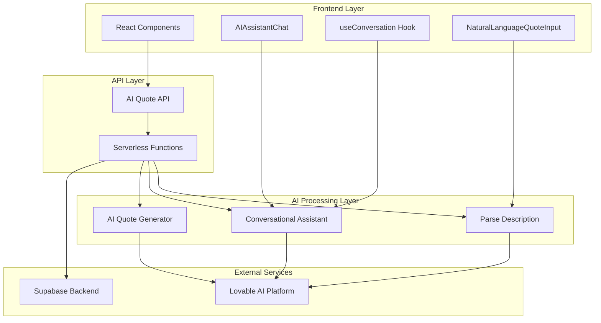
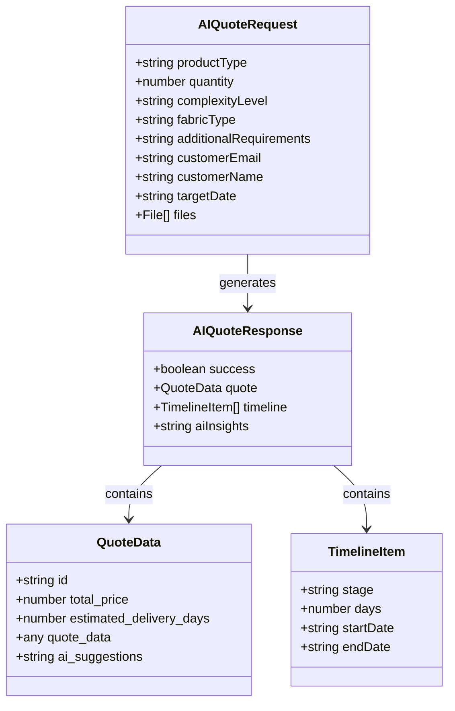
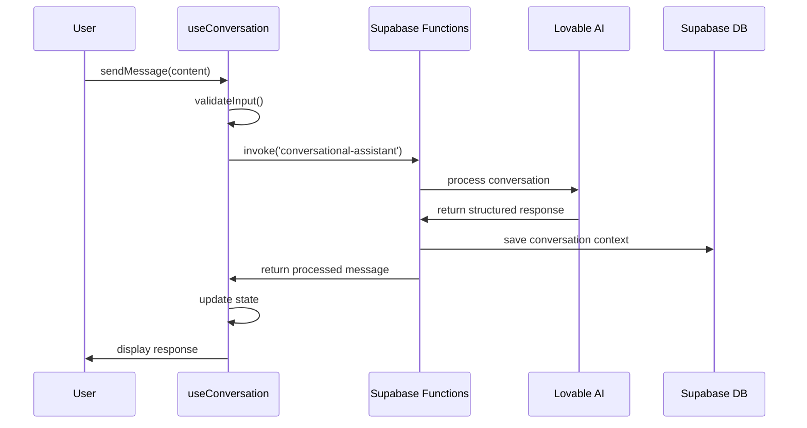
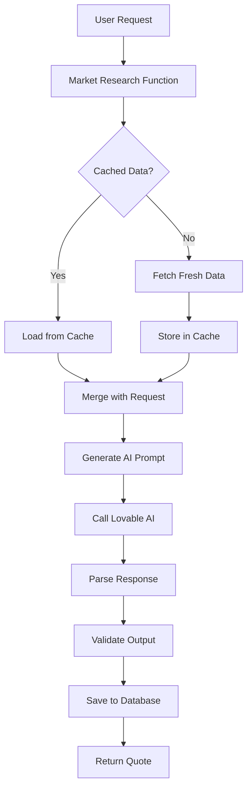
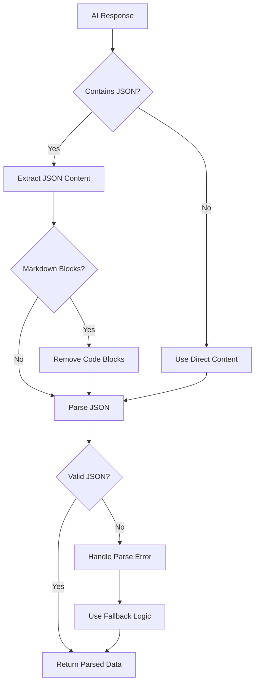
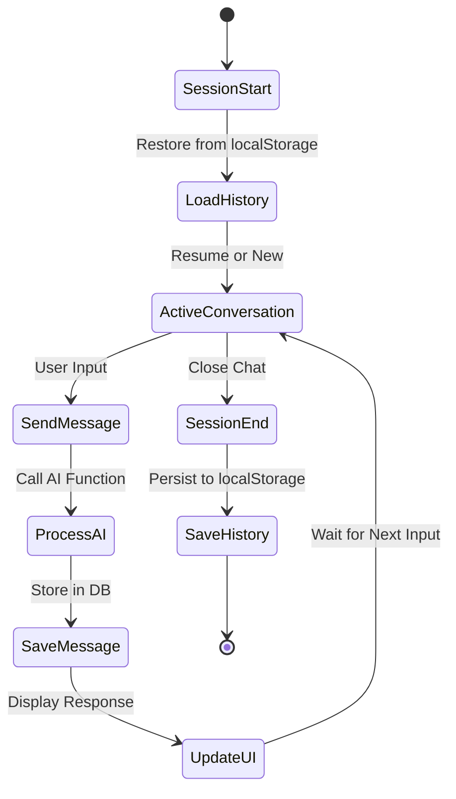
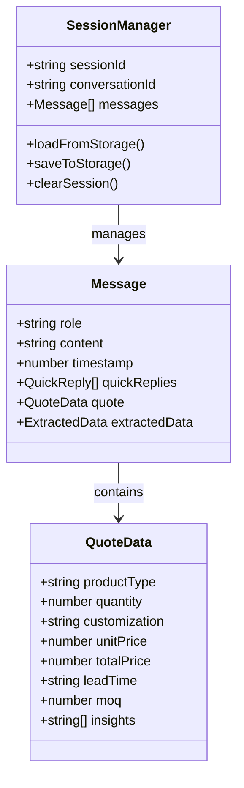
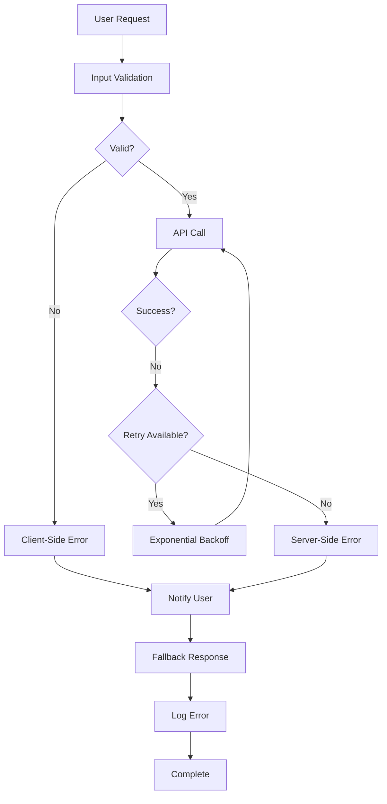
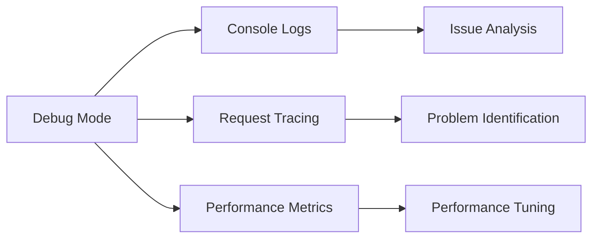

# AI Conversational Quote System Documentation

<cite>
**Referenced Files in This Document**
- [aiQuote.ts](file://src/lib/api/aiQuote.ts)
- [useConversation.ts](file://src/hooks/useConversation.ts)
- [AIAssistantChat.tsx](file://src/components/AIAssistantChat.tsx)
- [InChatQuoteDisplay.tsx](file://src/components/InChatQuoteDisplay.tsx)
- [index.ts](file://supabase/functions/ai-conversational-quote/index.ts)
- [conversational-assistant/index.ts](file://supabase/functions/conversational-assistant/index.ts)
- [NaturalLanguageQuoteInput.tsx](file://src/components/quote/NaturalLanguageQuoteInput.tsx)
- [ConversationalQuoteBuilder.tsx](file://src/components/quote/ConversationalQuoteBuilder.tsx)
- [parse-quote-description/index.ts](file://supabase/functions/parse-quote-description/index.ts)
</cite>

## Table of Contents
1. [Introduction](#introduction)
2. [System Architecture](#system-architecture)
3. [Core Components](#core-components)
4. [AI Prompt Engineering](#ai-prompt-engineering)
5. [Response Parsing Logic](#response-parsing-logic)
6. [Integration with Conversational Assistant](#integration-with-conversational-assistant)
7. [Session Management](#session-management)
8. [Error Recovery Mechanisms](#error-recovery-mechanisms)
9. [Examples and Use Cases](#examples-and-use-cases)
10. [Performance Considerations](#performance-considerations)
11. [Troubleshooting Guide](#troubleshooting-guide)

## Introduction

The AI Conversational Quote system is a sophisticated natural language processing solution that transforms conversational product descriptions into structured manufacturing quotes. Built on a hybrid architecture combining React frontend components with serverless AI functions, it provides an intuitive interface for customers to receive instant, accurate quotes for custom apparel manufacturing.

The system leverages advanced AI capabilities through the Lovable AI platform (Google Gemini 2.5 Pro) to understand natural language inputs, extract product specifications, and generate comprehensive quotes with pricing, timelines, and manufacturer insights. It integrates seamlessly with the broader Sleek Apparels ecosystem while maintaining conversational intelligence and human-like interaction patterns.

## System Architecture

The AI Conversational Quote system follows a layered architecture that separates concerns between user interface, business logic, and AI processing:



**Diagram sources**
- [aiQuote.ts](file://src/lib/api/aiQuote.ts#L1-L203)
- [useConversation.ts](file://src/hooks/useConversation.ts#L1-L177)
- [index.ts](file://supabase/functions/ai-conversational-quote/index.ts#L1-L325)

**Section sources**
- [aiQuote.ts](file://src/lib/api/aiQuote.ts#L1-L50)
- [useConversation.ts](file://src/hooks/useConversation.ts#L1-L40)

## Core Components

### AI Quote API Interface

The system exposes a comprehensive API interface for quote generation and management:



**Diagram sources**
- [aiQuote.ts](file://src/lib/api/aiQuote.ts#L9-L41)

### Conversational Assistant Integration

The conversational assistant system provides intelligent dialogue management with state tracking and contextual awareness:



**Diagram sources**
- [useConversation.ts](file://src/hooks/useConversation.ts#L64-L150)
- [conversational-assistant/index.ts](file://supabase/functions/conversational-assistant/index.ts#L28-L120)

**Section sources**
- [useConversation.ts](file://src/hooks/useConversation.ts#L32-L177)
- [aiQuote.ts](file://src/lib/api/aiQuote.ts#L46-L82)

## AI Prompt Engineering

### Market Research Integration

The AI quote generation system incorporates comprehensive market research data to ensure accurate pricing and competitive positioning:



**Diagram sources**
- [index.ts](file://supabase/functions/ai-conversational-quote/index.ts#L89-L132)

### Structured Prompt Template

The AI prompt engineering follows a strict template to ensure consistent, reliable output:

| Component | Purpose | Implementation |
|-----------|---------|----------------|
| **Market Research Data** | Provides context for pricing decisions | JSON-serialized research findings with confidence scores |
| **Customer Request** | Specifies product requirements | Extracted from user input with validation |
| **Output Structure** | Ensures predictable JSON format | Strict schema with required fields |
| **Constraints** | Maintains data quality | Validation rules and error handling |

**Section sources**
- [index.ts](file://supabase/functions/ai-conversational-quote/index.ts#L142-L220)

## Response Parsing Logic

### Markdown Code Block Handling

The system implements robust parsing logic to handle various AI response formats:



**Diagram sources**
- [index.ts](file://supabase/functions/ai-conversational-quote/index.ts#L214-L223)
- [parse-quote-description/index.ts](file://supabase/functions/parse-quote-description/index.ts#L95-L105)

### Error Recovery Mechanisms

The parsing system includes multiple layers of error recovery:

| Error Type | Detection Method | Recovery Strategy |
|------------|------------------|-------------------|
| **Malformed JSON** | JSON.parse() exception | Extract from markdown blocks |
| **Empty Response** | Content length check | Return default error object |
| **AI Timeout** | Network timeout detection | Retry with exponential backoff |
| **Invalid Schema** | Field validation failure | Use partial data with warnings |

**Section sources**
- [index.ts](file://supabase/functions/ai-conversational-quote/index.ts#L214-L223)
- [parse-quote-description/index.ts](file://supabase/functions/parse-quote-description/index.ts#L95-L105)

## Integration with Conversational Assistant

### Message History Preservation

The conversational assistant maintains persistent message history across sessions:



**Diagram sources**
- [useConversation.ts](file://src/hooks/useConversation.ts#L40-L62)

### State Machine Implementation

The conversational assistant follows a strict state machine for coherent dialogue flow:

| State | Trigger | Expected Response | Next State |
|-------|---------|-------------------|------------|
| **Greeting** | Initial message | "Hi! What's your name?" | Name Collection |
| **Name Collection** | User name provided | "What brings you here?" | Intent Understanding |
| **Intent Understanding** | Product type identified | "How many pieces?" | Quantity Collection |
| **Quantity Collection** | Quantity provided | "Customization level?" | Customization Collection |
| **Customization Collection** | Customization details | "Email for quotes?" | Email Collection |
| **Email Collection** | Email provided | "Generate quote or talk to team?" | Decision Point |

**Section sources**
- [useConversation.ts](file://src/hooks/useConversation.ts#L32-L177)
- [conversational-assistant/index.ts](file://supabase/functions/conversational-assistant/index.ts#L391-L405)

## Session Management

### Local Storage Integration

The system implements comprehensive session management for seamless user experience:



**Diagram sources**
- [useConversation.ts](file://src/hooks/useConversation.ts#L32-L62)

### Rate Limiting and Security

The system implements multiple layers of rate limiting and security controls:

| Protection Layer | Implementation | Purpose |
|------------------|----------------|---------|
| **IP-Based Rate Limiting** | 5 requests/hour per IP | Prevent abuse |
| **Email-Based Rate Limiting** | 10 requests/day per email | Reduce spam |
| **Session Validation** | UUID-based session IDs | Track user activity |
| **Input Sanitization** | DOMPurify for HTML content | XSS prevention |

**Section sources**
- [index.ts](file://supabase/functions/ai-conversational-quote/index.ts#L36-L86)
- [useConversation.ts](file://src/hooks/useConversation.ts#L40-L62)

## Error Recovery Mechanisms

### Multi-Level Error Handling

The system implements comprehensive error recovery across all layers:



**Diagram sources**
- [useConversation.ts](file://src/hooks/useConversation.ts#L124-L147)
- [index.ts](file://supabase/functions/ai-conversational-quote/index.ts#L311-L323)

### Graceful Degradation

When AI services are unavailable, the system provides graceful degradation:

| Service Failure | Degradation Strategy | User Experience |
|-----------------|---------------------|-----------------|
| **AI Parsing Failure** | Use manual form input | Guided form entry |
| **Market Research Unavailable** | Use static pricing data | Estimated quotes |
| **AI Assistant Timeout** | Return cached responses | Previous conversation state |
| **Database Connection Loss** | Local storage persistence | Offline capability |

**Section sources**
- [useConversation.ts](file://src/hooks/useConversation.ts#L124-L147)
- [NaturalLanguageQuoteInput.tsx](file://src/components/quote/NaturalLanguageQuoteInput.tsx#L37-L75)

## Examples and Use Cases

### Natural Language Inputs and Outputs

The system handles diverse natural language inputs and produces structured outputs:

| **Input** | **Extracted Data** | **Generated Quote** |
|-----------|-------------------|-------------------|
| "I need 200 t-shirts with logo for my startup" | Product: T-shirt, Quantity: 200, Customization: Logo | $5.25/unit, 15 days, $1,050 total |
| "Looking for custom hoodies with embroidery in bulk" | Product: Hoodie, Quantity: 500+, Customization: Embroidery | $12.50/unit, 21 days, $6,250 total |
| "Organic cotton pants for wholesale distribution" | Product: Pants, Quantity: 1000+, Fabric: Organic Cotton | $8.75/unit, 18 days, $8,750 total |

### Conversational Flow Examples

#### Scenario 1: New User Inquiry
```
User: "Hi, I want to make custom t-shirts"
AI: "Great! What's your name?"
User: "Sarah"
AI: "Hi Sarah! What kind of t-shirts are you interested in?"
User: "Plain white ones"
AI: "How many pieces are you thinking? Most start with 100-500."
User: "Around 300"
AI: "What kind of customization - just your logo, or full custom design?"
User: "Just logo printing"
AI: "Perfect! What's your email so I can send you some examples?"
```

#### Scenario 2: Returning Customer
```
User: "What's the status of my order?"
AI: "Let me check! I see your quote for 500 t-shirts at $2,500 is pending review. Our team will respond within 24h. Want me to expedite this?"
User: "Yes, please"
AI: "I've contacted our team. They'll reach out shortly with updates."
```

**Section sources**
- [conversational-assistant/index.ts](file://supabase/functions/conversational-assistant/index.ts#L190-L228)
- [NaturalLanguageQuoteInput.tsx](file://src/components/quote/NaturalLanguageQuoteInput.tsx#L22-L75)

## Performance Considerations

### Optimization Strategies

The system implements several performance optimization strategies:

| Optimization | Implementation | Benefit |
|--------------|----------------|---------|
| **Caching** | Market research data caching | Reduced API calls |
| **Lazy Loading** | Progressive quote generation | Faster initial load |
| **Compression** | Response compression | Reduced bandwidth |
| **CDN Integration** | Static asset delivery | Improved load times |

### Scalability Features

The system is designed for horizontal scalability:

- **Stateless Functions** - Each function call is independent
- **Database Normalization** - Efficient data storage and retrieval
- **Rate Limiting** - Automatic throttling prevents overload
- **Circuit Breakers** - Fail-safe mechanisms for external services

**Section sources**
- [index.ts](file://supabase/functions/ai-conversational-quote/index.ts#L89-L132)
- [useConversation.ts](file://src/hooks/useConversation.ts#L40-L62)

## Troubleshooting Guide

### Common Issues and Solutions

| Issue | Symptoms | Solution |
|-------|----------|----------|
| **AI Response Parsing Failure** | JSON parse errors in console | Check markdown formatting, validate JSON schema |
| **Rate Limit Exceeded** | 429 HTTP errors | Implement exponential backoff, reduce request frequency |
| **Conversation Persistence Lost** | Messages disappear on refresh | Verify localStorage permissions, check session storage |
| **Slow Response Times** | Long loading periods | Monitor AI service availability, implement timeouts |

### Debugging Tools

The system provides comprehensive debugging capabilities:



### Monitoring and Alerting

Key metrics to monitor for system health:

- **AI Response Success Rate** - Percentage of successful AI calls
- **Average Response Time** - Mean time for quote generation
- **Error Rate** - Frequency of failures across components
- **User Engagement** - Conversion rates from chat to quotes

**Section sources**
- [index.ts](file://supabase/functions/ai-conversational-quote/index.ts#L311-L323)
- [useConversation.ts](file://src/hooks/useConversation.ts#L124-L147)