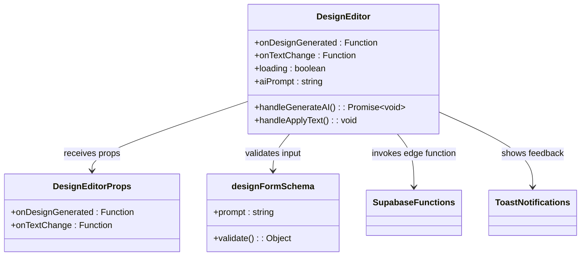

# AI Design Generator API Documentation

<cite>
**Referenced Files in This Document**
- [supabase/functions/ai-design-generator/index.ts](file://supabase/functions/ai-design-generator/index.ts)
- [src/components/design-studio/DesignEditor.tsx](file://src/components/design-studio/DesignEditor.tsx)
- [src/pages/DesignStudio.tsx](file://src/pages/DesignStudio.tsx)
- [src/hooks/use-toast.ts](file://src/hooks/use-toast.ts)
- [src/components/ui/toast.tsx](file://src/components/ui/toast.tsx)
- [src/integrations/supabase/client.ts](file://src/integrations/supabase/client.ts)
</cite>

## Table of Contents
1. [Introduction](#introduction)
2. [API Endpoint Overview](#api-endpoint-overview)
3. [Request Structure](#request-structure)
4. [Response Format](#response-format)
5. [Integration with DesignEditor Component](#integration-with-designeditor-component)
6. [Error Handling](#error-handling)
7. [Client-Side Processing](#client-side-processing)
8. [Validation and Security](#validation-and-security)
9. [Usage Examples](#usage-examples)
10. [Best Practices](#best-practices)

## Introduction

The AI Design Generator is a Supabase Edge Function that creates visual designs for apparel products using AI-powered image generation. It accepts text prompts and various styling parameters to generate high-quality, print-ready designs suitable for screen printing or DTG printing on clothing.

The function integrates seamlessly with the DesignEditor component, providing real-time feedback through toast notifications and loading states during the design generation process.

## API Endpoint Overview

### Endpoint Information

**Function Name:** `ai-design-generator`  
**Endpoint Type:** Supabase Edge Function  
**Integration Method:** `supabase.functions.invoke()`  
**AI Service Provider:** Lovable AI Gateway  
**Model Used:** `google/gemini-2.5-flash-image-preview`

### CORS Configuration

The function supports cross-origin requests with the following headers:
- `Access-Control-Allow-Origin: *`
- `Access-Control-Allow-Headers: authorization, x-client-info, apikey, content-type`

**Section sources**
- [supabase/functions/ai-design-generator/index.ts](file://supabase/functions/ai-design-generator/index.ts#L3-L6)

## Request Structure

### Required Parameters

| Parameter | Type | Description | Constraints |
|-----------|------|-------------|-------------|
| `prompt` | string | Text description of the desired design | Minimum 10 characters, maximum 500 characters |
| `stylePreferences` | string[] | Array of design style preferences | Default: `['modern', 'clean', 'print-on-demand']` |
| `colorPalette` | string[] | Array of color codes to use in design | Default: `['#000000', '#FFFFFF']` |
| `complexity` | string | Complexity level of the design | Options: `'low'`, `'medium'`, `'high'` |

### Enhanced Prompt Construction

The function builds an enhanced prompt by combining the user's input with style and color hints:

```typescript
const enhancedPrompt = `Create a high-quality, print-ready design for apparel/garment printing. ${prompt}${styleHint}${colorHint} The design should be clean, professional, and suitable for screen printing or DTG printing on clothing. Ultra high resolution, commercial quality.`;
```

**Section sources**
- [supabase/functions/ai-design-generator/index.ts](file://supabase/functions/ai-design-generator/index.ts#L32-L40)

## Response Format

### Successful Response Structure

```typescript
{
  pattern: {
    imageUrl: string;           // URL of the generated design image
    prompt: string;             // Original prompt used for generation
    stylePreferences: string[]; // Applied style preferences
    colorPalette: string[];     // Applied color palette
    complexity: string;         // Complexity level used
  }
}
```

### Example Response

```json
{
  "pattern": {
    "imageUrl": "https://example.com/generated-design-12345.png",
    "prompt": "A cool mountain landscape with sunset colors",
    "stylePreferences": ["modern", "clean", "print-on-demand"],
    "colorPalette": ["#000000", "#FFFFFF"],
    "complexity": "medium"
  }
}
```

**Section sources**
- [supabase/functions/ai-design-generator/index.ts](file://supabase/functions/ai-design-generator/index.ts#L101-L108)

## Integration with DesignEditor Component

### Component Architecture

The DesignEditor component serves as the primary interface for interacting with the AI Design Generator:



**Diagram sources**
- [src/components/design-studio/DesignEditor.tsx](file://src/components/design-studio/DesignEditor.tsx#L18-L21)
- [src/components/design-studio/DesignEditor.tsx](file://src/components/design-studio/DesignEditor.tsx#L14-L16)

### Loading States

The component manages loading states during the design generation process:

```typescript
const handleGenerateAI = async () => {
  setLoading(true);
  // ... API call
  finally {
    setLoading(false);
  }
};
```

### User Input Capture

The component captures user input through controlled form elements:
- Textarea for design descriptions
- Color pickers for base colors
- Font size and text color controls

**Section sources**
- [src/components/design-studio/DesignEditor.tsx](file://src/components/design-studio/DesignEditor.tsx#L25-L30)
- [src/components/design-studio/DesignEditor.tsx](file://src/components/design-studio/DesignEditor.tsx#L31-L94)

## Error Handling

### Server-Side Error Handling

The AI Design Generator implements comprehensive error handling:

#### Validation Errors (400)
```typescript
if (!prompt || typeof prompt !== 'string' || prompt.trim().length < 10) {
  return new Response(
    JSON.stringify({ error: 'Invalid prompt. Must be at least 10 characters.' }),
    { status: 400, headers: { 'Content-Type': 'application/json', ...corsHeaders } }
  );
}
```

#### Authentication/Configuration Errors (500)
```typescript
const LOVABLE_API_KEY = Deno.env.get('LOVABLE_API_KEY');
if (!LOVABLE_API_KEY) {
  console.error('LOVABLE_API_KEY not configured');
  return new Response(
    JSON.stringify({ error: 'AI service not configured' }),
    { status: 500, headers: { 'Content-Type': 'application/json', ...corsHeaders } }
  );
}
```

#### Rate Limiting (429)
```typescript
if (response.status === 429) {
  return new Response(
    JSON.stringify({ error: 'Rate limit exceeded. Please try again in a moment.' }),
    { status: 429, headers: { 'Content-Type': 'application/json', ...corsHeaders } }
  );
}
```

#### Credit Exhaustion (402)
```typescript
if (response.status === 402) {
  return new Response(
    JSON.stringify({ error: 'AI credits depleted. Please contact support.' }),
    { status: 402, headers: { 'Content-Type': 'application/json', ...corsHeaders } }
  );
}
```

#### AI Service Failures (500)
```typescript
if (!imageUrl) {
  console.error('No image URL in response:', JSON.stringify(data));
  return new Response(
    JSON.stringify({ error: 'Failed to generate image' }),
    { status: 500, headers: { 'Content-Type': 'application/json', ...corsHeaders } }
  );
}
```

### Client-Side Error Handling

The DesignEditor component handles errors through toast notifications:

```typescript
try {
  const { data, error } = await supabase.functions.invoke('ai-design-generator', {
    // ... request body
  });
  
  if (error) {
    throw new Error(error.message || 'Failed to generate design. Please try again or contact support.');
  }
  
  if (!data?.pattern?.imageUrl) {
    throw new Error('No image URL received from AI generator. The service might be temporarily unavailable.');
  }
  
} catch (error) {
  // Toast notification handled here
}
```

**Section sources**
- [supabase/functions/ai-design-generator/index.ts](file://supabase/functions/ai-design-generator/index.ts#L16-L29)
- [supabase/functions/ai-design-generator/index.ts](file://supabase/functions/ai-design-generator/index.ts#L68-L84)
- [src/components/design-studio/DesignEditor.tsx](file://src/components/design-studio/DesignEditor.tsx#L55-L62)

## Client-Side Processing

### Input Validation

The DesignEditor uses Zod schema validation for input sanitization:

```typescript
const designFormSchema = z.object({
  prompt: z.string().trim().min(10, "Description too short").max(500, "Description too long"),
});
```

### Callback Processing

Upon successful design generation, the component processes the response through the `onDesignGenerated` callback:

```typescript
onDesignGenerated({
  imageUrl: data.pattern.imageUrl,
  type: 'ai'
});
```

### State Management

The component maintains several state variables:
- `loading`: Tracks the generation status
- `aiPrompt`: Stores the user's design description
- `designImage`: Holds the generated design URL
- `textOverlay`: Manages text overlay information

**Section sources**
- [src/components/design-studio/DesignEditor.tsx](file://src/components/design-studio/DesignEditor.tsx#L14-L16)
- [src/components/design-studio/DesignEditor.tsx](file://src/components/design-studio/DesignEditor.tsx#L64-L67)
- [src/components/design-studio/DesignEditor.tsx](file://src/components/design-studio/DesignEditor.tsx#L25-L30)

## Validation and Security

### Input Sanitization

The function implements multiple layers of input validation:

1. **Length Validation**: Minimum 10 character requirement
2. **Type Checking**: Ensures prompt is a string
3. **Environment Validation**: Verifies API key configuration
4. **Response Validation**: Checks for valid image URLs

### Security Measures

1. **CORS Headers**: Configured for secure cross-origin requests
2. **API Key Protection**: Stored in environment variables
3. **Rate Limiting**: Built into the AI gateway service
4. **Error Masking**: Generic error messages prevent information leakage

**Section sources**
- [src/components/design-studio/DesignEditor.tsx](file://src/components/design-studio/DesignEditor.tsx#L15)
- [supabase/functions/ai-design-generator/index.ts](file://supabase/functions/ai-design-generator/index.ts#L16-L29)

## Usage Examples

### Basic Design Generation

```typescript
const { data, error } = await supabase.functions.invoke('ai-design-generator', {
  body: {
    prompt: "A minimalist geometric pattern with triangles",
    stylePreferences: ['minimalist', 'geometric'],
    colorPalette: ['#FF6B6B', '#4ECDC4', '#45B7D1'],
    complexity: 'medium'
  }
});
```

### Fashion Brand Logo Design

```typescript
const { data, error } = await supabase.functions.invoke('ai-design-generator', {
  body: {
    prompt: "Create a luxury fashion brand logo with elegant typography and gold accents",
    stylePreferences: ['luxury', 'elegant', 'minimalist'],
    colorPalette: ['#000000', '#FAD7A0', '#FFFFFF'],
    complexity: 'high'
  }
});
```

### Sports Team Design

```typescript
const { data, error } = await supabase.functions.invoke('ai-design-generator', {
  body: {
    prompt: "Design a sports team jersey with dynamic motion elements and team colors",
    stylePreferences: ['dynamic', 'sports', 'bold'],
    colorPalette: ['#1E88E5', '#FFC107', '#FFFFFF'],
    complexity: 'medium'
  }
});
```

### Effective Prompts and Outcomes

| Prompt | Expected Outcome | Complexity |
|--------|------------------|------------|
| "A cool mountain landscape with sunset colors" | Nature-inspired design with gradient sunset effect | Medium |
| "Abstract geometric pattern with triangles" | Clean geometric composition with sharp angles | Medium |
| "Minimalist monochrome logo with clean typography" | Simple, elegant logo design | Low |
| "Bold pop art style with vibrant colors and retro elements" | Vibrant, eye-catching pop culture design | High |
| "Subtle watercolor floral pattern in pastel tones" | Soft, artistic floral design | Medium |

## Best Practices

### Prompt Engineering

1. **Be Specific**: Provide detailed descriptions of desired elements
2. **Include Context**: Mention intended use (t-shirt, hoodie, etc.)
3. **Specify Style**: Indicate preferred aesthetic (modern, vintage, minimalist)
4. **Reference Examples**: Mention similar designs you like

### Design Parameters

1. **Color Palette**: Start with 2-3 complementary colors
2. **Style Preferences**: Choose 2-4 relevant styles
3. **Complexity Level**: Match to your design goals
4. **Resolution**: The AI generates ultra-high resolution images

### Error Prevention

1. **Minimum Length**: Ensure prompts are at least 10 characters
2. **Clear Descriptions**: Avoid vague or ambiguous language
3. **Valid Colors**: Use proper hex color codes
4. **Rate Limits**: Implement retry logic for rate-limited requests

### Performance Optimization

1. **Debounce Inputs**: Prevent excessive API calls
2. **Cache Results**: Store frequently used designs
3. **Progressive Loading**: Show loading states appropriately
4. **Error Recovery**: Provide helpful error messages

**Section sources**
- [src/components/design-studio/DesignEditor.tsx](file://src/components/design-studio/DesignEditor.tsx#L139-L142)
- [supabase/functions/ai-design-generator/index.ts](file://supabase/functions/ai-design-generator/index.ts#L32-L40)