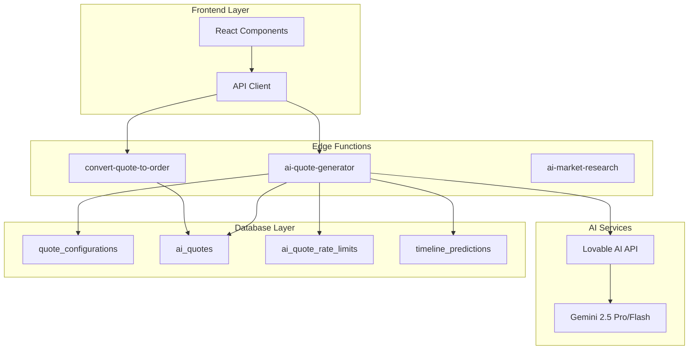
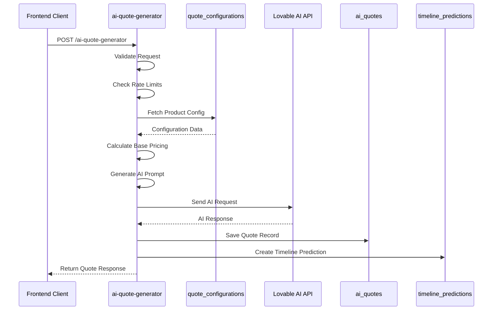
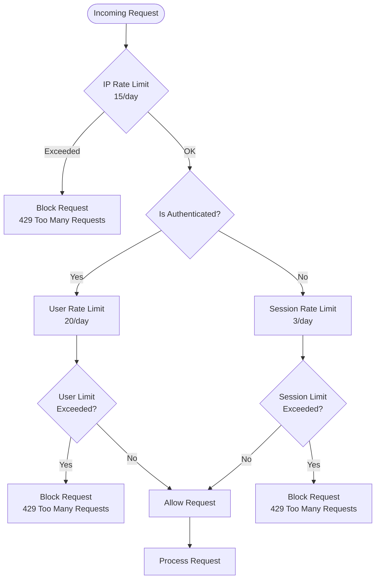
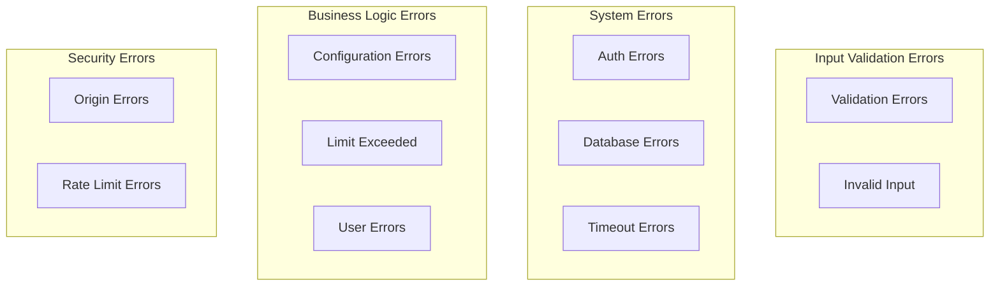
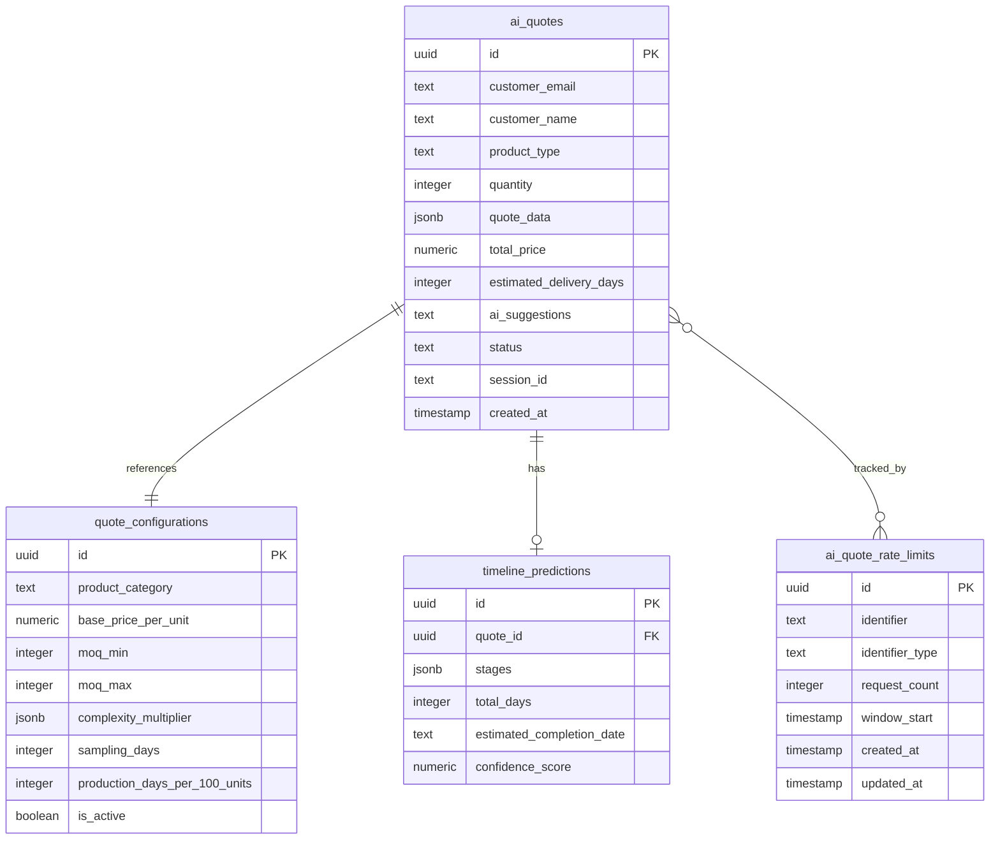
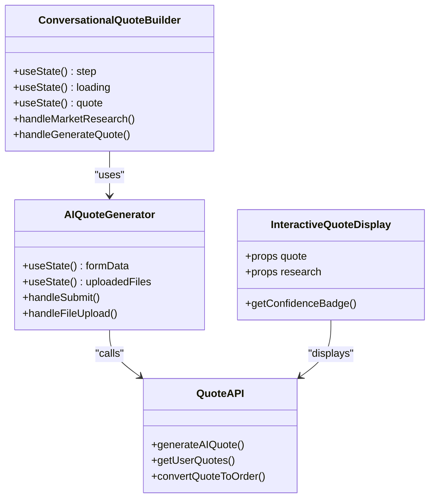
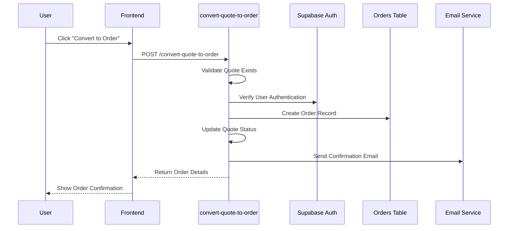

# AI Quote Generator API Documentation

<cite>
**Referenced Files in This Document**
- [index.ts](file://supabase/functions/ai-quote-generator/index.ts)
- [ConversationalQuoteBuilder.tsx](file://src/components/quote/ConversationalQuoteBuilder.tsx)
- [AIQuoteGenerator.tsx](file://src/components/AIQuoteGenerator.tsx)
- [aiQuote.ts](file://src/lib/api/aiQuote.ts)
- [convert-quote-to-order/index.ts](file://supabase/functions/convert-quote-to-order/index.ts)
- [InteractiveQuoteDisplay.tsx](file://src/components/quote/InteractiveQuoteDisplay.tsx)
- [QuoteGenerator.tsx](file://src/pages/QuoteGenerator.tsx)
- [quote_configurations table](file://supabase/migrations/20251121004548_412ae5d9-7426-4e57-a6d0-4e35e860ef95.sql)
- [ai_quotes table](file://supabase/migrations/20251124164837_4eda3cf0-ab6f-4305-a5fe-82a19c7948d3.sql)
</cite>

## Table of Contents
1. [Introduction](#introduction)
2. [System Architecture](#system-architecture)
3. [API Endpoint Specification](#api-endpoint-specification)
4. [Request and Response Structure](#request-and-response-structure)
5. [Implementation Flow](#implementation-flow)
6. [Authentication and Security](#authentication-and-security)
7. [Rate Limiting](#rate-limiting)
8. [Error Handling](#error-handling)
9. [Database Integration](#database-integration)
10. [AI Integration](#ai-integration)
11. [Frontend Implementation](#frontend-implementation)
12. [Quote-to-Order Conversion](#quote-to-order-conversion)
13. [Troubleshooting Guide](#troubleshooting-guide)

## Introduction

The AI Quote Generator is a serverless function that provides instant, market-researched manufacturing quotes for apparel products. Built on Supabase Edge Functions, it integrates with Lovable AI to deliver professional manufacturing insights backed by real-time market data from verified sources.

The system accepts product specifications and returns structured quotes containing unit prices, total costs, estimated delivery timelines, confidence scores, detailed price breakdowns, and actionable AI recommendations for optimizing manufacturing processes.

## System Architecture

The AI Quote Generator follows a microservices architecture with clear separation of concerns:



**Diagram sources**
- [index.ts](file://supabase/functions/ai-quote-generator/index.ts#L1-L50)
- [convert-quote-to-order/index.ts](file://supabase/functions/convert-quote-to-order/index.ts#L1-L30)

## API Endpoint Specification

### POST /functions/v1/ai-quote-generator

**Endpoint URL**: `https://your-supabase-url/functions/v1/ai-quote-generator`

**Authentication**: Supabase JWT Token (Authorization header)

**Content-Type**: `application/json`

**Timeout**: 15 seconds

**Rate Limits**: 
- IP-based: 15 requests per day
- Session-based: 3 requests per day (anonymous)
- User-based: 20 requests per day (authenticated)

### Headers

| Header | Required | Description |
|--------|----------|-------------|
| `Authorization` | Yes | Bearer token for Supabase authentication |
| `Content-Type` | Yes | Must be `application/json` |
| `Origin` | Conditional | Required in production for CORS validation |

**Section sources**
- [index.ts](file://supabase/functions/ai-quote-generator/index.ts#L131-L202)

## Request Structure

The API accepts a comprehensive JSON payload with product specifications:

```typescript
interface QuoteRequest {
  productType: string;           // Required: Product category (e.g., "T-shirts", "Hoodies")
  quantity: number;              // Required: Order quantity (50-100,000 units)
  complexityLevel?: 'simple' | 'medium' | 'complex';  // Optional: Complexity level
  fabricType?: string;           // Optional: Fabric specification
  additionalRequirements?: string;   // Optional: Custom requirements
  customerEmail: string;         // Required: Valid email address
  customerName?: string;         // Optional: Customer name
  targetDate?: string;           // Optional: Target delivery date
  sessionId?: string;            // Optional: Session identifier
  files?: Array<{             // Optional: File attachments
    name: string;
    type: string;
    data: string;              // Base64 encoded content
  }>;
}
```

### Validation Rules

| Field | Validation | Constraints |
|-------|------------|-------------|
| `productType` | Required | Min 1 character, Max 100 characters |
| `quantity` | Required | Integer, Min 50, Max 100,000 |
| `complexityLevel` | Optional | Enum: 'simple', 'medium', 'complex' |
| `fabricType` | Optional | Max 100 characters |
| `additionalRequirements` | Optional | Max 2000 characters |
| `customerEmail` | Required | Valid email format, Max 255 characters |
| `customerName` | Optional | Max 100 characters |
| `targetDate` | Optional | Valid date string |

**Section sources**
- [index.ts](file://supabase/functions/ai-quote-generator/index.ts#L9-L25)

## Response Structure

The API returns a structured JSON response with comprehensive quote information:

```typescript
interface QuoteResponse {
  success: boolean;
  quote: {
    id: string;                    // Unique quote identifier
    total_price: number;           // Total order cost
    estimated_delivery_days: number; // Estimated delivery timeline
    quote_data: {
      breakdown: {
        baseUnitPrice: number;     // Base price per unit
        complexityFactor: number;  // Complexity multiplier
        volumeDiscount: number;    // Volume discount factor
        finalUnitPrice: number;    // Final unit price
        totalPrice: number;        // Total calculated price
      };
      timeline: {
        samplingDays: number;      // Sampling phase days
        productionDays: number;    // Production phase days
        bufferDays: number;        // Buffer/QC days
        totalDays: number;         // Total timeline
        estimatedDeliveryDate: string; // ISO formatted date
      };
      moqRange: {
        min: number;               // Minimum order quantity
        max: number;               // Maximum order quantity
        requested: number;         // Requested quantity
      };
    };
    ai_suggestions: string;        // AI-generated recommendations
  };
  timeline: Array<{
    stage: string;                 // Production stage name
    days: number;                  // Duration in days
    startDate: string;             // ISO date
    endDate: string;               // ISO date
  }>;
  aiInsights: string;              // AI analysis and recommendations
  requestId: string;               // Unique request identifier
}
```

### Response Fields Explanation

| Field | Description | Example |
|-------|-------------|---------|
| `success` | Operation status indicator | `true` |
| `quote.id` | Generated quote identifier | `"uuid-string"` |
| `quote.total_price` | Total order cost in USD | `15000.00` |
| `quote.estimated_delivery_days` | Total delivery timeline | `45` |
| `quote.quote_data.breakdown.finalUnitPrice` | Per-unit cost | `30.00` |
| `quote.quote_data.timeline.totalDays` | Complete timeline | `45` |
| `quote.ai_suggestions` | AI-generated optimization advice | "Consider bulk ordering for better pricing..." |
| `timeline` | Detailed production stages | Array of stage objects |
| `aiInsights` | Comprehensive AI analysis | Structured recommendations |

**Section sources**
- [index.ts](file://supabase/functions/ai-quote-generator/index.ts#L627-L717)

## Implementation Flow

The quote generation process follows a sophisticated multi-stage workflow:



**Diagram sources**
- [index.ts](file://supabase/functions/ai-quote-generator/index.ts#L253-L727)

### Stage 1: Request Validation and Rate Limiting

The function begins by validating incoming requests against strict schemas and enforcing rate limits:

1. **Input Validation**: Zod schema validation ensures data integrity
2. **Rate Limiting**: Multi-tiered rate limiting prevents abuse
3. **Authentication**: Supabase JWT verification confirms user identity

### Stage 2: Product Configuration Lookup

The system attempts to find appropriate manufacturing configurations:

1. **Category Normalization**: Product types are normalized for matching
2. **Primary Lookup**: Exact category match in `quote_configurations`
3. **Fallback Strategies**: Singular forms and generic categories
4. **Error Handling**: Graceful degradation when configurations unavailable

### Stage 3: Pricing Calculation

Dynamic pricing is calculated using multiple factors:

1. **Base Pricing**: From configuration database
2. **Complexity Multiplier**: Adjusted based on complexity level
3. **Volume Discounts**: Progressive discounts for larger quantities
4. **Timeline Estimation**: Production and sampling calculations

### Stage 4: AI Integration

Advanced AI analysis enhances quote accuracy:

1. **Prompt Engineering**: Structured prompts for optimal responses
2. **Model Selection**: Different models for text vs. image analysis
3. **Response Processing**: Markdown code block parsing for structured data
4. **Cost Tracking**: AI usage logging for billing transparency

### Stage 5: Database Persistence

All quote data is systematically stored:

1. **Quote Records**: Complete quote information in `ai_quotes`
2. **Timeline Predictions**: Production stage breakdowns
3. **Rate Limit Updates**: Increment counters for enforcement
4. **Usage Logging**: Audit trails for monitoring

**Section sources**
- [index.ts](file://supabase/functions/ai-quote-generator/index.ts#L253-L727)

## Authentication and Security

### Supabase JWT Authentication

The API requires Supabase JWT tokens for authentication:

```typescript
// Authentication check in the function
const authHeader = req.headers.get('Authorization');
let userId: string | null = null;
let isAuthenticated = false;

if (authHeader) {
  try {
    const token = authHeader.replace('Bearer ', '');
    const { data: { user } } = await supabaseClient.auth.getUser(token);
    userId = user?.id || null;
    isAuthenticated = !!userId;
  } catch (error) {
    console.log(`[${requestId}] Auth check failed, treating as anonymous`);
  }
}
```

### Origin Validation

Production environments enforce strict origin validation:

```typescript
const allowedOrigins = [
  'https://sleekapparels.com',
  'https://www.sleekapparels.com',
  'http://localhost:5173',
  'http://localhost:3000',
  'lovableproject.com',
  'lovable.app',
  'netlify.app',
  'vercel.app'
];
```

### Security Features

1. **CORS Protection**: Strict cross-origin request validation
2. **Input Sanitization**: Prevents injection attacks
3. **Rate Limiting**: Prevents abuse and DDoS attacks
4. **Environment Isolation**: Separate configurations for development/production

**Section sources**
- [index.ts](file://supabase/functions/ai-quote-generator/index.ts#L268-L282)
- [index.ts](file://supabase/functions/ai-quote-generator/index.ts#L140-L199)

## Rate Limiting

The system implements a sophisticated multi-tiered rate limiting system:

### Rate Limiting Strategy



**Diagram sources**
- [index.ts](file://supabase/functions/ai-quote-generator/index.ts#L38-L94)

### Rate Limiting Configuration

| Identifier Type | Daily Limit | Reset Time | Purpose |
|----------------|-------------|------------|---------|
| IP Address | 15 requests | Midnight UTC | Global protection |
| User ID | 20 requests | Midnight UTC | Authenticated users |
| Session ID | 3 requests | Midnight UTC | Anonymous users |

### Rate Limit Headers

Successful responses include rate limit information:

```http
X-RateLimit-Limit: 20
X-RateLimit-Remaining: 15
X-RateLimit-Reset: 2024-01-01T00:00:00Z
```

### Implementation Details

The rate limiting system uses PostgreSQL for persistence:

```typescript
// Rate limit check function
async function checkAndUpdateRateLimit(
  supabaseClient: any,
  identifier: string,
  identifierType: 'session' | 'user' | 'ip',
  dailyLimit: number
): Promise<{ allowed: boolean; remaining: number }>
```

**Section sources**
- [index.ts](file://supabase/functions/ai-quote-generator/index.ts#L38-L94)

## Error Handling

The system implements comprehensive error handling across all layers:

### Error Categories



**Diagram sources**
- [index.ts](file://supabase/functions/ai-quote-generator/index.ts#L729-L752)

### Error Response Format

All errors follow a consistent structure:

```typescript
interface ErrorResponse {
  error: string;           // Human-readable error message
  code?: string;          // Machine-readable error code
  details?: string;       // Technical details
  requestId: string;      // Unique request identifier
  retryAfter?: number;    // Recommended retry delay (seconds)
}
```

### Common Error Codes

| Code | Description | HTTP Status |
|------|-------------|-------------|
| `VALID_001` | Validation failed | 400 |
| `RATE_001` | Rate limit exceeded | 429 |
| `CONF_001` | Configuration unavailable | 404 |
| `AUTH_001` | Authentication failed | 403 |
| `AI_001` | AI API error | 500 |
| `DB_001` | Database operation failed | 500 |

### Error Recovery Strategies

1. **Graceful Degradation**: Fallback configurations when primary systems fail
2. **Circuit Breaker Pattern**: Automatic failure detection and response
3. **Logging and Monitoring**: Comprehensive error tracking for debugging
4. **User-Friendly Messages**: Non-technical error messages for clients

**Section sources**
- [index.ts](file://supabase/functions/ai-quote-generator/index.ts#L729-L752)

## Database Integration

### Database Schema Overview

The AI Quote Generator interacts with several key database tables:

#### quote_configurations Table

Stores product-specific manufacturing configurations:

| Column | Type | Description | Constraints |
|--------|------|-------------|-------------|
| `id` | UUID | Primary key | Auto-generated |
| `product_category` | TEXT | Normalized product category | Not null |
| `base_price_per_unit` | NUMERIC(10,2) | Base manufacturing cost | Not null |
| `moq_min` | INTEGER | Minimum order quantity | Not null |
| `moq_max` | INTEGER | Maximum order quantity | Not null |
| `complexity_multiplier` | JSONB | Complexity adjustment factors | Default: {"medium": 1.3, "simple": 1.0, "complex": 1.6} |
| `sampling_days` | INTEGER | Sampling phase duration | Default: 7 |
| `production_days_per_100_units` | INTEGER | Production scaling factor | Default: 5 |
| `is_active` | BOOLEAN | Configuration availability | Default: true |

#### ai_quotes Table

Stores generated quotes and associated metadata:

| Column | Type | Description | Constraints |
|--------|------|-------------|-------------|
| `id` | UUID | Primary key | Auto-generated |
| `customer_email` | TEXT | Customer email address | Nullable |
| `customer_name` | TEXT | Customer name | Nullable |
| `product_type` | TEXT | Product category | Not null |
| `quantity` | INTEGER | Order quantity | Not null |
| `quote_data` | JSONB | Complete quote structure | Not null |
| `total_price` | NUMERIC(10,2) | Calculated total price | Not null |
| `estimated_delivery_days` | INTEGER | Delivery timeline | Not null |
| `ai_suggestions` | TEXT | AI recommendations | Nullable |
| `status` | TEXT | Quote status | Default: "draft" |
| `session_id` | TEXT | Session identifier | Nullable |

### Database Operations

The system performs several key database operations:

1. **Configuration Lookup**: `SELECT * FROM quote_configurations WHERE product_category = ? AND is_active = true`
2. **Quote Insertion**: `INSERT INTO ai_quotes (...) VALUES (...) RETURNING *`
3. **Rate Limit Updates**: `UPDATE ai_quote_rate_limits SET request_count = request_count + 1 WHERE identifier = ?`
4. **Timeline Creation**: `INSERT INTO timeline_predictions (...) VALUES (...)`

### Data Relationships



**Diagram sources**
- [quote_configurations table](file://supabase/migrations/20251121004548_412ae5d9-7426-4e57-a6d0-4e35e860ef95.sql#L1479-L1493)
- [ai_quotes table](file://supabase/migrations/20251124164837_4eda3cf0-ab6f-4305-a5fe-82a19c7948d3.sql#L33-L43)

**Section sources**
- [index.ts](file://supabase/functions/ai-quote-generator/index.ts#L456-L727)

## AI Integration

### Lovable AI API Integration

The system integrates with Lovable AI for intelligent quote generation:

#### Supported Models

| Use Case | Model | Reasoning |
|----------|-------|-----------|
| Text-only Quotes | `google/gemini-2.5-flash` | Fast, cost-effective |
| Image Analysis | `google/gemini-2.5-pro` | Advanced visual understanding |

#### AI Prompt Structure

The system uses sophisticated prompt engineering for optimal results:

```typescript
// Standard prompt template
const standardPrompt = `
You are an expert garment manufacturing consultant from Bangladesh with deep knowledge of 2025 industry standards.

CUSTOMER REQUEST:
- Product Type: ${sanitizedProduct}
- Quantity: ${requestData.quantity} pieces
- Complexity Level: ${complexity}
- Fabric Type: ${sanitizedFabric}
- Additional Requirements: ${sanitizedRequirements}

CALCULATED ESTIMATE:
- Total Cost: $${totalPrice.toFixed(2)} (${(totalPrice / requestData.quantity).toFixed(2)} per unit)
- Production Timeline: ${totalDays} days

BANGLADESH MANUFACTURING CONTEXT (2025):
- MOQ Standards: 50-100 units minimum, higher volumes get better pricing
- Base Costs: T-shirts $3-6, Polos $4-7, Hoodies $8-15, Uniforms $5-10
- Customization Costs: Embroidery +$1-3, Screen Print +$0.5-2, DTG +$2-4
- Volume Discounts: 101-500 units (-10%), 501-1000 (-20%), 1001+ (-25%)

PROVIDE A PROFESSIONAL ASSESSMENT:
1. Cost Optimization (2-3 sentences): Analyze if the quantity hits optimal pricing tiers. Suggest specific adjustments.
2. Alternative Options (1 option with specifics): Provide ONE concrete alternative that could save money or time.
3. Risk Factors (2-3 key points): Identify specific risks for this order.
4. Value-Add Suggestions (1-2 points): Recommend extras that improve ROI.

Keep response professional, specific to Bangladesh manufacturing, and actionable. Use exact numbers and percentages.
`;
```

### JSON Parsing and Response Processing

The system handles AI responses with robust parsing:

```typescript
// JSON extraction from AI responses
const jsonMatch = content.match(/```json\s*([\s\S]*?)\s*```/) || 
                  content.match(/```\s*([\s\S]*?)\s*```/);
const jsonStr = jsonMatch ? jsonMatch[1] : content;
const parsed = JSON.parse(jsonStr.trim());
```

### Error Handling for AI Responses

1. **Parsing Failures**: Graceful fallback when AI returns malformed JSON
2. **API Errors**: Retry logic and fallback responses
3. **Timeout Handling**: 15-second timeout with graceful degradation
4. **Cost Tracking**: AI usage logging for billing transparency

**Section sources**
- [index.ts](file://supabase/functions/ai-quote-generator/index.ts#L586-L624)

## Frontend Implementation

### React Component Architecture

The frontend implements a sophisticated quote generation workflow:



**Diagram sources**
- [ConversationalQuoteBuilder.tsx](file://src/components/quote/ConversationalQuoteBuilder.tsx#L43-L363)
- [AIQuoteGenerator.tsx](file://src/components/AIQuoteGenerator.tsx#L64-L200)
- [InteractiveQuoteDisplay.tsx](file://src/components/quote/InteractiveQuoteDisplay.tsx#L45-L200)

### API Client Implementation

The frontend uses a typed API client for quote generation:

```typescript
// Enhanced API client with context
export const generateAIQuote = async (request: AIQuoteRequest): Promise<AIQuoteResponse> => {
  const sessionId = localStorage.getItem('quote_session_id') || crypto.randomUUID();
  localStorage.setItem('quote_session_id', sessionId);
  
  const { data, error } = await supabase.functions.invoke('ai-quote-generator', {
    body: {
      ...request,
      sessionId,
      context: {
        localCalculations: getLocalPricingEstimate(request),
      }
    }
  });
  
  return data as AIQuoteResponse;
};
```

### File Upload Support

The system supports file uploads for enhanced AI analysis:

```typescript
// File upload validation and conversion
const handleFileUpload = (e: React.ChangeEvent<HTMLInputElement>) => {
  const files = Array.from(e.target.files || []);
  const validFiles = files.filter(file => {
    const isImage = file.type.startsWith('image/');
    const isPDF = file.type === 'application/pdf';
    const isUnder20MB = file.size <= 20 * 1024 * 1024;
    return (isImage || isPDF) && isUnder20MB;
  });
  
  setUploadedFiles(prev => [...prev, ...validFiles].slice(0, 3));
};
```

### Real-time Quote Display

The InteractiveQuoteDisplay component provides dynamic quote visualization:

1. **Price Breakdown**: Detailed cost analysis with confidence scoring
2. **Timeline Visualization**: Production stage timelines with dates
3. **AI Recommendations**: Structured optimization suggestions
4. **Market Comparisons**: Competitive pricing analysis

**Section sources**
- [ConversationalQuoteBuilder.tsx](file://src/components/quote/ConversationalQuoteBuilder.tsx#L112-L162)
- [AIQuoteGenerator.tsx](file://src/components/AIQuoteGenerator.tsx#L118-L195)
- [InteractiveQuoteDisplay.tsx](file://src/components/quote/InteractiveQuoteDisplay.tsx#L45-L200)

## Quote-to-Order Conversion

### Conversion Process Flow

The quote-to-order conversion transforms draft quotes into production orders:



**Diagram sources**
- [convert-quote-to-order/index.ts](file://supabase/functions/convert-quote-to-order/index.ts#L16-L223)

### Conversion API

The conversion endpoint accepts a quote ID and creates a production order:

```typescript
interface ConvertQuoteRequest {
  quoteId: string;  // Required: Quote identifier to convert
}

// API call example
const { data, error } = await supabase.functions.invoke('convert-quote-to-order', {
  body: { quoteId: quoteResult.quote.id }
});
```

### Order Creation Process

During conversion, the system:

1. **Validates Quote**: Ensures quote exists and isn't already converted
2. **Creates User Account**: Automatically creates user account if needed
3. **Generates Order Number**: Creates unique order identifier
4. **Sets Expected Delivery**: Calculates delivery timeline
5. **Creates Order Record**: Inserts into orders table with full details
6. **Updates Quote Status**: Marks quote as converted
7. **Sends Confirmation**: Email notification with tracking information

### Order Data Structure

Converted orders inherit key quote attributes:

| Field | Source | Description |
|-------|--------|-------------|
| `order_number` | Generated | Unique order identifier |
| `buyer_id` | Quote customer | User account reference |
| `product_type` | Quote data | Product category |
| `quantity` | Quote data | Order quantity |
| `status` | Default | "pending" |
| `expected_delivery_date` | Quote timeline | Calculated delivery date |
| `notes` | Quote requirements | Additional specifications |

**Section sources**
- [convert-quote-to-order/index.ts](file://supabase/functions/convert-quote-to-order/index.ts#L16-L223)
- [aiQuote.ts](file://src/lib/api/aiQuote.ts#L184-L202)

## Troubleshooting Guide

### Common Issues and Solutions

#### 1. Rate Limit Exceeded

**Symptoms**: HTTP 429 errors with rate limit information

**Causes**:
- Exceeded daily request limits
- Multiple requests from same IP/session/user
- Rapid successive requests

**Solutions**:
```typescript
// Check rate limit status
console.log('Remaining requests:', response.headers.get('X-RateLimit-Remaining'));
console.log('Reset time:', response.headers.get('X-RateLimit-Reset'));
```

#### 2. AI API Failures

**Symptoms**: "AI analysis temporarily unavailable" in responses

**Causes**:
- Lovable AI API downtime
- Insufficient API credits
- Network connectivity issues
- Timeout errors (15-second limit)

**Solutions**:
- Implement exponential backoff retry logic
- Fall back to basic pricing when AI fails
- Monitor AI usage costs
- Check API key configuration

#### 3. Database Connection Issues

**Symptoms**: "Service temporarily unavailable" errors

**Causes**:
- Supabase connection problems
- Database query timeouts
- Row-level security violations
- Missing database permissions

**Solutions**:
- Verify Supabase service role key
- Check database connection limits
- Review row-level security policies
- Monitor database performance

#### 4. Authentication Failures

**Symptoms**: "Unauthorized" or "Authentication required" errors

**Causes**:
- Expired or invalid JWT tokens
- Missing Authorization header
- User account issues
- Supabase authentication problems

**Solutions**:
- Refresh authentication tokens
- Verify JWT token validity
- Check user account status
- Review authentication configuration

### Debugging Tools

#### Request Logging

Enable comprehensive request logging:

```typescript
// Request ID for correlation
const requestId = crypto.randomUUID();
console.log(`[${requestId}] Processing request`);

// Log request details
console.log(`[${requestId}] Request received with sanitized payload:`, {
  productType: requestData.productType,
  quantity: requestData.quantity,
  complexityLevel: requestData.complexityLevel,
  customerEmail: requestData.customerEmail,
  sessionId: sessionId
});
```

#### Error Tracking

Implement structured error handling:

```typescript
try {
  // API call logic
} catch (error) {
  console.error(`[${requestId}] Error in ai-quote-generator:`, error);
  
  if (error instanceof z.ZodError) {
    return new Response(JSON.stringify({ 
      error: 'Invalid input data',
      details: error.errors.map(e => ({ field: e.path.join('.'), message: e.message }))
    }), { status: 400 });
  }
}
```

### Performance Optimization

#### Caching Strategies

1. **Rate Limit Caching**: Store rate limit counters in memory
2. **Configuration Caching**: Cache frequently accessed product configs
3. **AI Response Caching**: Cache successful AI responses for repeated requests
4. **Database Connection Pooling**: Optimize database connections

#### Monitoring Metrics

Track key performance indicators:

- Request latency (P99 < 2 seconds)
- Success rate (> 99%)
- AI API response time (< 5 seconds)
- Database query time (< 1 second)
- Rate limit compliance (0% failures)

**Section sources**
- [index.ts](file://supabase/functions/ai-quote-generator/index.ts#L729-L752)