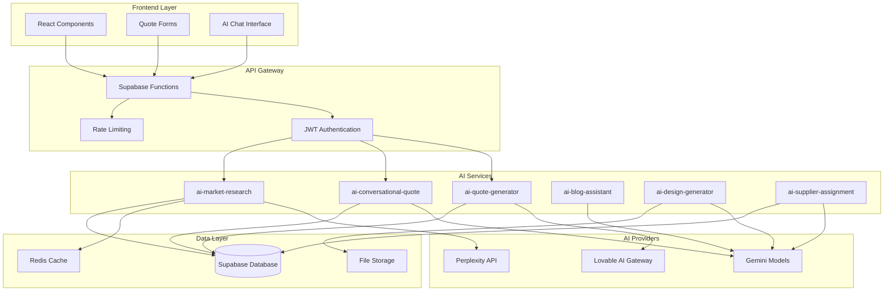

# AI Services API

<cite>
**Referenced Files in This Document**
- [aiQuote.ts](file://src/lib/api/aiQuote.ts)
- [ConversationalQuoteBuilder.tsx](file://src/components/quote/ConversationalQuoteBuilder.tsx)
- [AIQuoteGeneratorWithOTP.tsx](file://src/components/AIQuoteGeneratorWithOTP.tsx)
- [NaturalLanguageQuoteInput.tsx](file://src/components/quote/NaturalLanguageQuoteInput.tsx)
- [logger.ts](file://supabase/functions/_shared/logger.ts)
- [ai-quote-generator/index.ts](file://supabase/functions/ai-quote-generator/index.ts)
- [ai-conversational-quote/index.ts](file://supabase/functions/ai-conversational-quote/index.ts)
- [ai-market-research/index.ts](file://supabase/functions/ai-market-research/index.ts)
- [ai-blog-assistant/index.ts](file://supabase/functions/ai-blog-assistant/index.ts)
- [ai-design-generator/index.ts](file://supabase/functions/ai-design-generator/index.ts)
- [ai-supplier-assignment/index.ts](file://supabase/functions/ai-supplier-assignment/index.ts)
- [useQuotes.ts](file://src/hooks/useQuotes.ts)
</cite>

## Table of Contents
1. [Introduction](#introduction)
2. [AI Services Architecture](#ai-services-architecture)
3. [Core AI Services](#core-ai-services)
4. [Authentication & Security](#authentication--security)
5. [Rate Limiting & Monitoring](#rate-limiting--monitoring)
6. [Implementation Examples](#implementation-examples)
7. [Error Handling & Fallbacks](#error-handling--fallbacks)
8. [Integration Patterns](#integration-patterns)
9. [Performance & Optimization](#performance--optimization)
10. [Troubleshooting Guide](#troubleshooting-guide)

## Introduction

The sleekapp-v100 AI Services API provides a comprehensive suite of serverless AI-powered functions designed to enhance the apparel manufacturing quoting and supply chain management experience. Built on Supabase Edge Functions, these services leverage advanced AI models to deliver intelligent pricing, market research, design generation, and supplier matching capabilities.

The AI services are designed with enterprise-grade security, rate limiting, and monitoring to ensure reliable operation at scale. Each service follows consistent patterns for authentication, error handling, and response formatting, making integration seamless across the application ecosystem.

## AI Services Architecture

The AI services architecture follows a microservices pattern with dedicated functions for specific capabilities:



**Diagram sources**
- [ai-quote-generator/index.ts](file://supabase/functions/ai-quote-generator/index.ts#L1-L50)
- [ai-conversational-quote/index.ts](file://supabase/functions/ai-conversational-quote/index.ts#L1-L50)
- [ai-market-research/index.ts](file://supabase/functions/ai-market-research/index.ts#L1-L50)

**Section sources**
- [ai-quote-generator/index.ts](file://supabase/functions/ai-quote-generator/index.ts#L1-L100)
- [ai-conversational-quote/index.ts](file://supabase/functions/ai-conversational-quote/index.ts#L1-L100)

## Core AI Services

### ai-quote-generator

The primary quote generation service that combines intelligent pricing with market insights and manufacturing expertise.

#### HTTP Endpoint
```
POST /functions/v1/ai-quote-generator
```

#### Request Schema
```typescript
interface AIQuoteRequest {
  productType: string;           // Required - Product category
  quantity: number;              // Required - Order quantity (50-100000)
  complexityLevel?: 'simple' | 'medium' | 'complex';
  fabricType?: string;           // Optional - Fabric specification
  additionalRequirements?: string; // Optional - Custom specifications
  customerEmail: string;         // Required - Valid email address
  customerName?: string;         // Optional - Customer name
  targetDate?: string;           // Optional - Target delivery date
  sessionId?: string;            // Optional - Session identifier
  files?: Array<{             // Optional - Design files
    name: string;
    type: string;
    data: string;              // Base64 encoded file data
  }>;
}
```

#### Response Schema
```typescript
interface AIQuoteResponse {
  success: boolean;
  quote: {
    id: string;                    // Quote identifier
    total_price: number;           // Total calculated price
    estimated_delivery_days: number; // Production timeline
    quote_data: any;              // Detailed pricing breakdown
    ai_suggestions: string;        // AI-generated recommendations
  };
  timeline: Array<{
    stage: string;                // Production stage
    days: number;                 // Duration in days
    startDate: string;            // ISO date string
    endDate: string;              // ISO date string
  }>;
  aiInsights: string;             // Market and optimization insights
  requestId: string;              // Unique request identifier
}
```

#### Key Features
- **Intelligent Pricing**: Calculates base prices using configurable product categories
- **Volume Discounts**: Automatic discounts for larger quantities
- **Complexity Multipliers**: Adjusts pricing based on product complexity
- **MOQ Compliance**: Minimum order quantity enforcement
- **Timeline Prediction**: Production stage scheduling with buffer calculations
- **AI Insights**: Market analysis and optimization recommendations

**Section sources**
- [ai-quote-generator/index.ts](file://supabase/functions/ai-quote-generator/index.ts#L9-L30)
- [ai-quote-generator/index.ts](file://supabase/functions/ai-quote-generator/index.ts#L626-L650)

### ai-conversational-quote

Advanced conversational quote generation that integrates market research and AI analysis for comprehensive pricing.

#### HTTP Endpoint
```
POST /functions/v1/ai-conversational-quote
```

#### Request Schema
```typescript
interface QuoteRequest {
  productType: string;
  quantity: number;
  fabricType?: string;
  complexity?: string;
  additionalRequirements?: string;
  customerEmail: string;
  customerName?: string;
  country?: string;
  phoneNumber?: string;
  sessionId?: string;
  marketResearchId?: string;
}
```

#### Response Schema
```typescript
interface QuoteResponse {
  success: boolean;
  quote: {
    id: string;
    unitPrice: number;
    totalPrice: number;
    estimatedDeliveryDays: number;
    confidenceScore: number;
    priceBreakdown: {
      materials: number;
      labor: number;
      overhead: number;
      margin: number;
    };
    priceJustification: string;
    comparableProducts: Array<{
      name: string;
      price: number;
      supplier: string;
    }>;
    suggestions: string;
  };
}
```

#### Rate Limiting
- **IP-based**: 5 requests per hour
- **Email-based**: 10 requests per day
- **Tiered Limits**: Higher limits for authenticated users

**Section sources**
- [ai-conversational-quote/index.ts](file://supabase/functions/ai-conversational-quote/index.ts#L9-L21)
- [ai-conversational-quote/index.ts](file://supabase/functions/ai-conversational-quote/index.ts#L136-L200)

### ai-market-research

Market research service that gathers real-time pricing data and competitive intelligence.

#### HTTP Endpoint
```
POST /functions/v1/ai-market-research
```

#### Request Schema
```typescript
interface MarketResearchRequest {
  productType: string;
  quantity: number;
  fabricType?: string;
  complexity?: string;
  additionalRequirements?: string;
}
```

#### Response Schema
```typescript
interface MarketResearchResponse {
  success: boolean;
  cached: boolean;
  research: {
    averageUnitCost: number;
    materialCostPerUnit: number;
    leadTimeDays: number;
    markupPercentage: number;
    comparableProducts: Array<{
      name: string;
      price: number;
      source: string;
    }>;
    sources: string[];
    confidenceScore: number;
  };
  sources: string[];
  confidence_score: number;
  cache_id: string;
}
```

#### Features
- **Real-time Research**: Web scraping and AI analysis of market data
- **Caching**: 24-hour cache for frequently requested data
- **Confidence Scoring**: Quality assessment of research data
- **Source Attribution**: Transparent sourcing of pricing information

**Section sources**
- [ai-market-research/index.ts](file://supabase/functions/ai-market-research/index.ts#L9-L15)
- [ai-market-research/index.ts](file://supabase/functions/ai-market-research/index.ts#L58-L85)

### ai-blog-assistant

Content generation service for creating marketing and educational blog content.

#### HTTP Endpoint
```
POST /functions/v1/ai-blog-assistant
```

#### Request Schema
```typescript
interface BlogAssistantRequest {
  action: 'generate_outline' | 'write_content';
  topic: string;
  outline?: string;
}
```

#### Response Schema
```typescript
interface BlogAssistantResponse {
  success: boolean;
  content: string;
  error?: string;
}
```

#### Supported Models
- **Outline Generation**: `google/gemini-2.5-flash` (fast, cost-effective)
- **Content Writing**: `google/gemini-2.5-pro` (quality-focused)

**Section sources**
- [ai-blog-assistant/index.ts](file://supabase/functions/ai-blog-assistant/index.ts#L14-L15)
- [ai-blog-assistant/index.ts](file://supabase/functions/ai-blog-assistant/index.ts#L25-L48)

### ai-design-generator

Visual design generation service for apparel printing and branding.

#### HTTP Endpoint
```
POST /functions/v1/ai-design-generator
```

#### Request Schema
```typescript
interface DesignGenerationRequest {
  prompt: string;                    // Required - Design description
  stylePreferences?: string[];       // Optional - Design styles
  colorPalette?: string[];          // Optional - Color scheme
  complexity?: 'low' | 'medium' | 'high'; // Optional - Complexity level
}
```

#### Response Schema
```typescript
interface DesignGenerationResponse {
  pattern: {
    imageUrl: string;
    prompt: string;
    stylePreferences: string[];
    colorPalette: string[];
    complexity: string;
  };
}
```

#### Features
- **High-resolution Output**: Ultra-high quality design generation
- **Print-Ready Format**: Optimized for screen printing and DTG
- **Style Customization**: Configurable design preferences
- **Color Management**: Integrated color palette support

**Section sources**
- [ai-design-generator/index.ts](file://supabase/functions/ai-design-generator/index.ts#L14-L20)
- [ai-design-generator/index.ts](file://supabase/functions/ai-design-generator/index.ts#L32-L40)

### ai-supplier-assignment

Smart supplier matching service that analyzes order requirements against supplier capabilities.

#### HTTP Endpoint
```
POST /functions/v1/ai-supplier-assignment
```

#### Request Schema
```typescript
interface SupplierAssignmentRequest {
  order_id: string;
  product_type: string;
  quantity: number;
  requirements?: string;
}
```

#### Response Schema
```typescript
interface SupplierAssignmentResponse {
  success: boolean;
  recommendations: Array<{
    supplier_id: string;
    supplier_name: string;
    rank: number;
    confidence_score: number;
    reasoning: string;
    supplier_details: {
      id: string;
      company_name: string;
      specializations: string[];
      monthly_capacity: number;
      performance_score: number;
      lead_time_days: number;
    };
  }>;
}
```

#### Matching Criteria
- **Specialization Match**: Supplier expertise alignment
- **Capacity Availability**: Monthly production capacity
- **Performance Score**: Historical quality metrics
- **Lead Time**: Manufacturing timeline compatibility
- **Geographic Location**: Regional supplier preferences

**Section sources**
- [ai-supplier-assignment/index.ts](file://supabase/functions/ai-supplier-assignment/index.ts#L20-L21)
- [ai-supplier-assignment/index.ts](file://supabase/functions/ai-supplier-assignment/index.ts#L38-L57)

## Authentication & Security

### JWT Authentication

All AI services require Supabase JWT authentication for secure access:

```typescript
// Authentication header format
Authorization: Bearer <jwt-token>

// Verification process
const { data: { user } } = await supabase.auth.getUser(token);
```

### Security Policies

#### Origin Validation
- **Production**: Validates against approved domains
- **Development**: Allows localhost and development environments
- **CORS Headers**: Proper cross-origin resource sharing configuration

#### Input Sanitization
- **Email Protection**: PII sanitization for logging
- **Phone Number Masking**: Partial number display in logs
- **Order ID Obfuscation**: Truncated identifiers

#### Access Controls
- **Authenticated Users**: Higher rate limits and features
- **Anonymous Users**: Limited access with session-based restrictions
- **IP-Based Blocking**: Temporary blocking for suspicious activity

**Section sources**
- [ai-quote-generator/index.ts](file://supabase/functions/ai-quote-generator/index.ts#L139-L202)
- [logger.ts](file://supabase/functions/_shared/logger.ts#L14-L75)

## Rate Limiting & Monitoring

### Rate Limiting Strategy

The system implements a multi-tiered rate limiting approach:

#### ai-quote-generator
- **IP Limit**: 15 requests per day
- **User Limit**: 20 requests per day (authenticated)
- **Session Limit**: 3 requests per day (anonymous)

#### ai-conversational-quote
- **IP Limit**: 5 requests per hour
- **Email Limit**: 10 requests per day

#### ai-market-research
- **IP Limit**: 10 requests per hour
- **Cache Efficiency**: 24-hour TTL for repeated requests

### Monitoring & Logging

#### Structured Logging
```typescript
// Log format with PII protection
{
  level: 'INFO' | 'WARN' | 'ERROR' | 'SUCCESS',
  timestamp: string,
  context: string,
  message: string,
  error?: string,
  stack?: string
}
```

#### Usage Tracking
- **Cost Monitoring**: AI API usage tracking
- **Performance Metrics**: Response time analysis
- **Error Rates**: Failure rate monitoring
- **Feature Usage**: Service adoption tracking

**Section sources**
- [ai-quote-generator/index.ts](file://supabase/functions/ai-quote-generator/index.ts#L38-L94)
- [logger.ts](file://supabase/functions/_shared/logger.ts#L93-L173)

## Implementation Examples

### Basic Quote Generation

```typescript
import { generateAIQuote } from '@/lib/api/aiQuote';

const quoteRequest = {
  productType: 'T-shirts',
  quantity: 500,
  complexityLevel: 'medium',
  fabricType: 'Cotton',
  customerEmail: 'customer@example.com'
};

try {
  const result = await generateAIQuote(quoteRequest);
  console.log('Quote generated:', result.quote.total_price);
} catch (error) {
  console.error('Quote generation failed:', error);
}
```

### Conversational Quote with Market Research

```typescript
// Frontend integration example
const handleGenerateQuote = async () => {
  try {
    const { data, error } = await supabase.functions.invoke('ai-conversational-quote', {
      body: {
        productType: 'Hoodies',
        quantity: 200,
        fabricType: 'Poly-cotton',
        complexity: 'complex',
        customerEmail: 'buyer@example.com',
        marketResearchId: cachedResearchId
      }
    });
    
    if (data.success) {
      setQuote(data.quote);
      setStep(3);
    }
  } catch (error) {
    console.error('Quote generation error:', error);
  }
};
```

### OTP Verification Flow

```typescript
// OTP verification implementation
const handleVerifyOTP = async (otp: string) => {
  try {
    // Verify OTP
    const { data: verifyData, error: verifyError } = await supabase.functions.invoke('verify-otp', {
      body: {
        type: 'email-quote',
        email: formData.customerEmail,
        otp: otp
      }
    });

    if (verifyError || !verifyData?.verified) {
      throw new Error(verifyData?.error || 'Invalid OTP');
    }

    // Generate quote after verification
    const result = await generateAIQuote({
      ...validated,
      files: fileData.length > 0 ? fileData : undefined,
    });

    setQuoteResult(result);
  } catch (error) {
    console.error('OTP verification failed:', error);
  }
};
```

**Section sources**
- [aiQuote.ts](file://src/lib/api/aiQuote.ts#L46-L81)
- [ConversationalQuoteBuilder.tsx](file://src/components/quote/ConversationalQuoteBuilder.tsx#L112-L162)
- [AIQuoteGeneratorWithOTP.tsx](file://src/components/AIQuoteGeneratorWithOTP.tsx#L239-L344)

## Error Handling & Fallbacks

### Error Categories

#### Validation Errors
```typescript
// Zod schema validation
if (error instanceof z.ZodError) {
  return new Response(
    JSON.stringify({ 
      error: 'Invalid input data',
      details: error.errors.map(e => ({
        field: e.path.join('.'),
        message: e.message
      }))
    }),
    { status: 400 }
  );
}
```

#### AI Service Failures
```typescript
// Graceful degradation when AI services are unavailable
try {
  const aiResponse = await fetch('https://ai.gateway.lovable.dev/v1/chat/completions');
  
  if (!aiResponse.ok) {
    aiSuggestions = 'AI analysis temporarily unavailable. Using standard recommendations.';
  }
} catch (aiError) {
  aiSuggestions = 'AI analysis temporarily unavailable. Using standard recommendations.';
}
```

#### Rate Limiting Responses
```typescript
// Comprehensive rate limiting with retry guidance
return new Response(
  JSON.stringify({ 
    error: 'Too many requests',
    retryAfter: Math.ceil((resetTime.getTime() - Date.now()) / 1000),
    requestId
  }),
  { 
    status: 429,
    headers: { 
      'Retry-After': retryInSeconds.toString(),
      'X-RateLimit-Limit': dailyLimit.toString(),
      'X-RateLimit-Remaining': remaining.toString()
    } 
  }
);
```

### Fallback Mechanisms

#### AI Response Streaming
```typescript
// Stream AI responses with fallback support
const streamResponse = async (requestBody: any) => {
  try {
    const response = await fetch('https://ai.gateway.lovable.dev/v1/chat/completions', {
      method: 'POST',
      body: JSON.stringify(requestBody)
    });

    if (!response.ok) {
      throw new Error('AI service unavailable');
    }

    // Process streaming response
    const reader = response.body?.getReader();
    // Handle streaming data...
  } catch (error) {
    // Fallback to synchronous processing
    const syncResponse = await fetch('https://ai.gateway.lovable.dev/v1/chat/completions', {
      method: 'POST',
      body: JSON.stringify({ ...requestBody, stream: false })
    });
    
    return syncResponse.json();
  }
};
```

**Section sources**
- [ai-quote-generator/index.ts](file://supabase/functions/ai-quote-generator/index.ts#L729-L752)
- [ai-conversational-quote/index.ts](file://supabase/functions/ai-conversational-quote/index.ts#L311-L324)

## Integration Patterns

### Frontend Integration

#### React Hook Pattern
```typescript
export const useAIQuote = () => {
  const [loading, setLoading] = useState(false);
  const [error, setError] = useState<string | null>(null);
  const [quote, setQuote] = useState<AIQuoteResponse | null>(null);

  const generateQuote = async (request: AIQuoteRequest) => {
    setLoading(true);
    setError(null);
    
    try {
      const result = await generateAIQuote(request);
      setQuote(result);
      return result;
    } catch (err) {
      setError(err instanceof Error ? err.message : 'Unknown error');
      throw err;
    } finally {
      setLoading(false);
    }
  };

  return { generateQuote, loading, error, quote };
};
```

#### Component Integration
```typescript
// ConversationalQuoteBuilder integration
const handleGenerateQuote = async () => {
  setLoading(true);
  try {
    const { data, error } = await supabase.functions.invoke('ai-conversational-quote', {
      body: {
        productType,
        quantity: parseInt(quantity),
        fabricType,
        complexity,
        additionalRequirements,
        customerEmail,
        customerName,
        country,
        phoneNumber,
        sessionId,
        marketResearchId
      }
    });

    if (error) throw error;
    if (data.success) {
      setQuote(data.quote);
      setStep(3);
    }
  } catch (error) {
    console.error('Quote generation error:', error);
  } finally {
    setLoading(false);
  }
};
```

### Database Integration

#### Quote Persistence
```typescript
// Save quote to database with comprehensive metadata
const { data: savedQuote, error: saveError } = await supabase
  .from('ai_quotes')
  .insert({
    customer_email: requestData.customerEmail,
    customer_name: requestData.customerName,
    product_type: requestData.productType,
    quantity: requestData.quantity,
    complexity_level: complexity,
    fabric_type: requestData.fabricType,
    additional_requirements: requestData.additionalRequirements,
    quote_data: quoteData,
    total_price: totalPrice,
    estimated_delivery_days: totalDays,
    ai_suggestions: aiSuggestions,
    status: 'draft',
    session_id: sessionId
  })
  .select()
  .single();
```

**Section sources**
- [useQuotes.ts](file://src/hooks/useQuotes.ts#L55-L80)
- [ConversationalQuoteBuilder.tsx](file://src/components/quote/ConversationalQuoteBuilder.tsx#L112-L162)

## Performance & Optimization

### Caching Strategies

#### Market Research Caching
```typescript
// Intelligent caching with TTL
const cacheEntry = await supabase
  .from('market_research_cache')
  .insert({
    product_category: productType.toLowerCase(),
    quantity_range: quantityRange,
    research_data: researchData,
    expires_at: new Date().toISOString()
  });
```

#### Rate Limiting Optimization
```typescript
// Efficient rate limiting with database optimization
const { data: existing, error: fetchError } = await supabase
  .from('ai_quote_rate_limits')
  .select('*')
  .eq('identifier', identifier)
  .eq('identifier_type', identifierType)
  .gte('window_start', windowStart.toISOString())
  .single();
```

### Timeout Management

#### Service Timeouts
```typescript
// Configurable timeouts for different services
const TIMEOUTS = {
  aiQuoteGenerator: 15000,    // 15 seconds
  aiConversationalQuote: 30000, // 30 seconds
  aiMarketResearch: 45000,    // 45 seconds
  aiDesignGenerator: 60000    // 60 seconds
};

const controller = new AbortController();
setTimeout(() => controller.abort(), TIMEOUTS.aiQuoteGenerator);

const response = await fetch(url, {
  signal: controller.signal,
  headers: { 'Content-Type': 'application/json' }
});
```

### Performance Monitoring

#### Response Time Tracking
```typescript
// Comprehensive performance monitoring
const startTime = performance.now();

try {
  const result = await generateAIQuote(request);
  
  const responseTime = performance.now() - startTime;
  logPerformanceMetric('quote_generation', responseTime);
  
  return result;
} catch (error) {
  const errorTime = performance.now() - startTime;
  logErrorMetric('quote_generation', errorTime);
  throw error;
}
```

**Section sources**
- [ai-market-research/index.ts](file://supabase/functions/ai-market-research/index.ts#L217-L230)
- [ai-quote-generator/index.ts](file://supabase/functions/ai-quote-generator/index.ts#L38-L94)

## Troubleshooting Guide

### Common Issues

#### Authentication Failures
```typescript
// Debug authentication issues
const debugAuth = async () => {
  try {
    const { data: { session } } = await supabase.auth.getSession();
    console.log('Session:', session);
    
    if (!session?.user?.id) {
      console.log('User not authenticated');
      return false;
    }
    
    return true;
  } catch (error) {
    console.error('Auth debug error:', error);
    return false;
  }
};
```

#### Rate Limiting Issues
```typescript
// Diagnose rate limiting problems
const diagnoseRateLimit = async (identifier: string, type: 'ip' | 'user' | 'session') => {
  const { data, error } = await supabase
    .from('ai_quote_rate_limits')
    .select('*')
    .eq('identifier', identifier)
    .eq('identifier_type', type)
    .gte('window_start', new Date(Date.now() - 24 * 60 * 60 * 1000).toISOString());
    
  console.log('Rate limit status:', data);
};
```

#### AI Service Unavailability
```typescript
// Check AI service health
const checkAIServiceHealth = async () => {
  try {
    const response = await fetch('/functions/v1/ai-quote-generator', {
      method: 'GET'
    });
    
    if (response.ok) {
      const data = await response.json();
      console.log('AI service healthy:', data.status);
    } else {
      console.error('AI service unhealthy:', response.status);
    }
  } catch (error) {
    console.error('AI service check failed:', error);
  }
};
```

### Error Resolution

#### Network Connectivity
- **Check API Keys**: Verify Lovable API key configuration
- **Network Status**: Confirm internet connectivity
- **Firewall Settings**: Ensure outbound connections allowed

#### Data Validation
- **Input Sanitization**: Review input data formatting
- **Schema Compliance**: Verify request structure
- **Required Fields**: Ensure all mandatory fields are provided

#### Service Configuration
- **Environment Variables**: Check SUPABASE_URL and keys
- **Function Deployment**: Verify function availability
- **Database Connectivity**: Confirm database access

**Section sources**
- [ai-quote-generator/index.ts](file://supabase/functions/ai-quote-generator/index.ts#L227-L245)
- [ai-conversational-quote/index.ts](file://supabase/functions/ai-conversational-quote/index.ts#L311-L324)