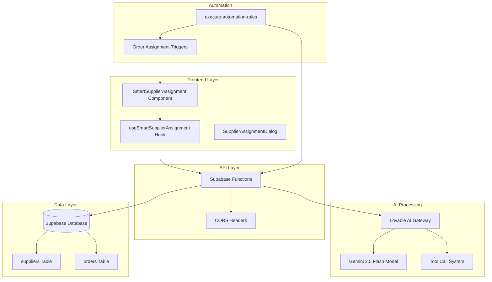
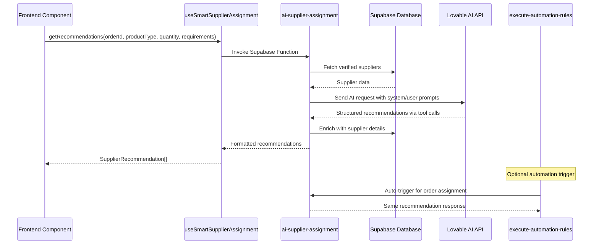
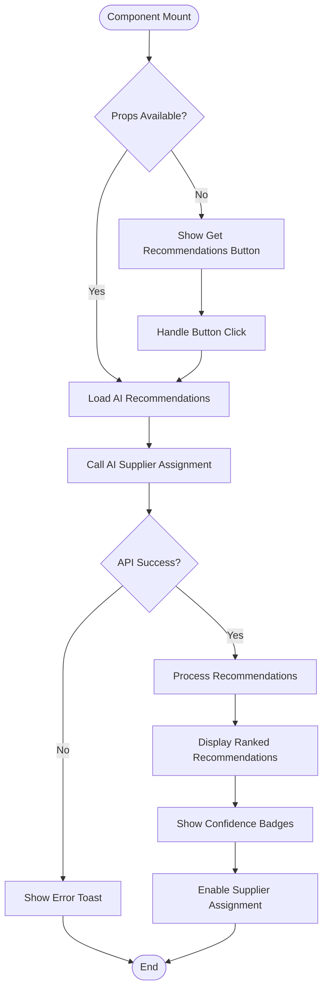
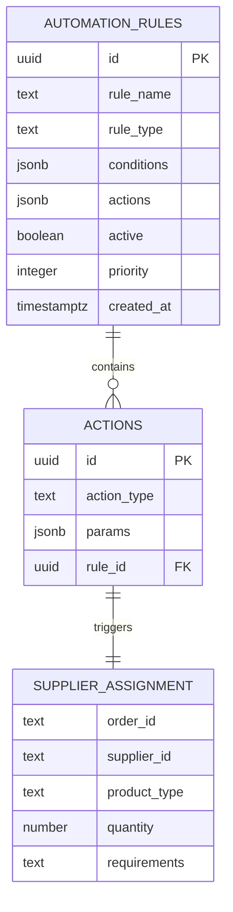
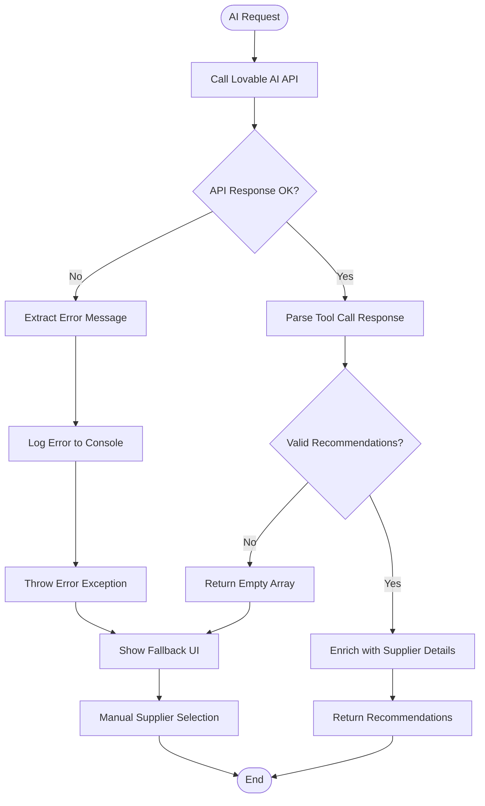
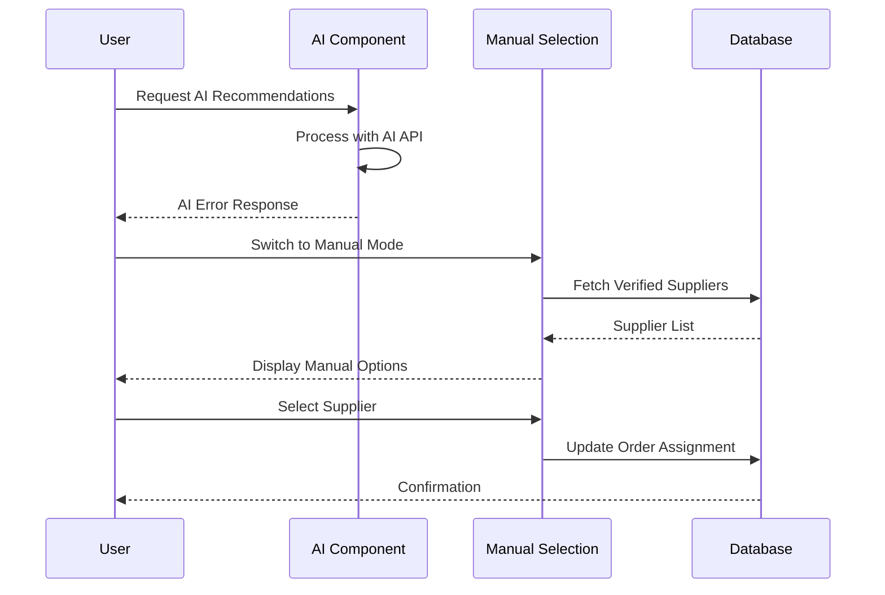
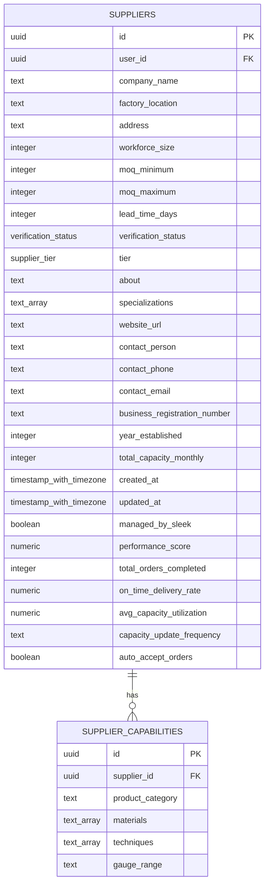

# AI Supplier Assignment

<cite>
**Referenced Files in This Document**
- [index.ts](file://supabase/functions/ai-supplier-assignment/index.ts)
- [useSmartSupplierAssignment.ts](file://src/hooks/useSmartSupplierAssignment.ts)
- [SmartSupplierAssignment.tsx](file://src/components/admin/SmartSupplierAssignment.tsx)
- [execute-automation-rules/index.ts](file://supabase/functions/execute-automation-rules/index.ts)
- [SupplierAssignmentDialog.tsx](file://src/components/admin/SupplierAssignmentDialog.tsx)
- [order.ts](file://src/types/order.ts)
- [FIXED_SETUP_PART1.sql](file://supabase/FIXED_SETUP_PART1.sql)
</cite>

## Table of Contents
1. [Introduction](#introduction)
2. [System Architecture](#system-architecture)
3. [AI Supplier Assignment Endpoint](#ai-supplier-assignment-endpoint)
4. [AI Prompt Engineering](#ai-prompt-engineering)
5. [Tool Call Implementation](#tool-call-implementation)
6. [Frontend Integration](#frontend-integration)
7. [Automation Rules Integration](#automation-rules-integration)
8. [Error Handling and Fallback](#error-handling-and-fallback)
9. [Database Schema](#database-schema)
10. [Performance Considerations](#performance-considerations)
11. [Troubleshooting Guide](#troubleshooting-guide)
12. [Conclusion](#conclusion)

## Introduction

The AI Supplier Assignment system is a sophisticated automated solution that recommends optimal suppliers for production orders using artificial intelligence. This system combines machine learning capabilities with business logic to match orders with suppliers based on specialized criteria including product type, quantity requirements, and specific manufacturing capabilities.

The system operates through a serverless function that processes order details and supplier information to generate intelligent recommendations. It integrates seamlessly with the broader supply chain management system, providing both automated and manual supplier assignment capabilities.

## System Architecture

The AI Supplier Assignment system follows a microservices architecture with clear separation of concerns between AI processing, data retrieval, and user interface components.



**Diagram sources**
- [index.ts](file://supabase/functions/ai-supplier-assignment/index.ts#L1-L134)
- [useSmartSupplierAssignment.ts](file://src/hooks/useSmartSupplierAssignment.ts#L1-L55)
- [SmartSupplierAssignment.tsx](file://src/components/admin/SmartSupplierAssignment.tsx#L1-L127)

## AI Supplier Assignment Endpoint

The core functionality resides in the `ai-supplier-assignment` function, which serves as the primary endpoint for supplier recommendation requests.

### Endpoint Definition

The function accepts four parameters through a JSON payload:

| Parameter | Type | Description | Required |
|-----------|------|-------------|----------|
| `order_id` | string | Unique identifier for the production order | Yes |
| `product_type` | string | Type of product requiring manufacturing | Yes |
| `quantity` | number | Number of units required | Yes |
| `requirements` | string | Specific manufacturing requirements or specifications | No |

### Request Flow



**Diagram sources**
- [index.ts](file://supabase/functions/ai-supplier-assignment/index.ts#L18-L134)
- [useSmartSupplierAssignment.ts](file://src/hooks/useSmartSupplierAssignment.ts#L18-L55)

### Response Structure

The function returns a structured JSON response containing:

```typescript
{
  success: boolean,
  recommendations: [
    {
      supplier_id: string,
      rank: number,
      confidence_score: number,
      reasoning: string,
      supplier_name: string,
      supplier_details: {
        id: string,
        company_name: string,
        specializations: string[],
        monthly_capacity: number,
        performance_score: number,
        lead_time_days: number
      }
    }
  ]
}
```

**Section sources**
- [index.ts](file://supabase/functions/ai-supplier-assignment/index.ts#L18-L134)
- [useSmartSupplierAssignment.ts](file://src/hooks/useSmartSupplierAssignment.ts#L5-L12)

## AI Prompt Engineering

The system employs sophisticated prompt engineering to guide the AI in making optimal supplier recommendations.

### System Prompt Design

The system prompt establishes the AI's role and guiding principles:

```typescript
const systemPrompt = `You are an expert at matching manufacturing orders with optimal suppliers. 
Analyze the order requirements and supplier capabilities to recommend the top 3 best matches.
Consider: specialization match, capacity, performance score, lead time, and overall fit.`;
```

### User Prompt Construction

The user prompt dynamically constructs the context using real-time data:

```typescript
const userPrompt = `Order Details:
- Product: ${product_type}
- Quantity: ${quantity} pieces
- Requirements: ${requirements || 'Standard quality'}

Available Suppliers:
${suppliers?.map((s, idx) => `
${idx + 1}. ${s.company_name}
   - Specializations: ${s.specializations?.join(', ') || 'General'}
   - Monthly Capacity: ${s.monthly_capacity || 'N/A'}
   - Performance Score: ${s.performance_score || 0}/100
   - Lead Time: ${s.lead_time_days || 'N/A'} days
`).join('\n')}

Recommend the top 3 suppliers with reasoning for each.`;
```

### Prompt Engineering Principles

1. **Clear Role Definition**: Establishes the AI as an expert supplier matcher
2. **Structured Output**: Specifies exact format requirements for recommendations
3. **Multi-factor Analysis**: Considers specialization, capacity, performance, and lead time
4. **Dynamic Context**: Uses real-time supplier and order data
5. **Reasoning Requirement**: Ensures transparency in AI decision-making

**Section sources**
- [index.ts](file://supabase/functions/ai-supplier-assignment/index.ts#L38-L58)

## Tool Call Implementation

The system utilizes structured tool calls to enforce specific output formats and ensure reliable data extraction.

### Function Schema Definition

The `recommend_suppliers` function schema defines the expected output structure:

```typescript
{
  type: "function",
  function: {
    name: "recommend_suppliers",
    description: "Recommend top suppliers for an order",
    parameters: {
      type: "object",
      properties: {
        recommendations: {
          type: "array",
          items: {
            type: "object",
            properties: {
              supplier_id: { type: "string" },
              rank: { type: "number" },
              confidence_score: { type: "number", description: "0-100" },
              reasoning: { type: "string" }
            },
            required: ["supplier_id", "rank", "confidence_score", "reasoning"]
          }
        }
      },
      required: ["recommendations"]
    }
  }
}
```

### Tool Call Execution

The system enforces tool call usage to guarantee structured output:

```typescript
{
  tool_choice: { type: "function", function: { name: "recommend_suppliers" } }
}
```

### Output Processing

The function extracts and validates the tool call response:

```typescript
const toolCall = aiData.choices?.[0]?.message?.tool_calls?.[0];
const recommendations = toolCall ? JSON.parse(toolCall.function.arguments).recommendations : [];
```

### Benefits of Tool Calls

1. **Structured Output**: Guarantees consistent data format
2. **Error Reduction**: Minimizes parsing errors
3. **Validation**: Ensures required fields are present
4. **Reliability**: Provides predictable response structure

**Section sources**
- [index.ts](file://supabase/functions/ai-supplier-assignment/index.ts#L71-L96)
- [index.ts](file://supabase/functions/ai-supplier-assignment/index.ts#L110-L112)

## Frontend Integration

The frontend integration consists of React hooks and components that provide seamless user interaction with the AI supplier assignment system.

### useSmartSupplierAssignment Hook

The custom hook manages the AI recommendation workflow:

```mermaid
classDiagram
class useSmartSupplierAssignment {
+useState loading
+useState recommendations
+getRecommendations(orderId, productType, quantity, requirements) Promise~SupplierRecommendation[]~
+return { loading, recommendations, getRecommendations }
}
class SupplierRecommendation {
+string supplier_id
+string supplier_name
+number rank
+number confidence_score
+string reasoning
+any supplier_details
}
useSmartSupplierAssignment --> SupplierRecommendation : creates
```

**Diagram sources**
- [useSmartSupplierAssignment.ts](file://src/hooks/useSmartSupplierAssignment.ts#L5-L12)

### SmartSupplierAssignment Component

The main UI component displays recommendations with confidence indicators:



**Diagram sources**
- [SmartSupplierAssignment.tsx](file://src/components/admin/SmartSupplierAssignment.tsx#L27-L127)

### Confidence Scoring System

The component implements a three-tier confidence scoring system:

| Score Range | Badge Color | Confidence Level |
|-------------|-------------|------------------|
| 80-100 | Green | High Confidence |
| 60-79 | Secondary | Medium Confidence |
| 0-59 | Outline | Low Confidence |

### Supplier Selection Workflow

1. **Recommendation Display**: Shows top 3 suppliers with rankings
2. **Confidence Indicators**: Visual confidence badges for each recommendation
3. **Detailed Information**: Capacity, performance, and lead time metrics
4. **Direct Assignment**: One-click supplier assignment capability

**Section sources**
- [SmartSupplierAssignment.tsx](file://src/components/admin/SmartSupplierAssignment.tsx#L1-L127)
- [useSmartSupplierAssignment.ts](file://src/hooks/useSmartSupplierAssignment.ts#L1-L55)

## Automation Rules Integration

The AI Supplier Assignment system integrates with the automation rules engine to enable automatic supplier assignment as part of business process automation.

### Automation Rule Structure



**Diagram sources**
- [execute-automation-rules/index.ts](file://supabase/functions/execute-automation-rules/index.ts#L115-L169)

### Automatic Supplier Assignment Action

The automation system can automatically trigger supplier assignment:

```typescript
case 'assign_supplier':
  // Call AI supplier assignment
  console.log("Assigning supplier:", action.params);
  results.push({ action: 'assign_supplier', success: true });
  break;
```

### Trigger Conditions

Automation rules can be configured with various triggering conditions:

- **Order Creation**: Automatically assign suppliers when new orders are created
- **Specific Product Types**: Target specific product categories
- **Quantity Thresholds**: Apply based on order quantities
- **Priority Levels**: Consider order priority for assignment

### Integration Benefits

1. **Process Automation**: Eliminates manual intervention
2. **Consistency**: Ensures standardized supplier assignment
3. **Scalability**: Handles high-volume order processing
4. **Integration**: Seamlessly works with existing automation workflows

**Section sources**
- [execute-automation-rules/index.ts](file://supabase/functions/execute-automation-rules/index.ts#L133-L155)

## Error Handling and Fallback

The system implements comprehensive error handling and fallback mechanisms to ensure reliability and graceful degradation.

### AI API Failure Handling



**Diagram sources**
- [index.ts](file://supabase/functions/ai-supplier-assignment/index.ts#L101-L134)

### Error Categories and Responses

| Error Type | Handling Strategy | Fallback Action |
|------------|-------------------|-----------------|
| AI API Timeout | Retry with exponential backoff | Manual selection |
| Invalid API Key | Log configuration error | Admin notification |
| Network Issues | Circuit breaker pattern | Local caching |
| Malformed Response | Validation failure | Graceful degradation |
| Database Errors | Transaction rollback | Error reporting |

### Manual Supplier Selection Fallback

When AI recommendations fail, the system provides a manual fallback:



**Diagram sources**
- [SupplierAssignmentDialog.tsx](file://src/components/admin/SupplierAssignmentDialog.tsx#L1-L238)

### Error Recovery Mechanisms

1. **Graceful Degradation**: Continue operation with reduced functionality
2. **User Feedback**: Clear error messages and guidance
3. **Logging**: Comprehensive error logging for debugging
4. **Retry Logic**: Intelligent retry mechanisms for transient failures
5. **Fallback UI**: Alternative manual selection interface

**Section sources**
- [index.ts](file://supabase/functions/ai-supplier-assignment/index.ts#L127-L134)
- [useSmartSupplierAssignment.ts](file://src/hooks/useSmartSupplierAssignment.ts#L41-L47)

## Database Schema

The system relies on a well-structured database schema to support supplier management and recommendation functionality.

### Suppliers Table Structure



**Diagram sources**
- [FIXED_SETUP_PART1.sql](file://supabase/FIXED_SETUP_PART1.sql#L861-L891)

### Key Fields for Supplier Matching

| Field | Purpose | Data Type | Impact on Recommendations |
|-------|---------|-----------|---------------------------|
| `specializations` | Manufacturing expertise | text_array | Primary matching factor |
| `monthly_capacity` | Production capability | integer | Availability assessment |
| `performance_score` | Historical performance | numeric | Reliability indicator |
| `lead_time_days` | Delivery timeline | integer | Time-sensitive matching |
| `verification_status` | Supplier validity | verification_status | Must be verified |
| `auto_accept_orders` | Automation readiness | boolean | Automation eligibility |

### Orders Table Integration

The system integrates with the orders table to provide context for supplier recommendations:

```typescript
interface OrderData {
  id: string;
  order_number: string;
  status: string;
  created_at: string;
  updated_at?: string;
  estimated_delivery?: string;
  quantity?: number;
  product_type?: string;
  notes?: string;
}
```

**Section sources**
- [FIXED_SETUP_PART1.sql](file://supabase/FIXED_SETUP_PART1.sql#L861-L891)
- [order.ts](file://src/types/order.ts#L5-L16)

## Performance Considerations

The AI Supplier Assignment system is designed with several performance optimization strategies to ensure efficient operation at scale.

### Caching Strategies

1. **Supplier Data Caching**: Verified supplier data cached for 10-15 minutes
2. **Recommendation Caching**: AI recommendations cached based on input parameters
3. **Supplier Capabilities**: Capability data pre-loaded and indexed
4. **Performance Scores**: Aggregated performance metrics cached

### Optimization Techniques

| Technique | Implementation | Benefit |
|-----------|----------------|---------|
| Database Indexing | Composite indexes on supplier queries | Faster supplier retrieval |
| Query Optimization | Selective field retrieval | Reduced network overhead |
| Connection Pooling | Supabase client connection reuse | Improved throughput |
| Async Processing | Non-blocking AI API calls | Better user experience |
| Pagination | Large supplier list pagination | Memory efficiency |

### Scalability Features

1. **Serverless Architecture**: Auto-scaling with zero maintenance
2. **Stateless Design**: No session persistence requirements
3. **Event-Driven**: Asynchronous processing patterns
4. **Rate Limiting**: Built-in protection against abuse
5. **Circuit Breakers**: Fail-safe mechanisms for external APIs

### Monitoring and Metrics

The system tracks key performance indicators:

- **API Response Times**: AI API call latency monitoring
- **Success Rates**: Recommendation accuracy tracking
- **Error Rates**: Failure rate analysis
- **Cache Hit Rates**: Caching effectiveness measurement
- **Throughput**: Requests per second monitoring

## Troubleshooting Guide

Common issues and their solutions when working with the AI Supplier Assignment system.

### AI API Issues

**Problem**: AI API returns error responses
**Symptoms**: 
- "AI API error: 401" - Unauthorized access
- "AI API error: 429" - Rate limit exceeded
- "AI API error: 500" - Internal server error

**Solutions**:
1. Verify LOVABLE_API_KEY configuration
2. Check API quota limits
3. Implement exponential backoff retry logic
4. Monitor API status dashboard

### Database Connection Issues

**Problem**: Cannot fetch supplier data
**Symptoms**:
- "Database connection failed"
- "Suppliers not found" errors
- Slow response times

**Solutions**:
1. Verify SUPABASE_URL and service role key
2. Check database connectivity
3. Review query performance
4. Validate supplier verification status

### Frontend Integration Problems

**Problem**: Recommendations not displaying
**Symptoms**:
- Empty recommendation list
- UI not updating after API call
- Confusing error messages

**Solutions**:
1. Check network tab for API errors
2. Verify prop passing in components
3. Review console logs for JavaScript errors
4. Validate data structure expectations

### Automation Rule Issues

**Problem**: Supplier assignment not triggering automatically
**Symptoms**:
- Orders not auto-assigned
- Automation rules not executing
- Missing action logs

**Solutions**:
1. Verify rule activation status
2. Check condition matching logic
3. Review action execution results
4. Validate admin permissions

**Section sources**
- [index.ts](file://supabase/functions/ai-supplier-assignment/index.ts#L127-L134)
- [useSmartSupplierAssignment.ts](file://src/hooks/useSmartSupplierAssignment.ts#L41-L47)

## Conclusion

The AI Supplier Assignment system represents a sophisticated approach to automating supplier selection in manufacturing environments. By combining advanced AI capabilities with robust backend infrastructure and intuitive frontend interfaces, the system provides significant value in optimizing supply chain operations.

### Key Benefits

1. **Intelligent Matching**: AI-powered supplier recommendations based on comprehensive criteria
2. **Automation Ready**: Seamless integration with business process automation rules
3. **User-Friendly**: Intuitive interface with confidence scoring and manual fallback options
4. **Reliable**: Comprehensive error handling and graceful degradation mechanisms
5. **Scalable**: Serverless architecture supporting high-volume operations

### Future Enhancements

The system provides a solid foundation for future improvements:

- **Enhanced AI Models**: Integration with more advanced AI models for better accuracy
- **Real-time Analytics**: Live performance tracking and optimization suggestions
- **Multi-language Support**: Internationalization for global operations
- **Advanced Filtering**: More sophisticated supplier matching criteria
- **Predictive Analytics**: Forecasting supplier availability and performance trends

The AI Supplier Assignment system demonstrates how modern technology can transform traditional business processes, providing data-driven insights while maintaining flexibility for human oversight and intervention when needed.