# Analytics Service

<cite>
**Referenced Files in This Document**
- [index.ts](file://supabase/functions/analytics-service/index.ts)
- [AIInsightsCard.tsx](file://src/components/AIInsightsCard.tsx)
- [DashboardAnalytics.tsx](file://src/components/admin/DashboardAnalytics.tsx)
- [ProductionAnalytics.tsx](file://src/components/production/ProductionAnalytics.tsx)
- [order.ts](file://src/types/order.ts)
- [useQualityPrediction.ts](file://src/hooks/useQualityPrediction.ts)
- [QualityRiskAlert.tsx](file://src/components/production/QualityRiskAlert.tsx)
- [QCChecksList.tsx](file://src/components/QCChecksList.tsx)
</cite>

## Table of Contents
1. [Introduction](#introduction)
2. [Service Architecture](#service-architecture)
3. [Analysis Types](#analysis-types)
4. [Order Insights Analysis](#order-insights-analysis)
5. [Quality Analysis](#quality-analysis)
6. [Authentication and Security](#authentication-and-security)
7. [Error Handling](#error-handling)
8. [Integration Examples](#integration-examples)
9. [Performance and Real-time Considerations](#performance-and-real-time-considerations)
10. [Deployment and Configuration](#deployment-and-configuration)

## Introduction

The Analytics Service is a sophisticated edge function built on Supabase Functions that provides AI-powered business insights for Sleek Apparels' LoopTrace™ system. This service leverages Lovable AI's Gemini model to deliver actionable intelligence for both operational and quality management scenarios. The service operates asynchronously, enabling real-time analytics while maintaining system responsiveness through careful error handling and rate limiting.

The service serves two primary analysis types: **Order Insights** for production and delivery forecasting, and **Quality Analysis** for defect identification and process improvement recommendations. Both analyses utilize advanced AI prompting strategies to generate comprehensive insights that drive business decision-making.

## Service Architecture

The Analytics Service follows a modular architecture designed for scalability and maintainability:

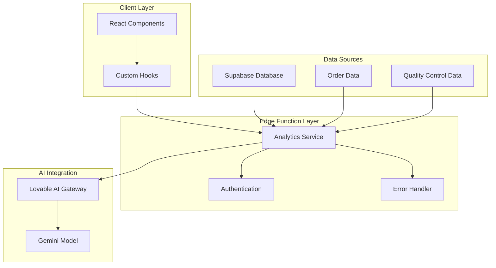

**Diagram sources**
- [index.ts](file://supabase/functions/analytics-service/index.ts#L1-L220)
- [AIInsightsCard.tsx](file://src/components/AIInsightsCard.tsx#L1-L116)

**Section sources**
- [index.ts](file://supabase/functions/analytics-service/index.ts#L1-L220)

## Analysis Types

The Analytics Service supports two distinct analysis types, each tailored to specific business needs:

### Analysis Type Definitions

| Analysis Type | Purpose | Input Requirements | Output Format |
|---------------|---------|-------------------|---------------|
| `order-insights` | Production and delivery forecasting | Order data, updates, QC checks | JSON with delivery prediction, quality forecast, recommendations, risk assessment |
| `quality-analysis` | Defect analysis and process improvement | Defects, QC checks, order type | JSON with root causes, improvements, trend predictions, preventive actions |

### Input Structure Validation

The service implements robust input validation to ensure data integrity:

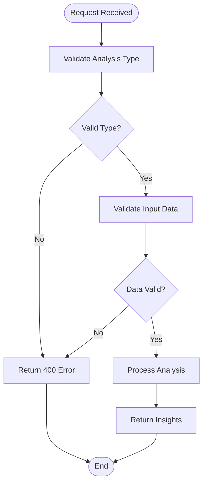

**Diagram sources**
- [index.ts](file://supabase/functions/analytics-service/index.ts#L35-L47)

**Section sources**
- [index.ts](file://supabase/functions/analytics-service/index.ts#L9-L27)

## Order Insights Analysis

The Order Insights analysis provides comprehensive business intelligence for production management and customer delivery expectations.

### Input Structure

The Order Insights analysis accepts a structured input containing three primary data sources:

| Field | Type | Description | Required |
|-------|------|-------------|----------|
| `orderData` | Object | Core order metadata and specifications | Yes |
| `updates` | Array | Production progress updates and milestones | Yes |
| `qcChecks` | Array | Quality control inspection results | Yes |

### Order Data Schema

The `orderData` object contains essential order metadata:

```typescript
interface OrderData {
  id: string;
  order_number: string;
  status: string;
  created_at: string;
  updated_at?: string;
  estimated_delivery?: string;
  quantity?: number;
  product_type?: string;
  notes?: string;
  buyer?: {
    company_name: string;
    full_name: string;
  };
}
```

### AI Prompt Engineering

The Order Insights analysis utilizes a sophisticated prompt template that extracts maximum value from available data:

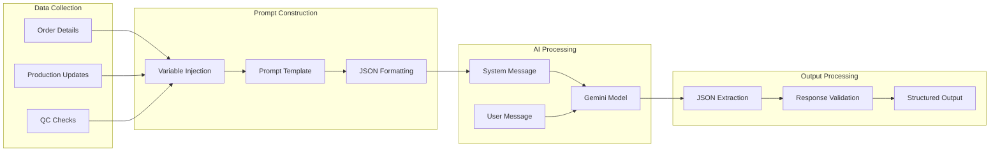

**Diagram sources**
- [index.ts](file://supabase/functions/analytics-service/index.ts#L66-L94)

### Output Analysis Components

The Order Insights analysis generates five key components:

| Component | Purpose | Example Output |
|-----------|---------|----------------|
| `deliveryPrediction` | Expected delivery timeline | "Likely to be delivered on-time" |
| `qualityForecast` | Anticipated quality performance | "Maintaining current quality standards" |
| `recommendations` | Actionable production improvements | ["Increase quality checkpoints", "Optimize material flow"] |
| `riskLevel` | Operational risk assessment | "Medium" |
| `summary` | Executive overview | "Production progressing steadily with minor delays" |

### Real-time Processing Benefits

The Order Insights analysis enables dynamic decision-making through:

- **Progressive Delivery Predictions**: As production updates accumulate, the AI refines delivery estimates
- **Quality Trend Analysis**: Continuous monitoring of QC results informs proactive quality management
- **Risk Factor Identification**: Early detection of potential production bottlenecks
- **Executive Decision Support**: Data-driven insights for strategic planning

**Section sources**
- [index.ts](file://supabase/functions/analytics-service/index.ts#L58-L142)
- [order.ts](file://src/types/order.ts#L5-L15)

## Quality Analysis

The Quality Analysis component specializes in defect identification, root cause analysis, and process improvement recommendations.

### Defect Analysis Process

The Quality Analysis employs a systematic approach to quality control data:

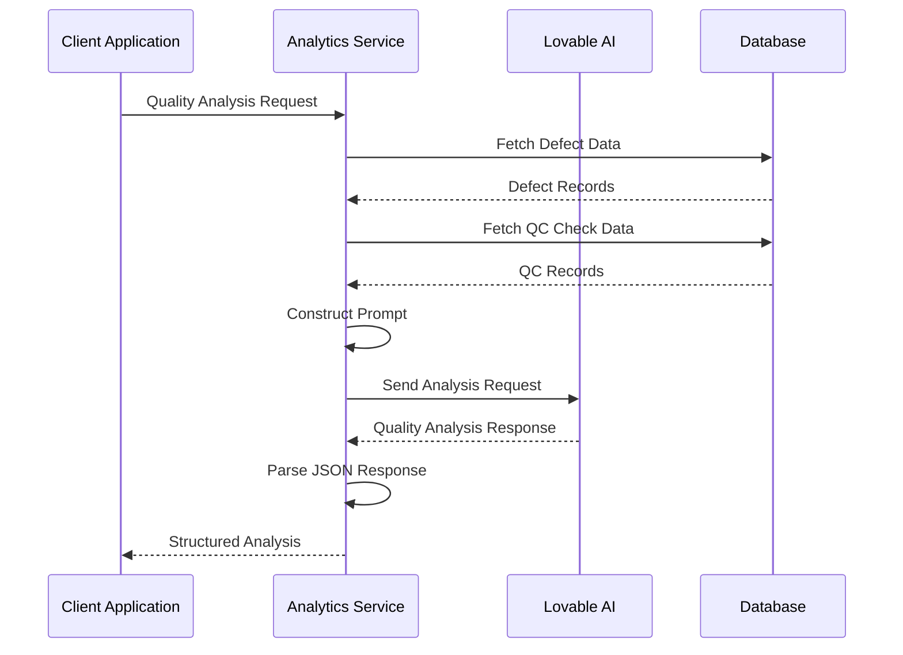

**Diagram sources**
- [index.ts](file://supabase/functions/analytics-service/index.ts#L144-L217)

### Input Data Processing

The Quality Analysis accepts structured defect and QC check data:

| Input Type | Description | Processing Method |
|------------|-------------|-------------------|
| `defects` | Array of identified defects with severity and quantity | Aggregated defect summary for analysis |
| `qcChecks` | Array of quality control inspections | Pass/fail rates and trend analysis |
| `orderType` | Manufacturing process type (knitwear, cut&sew, uniforms) | Contextual analysis based on production type |

### Analysis Output Structure

The Quality Analysis generates comprehensive insights:

```typescript
interface QualityAnalysisOutput {
  rootCauses: string[];
  improvements: string[];
  trend: string;
  preventiveActions: string[];
  summary: string;
}
```

### Root Cause Analysis Capabilities

The Quality Analysis performs sophisticated root cause identification:

- **Pattern Recognition**: Identifies recurring defect patterns across multiple QC checks
- **Process Correlation**: Links defects to specific production stages or equipment
- **Material Analysis**: Evaluates material quality impacts on defect rates
- **Operator Impact**: Assesses human factors in quality outcomes

### Improvement Recommendations

The system generates actionable improvement suggestions:

1. **Process Optimization**: Specific workflow enhancements
2. **Equipment Maintenance**: Preventive maintenance schedules
3. **Training Interventions**: Skill development recommendations
4. **Material Adjustments**: Supplier or specification changes

**Section sources**
- [index.ts](file://supabase/functions/analytics-service/index.ts#L144-L217)

## Authentication and Security

The Analytics Service implements robust authentication and security measures to protect sensitive business data and AI resources.

### API Key Management

The service relies on the `LOVABLE_API_KEY` environment variable for secure AI gateway communication:

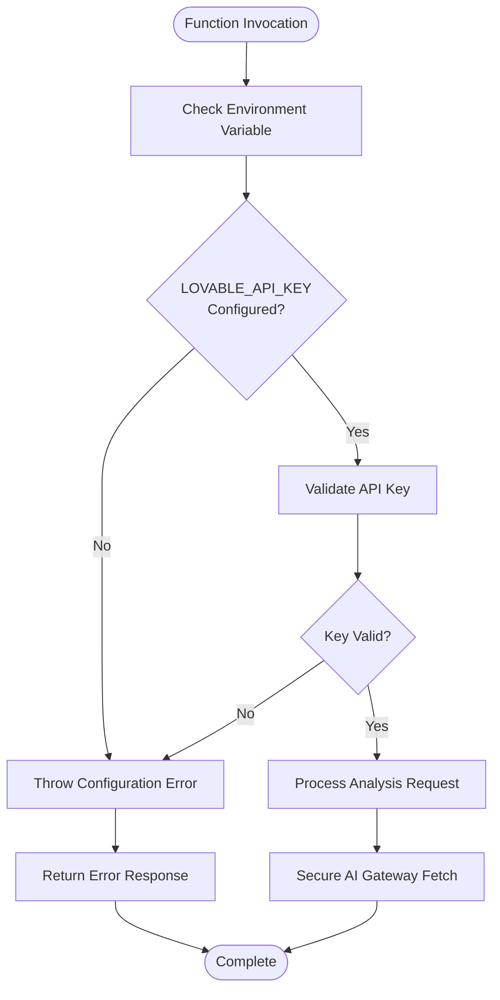

**Diagram sources**
- [index.ts](file://supabase/functions/analytics-service/index.ts#L60-L64)

### Security Headers Implementation

The service implements comprehensive CORS protection:

| Header | Value | Purpose |
|--------|-------|---------|
| `Access-Control-Allow-Origin` | `*` | Enables cross-origin requests |
| `Access-Control-Allow-Headers` | `authorization, x-client-info, apikey, content-type` | Permits required authentication headers |

### Data Protection Measures

- **Environment Isolation**: API keys stored securely in environment variables
- **Request Validation**: Input sanitization and type checking
- **Error Masking**: Generic error responses prevent information leakage
- **Rate Limiting**: Built-in protection against abuse

**Section sources**
- [index.ts](file://supabase/functions/analytics-service/index.ts#L4-L7)
- [index.ts](file://supabase/functions/analytics-service/index.ts#L60-L64)

## Error Handling

The Analytics Service implements comprehensive error handling to ensure reliable operation under various failure conditions.

### Error Classification

The service handles multiple categories of errors:

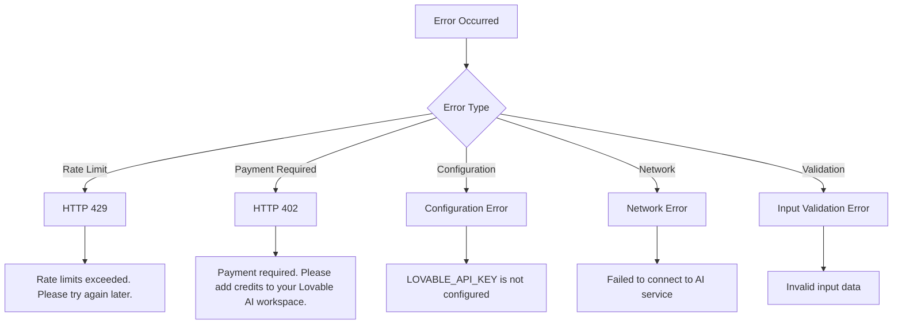

**Diagram sources**
- [index.ts](file://supabase/functions/analytics-service/index.ts#L114-L129)

### Rate Limit Handling

The service gracefully handles Lovable AI rate limiting:

| Status Code | Condition | User Message |
|-------------|-----------|--------------|
| 429 | Rate limit exceeded | "Rate limits exceeded. Please try again later." |
| 402 | Payment required | "Payment required. Please add credits to your Lovable AI workspace." |

### Error Recovery Strategies

The service implements multiple recovery mechanisms:

1. **Graceful Degradation**: Returns meaningful error messages to clients
2. **Logging**: Comprehensive error logging for debugging
3. **Retry Logic**: Built-in resilience for transient failures
4. **Fallback Responses**: Structured error responses maintain API contract

### JSON Parsing Robustness

The service includes resilient JSON extraction:

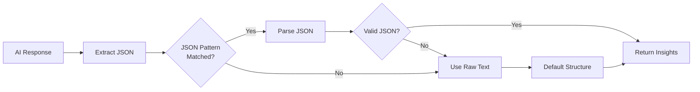

**Diagram sources**
- [index.ts](file://supabase/functions/analytics-service/index.ts#L135-L137)

**Section sources**
- [index.ts](file://supabase/functions/analytics-service/index.ts#L114-L130)

## Integration Examples

The Analytics Service integrates seamlessly with React components to provide real-time business insights.

### AI Insights Card Integration

The `AIInsightsCard` component demonstrates Order Insights integration:

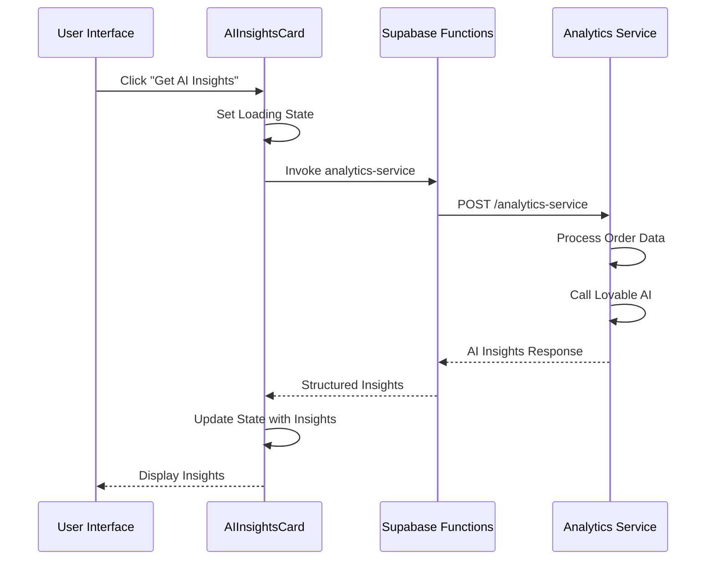

**Diagram sources**
- [AIInsightsCard.tsx](file://src/components/AIInsightsCard.tsx#L21-L33)

### Production Analytics Integration

The `ProductionAnalytics` component showcases quality insights integration:

| Component | Integration Point | Data Source |
|-----------|------------------|-------------|
| Overall Progress | Stage completion tracking | Production stage data |
| Performance Metrics | Estimated completion dates | Historical stage durations |
| Quality Insights | AI-powered recommendations | Quality control data |
| Risk Alerts | Delayed stage notifications | Target vs. actual timelines |

### Quality Risk Assessment

The `useQualityPrediction` hook demonstrates quality analysis integration:

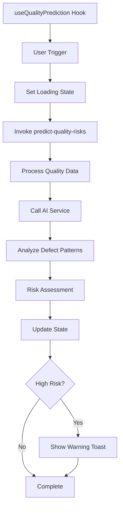

**Diagram sources**
- [useQualityPrediction.ts](file://src/hooks/useQualityPrediction.ts#L16-L48)

**Section sources**
- [AIInsightsCard.tsx](file://src/components/AIInsightsCard.tsx#L16-L116)
- [ProductionAnalytics.tsx](file://src/components/production/ProductionAnalytics.tsx#L30-L249)
- [useQualityPrediction.ts](file://src/hooks/useQualityPrediction.ts#L12-L56)

## Performance and Real-time Considerations

The Analytics Service is designed for high-performance, real-time analytics that support the LoopTrace™ system's operational needs.

### Asynchronous Processing Architecture

The service operates asynchronously to maintain system responsiveness:

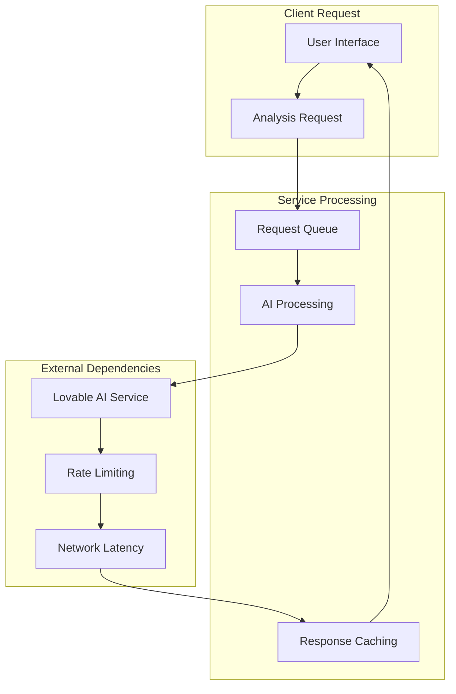

### Real-time Analytics Benefits

The asynchronous nature provides several advantages:

1. **Non-blocking Operations**: UI remains responsive during AI processing
2. **Scalable Throughput**: Concurrent analysis requests handled efficiently
3. **Resource Optimization**: AI resources allocated based on demand
4. **User Experience**: Immediate feedback with deferred processing

### Performance Optimization Strategies

| Strategy | Implementation | Benefit |
|----------|----------------|---------|
| Request Batching | Group related analyses | Reduced API calls |
| Response Caching | Store frequently accessed insights | Faster subsequent requests |
| Parallel Processing | Concurrent AI requests | Improved throughput |
| Graceful Degradation | Fallback responses | Reliable user experience |

### LoopTrace™ System Integration

The Analytics Service seamlessly integrates with LoopTrace™ for:

- **Dynamic Dashboards**: Real-time insights display
- **Automated Alerts**: Proactive issue notification
- **Historical Analysis**: Trend identification and pattern recognition
- **Decision Support**: Data-driven operational decisions

**Section sources**
- [index.ts](file://supabase/functions/analytics-service/index.ts#L29-L47)

## Deployment and Configuration

The Analytics Service is deployed as part of Supabase Functions, requiring specific configuration for production operation.

### Environment Configuration

Essential environment variables for deployment:

| Variable | Purpose | Required |
|----------|---------|----------|
| `LOVABLE_API_KEY` | Authentication for Lovable AI service | Yes |
| `SUPABASE_URL` | Supabase project URL | Yes |
| `SUPABASE_SERVICE_ROLE_KEY` | Service role authentication | Yes |

### Deployment Architecture

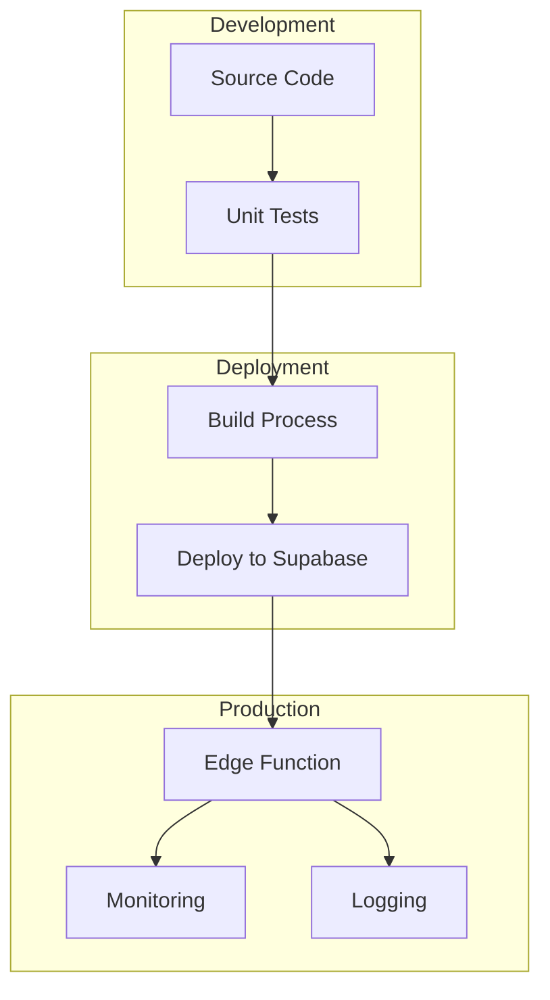

### Monitoring and Observability

The service includes comprehensive monitoring capabilities:

- **Error Tracking**: Automatic error logging and reporting
- **Performance Metrics**: Response time and throughput monitoring
- **Usage Analytics**: Analysis request volume and patterns
- **Resource Utilization**: AI service consumption tracking

### Scaling Considerations

The service is designed to scale horizontally:

- **Auto-scaling**: Function instances scale based on demand
- **Rate Limiting**: Built-in protection against excessive usage
- **Circuit Breaker**: Fail-safe mechanisms for external dependencies
- **Load Balancing**: Distributed processing across function instances

**Section sources**
- [index.ts](file://supabase/functions/analytics-service/index.ts#L60-L64)