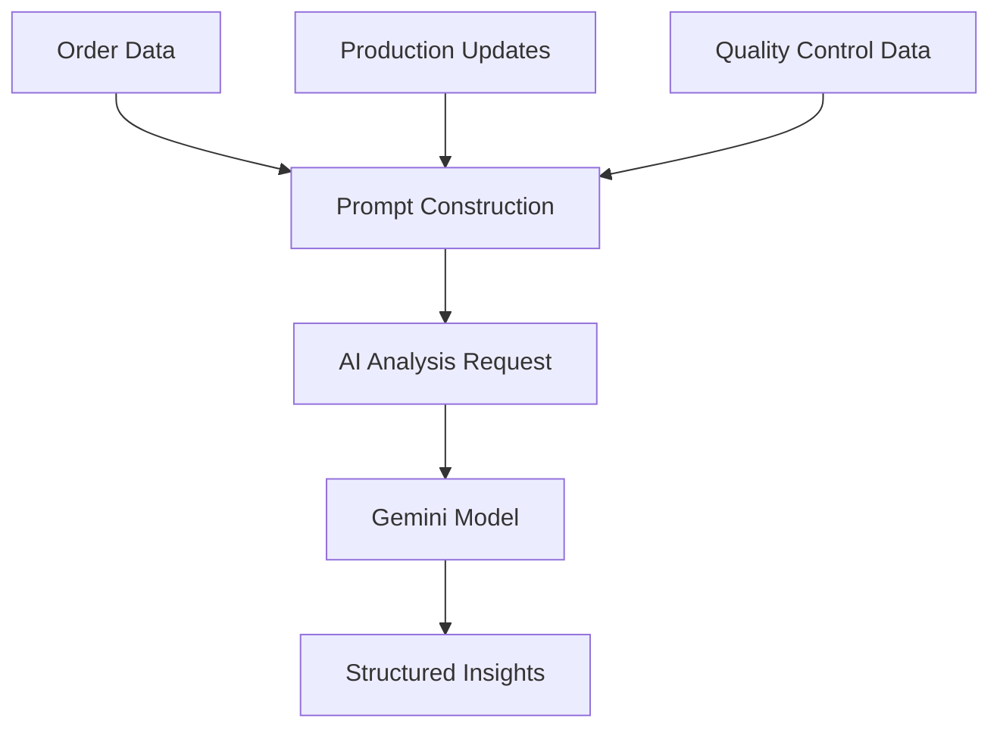
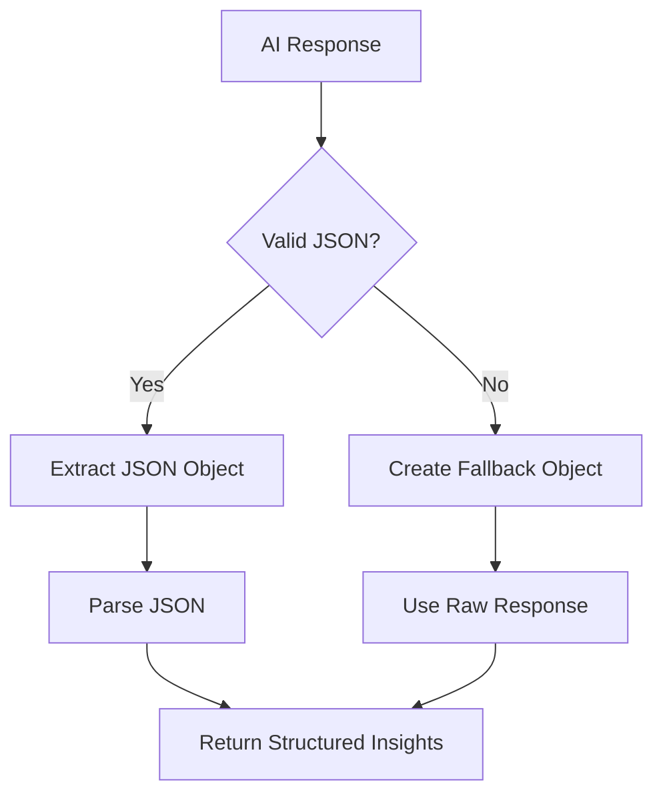
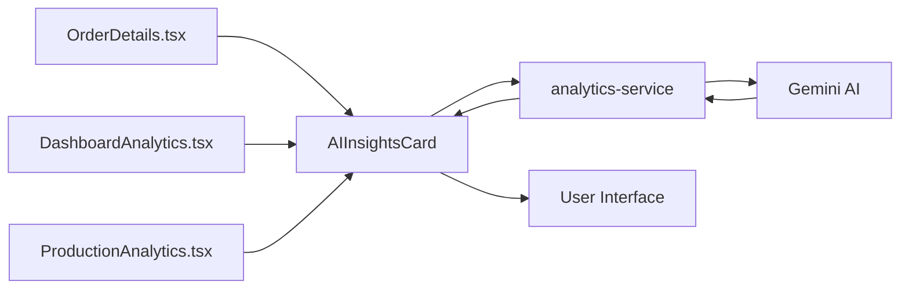

# Order Insights Analysis

<cite>
**Referenced Files in This Document**   
- [analytics-service/index.ts](file://supabase/functions/analytics-service/index.ts)
- [AIInsightsCard.tsx](file://src/components/AIInsightsCard.tsx)
- [order.ts](file://src/types/order.ts)
- [DashboardAnalytics.tsx](file://src/components/admin/DashboardAnalytics.tsx)
- [ProductionAnalytics.tsx](file://src/components/production/ProductionAnalytics.tsx)
</cite>

## Table of Contents
1. [Introduction](#introduction)
2. [Input Payload Structure](#input-payload-structure)
3. [AI Prompt Construction](#ai-prompt-construction)
4. [AI Response Processing](#ai-response-processing)
5. [Integration Patterns](#integration-patterns)
6. [Authentication and Security](#authentication-and-security)
7. [Error Handling](#error-handling)
8. [Performance Considerations](#performance-considerations)
9. [Example Responses](#example-responses)

## Introduction
The order-insights analysis type in the analytics-service provides AI-powered insights for apparel manufacturing orders at Sleek Apparels, a Bangladesh-based ethical manufacturer specializing in low MOQ production (50-300 pieces). This system leverages Lovable AI's Gemini model to analyze order data, production updates, and quality control checks, generating actionable insights for both production teams and management. The insights help optimize production efficiency, maintain quality standards, and ensure customer satisfaction across knitwear, cut & sew, and uniform production lines.

**Section sources**
- [analytics-service/index.ts](file://supabase/functions/analytics-service/index.ts#L10-L15)

## Input Payload Structure
The order-insights analysis requires a structured input payload containing comprehensive order information. The payload consists of three main components: orderData, updates, and qcChecks.

The orderData object contains essential order details including:
- **order_number**: Unique identifier for the order
- **product_type**: Category of apparel being produced
- **quantity**: Number of pieces in the order
- **status**: Current production status
- **target_date**: Expected delivery date
- **buyer information**: Company name and contact person

The updates array contains production update objects with stage progress, status changes, and messages from the production team. The qcChecks array includes quality control data with check types, results, and detailed notes from quality inspectors.

**Section sources**
- [order.ts](file://src/types/order.ts#L5-L15)
- [order.ts](file://src/types/order.ts#L18-L27)
- [order.ts](file://src/types/order.ts#L30-L38)

## AI Prompt Construction
The analytics-service constructs a comprehensive prompt for the Gemini AI model that requests specific types of insights. The prompt includes formatted order details, customer information, production updates, and quality control data.

The AI is specifically instructed to provide five key types of insights:
1. **Delivery predictions**: Assessment of whether the order will be delivered on time or delayed, with reasoning based on current progress
2. **Quality forecasts**: Prediction of product quality based on QC trends and industry standards
3. **Actionable recommendations**: Top three specific recommendations for the production team to improve efficiency or quality
4. **Risk assessments**: Evaluation of risk level (low/medium/high) with identification of specific risk factors
5. **Management summaries**: Concise overview of key insights for management decision-making

The prompt is designed to elicit responses in valid JSON format only, ensuring consistent parsing and integration with the frontend application.



**Diagram sources**
- [analytics-service/index.ts](file://supabase/functions/analytics-service/index.ts#L66-L92)

**Section sources**
- [analytics-service/index.ts](file://supabase/functions/analytics-service/index.ts#L66-L92)

## AI Response Processing
The analytics-service implements a robust JSON response parsing mechanism to extract structured insights from the AI response. The system first makes a POST request to the Lovable AI gateway with the constructed prompt and receives a response containing the AI-generated content.

The response processing involves extracting JSON from the AI response using a regular expression pattern that matches the first complete JSON object in the response text. This approach handles cases where the AI might include additional text before or after the JSON payload.

When valid JSON is extracted, it is parsed into a structured object with properties for deliveryPrediction, qualityForecast, riskLevel, recommendations, and summary. If JSON extraction fails, the system creates a fallback object with the raw AI response in the summary field, ensuring that some insights are always returned to the user.



**Diagram sources**
- [analytics-service/index.ts](file://supabase/functions/analytics-service/index.ts#L135-L137)

**Section sources**
- [analytics-service/index.ts](file://supabase/functions/analytics-service/index.ts#L135-L137)

## Integration Patterns
The order insights functionality is integrated into the application through the AIInsightsCard component, which is used in both DashboardAnalytics.tsx and ProductionAnalytics.tsx to display insights to users.

The integration follows a consistent pattern where the AIInsightsCard component accepts orderData, updates, and qcChecks as props and invokes the analytics-service function through Supabase. Users can initiate the analysis by clicking a "Get AI Insights" button, which triggers the API call to generate insights.

In DashboardAnalytics.tsx, the insights are presented as part of a comprehensive analytics dashboard for administrators, providing high-level visibility into order performance. In ProductionAnalytics.tsx, the insights are integrated into production tracking interfaces, giving production managers real-time guidance on current orders.

The component implements a clean user interface with appropriate icons and color coding to represent different types of insights, such as green checkmarks for quality forecasts and warning triangles for risk assessments.



**Diagram sources**
- [AIInsightsCard.tsx](file://src/components/AIInsightsCard.tsx#L24-L28)
- [OrderDetails.tsx](file://src/pages/OrderDetails.tsx#L221-L225)

**Section sources**
- [AIInsightsCard.tsx](file://src/components/AIInsightsCard.tsx#L16-L115)
- [OrderDetails.tsx](file://src/pages/OrderDetails.tsx#L221-L225)

## Authentication and Security
The order-insights analysis system implements secure authentication through the LOVABLE_API_KEY environment variable, which is required for all external API calls to the Lovable AI gateway. The analytics-service function validates that this key is configured before making any AI requests, throwing an error if it is missing.

All API calls to the Lovable AI gateway include the authorization header with the bearer token, ensuring that requests are properly authenticated. The system follows the principle of least privilege by using a dedicated API key for AI services rather than exposing broader application credentials.

The analytics-service is exposed as a Supabase function, which provides built-in authentication and authorization controls. Access to the function is governed by Supabase's Row Level Security policies, ensuring that users can only access insights for orders they are authorized to view.

**Section sources**
- [analytics-service/index.ts](file://supabase/functions/analytics-service/index.ts#L60-L64)
- [analytics-service/index.ts](file://supabase/functions/analytics-service/index.ts#L99-L100)

## Error Handling
The system implements comprehensive error handling for both client and server-side operations. On the server side, the analytics-service function catches and logs errors, returning appropriate HTTP status codes and error messages to the client.

Two specific error conditions are handled with dedicated responses:
- **429 Rate Limits**: When rate limits are exceeded, the system returns a 429 status code with a message advising users to try again later
- **402 Payment Required**: When payment is required, the system returns a 402 status code with instructions to add credits to the Lovable AI workspace

On the client side, the AIInsightsCard component implements error handling with user-friendly toast notifications that inform users when insight generation fails. The component also includes loading states to provide feedback during the analysis process, improving the user experience during potentially lengthy AI processing.

The system includes fallback behavior when AI insights cannot be generated, ensuring that the application remains functional even when the AI service is temporarily unavailable.

**Section sources**
- [analytics-service/index.ts](file://supabase/functions/analytics-service/index.ts#L114-L125)
- [AIInsightsCard.tsx](file://src/components/AIInsightsCard.tsx#L34-L39)

## Performance Considerations
The order-insights analysis system must balance the need for comprehensive AI-powered insights with the performance implications of real-time processing. AI processing latency can impact the user experience, particularly in production tracking scenarios where timely information is critical.

The system uses the google/gemini-2.5-flash model, which is optimized for fast text-only responses, helping to minimize processing time. However, network latency and AI processing delays can still result in noticeable wait times for users.

To mitigate these performance challenges, the system implements several strategies:
- Loading indicators provide immediate feedback when insights are being generated
- The ability to refresh insights allows users to update information as needed
- Fallback content ensures the interface remains functional even if AI processing fails

In real-time production tracking scenarios, the system's performance is particularly important as production managers rely on timely insights to make decisions. The current implementation strikes a balance between depth of analysis and responsiveness, though there may be opportunities to optimize further through caching or pre-processing of common analysis patterns.

**Section sources**
- [analytics-service/index.ts](file://supabase/functions/analytics-service/index.ts#L103)
- [AIInsightsCard.tsx](file://src/components/AIInsightsCard.tsx#L17-L18)

## Example Responses
The order-insights analysis generates structured JSON responses containing actionable insights. A successful response includes the following structure:

```json
{
  "deliveryPrediction": "On track for on-time delivery based on current production progress and completed stages.",
  "qualityForecast": "High quality expected with minimal defects anticipated based on consistent QC results and experienced production team.",
  "riskLevel": "low",
  "recommendations": [
    "Conduct final quality check 48 hours before shipment to catch any last-minute issues",
    "Prepare shipping documentation in advance to avoid delays",
    "Communicate estimated delivery window to the customer"
  ],
  "summary": "Order is progressing well with low risk of delays or quality issues. Production is on schedule with strong quality control metrics."
}
```

Error responses include appropriate HTTP status codes and descriptive messages:
- **429 Rate Limit Exceeded**: {"error": "Rate limits exceeded. Please try again later."}
- **402 Payment Required**: {"error": "Payment required. Please add credits to your Lovable AI workspace."}
- **500 Internal Server Error**: Generic error message with request ID for troubleshooting

These standardized response formats enable consistent error handling and user feedback across the application.

**Section sources**
- [analytics-service/index.ts](file://supabase/functions/analytics-service/index.ts#L116-L124)