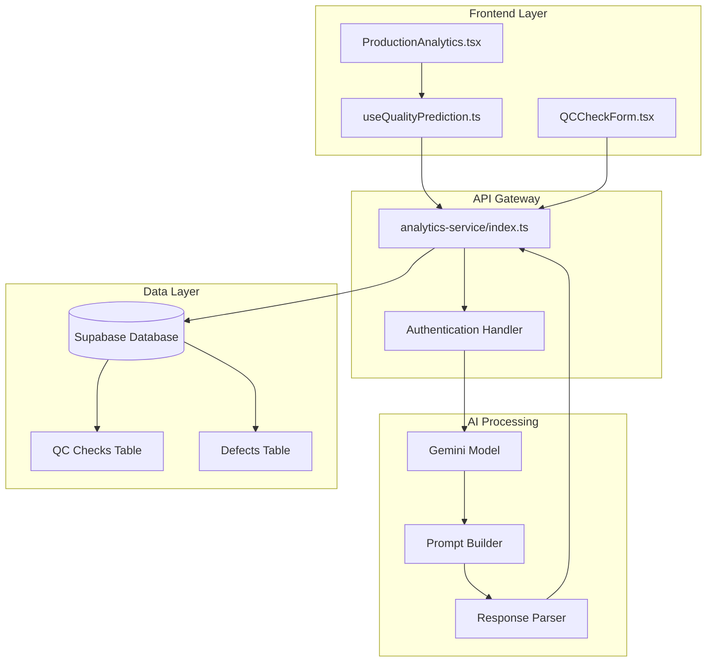
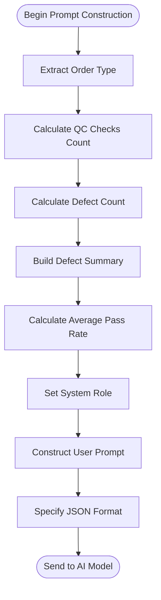
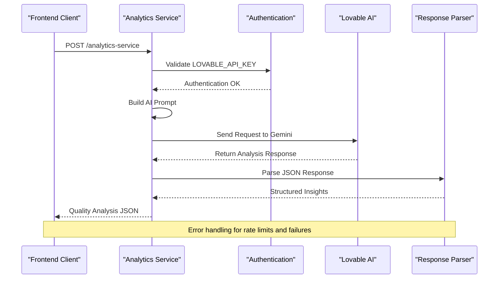
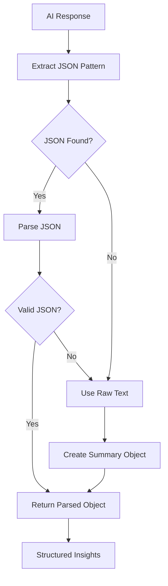
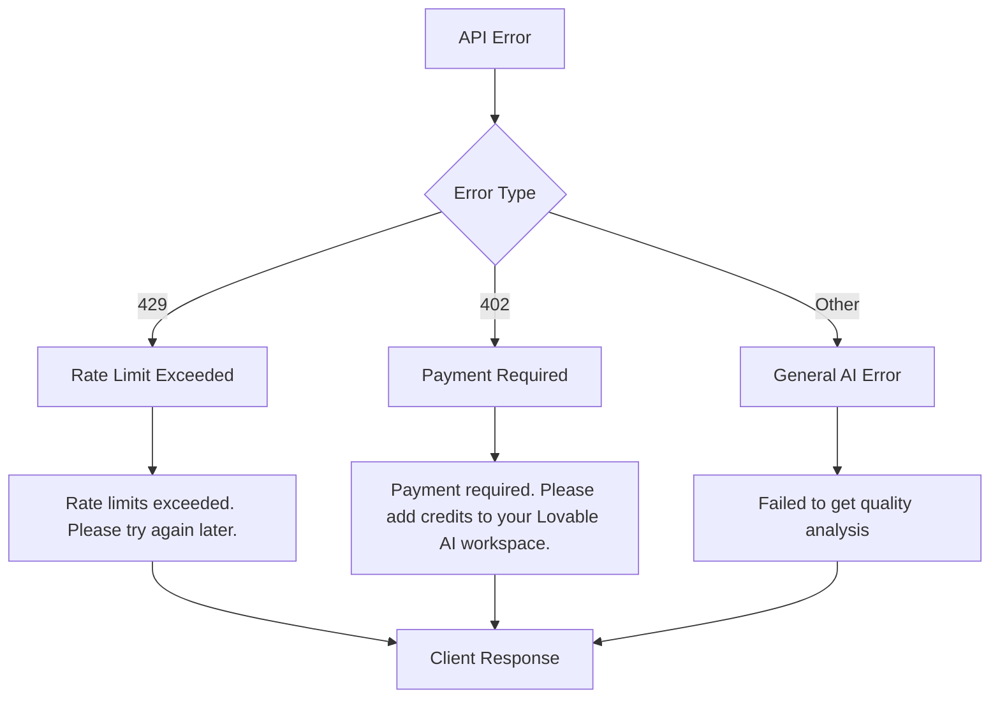
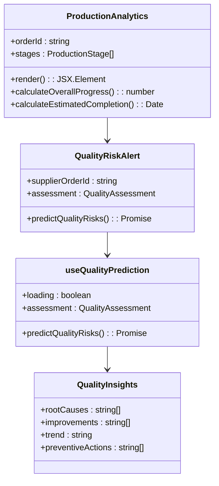
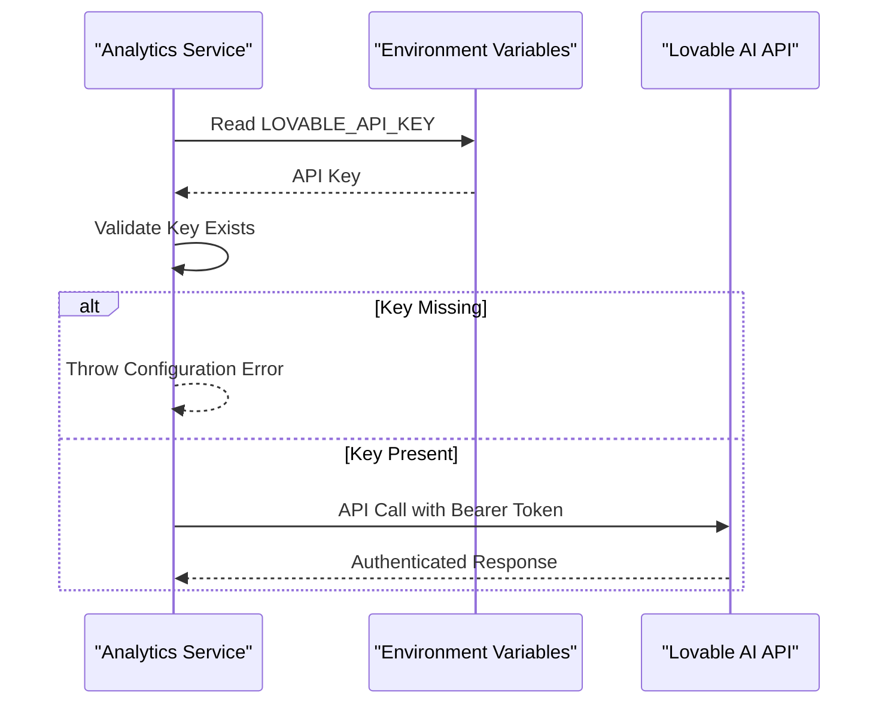

# Quality Analysis

<cite>
**Referenced Files in This Document**
- [index.ts](file://supabase/functions/analytics-service/index.ts)
- [ProductionAnalytics.tsx](file://src/components/production/ProductionAnalytics.tsx)
- [useQualityPrediction.ts](file://src/hooks/useQualityPrediction.ts)
- [QualityRiskAlert.tsx](file://src/components/production/QualityRiskAlert.tsx)
- [AIInsightsCard.tsx](file://src/components/AIInsightsCard.tsx)
- [QCChecksList.tsx](file://src/components/QCChecksList.tsx)
- [QCCheckForm.tsx](file://src/components/QCCheckForm.tsx)
- [order.ts](file://src/types/order.ts)
</cite>

## Table of Contents
1. [Introduction](#introduction)
2. [System Architecture](#system-architecture)
3. [Input Data Structure](#input-data-structure)
4. [AI Prompt Construction](#ai-prompt-construction)
5. [Processing Pipeline](#processing-pipeline)
6. [JSON Response Parsing](#json-response-parsing)
7. [Error Handling](#error-handling)
8. [Integration with Frontend](#integration-with-frontend)
9. [Authentication and Security](#authentication-and-security)
10. [Performance Considerations](#performance-considerations)
11. [Troubleshooting Guide](#troubleshooting-guide)
12. [Conclusion](#conclusion)

## Introduction

The Quality Analysis system in the analytics-service provides advanced quality improvement insights for the LoopTrace™ production system using Lovable AI's Gemini model. This system processes defect reports, QC checks, and order type information to generate actionable quality improvement recommendations, root cause analyses, and predictive quality forecasts.

The system serves as a critical component in the continuous quality improvement process, enabling manufacturers to identify quality issues early, implement preventive measures, and maintain high-quality standards in apparel manufacturing operations.

## System Architecture

The Quality Analysis system follows a serverless architecture with clear separation of concerns between data collection, AI processing, and frontend presentation.



**Diagram sources**
- [index.ts](file://supabase/functions/analytics-service/index.ts#L1-L220)
- [ProductionAnalytics.tsx](file://src/components/production/ProductionAnalytics.tsx#L1-L249)
- [useQualityPrediction.ts](file://src/hooks/useQualityPrediction.ts)

**Section sources**
- [index.ts](file://supabase/functions/analytics-service/index.ts#L1-L220)

## Input Data Structure

The Quality Analysis system accepts structured input data containing defect reports, QC check history, and order context information.

### QualityAnalysisData Interface

The system expects data in the following format:

| Field | Type | Description | Example |
|-------|------|-------------|---------|
| `defects` | Array\<Object\> | Array of defect records with type, severity, and quantity | `[{defect_type: "Fabric Wrinkle", severity: "High", quantity: 15}]` |
| `qcChecks` | Array\<Object\> | Array of quality control check records | `[{passed_pieces: 95, total_pieces_checked: 100, check_date: "2024-01-15"}]` |
| `orderType` | String | Type of manufacturing order | `"Knitwear"` |

### Defect Details Structure

Each defect record contains:

| Field | Type | Description | Validation |
|-------|------|-------------|------------|
| `defect_type` | String | Type of quality issue | Required, descriptive |
| `severity` | String | Severity level (Low/Medium/High/Critical) | Required, enum |
| `quantity` | Number | Number of affected pieces | Required, positive integer |
| `description` | String | Detailed description of defect | Optional |

### QC Check Structure

Each QC check record contains:

| Field | Type | Description | Calculation |
|-------|------|-------------|-------------|
| `passed_pieces` | Number | Number of pieces passing inspection | Required, ≤ total_pieces_checked |
| `total_pieces_checked` | Number | Total number of pieces inspected | Required, positive integer |
| `check_date` | String | Date of QC check | ISO format |
| `stage` | String | Production stage during inspection | Optional |

**Section sources**
- [index.ts](file://supabase/functions/analytics-service/index.ts#L23-L27)
- [QCCheckForm.tsx](file://src/components/QCCheckForm.tsx#L68-L115)

## AI Prompt Construction

The system constructs sophisticated prompts for Lovable AI's Gemini model to analyze quality control data comprehensively.

### Prompt Template Structure



**Diagram sources**
- [index.ts](file://supabase/functions/analytics-service/index.ts#L156-L173)

### Root Cause Analysis Request

The prompt specifically requests:
- **Root cause analysis** of identified defects
- **Process improvement suggestions** based on defect patterns
- **Quality trend prediction** for future production runs
- **Recommended preventive actions** to avoid recurrence

### Average Pass Rate Calculation

The system calculates the average pass rate across all QC checks:

```typescript
const averagePassRate = (qcChecks.reduce((acc: number, qc: any) => 
  acc + (qc.passed_pieces / qc.total_pieces_checked * 100), 0) / qcChecks.length).toFixed(1)
```

This metric serves as a key indicator for the AI model to assess overall quality performance and identify areas needing improvement.

**Section sources**
- [index.ts](file://supabase/functions/analytics-service/index.ts#L144-L217)

## Processing Pipeline

The Quality Analysis processing pipeline handles data ingestion, AI interaction, and response processing through a robust serverless function architecture.

### Function Execution Flow



**Diagram sources**
- [index.ts](file://supabase/functions/analytics-service/index.ts#L144-L217)

### Data Processing Steps

1. **Input Validation**: Verify required fields and data integrity
2. **Defect Aggregation**: Summarize defect types and quantities
3. **Pass Rate Calculation**: Compute average quality performance
4. **Prompt Construction**: Build comprehensive AI prompt
5. **External API Call**: Communicate with Lovable AI platform
6. **Response Processing**: Extract and validate JSON content
7. **Error Handling**: Manage API errors and malformed responses

**Section sources**
- [index.ts](file://supabase/functions/analytics-service/index.ts#L144-L217)

## JSON Response Parsing

The system implements robust JSON parsing mechanisms to handle various response formats and ensure reliable data extraction.

### Parsing Strategy



**Diagram sources**
- [index.ts](file://supabase/functions/analytics-service/index.ts#L135-L137)

### Response Format

The AI model returns structured insights in the following format:

| Field | Type | Description | Example |
|-------|------|-------------|---------|
| `rootCauses` | Array\<String\> | Identified root causes of defects | `["Machine calibration issue", "Operator training gap"]` |
| `improvements` | Array\<String\> | Process improvement suggestions | `["Implement machine maintenance schedule", "Enhance operator training program"]` |
| `trend` | String | Quality trend prediction | `"Improving steadily with recent interventions"` |
| `preventiveActions` | Array\<String\> | Preventive measures to implement | `["Install quality sensors", "Conduct weekly quality audits"]` |
| `summary` | String | Executive summary of analysis | `"Quality metrics show moderate improvement potential"` |

### Malformed Response Handling

When the AI response doesn't contain valid JSON, the system gracefully falls back to using the raw response text as a summary, ensuring continuous operation even with unexpected AI outputs.

**Section sources**
- [index.ts](file://supabase/functions/analytics-service/index.ts#L135-L137)
- [index.ts](file://supabase/functions/analytics-service/index.ts#L210-L212)

## Error Handling

The system implements comprehensive error handling for various failure scenarios, ensuring robust operation under different conditions.

### Error Categories



**Diagram sources**
- [index.ts](file://supabase/functions/analytics-service/index.ts#L193-L206)

### Error Response Codes

| HTTP Status | Error Condition | Client Message | Resolution |
|-------------|----------------|----------------|------------|
| 429 | Rate Limits Exceeded | "Rate limits exceeded. Please try again later." | Wait for rate limit reset (typically 1 minute) |
| 402 | Payment Required | "Payment required. Please add credits to your Lovable AI workspace." | Add funds to Lovable AI account |
| 500 | General AI Failure | "Failed to get quality analysis" | Retry request or check AI service availability |

### Frontend Error Handling

The frontend components implement graceful degradation:

- **Loading States**: Display progress indicators during analysis
- **Error Messages**: Show user-friendly error messages
- **Retry Mechanisms**: Allow users to retry failed analyses
- **Fallback Content**: Display cached or default insights when unavailable

**Section sources**
- [index.ts](file://supabase/functions/analytics-service/index.ts#L193-L206)
- [useQualityPrediction.ts](file://src/hooks/useQualityPrediction.ts#L42-L46)

## Integration with Frontend

The Quality Analysis system integrates seamlessly with the production analytics dashboard, providing real-time quality insights alongside production metrics.

### Component Integration



**Diagram sources**
- [ProductionAnalytics.tsx](file://src/components/production/ProductionAnalytics.tsx#L25-L29)
- [QualityRiskAlert.tsx](file://src/components/production/QualityRiskAlert.tsx#L8-L11)
- [useQualityPrediction.ts](file://src/hooks/useQualityPrediction.ts#L12-L56)

### Display Integration

Quality insights are displayed through multiple frontend components:

1. **Quality Risk Alerts**: Proactive notifications for high-risk situations
2. **Production Analytics**: Integrated quality metrics in overall production views
3. **Quality Check Lists**: Historical quality performance tracking
4. **AI Insights Cards**: Comprehensive analysis summaries

### Real-time Updates

The system supports real-time quality analysis updates when:
- New QC checks are recorded
- Defect reports are submitted
- Production stages are completed
- Quality thresholds are exceeded

**Section sources**
- [ProductionAnalytics.tsx](file://src/components/production/ProductionAnalytics.tsx#L208-L249)
- [QualityRiskAlert.tsx](file://src/components/production/QualityRiskAlert.tsx#L12-L25)
- [useQualityPrediction.ts](file://src/hooks/useQualityPrediction.ts#L16-L48)

## Authentication and Security

The system implements secure authentication using the LOVABLE_API_KEY environment variable for protected communication with the Lovable AI platform.

### Authentication Flow



**Diagram sources**
- [index.ts](file://supabase/functions/analytics-service/index.ts#L146-L150)

### Security Measures

1. **Environment Variable Storage**: API keys stored securely in environment configuration
2. **Bearer Token Authentication**: Standard OAuth2 bearer token format
3. **HTTPS Communication**: All external API calls use encrypted connections
4. **Rate Limiting**: Built-in protection against excessive API usage
5. **Error Masking**: Generic error messages prevent information leakage

### Configuration Requirements

The system requires the following environment variables:
- `LOVABLE_API_KEY`: Authentication key for Lovable AI platform
- `SUPABASE_URL`: Supabase database connection URL
- `SUPABASE_SERVICE_ROLE_KEY`: Supabase service role credentials

**Section sources**
- [index.ts](file://supabase/functions/analytics-service/index.ts#L146-L150)

## Performance Considerations

The Quality Analysis system is designed for efficient processing of quality data while maintaining responsive user experiences.

### Processing Efficiency

- **Serverless Architecture**: Auto-scaling compute resources based on demand
- **Async Processing**: Non-blocking API calls to external AI services
- **Caching Opportunities**: Potential for caching frequently accessed analysis results
- **Batch Processing**: Ability to process multiple QC checks in single AI call

### Scalability Factors

- **Concurrent Requests**: Serverless functions handle multiple simultaneous analyses
- **Data Volume**: Efficient processing of large QC datasets
- **Response Times**: Optimized prompt construction and response parsing
- **Resource Utilization**: Minimal memory footprint for quality analysis tasks

### Optimization Strategies

1. **Prompt Optimization**: Concise AI prompts reduce processing time
2. **Selective Analysis**: Focus on significant quality deviations
3. **Incremental Updates**: Process only new QC data since last analysis
4. **Parallel Processing**: Handle multiple quality assessments concurrently

## Troubleshooting Guide

Common issues and their resolutions when working with the Quality Analysis system.

### Configuration Issues

**Problem**: "LOVABLE_API_KEY is not configured"
**Solution**: 
1. Verify environment variable is set in Supabase Functions configuration
2. Check API key format and validity
3. Restart the analytics service function

**Problem**: "Failed to get quality analysis"
**Solution**:
1. Check network connectivity to Lovable AI platform
2. Verify API key permissions and credits balance
3. Review AI service status and availability

### Data Issues

**Problem**: Malformed defect data causing analysis failures
**Solution**:
1. Validate defect records have required fields
2. Ensure numeric values are within acceptable ranges
3. Check for data type consistency

**Problem**: Empty QC check history affecting analysis
**Solution**:
1. Verify QC checks are properly recorded in database
2. Check for data synchronization delays
3. Ensure proper foreign key relationships

### Performance Issues

**Problem**: Slow response times for quality analysis
**Solution**:
1. Reduce the number of concurrent analysis requests
2. Optimize defect and QC check data volume
3. Check external API service performance

**Problem**: Rate limit exceeded errors
**Solution**:
1. Implement exponential backoff retry logic
2. Reduce analysis frequency
3. Upgrade Lovable AI subscription plan

**Section sources**
- [index.ts](file://supabase/functions/analytics-service/index.ts#L148-L150)
- [index.ts](file://supabase/functions/analytics-service/index.ts#L193-L206)

## Conclusion

The Quality Analysis system represents a sophisticated approach to continuous quality improvement in apparel manufacturing. By leveraging Lovable AI's Gemini model, the system transforms raw quality data into actionable insights that drive meaningful process improvements.

Key benefits include:

- **Proactive Quality Management**: Early detection of quality issues before they become major problems
- **Data-Driven Decisions**: AI-powered analysis provides objective insights based on historical data
- **Scalable Architecture**: Serverless design ensures the system can handle growing production volumes
- **Seamless Integration**: Native integration with existing production analytics workflows
- **Robust Error Handling**: Comprehensive error management ensures system reliability

The system supports the LoopTrace™ production system's commitment to excellence by providing manufacturers with the tools they need to maintain high-quality standards while continuously improving their processes. Through automated analysis of defect patterns, quality trends, and preventive measures, the system enables data-driven quality management that leads to improved customer satisfaction and operational efficiency.

Future enhancements could include predictive analytics for quality outcomes, integration with IoT sensor data for real-time quality monitoring, and expanded support for different manufacturing processes and materials.