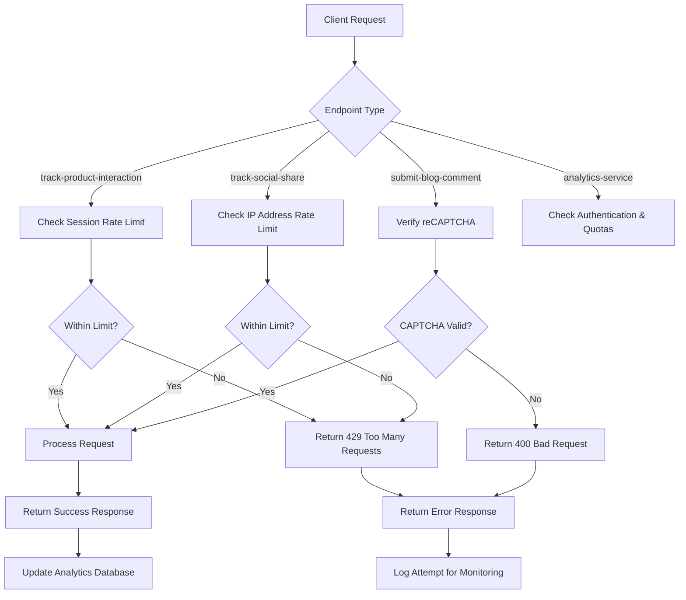
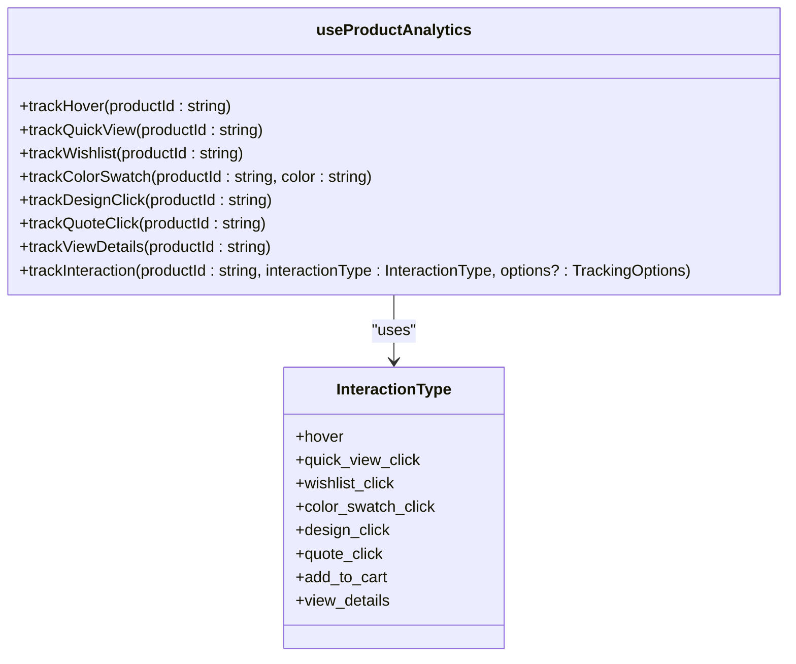
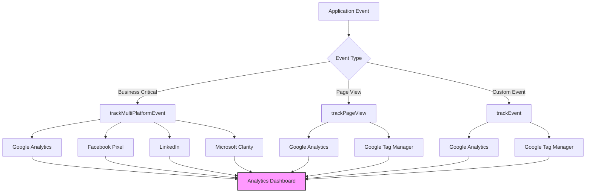
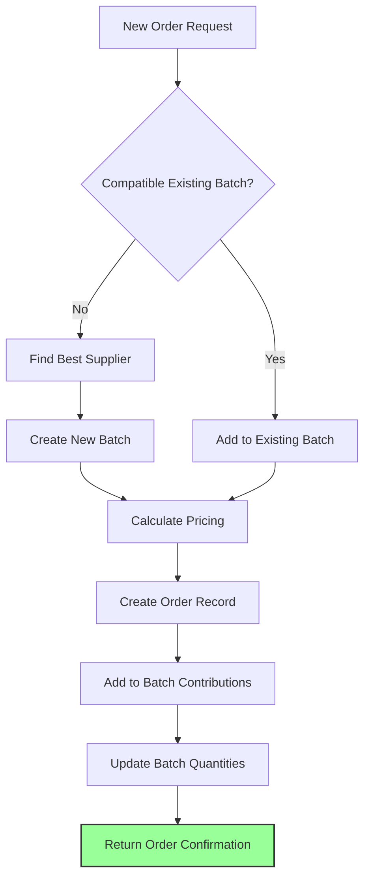
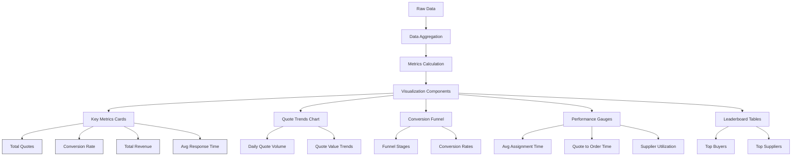

# Analytics and Tracking API

<cite>
**Referenced Files in This Document**   
- [tracker.ts](file://src/lib/analytics/tracker.ts)
- [useProductAnalytics.ts](file://src/hooks/useProductAnalytics.ts)
- [DashboardAnalytics.tsx](file://src/components/admin/DashboardAnalytics.tsx)
- [analytics.ts](file://src/lib/analytics.ts)
- [analyticsTracking.ts](file://src/lib/analyticsTracking.ts)
- [track-product-interaction/index.ts](file://supabase/functions/track-product-interaction/index.ts)
- [track-social-share/index.ts](file://supabase/functions/track-social-share/index.ts)
- [analytics-service/index.ts](file://supabase/functions/analytics-service/index.ts)
- [submit-blog-comment/index.ts](file://supabase/functions/submit-blog-comment/index.ts)
- [batch-processor/index.ts](file://supabase/functions/batch-processor/index.ts)
- [SocialShareButtons.tsx](file://src/components/blog/SocialShareButtons.tsx)
- [RateLimitMonitoringDashboard.tsx](file://src/components/admin/RateLimitMonitoringDashboard.tsx)
</cite>

## Table of Contents
1. [Introduction](#introduction)
2. [Core Tracking Functions](#core-tracking-functions)
3. [HTTP Endpoints and Request Payloads](#http-endpoints-and-request-payloads)
4. [Authentication and Rate Limiting](#authentication-and-rate-limiting)
5. [Event Instrumentation and Hook Integration](#event-instrumentation-and-hook-integration)
6. [Data Privacy and Compliance](#data-privacy-and-compliance)
7. [External Analytics Integration](#external-analytics-integration)
8. [Batch Processing and Data Aggregation](#batch-processing-and-data-aggregation)
9. [Visualization and Dashboarding](#visualization-and-dashboarding)
10. [Error Handling and Monitoring](#error-handling-and-monitoring)

## Introduction
The Analytics and Tracking API in sleekapp-v100 provides comprehensive user engagement monitoring, social sharing tracking, aggregated metrics processing, and user-generated content submission. This system enables data-driven decision making through detailed user behavior analysis while maintaining strict privacy compliance. The architecture combines client-side instrumentation with serverless edge functions to ensure reliable data collection and processing.

**Section sources**
- [tracker.ts](file://src/lib/analytics/tracker.ts#L1-L103)
- [analytics.ts](file://src/lib/analytics.ts#L1-L183)

## Core Tracking Functions

### track-product-interaction
The product interaction tracking system captures user engagement with products across various interaction types. This function records detailed user behavior including hover events, quick view clicks, wishlist additions, color swatch selections, design interactions, quote requests, add-to-cart actions, and detailed view requests. Each interaction is associated with a product ID, interaction type, session ID, and optional additional data.

The system implements deduplication for hover events, ensuring each product's hover interaction is only recorded once per session. This prevents inflated metrics from repeated mouse movements over product elements.

### track-social-share
The social sharing tracking function monitors when users share content on various social media platforms including LinkedIn, Facebook, Twitter, and WhatsApp. This endpoint validates the platform against an approved list and implements rate limiting to prevent abuse. Each share event is recorded with the post ID, platform, IP address, and timestamp.

The system also increments the share count on the associated blog post through a database RPC call, providing real-time visibility into content virality.

### analytics-service
The analytics service provides aggregated metrics processing through AI-powered insights. It supports two primary analysis types: order insights and quality analysis. The service integrates with external AI providers (Lovable AI) to generate actionable recommendations based on production data, quality control results, and order details.

For order insights, the service analyzes order details, production updates, and QC checks to provide delivery predictions, quality forecasts, risk assessments, and management summaries. For quality analysis, it examines defect patterns and QC trends to identify root causes and recommend process improvements.

### submit-blog-comment
The blog comment submission system allows users to contribute content to blog posts with robust security measures. All submissions require reCAPTCHA verification to prevent spam and automated submissions. Comments are stored with author information (name and email) and content, but require administrative approval before publication.

The system supports both authenticated users (who can be linked to their user accounts) and anonymous contributors, providing flexibility while maintaining content quality through the approval workflow.

**Section sources**
- [track-product-interaction/index.ts](file://supabase/functions/track-product-interaction/index.ts#L1-L136)
- [track-social-share/index.ts](file://supabase/functions/track-social-share/index.ts#L1-L129)
- [analytics-service/index.ts](file://supabase/functions/analytics-service/index.ts#L1-L220)
- [submit-blog-comment/index.ts](file://supabase/functions/submit-blog-comment/index.ts#L1-L129)

## HTTP Endpoints and Request Payloads

### track-product-interaction Endpoint
**HTTP Method**: POST
**Endpoint**: `/functions/v1/track-product-interaction`
**Authentication**: Optional (authenticated users tracked with user ID, anonymous users tracked by session)
**Rate Limiting**: 10 events per minute per session

**Request Payload**:
```json
{
  "productId": "string (UUID format)",
  "interactionType": "string (enum: hover, quick_view_click, wishlist_click, color_swatch_click, design_click, quote_click, add_to_cart, view_details)",
  "sessionId": "string",
  "additionalData": "object (optional)"
}
```

**Response Format**:
- Success: 204 No Content
- Validation Error: 400 Bad Request with error message
- Server Error: 500 Internal Server Error

### track-social-share Endpoint
**HTTP Method**: POST
**Endpoint**: `/functions/v1/track-social-share`
**Authentication**: Public access
**Rate Limiting**: 10 shares per IP address per hour

**Request Payload**:
```json
{
  "post_id": "string (UUID format)",
  "platform": "string (enum: linkedin, facebook, twitter, whatsapp)"
}
```

**Response Format**:
- Success: 200 OK with { "success": true }
- Validation Error: 400 Bad Request with error message
- Rate Limit Exceeded: 429 Too Many Requests
- Not Found: 404 Not Found (blog post not found)
- Server Error: 500 Internal Server Error

### analytics-service Endpoint
**HTTP Method**: POST
**Endpoint**: `/functions/v1/analytics-service`
**Authentication**: Required for certain analysis types
**Rate Limiting**: Governed by external AI provider limits

**Request Payload**:
```json
{
  "analysisType": "string (enum: order-insights, quality-analysis)",
  "data": "object (structure varies by analysis type)"
}
```

For order-insights:
```json
{
  "orderData": "object",
  "updates": "array",
  "qcChecks": "array"
}
```

For quality-analysis:
```json
{
  "defects": "array",
  "qcChecks": "array",
  "orderType": "string"
}
```

**Response Format**:
- Success: 200 OK with JSON response containing analysis results
- Invalid Analysis Type: 400 Bad Request
- Rate Limits Exceeded: 429 Too Many Requests
- Payment Required: 402 Payment Required
- Server Error: 500 Internal Server Error

### submit-blog-comment Endpoint
**HTTP Method**: POST
**Endpoint**: `/functions/v1/submit-blog-comment`
**Authentication**: Optional (authenticated users linked to accounts, anonymous allowed)
**Rate Limiting**: Managed through reCAPTCHA

**Request Payload**:
```json
{
  "postId": "string (UUID format)",
  "authorName": "string",
  "authorEmail": "string (valid email format)",
  "content": "string (max 5000 characters)",
  "captchaToken": "string (reCAPTCHA token)"
}
```

**Response Format**:
- Success: 200 OK with { "success": true, "message": "Comment submitted successfully and is pending approval", "comment_id": "string" }
- Validation Error: 400 Bad Request with error message
- CAPTCHA Failure: 400 Bad Request
- Server Error: 500 Internal Server Error

**Section sources**
- [track-product-interaction/index.ts](file://supabase/functions/track-product-interaction/index.ts#L9-L26)
- [track-social-share/index.ts](file://supabase/functions/track-social-share/index.ts#L9-L35)
- [analytics-service/index.ts](file://supabase/functions/analytics-service/index.ts#L10-L14)
- [submit-blog-comment/index.ts](file://supabase/functions/submit-blog-comment/index.ts#L16-L25)

## Authentication and Rate Limiting

### Authentication Requirements
The tracking system implements a tiered authentication approach based on the sensitivity of the data being collected:

- **Public Tracking Endpoints**: `track-product-interaction` and `track-social-share` are publicly accessible to capture user engagement without requiring authentication. These endpoints use session-based tracking for anonymous users.
- **Authenticated Endpoints**: `submit-blog-comment` accepts both authenticated and anonymous submissions. When users are authenticated, their comments are linked to their user accounts, providing better user experience and content attribution.
- **Service-to-Service Authentication**: The `analytics-service` may require authentication for certain operations, particularly when accessing protected data or performing administrative functions.

The system extracts user IDs from authorization headers when present, allowing for identified tracking of authenticated users while maintaining anonymous tracking capabilities for unauthenticated users.

### Rate Limiting Implementation
The analytics system implements comprehensive rate limiting to prevent abuse and ensure service availability:

- **Per-Session Rate Limiting**: The `track-product-interaction` endpoint limits tracking events to 10 per minute per session. This prevents excessive event submission from any single user session while allowing normal user behavior.
- **IP-Based Rate Limiting**: The `track-social-share` endpoint implements rate limiting at 10 shares per hour per IP address. This prevents automated sharing scripts from overwhelming the system.
- **Monitoring Dashboard**: The system includes a `RateLimitMonitoringDashboard` component that provides real-time visibility into rate limit usage across all protected endpoints, including OTP, conversation, wishlist, and AI quote rate limits.

The rate limiting is implemented at the edge function level, with checks performed before database operations to minimize resource consumption from abusive requests. When rate limits are exceeded, the system returns appropriate HTTP status codes (429 Too Many Requests) with descriptive error messages.



**Diagram sources**
- [track-product-interaction/index.ts](file://supabase/functions/track-product-interaction/index.ts#L52-L57)
- [track-social-share/index.ts](file://supabase/functions/track-social-share/index.ts#L52-L71)
- [submit-blog-comment/index.ts](file://supabase/functions/submit-blog-comment/index.ts#L27-L52)
- [RateLimitMonitoringDashboard.tsx](file://src/components/admin/RateLimitMonitoringDashboard.tsx#L32-L37)

**Section sources**
- [track-product-interaction/index.ts](file://supabase/functions/track-product-interaction/index.ts#L52-L57)
- [track-social-share/index.ts](file://supabase/functions/track-social-share/index.ts#L52-L71)
- [submit-blog-comment/index.ts](file://supabase/functions/submit-blog-comment/index.ts#L27-L52)
- [RateLimitMonitoringDashboard.tsx](file://src/components/admin/RateLimitMonitoringDashboard.tsx#L1-L204)

## Event Instrumentation and Hook Integration

### tracker.ts Implementation
The `tracker.ts` file provides client-side utilities for user analytics and behavior tracking. It includes functions for tracking various user events such as page views, bounce rates, quote generation attempts, and signups. The system generates and manages session IDs using sessionStorage, ensuring consistent tracking within a browsing session.

Key features include:
- Session ID generation and persistence
- Environment-aware logging (console output in development only)
- Modular event tracking functions for different user actions
- Disabled country tracking to prevent CORS issues

The tracking functions are designed to be non-blocking, with error handling that prevents tracking failures from impacting user experience.

### useProductAnalytics Hook
The `useProductAnalytics` hook provides a React-friendly interface for product interaction tracking. It encapsulates the complexity of the tracking system, offering specific functions for different interaction types:



**Diagram sources**
- [useProductAnalytics.ts](file://src/hooks/useProductAnalytics.ts#L4-L12)
- [useProductAnalytics.ts](file://src/hooks/useProductAnalytics.ts#L67-L112)

The hook manages state for tracking purposes:
- `trackedHovers`: A Set that prevents duplicate hover tracking for the same product in a session
- `sessionId`: A stable session ID generated on first use and persisted in sessionStorage

Each tracking function calls the core `trackInteraction` method with the appropriate interaction type, which then invokes the Supabase edge function `track-product-interaction`. The hook implements error handling that logs failures to the console but does not disrupt the user experience.

### Integration Example
To integrate product analytics in a component:

```typescript
import { useProductAnalytics } from '@/hooks/useProductAnalytics';

function ProductCard({ product }) {
  const { 
    trackHover, 
    trackQuickView, 
    trackWishlist,
    trackQuoteClick 
  } = useProductAnalytics();
  
  return (
    <div 
      onMouseEnter={() => trackHover(product.id)}
      className="product-card"
    >
      <button onClick={() => trackQuickView(product.id)}>
        Quick View
      </button>
      <button onClick={() => trackWishlist(product.id)}>
        Add to Wishlist
      </button>
      <button onClick={() => trackQuoteClick(product.id)}>
        Get Quote
      </button>
    </div>
  );
}
```

This pattern allows for easy instrumentation of product interactions throughout the application while maintaining clean separation between UI components and analytics logic.

**Section sources**
- [tracker.ts](file://src/lib/analytics/tracker.ts#L1-L103)
- [useProductAnalytics.ts](file://src/hooks/useProductAnalytics.ts#L1-L114)

## Data Privacy and Compliance

### GDPR Compliance Measures
The analytics system implements comprehensive GDPR compliance measures to protect user privacy and ensure legal compliance:

- **Anonymous vs. Identified Tracking**: The system distinguishes between anonymous tracking (using session IDs) and identified tracking (linked to authenticated user accounts). Users must be informed about both types of tracking through the CookieConsentBanner component.
- **Data Minimization**: The system collects only necessary data for analytics purposes, avoiding excessive personal information collection.
- **User Rights Support**: The architecture supports GDPR user rights including access, rectification, erasure, and data portability through the Supabase database structure and admin interfaces.
- **Lawful Basis**: Tracking is implemented with appropriate lawful bases, including legitimate interest for anonymous analytics and consent for more intrusive tracking.

### Data Retention Policies
The system implements strict data retention policies to minimize privacy risks:

- **Session Data**: Session IDs are stored in sessionStorage, which is cleared when the browsing session ends.
- **Event Data**: Analytics event data is retained for a defined period (implementation-specific) after which it is automatically purged or anonymized.
- **User Data**: Personally identifiable information associated with comments and authenticated tracking is retained only as long as necessary for business purposes or as required by law.

The system does not currently implement automated data deletion processes, but the Supabase backend provides the foundation for implementing such features.

### Privacy by Design
The analytics architecture incorporates privacy by design principles:

- **Default Anonymity**: Users are tracked anonymously by default, with identified tracking only occurring when users are authenticated.
- **Opt-out Capabilities**: While not explicitly implemented in the provided code, the system structure supports future implementation of user opt-out mechanisms.
- **Data Security**: All data transmission occurs over HTTPS, and sensitive operations are protected by authentication and rate limiting.
- **Third-party Integration**: External analytics providers (Google Analytics, Facebook Pixel, LinkedIn) are integrated through a controlled data layer, allowing for centralized management of external data sharing.

The system avoids collecting sensitive personal data such as precise geolocation, health information, or biometric data, focusing instead on behavioral analytics that do not require highly sensitive information.

**Section sources**
- [tracker.ts](file://src/lib/analytics/tracker.ts#L7-L21)
- [analyticsTracking.ts](file://src/lib/analyticsTracking.ts#L25-L30)
- [submit-blog-comment/index.ts](file://supabase/functions/submit-blog-comment/index.ts#L17-L25)

## External Analytics Integration

### Multi-Platform Tracking
The analytics system integrates with multiple external analytics platforms to provide comprehensive insights across different marketing and engagement channels:

- **Google Analytics 4**: Configured with measurement ID G-1PYKLMP22J for web analytics and user behavior tracking.
- **Google Tag Manager**: Implemented with container ID GTM-WGTH2FQ9 for centralized tag management and deployment.
- **Microsoft Clarity**: Integrated with project ID txi3rcrykl for session recording and heatmaps.
- **Facebook Pixel**: Configured with ID 1165081028902190 for conversion tracking and ad optimization.
- **LinkedIn Insight Tag**: Set up with partner ID 514756254 for B2B marketing analytics.

### Data Layer Architecture
The system implements a robust data layer architecture using the `pushToDataLayer` function, which pushes events to the GTM dataLayer for distribution to configured analytics platforms. This centralized approach ensures consistent event tracking across all integrated services.

The `trackMultiPlatformEvent` utility provides coordinated tracking across multiple platforms for key business events:
- **Quote Requests**: Tracked in Google Analytics, Facebook Pixel, LinkedIn, and Microsoft Clarity
- **Contact Form Submissions**: Tracked across all integrated platforms
- **Signup Completions**: Tracked in Facebook Pixel, LinkedIn, and Microsoft Clarity

This multi-platform approach provides redundancy and comprehensive coverage, ensuring that critical conversion events are captured even if one analytics service experiences issues.

### Implementation Strategy
The external analytics integration follows a non-blocking, fail-safe approach:

- **Graceful Degradation**: If external analytics services are unavailable, tracking failures are logged but do not impact user experience.
- **Environment Control**: Analytics are typically disabled in development environments to prevent test data from contaminating production analytics.
- **Performance Optimization**: The system uses asynchronous loading and execution to prevent analytics scripts from blocking page rendering.
- **Consent Management**: The CookieConsentBanner component suggests that user consent is obtained before enabling non-essential analytics tracking, supporting GDPR and similar privacy regulations.

The integration is designed to be extensible, allowing for additional analytics providers to be added through the existing framework without requiring changes to application code.



**Diagram sources**
- [analytics.ts](file://src/lib/analytics.ts#L1-L183)
- [analyticsTracking.ts](file://src/lib/analyticsTracking.ts#L1-L68)

**Section sources**
- [analytics.ts](file://src/lib/analytics.ts#L1-L183)
- [analyticsTracking.ts](file://src/lib/analyticsTracking.ts#L1-L149)

## Batch Processing and Data Aggregation

### batch-processor Function
The `batch-processor` edge function orchestrates the processing of production batches and order fulfillment. This system implements a sophisticated batch orchestration logic that optimizes production efficiency and cost-effectiveness.

Key capabilities include:
- **Batch Orchestration**: Automatically manages the lifecycle of production batches, including filling, confirmation, and cancellation.
- **Order Processing**: Handles individual order requests by either adding them to existing compatible batches or creating new batches.
- **Supplier Matching**: Identifies the most suitable supplier for a production batch based on pricing, capacity, and specialization.
- **Pricing Calculation**: Integrates with the pricing-calculator function to determine accurate pricing for batch orders.

### Batch Lifecycle Management
The system implements intelligent batch management rules:
- **Auto-Confirmation**: Batches that reach 75% or more of their target quantity are automatically confirmed, even if the window has closed.
- **Admin Review**: Batches between 50-75% filled with closed windows are flagged for administrative review, allowing human decision-making for borderline cases.
- **Cancellation**: Batches below 50% filled with closed windows are automatically cancelled, and associated orders are refunded.
- **Promotion Trigger**: Batches approaching 60% fill rate trigger notifications suggesting promotional activities to reach target quantities.

This automated decision-making system balances efficiency with business objectives, minimizing manual intervention while ensuring optimal production planning.

### Data Aggregation Workflow
The batch processing system follows a comprehensive workflow:



**Diagram sources**
- [batch-processor/index.ts](file://supabase/functions/batch-processor/index.ts#L178-L343)

The system maintains referential integrity between orders, batches, and batch contributions, enabling comprehensive reporting and analytics on production efficiency, supplier performance, and order fulfillment metrics.

**Section sources**
- [batch-processor/index.ts](file://supabase/functions/batch-processor/index.ts#L1-L346)

## Visualization and Dashboarding

### DashboardAnalytics Component
The `DashboardAnalytics` component provides comprehensive visualization of key business metrics and performance indicators. This admin-facing dashboard consolidates data from multiple sources to provide actionable insights for business decision-making.

Key features include:
- **Time Range Selection**: Users can view metrics for different time periods (today, week, month, quarter, year, all time).
- **Key Performance Indicators**: Displays critical metrics such as total quotes, conversion rate, total revenue, and average response time.
- **Conversion Funnel Analysis**: Visualizes the quote conversion funnel from initial request to order conversion.
- **Performance Metrics**: Tracks efficiency metrics like average assignment time, quote-to-order time, and supplier utilization.
- **Leaderboards**: Ranks top buyers and suppliers by revenue and order volume.

### Data Visualization Approach
The dashboard implements a multi-layered visualization strategy:



**Diagram sources**
- [DashboardAnalytics.tsx](file://src/components/admin/DashboardAnalytics.tsx#L79-L281)

The component uses React Query for efficient data fetching and caching, ensuring responsive performance even with large datasets. It implements loading states and error handling to provide a smooth user experience.

### Real-time Monitoring
The system includes specialized monitoring dashboards such as the `RateLimitMonitoringDashboard`, which provides real-time visibility into API usage patterns and potential abuse. This component displays metrics for various rate-limited endpoints, including OTP, conversation, wishlist, and AI quote services.

The monitoring dashboard features:
- **Real-time Updates**: Automatically refreshes every 30 seconds to provide current data.
- **Alert System**: Displays warnings when rate limits are approaching capacity.
- **Detailed Metrics**: Shows total requests, unique identifiers, maximum requests per identifier, and average requests per identifier.
- **Status Indicators**: Uses color-coded icons to indicate normal, warning, and critical states.

These visualization tools enable administrators to monitor system health, identify trends, and respond proactively to potential issues.

**Section sources**
- [DashboardAnalytics.tsx](file://src/components/admin/DashboardAnalytics.tsx#L1-L784)
- [RateLimitMonitoringDashboard.tsx](file://src/components/admin/RateLimitMonitoringDashboard.tsx#L1-L204)

## Error Handling and Monitoring

### Error Handling Strategies
The analytics system implements comprehensive error handling to ensure reliability and maintain user experience:

- **Client-Side Resilience**: The `useProductAnalytics` hook implements try-catch blocks around all tracking operations, preventing tracking failures from disrupting the user interface.
- **Server-Side Graceful Degradation**: Edge functions return 204 No Content responses even when database insertion fails, ensuring that tracking requests do not block user actions.
- **Silent Failure**: Client-side tracking errors are logged to the console but do not display error messages to users, maintaining a seamless experience.
- **Comprehensive Validation**: Server endpoints implement thorough input validation, returning appropriate HTTP status codes and error messages for invalid requests.

### Monitoring and Logging
The system includes robust monitoring capabilities:

- **Console Logging**: Development environments include detailed console logging for debugging and verification.
- **Error Tracking**: Server functions log errors to the console for monitoring and troubleshooting.
- **Rate Limit Monitoring**: The dedicated dashboard provides real-time visibility into API usage patterns.
- **Performance Monitoring**: The system tracks key performance metrics to identify potential bottlenecks.

### Tracking Accuracy Assurance
To ensure tracking accuracy, the system implements several validation mechanisms:

- **Input Validation**: All endpoints validate incoming data for required fields, correct formats, and acceptable values.
- **Deduplication**: The product interaction tracker prevents duplicate hover events within the same session.
- **Data Integrity**: Database constraints and foreign key relationships maintain data consistency.
- **Rate Limit Enforcement**: Prevents artificial inflation of metrics through automated requests.

The combination of client-side instrumentation, server-side validation, and comprehensive monitoring ensures reliable and accurate tracking data for business intelligence purposes.

**Section sources**
- [useProductAnalytics.ts](file://src/hooks/useProductAnalytics.ts#L39-L63)
- [track-product-interaction/index.ts](file://supabase/functions/track-product-interaction/index.ts#L130-L134)
- [track-social-share/index.ts](file://supabase/functions/track-social-share/index.ts#L121-L127)
- [submit-blog-comment/index.ts](file://supabase/functions/submit-blog-comment/index.ts#L121-L127)