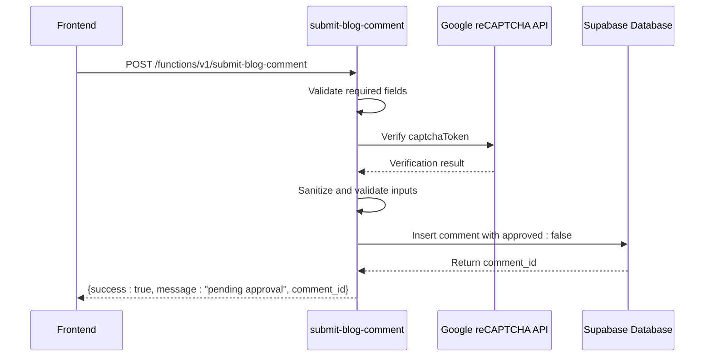
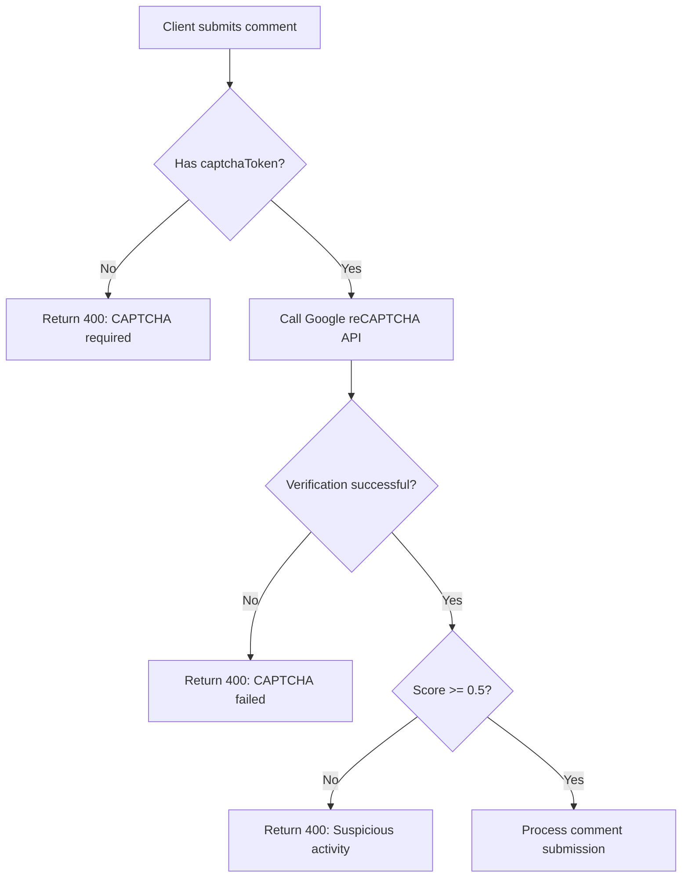
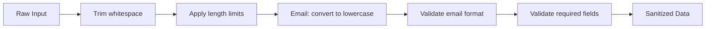
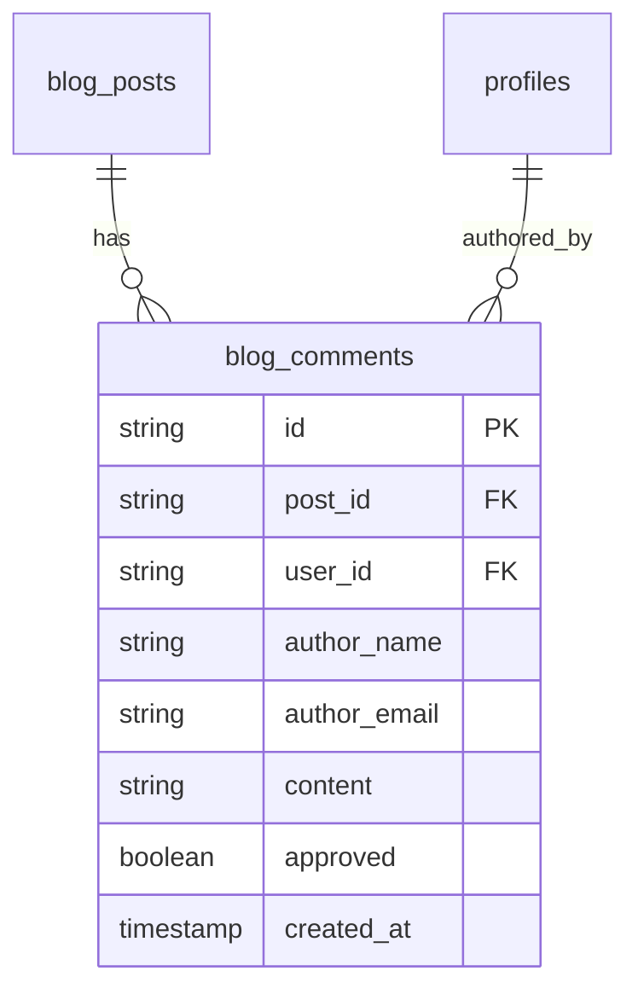
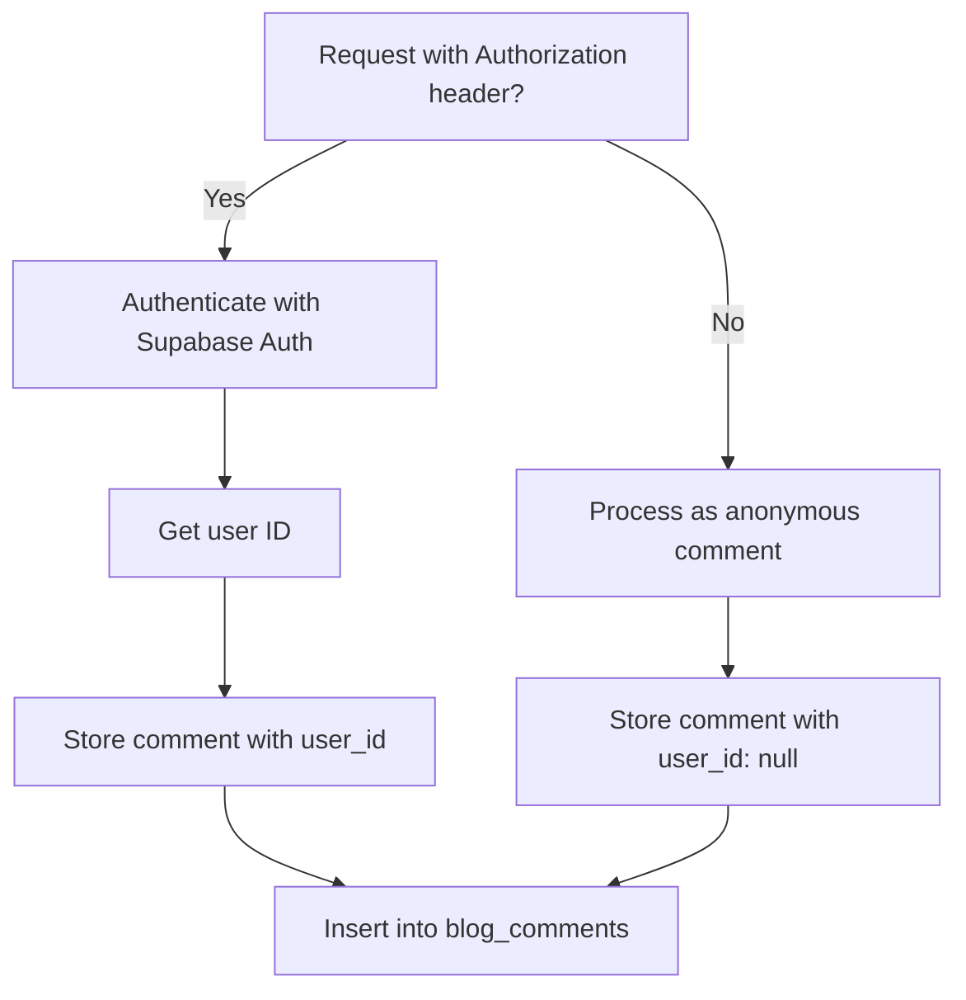

# Blog Comment Analytics

<cite>
**Referenced Files in This Document**   
- [submit-blog-comment/index.ts](file://supabase/functions/submit-blog-comment/index.ts)
- [BlogEditor.tsx](file://src/components/blog/BlogEditor.tsx)
- [AdminBlogEditor.tsx](file://src/pages/AdminBlogEditor.tsx)
- [types.ts](file://src/integrations/supabase/types.ts)
- [BASE_MIGRATION_SAFE.sql](file://supabase/BASE_MIGRATION_SAFE.sql)
</cite>

## Table of Contents
1. [Introduction](#introduction)
2. [Comment Submission Endpoint](#comment-submission-endpoint)
3. [reCAPTCHA Verification Process](#recaptcha-verification-process)
4. [Input Sanitization and Validation](#input-sanitization-and-validation)
5. [Database Schema and Storage](#database-schema-and-storage)
6. [Authentication Mechanism](#authentication-mechanism)
7. [Moderation Workflow](#moderation-workflow)
8. [Frontend Integration](#frontend-integration)
9. [Data Privacy Considerations](#data-privacy-considerations)

## Introduction
The blog comment system in sleekapp-v100 provides a secure and moderated platform for user engagement with blog content. This documentation details the implementation of the `submit-blog-comment` edge function that handles user-generated comments with comprehensive security measures including reCAPTCHA verification, input sanitization, and a moderation workflow. The system supports both authenticated users and anonymous commenters while ensuring data integrity and privacy compliance.

## Comment Submission Endpoint
The comment submission system exposes an HTTP POST endpoint through the `submit-blog-comment` edge function, which processes incoming comment requests with strict validation and security checks.

**Diagram sources**
- [submit-blog-comment/index.ts](file://supabase/functions/submit-blog-comment/index.ts#L17-L119)

**Section sources**
- [submit-blog-comment/index.ts](file://supabase/functions/submit-blog-comment/index.ts#L17-L119)

## reCAPTCHA Verification Process
The system implements Google's reCAPTCHA v3 for bot protection, requiring clients to provide a valid captcha token that is verified server-side before processing the comment.

The edge function extracts the `RECAPTCHA_SECRET_KEY` from environment variables and sends a POST request to Google's siteverify API with both the secret key and the user-provided token. The verification process evaluates both the success status and the risk score (requiring a minimum score of 0.5) to determine if the request appears to come from a legitimate user. This security measure prevents automated spam submissions while maintaining a frictionless experience for genuine users.

**Diagram sources**
- [submit-blog-comment/index.ts](file://supabase/functions/submit-blog-comment/index.ts#L35-L52)

**Section sources**
- [submit-blog-comment/index.ts](file://supabase/functions/submit-blog-comment/index.ts#L35-L52)

## Input Sanitization and Validation
The system implements comprehensive input sanitization and validation to ensure data integrity and security across all comment fields.

### Input Processing
- **Content**: Trimmed of whitespace and limited to 5000 characters maximum
- **Author Name**: Trimmed and limited to 100 characters maximum  
- **Author Email**: Trimmed, converted to lowercase, and limited to 255 characters maximum

### Validation Rules
- Required fields validation for postId, authorName, authorEmail, and content
- Email format validation using regex pattern `/^[^\s@]+@[^\s@]+\.[^\s@]+$/`
- Server-side validation prevents bypassing client-side checks

**Diagram sources**
- [submit-blog-comment/index.ts](file://supabase/functions/submit-blog-comment/index.ts#L54-L66)

**Section sources**
- [submit-blog-comment/index.ts](file://supabase/functions/submit-blog-comment/index.ts#L54-L66)

## Database Schema and Storage
Comments are stored in the `blog_comments` table with a moderation-first approach, where all submissions are initially marked as unapproved.

### Table Schema

### Field Specifications
- **id**: UUID primary key, auto-generated
- **post_id**: Foreign key to blog_posts.id, required
- **user_id**: Foreign key to profiles.id, nullable for anonymous comments
- **author_name**: Text, required, max 100 characters
- **author_email**: Text, required, max 255 characters  
- **content**: Text, required, max 5000 characters
- **approved**: Boolean, default false (pending moderation)
- **created_at**: Timestamp with time zone, default current time

**Diagram sources**
- [types.ts](file://src/integrations/supabase/types.ts#L389-L428)
- [BASE_MIGRATION_SAFE.sql](file://supabase/BASE_MIGRATION_SAFE.sql#L173-L182)

**Section sources**
- [types.ts](file://src/integrations/supabase/types.ts#L389-L428)
- [BASE_MIGRATION_SAFE.sql](file://supabase/BASE_MIGRATION_SAFE.sql#L173-L182)

## Authentication Mechanism
The system supports dual authentication methods, allowing both authenticated users and anonymous commenters to submit comments.

The edge function checks for an Authorization header in the request. When present, it uses the SUPABASE_ANON_KEY to authenticate the user token and retrieve the user ID from Supabase Auth. This user ID is then stored with the comment to associate it with the authenticated account. When no Authorization header is present, the comment is processed as anonymous with a null user_id, while still requiring all other fields including reCAPTCHA verification.

**Diagram sources**
- [submit-blog-comment/index.ts](file://supabase/functions/submit-blog-comment/index.ts#L73-L88)

**Section sources**
- [submit-blog-comment/index.ts](file://supabase/functions/submit-blog-comment/index.ts#L73-L88)

## Moderation Workflow
All comments enter a moderation workflow by default, requiring administrative approval before becoming visible on the site.

When a comment is submitted, it is inserted into the database with `approved: false`. Administrators can review pending comments through the AdminBlogEditor interface, where they can approve or reject comments. The system is designed with security policies that restrict direct database INSERT operations from the public, ensuring all comments must pass through the edge function which enforces the moderation requirement.

The migration script `20251121151938_f8ef64fa-2788-4f5f-97ae-0cc88e97b4dc.sql` explicitly removes public INSERT policies on the blog_comments table, reinforcing that only edge functions and administrators can manage comment data.

**Section sources**
- [submit-blog-comment/index.ts](file://supabase/functions/submit-blog-comment/index.ts#L99)
- [20251121151938_f8ef64fa-2788-4f5f-97ae-0cc88e97b4dc.sql](file://supabase/migrations/20251121151938_f8ef64fa-2788-4f5f-97ae-0cc88e97b4dc.sql#L20-L30)

## Frontend Integration
The frontend implementation demonstrates how the comment system integrates with the blog editor interface, providing a seamless experience for content creators and commenters.

While the BlogEditor component focuses on blog post creation and management, it follows the same security patterns as the comment system with proper form validation and error handling. The AdminBlogEditor provides administrators with tools to manage content, including the moderation interface for comments (though the specific comment moderation UI is not shown in the provided files).

The system architecture ensures separation of concerns between content creation (handled by editors) and user engagement (handled by the comment system), while maintaining consistent security practices across both interfaces.

**Section sources**
- [BlogEditor.tsx](file://src/components/blog/BlogEditor.tsx#L1-L297)
- [AdminBlogEditor.tsx](file://src/pages/AdminBlogEditor.tsx#L1-L326)

## Data Privacy Considerations
The comment system implements several data privacy measures to protect user information in compliance with privacy regulations.

Personal information (author name and email) is stored in the database but is only used for comment attribution and moderation purposes. The system does not publicly display email addresses, and administrators are expected to handle this data responsibly. Email addresses are normalized to lowercase to ensure consistency and are validated with a strict regex pattern to prevent malformed entries.

The retention of personal data follows the principle of data minimization, collecting only what is necessary for the comment functionality. The moderation workflow provides an additional privacy control layer, as comments are not published until approved, preventing potentially sensitive information from being publicly exposed without review.

**Section sources**
- [submit-blog-comment/index.ts](file://supabase/functions/submit-blog-comment/index.ts#L57-L66)
- [types.ts](file://src/integrations/supabase/types.ts#L392-L393)