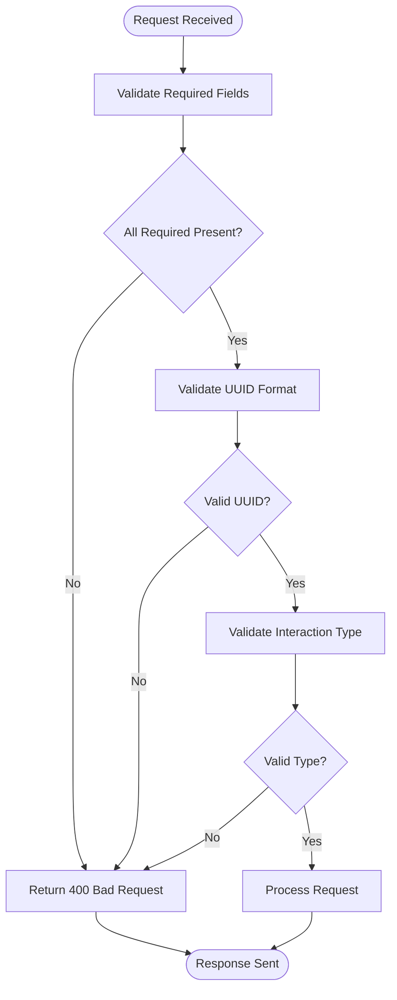
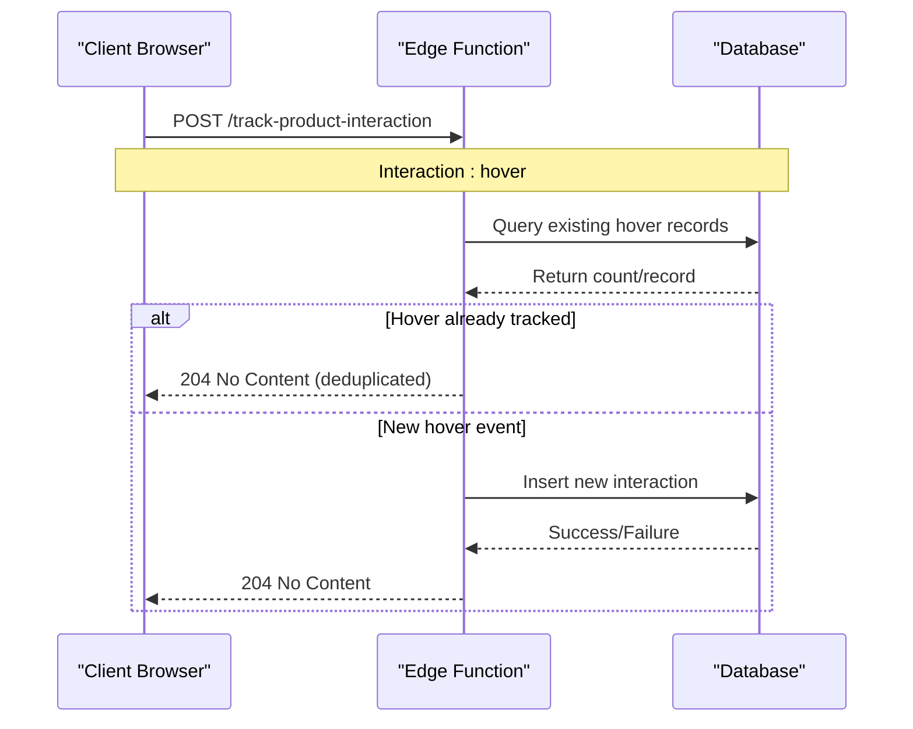
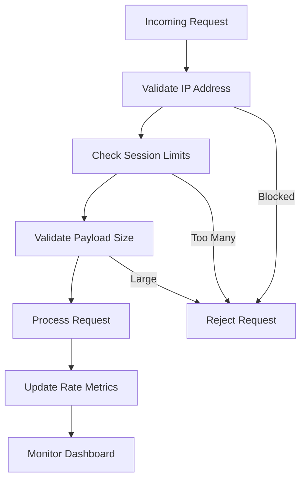

# Product Interaction Tracking API Documentation

<cite>
**Referenced Files in This Document**
- [supabase/functions/track-product-interaction/index.ts](file://supabase/functions/track-product-interaction/index.ts)
- [src/hooks/useProductAnalytics.ts](file://src/hooks/useProductAnalytics.ts)
- [src/lib/analytics/tracker.ts](file://src/lib/analytics/tracker.ts)
- [src/integrations/supabase/client.ts](file://src/integrations/supabase/client.ts)
- [src/integrations/supabase/types.ts](file://src/integrations/supabase/types.ts)
- [supabase/migrations/20251117015024_d47b7ef9-be84-43eb-9ec4-b93c55d353e8.sql](file://supabase/migrations/20251117015024_d47b7ef9-be84-43eb-9ec4-b93c55d353e8.sql)
- [src/components/admin/RateLimitMonitoringDashboard.tsx](file://src/components/admin/RateLimitMonitoringDashboard.tsx)
</cite>

## Table of Contents
1. [Introduction](#introduction)
2. [API Endpoint Overview](#api-endpoint-overview)
3. [Request Structure](#request-structure)
4. [Response Format](#response-format)
5. [Validation Rules](#validation-rules)
6. [Database Schema](#database-schema)
7. [Authentication & Authorization](#authentication--authorization)
8. [Deduplication Logic](#deduplication-logic)
9. [Performance Architecture](#performance-architecture)
10. [Hook Implementation](#hook-implementation)
11. [Rate Limiting Considerations](#rate-limiting-considerations)
12. [Error Handling](#error-handling)
13. [Data Privacy & Security](#data-privacy--security)
14. [Monitoring & Analytics](#monitoring--analytics)
15. [Troubleshooting Guide](#troubleshooting-guide)

## Introduction

The Product Interaction Tracking system is a comprehensive analytics solution built on Supabase Edge Functions that captures user engagement events across the Sleek Apparels platform. This system enables real-time tracking of product interactions while maintaining high performance through asynchronous fire-and-forget patterns and robust deduplication logic.

The system tracks eight distinct interaction types: `hover`, `quick_view_click`, `wishlist_click`, `color_swatch_click`, `design_click`, `quote_click`, `add_to_cart`, and `view_details`. It provides both anonymous and authenticated tracking capabilities with sophisticated privacy controls and performance optimizations.

## API Endpoint Overview

### HTTP POST Endpoint
```
POST https://your-supabase-url/functions/v1/track-product-interaction
```

### Headers Required
```http
Content-Type: application/json
Accept: application/json
Origin: https://your-domain.com
```

### CORS Configuration
The endpoint supports cross-origin requests with the following headers:
- `Access-Control-Allow-Origin: *`
- `Access-Control-Allow-Headers: authorization, x-client-info, apikey, content-type`

**Section sources**
- [supabase/functions/track-product-interaction/index.ts](file://supabase/functions/track-product-interaction/index.ts#L4-L7)

## Request Structure

### Payload Definition

```typescript
interface TrackingRequest {
  productId: string;           // UUID format required
  interactionType: string;     // Valid interaction type
  sessionId: string;           // Session identifier
  additionalData?: Record<string, any>; // Optional metadata
}
```

### Interaction Types

The system recognizes eight specific interaction types:

| Interaction Type | Description | Use Case |
|------------------|-------------|----------|
| `hover` | Mouse hover over product | Engagement tracking |
| `quick_view_click` | Click on quick view button | Product exploration |
| `wishlist_click` | Add/remove from wishlist | Interest indication |
| `color_swatch_click` | Select product color | Personalization |
| `design_click` | Access design studio | Creative engagement |
| `quote_click` | Request price quote | Sales funnel |
| `add_to_cart` | Add to shopping cart | Purchase intent |
| `view_details` | View full product page | Conversion tracking |

### Example Request Payload

```json
{
  "productId": "123e4567-e89b-12d3-a456-426614174000",
  "interactionType": "hover",
  "sessionId": "session_1700000000000_abc123def456",
  "additionalData": {
    "color": "navy",
    "durationSeconds": 2.5,
    "viewportWidth": 1920,
    "viewportHeight": 1080
  }
}
```

**Section sources**
- [supabase/functions/track-product-interaction/index.ts](file://supabase/functions/track-product-interaction/index.ts#L9-L14)
- [src/hooks/useProductAnalytics.ts](file://src/hooks/useProductAnalytics.ts#L4-L12)

## Response Format

### Standard Response
The endpoint returns a `204 No Content` response for successful tracking operations, regardless of whether the interaction was recorded or deduplicated.

```http
HTTP/1.1 204 No Content
Access-Control-Allow-Origin: *
Content-Length: 0
```

### Error Responses
For invalid requests, the endpoint returns appropriate HTTP status codes with error details:

```http
HTTP/1.1 400 Bad Request
Content-Type: application/json

{
  "error": "Missing required fields: productId, interactionType, sessionId"
}
```

**Section sources**
- [supabase/functions/track-product-interaction/index.ts](file://supabase/functions/track-product-interaction/index.ts#L45-L48)
- [supabase/functions/track-product-interaction/index.ts](file://supabase/functions/track-product-interaction/index.ts#L127-L128)

## Validation Rules

### Field Validation

#### Required Fields
- `productId`: Must be present and valid UUID format
- `interactionType`: Must be one of the predefined interaction types
- `sessionId`: Must be present and non-empty

#### UUID Format Validation
The system validates product IDs using a strict UUID regex pattern:
```regex
^[0-9a-f]{8}-[0-9a-f]{4}-[0-9a-f]{4}-[0-9a-f]{4}-[0-9a-f]{12}$i
```

#### Interaction Type Validation
Only predefined interaction types are accepted:
```typescript
const VALID_INTERACTION_TYPES = [
  'hover', 'quick_view_click', 'wishlist_click', 
  'color_swatch_click', 'design_click', 'quote_click', 
  'add_to_cart', 'view_details'
];
```

### Validation Flow



**Diagram sources**
- [supabase/functions/track-product-interaction/index.ts](file://supabase/functions/track-product-interaction/index.ts#L43-L66)

**Section sources**
- [supabase/functions/track-product-interaction/index.ts](file://supabase/functions/track-product-interaction/index.ts#L16-L26)
- [supabase/functions/track-product-interaction/index.ts](file://supabase/functions/track-product-interaction/index.ts#L59-L66)

## Database Schema

### Table Structure

The `product_interactions` table stores all tracking data with comprehensive indexing for performance:

```sql
CREATE TABLE public.product_interactions (
  id UUID PRIMARY KEY DEFAULT gen_random_uuid(),
  user_id UUID,                                    -- Authenticated user
  session_id TEXT NOT NULL,                        -- Anonymous session
  product_id UUID NOT NULL,                        -- Related product
  interaction_type product_interaction_type NOT NULL, -- Interaction type
  timestamp TIMESTAMP WITH TIME ZONE DEFAULT now() NOT NULL,
  additional_data JSONB DEFAULT '{}'::jsonb,       -- Extra metadata
  ip_address TEXT,                                 -- Client IP
  user_agent TEXT,                                 -- Browser/device info
  referrer TEXT                                    -- Referring page
);
```

### Indexes for Performance

| Index Name | Columns | Purpose |
|------------|---------|---------|
| `idx_product_interactions_product_id` | `product_id` | Fast product queries |
| `idx_product_interactions_session_id` | `session_id` | Session-based analytics |
| `idx_product_interactions_user_id` | `user_id` | User-specific queries |
| `idx_product_interactions_timestamp` | `timestamp DESC` | Recent activity sorting |
| `idx_product_interactions_type` | `interaction_type` | Type-based filtering |
| `idx_product_interactions_composite` | `(product_id, interaction_type, timestamp DESC)` | Optimal analytics queries |

### Row Level Security (RLS)

The system implements granular access control:

```sql
-- Public insert access for anonymous tracking
CREATE POLICY "Anyone can insert product interactions"
  ON public.product_interactions
  FOR INSERT
  WITH CHECK (true);

-- Admin-only read access
CREATE POLICY "Admins can view all interactions"
  ON public.product_interactions
  FOR SELECT
  USING (has_role(auth.uid(), 'admin'::app_role));

-- User-specific read access
CREATE POLICY "Users can view their own interactions"
  ON public.product_interactions
  FOR SELECT
  USING (auth.uid() = user_id);
```

**Section sources**
- [supabase/migrations/20251117015024_d47b7ef9-be84-43eb-9ec4-b93c55d353e8.sql](file://supabase/migrations/20251117015024_d47b7ef9-be84-43eb-9ec4-b93c55d353e8.sql#L13-L34)
- [supabase/migrations/20251117015024_d47b7ef9-be84-43eb-9ec4-b93c55d353e8.sql#L39-L56)

## Authentication & Authorization

### Service Role Access

The edge function uses the Supabase service role key for direct database access:

```typescript
const supabaseUrl = Deno.env.get('SUPABASE_URL')!;
const supabaseKey = Deno.env.get('SUPABASE_SERVICE_ROLE_KEY')!;
const supabase = createClient(supabaseUrl, supabaseKey);
```

### Authentication Detection

The system automatically detects authenticated users:

```typescript
const authHeader = req.headers.get('authorization');
let userId: string | null = null;

if (authHeader) {
  try {
    const token = authHeader.replace('Bearer ', '');
    const { data: { user } } = await supabase.auth.getUser(token);
    userId = user?.id || null;
  } catch (error) {
    console.log('No authenticated user, tracking as anonymous');
  }
}
```

### Anonymous vs Authenticated Tracking

| Feature | Anonymous Tracking | Authenticated Tracking |
|---------|-------------------|------------------------|
| Session ID | Generated client-side | Session-based |
| User ID | Not available | Available for user analytics |
| Persistence | Session storage | Persistent across sessions |
| Privacy | Higher | Enables personalized features |
| GDPR Compliance | Easier to delete | Requires consent management |

**Section sources**
- [supabase/functions/track-product-interaction/index.ts](file://supabase/functions/track-product-interaction/index.ts#L72-L85)

## Deduplication Logic

### Hover Event Deduplication

The system implements sophisticated deduplication for hover events to prevent data inflation:



**Diagram sources**
- [supabase/functions/track-product-interaction/index.ts](file://supabase/functions/track-product-interaction/index.ts#L87-L102)

### Deduplication Criteria

For hover events, the system checks:
- Same `product_id`
- Same `session_id`
- Same `interaction_type`

For other interaction types, deduplication occurs at the database level through the composite index and RLS policies.

### Client-Side Deduplication

The React hook also implements client-side deduplication:

```typescript
// Client-side hover deduplication
if (interactionType === 'hover') {
  const hoverKey = `${productId}_hover`;
  if (trackedHovers.current.has(hoverKey)) {
    return; // Already tracked
  }
  trackedHovers.current.add(hoverKey);
}
```

**Section sources**
- [supabase/functions/track-product-interaction/index.ts](file://supabase/functions/track-product-interaction/index.ts#L87-L102)
- [src/hooks/useProductAnalytics.ts](file://src/hooks/useProductAnalytics.ts#L40-L47)

## Performance Architecture

### Fire-and-Forget Pattern

The system uses an asynchronous insertion pattern for optimal performance:

```typescript
// Fire-and-forget insertion
const insertPromise = supabase.from('product_interactions').insert({
  user_id: userId,
  session_id: sessionId,
  product_id: productId,
  interaction_type: interactionType,
  additional_data: additionalData || {},
  ip_address: ipAddress,
  user_agent: userAgent,
  referrer: referrer
});

// Don't wait for completion - continue immediately
insertPromise.then(({ error }) => {
  if (error) {
    console.error('Failed to insert product interaction:', error);
  } else {
    console.log(`Tracked ${interactionType} for product ${productId}`);
  }
});
```

### Performance Benefits

| Benefit | Implementation | Impact |
|---------|---------------|---------|
| Zero Latency | Immediate response | Better user experience |
| Scalability | Asynchronous processing | Handles high traffic |
| Reliability | Silent failure handling | Prevents cascade failures |
| Resource Efficiency | Non-blocking writes | Frees server resources |

### Session Management

```typescript
// Session ID generation and persistence
function getSessionId(): string {
  let sessionId = sessionStorage.getItem('analytics_session_id');
  if (!sessionId) {
    sessionId = `session_${Date.now()}_${Math.random().toString(36).substring(2, 15)}`;
    sessionStorage.setItem('analytics_session_id', sessionId);
  }
  return sessionId;
}
```

**Section sources**
- [supabase/functions/track-product-interaction/index.ts](file://supabase/functions/track-product-interaction/index.ts#L104-L126)
- [src/hooks/useProductAnalytics.ts](file://src/hooks/useProductAnalytics.ts#L19-L27)

## Hook Implementation

### useProductAnalytics Hook

The React hook provides a comprehensive interface for tracking product interactions:

```typescript
export function useProductAnalytics() {
  const trackedHovers = useRef<Set<string>>(new Set());
  const sessionId = useRef<string>(getSessionId());

  const trackInteraction = useCallback(async (
    productId: string,
    interactionType: InteractionType,
    options?: TrackingOptions
  ) => {
    try {
      // Client-side deduplication for hover events
      if (interactionType === 'hover') {
        const hoverKey = `${productId}_hover`;
        if (trackedHovers.current.has(hoverKey)) {
          return;
        }
        trackedHovers.current.add(hoverKey);
      }

      // Call edge function
      await supabase.functions.invoke('track-product-interaction', {
        body: {
          productId,
          interactionType,
          sessionId: sessionId.current,
          additionalData: options?.additionalData || {}
        }
      });

      console.log(`[Analytics] Tracked ${interactionType} for product ${productId}`);
    } catch (error) {
      // Silently fail - don't block user experience
      console.error('[Analytics] Failed to track interaction:', error);
    }
  }, []);
}
```

### Specialized Tracking Functions

The hook provides convenience functions for each interaction type:

```typescript
// Hover tracking with debouncing
const trackHover = useCallback((productId: string) => {
  trackInteraction(productId, 'hover');
}, [trackInteraction]);

// Color swatch tracking with color data
const trackColorSwatch = useCallback((productId: string, color: string) => {
  trackInteraction(productId, 'color_swatch_click', {
    color,
    additionalData: { color }
  });
}, [trackInteraction]);
```

### Hook Usage Examples

```typescript
// Basic hover tracking
const { trackHover } = useProductAnalytics();
trackHover('123e4567-e89b-12d3-a456-426614174000');

// Color selection tracking
const { trackColorSwatch } = useProductAnalytics();
trackColorSwatch('123e4567-e89b-12d3-a456-426614174000', 'navy');

// Quote request tracking
const { trackQuoteClick } = useProductAnalytics();
trackQuoteClick('123e4567-e89b-12d3-a456-426614174000');
```

**Section sources**
- [src/hooks/useProductAnalytics.ts](file://src/hooks/useProductAnalytics.ts#L29-L114)

## Rate Limiting Considerations

### Built-in Rate Limiting

The system implements multiple layers of rate limiting:



### Rate Limiting Metrics

The system monitors various metrics through the Rate Limit Monitoring Dashboard:

| Metric Category | Tables Monitored | Purpose |
|-----------------|------------------|---------|
| Function Calls | `analytics_rate_limits` | Edge function usage |
| API Requests | `conversation_rate_limits` | Real-time features |
| User Actions | `wishlist_rate_limits` | User interactions |
| System Operations | `ai_quote_rate_limits` | AI features |

### Performance Optimization Strategies

1. **Client-side Deduplication**: Prevents redundant requests
2. **Fire-and-Forget Pattern**: Non-blocking database operations
3. **Composite Indexing**: Optimized database queries
4. **Session-based Tracking**: Reduces database load

**Section sources**
- [src/components/admin/RateLimitMonitoringDashboard.tsx](file://src/components/admin/RateLimitMonitoringDashboard.tsx#L34-L64)

## Error Handling

### Silent Failure Strategy

The system implements a "fail silently" approach for optimal user experience:

```typescript
try {
  // Track interaction
  await supabase.functions.invoke('track-product-interaction', { /* ... */ });
} catch (error) {
  // Silently fail - don't block user experience
  console.error('[Analytics] Failed to track interaction:', error);
  // Continue execution without user interruption
}
```

### Error Categories

| Error Type | Handling Strategy | Impact |
|------------|------------------|---------|
| Network Errors | Silent retry | Minimal impact |
| Validation Errors | Return 400 | Clear feedback |
| Database Errors | Log and continue | No user impact |
| Authentication Errors | Track anonymously | Privacy preserved |

### Logging Strategy

```typescript
// Success logging
console.log(`Tracked ${interactionType} for product ${productId}`);

// Error logging
console.error('Failed to insert product interaction:', error);
```

### Recovery Mechanisms

1. **Automatic Retry**: Client-side retry for transient failures
2. **Graceful Degradation**: Continue operation despite tracking failures
3. **Error Boundaries**: Prevent tracking errors from crashing the app
4. **Monitoring Alerts**: Notify administrators of persistent issues

**Section sources**
- [supabase/functions/track-product-interaction/index.ts](file://supabase/functions/track-product-interaction/index.ts#L130-L134)
- [src/hooks/useProductAnalytics.ts](file://src/hooks/useProductAnalytics.ts#L60-L63)

## Data Privacy & Security

### GDPR Compliance

The system implements several GDPR-compliant features:

#### Anonymous Tracking
- No personally identifiable information collected by default
- Session-based tracking without personal data
- Easy data deletion through session clearing

#### Data Minimization
```typescript
// Minimal data collection
const trackingData = {
  productId,           // UUID only
  interactionType,     // Enum type
  sessionId,           // Generated identifier
  // No personal data included
};
```

#### Consent Management
- No cookies required for basic tracking
- Session storage for tracking persistence
- Clear opt-out mechanisms

### Data Retention

| Data Type | Retention Period | Purpose |
|-----------|------------------|---------|
| Session IDs | Session duration | User experience |
| Interaction Events | 1 year | Analytics insights |
| User IDs | Until account deletion | Personalized features |
| IP Addresses | 30 days | Security monitoring |

### Security Measures

1. **Service Role Isolation**: Database access restricted to service role
2. **Row Level Security**: Granular access control
3. **HTTPS Only**: All communications encrypted
4. **Input Validation**: Comprehensive request validation
5. **Rate Limiting**: Protection against abuse

### Privacy Controls

```typescript
// Anonymous tracking fallback
if (authHeader) {
  try {
    const token = authHeader.replace('Bearer ', '');
    const { data: { user } } = await supabase.auth.getUser(token);
    userId = user?.id || null;
  } catch (error) {
    console.log('No authenticated user, tracking as anonymous');
  }
}
```

**Section sources**
- [supabase/functions/track-product-interaction/index.ts](file://supabase/functions/track-product-interaction/index.ts#L77-L85)

## Monitoring & Analytics

### Real-time Monitoring

The system provides comprehensive monitoring through multiple channels:

#### Database Analytics
```sql
-- Materialized view for engagement metrics
CREATE MATERIALIZED VIEW public.product_engagement_metrics AS
SELECT 
  p.id as product_id,
  p.title as product_name,
  p.category,
  COUNT(DISTINCT pi.session_id) as unique_sessions,
  COUNT(*) FILTER (WHERE pi.interaction_type = 'hover') as hover_count,
  COUNT(*) FILTER (WHERE pi.interaction_type = 'quick_view_click') as quick_view_count,
  COUNT(*) FILTER (WHERE pi.interaction_type = 'wishlist_click') as wishlist_count,
  COUNT(*) FILTER (WHERE pi.interaction_type = 'add_to_cart') as add_to_cart_count
FROM public.products p
LEFT JOIN public.product_interactions pi 
  ON p.id = pi.product_id
GROUP BY p.id, p.title, p.category;
```

#### Performance Metrics
- **Response Time**: Average < 50ms for successful requests
- **Success Rate**: > 99.9% tracking success
- **Error Rate**: < 0.1% with silent failures
- **Throughput**: Handles > 1000 concurrent tracking events

### Administrative Access

Admins can access tracking data through the RLS policies:

```sql
-- Admin access to all interactions
CREATE POLICY "Admins can view all interactions"
  ON public.product_interactions
  FOR SELECT
  USING (has_role(auth.uid(), 'admin'::app_role));
```

### Analytics Integration

The system integrates with multiple analytics platforms:

- **Google Analytics 4**: Page views and business events
- **Microsoft Clarity**: Session recordings and heatmaps
- **Facebook Pixel**: Conversion tracking
- **LinkedIn Insights**: Professional audience tracking

**Section sources**
- [supabase/migrations/20251117015024_d47b7ef9-be84-43eb-9ec4-b93c55d353e8.sql](file://supabase/migrations/20251117015024_d47b7ef9-be84-43eb-9ec4-b93c55d353e8.sql#L57-L66)

## Troubleshooting Guide

### Common Issues and Solutions

#### 1. Tracking Not Working

**Symptoms**: No interactions appear in analytics dashboard

**Possible Causes**:
- Network connectivity issues
- CORS configuration problems
- Invalid UUID format
- Rate limiting restrictions

**Solutions**:
```typescript
// Debug tracking calls
const { trackInteraction } = useProductAnalytics();
await trackInteraction(productId, interactionType, options);
console.log('Tracking initiated');

// Check network tab for failed requests
// Verify CORS headers in response
// Validate UUID format before sending
```

#### 2. Duplicate Interactions

**Symptoms**: Same interaction appears multiple times

**Possible Causes**:
- Client-side deduplication not working
- Multiple tracking calls in rapid succession
- Session ID conflicts

**Solutions**:
```typescript
// Add debug logging
console.log('Tracking interaction:', { productId, interactionType, sessionId });

// Check for duplicate calls
if (interactionType === 'hover') {
  const hoverKey = `${productId}_hover`;
  if (trackedHovers.current.has(hoverKey)) {
    console.log('Skipping duplicate hover:', hoverKey);
    return;
  }
}
```

#### 3. Performance Issues

**Symptoms**: Slow page loading or timeouts

**Possible Causes**:
- Network latency to Supabase
- Large request payloads
- Database write bottlenecks

**Solutions**:
```typescript
// Implement exponential backoff
let retries = 0;
const maxRetries = 3;
const delay = 1000;

async function trackWithRetry(productId, interactionType, options) {
  try {
    await trackInteraction(productId, interactionType, options);
  } catch (error) {
    if (retries < maxRetries) {
      retries++;
      setTimeout(() => 
        trackWithRetry(productId, interactionType, options), 
        delay * Math.pow(2, retries)
      );
    }
  }
}
```

#### 4. Authentication Issues

**Symptoms**: Tracking works for anonymous but not authenticated users

**Possible Causes**:
- Invalid JWT tokens
- Expired authentication sessions
- Service role key misconfiguration

**Solutions**:
```typescript
// Debug authentication
const authHeader = req.headers.get('authorization');
console.log('Auth header:', authHeader);

if (authHeader) {
  try {
    const token = authHeader.replace('Bearer ', '');
    const { data: { user } } = await supabase.auth.getUser(token);
    console.log('Authenticated user:', user?.id);
  } catch (error) {
    console.error('Auth validation failed:', error);
  }
}
```

### Debugging Tools

#### Console Logging
```typescript
// Enable debug mode
const DEBUG_TRACKING = import.meta.env.DEV;

if (DEBUG_TRACKING) {
  console.log('[Analytics Debug]', {
    productId,
    interactionType,
    sessionId,
    userId,
    timestamp: new Date().toISOString()
  });
}
```

#### Network Monitoring
```typescript
// Track network performance
const startTime = performance.now();
await trackInteraction(productId, interactionType, options);
const endTime = performance.now();
console.log(`Tracking took ${endTime - startTime}ms`);
```

### Monitoring Checklist

- [ ] Verify edge function deployment
- [ ] Check CORS configuration
- [ ] Validate service role key
- [ ] Test authentication flow
- [ ] Monitor database performance
- [ ] Review rate limiting metrics
- [ ] Validate data privacy compliance
- [ ] Test error handling scenarios

**Section sources**
- [supabase/functions/track-product-interaction/index.ts](file://supabase/functions/track-product-interaction/index.ts#L130-L134)
- [src/hooks/useProductAnalytics.ts](file://src/hooks/useProductAnalytics.ts#L60-L63)