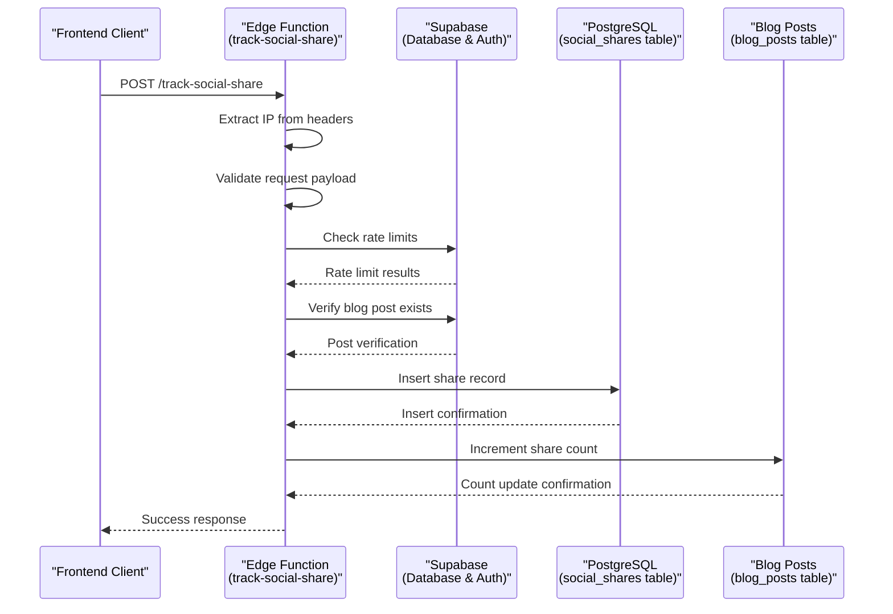
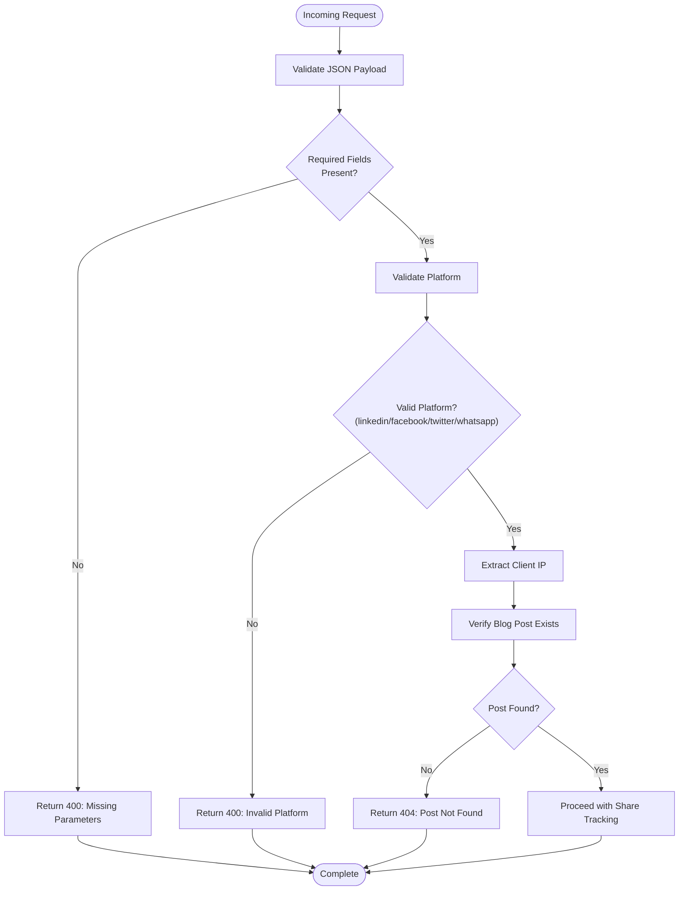
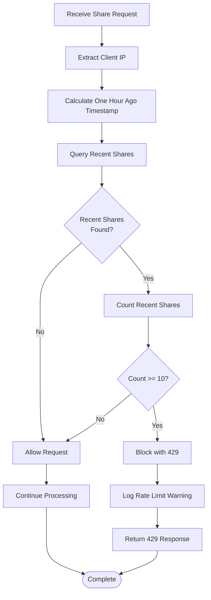
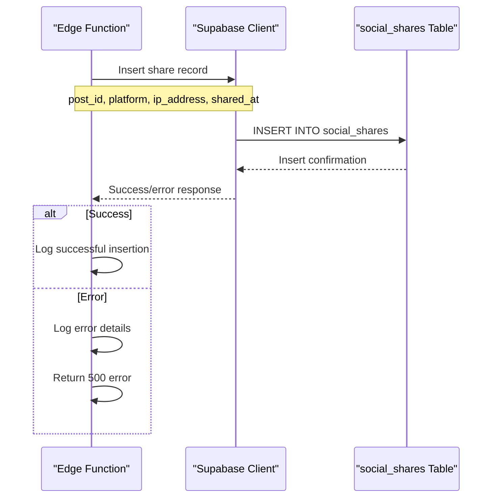
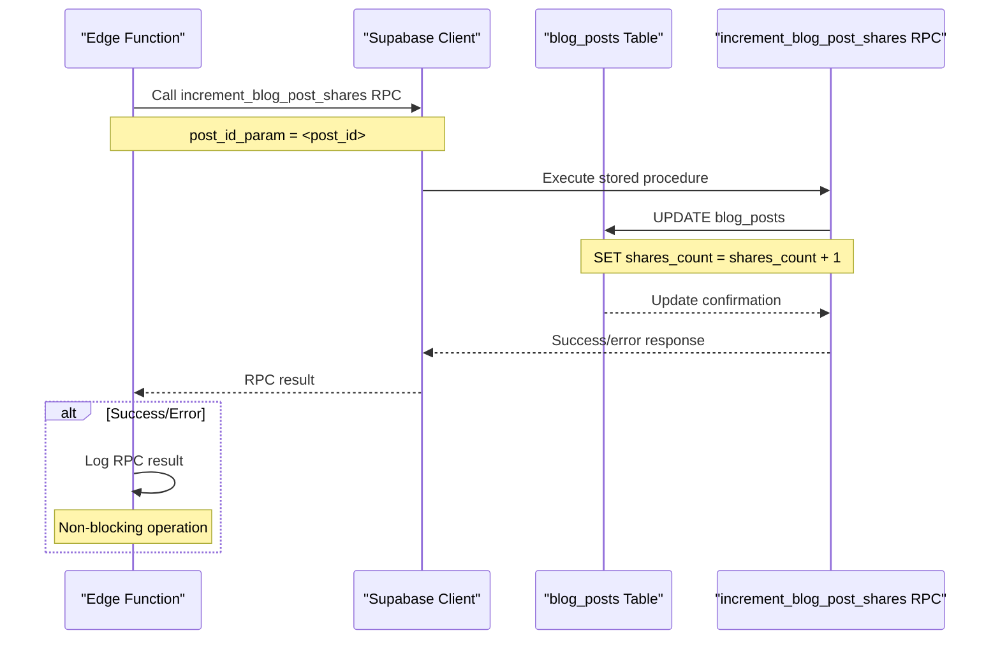
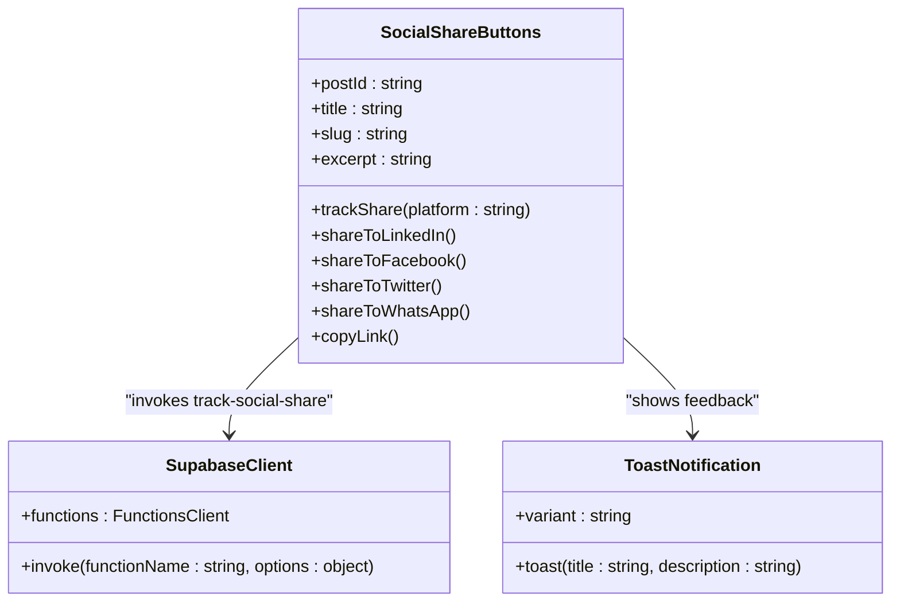
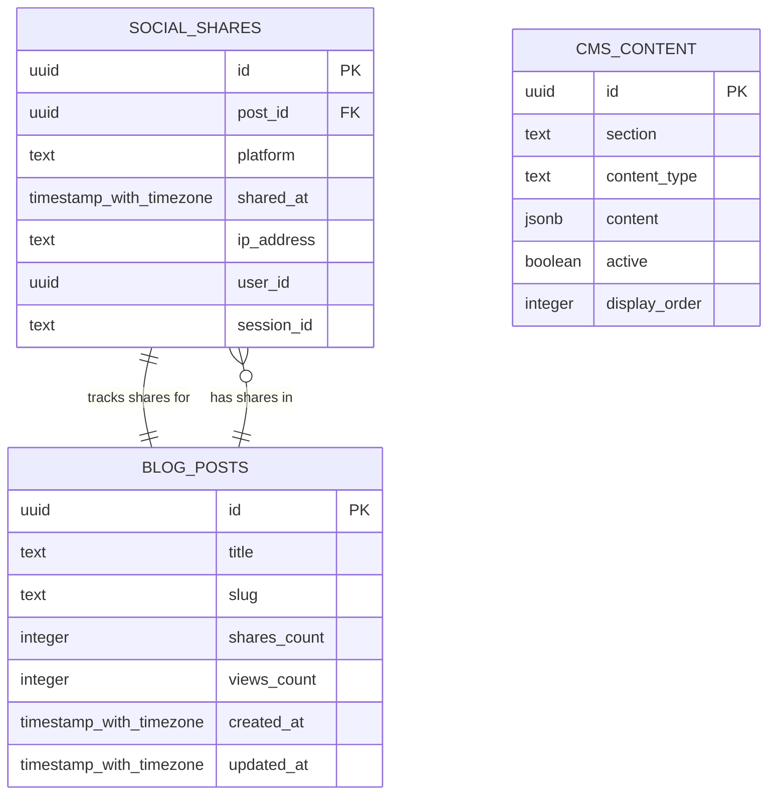
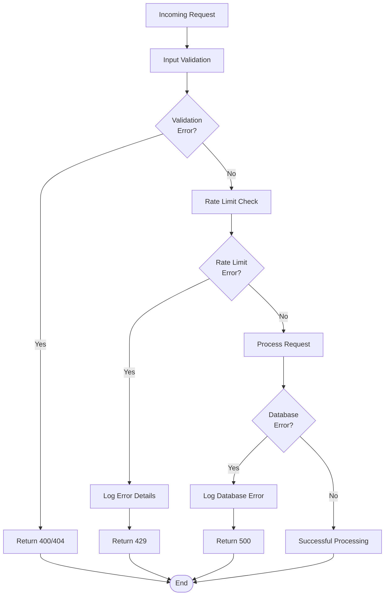

# Social Share Tracking API Documentation

<cite>
**Referenced Files in This Document**
- [supabase/functions/track-social-share/index.ts](file://supabase/functions/track-social-share/index.ts)
- [src/components/blog/SocialShareButtons.tsx](file://src/components/blog/SocialShareButtons.tsx)
- [src/pages/BlogPost.tsx](file://src/pages/BlogPost.tsx)
- [src/components/admin/CMSManagementPanel.tsx](file://src/components/admin/CMSManagementPanel.tsx)
- [supabase/TABLES_ONLY.sql](file://supabase/TABLES_ONLY.sql)
- [supabase/COMPLETE_SETUP.sql](file://supabase/COMPLETE_SETUP.sql)
- [supabase/migrations/20251120131648_76091c3c-ec15-4a1a-a0bc-3d265c494103.sql](file://supabase/migrations/20251120131648_76091c3c-ec15-4a1a-a0bc-3d265c494103.sql)
- [supabase/migrations/20251115150759_remix_migration_from_pg_dump.sql](file://supabase/migrations/20251115150759_remix_migration_from_pg_dump.sql)
</cite>

## Table of Contents
1. [Introduction](#introduction)
2. [API Endpoint Specification](#api-endpoint-specification)
3. [Core Architecture](#core-architecture)
4. [Validation and Security](#validation-and-security)
5. [Rate Limiting Implementation](#rate-limiting-implementation)
6. [Two-Phase Operation](#two-phase-operation)
7. [Database Schema](#database-schema)
8. [Frontend Integration](#frontend-integration)
9. [Marketing Analytics Integration](#marketing-analytics-integration)
10. [Error Handling and Resilience](#error-handling-and-resilience)
11. [Performance Considerations](#performance-considerations)
12. [Troubleshooting Guide](#troubleshooting-guide)

## Introduction

The Social Share Tracking API is a sophisticated edge function designed to monitor and record social media shares of blog content across LinkedIn, Facebook, Twitter, and WhatsApp platforms. Built on Supabase's Edge Functions infrastructure, this system provides real-time tracking capabilities while maintaining data consistency and implementing robust rate limiting mechanisms.

The API serves as a critical component in the marketing analytics ecosystem, enabling content creators and administrators to track engagement metrics, optimize content distribution strategies, and maintain accurate share count aggregations for blog posts.

## API Endpoint Specification

### HTTP POST Endpoint

**Endpoint:** `/functions/v1/track-social-share`

**Method:** `POST`

**Content-Type:** `application/json`

**Required Headers:**
- `Content-Type: application/json`
- `Authorization: Bearer <service_role_token>` (automatically handled by Supabase)
- `X-Client-Info: supabase-js/<version>` (automatically handled by Supabase)

### Request Payload

```json
{
  "post_id": "uuid-string",
  "platform": "linkedin|facebook|twitter|whatsapp"
}
```

### Response Format

#### Success Response (200 OK)
```json
{
  "success": true
}
```

#### Error Responses

**Missing Parameters (400 Bad Request)**
```json
{
  "error": "post_id and platform are required"
}
```

**Invalid Platform (400 Bad Request)**
```json
{
  "error": "Invalid platform. Must be one of: linkedin, facebook, twitter, whatsapp"
}
```

**Blog Post Not Found (404 Not Found)**
```json
{
  "error": "Blog post not found"
}
```

**Rate Limit Exceeded (429 Too Many Requests)**
```json
{
  "error": "Too many share requests. Please try again later."
}
```

**Internal Server Error (500 Internal Server Error)**
```json
{
  "error": "Failed to track share"
}
```

**Section sources**
- [supabase/functions/track-social-share/index.ts](file://supabase/functions/track-social-share/index.ts#L18-L128)

## Core Architecture

The Social Share Tracking API follows a two-tier architecture combining edge function processing with database operations:



**Diagram sources**
- [supabase/functions/track-social-share/index.ts](file://supabase/functions/track-social-share/index.ts#L18-L128)

### Edge Function Components

The edge function implements several key architectural patterns:

1. **CORS Handling**: Automatic CORS header management for cross-origin requests
2. **Request Validation**: Comprehensive input validation and sanitization
3. **Rate Limiting**: IP-based throttling with hourly windows
4. **Service Role Authentication**: Secure admin operations using Supabase service role
5. **Non-Blocking Operations**: Graceful degradation when secondary operations fail

**Section sources**
- [supabase/functions/track-social-share/index.ts](file://supabase/functions/track-social-share/index.ts#L1-L129)

## Validation and Security

### Input Validation Process

The API implements multi-layered validation to ensure data integrity and security:



**Diagram sources**
- [supabase/functions/track-social-share/index.ts](file://supabase/functions/track-social-share/index.ts#L18-L85)

### Security Measures

1. **Service Role Authentication**: All database operations use Supabase service role for elevated permissions
2. **IP Address Extraction**: Robust IP detection using `x-forwarded-for` and `x-real-ip` headers
3. **Parameter Sanitization**: Automatic sanitization through Supabase client libraries
4. **Access Control**: Database policies restrict social_shares table access to service role only

**Section sources**
- [supabase/functions/track-social-share/index.ts](file://supabase/functions/track-social-share/index.ts#L37-L49)
- [supabase/migrations/20251120131648_76091c3c-ec15-4a1a-a0bc-3d265c494103.sql](file://supabase/migrations/20251120131648_76091c3c-ec15-4a1a-a0bc-3d265c4103.sql#L18-L30)

## Rate Limiting Implementation

### Rate Limiting Algorithm

The system implements a sliding-window rate limiting mechanism with the following specifications:

- **Maximum Shares**: 10 shares per IP address
- **Time Window**: 1 hour (3600 seconds)
- **Implementation**: Database query-based tracking
- **Granularity**: Per-IP basis with hourly buckets



**Diagram sources**
- [supabase/functions/track-social-share/index.ts](file://supabase/functions/track-social-share/index.ts#L52-L71)

### Database Implementation

The rate limiting mechanism queries the social_shares table with the following criteria:

```sql
SELECT id FROM social_shares 
WHERE ip_address = '<client_ip>' 
AND shared_at >= '<one_hour_ago_timestamp>'
```

Key implementation details:
- **Index Utilization**: The query leverages appropriate indexes on `ip_address` and `shared_at` columns
- **Timestamp Precision**: Uses ISO 8601 format for accurate temporal comparisons
- **Fallback IPs**: Handles missing headers by using 'unknown' as IP identifier

**Section sources**
- [supabase/functions/track-social-share/index.ts](file://supabase/functions/track-social-share/index.ts#L52-L71)

## Two-Phase Operation

### Phase 1: Share Record Creation

The first phase focuses on creating a detailed record of the share event:



**Diagram sources**
- [supabase/functions/track-social-share/index.ts](file://supabase/functions/track-social-share/index.ts#L87-L102)

### Phase 2: Aggregated Count Increment

The second phase updates the blog post's share count using a stored procedure:



**Diagram sources**
- [supabase/functions/track-social-share/index.ts](file://supabase/functions/track-social-share/index.ts#L104-L112)

### Data Consistency Considerations

The two-phase approach ensures data consistency through:

1. **Atomic Operations**: Each phase operates independently
2. **Non-Blocking Design**: Failure in count increment doesn't affect record creation
3. **Eventual Consistency**: The system maintains eventual consistency between individual records and aggregated counts
4. **Audit Trail**: All share events are preserved for analytics and debugging

**Section sources**
- [supabase/functions/track-social-share/index.ts](file://supabase/functions/track-social-share/index.ts#L87-L112)

## Database Schema

### social_shares Table Structure

The social_shares table captures detailed information about each share event:

| Column | Type | Constraints | Description |
|--------|------|-------------|-------------|
| `id` | UUID | PRIMARY KEY, NOT NULL | Unique identifier for each share record |
| `post_id` | UUID | NOT NULL | Foreign key referencing blog_posts.id |
| `platform` | TEXT | NOT NULL | Social media platform (linkedin, facebook, twitter, whatsapp) |
| `shared_at` | TIMESTAMP WITH TIME ZONE | DEFAULT now(), NOT NULL | Timestamp of share event |
| `ip_address` | TEXT | NULLABLE | Client IP address for rate limiting |
| `user_id` | UUID | NULLABLE | Associated user ID (future enhancement) |
| `session_id` | TEXT | NULLABLE | Session identifier (future enhancement) |

### blog_posts Table Enhancement

The blog_posts table includes a dedicated column for share counting:

| Column | Type | Default | Description |
|--------|------|---------|-------------|
| `shares_count` | INTEGER | 0 | Total number of shares across all platforms |

### Database Policies

Security is enforced through database policies:

1. **Service Role Access**: Only service_role can modify social_shares table
2. **Public Read Access**: Anyone can view share records for analytics
3. **Row-Level Security**: Appropriate constraints on data access

**Section sources**
- [supabase/TABLES_ONLY.sql](file://supabase/TABLES_ONLY.sql#L693-L700)
- [supabase/migrations/20251120131648_76091c3c-ec15-4a1a-a0bc-3d265c494103.sql](file://supabase/migrations/20251120131648_76091c3c-ec15-4a1a-a0bc-3d265c494103.sql#L1-L30)

## Frontend Integration

### SocialShareButtons Component

The frontend implementation provides a comprehensive social sharing interface:



**Diagram sources**
- [src/components/blog/SocialShareButtons.tsx](file://src/components/blog/SocialShareButtons.tsx#L13-L137)

### Integration Pattern

The frontend follows a reactive integration pattern:

1. **Event-Driven Sharing**: Click handlers trigger both external sharing and tracking
2. **Asynchronous Tracking**: Share tracking occurs after initiating external sharing
3. **User Feedback**: Toast notifications confirm successful sharing
4. **Graceful Degradation**: Tracking failures don't prevent external sharing

### Supported Platforms

Each platform integration includes:
- **Platform-Specific URLs**: Properly formatted sharing URLs
- **External Window Management**: Controlled opening of sharing dialogs
- **Tracking Integration**: Automatic call to track-social-share function
- **User Confirmation**: Toast notifications for successful actions

**Section sources**
- [src/components/blog/SocialShareButtons.tsx](file://src/components/blog/SocialShareButtons.tsx#L17-L137)

## Marketing Analytics Integration

### CMSManagementPanel Integration

The social share tracking system integrates seamlessly with the CMS Management Panel for comprehensive marketing analytics:



**Diagram sources**
- [src/components/admin/CMSManagementPanel.tsx](file://src/components/admin/CMSManagementPanel.tsx#L1-L200)
- [supabase/TABLES_ONLY.sql](file://supabase/TABLES_ONLY.sql#L693-L700)

### Analytics Capabilities

The integrated system enables:

1. **Platform Performance Analysis**: Track which platforms drive the most engagement
2. **Content Effectiveness Metrics**: Measure share success across different blog posts
3. **User Behavior Insights**: Analyze sharing patterns and timing
4. **Campaign Attribution**: Attribute marketing campaigns to specific content
5. **Trend Analysis**: Identify trending topics and popular content categories

### Real-Time Reporting

Administrators can access real-time sharing metrics through:

- **Dashboard Widgets**: Live share count displays on content management screens
- **Export Capabilities**: Download share data for external analysis
- **Filtering Options**: Segment data by platform, time period, or content type
- **Visualization Tools**: Graphical representation of sharing trends

**Section sources**
- [src/components/admin/CMSManagementPanel.tsx](file://src/components/admin/CMSManagementPanel.tsx#L1-L200)

## Error Handling and Resilience

### Multi-Level Error Handling

The system implements comprehensive error handling across all operational layers:



**Diagram sources**
- [supabase/functions/track-social-share/index.ts](file://supabase/functions/track-social-share/index.ts#L121-L128)

### Resilience Patterns

1. **Non-Blocking Operations**: Secondary operations (count increment) don't affect primary functionality
2. **Graceful Degradation**: System continues operating even when parts fail
3. **Comprehensive Logging**: All errors are logged for monitoring and debugging
4. **CORS Preflight Handling**: Automatic handling of browser preflight requests
5. **Timeout Management**: Edge function timeouts are handled gracefully

### Error Recovery Strategies

- **Idempotent Operations**: Duplicate requests are handled safely
- **Transaction Safety**: Database operations maintain consistency
- **Retry Mechanisms**: Failed operations can be retried safely
- **Monitoring Integration**: Errors trigger appropriate monitoring alerts

**Section sources**
- [supabase/functions/track-social-share/index.ts](file://supabase/functions/track-social-share/index.ts#L121-L128)

## Performance Considerations

### Scalability Features

The Social Share Tracking API is designed for high-performance operation:

1. **Edge Computing**: Deployed at edge locations for low latency
2. **Database Optimization**: Indexed queries for efficient rate limiting
3. **Connection Pooling**: Efficient database connection management
4. **Caching Strategies**: Intelligent caching of frequently accessed data
5. **Horizontal Scaling**: Edge function auto-scaling based on demand

### Performance Metrics

Key performance indicators monitored:

- **Response Time**: Average and 95th percentile response times
- **Throughput**: Requests processed per second
- **Error Rates**: Percentage of failed requests
- **Rate Limit Efficiency**: Effectiveness of rate limiting implementation
- **Database Load**: Query performance and connection utilization

### Optimization Strategies

1. **Query Optimization**: Efficient database queries with proper indexing
2. **Connection Management**: Optimized database connection pooling
3. **Memory Usage**: Minimal memory footprint for edge function execution
4. **Network Efficiency**: Optimized data transfer and compression
5. **Caching Layers**: Strategic caching of frequently accessed data

## Troubleshooting Guide

### Common Issues and Solutions

#### Issue: Rate Limiting Errors
**Symptoms**: 429 Too Many Requests responses
**Causes**: 
- Client IP consistently exceeding 10 shares per hour
- Shared IP environments (proxies, CDNs)
- Testing with same IP during development

**Solutions**:
- Implement exponential backoff in frontend
- Use different testing IPs for development
- Adjust rate limiting thresholds if necessary
- Monitor rate limiting effectiveness

#### Issue: Blog Post Not Found
**Symptoms**: 404 Not Found responses
**Causes**:
- Invalid post_id parameter
- Deleted or unpublished blog posts
- Incorrect API endpoint usage

**Solutions**:
- Validate post_id before making requests
- Check blog post status and availability
- Verify API endpoint configuration

#### Issue: Tracking Failures
**Symptoms**: Successful share but no tracking record
**Causes**:
- Network connectivity issues
- Database write failures
- Service role authentication problems

**Solutions**:
- Implement retry logic in frontend
- Monitor database health and performance
- Verify service role configuration

#### Issue: Inconsistent Share Counts
**Symptoms**: Discrepancies between individual records and aggregated counts
**Causes**:
- Race conditions in concurrent updates
- Failed count increment operations
- Data synchronization delays

**Solutions**:
- Implement proper locking mechanisms
- Monitor and resolve failed operations
- Regular data consistency checks

### Monitoring and Debugging

#### Essential Logs to Monitor
- Request validation failures
- Rate limiting violations
- Database operation errors
- Service role authentication issues
- Frontend tracking failures

#### Diagnostic Tools
- Supabase dashboard monitoring
- Edge function logs and metrics
- Database query performance analysis
- Frontend error tracking
- Application performance monitoring

**Section sources**
- [supabase/functions/track-social-share/index.ts](file://supabase/functions/track-social-share/index.ts#L121-L128)