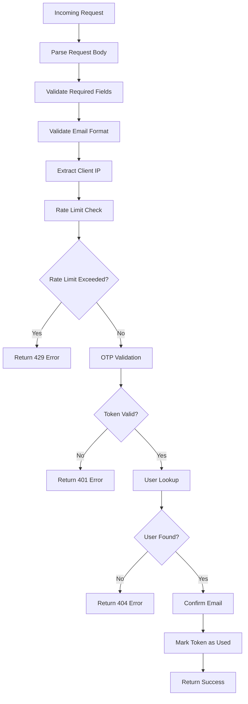
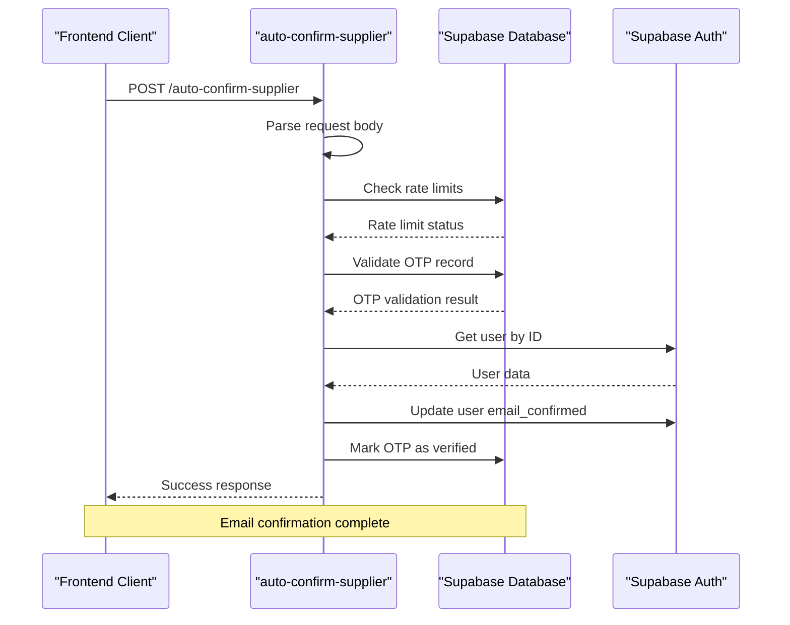
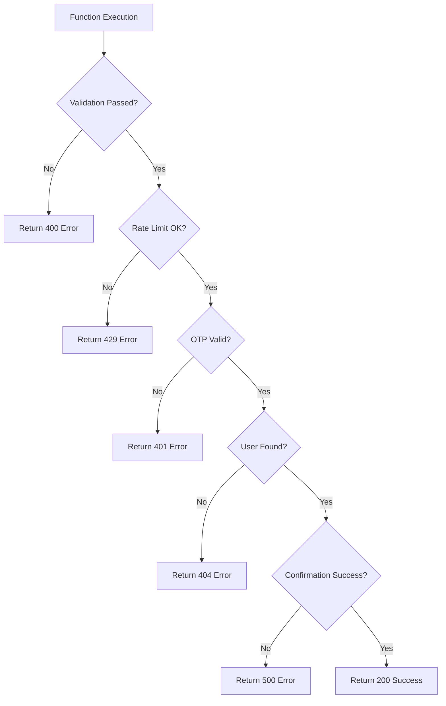

# Auto Confirm Supplier API Documentation

<cite>
**Referenced Files in This Document**
- [supabase/functions/auto-confirm-supplier/index.ts](file://supabase/functions/auto-confirm-supplier/index.ts)
- [src/components/auth/ProductionPartnerSignupForm.tsx](file://src/components/auth/ProductionPartnerSignupForm.tsx)
- [src/pages/JoinSupplier.tsx](file://src/pages/JoinSupplier.tsx)
- [supabase/functions/send-otp/index.ts](file://supabase/functions/send-otp/index.ts)
- [supabase/migrations/20251119140029_887f03c6-bdb2-46d4-ac7b-4b4868f9a169.sql](file://supabase/migrations/20251119140029_887f03c6-bdb2-46d4-ac7b-4b4868f9a169.sql)
- [supabase/BASE_MIGRATION_SAFE.sql](file://supabase/BASE_MIGRATION_SAFE.sql)
</cite>

## Table of Contents
1. [Introduction](#introduction)
2. [API Endpoint Specification](#api-endpoint-specification)
3. [Security Implementation](#security-implementation)
4. [Workflow Architecture](#workflow-architecture)
5. [Database Schema](#database-schema)
6. [Frontend Integration](#frontend-integration)
7. [Error Handling](#error-handling)
8. [Rate Limiting](#rate-limiting)
9. [Audit Trail](#audit-trail)
10. [Security Rationale](#security-rationale)

## Introduction

The Auto Confirm Supplier function (`auto-confirm-supplier`) is a critical component of the Sleek Apparels supplier onboarding process. It provides automated email verification during supplier registration, ensuring secure and efficient account activation while preventing abuse through comprehensive security measures.

This function serves as the backend endpoint for verifying supplier email confirmations, automatically activating user accounts after successful OTP validation. The implementation prioritizes security through rate limiting, token expiration validation, and prevention of token reuse.

## API Endpoint Specification

### HTTP Method and URL
- **Method**: `POST`
- **URL**: `/functions/v1/auto-confirm-supplier`
- **Content-Type**: `application/json`

### Request Payload

| Parameter | Type | Required | Description |
|-----------|------|----------|-------------|
| `email` | string | Yes | The supplier's email address for verification |
| `token` | string | Yes | The one-time confirmation token |

### Request Example
```json
{
  "email": "supplier@example.com",
  "token": "abc123-def456-ghi789"
}
```

### Response Format

#### Success Response (200 OK)
```json
{
  "success": true,
  "message": "Email confirmed successfully",
  "userId": "uuid-string"
}
```

#### Error Responses

**Missing Parameters (400 Bad Request)**
```json
{
  "error": "Email and token are required"
}
```

**Invalid Email Format (400 Bad Request)**
```json
{
  "error": "Invalid email format"
}
```

**Invalid or Expired Token (401 Unauthorized)**
```json
{
  "error": "Invalid or expired confirmation token"
}
```

**Rate Limit Exceeded (429 Too Many Requests)**
```json
{
  "error": "Too many confirmation attempts. Please try again later."
}
```

**User Not Found (404 Not Found)**
```json
{
  "error": "User not found"
}
```

**Internal Server Error (500 Internal Server Error)**
```json
{
  "error": "Failed to confirm email"
}
```

**Section sources**
- [supabase/functions/auto-confirm-supplier/index.ts](file://supabase/functions/auto-confirm-supplier/index.ts#L15-L147)

## Security Implementation

### Multi-Layer Security Architecture

The auto-confirm-supplier function implements a comprehensive security model with multiple validation layers:

#### 1. Rate Limiting Protection
- **Implementation**: 5 attempts per hour per IP/email combination
- **Mechanism**: Checks recent attempts in `email_verification_otps` table
- **Prevention**: Prevents brute force attacks and abuse

#### 2. Token Validation
- **Expiration Check**: Validates `expires_at` timestamp against current time
- **Uniqueness Verification**: Ensures token matches `session_id` and email
- **Reuse Prevention**: Marks tokens as `verified = true` upon successful confirmation

#### 3. User Identity Verification
- **Secure Lookup**: Uses `user_id` from OTP record instead of email-based lookup
- **Performance Optimization**: Prevents expensive email-based user searches as user base grows
- **Direct Association**: Maintains strict association between OTP and user identity

#### 4. IP Address Tracking
- **Client IP Detection**: Extracts IP from `x-forwarded-for` or `x-real-ip` headers
- **Attempt Monitoring**: Tracks failed attempts for rate limiting enforcement



**Diagram sources**
- [supabase/functions/auto-confirm-supplier/index.ts](file://supabase/functions/auto-confirm-supplier/index.ts#L15-L147)

**Section sources**
- [supabase/functions/auto-confirm-supplier/index.ts](file://supabase/functions/auto-confirm-supplier/index.ts#L50-L85)

## Workflow Architecture

### Complete Confirmation Workflow

The auto-confirm-supplier function orchestrates a sophisticated multi-stage workflow:

#### Stage 1: Initial Registration
1. **User Creation**: Supplier registers through ProductionPartnerSignupForm
2. **Account Setup**: Supabase Auth creates user account
3. **Token Generation**: System generates confirmation token
4. **OTP Record Creation**: Inserts record into `email_verification_otps` table

#### Stage 2: Automatic Confirmation
1. **Function Invocation**: Frontend calls auto-confirm-supplier function
2. **Parameter Validation**: Validates email and token parameters
3. **Rate Limiting**: Checks attempt limits for IP/email combination
4. **Token Verification**: Validates OTP record existence and validity
5. **User Authentication**: Retrieves user via Supabase Admin API
6. **Email Confirmation**: Updates user account with email confirmation
7. **Token Marking**: Sets OTP record as verified to prevent reuse

#### Stage 3: Post-Confirmation
1. **Audit Logging**: Records confirmation event
2. **Session Establishment**: Ensures active session
3. **Supplier Profile**: Creates supplier profile in database
4. **Notification**: Sends confirmation notifications



**Diagram sources**
- [supabase/functions/auto-confirm-supplier/index.ts](file://supabase/functions/auto-confirm-supplier/index.ts#L67-L130)
- [src/pages/JoinSupplier.tsx](file://src/pages/JoinSupplier.tsx#L187-L212)

**Section sources**
- [src/pages/JoinSupplier.tsx](file://src/pages/JoinSupplier.tsx#L187-L212)

## Database Schema

### email_verification_otps Table Structure

The OTP table maintains comprehensive tracking and security information:

| Column | Type | Constraints | Description |
|--------|------|-------------|-------------|
| `id` | uuid | PRIMARY KEY, NOT NULL | Unique identifier for OTP record |
| `email` | text | NOT NULL | Target email address for verification |
| `otp` | text | NOT NULL | One-time password (always 'CONFIRMATION_TOKEN' for auto-confirm) |
| `expires_at` | timestamptz | NOT NULL | Token expiration timestamp |
| `verified` | boolean | DEFAULT false | Indicates if token has been used |
| `created_at` | timestamptz | DEFAULT now() | Record creation timestamp |
| `ip_address` | text | NULLABLE | Client IP address (nullable for auto-confirm) |
| `session_id` | text | NOT NULL | Unique token identifier |
| `attempt_count` | integer | DEFAULT 0 | Failed attempt counter |
| `user_id` | uuid | NOT NULL | Associated user identifier |

### Additional Columns (Added via Migration)
| Column | Type | Description |
|--------|------|-------------|
| `resend_email_id` | text | Resend API email identifier |
| `email_sent_at` | timestamptz | Timestamp of successful email delivery |
| `delivery_status` | text | Email delivery status (pending/sent/failed/bounced/delivered) |
| `delivery_error` | text | Error message if delivery failed |

### Indexes for Performance
- **Primary Index**: `PRIMARY KEY (id)`
- **Email Index**: `INDEX (email, created_at)`
- **Session Index**: `INDEX (session_id)`
- **Delivery Status Index**: `INDEX (delivery_status, created_at)`
- **Resend ID Index**: `INDEX (resend_email_id) WHERE resend_email_id IS NOT NULL`

**Section sources**
- [supabase/BASE_MIGRATION_SAFE.sql](file://supabase/BASE_MIGRATION_SAFE.sql#L1081-L1092)
- [supabase/migrations/20251119140029_887f03c6-bdb2-46d4-ac7b-4b4868f9a169.sql](file://supabase/migrations/20251119140029_887f069.sql#L1-L21)

## Frontend Integration

### ProductionPartnerSignupForm Component

The frontend integration demonstrates seamless supplier registration and automatic confirmation:

#### Registration Process Flow
1. **Form Submission**: User completes ProductionPartnerSignupForm
2. **Account Creation**: Backend creates Supabase Auth user
3. **Token Generation**: System generates confirmation token
4. **Automatic Confirmation**: Frontend immediately invokes auto-confirm-supplier
5. **Error Handling**: Graceful error display for confirmation failures

#### Key Integration Points

**Token Generation and Confirmation**
```typescript
// Step 3: Generate one-time confirmation token
const confirmationToken = crypto.randomUUID();

// Step 4: Auto-confirm supplier
const { error: confirmError } = await supabase.functions.invoke('auto-confirm-supplier', {
  body: {
    email: formData.email,
    token: confirmationToken
  }
});
```

**Error Handling Implementation**
```typescript
if (confirmError) {
  if (confirmError.message?.includes('Invalid or expired')) {
    toast.error('Email confirmation token expired. Please contact support.');
  } else if (confirmError.message?.includes('Rate limit')) {
    toast.error('Too many confirmation attempts. Please wait and try again.');
  } else if (confirmError.message?.includes('User not found')) {
    toast.error('Account created but confirmation failed. Please contact support with your email.');
  }
}
```

### Toast Notification System

The frontend implements comprehensive error messaging for different failure scenarios:

| Error Type | Message | Status |
|------------|---------|--------|
| Token Expired | "Email confirmation token expired. Please contact support." | Error |
| Rate Limit | "Too many confirmation attempts. Please wait and try again." | Error |
| User Not Found | "Account created but confirmation failed. Please contact support with your email." | Error |
| General Failure | "Registration succeeded but email confirmation failed. Please contact support." | Error |

**Section sources**
- [src/components/auth/ProductionPartnerSignupForm.tsx](file://src/components/auth/ProductionPartnerSignupForm.tsx#L1-L288)
- [src/pages/JoinSupplier.tsx](file://src/pages/JoinSupplier.tsx#L187-L225)

## Error Handling

### Comprehensive Error Classification

The auto-confirm-supplier function implements granular error handling with specific HTTP status codes and meaningful error messages:

#### Validation Errors (400 Bad Request)
- **Missing Parameters**: Both email and token must be provided
- **Invalid Email Format**: Email must conform to RFC standards

#### Authentication Errors (401 Unauthorized)
- **Invalid Token**: Token doesn't match any OTP record
- **Expired Token**: Token has surpassed `expires_at` timestamp
- **Already Used**: Token marked as `verified = true`

#### Rate Limiting (429 Too Many Requests)
- **Exceeded Attempts**: More than 5 attempts in the last hour
- **IP/Email Combination**: Limits apply to both IP address and email

#### System Errors (500 Internal Server Error)
- **Database Errors**: Issues with OTP record retrieval or updates
- **User Lookup Failures**: Problems with Supabase Auth API
- **Token Marking Failures**: Unable to mark OTP as verified

#### Error Response Patterns



**Diagram sources**
- [supabase/functions/auto-confirm-supplier/index.ts](file://supabase/functions/auto-confirm-supplier/index.ts#L19-L147)

**Section sources**
- [supabase/functions/auto-confirm-supplier/index.ts](file://supabase/functions/auto-confirm-supplier/index.ts#L19-L147)

## Rate Limiting

### Implementation Details

The rate limiting mechanism provides robust protection against abuse while maintaining usability:

#### Rate Limit Configuration
- **Threshold**: 5 attempts per hour
- **Scope**: Per IP address OR per email address
- **Window**: Last 60 minutes
- **Enforcement**: Before OTP validation to prevent bypass

#### Rate Limiting Algorithm

```typescript
// Calculate one hour ago timestamp
const oneHourAgo = new Date(Date.now() - 60 * 60 * 1000).toISOString();

// Query recent attempts for IP or email
const { data: recentAttempts } = await supabaseAdmin
  .from('email_verification_otps')
  .select('id')
  .or(`ip_address.eq.${clientIP},email.eq.${email}`)
  .gte('created_at', oneHourAgo);

// Enforce limit
if (recentAttempts && recentAttempts.length > 5) {
  return new Response(
    JSON.stringify({ error: 'Too many confirmation attempts. Please try again later.' }),
    { status: 429, headers: { ...corsHeaders, 'Content-Type': 'application/json' } }
  );
}
```

#### Rate Limiting Benefits
- **Abuse Prevention**: Blocks brute force attacks on OTP tokens
- **Performance Protection**: Prevents excessive database queries
- **Fair Usage**: Ensures equitable access to the service
- **Security Enhancement**: Reduces attack surface for malicious actors

**Section sources**
- [supabase/functions/auto-confirm-supplier/index.ts](file://supabase/functions/auto-confirm-supplier/index.ts#L50-L65)

## Audit Trail

### Timestamp-Based Tracking

The system maintains comprehensive audit trails through strategic timestamp usage:

#### Key Timestamp Fields
- **`created_at`**: Record creation timestamp for rate limiting
- **`expires_at`**: Token expiration for security validation
- **`updated_at`**: Last modification timestamp for audit purposes
- **`email_sent_at`**: Successful email delivery timestamp

#### Audit Trail Features
- **Attempt Monitoring**: Tracks all confirmation attempts
- **Expiration Validation**: Prevents replay attacks
- **Rate Limit Enforcement**: Historical attempt tracking
- **Delivery Status**: Email delivery success/failure logging

#### Security Implications
- **Replay Attack Prevention**: Tokens expire and cannot be reused
- **Timing Analysis Resistance**: Consistent validation timing
- **Forensic Analysis**: Complete audit trail for security investigations
- **Compliance Support**: Meets regulatory requirements for transaction logging

**Section sources**
- [supabase/migrations/20251119140029_887f03c6-bdb2-46d4-ac7b-4b4868f9a169.sql](file://supabase/migrations/20251119140029_887f03c6-bdb2-46d4-ac7b-4b4868f9a169.sql#L1-L21)

## Security Rationale

### Design Philosophy

The auto-confirm-supplier function embodies security-first principles with deliberate design choices:

#### User ID vs. Email Lookup
**Why User ID?**
- **Performance Scaling**: Email-based lookups become inefficient as user base grows
- **Security Isolation**: Prevents enumeration attacks through email patterns
- **Direct Association**: Maintains strict OTP-to-user relationship
- **Scalability**: Handles millions of users efficiently

**Implementation Impact**
```typescript
// Secure: Use user_id from OTP record
if (!otpRecord.user_id) {
  console.error('Token record missing user_id');
  return new Response(/* error */);
}

const { data: { user }, error: userError } = await supabaseAdmin.auth.admin.getUserById(otpRecord.user_id);
```

#### Token Reuse Prevention
- **Immutable Verification**: Once verified, tokens cannot be reused
- **Atomic Operations**: Token marking and user confirmation occur in sequence
- **Database Constraints**: Enforces uniqueness and validation rules
- **Audit Trail**: Logs all verification attempts and outcomes

#### Defense in Depth
- **Layered Validation**: Multiple security checks before confirmation
- **Rate Limiting**: Prevents brute force attacks
- **Expiration Checking**: Ensures timely token usage
- **IP Tracking**: Monitors suspicious activity patterns

### Security Best Practices Implemented

1. **Principle of Least Privilege**: Uses service role keys exclusively
2. **Input Validation**: Comprehensive parameter sanitization
3. **Error Handling**: Graceful error responses without information leakage
4. **Logging**: Detailed audit trails for security monitoring
5. **Rate Limiting**: Protection against abuse and denial-of-service
6. **Token Management**: Secure generation, storage, and validation

**Section sources**
- [supabase/functions/auto-confirm-supplier/index.ts](file://supabase/functions/auto-confirm-supplier/index.ts#L87-L95)