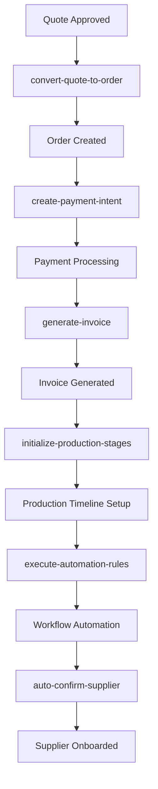
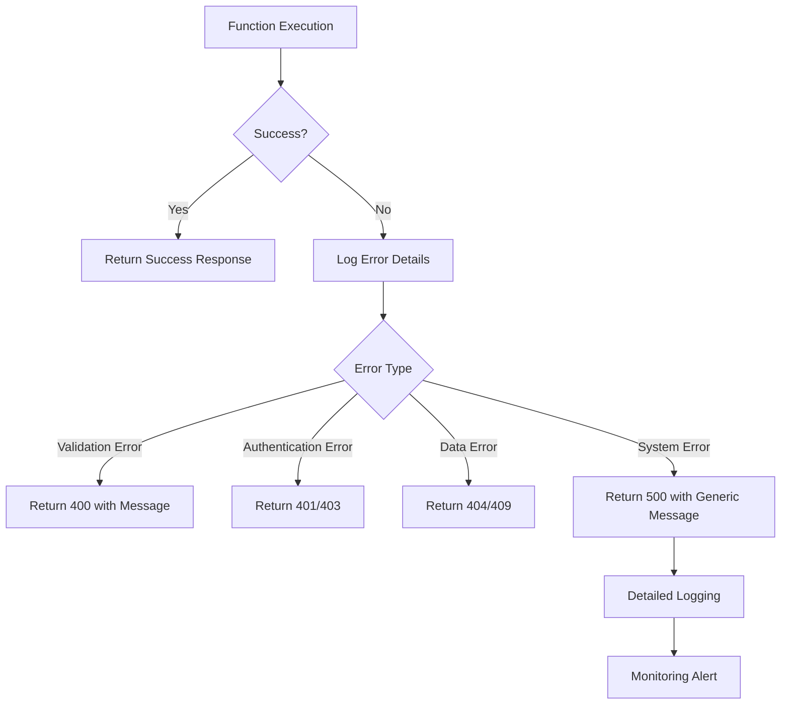
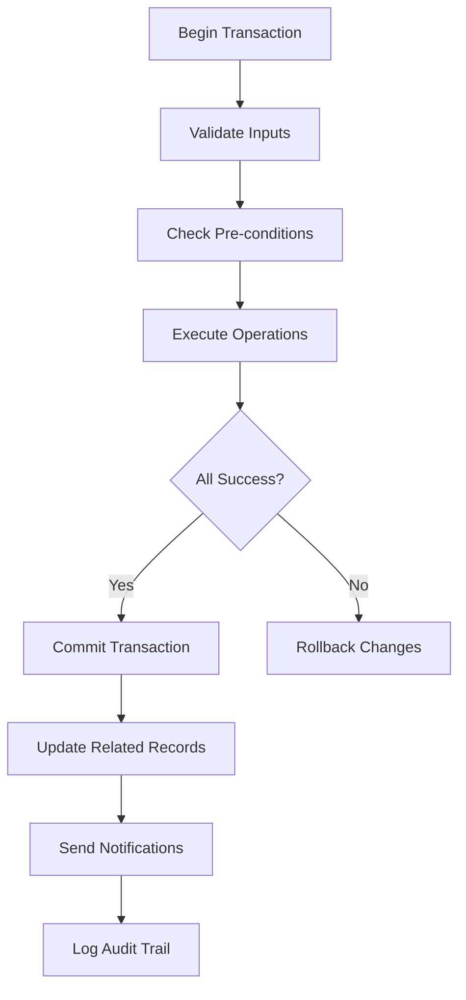
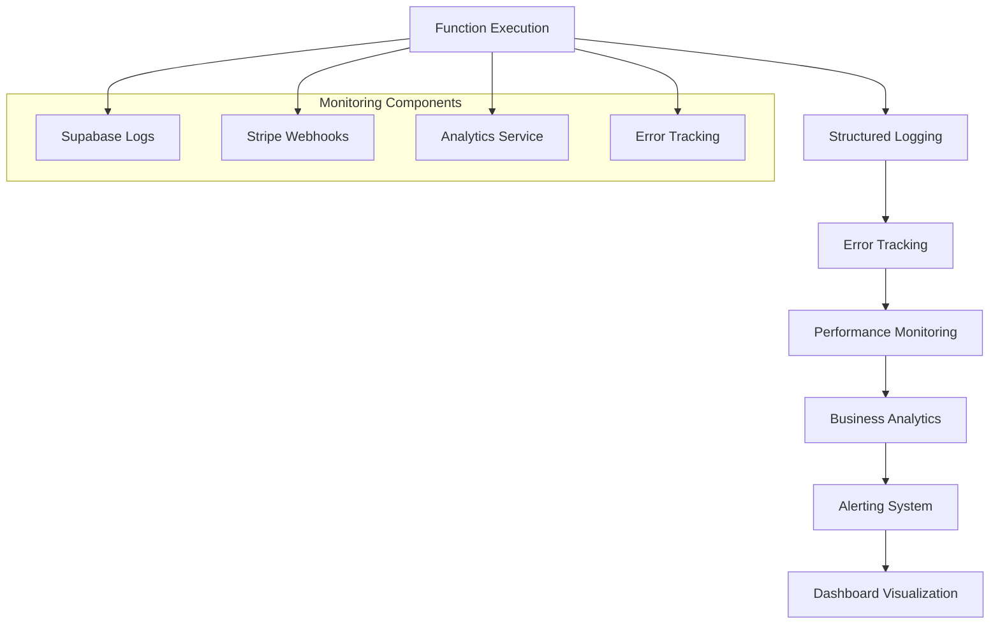

# Business Process Automation API

<cite>
**Referenced Files in This Document**   
- [convert-quote-to-order/index.ts](file://supabase/functions/convert-quote-to-order/index.ts)
- [initialize-production-stages/index.ts](file://supabase/functions/initialize-production-stages/index.ts)
- [generate-invoice/index.ts](file://supabase/functions/generate-invoice/index.ts)
- [create-payment-intent/index.ts](file://supabase/functions/create-payment-intent/index.ts)
- [execute-automation-rules/index.ts](file://supabase/functions/execute-automation-rules/index.ts)
- [auto-confirm-supplier/index.ts](file://supabase/functions/auto-confirm-supplier/index.ts)
- [useOrders.ts](file://src/hooks/queries/useOrders.ts)
- [usePayment.ts](file://src/hooks/usePayment.ts)
- [database.ts](file://src/types/database.ts)
</cite>

## Table of Contents
1. [Introduction](#introduction)
2. [Core Automation Functions](#core-automation-functions)
   - [convert-quote-to-order](#convert-quote-to-order)
   - [initialize-production-stages](#initialize-production-stages)
   - [generate-invoice](#generate-invoice)
   - [create-payment-intent](#create-payment-intent)
   - [execute-automation-rules](#execute-automation-rules)
   - [auto-confirm-supplier](#auto-confirm-supplier)
3. [Data Flow and Integration](#data-flow-and-integration)
4. [Error Handling and Retry Mechanisms](#error-handling-and-retry-mechanisms)
5. [Transactional Integrity and Idempotency](#transactional-integrity-and-idempotency)
6. [Monitoring and Analytics](#monitoring-and-analytics)
7. [Implementation Guidance](#implementation-guidance)
8. [Conclusion](#conclusion)

## Introduction
The Business Process Automation API in sleekapp-v100 powers core workflows for order management, production tracking, financial operations, and supplier onboarding. This documentation details the key automation functions that streamline the end-to-end manufacturing process from quote conversion to production execution and payment processing. The system integrates with Supabase database triggers, implements robust error handling with retry mechanisms, and ensures transactional integrity across distributed operations. The API follows role-based authentication patterns and provides comprehensive monitoring through the analytics-service.

## Core Automation Functions

### convert-quote-to-order
This function converts an approved quote into a formal order, initiating the production workflow.

**HTTP Endpoint**: `POST /functions/v1/convert-quote-to-order`

**Request Schema**:
```json
{
  "quoteId": "string"
}
```

**Response Structure**:
```json
{
  "success": true,
  "order": {
    "id": "string",
    "orderNumber": "string",
    "trackingToken": "string",
    "trackingUrl": "string"
  }
}
```

**Authentication Requirements**: 
- Role-based access: buyer, admin
- Requires valid authentication token

**Invocation Methods**:
- Frontend: `supabase.functions.invoke('convert-quote-to-order', { body: { quoteId } })`
- Direct HTTP POST with authentication header

**Key Functionality**:
- Creates order record with unique order number
- Generates secure tracking token
- Calculates expected delivery date based on quote data
- Creates or links buyer account
- Updates quote status to "converted"
- Sends order confirmation email via Resend

**Section sources**
- [convert-quote-to-order/index.ts](file://supabase/functions/convert-quote-to-order/index.ts#L1-L223)

### initialize-production-stages
This function sets up the 8-stage production timeline based on product type and category.

**HTTP Endpoint**: `POST /functions/v1/initialize-production-stages`

**Request Schema**:
```json
{
  "supplier_order_id": "string",
  "product_type": "string"
}
```

**Response Structure**:
```json
{
  "success": true,
  "stages": [
    {
      "id": "string",
      "stage_name": "string",
      "stage_number": "number",
      "status": "string",
      "target_date": "string"
    }
  ]
}
```

**Authentication Requirements**: 
- Role-based access: admin, supplier
- Requires valid authentication token

**Invocation Methods**:
- Automatically triggered after order creation
- Manual invocation via `supabase.functions.invoke()`

**Key Functionality**:
- Maps product type to production category (casualwear, activewear, knitwear)
- Fetches stage templates from `production_stage_templates` table
- Creates production stages with estimated target dates
- Falls back to default stages if no templates exist
- Supports customizable stage configurations per product category

**Section sources**
- [initialize-production-stages/index.ts](file://supabase/functions/initialize-production-stages/index.ts#L1-L133)

### generate-invoice
This function generates financial documents using AI-powered HTML generation.

**HTTP Endpoint**: `POST /functions/v1/generate-invoice`

**Request Schema**:
```json
{
  "invoice_id": "string"
}
```

**Response Structure**:
```json
{
  "success": true,
  "invoice_url": "string",
  "email_id": "string"
}
```

**Authentication Requirements**: 
- Role-based access: buyer, admin
- Requires valid authentication token

**Invocation Methods**:
- Frontend: `supabase.functions.invoke('generate-invoice', { body: { invoice_id } })`
- Direct HTTP POST with authentication header

**Key Functionality**:
- Validates user authorization (buyer or admin)
- Fetches invoice with related order and buyer details
- Generates professional invoice HTML using Lovable AI (Gemini model)
- Stores invoice in Supabase storage with public URL
- Sends invoice email via Resend with viewing link
- Updates invoice record with PDF URL

**Section sources**
- [generate-invoice/index.ts](file://supabase/functions/generate-invoice/index.ts#L1-L243)

### create-payment-intent
This function creates Stripe payment intents for order payments.

**HTTP Endpoint**: `POST /functions/v1/create-payment-intent`

**Request Schema**:
```json
{
  "orderId": "string",
  "paymentType": "deposit|balance|full"
}
```

**Response Structure**:
```json
{
  "clientSecret": "string",
  "amount": "number",
  "paymentIntentId": "string"
}
```

**Authentication Requirements**: 
- Role-based access: buyer, admin
- Requires valid authentication token

**Invocation Methods**:
- Frontend: `supabase.functions.invoke('create-payment-intent', { body: { orderId, paymentType } })`
- Direct HTTP POST with authentication header

**Key Functionality**:
- Validates user authorization (order buyer or admin)
- Verifies order price integrity against original quote
- Detects recent order modifications (potential tampering)
- Prevents duplicate payments
- Creates or retrieves Stripe customer
- Generates payment intent with appropriate amount (deposit: 30%, balance: 70%, full: 100%)
- Updates order with payment intent ID and amount
- Creates corresponding invoice record
- Implements comprehensive security validation and logging

**Section sources**
- [create-payment-intent/index.ts](file://supabase/functions/create-payment-intent/index.ts#L1-L288)

### execute-automation-rules
This function serves as the workflow automation engine for business rules.

**HTTP Endpoint**: `POST /functions/v1/execute-automation-rules`

**Request Schema**: None (triggers all active rules)

**Response Structure**:
```json
{
  "success": true,
  "results": [
    {
      "rule_id": "string",
      "rule_name": "string",
      "executed": "boolean",
      "actions": "array"
    }
  ]
}
```

**Authentication Requirements**: 
- Role-based access: admin only
- Requires valid authentication token

**Invocation Methods**:
- Scheduled execution via cron jobs
- Manual invocation by administrators

**Key Functionality**:
- Executes all active automation rules in priority order
- Evaluates rule conditions against current data state
- Performs actions such as email notifications, status updates, and supplier assignments
- Logs rule execution in admin_actions table
- Provides detailed execution results for monitoring
- Supports extensible action types (send_email, update_status, assign_supplier)

**Section sources**
- [execute-automation-rules/index.ts](file://supabase/functions/execute-automation-rules/index.ts#L1-L169)

### auto-confirm-supplier
This function automates supplier onboarding by confirming email verification.

**HTTP Endpoint**: `POST /functions/v1/auto-confirm-supplier`

**Request Schema**:
```json
{
  "email": "string",
  "token": "string"
}
```

**Response Structure**:
```json
{
  "success": true,
  "message": "Email confirmed successfully",
  "userId": "string"
}
```

**Authentication Requirements**: None (public endpoint with security controls)

**Invocation Methods**:
- Called from supplier onboarding confirmation links
- Direct HTTP POST from frontend

**Key Functionality**:
- Validates email format and token integrity
- Implements rate limiting by IP address and email
- Verifies one-time token from email_verification_otps table
- Confirms user email via Supabase auth admin API
- Marks token as used to prevent reuse
- Provides immediate feedback on confirmation status

**Section sources**
- [auto-confirm-supplier/index.ts](file://supabase/functions/auto-confirm-supplier/index.ts#L1-L148)

## Data Flow and Integration
The business automation functions follow a sequential workflow that mirrors the order lifecycle:



**Diagram sources**
- [convert-quote-to-order/index.ts](file://supabase/functions/convert-quote-to-order/index.ts#L1-L223)
- [create-payment-intent/index.ts](file://supabase/functions/create-payment-intent/index.ts#L1-L288)
- [generate-invoice/index.ts](file://supabase/functions/generate-invoice/index.ts#L1-L243)
- [initialize-production-stages/index.ts](file://supabase/functions/initialize-production-stages/index.ts#L1-L133)
- [execute-automation-rules/index.ts](file://supabase/functions/execute-automation-rules/index.ts#L1-L169)
- [auto-confirm-supplier/index.ts](file://supabase/functions/auto-confirm-supplier/index.ts#L1-L148)

The system integrates with Supabase database triggers that automatically update related records and maintain data consistency. For example, when an order is created, triggers update the quote status and create audit logs. The stripe-webhook function listens for payment events and updates invoice statuses accordingly.

## Error Handling and Retry Mechanisms
The automation functions implement comprehensive error handling with multiple layers of protection:



**Diagram sources**
- [convert-quote-to-order/index.ts](file://supabase/functions/convert-quote-to-order/index.ts#L1-L223)
- [create-payment-intent/index.ts](file://supabase/functions/create-payment-intent/index.ts#L1-L288)
- [generate-invoice/index.ts](file://supabase/functions/generate-invoice/index.ts#L1-L243)

Key error handling features include:
- Comprehensive logging with structured error details
- Input validation with descriptive error messages
- Authentication and authorization checks
- Database transaction integrity
- Graceful degradation (e.g., email sending failures don't block order creation)
- Rate limiting to prevent abuse
- Token expiration and reuse protection

## Transactional Integrity and Idempotency
The system ensures transactional integrity through several mechanisms:



**Diagram sources**
- [convert-quote-to-order/index.ts](file://supabase/functions/convert-quote-to-order/index.ts#L1-L223)
- [create-payment-intent/index.ts](file://supabase/functions/create-payment-intent/index.ts#L1-L288)

Idempotency patterns are implemented through:
- Unique order numbers and invoice numbers
- One-time use tokens for email confirmation
- Status checks to prevent duplicate processing (e.g., quote already converted)
- Idempotency keys in payment processing
- Database constraints to prevent duplicate records

## Monitoring and Analytics
The system provides comprehensive monitoring through multiple channels:



**Diagram sources**
- [create-payment-intent/index.ts](file://supabase/functions/create-payment-intent/index.ts#L1-L288)
- [stripe-webhook/index.ts](file://supabase/functions/stripe-webhook/index.ts#L1-L113)
- [analytics.ts](file://src/lib/analytics.ts#L1-L183)

Key monitoring features include:
- Detailed function logging with structured data
- Integration with analytics-service for business metrics
- Google Analytics 4 and Google Tag Manager integration
- Microsoft Clarity session recording
- Facebook Pixel and LinkedIn Insight Tag for marketing analytics
- Custom event tracking for business processes
- Admin audit logs for security and compliance

## Implementation Guidance
For implementing webhook confirmations and state transitions:

1. **Webhook Handling**:
   - Always verify webhook signatures
   - Implement idempotency to handle duplicate events
   - Use asynchronous processing for non-critical operations
   - Log all webhook events for debugging

2. **State Transitions**:
   - Validate current state before transition
   - Update all related records atomically
   - Emit events for downstream consumers
   - Update audit logs with transition details
   - Notify relevant parties of state changes

3. **Production Best Practices**:
   - Implement circuit breakers for external service calls
   - Use exponential backoff for retry mechanisms
   - Monitor function execution duration and error rates
   - Implement proper rate limiting
   - Use feature flags for gradual rollouts
   - Maintain comprehensive logging and monitoring

**Section sources**
- [stripe-webhook/index.ts](file://supabase/functions/stripe-webhook/index.ts#L1-L113)
- [analytics.ts](file://src/lib/analytics.ts#L1-L183)
- [useOrders.ts](file://src/hooks/queries/useOrders.ts#L1-L152)
- [usePayment.ts](file://src/hooks/usePayment.ts#L1-L68)

## Conclusion
The Business Process Automation API in sleekapp-v100 provides a robust foundation for managing end-to-end manufacturing workflows. By leveraging Supabase functions, the system achieves high reliability, security, and scalability. The modular design allows for easy extension of automation rules and integration with external services. The comprehensive error handling, monitoring, and analytics capabilities ensure operational visibility and rapid issue resolution. This documentation serves as a reference for developers and administrators to understand, maintain, and extend the automation system.