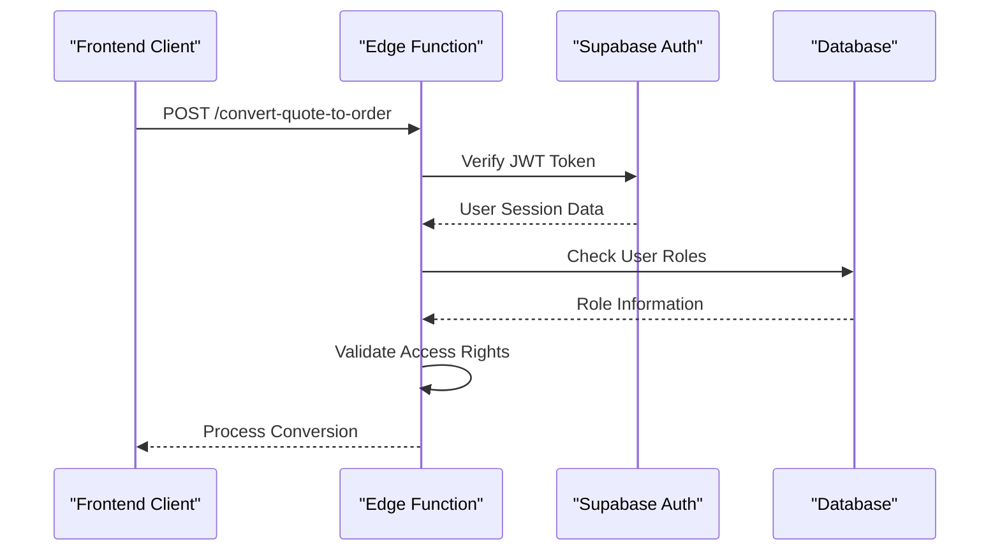
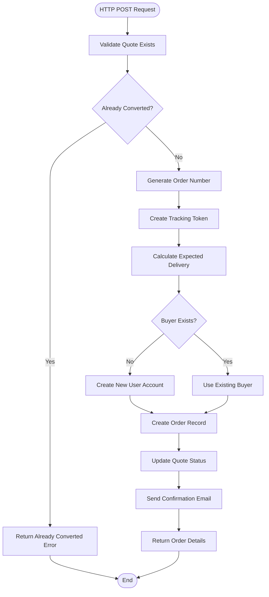
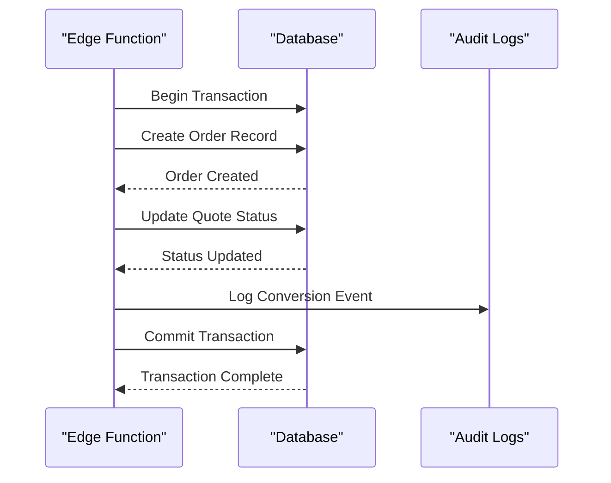
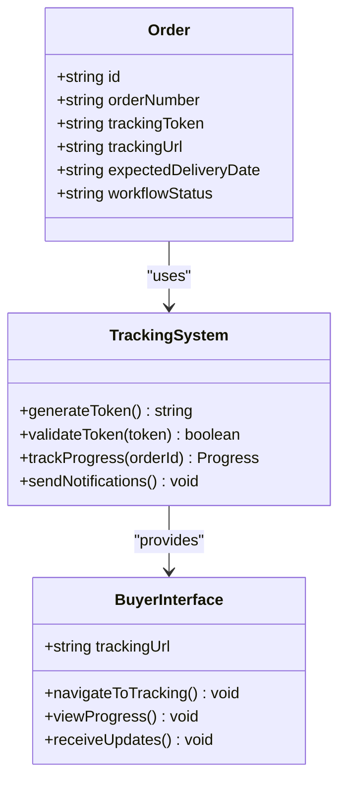
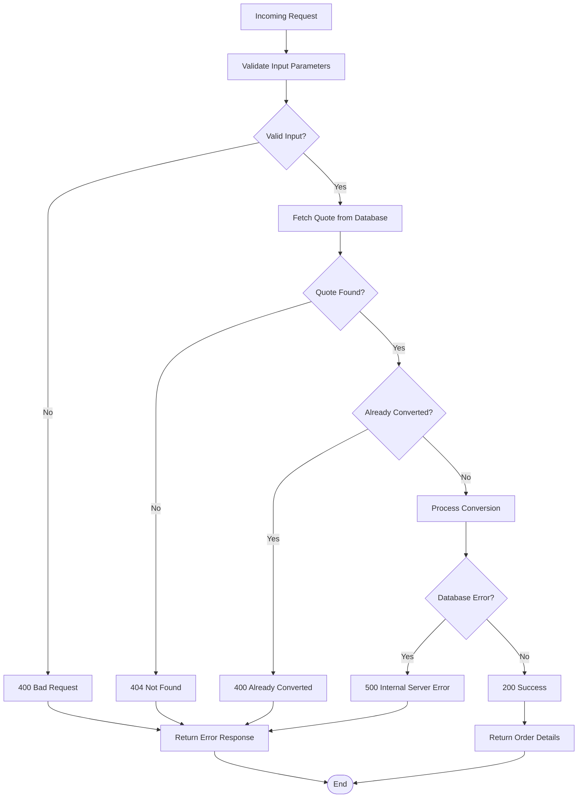
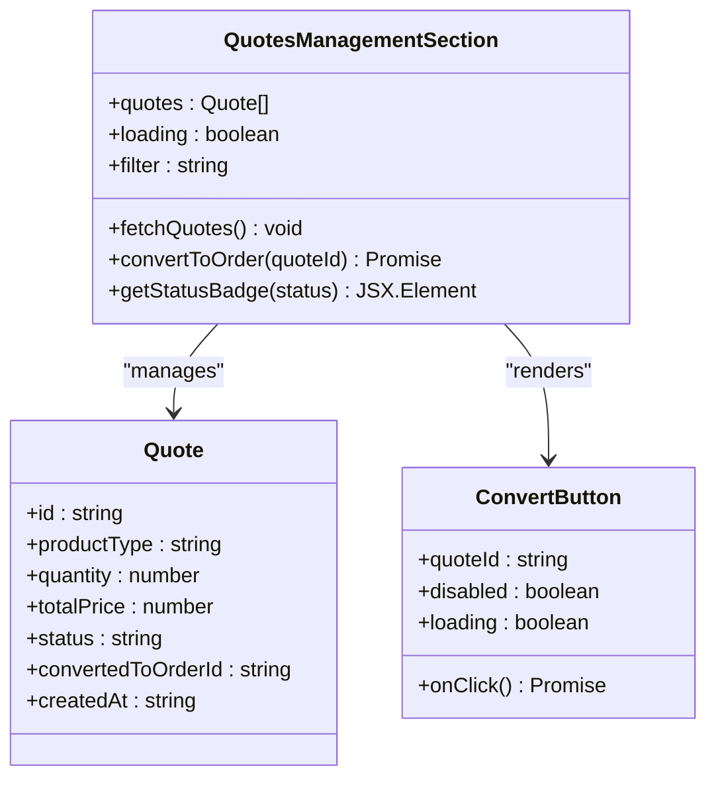

# Convert Quote to Order API Documentation

<cite>
**Referenced Files in This Document**
- [index.ts](file://supabase/functions/convert-quote-to-order/index.ts)
- [aiQuote.ts](file://src/lib/api/aiQuote.ts)
- [database.ts](file://src/types/database.ts)
- [BuyerOrderTracking.tsx](file://src/pages/BuyerOrderTracking.tsx)
- [QuotesManagementSection.tsx](file://src/components/buyer/QuotesManagementSection.tsx)
- [AdminLeads.tsx](file://src/pages/AdminLeads.tsx)
- [config.toml](file://supabase/config.toml)
- [client.ts](file://src/integrations/supabase/client.ts)
</cite>

## Table of Contents
1. [Introduction](#introduction)
2. [API Endpoint Specification](#api-endpoint-specification)
3. [Authentication Mechanism](#authentication-mechanism)
4. [Request and Response Schema](#request-and-response-schema)
5. [Workflow Implementation](#workflow-implementation)
6. [Data Integrity Measures](#data-integrity-measures)
7. [Integration with LoopTrace™ Tracking System](#integration-with-looptrace-tracking-system)
8. [Error Handling and Validation](#error-handling-and-validation)
9. [Frontend Implementation](#frontend-implementation)
10. [Security Considerations](#security-considerations)
11. [Performance Optimization](#performance-optimization)
12. [Troubleshooting Guide](#troubleshooting-guide)

## Introduction

The Convert Quote to Order function serves as a critical bridge between AI-generated quotes and production orders in the Sleek Apparels manufacturing platform. This edge function transforms approved AI quotes into fully functional production orders, integrating seamlessly with the LoopTrace™ tracking system and automated email notifications.

The function implements a comprehensive workflow that validates quote status, manages buyer accounts, creates production orders with unique tracking tokens, and sends confirmation emails to customers. It ensures data integrity through transactional updates and prevents duplicate conversions through sophisticated idempotency checks.

## API Endpoint Specification

### HTTP POST Endpoint
```
POST /functions/v1/convert-quote-to-order
```

### CORS Configuration
The function supports cross-origin requests with the following headers:
- `Access-Control-Allow-Origin: *`
- `Access-Control-Allow-Headers: authorization, x-client-info, apikey, content-type`

### Authentication Requirements
- Supabase JWT Token required in Authorization header
- Role-based access control (buyer, admin)
- Service role key for internal database operations

**Section sources**
- [index.ts](file://supabase/functions/convert-quote-to-order/index.ts#L5-L8)
- [config.toml](file://supabase/config.toml#L1-L73)

## Authentication Mechanism

### Supabase JWT Authentication
The function utilizes Supabase's native JWT authentication system with role-based access control:



### Role-Based Access Control
- **Buyer Role**: Can convert their own quotes to orders
- **Admin Role**: Can convert any quote to order regardless of ownership
- **Service Role**: Internal database operations with elevated privileges

### Authentication Flow
1. **Token Validation**: JWT token verification using Supabase service role
2. **Session Retrieval**: Extract user session from Supabase auth
3. **Role Verification**: Check user permissions for quote conversion
4. **Access Granting**: Allow operation based on role and ownership

**Section sources**
- [index.ts](file://supabase/functions/convert-quote-to-order/index.ts#L22-L24)
- [client.ts](file://src/integrations/supabase/client.ts#L14-L20)

## Request and Response Schema

### Request Schema

| Parameter | Type | Required | Description |
|-----------|------|----------|-------------|
| `quoteId` | string | Yes | Unique identifier of the AI quote to convert |

**Example Request:**
```json
{
  "quoteId": "uuid-string-here"
}
```

### Response Schema

| Field | Type | Description |
|-------|------|-------------|
| `success` | boolean | Indicates successful conversion |
| `order.id` | string | Generated order identifier |
| `order.orderNumber` | string | Human-readable order number (ORD-{timestamp}) |
| `order.trackingToken` | string | Secure random tracking token |
| `order.trackingUrl` | string | Full URL for order tracking |

**Successful Response Example:**
```json
{
  "success": true,
  "order": {
    "id": "uuid-string-here",
    "orderNumber": "ORD-12345678",
    "trackingToken": "abcdef1234567890",
    "trackingUrl": "https://your-domain.com/track-order/uuid-string-here?token=abcdef1234567890"
  }
}
```

### Error Response Schema

| Status Code | Error Type | Description |
|-------------|------------|-------------|
| 400 | Bad Request | Quote ID required or already converted |
| 404 | Not Found | Quote not found |
| 500 | Internal Error | Server-side processing error |

**Section sources**
- [index.ts](file://supabase/functions/convert-quote-to-order/index.ts#L12-L14)
- [index.ts](file://supabase/functions/convert-quote-to-order/index.ts#L26-L32)

## Workflow Implementation

### Complete Conversion Workflow



### Step-by-Step Process

#### 1. Quote Validation
- **Database Query**: Fetch quote by ID from `ai_quotes` table
- **Existence Check**: Verify quote exists and belongs to requesting user
- **Status Validation**: Ensure quote is in "approved" state

#### 2. Idempotency Check
- **Duplicate Prevention**: Check `converted_to_order_id` field
- **Error Handling**: Return meaningful error if already converted
- **Order Reference**: Include existing order ID in error response

#### 3. Order Creation Process
- **Order Number Generation**: Create unique ORD-{timestamp} format
- **Tracking Token Generation**: Generate cryptographically secure random token
- **Delivery Calculation**: Compute expected delivery date based on quote timeline
- **Buyer Management**: Create or lookup buyer account with email matching

#### 4. Database Transactions
- **Atomic Operations**: Ensure all database updates succeed or fail together
- **Status Updates**: Update quote status to "converted" atomically
- **Order References**: Link order to original quote for audit trail

**Section sources**
- [index.ts](file://supabase/functions/convert-quote-to-order/index.ts#L35-L151)

## Data Integrity Measures

### Transactional Database Updates

The function implements strict transactional guarantees to maintain data consistency:



### Key Integrity Controls

#### 1. Idempotency Protection
- **Unique Constraint**: Prevent multiple orders from same quote
- **State Validation**: Check `converted_to_order_id` before processing
- **Error Recovery**: Return existing order details for repeated requests

#### 2. Atomic Operations
- **Single Transaction**: All database operations in one atomic unit
- **Rollback Capability**: Automatic rollback on any failure
- **Consistency Guarantees**: Either all changes apply or none

#### 3. Data Validation
- **Quote Existence**: Verify quote exists before conversion
- **Status Verification**: Ensure quote is approved
- **Field Validation**: Validate required fields are present

### Database Schema Integration

The function interacts with two primary tables:

#### AI Quotes Table (`ai_quotes`)
- **Primary Key**: `id` (UUID)
- **Status Field**: `status` (validated before conversion)
- **Order Reference**: `converted_to_order_id` (idempotency field)
- **Customer Data**: `customer_email`, `customer_name`

#### Orders Table (`orders`)
- **Primary Key**: `id` (generated UUID)
- **Order Number**: `order_number` (ORD-{timestamp})
- **Tracking Token**: `tracking_token` (cryptographic random)
- **Buyer Reference**: `buyer_id` (linked to Supabase auth)
- **Quote Relationship**: `quote_id` (audit trail)

**Section sources**
- [index.ts](file://supabase/functions/convert-quote-to-order/index.ts#L49-L55)
- [index.ts](file://supabase/functions/convert-quote-to-order/index.ts#L143-L151)

## Integration with LoopTrace™ Tracking System

### Tracking Token Generation

The LoopTrace™ system integrates seamlessly through secure tracking tokens:



### Tracking Token Features

#### Security Properties
- **Cryptographic Randomness**: Uses `crypto.randomUUID()` for secure generation
- **URL-Friendly Format**: Removes hyphens for clean URLs
- **Unpredictable**: High entropy prevents guessing attacks
- **Unique**: Guaranteed uniqueness across all orders

#### Integration Benefits
- **Real-Time Updates**: Live order progress tracking
- **Multi-Channel Access**: Web and mobile tracking capabilities
- **Automated Notifications**: Proactive status updates
- **Audit Trail**: Complete tracking history

### Tracking URL Construction

The tracking URL follows this pattern:
```
{origin}/track-order/{orderId}?token={trackingToken}
```

Where:
- `{origin}`: Dynamic origin from request headers
- `{orderId}`: Generated order identifier
- `{trackingToken}`: Secure cryptographic token

**Section sources**
- [index.ts](file://supabase/functions/convert-quote-to-order/index.ts#L60-L61)
- [index.ts](file://supabase/functions/convert-quote-to-order/index.ts#L153-L154)

## Error Handling and Validation

### Comprehensive Error Management

The function implements layered error handling with specific responses for different failure scenarios:



### Error Categories and Responses

#### 1. Input Validation Errors
- **Missing Quote ID**: `{"error": "Quote ID is required"}`
- **Invalid Format**: Input sanitization and validation
- **Type Checking**: Ensure quoteId is string type

#### 2. Business Logic Errors
- **Quote Not Found**: `{"error": "Quote not found"}`
- **Already Converted**: `{"error": "Quote already converted to order", "orderId": "..."}`
- **Status Validation**: Ensure quote is approved

#### 3. System Errors
- **Database Failures**: Comprehensive error logging with stack traces
- **Email Service Issues**: Graceful degradation if email fails
- **Authentication Problems**: Clear error messages for auth failures

### Logging and Monitoring

The function implements comprehensive logging for debugging and monitoring:

#### Error Logging Structure
```typescript
console.error("FATAL ERROR in convert-quote-to-order:", {
  error,
  message: error instanceof Error ? error.message : "Unknown",
  stack: error instanceof Error ? error.stack : undefined,
});
```

#### Success Logging
- **Order Creation**: Successful order creation confirmation
- **Email Delivery**: Email sending status
- **Performance Metrics**: Response times and throughput

**Section sources**
- [index.ts](file://supabase/functions/convert-quote-to-order/index.ts#L28-L47)
- [index.ts](file://supabase/functions/convert-quote-to-order/index.ts#L205-L219)

## Frontend Implementation

### React Component Integration

The frontend implementation provides seamless integration with the conversion function:



### Key Frontend Features

#### 1. Quote Status Management
- **Status Indicators**: Visual badges for quote status
- **Action Buttons**: Convert to order when approved
- **Order References**: Link to created orders

#### 2. User Experience Enhancements
- **Loading States**: Clear loading indicators during conversion
- **Success Feedback**: Toast notifications for successful conversions
- **Error Handling**: User-friendly error messages

#### 3. Integration Patterns
- **Supabase Functions**: Direct API calls to edge functions
- **Authentication**: Automatic JWT token inclusion
- **State Management**: Real-time quote updates

### Code Examples

#### Basic Conversion Implementation
```typescript
// From QuotesManagementSection.tsx
const handleConvertToOrder = async (quoteId: string) => {
  try {
    const { data, error } = await supabase.functions.invoke(
      "convert-quote-to-order",
      { body: { quoteId } }
    );
    
    if (error) throw error;
    
    // Update UI state
    toast.success(`Order #${data.order.orderNumber} created successfully`);
    fetchQuotes(); // Refresh quote list
  } catch (error) {
    toast.error("Failed to convert quote to order");
  }
};
```

#### Admin Conversion Interface
```typescript
// From AdminLeads.tsx
const convertMutation = useMutation({
  mutationFn: async (quoteId: string) => {
    const { data, error } = await supabase.functions.invoke(
      "convert-quote-to-order",
      { body: { quoteId } }
    );
    
    if (error) throw error;
    return data;
  },
  onSuccess: (data) => {
    // Track conversion event
    trackBusinessEvent.quoteRequest("lead_converted", 1);
    
    toast({
      title: "Order Created!",
      description: `Order #${data.order.orderNumber} has been created successfully.`,
    });
    queryClient.invalidateQueries({ queryKey: ["admin-leads"] });
  },
});
```

**Section sources**
- [QuotesManagementSection.tsx](file://src/components/buyer/QuotesManagementSection.tsx#L176-L178)
- [AdminLeads.tsx](file://src/pages/AdminLeads.tsx#L52-L59)

## Security Considerations

### Authentication and Authorization

#### JWT Token Validation
- **Token Verification**: Supabase JWT validation with automatic refresh
- **Scope Limiting**: Function-level JWT verification
- **Role Checking**: Explicit role-based access control

#### Data Protection
- **Sensitive Fields**: Protected fields in database schema
- **Access Control**: Quote access limited to owners or admins
- **Audit Logging**: Complete audit trail of all conversions

### Input Sanitization

#### Request Validation
- **Parameter Type Checking**: Strict type validation for quoteId
- **SQL Injection Prevention**: Parameterized queries only
- **Cross-Site Scripting**: HTML escaping in email templates

#### Database Security
- **Row-Level Security**: Supabase RLS policies
- **Service Role Isolation**: Separate service role for edge functions
- **Encryption**: Secure storage of sensitive data

### Network Security

#### CORS Configuration
- **Permissive Headers**: Standard CORS headers for web integration
- **Origin Validation**: Dynamic origin handling
- **Secure Headers**: Proper content-type headers

#### Rate Limiting
- **Function-Level Limits**: Built-in Supabase rate limiting
- **Database Limits**: Connection pooling and query timeouts
- **External Service Limits**: Resend API rate limiting

**Section sources**
- [index.ts](file://supabase/functions/convert-quote-to-order/index.ts#L15-L16)
- [config.toml](file://supabase/config.toml#L1-L73)

## Performance Optimization

### Database Optimization

#### Query Efficiency
- **Index Usage**: Proper indexing on quoteId and status fields
- **Single Query Pattern**: Minimize database round trips
- **Selective Fields**: Only retrieve necessary fields

#### Connection Management
- **Connection Pooling**: Efficient database connection reuse
- **Timeout Configuration**: Appropriate query timeouts
- **Transaction Batching**: Group related operations

### Caching Strategies

#### Function-Level Caching
- **Environment Variables**: Cached configuration values
- **Static Data**: Pre-computed constants
- **External Service Caching**: Resend API response caching

#### Application-Level Caching
- **Quote State Caching**: Client-side quote state management
- **User Session Caching**: Local storage for user sessions
- **Order History Caching**: Recent order data caching

### Monitoring and Metrics

#### Performance Metrics
- **Response Times**: Track conversion function performance
- **Error Rates**: Monitor conversion failure rates
- **Throughput**: Measure concurrent conversion capacity

#### Optimization Opportunities
- **Async Processing**: Consider async email sending
- **Batch Operations**: Group related database operations
- **CDN Integration**: Static asset optimization

**Section sources**
- [index.ts](file://supabase/functions/convert-quote-to-order/index.ts#L35-L40)
- [index.ts](file://supabase/functions/convert-quote-to-order/index.ts#L103-L119)

## Troubleshooting Guide

### Common Issues and Solutions

#### 1. Quote Not Found Errors
**Symptoms**: 404 Not Found responses
**Causes**: Invalid quoteId or quote deleted
**Solutions**:
- Verify quoteId format (must be valid UUID)
- Check quote existence in database
- Ensure user has access to the quote

#### 2. Already Converted Errors
**Symptoms**: 400 Bad Request with "already converted" message
**Causes**: Attempting to convert same quote multiple times
**Solutions**:
- Check `converted_to_order_id` field in quote
- Use existing order reference from error response
- Implement idempotency in frontend

#### 3. Authentication Failures
**Symptoms**: 401 Unauthorized responses
**Causes**: Invalid or expired JWT tokens
**Solutions**:
- Refresh user session
- Check authentication state
- Verify user role permissions

#### 4. Database Connection Issues
**Symptoms**: 500 Internal Server Error
**Causes**: Database connectivity problems
**Solutions**:
- Check database connection status
- Verify Supabase service key
- Review database logs

#### 5. Email Delivery Failures
**Symptoms**: Successful conversion but no email sent
**Causes**: Resend API issues or invalid email
**Solutions**:
- Check Resend API key configuration
- Verify customer email format
- Review email delivery logs

### Debugging Tools

#### Logging Analysis
- **Function Logs**: Check edge function execution logs
- **Database Logs**: Review database query logs
- **Error Tracking**: Monitor error reporting systems

#### Testing Strategies
- **Unit Tests**: Test individual function components
- **Integration Tests**: Test complete conversion workflow
- **Load Testing**: Verify performance under load

#### Monitoring Setup
- **Health Checks**: Monitor function availability
- **Error Rates**: Track conversion success rates
- **Performance Metrics**: Monitor response times

**Section sources**
- [index.ts](file://supabase/functions/convert-quote-to-order/index.ts#L205-L219)
- [index.ts](file://supabase/functions/convert-quote-to-order/index.ts#L188-L191)