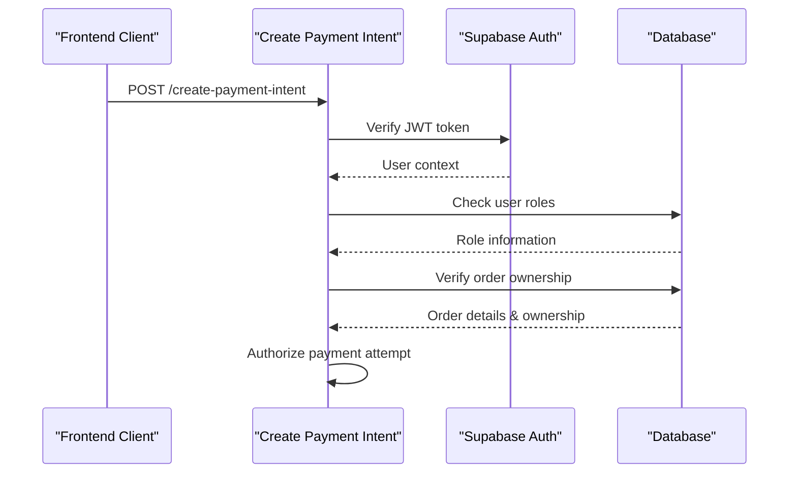
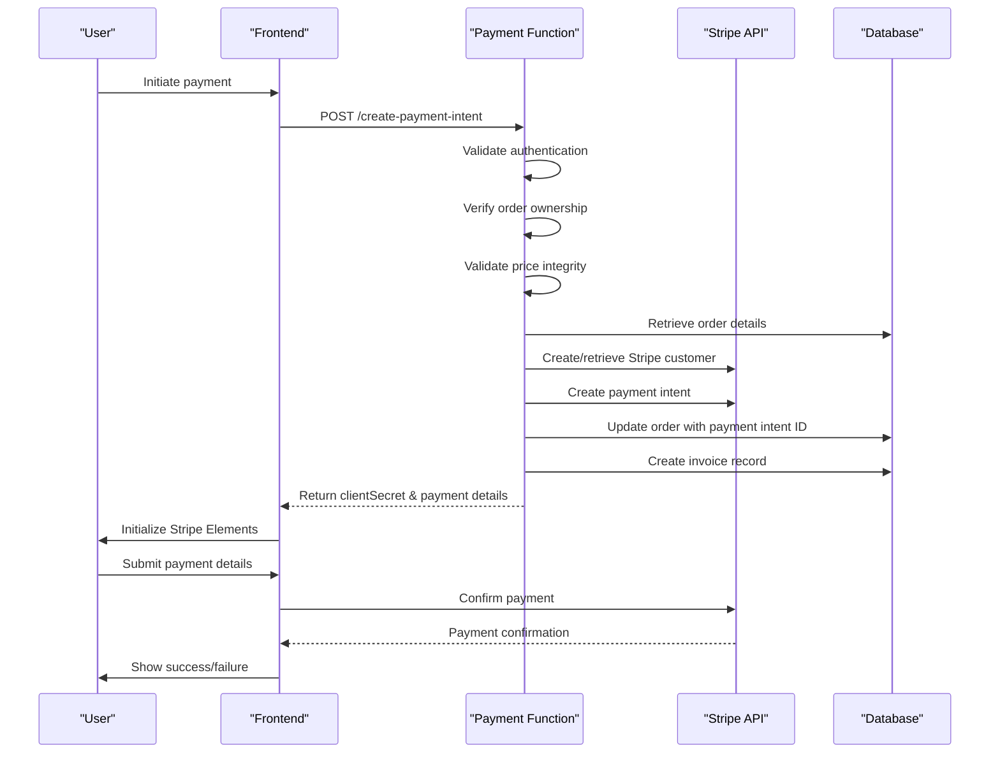

# Create Payment Intent API Documentation

<cite>
**Referenced Files in This Document**
- [supabase/functions/create-payment-intent/index.ts](file://supabase/functions/create-payment-intent/index.ts)
- [src/hooks/usePayment.ts](file://src/hooks/usePayment.ts)
- [src/components/payment/PaymentForm.tsx](file://src/components/payment/PaymentForm.tsx)
- [src/pages/PaymentCheckout.tsx](file://src/pages/PaymentCheckout.tsx)
- [src/pages/PaymentSuccess.tsx](file://src/pages/PaymentSuccess.tsx)
- [supabase/functions/_shared/logger.ts](file://supabase/functions/_shared/logger.ts)
- [supabase/functions/stripe-webhook/index.ts](file://supabase/functions/stripe-webhook/index.ts)
- [supabase/FIXED_SETUP_PART1.sql](file://supabase/FIXED_SETUP_PART1.sql)
</cite>

## Table of Contents
1. [Introduction](#introduction)
2. [API Endpoint Specification](#api-endpoint-specification)
3. [Security Architecture](#security-architecture)
4. [Request and Response Schema](#request-and-response-schema)
5. [Payment Workflow](#payment-workflow)
6. [Frontend Implementation](#frontend-implementation)
7. [Security Measures](#security-measures)
8. [Error Handling](#error-handling)
9. [Logging and Monitoring](#logging-and-monitoring)
10. [Database Schema](#database-schema)

## Introduction

The Create Payment Intent function is a serverless Edge Function that integrates with Stripe to securely process payments for orders in the Sleek Apparels system. This function handles the complete payment initiation flow, from validating order authenticity to creating Stripe payment intents and managing invoice records.

The function serves as the bridge between the frontend payment interface and Stripe's payment processing infrastructure, ensuring secure, auditable, and reliable payment transactions while maintaining strict authorization controls.

## API Endpoint Specification

### HTTP Method and Endpoint
- **Method**: `POST`
- **Endpoint**: `/functions/v1/create-payment-intent`
- **Content-Type**: `application/json`

### Authentication Requirements

The function requires authentication via Supabase JWT tokens:

```typescript
// Authentication header format
Authorization: Bearer <jwt-token>
```

### Request Parameters

| Parameter | Type | Required | Description |
|-----------|------|----------|-------------|
| `orderId` | string | Yes | UUID of the order to be paid |
| `paymentType` | string | Yes | Payment type: `'deposit'`, `'balance'`, or `'full'` |

### Supported Payment Types

- **Deposit**: 30% of the order total (default)
- **Balance**: 70% of the order total
- **Full**: 100% of the order total

**Section sources**
- [supabase/functions/create-payment-intent/index.ts](file://supabase/functions/create-payment-intent/index.ts#L53-L57)

## Security Architecture

### Authorization Model

The function implements a dual-layer authorization system:

1. **Supabase Authentication**: Validates JWT token and retrieves user context
2. **Order Ownership Verification**: Ensures users can only pay for orders they own or are admins



**Diagram sources**
- [supabase/functions/create-payment-intent/index.ts](file://supabase/functions/create-payment-intent/index.ts#L39-L97)

### Access Control Rules

- **Buyers**: Can only pay for orders where `buyer_id` matches their user ID
- **Admins**: Can pay for any order regardless of ownership
- **Unauthorized Access**: Returns 403 Forbidden with detailed error logging

**Section sources**
- [supabase/functions/create-payment-intent/index.ts](file://supabase/functions/create-payment-intent/index.ts#L77-L97)

## Request and Response Schema

### Request Schema

```typescript
interface CreatePaymentIntentRequest {
  orderId: string;           // UUID of the order
  paymentType: 'deposit' | 'balance' | 'full'; // Payment type
}
```

### Response Schema

The function returns a structured response containing payment intent details:

```typescript
interface CreatePaymentIntentResponse {
  clientSecret: string;      // Stripe client secret for frontend
  amount: number;            // Payment amount in USD
  paymentIntentId: string;   // Stripe payment intent ID
}
```

### Response Example

```json
{
  "clientSecret": "pi_1OYzqZ2eZvKYlo2C0NqJ1X7R_secret_1234567890abcdef",
  "amount": 150.00,
  "paymentIntentId": "pi_1OYzqZ2eZvKYlo2C0NqJ1X7R"
}
```

**Section sources**
- [supabase/functions/create-payment-intent/index.ts](file://supabase/functions/create-payment-intent/index.ts#L271-L278)

## Payment Workflow

### Complete Payment Flow



**Diagram sources**
- [supabase/functions/create-payment-intent/index.ts](file://supabase/functions/create-payment-intent/index.ts#L184-L267)
- [src/pages/PaymentCheckout.tsx](file://src/pages/PaymentCheckout.tsx#L31-L54)

### Step-by-Step Process

1. **Authentication Validation**: Verify JWT token and retrieve user context
2. **Order Retrieval**: Fetch order details with buyer information
3. **Authorization Check**: Verify user ownership or admin privileges
4. **Price Integrity Validation**: Compare order price against original quote (±0.5% tolerance)
5. **Customer Management**: Create or retrieve Stripe customer
6. **Payment Intent Creation**: Generate Stripe payment intent with metadata
7. **Order Updates**: Store payment intent ID and calculate amounts
8. **Invoice Creation**: Generate invoice record in database
9. **Response Generation**: Return clientSecret for frontend integration

**Section sources**
- [supabase/functions/create-payment-intent/index.ts](file://supabase/functions/create-payment-intent/index.ts#L151-L267)

## Frontend Implementation

### React Hook Implementation

The frontend uses a custom React hook for payment management:

```typescript
// usePayment.ts - Hook implementation
const createPaymentIntent = async (
  orderId: string,
  paymentType: 'deposit' | 'balance' | 'full'
) => {
  try {
    setLoading(true);
    const { data, error } = await supabase.functions.invoke('create-payment-intent', {
      body: { orderId, paymentType },
    });
    if (error) throw error;
    return data;
  } catch (error: any) {
    // Error handling and user feedback
    throw error;
  } finally {
    setLoading(false);
  }
};
```

### Payment Form Integration

The frontend payment form integrates with Stripe.js:

```typescript
// PaymentForm.tsx - Stripe integration
const handleSubmit = async (e: React.FormEvent) => {
  e.preventDefault();
  if (!stripe || !elements) return;
  
  setIsProcessing(true);
  
  try {
    const { error } = await stripe.confirmPayment({
      elements,
      confirmParams: {
        return_url: `${window.location.origin}/payment/success?orderId=${orderId}`,
      },
    });
    
    if (error) {
      // Handle payment failure
    } else {
      // Handle successful payment
    }
  } catch (error) {
    // Handle payment errors
  } finally {
    setIsProcessing(false);
  }
};
```

**Section sources**
- [src/hooks/usePayment.ts](file://src/hooks/usePayment.ts#L9-L33)
- [src/components/payment/PaymentForm.tsx](file://src/components/payment/PaymentForm.tsx#L20-L46)

## Security Measures

### Price Integrity Validation

The function implements robust price validation to prevent fraud:

```typescript
// Price integrity check with 0.5% tolerance
const maxAllowedPrice = quote.total_price * 1.005;
const minAllowedPrice = quote.total_price * 0.995;

if (orderPrice < minAllowedPrice || orderPrice > maxAllowedPrice) {
  throw new Error('Order price does not match quote. Please refresh and try again.');
}
```

### Recent Modification Detection

The system monitors order modification timestamps to detect potential tampering:

```typescript
// Detect orders modified within 5 minutes before payment
const timeSinceUpdate = Date.now() - updatedAt.getTime();
if (timeSinceUpdate < 5 * 60 * 1000 && timeSinceCreation > timeSinceUpdate) {
  logger.warn('Order recently modified before payment', { 
    orderId: sanitizeOrderId(orderId), 
    updatedAt: order.updated_at 
  });
}
```

### Protection Against Replay Attacks

While not explicitly implemented in this function, the system employs several replay attack mitigations:

- **Unique Invoice Numbers**: Randomly generated invoice numbers prevent reuse
- **Payment Status Tracking**: Orders cannot be paid multiple times
- **Stripe Metadata**: Payment intents include unique order identifiers

### Data Sanitization

All sensitive data is automatically sanitized in logs:

- **Email Addresses**: Truncated to first 3 characters
- **Phone Numbers**: Partially masked with asterisks
- **Order IDs**: First 8 characters shown with hyphen separator
- **Tokens/Secrets**: Completely redacted

**Section sources**
- [supabase/functions/create-payment-intent/index.ts](file://supabase/functions/create-payment-intent/index.ts#L108-L149)
- [supabase/functions/_shared/logger.ts](file://supabase/functions/_shared/logger.ts#L61-L81)

## Error Handling

### Common Error Scenarios

| Error Condition | HTTP Status | Message | Resolution |
|----------------|-------------|---------|------------|
| Missing Authentication | 401 | "Authentication required" | Provide valid JWT token |
| Invalid Authentication | 401 | "Invalid authentication" | Refresh authentication token |
| Unauthorized Access | 403 | "You are not authorized to pay for this order" | Verify user permissions |
| Order Not Found | 400 | "Order not found" | Check order ID validity |
| Already Paid | 400 | "Order has already been paid" | Check order payment status |
| Price Mismatch | 400 | "Order price does not match quote" | Refresh order details |
| Payment Amount Too Low | 400 | "Payment amount is too low" | Ensure minimum $1.00 |

### Error Response Format

```typescript
interface ErrorResponse {
  error: string;  // Human-readable error message
}
```

### Error Recovery Strategies

1. **Client-Side Retry**: Automatic retry with exponential backoff
2. **User Feedback**: Clear error messages with suggested actions
3. **Logging**: Comprehensive error logging for debugging
4. **Graceful Degradation**: Fallback to alternative payment methods

**Section sources**
- [supabase/functions/create-payment-intent/index.ts](file://supabase/functions/create-payment-intent/index.ts#L152-L155)
- [supabase/functions/create-payment-intent/index.ts](file://supabase/functions/create-payment-intent/index.ts#L279-L286)

## Logging and Monitoring

### Structured Logging System

The function uses a centralized logging utility with automatic PII sanitization:

```typescript
// Logger usage examples
logger.info('Creating payment intent', { 
  orderId: sanitizeOrderId(orderId), 
  amount: `$${(amount/100).toFixed(2)}`, 
  type: paymentType 
});

logger.warn('Order recently modified before payment', { 
  orderId: sanitizeOrderId(orderId), 
  updatedAt: order.updated_at 
});

logger.error('Order already paid', null, { orderId: sanitizeOrderId(orderId) });
```

### Audit Trail Features

1. **Operation Logging**: Every payment attempt is logged with context
2. **Security Events**: Unauthorized access attempts are flagged
3. **Price Validation**: Price mismatches are tracked
4. **System Errors**: Technical failures are captured with stack traces

### Log Levels

- **INFO**: General operational events
- **WARN**: Recoverable issues and suspicious activities
- **ERROR**: Failures and security violations
- **SUCCESS**: Completed payment operations

**Section sources**
- [supabase/functions/create-payment-intent/index.ts](file://supabase/functions/create-payment-intent/index.ts#L178-L269)
- [supabase/functions/_shared/logger.ts](file://supabase/functions/_shared/logger.ts#L103-L164)

## Database Schema

### Related Tables

#### Orders Table
```sql
CREATE TABLE public.orders (
  id uuid DEFAULT gen_random_uuid() NOT NULL,
  order_number text NOT NULL,
  buyer_id uuid NOT NULL,
  payment_status text DEFAULT 'pending'::text,
  deposit_amount numeric,
  balance_amount numeric,
  stripe_payment_intent_id text,
  stripe_customer_id text,
  created_at timestamp with time zone DEFAULT now(),
  updated_at timestamp with time zone DEFAULT now()
);
```

#### Invoices Table
```sql
CREATE TABLE public.invoices (
  id uuid DEFAULT gen_random_uuid() NOT NULL,
  order_id uuid,
  invoice_number text NOT NULL,
  amount numeric NOT NULL,
  payment_type text NOT NULL,
  status text DEFAULT 'pending'::text,
  due_date date,
  paid_at timestamp with time zone,
  stripe_payment_intent_id text,
  created_at timestamp with time zone DEFAULT now(),
  updated_at timestamp with time zone DEFAULT now()
);
```

### Constraints and Validations

- **Payment Types**: Only `'deposit'`, `'balance'`, or `'full'` allowed
- **Status Values**: `'pending'`, `'paid'`, `'cancelled'`, `'refunded'`
- **Amount Validation**: Minimum $1.00 payment amount
- **Price Integrity**: ±0.5% tolerance for currency rounding

**Section sources**
- [supabase/FIXED_SETUP_PART1.sql](file://supabase/FIXED_SETUP_PART1.sql#L381-L397)
- [supabase/FIXED_SETUP_PART1.sql](file://supabase/FIXED_SETUP_PART1.sql#L465-L499)