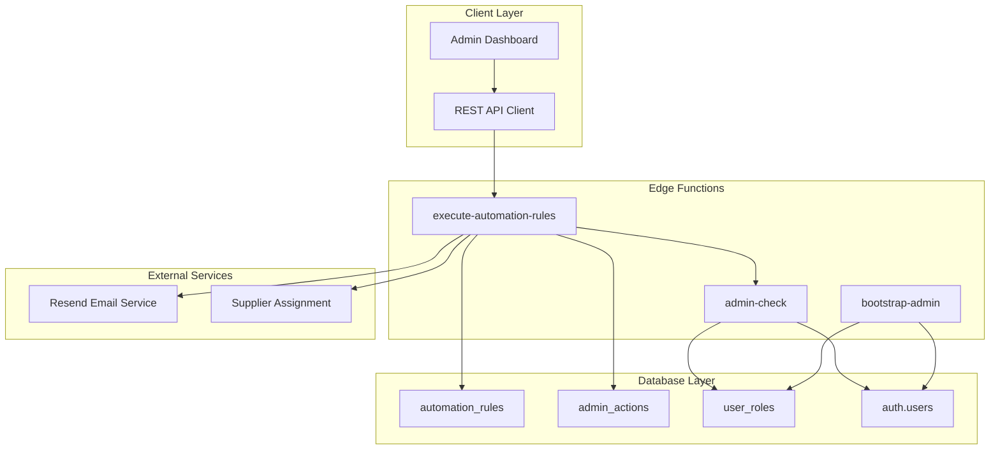
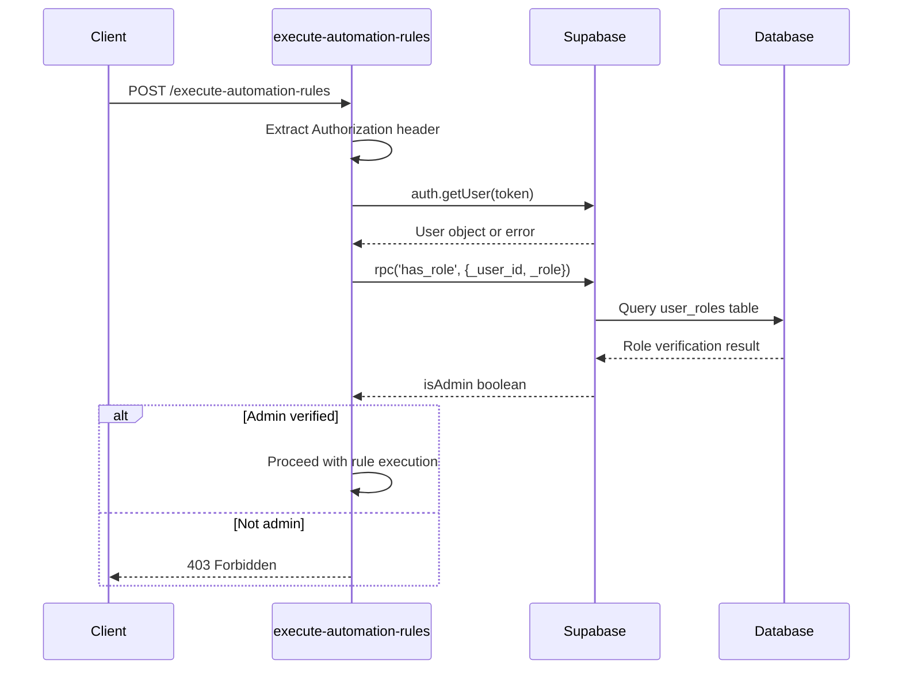
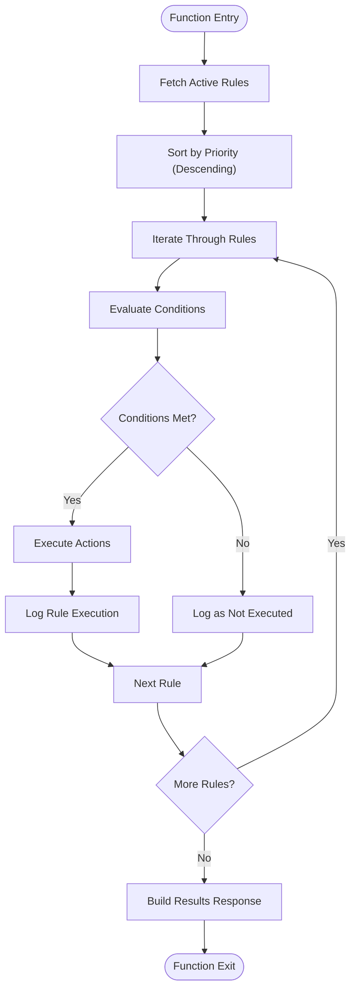
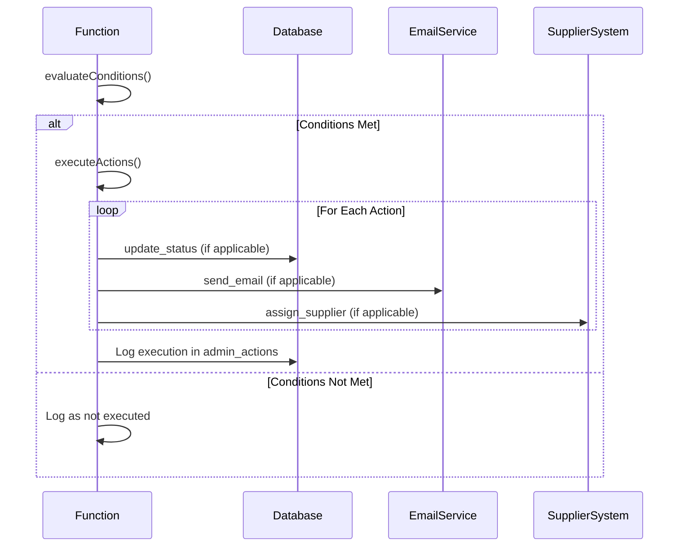
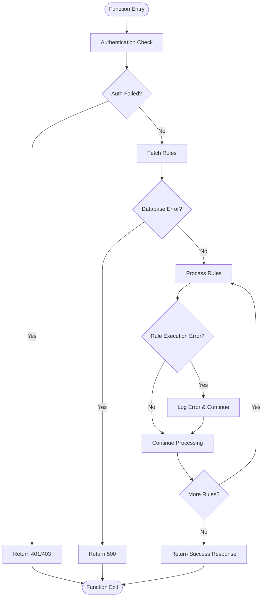
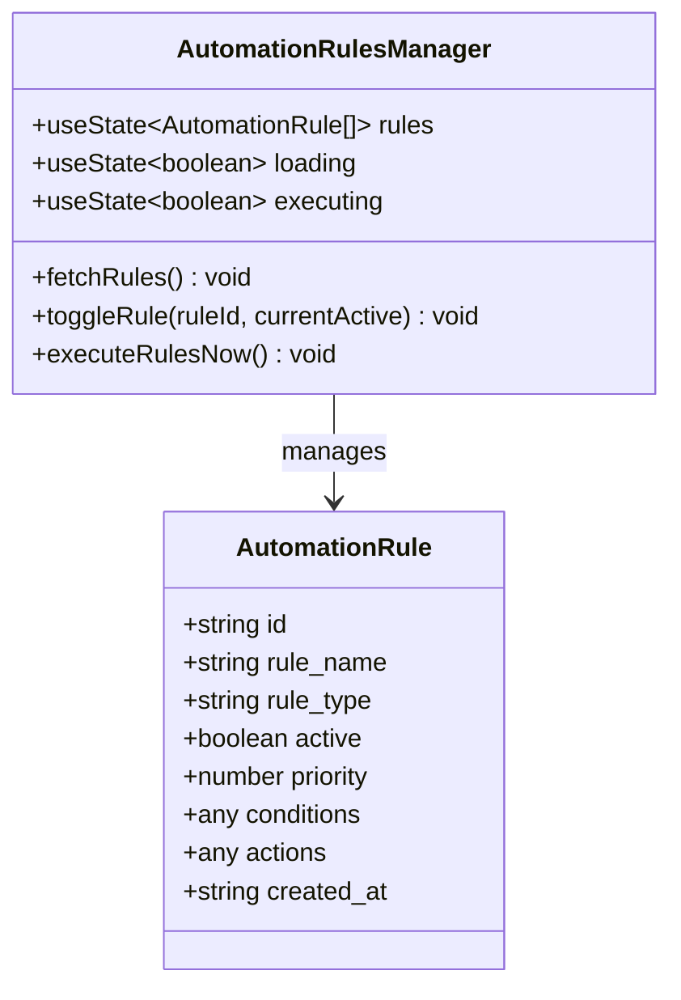

# Execute Automation Rules

<cite>
**Referenced Files in This Document**
- [index.ts](file://supabase/functions/execute-automation-rules/index.ts)
- [AutomationRulesManager.tsx](file://src/components/admin/AutomationRulesManager.tsx)
- [types.ts](file://src/integrations/supabase/types.ts)
- [useAdminAuth.ts](file://src/hooks/useAdminAuth.ts)
- [20251115150759_remix_migration_from_pg_dump.sql](file://supabase/migrations/20251115150759_remix_migration_from_pg_dump.sql)
- [admin-check/index.ts](file://supabase/functions/admin-check/index.ts)
- [bootstrap-admin/index.ts](file://supabase/functions/bootstrap-admin/index.ts)
</cite>

## Table of Contents
1. [Introduction](#introduction)
2. [System Architecture](#system-architecture)
3. [HTTP Endpoint Specification](#http-endpoint-specification)
4. [Security Model](#security-model)
5. [Rule Processing Engine](#rule-processing-engine)
6. [Response Schema](#response-schema)
7. [Two-Phase Execution Process](#two-phase-execution-process)
8. [Action System](#action-system)
9. [Logging and Auditing](#logging-and-auditing)
10. [Error Handling Strategy](#error-handling-strategy)
11. [UI Management Interface](#ui-management-interface)
12. [Extensibility and Future Enhancements](#extensibility-and-future-enhancements)
13. [Performance Considerations](#performance-considerations)
14. [Troubleshooting Guide](#troubleshooting-guide)

## Introduction

The execute-automation-rules function serves as the core workflow automation engine for administrative tasks within the Sleek Apparels platform. This serverless function orchestrates the execution of automated business rules that govern various administrative processes, from order management to supplier coordination. The system implements a sophisticated two-phase execution model with comprehensive error handling and extensive logging capabilities.

The function operates as a RESTful HTTP endpoint that accepts POST requests with no required parameters, relying solely on Supabase JWT authentication for security. It processes active automation rules ordered by priority, evaluates conditions, executes actions, and maintains detailed audit trails of all rule executions.

## System Architecture

The execute-automation-rules function follows a microservices architecture pattern, deployed as a Deno-based serverless function within the Supabase ecosystem. The system integrates seamlessly with the broader platform infrastructure through Supabase's edge functions and real-time capabilities.



**Diagram sources**
- [index.ts](file://supabase/functions/execute-automation-rules/index.ts#L9-L169)
- [AutomationRulesManager.tsx](file://src/components/admin/AutomationRulesManager.tsx#L63-L77)

**Section sources**
- [index.ts](file://supabase/functions/execute-automation-rules/index.ts#L1-L169)
- [AutomationRulesManager.tsx](file://src/components/admin/AutomationRulesManager.tsx#L1-L165)

## HTTP Endpoint Specification

### Endpoint Details

**URL:** `/functions/v1/execute-automation-rules`  
**Method:** POST  
**Content-Type:** `application/json`  
**Authentication:** Required (Supabase JWT Bearer token)  
**CORS Headers:** Enabled for cross-origin requests

### Request Format

The endpoint accepts HTTP POST requests with the following characteristics:

- **No required parameters**: The function operates independently of request body content
- **Authentication header required**: `Authorization: Bearer <jwt-token>`
- **CORS support**: Automatic handling of preflight OPTIONS requests
- **Content validation**: JSON content type enforcement

### Security Headers

The function implements comprehensive CORS configuration:

```typescript
const corsHeaders = {
  "Access-Control-Allow-Origin": "*",
  "Access-Control-Allow-Headers": "authorization, x-client-info, apikey, content-type"
};
```

**Section sources**
- [index.ts](file://supabase/functions/execute-automation-rules/index.ts#L4-L7)

## Security Model

### Admin Role Verification

The security model implements a multi-layered authentication and authorization system centered around the admin role verification mechanism.



**Diagram sources**
- [index.ts](file://supabase/functions/execute-automation-rules/index.ts#L20-L51)
- [admin-check/index.ts](file://supabase/functions/admin-check/index.ts#L44-L73)

### Role-Based Access Control

The system employs PostgreSQL's `has_role` function for efficient role verification:

```sql
CREATE FUNCTION public.has_role(_user_id uuid, _role public.app_role) 
RETURNS boolean
LANGUAGE sql STABLE SECURITY DEFINER
AS $$
  SELECT EXISTS (
    SELECT 1
    FROM public.user_roles
    WHERE user_id = _user_id
      AND role = _role
  )
$$;
```

### Authentication Flow

1. **Token Extraction**: Function extracts JWT from Authorization header
2. **User Validation**: Validates token against Supabase auth service
3. **Role Verification**: Calls `has_role` RPC with user ID and 'admin' role
4. **Access Decision**: Grants or denies access based on role verification result

**Section sources**
- [index.ts](file://supabase/functions/execute-automation-rules/index.ts#L20-L51)
- [20251115150759_remix_migration_from_pg_dump.sql](file://supabase/migrations/20251115150759_remix_migration_from_pg_dump.sql#L354-L381)

## Rule Processing Engine

### Rule Discovery and Ordering

The function begins by discovering all active automation rules from the database:



**Diagram sources**
- [index.ts](file://supabase/functions/execute-automation-rules/index.ts#L55-L110)

### Database Query Implementation

The function retrieves rules using a sophisticated query that ensures optimal performance:

```typescript
const { data: rules, error: rulesError } = await supabaseClient
  .from('automation_rules')
  .select('*')
  .eq('active', true)
  .order('priority', { ascending: false });
```

### Rule Priority System

Rules are processed in descending priority order, ensuring that high-priority rules execute before lower-priority ones. This ordering mechanism enables administrators to control the execution sequence of conflicting rules.

**Section sources**
- [index.ts](file://supabase/functions/execute-automation-rules/index.ts#L55-L62)

## Response Schema

### Success Response Format

When the function executes successfully, it returns a structured JSON response containing detailed execution results:

```typescript
{
  success: true,
  results: [
    {
      rule_id: string,
      rule_name: string,
      executed: boolean,
      actions: ActionResults[],
      reason?: string,
      error?: string
    }
  ]
}
```

### Response Structure Details

| Field | Type | Description |
|-------|------|-------------|
| `success` | boolean | Indicates overall operation success |
| `results` | Array | Collection of individual rule execution results |
| `rule_id` | string | Unique identifier of the executed rule |
| `rule_name` | string | Human-readable name of the rule |
| `executed` | boolean | Whether the rule was executed successfully |
| `actions` | Array | Results of individual actions performed |
| `reason` | string | Explanation when rule wasn't executed |
| `error` | string | Error message when execution failed |

### Partial Success Handling

The function implements a sophisticated partial success strategy where individual rule failures don't prevent subsequent rule processing. Each rule's execution status is reported independently, allowing administrators to identify which rules succeeded and which failed.

**Section sources**
- [index.ts](file://supabase/functions/execute-automation-rules/index.ts#L112-L114)

## Two-Phase Execution Process

### Phase 1: Condition Evaluation

The first phase involves evaluating whether the predefined conditions for each rule are met. Currently, this phase implements a placeholder evaluation mechanism:

```typescript
async function evaluateConditions(client: any, conditions: any): Promise<boolean> {
  console.log("Evaluating conditions:", conditions);
  return true; // Placeholder implementation
}
```

### Phase 2: Action Execution

The second phase executes the actions associated with rules whose conditions are met:



**Diagram sources**
- [index.ts](file://supabase/functions/execute-automation-rules/index.ts#L72-L110)

### Condition Evaluation Extensibility

The condition evaluation system is designed for future expansion. The placeholder implementation allows for easy replacement with sophisticated business logic while maintaining backward compatibility.

**Section sources**
- [index.ts](file://supabase/functions/execute-automation-rules/index.ts#L125-L129)
- [index.ts](file://supabase/functions/execute-automation-rules/index.ts#L72-L110)

## Action System

### Supported Action Types

The function supports three primary action types, each designed for specific administrative workflows:

#### 1. Update Status Action

Updates the status of database records across various entities:

```typescript
case 'update_status':
  const { error } = await client
    .from(action.params.table)
    .update({ status: action.params.new_status })
    .eq('id', action.params.id);
  
  results.push({ action: 'update_status', success: !error, error });
```

#### 2. Send Email Action

Triggers email notifications through the integrated email service:

```typescript
case 'send_email':
  console.log("Sending email:", action.params);
  results.push({ action: 'send_email', success: true });
```

#### 3. Assign Supplier Action

Initiates supplier assignment processes:

```typescript
case 'assign_supplier':
  console.log("Assigning supplier:", action.params);
  results.push({ action: 'assign_supplier', success: true });
```

### Action Execution Flow

Each action is executed within a try-catch block to ensure individual action failures don't impact other actions in the same rule execution.

### Action Result Reporting

Individual action results include:
- **Action type**: Identifies the specific operation performed
- **Success status**: Boolean indicating execution outcome
- **Error information**: Detailed error messages for failed actions

**Section sources**
- [index.ts](file://supabase/functions/execute-automation-rules/index.ts#L132-L168)

## Logging and Auditing

### Comprehensive Audit Trail

The function maintains detailed audit logs in the `admin_actions` table for all rule executions:

```typescript
await supabaseClient.from('admin_actions').insert({
  action_type: 'automation_rule_executed',
  entity_type: 'automation_rule',
  entity_id: rule.id,
  details: { rule_name: rule.rule_name, actions: actionResults }
});
```

### Audit Log Structure

| Column | Type | Description |
|--------|------|-------------|
| `action_type` | string | Type of action ('automation_rule_executed') |
| `entity_type` | string | Associated entity type ('automation_rule') |
| `entity_id` | string | Rule identifier |
| `details` | jsonb | Detailed execution information |
| `admin_id` | uuid | Administrator who triggered execution |
| `created_at` | timestamp | Timestamp of execution |

### Real-Time Monitoring

The logging system enables real-time monitoring of automation rule executions, providing administrators with immediate visibility into system behavior and facilitating rapid troubleshooting.

**Section sources**
- [index.ts](file://supabase/functions/execute-automation-rules/index.ts#L87-L92)

## Error Handling Strategy

### Multi-Level Error Handling

The function implements a comprehensive error handling strategy that ensures system stability while providing detailed diagnostic information:



**Diagram sources**
- [index.ts](file://supabase/functions/execute-automation-rules/index.ts#L116-L122)

### Error Categories

1. **Authentication Errors**: Invalid or missing JWT tokens
2. **Authorization Errors**: Insufficient admin privileges
3. **Database Errors**: Query failures or constraint violations
4. **Rule Execution Errors**: Individual rule processing failures
5. **Action Execution Errors**: Specific action failure scenarios

### Partial Success Strategy

The function implements a partial success strategy where individual rule failures don't prevent subsequent rule processing. This approach ensures system resilience and provides comprehensive feedback about rule execution status.

### Error Reporting

All errors are captured and included in the results array with detailed error messages, enabling administrators to diagnose and resolve issues effectively.

**Section sources**
- [index.ts](file://supabase/functions/execute-automation-rules/index.ts#L101-L109)
- [index.ts](file://supabase/functions/execute-automation-rules/index.ts#L116-L122)

## UI Management Interface

### Automation Rules Manager Component

The frontend interface provides comprehensive management capabilities through the AutomationRulesManager component:



**Diagram sources**
- [AutomationRulesManager.tsx](file://src/components/admin/AutomationRulesManager.tsx#L10-L19)

### Key Features

1. **Rule Listing**: Displays all automation rules with priority sorting
2. **Activation Control**: Toggle rule activation/deactivation
3. **Immediate Execution**: Execute rules on-demand
4. **Visual Feedback**: Loading states and success/error notifications
5. **Rule Details**: View conditions and actions for each rule

### User Interaction Flow

1. **Rule Discovery**: Browse active and inactive rules
2. **Activation Management**: Enable/disable rules as needed
3. **On-Demand Execution**: Trigger rule execution manually
4. **Result Review**: View execution results and status

**Section sources**
- [AutomationRulesManager.tsx](file://src/components/admin/AutomationRulesManager.tsx#L21-L165)

## Extensibility and Future Enhancements

### Condition Evaluation Enhancement

The current placeholder condition evaluation system is designed for easy enhancement:

```typescript
// Future enhancement possibilities:
// - Business logic evaluation
// - Time-based conditions
// - Data-driven conditions
// - Complex logical operators
// - External system integration
```

### Action System Expansion

The action system supports future enhancements:

```typescript
// Potential future actions:
// - Webhook triggers
// - External API calls
// - File system operations
// - Database backups
// - Report generation
```

### Performance Optimization Opportunities

1. **Parallel Execution**: Process multiple rules concurrently
2. **Caching**: Cache frequently accessed rule configurations
3. **Batch Operations**: Group similar actions for efficiency
4. **Async Processing**: Offload long-running operations

### Monitoring and Analytics

Future enhancements could include:

- **Execution Metrics**: Track rule performance and success rates
- **Trend Analysis**: Identify patterns in rule execution
- **Alert Systems**: Notify administrators of rule failures
- **Automated Remediation**: Self-healing capabilities

**Section sources**
- [index.ts](file://supabase/functions/execute-automation-rules/index.ts#L125-L129)

## Performance Considerations

### Scalability Factors

1. **Rule Complexity**: Complex conditions and actions impact execution time
2. **Database Load**: Concurrent rule executions affect database performance
3. **External Dependencies**: Third-party service calls introduce latency
4. **Memory Usage**: Large rule sets consume more memory

### Optimization Strategies

1. **Indexing**: Proper indexing on `automation_rules.active` and `priority` fields
2. **Connection Pooling**: Efficient database connection management
3. **Circuit Breakers**: Protection against external service failures
4. **Timeout Management**: Configurable timeouts for external calls

### Monitoring Metrics

Key performance indicators to monitor:

- **Execution Time**: Total time for rule processing
- **Success Rate**: Percentage of successful rule executions
- **Error Rate**: Frequency of rule execution failures
- **Resource Utilization**: Memory and CPU usage patterns

## Troubleshooting Guide

### Common Issues and Solutions

#### Authentication Failures
**Symptoms**: 401 Unauthorized responses
**Causes**: Invalid or expired JWT tokens
**Solutions**: Refresh authentication token, verify token validity

#### Authorization Errors
**Symptoms**: 403 Forbidden responses
**Causes**: Insufficient admin privileges
**Solutions**: Verify user has admin role, check role assignments

#### Database Connection Issues
**Symptoms**: 500 Internal Server errors during rule fetching
**Causes**: Database connectivity problems, query timeouts
**Solutions**: Check database health, optimize queries, increase timeout limits

#### Rule Execution Failures
**Symptoms**: Individual rule failures in results array
**Causes**: Invalid conditions, malformed actions, external service errors
**Solutions**: Review rule configuration, check external service status

### Debugging Techniques

1. **Enable Logging**: Monitor console output for detailed error messages
2. **Check Audit Logs**: Review `admin_actions` table for execution history
3. **Validate Rules**: Ensure rule conditions and actions are properly formatted
4. **Test Incrementally**: Execute rules individually to isolate issues

### Diagnostic Commands

```sql
-- Check active rules
SELECT * FROM automation_rules WHERE active = true ORDER BY priority DESC;

-- Review recent executions
SELECT * FROM admin_actions 
WHERE action_type = 'automation_rule_executed' 
ORDER BY created_at DESC LIMIT 100;

-- Verify admin role
SELECT * FROM user_roles WHERE user_id = '<user-id>' AND role = 'admin';
```

**Section sources**
- [index.ts](file://supabase/functions/execute-automation-rules/index.ts#L101-L109)
- [index.ts](file://supabase/functions/execute-automation-rules/index.ts#L116-L122)