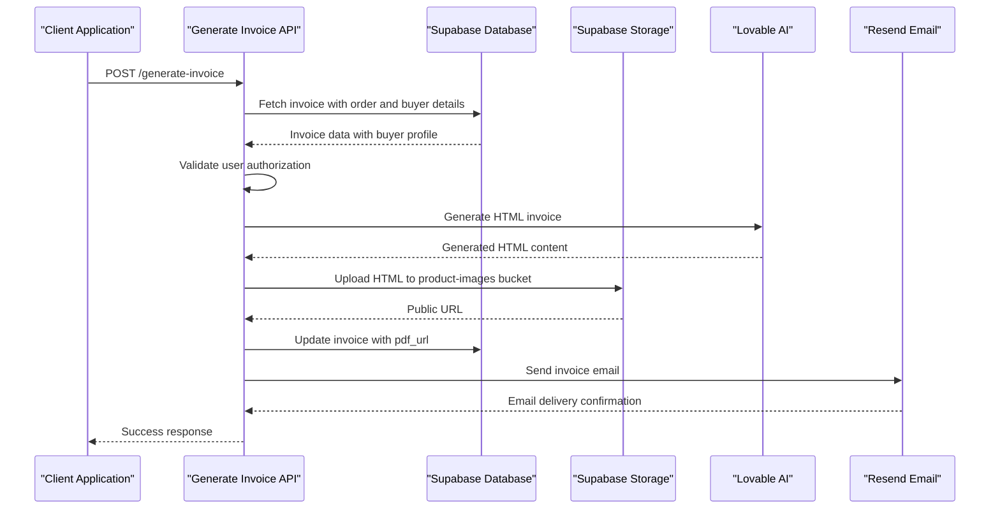
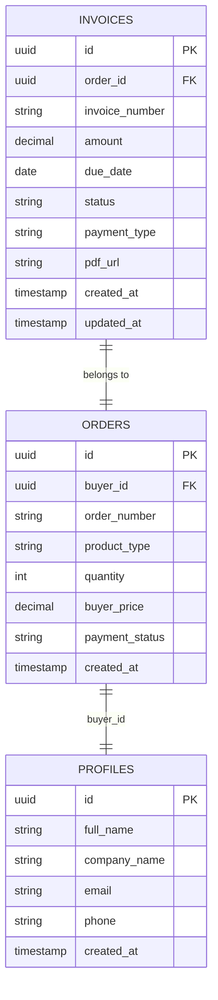
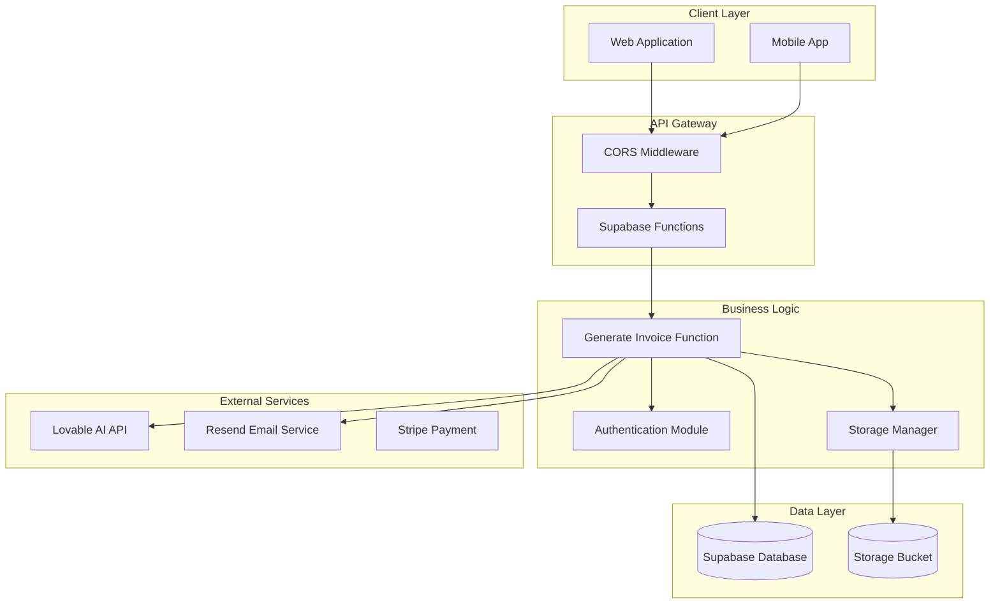

# Generate Invoice API Documentation

<cite>
**Referenced Files in This Document**
- [supabase/functions/generate-invoice/index.ts](file://supabase/functions/generate-invoice/index.ts)
- [src/components/buyer/InvoicesPaymentsSection.tsx](file://src/components/buyer/InvoicesPaymentsSection.tsx)
- [src/hooks/usePayment.ts](file://src/hooks/usePayment.ts)
- [src/types/database.ts](file://src/types/database.ts)
- [src/integrations/supabase/client.ts](file://src/integrations/supabase/client.ts)
- [supabase/functions/create-payment-intent/index.ts](file://supabase/functions/create-payment-intent/index.ts)
- [supabase/migrations/20251115150759_remix_migration_from_pg_dump.sql](file://supabase/migrations/20251115150759_remix_migration_from_pg_dump.sql)
- [supabase/migrations/20250122010000_setup_product_images_storage.sql](file://supabase/migrations/20250122010000_setup_product_images_storage.sql)
</cite>

## Table of Contents
1. [Introduction](#introduction)
2. [API Endpoint Overview](#api-endpoint-overview)
3. [Authentication and Authorization](#authentication-and-authorization)
4. [Request Schema](#request-schema)
5. [Response Schema](#response-schema)
6. [Complete Workflow Process](#complete-workflow-process)
7. [Security Implementation](#security-implementation)
8. [Integration Examples](#integration-examples)
9. [Error Handling](#error-handling)
10. [Technical Architecture](#technical-architecture)
11. [Performance Considerations](#performance-considerations)
12. [Troubleshooting Guide](#troubleshooting-guide)

## Introduction

The Generate Invoice API creates professional financial documents for orders by combining Supabase data operations with AI-powered HTML generation. This system enables buyers and administrators to generate invoices that include professional HTML templates, automated email delivery, and seamless storage integration.

The API follows a multi-step process involving invoice data retrieval, AI-powered HTML generation using Lovable AI's Gemini model, secure storage in Supabase buckets, and automated email delivery via Resend with embedded invoice links.

## API Endpoint Overview

### HTTP Method and Endpoint
- **Method**: `POST`
- **Endpoint**: `/functions/v1/generate-invoice`
- **Content-Type**: `application/json`

### CORS Configuration
The API supports cross-origin requests with the following headers:
- `Access-Control-Allow-Origin`: `*`
- `Access-Control-Allow-Headers`: `authorization, x-client-info, apikey, content-type`

**Section sources**
- [supabase/functions/generate-invoice/index.ts](file://supabase/functions/generate-invoice/index.ts#L5-L8)

## Authentication and Authorization

### JWT Authentication
The API requires Supabase JWT authentication via the `Authorization` header:

```typescript
const authHeader = req.headers.get('Authorization');
if (!authHeader) {
  return new Response(
    JSON.stringify({ error: 'Authentication required' }),
    { status: 401, headers: { ...corsHeaders, 'Content-Type': 'application/json' } }
  );
}
```

### Authorization Checks
The system implements dual-role authorization:
1. **Buyer Authorization**: Must be the buyer of the associated order
2. **Admin Authorization**: Must have admin privileges

```typescript
// Role verification logic
const { data: userRole } = await supabaseAuth
  .from('user_roles')
  .select('role')
  .eq('user_id', user.id)
  .eq('role', 'admin')
  .maybeSingle();

const isAdmin = !!userRole;
const isBuyer = order.buyer_id === user.id;

if (!isAdmin && !isBuyer) {
  return new Response(
    JSON.stringify({ error: 'You are not authorized to generate this invoice' }),
    { status: 403, headers: { ...corsHeaders, 'Content-Type': 'application/json' } }
  );
}
```

**Section sources**
- [supabase/functions/generate-invoice/index.ts](file://supabase/functions/generate-invoice/index.ts#L18-L47)
- [supabase/functions/generate-invoice/index.ts](file://supabase/functions/generate-invoice/index.ts#L85-L106)

## Request Schema

### Required Parameters
| Parameter | Type | Description | Validation |
|-----------|------|-------------|------------|
| `invoice_id` | string | UUID of the invoice to generate | Required, must exist in invoices table |

### Request Body Example
```json
{
  "invoice_id": "123e4567-e89b-12d3-a456-426614174000"
}
```

### Validation Rules
- `invoice_id` must be a valid UUID
- Invoice must exist in the database
- User must have authorization to access the invoice

**Section sources**
- [supabase/functions/generate-invoice/index.ts](file://supabase/functions/generate-invoice/index.ts#L54-L58)

## Response Schema

### Success Response
```json
{
  "success": true,
  "invoice_url": "https://your-supabase-url.supabase.co/storage/v1/object/public/product-images/invoices/INV-2024-0001.html",
  "email_id": "abc123-def456-ghi789"
}
```

### Response Fields
| Field | Type | Description |
|-------|------|-------------|
| `success` | boolean | Indicates successful invoice generation |
| `invoice_url` | string | Public URL to the generated HTML invoice |
| `email_id` | string | Resend email delivery identifier |

### Status Codes
- `200 OK`: Invoice generated successfully
- `401 Unauthorized`: Missing or invalid authentication
- `403 Forbidden`: Insufficient permissions
- `404 Not Found`: Invoice not found
- `500 Internal Server Error`: Server-side processing error

**Section sources**
- [supabase/functions/generate-invoice/index.ts](file://supabase/functions/generate-invoice/index.ts#L223-L229)

## Complete Workflow Process

### Step 1: Data Retrieval and Joins
The system fetches comprehensive invoice data with proper relational joins:



**Diagram sources**
- [supabase/functions/generate-invoice/index.ts](file://supabase/functions/generate-invoice/index.ts#L60-L76)
- [supabase/functions/generate-invoice/index.ts](file://supabase/functions/generate-invoice/index.ts#L108-L167)

### Step 2: AI-Powered HTML Generation
The system uses Lovable AI's Gemini model to generate professional invoice HTML:

```typescript
const aiResponse = await fetch('https://ai.gateway.lovable.dev/v1/chat/completions', {
  method: 'POST',
  headers: {
    'Authorization': `Bearer ${LOVABLE_API_KEY}`,
    'Content-Type': 'application/json',
  },
  body: JSON.stringify({
    model: 'google/gemini-2.5-flash',
    messages: [
      {
        role: 'system',
        content: 'You are an expert at generating professional B2B invoice HTML documents.'
      },
      {
        role: 'user',
        content: `Generate a professional invoice HTML document with the following details...`
      }
    ],
  }),
});
```

### Step 3: Storage and URL Generation
Generated HTML is securely stored in Supabase's product-images bucket:

```typescript
const fileName = `invoices/${invoice.invoice_number}.html`;
const { error: uploadError } = await supabase.storage
  .from('product-images')
  .upload(fileName, new Blob([invoiceHtml], { type: 'text/html' }), {
    contentType: 'text/html',
    upsert: true,
  });

const { data: urlData } = supabase.storage
  .from('product-images')
  .getPublicUrl(fileName);
```

### Step 4: Database Updates
The invoice record is updated with the generated PDF URL:

```typescript
await supabase
  .from('invoices')
  .update({ pdf_url: urlData.publicUrl })
  .eq('id', invoice_id);
```

### Step 5: Automated Email Delivery
An email is sent to the buyer with the invoice attachment:

```typescript
const emailResult = await resend.emails.send({
  from: 'Sleek Apparels <invoices@sleekapparels.com>',
  to: [buyer.email],
  subject: `Invoice ${invoice.invoice_number} - Order #${order.order_number}`,
  html: `
    <div style="font-family: Arial, sans-serif; max-width: 600px; margin: 0 auto;">
      <h2>Invoice ${invoice.invoice_number}</h2>
      <p>Dear ${buyer.full_name || buyer.company_name},</p>
      <p>Please find your invoice for Order #${order.order_number} attached.</p>
      
      <div style="background: #f5f5f5; padding: 20px; border-radius: 8px; margin: 20px 0;">
        <h3 style="margin-top: 0;">Invoice Summary</h3>
        <p><strong>Invoice Number:</strong> ${invoice.invoice_number}</p>
        <p><strong>Amount:</strong> $${invoice.amount.toFixed(2)}</p>
        <p><strong>Due Date:</strong> ${new Date(invoice.due_date).toLocaleDateString()}</p>
        <p><strong>Payment Type:</strong> ${invoice.payment_type}</p>
      </div>
      
      <p><a href="${urlData.publicUrl}" style="display: inline-block; background: #2563eb; color: white; padding: 12px 24px; text-decoration: none; border-radius: 6px;">View Invoice</a></p>
      
      <p>Please process payment before the due date.</p>
      
      <p>Best regards,<br>Sleek Apparels Team</p>
    </div>
  `,
});
```

**Section sources**
- [supabase/functions/generate-invoice/index.ts](file://supabase/functions/generate-invoice/index.ts#L108-L219)

## Security Implementation

### Dual Supabase Client Pattern
The API implements a sophisticated security pattern using two separate Supabase clients:

1. **Authenticated Client**: Used for user authentication and authorization
2. **Service Role Client**: Used for data operations requiring elevated permissions

```typescript
// Authenticated client for authorization
const supabaseAuth = createClient(
  Deno.env.get('SUPABASE_URL') ?? '',
  Deno.env.get('SUPABASE_ANON_KEY') ?? '',
  {
    global: {
      headers: { Authorization: authHeader },
    },
  }
);

// Service role client for data operations
const supabase = createClient(
  Deno.env.get('SUPABASE_URL') ?? '',
  Deno.env.get('SUPABASE_SERVICE_ROLE_KEY') ?? ''
);
```

### Authorization Verification
The system verifies user authorization through multiple checks:

```typescript
// Check if user is admin
const { data: userRole } = await supabaseAuth
  .from('user_roles')
  .select('role')
  .eq('user_id', user.id)
  .eq('role', 'admin')
  .maybeSingle();

// Check if user is the order buyer
const isBuyer = order.buyer_id === user.id;

if (!isAdmin && !isBuyer) {
  return new Response(
    JSON.stringify({ error: 'You are not authorized to generate this invoice' }),
    { status: 403, headers: { ...corsHeaders, 'Content-Type': 'application/json' } }
  );
}
```

### Data Integrity Protection
- **Price Validation**: Ensures invoice amounts match order prices
- **Timestamp Verification**: Detects recent order modifications
- **Role-Based Access Control**: Prevents unauthorized access attempts

**Section sources**
- [supabase/functions/generate-invoice/index.ts](file://supabase/functions/generate-invoice/index.ts#L28-L52)
- [supabase/functions/generate-invoice/index.ts](file://supabase/functions/generate-invoice/index.ts#L85-L106)

## Integration Examples

### Frontend Integration with usePayment Hook

The `usePayment` hook provides seamless integration with the generate-invoice API:

```typescript
// Example usage in InvoicesPaymentsSection.tsx
const handleGenerateInvoice = async (invoiceId: string) => {
  try {
    const { data, error } = await supabase.functions.invoke('generate-invoice', {
      body: { invoice_id: invoiceId }
    });
    
    if (error) throw error;
    
    // Handle successful invoice generation
    toast({
      title: "Invoice Generated",
      description: "Your invoice is ready for download",
      action: (
        <Button variant="outline" onClick={() => window.open(data.invoice_url, '_blank')}>
          View Invoice
        </Button>
      ),
    });
  } catch (error) {
    toast({
      variant: "destructive",
      title: "Generation Failed",
      description: error.message
    });
  }
};
```

### Database Schema Integration

The invoice generation process integrates with the following database schema:



**Diagram sources**
- [src/types/database.ts](file://src/types/database.ts#L312-L326)
- [supabase/migrations/20251115150759_remix_migration_from_pg_dump.sql](file://supabase/migrations/20251115150759_remix_migration_from_pg_dump.sql#L1170-L1180)

### Invoice Lifecycle Management

The system manages invoice lifecycle with automatic due date calculations:

```typescript
// Due date calculation (7 days from invoice creation)
const invoice = await supabase
  .from('invoices')
  .insert({
    order_id: orderId,
    invoice_number: generateInvoiceNumber(),
    amount: calculatedAmount,
    due_date: new Date(Date.now() + 7 * 24 * 60 * 60 * 1000), // 7 days
    status: 'pending',
    payment_type: 'full',
    created_at: new Date()
  })
  .single();
```

**Section sources**
- [src/components/buyer/InvoicesPaymentsSection.tsx](file://src/components/buyer/InvoicesPaymentsSection.tsx#L101-L120)
- [src/hooks/usePayment.ts](file://src/hooks/usePayment.ts#L9-L33)

## Error Handling

### Common Error Scenarios

| Error Type | HTTP Status | Description | Resolution |
|------------|-------------|-------------|------------|
| `Authentication required` | 401 | Missing or invalid JWT token | Provide valid Supabase JWT |
| `Invalid authentication` | 401 | Expired or malformed token | Refresh authentication |
| `Invoice not found` | 404 | Invalid invoice_id | Verify invoice exists |
| `You are not authorized` | 403 | Insufficient permissions | Check user role and ownership |
| `Failed to generate invoice HTML` | 500 | AI service failure | Retry generation |
| `Storage upload error` | 500 | Failed to save invoice | Check storage permissions |

### Error Response Format
```json
{
  "error": "Specific error message describing the issue"
}
```

### Logging and Monitoring
The API implements comprehensive logging for security and debugging:

```typescript
console.error('Error generating invoice:', error);
console.error('Unauthorized invoice generation attempt:', { 
  userId: user.id, 
  orderId: order.id,
  orderBuyerId: order.buyer_id
});
```

**Section sources**
- [supabase/functions/generate-invoice/index.ts](file://supabase/functions/generate-invoice/index.ts#L232-L241)

## Technical Architecture

### System Architecture Overview



**Diagram sources**
- [supabase/functions/generate-invoice/index.ts](file://supabase/functions/generate-invoice/index.ts#L1-L243)

### Technology Stack
- **Runtime**: Deno (TypeScript)
- **Database**: Supabase Postgres
- **Storage**: Supabase Storage (product-images bucket)
- **AI Service**: Lovable AI (Gemini model)
- **Email Service**: Resend
- **Authentication**: Supabase Auth (JWT)

### Deployment Configuration
Environment variables required:
- `SUPABASE_URL`: Supabase project URL
- `SUPABASE_ANON_KEY`: Public anonymous key
- `SUPABASE_SERVICE_ROLE_KEY`: Service role secret key
- `LOVABLE_API_KEY`: Lovable AI API key
- `RESEND_API_KEY`: Resend email API key

**Section sources**
- [supabase/functions/generate-invoice/index.ts](file://supabase/functions/generate-invoice/index.ts#L1-L12)

## Performance Considerations

### Optimization Strategies

1. **Caching**: Generated HTML is cached in Supabase storage
2. **Parallel Processing**: AI generation and email sending occur concurrently
3. **Connection Pooling**: Supabase clients reuse connections efficiently
4. **Minimal Data Transfer**: Only required invoice data is fetched

### Scalability Features
- Stateless function design allows horizontal scaling
- External service dependencies support rate limiting
- Efficient database queries with proper indexing

### Monitoring Metrics
- Function execution time
- AI API response latency
- Email delivery success rate
- Storage upload failures

## Troubleshooting Guide

### Common Issues and Solutions

#### Authentication Failures
**Problem**: 401 Unauthorized responses
**Solution**: 
- Verify JWT token is included in Authorization header
- Check token expiration and refresh if needed
- Ensure user account is active

#### Authorization Errors
**Problem**: 403 Forbidden responses
**Solution**:
- Verify user is either the order buyer or has admin role
- Check user_roles table for appropriate permissions
- Ensure invoice belongs to the user's orders

#### AI Generation Failures
**Problem**: 500 errors during HTML generation
**Solution**:
- Check Lovable AI API key validity
- Verify AI service availability
- Review AI request payload format

#### Storage Upload Issues
**Problem**: Storage upload errors
**Solution**:
- Verify storage bucket permissions
- Check file size limits (5MB max)
- Ensure proper MIME type configuration

#### Email Delivery Problems
**Problem**: Emails not reaching recipients
**Solution**:
- Verify Resend API key configuration
- Check recipient email address format
- Review email template formatting

### Debugging Steps
1. Enable detailed logging in the function
2. Monitor external service response times
3. Verify database connectivity and permissions
4. Check storage bucket access policies

**Section sources**
- [supabase/functions/generate-invoice/index.ts](file://supabase/functions/generate-invoice/index.ts#L232-L241)