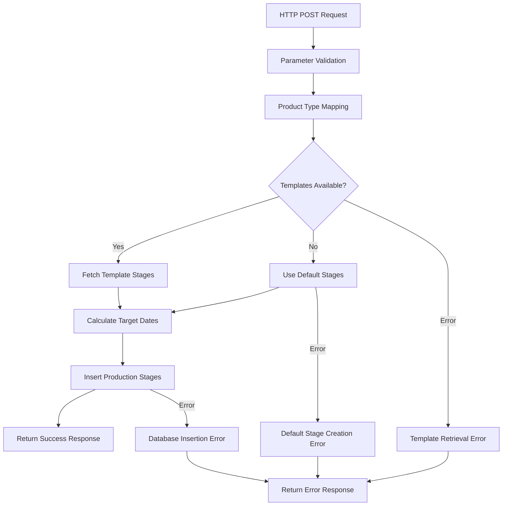
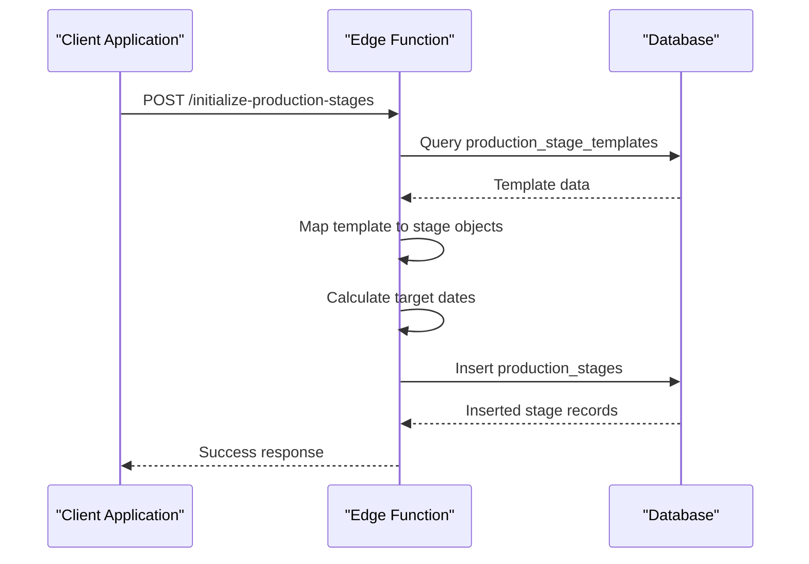
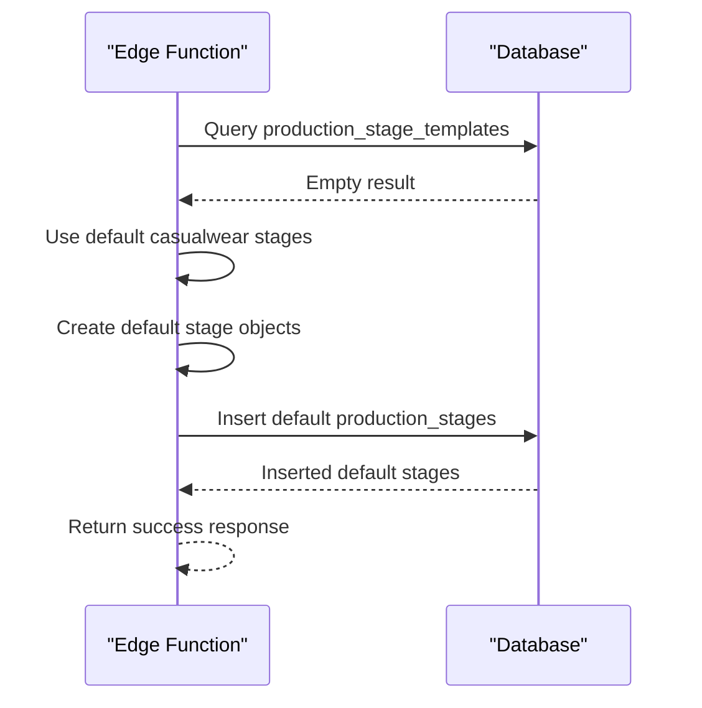
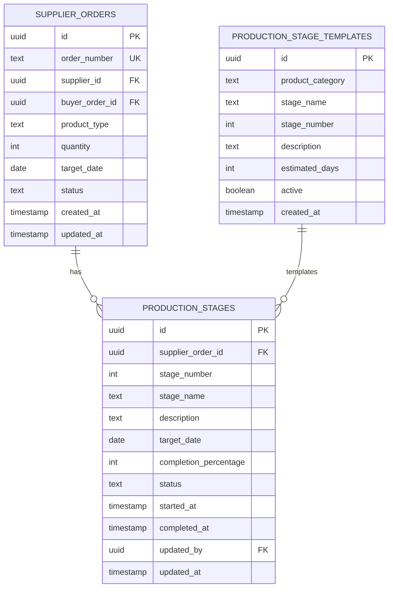
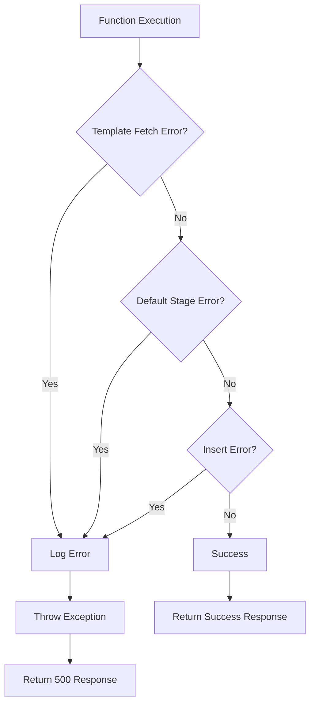
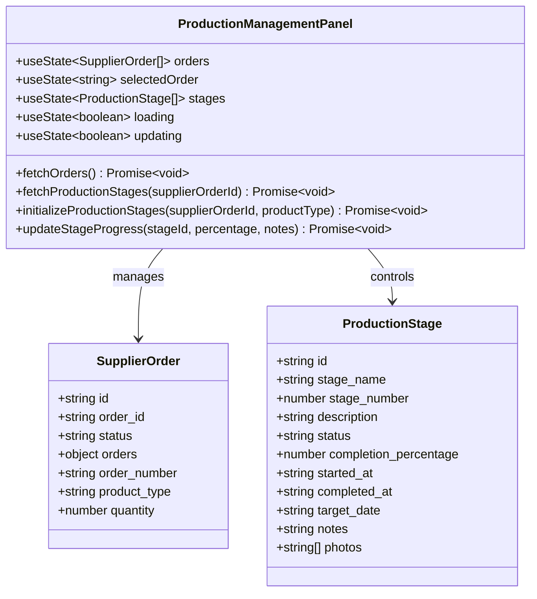

# Initialize Production Stages

<cite>
**Referenced Files in This Document**
- [index.ts](file://supabase/functions/initialize-production-stages/index.ts)
- [ProductionManagementPanel.tsx](file://src/components/supplier/ProductionManagementPanel.tsx)
- [types.ts](file://src/integrations/supabase/types.ts)
- [20251120233928_2016afb8-d720-4858-9e12-7fb4ebbd5de0.sql](file://supabase/migrations/20251120233928_2016afb8-d720-4858-9e12-7fb4ebbd5de0.sql)
- [20251115150759_remix_migration_from_pg_dump.sql](file://supabase/migrations/20251115150759_remix_migration_from_pg_dump.sql)
- [seed_comprehensive_test_data.sql](file://supabase/seed_comprehensive_test_data.sql)
</cite>

## Table of Contents
1. [Introduction](#introduction)
2. [Function Overview](#function-overview)
3. [HTTP Endpoint Details](#http-endpoint-details)
4. [Product Category Mapping Logic](#product-category-mapping-logic)
5. [Execution Paths](#execution-paths)
6. [Database Schema Relationships](#database-schema-relationships)
7. [Target Date Calculation](#target-date-calculation)
8. [Error Handling Strategy](#error-handling-strategy)
9. [Frontend Implementation](#frontend-implementation)
10. [Database Migration Details](#database-migration-details)
11. [Best Practices and Recommendations](#best-practices-and-recommendations)

## Introduction

The `initialize-production-stages` function is a critical Supabase Edge Function that establishes the production timeline for new supplier orders in the Sleek Apparels manufacturing system. This function automatically creates a standardized sequence of production stages based on the product type, ensuring consistent manufacturing workflows across different garment categories.

The function serves as the foundation for production management by establishing eight distinct stages that represent the complete journey from raw materials to finished goods. It implements intelligent fallback mechanisms when predefined templates are unavailable and provides robust error handling for production pipeline initialization.

## Function Overview

The initialize-production-stages function operates as a serverless Edge Function deployed on Supabase's infrastructure. It accepts HTTP POST requests with specific parameters and returns structured production stage data for new supplier orders.



**Diagram sources**
- [index.ts](file://supabase/functions/initialize-production-stages/index.ts#L14-L133)

**Section sources**
- [index.ts](file://supabase/functions/initialize-production-stages/index.ts#L1-L133)

## HTTP Endpoint Details

The function exposes a RESTful HTTP endpoint that accepts JSON payloads with specific parameters required for production stage initialization.

### Endpoint Configuration

| Property | Value |
|----------|-------|
| Method | POST |
| URL | `/functions/v1/initialize-production-stages` |
| Authentication | Supabase Service Role Key |
| CORS Headers | Enabled for cross-origin requests |

### Request Parameters

| Parameter | Type | Required | Description |
|-----------|------|----------|-------------|
| `supplier_order_id` | string | Yes | UUID of the supplier order to initialize stages for |
| `product_type` | string | Yes | Product category identifier for template selection |

### Response Format

The function returns a structured JSON response indicating success or failure:

```typescript
// Success Response
{
  "success": true,
  "stages": [
    {
      "id": "uuid-string",
      "supplier_order_id": "supplier-order-uuid",
      "stage_name": "Fabric Preparation",
      "stage_number": 1,
      "description": "Fabric received and quality checked",
      "status": "not_started",
      "completion_percentage": 0,
      "target_date": "2024-01-15T00:00:00Z"
    }
  ]
}

// Error Response
{
  "error": "Error message describing the failure"
}
```

**Section sources**
- [index.ts](file://supabase/functions/initialize-production-stages/index.ts#L14-L133)

## Product Category Mapping Logic

The function implements sophisticated product categorization through a comprehensive mapping system that translates human-readable product types into standardized categories used for template selection.

### Category Mapping Dictionary

The mapping system supports multiple product variations and ensures consistent categorization across different naming conventions:

| Product Type | Mapped Category | Notes |
|--------------|----------------|-------|
| `t-shirt`, `t-shirts` | `casualwear` | Basic cotton t-shirts |
| `polo`, `polo shirt` | `casualwear` | Collared polo shirts |
| `hoodie`, `hoodies` | `casualwear` | Sweatshirts with hoods |
| `sweatshirt` | `casualwear` | Sweat-style tops |
| `joggers` | `activewear` | Athletic jogger pants |
| `leggings` | `activewear` | Workout leggings |
| `shorts` | `activewear` | Sport shorts |
| `sweater` | `knitwear` | Knitted sweaters |
| `cardigan` | `knitwear` | Knitted cardigans |

### Mapping Implementation

The mapping process follows a case-insensitive approach with fallback mechanisms:

```typescript
const categoryMap: Record<string, string> = {
  't-shirt': 'casualwear',
  't-shirts': 'casualwear',
  'polo': 'casualwear',
  'polo shirt': 'casualwear',
  'hoodie': 'casualwear',
  'hoodies': 'casualwear',
  'sweatshirt': 'casualwear',
  'joggers': 'activewear',
  'leggings': 'activewear',
  'shorts': 'activewear',
  'sweater': 'knitwear',
  'cardigan': 'knitwear'
};

const productCategory = categoryMap[product_type.toLowerCase()] || 'casualwear';
```

This mapping ensures that diverse product terminology converges to standardized categories, enabling consistent template application across the manufacturing system.

**Section sources**
- [index.ts](file://supabase/functions/initialize-production-stages/index.ts#L25-L40)

## Execution Paths

The function implements two distinct execution paths based on the availability of production stage templates in the database.

### Path 1: Template-Based Stages

When production stage templates exist for the mapped product category, the function retrieves and applies these predefined stages:



**Diagram sources**
- [index.ts](file://supabase/functions/initialize-production-stages/index.ts#L43-L108)

### Path 2: Default Stage Creation

When no templates are available for the product category, the function falls back to a comprehensive default template specifically designed for casualwear products:



**Diagram sources**
- [index.ts](file://supabase/functions/initialize-production-stages/index.ts#L58-L90)

### Default Stage Template

The default template consists of eight standardized stages for casualwear products:

| Stage Number | Stage Name | Estimated Days | Description |
|--------------|------------|----------------|-------------|
| 1 | Fabric Preparation | 2 | Fabric received and quality checked |
| 2 | Cutting | 3 | Pattern cutting and preparation |
| 3 | Sewing | 5 | Main garment assembly |
| 4 | Quality Control | 2 | Inspection and defect checking |
| 5 | Finishing | 2 | Ironing, tagging, and packaging |

**Section sources**
- [index.ts](file://supabase/functions/initialize-production-stages/index.ts#L58-L90)

## Database Schema Relationships

The production stages system maintains strict referential integrity through carefully designed foreign key constraints and relationship mappings.

### Entity Relationship Model



**Diagram sources**
- [20251115150759_remix_migration_from_pg_dump.sql](file://supabase/migrations/20251115150759_remix_migration_from_pg_dump.sql#L1410-L1430)
- [20251120233928_2016afb8-d720-4858-9e12-7fb4ebbd5de0.sql](file://supabase/migrations/20251120233928_2016afb8-d720-4858-9e12-7fb4ebbd5de0.sql#L91-L101)

### Foreign Key Constraints

The database enforces referential integrity through several critical constraints:

| Constraint | Source Table | Target Table | Action |
|------------|--------------|--------------|--------|
| `fk_supplier_order_id` | production_stages | supplier_orders | CASCADE DELETE |
| `fk_updated_by` | production_stages | auth.users | RESTRICT |

### Unique Constraints

The production_stages table maintains uniqueness through composite constraints:

- **Primary Key**: `id` (UUID)
- **Composite Unique**: `(supplier_order_id, stage_number)` - Ensures each order has unique stage numbers

**Section sources**
- [20251115150759_remix_migration_from_pg_dump.sql](file://supabase/migrations/20251115150759_remix_migration_from_pg_dump.sql#L1410-L1430)
- [20251120233928_2016afb8-d720-4858-9e12-7fb4ebbd5de0.sql](file://supabase/migrations/20251120233928_2016afb8-d720-4858-9e12-7fb4ebbd5de0.sql#L91-L101)

## Target Date Calculation

The function implements intelligent target date calculation based on estimated production days from templates, providing suppliers with realistic timelines for each production stage.

### Calculation Logic

For each production stage, the target date is calculated using the formula:

```typescript
const targetDate = template.estimated_days 
  ? new Date(Date.now() + template.estimated_days * 24 * 60 * 60 * 1000).toISOString()
  : null;
```

### Target Date Implementation

The calculation process considers:

1. **Estimated Days**: From template configuration
2. **Current Timestamp**: Base for date calculations
3. **ISO Formatting**: Standardized date representation
4. **Null Handling**: Graceful handling for stages without time estimates

### Example Calculations

| Template Stage | Estimated Days | Current Date | Target Date |
|----------------|----------------|--------------|-------------|
| Fabric Preparation | 2 | 2024-01-10 | 2024-01-12 |
| Cutting | 3 | 2024-01-10 | 2024-01-13 |
| Sewing | 5 | 2024-01-10 | 2024-01-15 |

**Section sources**
- [index.ts](file://supabase/functions/initialize-production-stages/index.ts#L105-L107)

## Error Handling Strategy

The function implements comprehensive error handling across multiple failure scenarios, ensuring robust operation and meaningful error reporting.

### Error Categories



**Diagram sources**
- [index.ts](file://supabase/functions/initialize-production-stages/index.ts#L126-L132)

### Error Handling Mechanisms

#### Template Retrieval Failure
- **Detection**: Error object presence in template query response
- **Logging**: Console error output with stack trace
- **Propagation**: Throws error to trigger 500 response
- **Fallback**: Not applicable for template errors

#### Default Stage Creation Failure
- **Detection**: Error object presence in insertion response
- **Logging**: Detailed error message with stage data
- **Propagation**: Throws error to trigger 500 response
- **Fallback**: Uses default stages only when templates unavailable

#### Database Insertion Failure
- **Detection**: Error object presence in insert response
- **Logging**: Error details with SQL context
- **Propagation**: Throws error to trigger 500 response
- **Rollback**: Automatic rollback due to transaction isolation

### Error Response Format

All error scenarios return standardized JSON responses:

```typescript
{
  "error": "Descriptive error message"
}
```

### Frontend Error Handling

The frontend implementation includes comprehensive error handling for user feedback:

```typescript
const initializeProductionStages = async (supplierOrderId: string, productType: string) => {
  try {
    const { data, error } = await supabase.functions.invoke('initialize-production-stages', {
      body: { supplier_order_id: supplierOrderId, product_type: productType }
    });
    
    if (error) throw error;
    toast.success('Production stages initialized');
  } catch (error: any) {
    console.error('Error initializing stages:', error);
    toast.error('Failed to initialize production stages');
  }
};
```

**Section sources**
- [index.ts](file://supabase/functions/initialize-production-stages/index.ts#L51-L54)
- [index.ts](file://supabase/functions/initialize-production-stages/index.ts#L84-L86)
- [index.ts](file://supabase/functions/initialize-production-stages/index.ts#L115-L117)
- [ProductionManagementPanel.tsx](file://src/components/supplier/ProductionManagementPanel.tsx#L133-L146)

## Frontend Implementation

The frontend implementation demonstrates best practices for invoking the initialize-production-stages function with comprehensive error handling and user feedback mechanisms.

### Component Architecture

The ProductionManagementPanel component orchestrates the production stage initialization process:



**Diagram sources**
- [ProductionManagementPanel.tsx](file://src/components/supplier/ProductionManagementPanel.tsx#L13-L32)

### Function Invocation Pattern

The frontend implements a reactive pattern that automatically initializes production stages when needed:

```typescript
const fetchProductionStages = async (supplierOrderId: string) => {
  try {
    const { data, error } = await supabase
      .from('production_stages')
      .select('*')
      .eq('supplier_order_id', supplierOrderId)
      .order('stage_number', { ascending: true });

    if (error) throw error;
    
    // If no stages exist, initialize them
    if (!data || data.length === 0) {
      const selectedOrderData = orders.find(o => o.id === supplierOrderId);
      if (selectedOrderData) {
        await initializeProductionStages(supplierOrderId, selectedOrderData.orders.product_type);
        // Fetch again after initialization
        const { data: newData } = await supabase
          .from('production_stages')
          .select('*')
          .eq('supplier_order_id', supplierOrderId)
          .order('stage_number', { ascending: true });
        setStages(newData || []);
      }
    } else {
      setStages(data);
    }
  } catch (error: any) {
    console.error('Error fetching stages:', error);
  }
};
```

### Toast Notification System

The implementation integrates with the Sonner toast notification system for user feedback:

| Scenario | Notification Type | Message |
|----------|------------------|---------|
| Success | Success | "Production stages initialized" |
| Error | Error | "Failed to initialize production stages" |
| Debug | Log | "Initializing production stages..." |

**Section sources**
- [ProductionManagementPanel.tsx](file://src/components/supplier/ProductionManagementPanel.tsx#L102-L132)
- [ProductionManagementPanel.tsx](file://src/components/supplier/ProductionManagementPanel.tsx#L133-L146)

## Database Migration Details

The production stage system relies on comprehensive database migrations that establish the foundational schema and populate initial template data.

### Migration Structure

The database setup involves multiple migration files that progressively build the production stage infrastructure:

#### Production Stage Templates Table

The core template system is established through the production_stage_templates table:

```sql
CREATE TABLE IF NOT EXISTS public.production_stage_templates (
  id UUID PRIMARY KEY DEFAULT gen_random_uuid(),
  product_category TEXT NOT NULL,
  stage_name TEXT NOT NULL,
  stage_number INTEGER NOT NULL,
  description TEXT,
  estimated_days INTEGER,
  active BOOLEAN DEFAULT TRUE,
  created_at TIMESTAMPTZ DEFAULT NOW()
);
```

#### Seed Data Population

The migration includes comprehensive seed data for all major product categories:

| Category | Stages | Total Duration | Special Features |
|----------|--------|----------------|------------------|
| Knitwear | 7 stages | 14 days | Technical fabric handling |
| Casualwear | 8 stages | 15 days | Standard sewing workflow |
| Activewear | 8 stages | 17 days | Performance testing |
| Uniforms | 8 stages | 15 days | Branding emphasis |

#### Index Creation

Performance optimization through strategic indexing:

```sql
CREATE INDEX idx_production_stage_templates_category 
ON public.production_stage_templates(product_category);
```

### Template Categories

The system supports four primary product categories with specialized workflows:

#### Knitwear Templates
- **Duration**: 14 days
- **Key Stages**: Yarn handling, knitting precision, washing treatments
- **Specialization**: Technical fabric processing

#### Casualwear Templates  
- **Duration**: 15 days
- **Key Stages**: Fabric preparation, traditional sewing, finishing touches
- **Specialization**: Standard garment manufacturing

#### Activewear Templates
- **Duration**: 17 days
- **Key Stages**: Technical cutting, specialized sewing, performance testing
- **Specialization**: Athletic performance requirements

#### Uniform Templates
- **Duration**: 15 days
- **Key Stages**: Precision cutting, branding application, compliance inspection
- **Specialization**: Corporate identity requirements

**Section sources**
- [20251120233928_2016afb8-d720-4858-9e12-7fb4ebbd5de0.sql](file://supabase/migrations/20251120233928_2016afb8-d720-4858-9e12-7fb4ebbd5de0.sql#L91-L101)
- [20251120233928_2016afb8-d720-4858-9e12-7fb4ebbd5de0.sql](file://supabase/migrations/20251120233928_2016afb8-d720-4858-9e12-7fb4ebbd5de0.sql#L220-L258)

## Best Practices and Recommendations

### Development Guidelines

#### Function Design Principles
- **Idempotency**: Ensure multiple executions don't create duplicate stages
- **Transaction Safety**: Use database transactions for atomic operations
- **Error Resilience**: Implement comprehensive error handling at all levels
- **Logging**: Maintain detailed logs for debugging and monitoring

#### Database Optimization
- **Index Strategy**: Maintain appropriate indexes on frequently queried columns
- **Constraint Usage**: Leverage foreign key constraints for data integrity
- **Partitioning**: Consider partitioning for large-scale production data
- **Monitoring**: Implement performance monitoring for critical queries

### Operational Recommendations

#### Template Management
- **Regular Updates**: Periodically review and update production templates
- **Category Expansion**: Add new product categories as business evolves
- **Performance Metrics**: Track template effectiveness and adjust estimates
- **Version Control**: Maintain version history for template modifications

#### Monitoring and Maintenance
- **Health Checks**: Implement automated health checks for the function
- **Error Tracking**: Monitor error rates and implement alerting
- **Performance Baselines**: Establish performance baselines for optimization
- **Capacity Planning**: Plan for scaling based on production volume growth

### Security Considerations

#### Access Control
- **Role-Based Permissions**: Implement proper RBAC for template management
- **Audit Logging**: Maintain comprehensive audit trails for all operations
- **Rate Limiting**: Implement rate limiting to prevent abuse
- **Input Validation**: Validate all input parameters rigorously

#### Data Protection
- **Encryption**: Encrypt sensitive production data at rest and in transit
- **Backup Strategy**: Implement robust backup and recovery procedures
- **Compliance**: Ensure compliance with relevant manufacturing regulations
- **Data Retention**: Define appropriate data retention policies