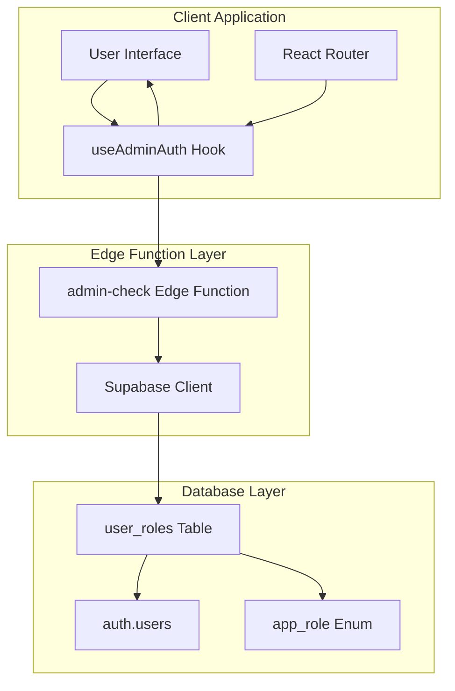
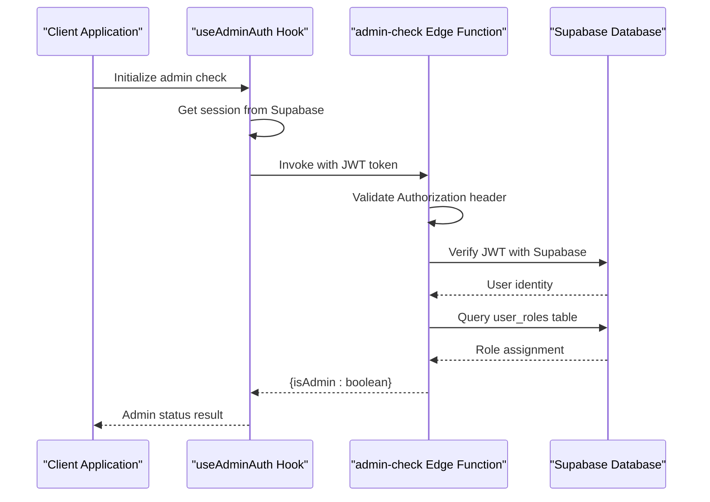
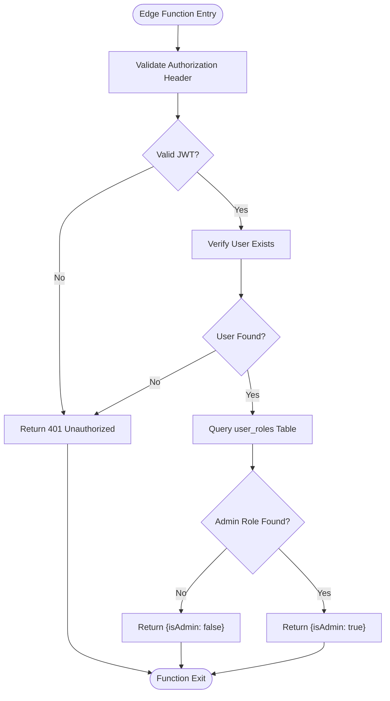
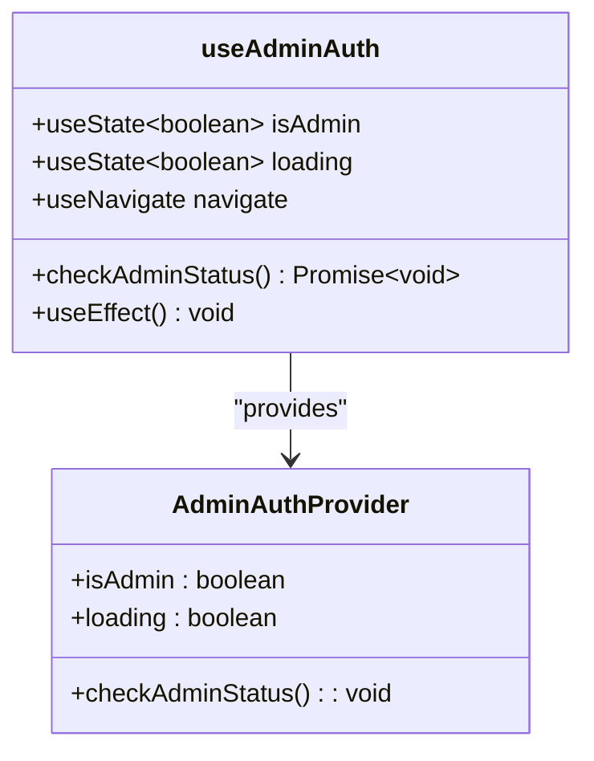
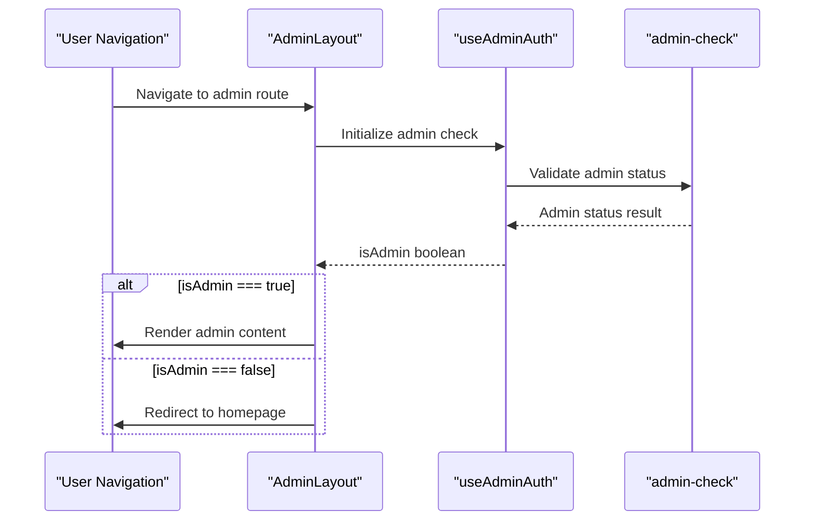
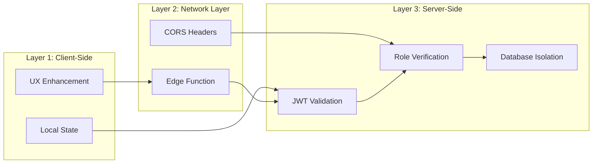
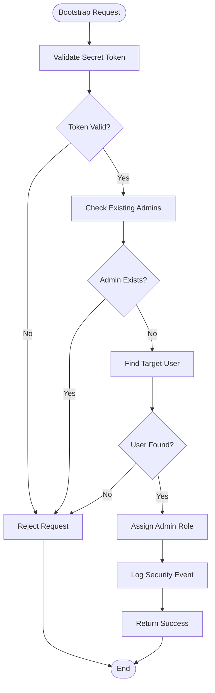
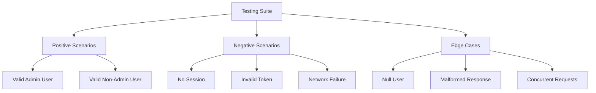

# Admin Role Verification

<cite>
**Referenced Files in This Document**
- [useAdminAuth.ts](file://src/hooks/useAdminAuth.ts)
- [admin-check/index.ts](file://supabase/functions/admin-check/index.ts)
- [useAdminAuth.test.ts](file://src/hooks/__tests__/useAdminAuth.test.ts)
- [AdminLayout.tsx](file://src/pages\admin\AdminLayout.tsx)
- [AdminAnalytics.tsx](file://src/pages\AdminAnalytics.tsx)
- [AdminSidebar.tsx](file://src/components\AdminSidebar.tsx)
- [client.ts](file://src/integrations/supabase/client.ts)
- [supabaseHelpers.ts](file://src/lib\supabaseHelpers.ts)
- [bootstrap-admin/index.ts](file://supabase/functions/bootstrap-admin/index.ts)
- [BASE_MIGRATION_SAFE.sql](file://supabase\migrations\20251115150759_remix_migration_from_pg_dump.sql)
</cite>

## Table of Contents
1. [Introduction](#introduction)
2. [System Architecture](#system-architecture)
3. [Authentication Method](#authentication-method)
4. [Server-Side Admin Check Function](#server-side-admin-check-function)
5. [Client-Side React Hook](#client-side-react-hook)
6. [Integration Pattern](#integration-pattern)
7. [Security Implementation](#security-implementation)
8. [Test Coverage](#test-coverage)
9. [Usage Examples](#usage-examples)
10. [Best Practices](#best-practices)

## Introduction

The SleekApp admin role verification mechanism provides a robust, defense-in-depth approach to securing administrative access. This system combines client-side UX enhancements with server-side security validation to prevent privilege escalation attacks while maintaining responsive user experiences.

The implementation uses Supabase's GoTrue service for JWT token validation and employs a dedicated edge function (`admin-check`) to verify user permissions against the `user_roles` table. This dual-layer approach ensures that administrative privileges are never determined client-side, preventing malicious users from bypassing security controls.

## System Architecture

The admin role verification system follows a layered security architecture with clear separation of concerns:



**Diagram sources**
- [useAdminAuth.ts](file://src/hooks/useAdminAuth.ts#L1-L47)
- [admin-check/index.ts](file://supabase/functions/admin-check/index.ts#L1-L74)

**Section sources**
- [useAdminAuth.ts](file://src/hooks/useAdminAuth.ts#L1-L47)
- [admin-check/index.ts](file://supabase/functions/admin-check/index.ts#L1-L74)

## Authentication Method

The system uses JWT tokens passed in the Authorization header for secure authentication:

### Token Format and Validation

| Component | Description | Implementation |
|-----------|-------------|----------------|
| **Header Format** | Bearer token pattern | `Authorization: Bearer <access_token>` |
| **Token Source** | Supabase GoTrue service | Session-based JWT tokens |
| **Validation Scope** | Server-side only | Edge function validates against Supabase auth |
| **Expiration Handling** | Automatic refresh | Supabase client handles token renewal |

### Request Flow



**Diagram sources**
- [useAdminAuth.ts](file://src/hooks/useAdminAuth.ts#L14-L43)
- [admin-check/index.ts](file://supabase/functions/admin-check/index.ts#L14-L73)

**Section sources**
- [useAdminAuth.ts](file://src/hooks/useAdminAuth.ts#L14-L43)
- [admin-check/index.ts](file://supabase/functions/admin-check/index.ts#L14-L73)

## Server-Side Admin Check Function

The `admin-check` edge function serves as the primary security gatekeeper, implementing comprehensive validation logic:

### Function Architecture



**Diagram sources**
- [admin-check/index.ts](file://supabase/functions/admin-check/index.ts#L14-L73)

### Security Features

| Security Layer | Implementation | Purpose |
|----------------|----------------|---------|
| **CORS Protection** | Configurable headers | Prevent cross-origin attacks |
| **JWT Validation** | Supabase GoTrue | Verify token authenticity |
| **Database Isolation** | Service role key | Prevent client-side database access |
| **Role Enumeration** | Specific admin role check | Precise permission validation |
| **Error Handling** | Graceful degradation | Hide sensitive information |

### Database Schema Integration

The system relies on a carefully designed database schema:

```mermaid
erDiagram
AUTH_USERS {
uuid id PK
string email
jsonb raw_user_meta_data
timestamp created_at
timestamp updated_at
}
USER_ROLES {
uuid user_id FK
app_role role
timestamp created_at
constraint user_role_unique unique(user_id, role)
}
APP_ROLE {
enum_value role_name
}
AUTH_USERS ||--o{ USER_ROLES : "has roles"
USER_ROLES ||--|| APP_ROLE : "defines role"
```

**Diagram sources**
- [BASE_MIGRATION_SAFE.sql](file://supabase\migrations\20251115150759_remix_migration_from_pg_dump.sql#L30-L40)
- [BASE_MIGRATION_SAFE.sql](file://supabase\migrations\20251115150759_remix_migration_from_pg_dump.sql#L1882-L1890)

**Section sources**
- [admin-check/index.ts](file://supabase/functions/admin-check/index.ts#L14-L73)
- [BASE_MIGRATION_SAFE.sql](file://supabase\migrations\20251115150759_remix_migration_from_pg_dump.sql#L30-L40)

## Client-Side React Hook

The `useAdminAuth` hook provides a reactive interface for admin status checking with automatic periodic validation:

### Hook Implementation



**Diagram sources**
- [useAdminAuth.ts](file://src/hooks/useAdminAuth.ts#L5-L46)

### Hook Features

| Feature | Implementation | Benefit |
|---------|----------------|---------|
| **Automatic Initialization** | useEffect on mount | Immediate admin status determination |
| **Periodic Revalidation** | Manual trigger capability | Refresh status when needed |
| **Loading States** | Reactive loading indicator | Smooth UX during validation |
| **Error Handling** | Comprehensive error catching | Graceful failure scenarios |
| **Navigation Control** | Redirect on invalid access | Secure route protection |

### State Management

The hook maintains three critical pieces of state:

```typescript
const [isAdmin, setIsAdmin] = useState(false);
const [loading, setLoading] = useState(true);
```

**Section sources**
- [useAdminAuth.ts](file://src/hooks/useAdminAuth.ts#L5-L46)

## Integration Pattern

The system integrates seamlessly with React applications through a standardized pattern:

### Route Protection Pattern



**Diagram sources**
- [AdminLayout.tsx](file://src/pages\admin\AdminLayout.tsx#L9-L43)
- [useAdminAuth.ts](file://src/hooks/useAdminAuth.ts#L10-L12)

### Component-Level Protection

Individual components can protect themselves using the hook:

```typescript
// Example component protection pattern
const AdminProtectedComponent = () => {
  const { isAdmin, loading } = useAdminAuth();
  
  if (loading) return <LoadingSpinner />;
  if (!isAdmin) return <Redirect to="/" />;
  
  return <AdminContent />;
};
```

**Section sources**
- [AdminLayout.tsx](file://src/pages\admin\AdminLayout.tsx#L9-L43)
- [AdminAnalytics.tsx](file://src/pages\AdminAnalytics.tsx#L19-L47)

## Security Implementation

The system implements multiple layers of security to prevent privilege escalation:

### Defense-in-Depth Strategy



**Diagram sources**
- [useAdminAuth.ts](file://src/hooks/useAdminAuth.ts#L24-L43)
- [admin-check/index.ts](file://supabase/functions/admin-check/index.ts#L14-L73)

### Security Controls

| Control | Implementation | Threat Prevention |
|---------|----------------|-------------------|
| **JWT Validation** | Supabase GoTrue service | Token forgery prevention |
| **Role Table Access** | Service role key only | Client-side database access prevention |
| **CORS Protection** | Strict header validation | Cross-origin request manipulation |
| **Error Masking** | Generic error responses | Information disclosure prevention |
| **Rate Limiting** | IP-based throttling | Brute force attack mitigation |

### Bootstrap Security

The initial admin account creation process includes additional security measures:



**Diagram sources**
- [bootstrap-admin/index.ts](file://supabase/functions/bootstrap-admin/index.ts#L91-L167)

**Section sources**
- [admin-check/index.ts](file://supabase/functions/admin-check/index.ts#L14-L73)
- [bootstrap-admin/index.ts](file://supabase/functions/bootstrap-admin/index.ts#L91-L167)

## Test Coverage

The system includes comprehensive test coverage demonstrating various scenarios:

### Test Categories

| Test Category | Coverage | Purpose |
|---------------|----------|---------|
| **Successful Admin Check** | Valid admin user | Verify positive authentication |
| **Non-Admin Access** | Regular user access | Confirm role restriction |
| **Session Validation** | Expired/expired tokens | Test session handling |
| **Network Error Handling** | Function invocation failures | Graceful error recovery |
| **Security Verification** | Server-side validation | Confirm security implementation |
| **Edge Cases** | Null/undefined scenarios | Robustness testing |

### Test Scenarios



**Diagram sources**
- [useAdminAuth.test.ts](file://src/hooks/__tests__/useAdminAuth.test.ts#L26-L380)

### Security Test Verification

The tests specifically verify that server-side validation is always performed:

```typescript
// Security test pattern from useAdminAuth.test.ts
it('uses server-side validation for admin check', async () => {
  // Mock server-side function call
  expect(mockSupabase.functions.invoke).toHaveBeenCalledWith(
    'admin-check',
    expect.objectContaining({
      headers: expect.objectContaining({
        Authorization: expect.stringContaining('Bearer')
      })
    })
  );
});
```

**Section sources**
- [useAdminAuth.test.ts](file://src/hooks/__tests__/useAdminAuth.test.ts#L26-L380)

## Usage Examples

### Basic Admin Route Protection

```typescript
// Protected admin route setup
const AdminProtectedRoute = () => {
  const { isAdmin, loading } = useAdminAuth();
  
  if (loading) return <LoadingSpinner />;
  if (!isAdmin) return <Navigate to="/" />;
  
  return <AdminLayout />;
};
```

### Conditional UI Rendering

```typescript
// Admin-only UI elements
const AdminControls = () => {
  const { isAdmin } = useAdminAuth();
  
  return (
    <>
      {isAdmin && (
        <div className="admin-controls">
          <button onClick={handleAdminAction}>Admin Action</button>
        </div>
      )}
      {!isAdmin && (
        <div className="no-access">
          <p>Access restricted to administrators</p>
        </div>
      )}
    </>
  );
};
```

### Periodic Status Refresh

```typescript
// Manual admin status refresh
const AdminStatusChecker = () => {
  const { isAdmin, loading, checkAdminStatus } = useAdminAuth();
  
  const refreshStatus = async () => {
    await checkAdminStatus();
    // Additional logic after refresh
  };
  
  return (
    <div>
      <button onClick={refreshStatus}>
        {loading ? 'Checking...' : 'Refresh Admin Status'}
      </button>
      <p>{isAdmin ? 'Admin Access Granted' : 'Admin Access Denied'}</p>
    </div>
  );
};
```

### Integration with Sidebar Navigation

```typescript
// Admin sidebar with conditional visibility
const AdminSidebar = () => {
  const { isAdmin } = useAdminAuth();
  
  if (!isAdmin) return null;
  
  return (
    <aside className="admin-sidebar">
      <nav>
        <AdminMenuItem to="/admin/dashboard">Dashboard</AdminMenuItem>
        <AdminMenuItem to="/admin/users">User Management</AdminMenuItem>
        <AdminMenuItem to="/admin/settings">Settings</AdminMenuItem>
      </nav>
    </aside>
  );
};
```

**Section sources**
- [AdminLayout.tsx](file://src/pages\admin\AdminLayout.tsx#L9-L43)
- [AdminSidebar.tsx](file://src/components\AdminSidebar.tsx#L28-L69)

## Best Practices

### Implementation Guidelines

1. **Always Use Server-Side Validation**: Never rely solely on client-side admin flags
2. **Implement Loading States**: Provide feedback during admin status checks
3. **Handle Errors Gracefully**: Catch and log errors without exposing sensitive information
4. **Use Periodic Refresh**: Allow users to manually refresh admin status when needed
5. **Secure Initial Setup**: Use bootstrap functions for initial admin account creation

### Security Recommendations

1. **Monitor Access Patterns**: Log all admin check attempts for security auditing
2. **Implement Rate Limiting**: Protect against brute force attacks on the admin endpoint
3. **Use HTTPS Only**: Ensure all communication occurs over encrypted connections
4. **Regular Token Rotation**: Leverage Supabase's automatic token refresh capabilities
5. **Audit Role Assignments**: Monitor and audit admin role assignments

### Performance Optimization

1. **Cache Admin Status**: Store admin status in local state to avoid repeated API calls
2. **Debounce Refresh Requests**: Prevent excessive server calls during rapid status changes
3. **Optimize Database Queries**: Use indexed columns for role lookups
4. **Implement Circuit Breakers**: Fail gracefully when the admin check function is unavailable

### Monitoring and Maintenance

1. **Track Function Performance**: Monitor edge function execution times
2. **Alert on Failures**: Set up notifications for admin check failures
3. **Regular Security Audits**: Review role assignment logic periodically
4. **Update Dependencies**: Keep Supabase client libraries current