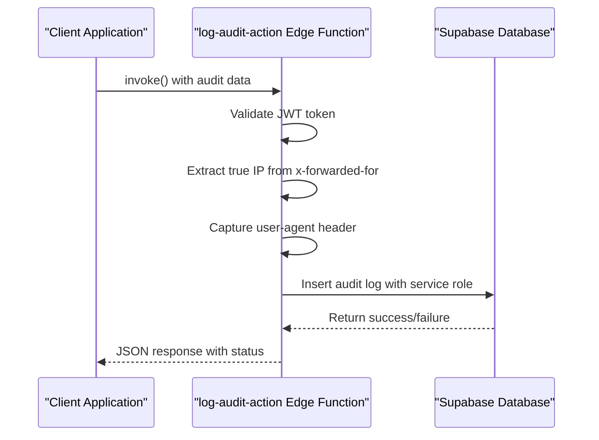
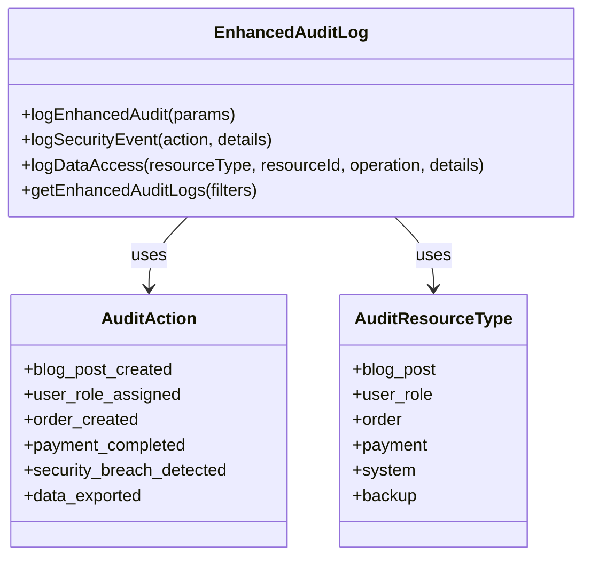
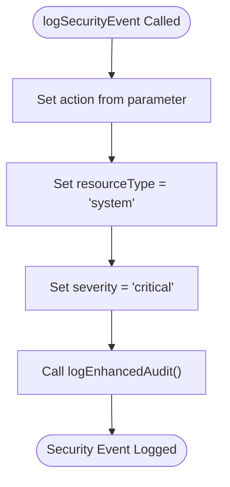
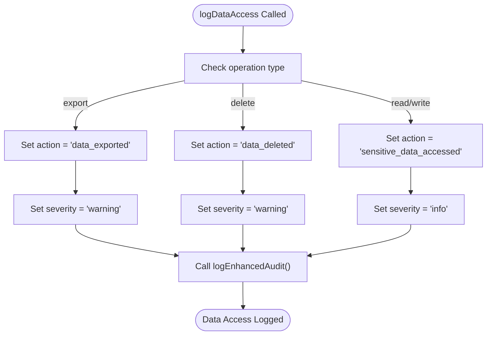
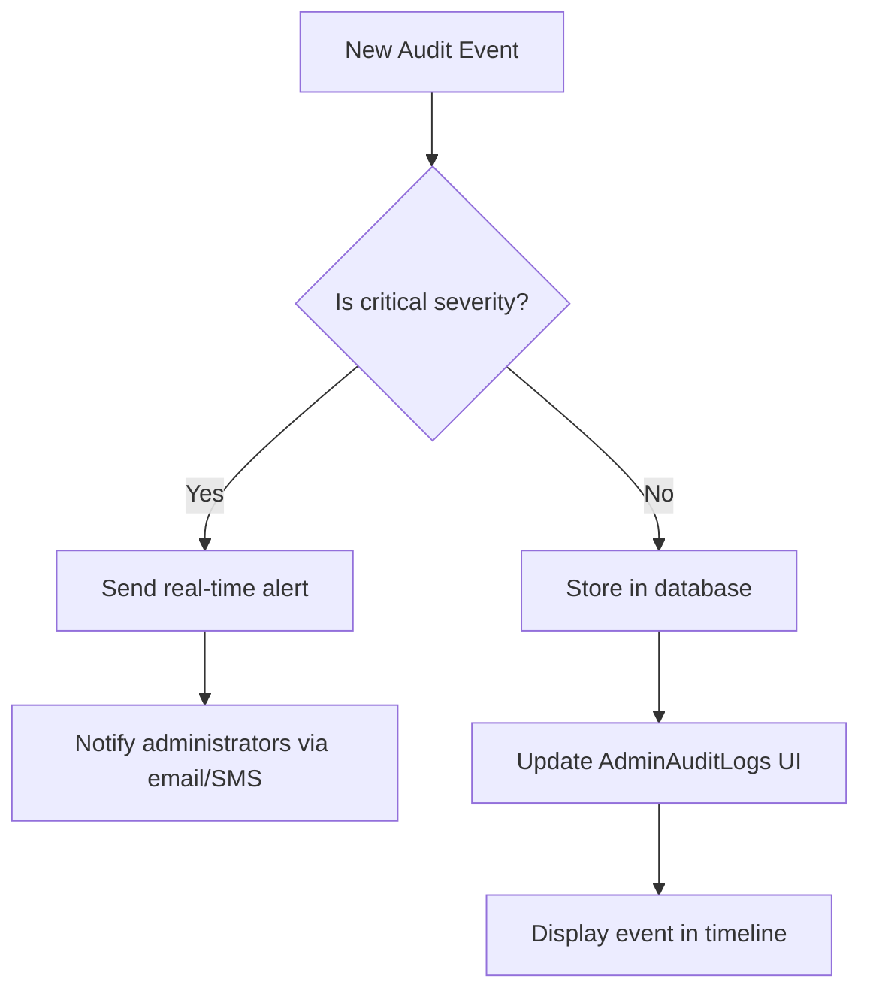

# Audit Logging System

<cite>
**Referenced Files in This Document**   
- [enhancedAuditLog.ts](file://src/lib/enhancedAuditLog.ts)
- [log-audit-action/index.ts](file://supabase/functions/log-audit-action/index.ts)
- [admin_audit_logs table in TABLES_ONLY.sql](file://supabase/TABLES_ONLY.sql)
- [AdminAuditLogs.tsx](file://src/pages/AdminAuditLogs.tsx)
- [logger.ts](file://supabase/functions/_shared/logger.ts)
</cite>

## Table of Contents
1. [Introduction](#introduction)
2. [Architecture Overview](#architecture-overview)
3. [Request Schema](#request-schema)
4. [Database Schema](#database-schema)
5. [Core Components](#core-components)
6. [Usage Patterns](#usage-patterns)
7. [Severity Levels and Filtering](#severity-levels-and-filtering)
8. [Retention Policies](#retention-policies)
9. [Example Logged Events](#example-logged-events)
10. [Monitoring and Alerting](#monitoring-and-alerting)
11. [Compliance Requirements](#compliance-requirements)

## Introduction
The centralized audit logging system in the SleekApparels platform provides comprehensive tracking of security-critical events across the application. Built around the `log-audit-action` edge function, this system captures detailed contextual information including IP address, user agent, and timestamp for all sensitive operations. The audit logs serve as a critical component for security monitoring, compliance reporting, and operational transparency, enabling administrators to track all significant actions within the platform.

**Section sources**
- [enhancedAuditLog.ts](file://src/lib/enhancedAuditLog.ts#L1-L229)
- [log-audit-action/index.ts](file://supabase/functions/log-audit-action/index.ts#L1-L97)

## Architecture Overview
The audit logging system follows a client-server architecture where client-side applications invoke an edge function to securely record audit events. This design ensures that sensitive information like IP addresses cannot be spoofed by client requests.



**Diagram sources**
- [log-audit-action/index.ts](file://supabase/functions/log-audit-action/index.ts#L16-L96)
- [enhancedAuditLog.ts](file://src/lib/enhancedAuditLog.ts#L101-L137)

## Request Schema
The audit logging system accepts a structured request with the following parameters:

**Audit Log Request Parameters**
| Parameter | Type | Required | Description |
|---------|------|----------|-------------|
| action | string | Yes | The specific action performed (e.g., 'security_breach_detected') |
| resource_type | string | Yes | The type of resource involved in the action |
| resource_id | string | No | The ID of the specific resource involved |
| details | JSON object | No | Additional contextual information about the event |
| user_id | string | No | The ID of the user performing the action (validated server-side) |

The system enriches the request with additional context:
- **IP Address**: Extracted from the `x-forwarded-for` header (first entry) or `x-real-ip` header
- **User Agent**: Captured from the `user-agent` header
- **Timestamp**: Added server-side to prevent client manipulation
- **Validated User ID**: Extracted from JWT token, not from request body

**Section sources**
- [log-audit-action/index.ts](file://supabase/functions/log-audit-action/index.ts#L8-L14)
- [enhancedAuditLog.ts](file://src/lib/enhancedAuditLog.ts#L89-L95)

## Database Schema
The audit logs are stored in the `admin_audit_logs` table with the following schema:

**admin_audit_logs Table Schema**
| Column | Type | Constraints | Description |
|-------|------|-------------|-------------|
| id | uuid | DEFAULT gen_random_uuid(), NOT NULL | Unique identifier for the audit log entry |
| admin_id | uuid | | ID of the administrator/user who performed the action |
| action | text | NOT NULL | The action performed (e.g., 'user_created', 'order_updated') |
| resource_type | text | NOT NULL | The type of resource the action was performed on |
| resource_id | uuid | | ID of the specific resource involved in the action |
| details | jsonb | DEFAULT '{}'::jsonb | Additional structured data about the event |
| ip_address | text | | IP address of the client that initiated the action |
| user_agent | text | | User agent string of the client |
| created_at | timestamp with time zone | DEFAULT now() NOT NULL | Timestamp when the log entry was created |

The table is optimized for time-based queries with a default ordering by `created_at` in descending order.

**Section sources**
- [TABLES_ONLY.sql](file://supabase/TABLES_ONLY.sql#L66-L76)

## Core Components
The audit logging system consists of several key components that work together to provide secure and reliable logging:

### Enhanced Audit Logging Client
The `enhancedAuditLog.ts` module provides a comprehensive client-side interface for logging events. It includes type-safe definitions for all possible audit actions and resource types, ensuring consistency across the application.



**Diagram sources**
- [enhancedAuditLog.ts](file://src/lib/enhancedAuditLog.ts#L9-L87)

### Server-Side Edge Function
The `log-audit-action` edge function serves as the secure entry point for audit logs. It runs with Supabase service role privileges, allowing it to bypass row-level security and directly insert records into the audit log table.

Key security features:
- JWT token validation to authenticate the requesting user
- IP address extraction from trusted headers (x-forwarded-for, x-real-ip)
- Use of service role key for database operations
- Input validation and error handling
- CORS header configuration for secure cross-origin requests

**Section sources**
- [log-audit-action/index.ts](file://supabase/functions/log-audit-action/index.ts#L16-L96)
- [config.toml](file://supabase/config.toml#L63-L65)

## Usage Patterns
The audit logging system provides several wrapper functions to simplify common logging scenarios:

### Security Event Logging
The `logSecurityEvent` function is specifically designed for security-critical events such as unauthorized access attempts or suspicious activities. It automatically sets the resource type to 'system' and the severity level to 'critical'.



**Section sources**
- [enhancedAuditLog.ts](file://src/lib/enhancedAuditLog.ts#L142-L152)

### Data Access Logging
The `logDataAccess` function provides a convenient way to log sensitive data operations. It maps the operation type to the appropriate audit action and sets the severity level based on the sensitivity of the operation.



**Section sources**
- [enhancedAuditLog.ts](file://src/lib/enhancedAuditLog.ts#L157-L175)

### Audit Log Retrieval
The `getEnhancedAuditLogs` function allows administrators to retrieve audit logs with various filtering options, enabling targeted investigations and compliance reporting.

**Audit Log Filters**
| Filter | Type | Description |
|------|------|-------------|
| action | EnhancedAuditAction | Filter by specific action type |
| resourceType | EnhancedAuditResourceType | Filter by resource type |
| userId | string | Filter by user ID |
| startDate | string | Filter by minimum creation date |
| endDate | string | Filter by maximum creation date |
| severity | string | Filter by severity level in details |
| limit | number | Limit the number of results returned |

**Section sources**
- [enhancedAuditLog.ts](file://src/lib/enhancedAuditLog.ts#L179-L228)

## Severity Levels and Filtering
The audit logging system supports four severity levels that indicate the criticality of an event:

**Severity Levels**
| Level | Use Case | Example Events |
|------|---------|----------------|
| info | Routine operations | User login, data read access |
| warning | Potentially concerning activities | Data export, account deletion |
| error | Failed operations | Authentication failures, permission denied |
| critical | Security breaches | Unauthorized access, security breach detected |

The severity level is stored within the `details` JSON field, allowing for flexible querying and filtering. Administrators can filter logs by severity level through the `getEnhancedAuditLogs` function, which uses the `contains` operator to search within the JSON data.

**Section sources**
- [enhancedAuditLog.ts](file://src/lib/enhancedAuditLog.ts#L94)
- [enhancedAuditLog.ts](file://src/lib/enhancedAuditLog.ts#L210-L212)

## Retention Policies
The audit logging system does not implement automatic data retention policies at the application level. All audit logs are retained indefinitely in the database to ensure compliance with regulatory requirements and to maintain a complete historical record of system activities.

For performance optimization, the system limits query results to 100 entries by default, but administrators can retrieve older logs by using date-based filtering. The database schema is designed to support efficient time-based queries with the `created_at` column indexed for fast retrieval.

**Section sources**
- [enhancedAuditLog.ts](file://src/lib/enhancedAuditLog.ts#L214)
- [TABLES_ONLY.sql](file://supabase/TABLES_ONLY.sql#L76)

## Example Logged Events
The audit logging system captures a wide range of events across different domains of the application:

### Unauthorized Access
When an unauthorized access attempt is detected, the system logs a security event with detailed context:

```json
{
  "action": "unauthorized_access_attempt",
  "resource_type": "system",
  "details": {
    "severity": "critical",
    "timestamp": "2025-11-27T10:30:00.000Z",
    "attempted_endpoint": "/api/admin/users",
    "required_role": "admin",
    "user_role": "user",
    "session_id": "abc123"
  },
  "ip_address": "192.168.1.100",
  "user_agent": "Mozilla/5.0 (Windows NT 10.0; Win64; x64) AppleWebKit/537.36"
}
```

### Data Exports
When sensitive data is exported, the system logs a data access event with operation details:

```json
{
  "action": "data_exported",
  "resource_type": "order",
  "resource_id": "a1b2c3d4-e5f6-7890-g1h2-i3j4k5l6m7n8",
  "details": {
    "severity": "warning",
    "timestamp": "2025-11-27T11:15:00.000Z",
    "operation": "export",
    "export_format": "CSV",
    "record_count": 250,
    "requested_fields": ["customer_name", "order_value", "delivery_address"]
  },
  "ip_address": "203.0.113.50",
  "user_agent": "PostmanRuntime/7.29.0"
}
```

### System Changes
When critical system settings are changed, the system logs the modification with before/after values:

```json
{
  "action": "settings_changed",
  "resource_type": "system",
  "details": {
    "severity": "warning",
    "timestamp": "2025-11-27T14:20:00.000Z",
    "setting_changed": "rate_limit_threshold",
    "previous_value": 100,
    "new_value": 50,
    "reason": "Increase security during peak traffic"
  },
  "ip_address": "198.51.100.25",
  "user_agent": "Mozilla/5.0 (Macintosh; Intel Mac OS X 10_15_7)"
}
```

**Section sources**
- [enhancedAuditLog.ts](file://src/lib/enhancedAuditLog.ts#L58-L71)
- [enhancedAuditLog.ts](file://src/lib/enhancedAuditLog.ts#L63-L66)

## Monitoring and Alerting
The audit logging system supports monitoring and alerting on critical events through several mechanisms:

### Real-time Monitoring
Administrators can monitor audit logs in real-time through the AdminAuditLogs interface, which displays recent activities in a chronological timeline. The interface categorizes events by type and highlights critical security events.



### Alerting Configuration
Critical security events trigger automated alerts to system administrators. The alerting system is configured to notify on the following event types:
- security_breach_detected
- unauthorized_access_attempt
- rate_limit_exceeded
- suspicious_activity

Alerts include the full context of the event, including IP address, user agent, timestamp, and detailed information about the nature of the security concern.

**Section sources**
- [AdminAuditLogs.tsx](file://src/pages/AdminAuditLogs.tsx#L1-L155)
- [enhancedAuditLog.ts](file://src/lib/enhancedAuditLog.ts#L58-L62)

## Compliance Requirements
The audit logging system is designed to meet stringent compliance requirements for data security and privacy:

### Data Protection
The system implements several measures to protect sensitive information:
- PII sanitization in logs through the shared logger utility
- Secure transmission via HTTPS and JWT authentication
- Restricted access to audit logs (admin-only)
- IP address and user agent collection for forensic analysis

### Regulatory Compliance
The audit logging system supports compliance with major regulatory frameworks:
- **GDPR**: Provides audit trail for data access and processing activities
- **CCPA**: Tracks consumer data requests and access
- **SOC 2**: Maintains comprehensive logs of system activities and security events
- **ISO 27001**: Supports information security management requirements

### Forensic Readiness
The system captures sufficient context to support forensic investigations:
- Precise timestamps (to the millisecond)
- True client IP addresses (via proxy headers)
- User agent strings for device identification
- Complete audit trail of user actions
- Immutable log entries (once written, cannot be modified)

**Section sources**
- [logger.ts](file://supabase/functions/_shared/logger.ts#L1-L173)
- [log-audit-action/index.ts](file://supabase/functions/log-audit-action/index.ts#L53-L56)