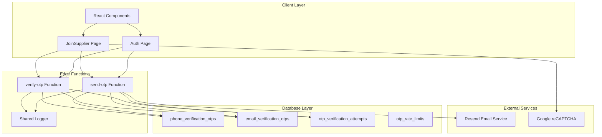
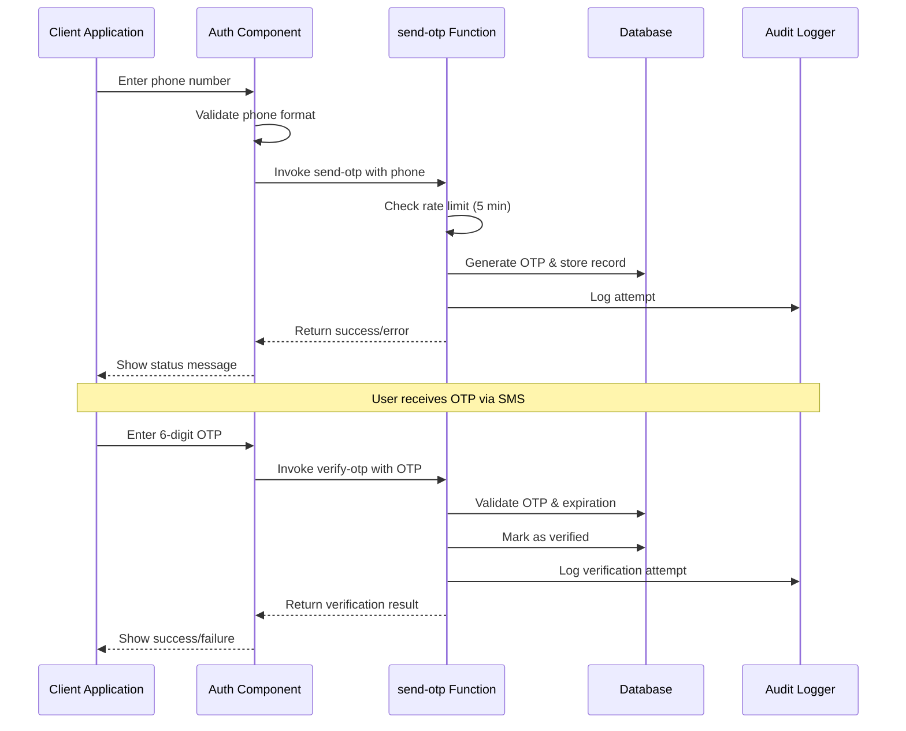
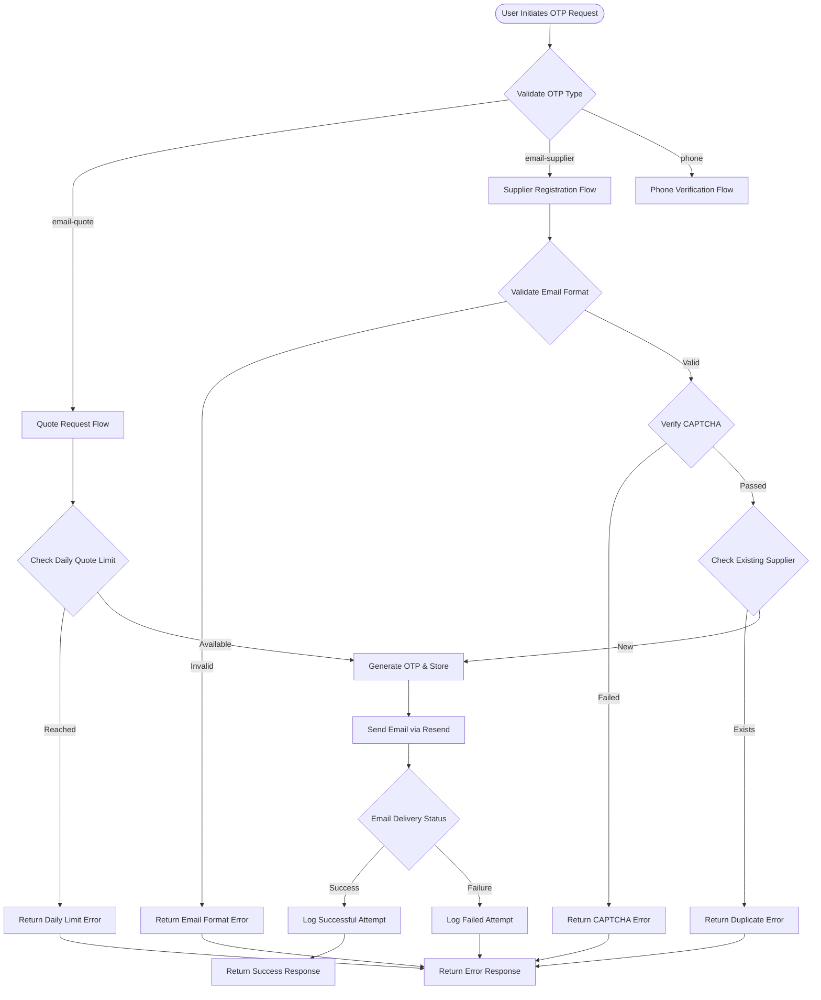

# OTP Authentication Flow

<cite>
**Referenced Files in This Document**
- [Auth.tsx](file://src/pages/Auth.tsx)
- [JoinSupplier.tsx](file://src/pages/JoinSupplier.tsx)
- [send-otp/index.ts](file://supabase/functions/send-otp/index.ts)
- [verify-otp/index.ts](file://supabase/functions/verify-otp/index.ts)
- [Auth.test.tsx](file://src/pages/__tests__/Auth.test.tsx)
- [client.ts](file://src/integrations/supabase/client.ts)
- [logger.ts](file://supabase/functions/_shared/logger.ts)
- [check_otp_rate_limit](file://supabase/COMPLETE_SETUP.sql)
- [log_otp_attempt](file://supabase/COMPLETE_SETUP.sql)
- [phone_verification_otps](file://supabase/TABLES_ONLY.sql)
- [email_verification_otps](file://supabase/TABLES_ONLY.sql)
</cite>

## Table of Contents
1. [Introduction](#introduction)
2. [System Architecture](#system-architecture)
3. [OTP Types and Endpoints](#otp-types-and-endpoints)
4. [Phone OTP Flow](#phone-otp-flow)
5. [Email OTP Flow](#email-otp-flow)
6. [Security Measures](#security-measures)
7. [Rate Limiting and Anti-Abuse](#rate-limiting-and-anti-abuse)
8. [Error Handling and Responses](#error-handling-and-responses)
9. [Client-Side Implementation](#client-side-implementation)
10. [Testing and Validation](#testing-and-validation)
11. [Database Schema](#database-schema)
12. [Troubleshooting Guide](#troubleshooting-guide)

## Introduction

The OTP (One-Time Password) authentication system in sleekapp-v100 provides secure multi-factor authentication for user registration and verification processes. The system supports both phone and email-based OTP flows with comprehensive security measures, rate limiting, and audit logging. Built on Supabase Edge Functions, the system ensures robust protection against abuse while maintaining excellent user experience.

The OTP system serves three primary use cases:
- **Phone Verification**: For user registration and profile updates requiring mobile number validation
- **Email Quote Requests**: For anonymous users requesting product quotes with daily limits
- **Supplier Registration**: For new supplier accounts with CAPTCHA integration and anti-bot protection

## System Architecture

The OTP authentication system follows a distributed architecture with clear separation of concerns between client-side presentation, serverless functions, and database storage.



**Diagram sources**
- [Auth.tsx](file://src/pages/Auth.tsx#L86-L135)
- [JoinSupplier.tsx](file://src/pages/JoinSupplier.tsx#L52-L282)
- [send-otp/index.ts](file://supabase/functions/send-otp/index.ts#L131-L489)
- [verify-otp/index.ts](file://supabase/functions/verify-otp/index.ts#L21-L356)

**Section sources**
- [Auth.tsx](file://src/pages/Auth.tsx#L1-L688)
- [JoinSupplier.tsx](file://src/pages/JoinSupplier.tsx#L1-L659)
- [send-otp/index.ts](file://supabase/functions/send-otp/index.ts#L1-L489)
- [verify-otp/index.ts](file://supabase/functions/verify-otp/index.ts#L1-L356)

## OTP Types and Endpoints

The system supports three distinct OTP types, each serving specific use cases with tailored validation and rate limiting policies.

### OTP Type Definitions

| Type | Purpose | Rate Limit | Expiration | Max Attempts |
|------|---------|------------|------------|--------------|
| `phone` | User registration and profile updates | 1 request per 5 minutes | 10 minutes | Unlimited |
| `email-quote` | Anonymous quote requests | 3 per day | 10 minutes | 5 per OTP |
| `email-supplier` | Supplier registration | 1 request per 5 minutes | 10 minutes | 5 per OTP |

### Endpoint URL Patterns

The OTP functions are exposed as Supabase Edge Functions with the following URL patterns:

- **Send OTP**: `POST /functions/v1/send-otp`
- **Verify OTP**: `POST /functions/v1/verify-otp`

### Request/Response Schemas

#### Send OTP Request Schema

```typescript
interface SendOTPRequest {
  type: 'phone' | 'email-quote' | 'email-supplier';
  phone?: string;
  email?: string;
  country?: string;
  captchaToken?: string;
}
```

#### Send OTP Response Schema

```typescript
interface SendOTPResponse {
  success: boolean;
  expiresAt: string;
  message?: string;
  error?: string;
  retryAfter?: number;
}
```

#### Verify OTP Request Schema

```typescript
interface VerifyOTPRequest {
  type: 'phone' | 'email-quote' | 'email-supplier';
  phone?: string;
  email?: string;
  otp: string;
}
```

#### Verify OTP Response Schema

```typescript
interface VerifyOTPResponse {
  success: boolean;
  verified: boolean;
  message?: string;
  error?: string;
  attemptsRemaining?: number;
  quotesUsedToday?: number;
  quotesRemaining?: number;
}
```

**Section sources**
- [send-otp/index.ts](file://supabase/functions/send-otp/index.ts#L36-L44)
- [verify-otp/index.ts](file://supabase/functions/verify-otp/index.ts#L12-L19)

## Phone OTP Flow

The phone OTP flow provides secure verification for user registration and profile updates. It implements strict rate limiting and comprehensive error handling.

### Flow Diagram



**Diagram sources**
- [Auth.tsx](file://src/pages/Auth.tsx#L86-L135)
- [send-otp/index.ts](file://supabase/functions/send-otp/index.ts#L195-L256)
- [verify-otp/index.ts](file://supabase/functions/verify-otp/index.ts#L91-L177)

### Implementation Details

#### Phone OTP Request Flow

The phone OTP implementation handles several critical aspects:

1. **Rate Limiting**: Prevents abuse by limiting requests to once every 5 minutes
2. **OTP Generation**: Creates 6-digit random codes with 10-minute expiration
3. **Storage**: Persists OTP records with attempt tracking
4. **Logging**: Comprehensive audit trail for security monitoring

#### Phone OTP Response Handling

```typescript
// Success response format
{
  success: true,
  expiresAt: "2024-01-15T10:30:00.000Z",
  message: "Verification code sent"
}

// Error response format (rate limit)
{
  error: "Please wait 5 minutes before requesting another code",
  retryAfter: 300
}
```

**Section sources**
- [Auth.tsx](file://src/pages/Auth.tsx#L86-L135)
- [send-otp/index.ts](file://supabase/functions/send-otp/index.ts#L195-L256)
- [verify-otp/index.ts](file://supabase/functions/verify-otp/index.ts#L91-L177)

## Email OTP Flow

The email OTP flow supports multiple use cases with sophisticated validation and rate limiting mechanisms.

### Email OTP Types

#### 1. Email Quote Requests (`email-quote`)
Designed for anonymous quote requests with daily limits:

- **Daily Limit**: 3 quotes per email per day
- **Rate Limit**: 1 request per 5 minutes
- **Purpose**: Allow potential customers to request product quotes without registration

#### 2. Supplier Registration (`email-supplier`)
For new supplier account creation with enhanced security:

- **Rate Limit**: 1 request per 5 minutes
- **CAPTCHA**: Google reCAPTCHA integration for bot prevention
- **Duplicate Check**: Validates against existing supplier records
- **Disposable Email Protection**: Blocks temporary email domains

### Flow Diagram



**Diagram sources**
- [send-otp/index.ts](file://supabase/functions/send-otp/index.ts#L259-L489)

### Email Validation and Security

The email OTP system implements comprehensive validation:

#### Email Format Validation
- **Regex Pattern**: Strict RFC-compliant email validation
- **Length Limits**: Local part ≤ 64 characters, total ≤ 254 characters
- **Format Checks**: Prevents consecutive dots, validates domain structure

#### Disposable Email Protection
Blocked disposable email domains include:
- tempmail.com, throwaway.email, 10minutemail.com
- mailinator.com, trashmail.com, yopmail.com
- fakeinbox.com, sharklasers.com, getnada.com

#### Supplier-Specific Validation
- **Duplicate Prevention**: Checks against existing supplier records
- **CAPTCHA Integration**: Google reCAPTCHA v3 for bot detection
- **Business Email Requirement**: Encourages permanent business email addresses

**Section sources**
- [send-otp/index.ts](file://supabase/functions/send-otp/index.ts#L51-L102)
- [send-otp/index.ts](file://supabase/functions/send-otp/index.ts#L259-L489)

## Security Measures

The OTP system implements multiple layers of security to protect against various attack vectors.

### CAPTCHA Integration

The supplier registration flow includes Google reCAPTCHA v3 integration for bot prevention:

```typescript
// CAPTCHA verification process
const verifyUrl = `https://www.google.com/recaptcha/api/siteverify?secret=${secret}&response=${token}`;
const captchaResponse = await fetch(verifyUrl, { method: 'POST' });
const captchaData = await captchaResponse.json();

if (!captchaData.success) {
  // Handle CAPTCHA failure
}
```

### IP Address Tracking

All OTP attempts are logged with IP address tracking for security monitoring:

```typescript
// IP address capture from request headers
const ipAddress = req.headers.get('x-forwarded-for') || 
                 req.headers.get('x-real-ip');
```

### PII Sanitization

Sensitive data is automatically sanitized in logs to prevent exposure:

```typescript
// Email sanitization: john.doe@example.com → joh***@example.com
// Phone sanitization: +8801234567890 → +880****90
// Token redaction: All password/token fields → [REDACTED]
```

### Rate Limiting Implementation

#### OTP Attempt Rate Limiting
- **Attempts per Hour**: Maximum 3 verification attempts per identifier
- **Time Window**: 1-hour sliding window
- **Granular Tracking**: Separate limits for phone and email identifiers

#### Request Rate Limiting
- **Phone OTP**: 1 request per 5 minutes per phone number
- **Email OTP**: 1 request per 5 minutes per email address
- **Quote Requests**: 3 requests per day per email address

### Audit Logging

Comprehensive audit logging tracks all OTP activities:

```typescript
// Audit log entries include:
// - Identifier (phone/email)
// - Identifier type (phone/email)
// - Success/failure status
// - IP address
// - Timestamp
// - Attempt count
```

**Section sources**
- [JoinSupplier.tsx](file://src/pages/JoinSupplier.tsx#L72-L86)
- [send-otp/index.ts](file://supabase/functions/send-otp/index.ts#L154-L187)
- [verify-otp/index.ts](file://supabase/functions/verify-otp/index.ts#L67-L88)
- [logger.ts](file://supabase/functions/_shared/logger.ts#L1-L173)

## Rate Limiting and Anti-Abuse

The system implements sophisticated rate limiting to prevent abuse while maintaining good user experience.

### Rate Limiting Functions

#### check_otp_rate_limit Function
This PostgreSQL function enforces attempt-based rate limiting:

```sql
CREATE FUNCTION public.check_otp_rate_limit(
  p_identifier text, 
  p_identifier_type text
) RETURNS jsonb
LANGUAGE plpgsql SECURITY DEFINER
AS $$
DECLARE
  v_attempt_count INTEGER;
  v_time_window INTERVAL := '1 hour';
  v_max_attempts INTEGER := 3;
BEGIN
  -- Count attempts in the last hour
  SELECT COUNT(*)
  INTO v_attempt_count
  FROM public.otp_verification_attempts
  WHERE identifier = p_identifier
    AND identifier_type = p_identifier_type
    AND attempt_time > (now() - v_time_window);
  
  RETURN jsonb_build_object(
    'allowed', v_attempt_count < v_max_attempts,
    'attempts_used', v_attempt_count,
    'max_attempts', v_max_attempts,
    'attempts_remaining', GREATEST(0, v_max_attempts - v_attempt_count)
  );
END;
$$;
```

#### log_otp_attempt Function
Tracks all OTP attempts for security monitoring:

```sql
CREATE FUNCTION public.log_otp_attempt(
  p_identifier text, 
  p_identifier_type text, 
  p_success boolean, 
  p_ip_address text
) RETURNS uuid
LANGUAGE plpgsql SECURITY DEFINER
AS $$
DECLARE
  v_attempt_id UUID;
BEGIN
  INSERT INTO public.otp_verification_attempts (
    identifier,
    identifier_type,
    success,
    ip_address
  ) VALUES (
    p_identifier,
    p_identifier_type,
    p_success,
    p_ip_address
  ) RETURNING id INTO v_attempt_id;
  
  RETURN v_attempt_id;
END;
$$;
```

### Rate Limiting Policies

| Action | Rate Limit | Time Window | Reset |
|--------|------------|-------------|-------|
| OTP Verification Attempts | 3 attempts | 1 hour | Per attempt |
| Phone OTP Requests | 1 request | 5 minutes | Per phone number |
| Email OTP Requests | 1 request | 5 minutes | Per email address |
| Quote Requests | 3 requests | 24 hours | Per email address |

### Abuse Detection

The system monitors for suspicious patterns:

- **Multiple Failed Attempts**: Triggers CAPTCHA challenges
- **Geographic Anomalies**: Suspicious IP address patterns
- **High Volume Requests**: Automatic rate limiting enforcement
- **Repeated Identifiers**: Pattern analysis for abuse detection

**Section sources**
- [check_otp_rate_limit](file://supabase/COMPLETE_SETUP.sql#L245-L270)
- [log_otp_attempt](file://supabase/COMPLETE_SETUP.sql#L494-L515)
- [verify-otp/index.ts](file://supabase/functions/verify-otp/index.ts#L67-L88)

## Error Handling and Responses

The OTP system provides comprehensive error handling with appropriate HTTP status codes and user-friendly messages.

### HTTP Status Codes

| Status Code | Scenario | Response Format |
|-------------|----------|-----------------|
| 200 | Success | `{success: true, ...}` |
| 400 | Bad Request | `{error: "message", code?: "CODE"}` |
| 429 | Rate Limited | `{error: "message", retryAfter: seconds}` |
| 500 | Server Error | `{error: "message"}` |

### Error Categories

#### 1. Validation Errors
- **Missing Parameters**: Invalid or missing required fields
- **Format Validation**: Malformed phone numbers, invalid emails
- **Type Validation**: Unsupported OTP type

#### 2. Rate Limiting Errors
- **Request Rate Limit**: Too many requests within time window
- **Attempt Rate Limit**: Too many verification attempts
- **Daily Limit**: Quote requests exceeding daily quota

#### 3. Verification Errors
- **Expired OTP**: Code has exceeded 10-minute validity
- **Invalid OTP**: Wrong code or incorrect identifier
- **Max Attempts Reached**: Exhausted verification attempts
- **Already Verified**: Attempting to reuse verified OTP

#### 4. System Errors
- **Database Errors**: Storage or retrieval failures
- **Email Delivery**: SMTP or external service failures
- **CAPTCHA Errors**: reCAPTCHA verification failures

### Error Response Examples

#### Rate Limiting (429)
```json
{
  "error": "Please wait 5 minutes before requesting another code",
  "retryAfter": 300
}
```

#### Invalid OTP (400)
```json
{
  "error": "Invalid verification code. Please try again.",
  "verified": false,
  "attemptsRemaining": 2
}
```

#### Daily Limit Exceeded (429)
```json
{
  "error": "Daily quote limit reached. You can request 3 quotes per day.",
  "code": "DAILY_LIMIT_REACHED"
}
```

#### System Error (500)
```json
{
  "error": "Failed to send verification email. Please try again."
}
```

**Section sources**
- [send-otp/index.ts](file://supabase/functions/send-otp/index.ts#L144-L221)
- [verify-otp/index.ts](file://supabase/functions/verify-otp/index.ts#L348-L356)

## Client-Side Implementation

The client-side implementation provides seamless OTP integration with React components and Supabase functions.

### Supabase Integration

#### Function Invocation Pattern
```typescript
// Using supabase.functions.invoke for OTP operations
const { data, error } = await supabase.functions.invoke('send-otp', {
  body: { type: 'phone', phone: '+1234567890' }
});
```

#### Authentication State Management
```typescript
// Check authentication status
const { data: { user } } = await supabase.auth.getUser();
if (user) {
  // User is authenticated
}
```

### Component Implementation Patterns

#### Phone OTP Component
```typescript
// Phone OTP flow in Auth.tsx
const sendPhoneOtp = async () => {
  setIsLoading(true);
  try {
    const { data, error } = await supabase.functions.invoke('send-otp', {
      body: { type: 'phone', phone: phoneNumber },
    });
    
    if (error) throw error;
    setPhoneOtpSent(true);
    setOtpExpiry(new Date(data.expiresAt));
  } catch (error) {
    // Handle error with toast notification
  } finally {
    setIsLoading(false);
  }
};
```

#### Email OTP Component
```typescript
// Email OTP flow in JoinSupplier.tsx
const handleSubmit = async (e: React.FormEvent) => {
  e.preventDefault();
  
  try {
    const captchaToken = await recaptchaRef.current?.executeAsync();
    const { data, error } = await supabase.functions.invoke('send-otp', {
      body: { 
        type: 'email-supplier', 
        email: formData.email, 
        captchaToken 
      },
    });
    
    if (error) throw error;
    setStep('verify');
  } catch (error) {
    // Handle error with user feedback
  }
};
```

### Error Handling Strategies

#### Toast Notifications
```typescript
// User-friendly error messages
toast.error("Invalid verification code");
toast.success("Phone verified successfully!");
toast.error("Please wait 5 minutes before requesting another code");
```

#### Loading States
```typescript
// Manage loading states during OTP operations
const [isLoading, setIsLoading] = useState(false);
const [otpLoading, setOtpLoading] = useState(false);
```

#### Form Validation
```typescript
// Client-side validation before OTP request
const validatePhone = (phone: string) => {
  return /^\+?[1-9]\d{1,14}$/.test(phone);
};

const validateEmail = (email: string) => {
  return /^[^\s@]+@[^\s@]+\.[^\s@]+$/.test(email);
};
```

**Section sources**
- [Auth.tsx](file://src/pages/Auth.tsx#L86-L135)
- [JoinSupplier.tsx](file://src/pages/JoinSupplier.tsx#L52-L282)
- [client.ts](file://src/integrations/supabase/client.ts#L1-L20)

## Testing and Validation

The OTP system includes comprehensive testing with Vitest and mock implementations.

### Test Coverage Areas

#### 1. Phone OTP Tests
- **Successful OTP Request**: Valid phone number, rate limit compliance
- **Invalid Phone Number**: Format validation, error handling
- **Rate Limiting**: Multiple requests within 5-minute window
- **OTP Verification**: Correct code acceptance, expired code rejection

#### 2. Email OTP Tests
- **Quote Request Flow**: Daily limits, email validation
- **Supplier Registration**: CAPTCHA integration, duplicate checks
- **Email Validation**: Format validation, disposable email blocking
- **Rate Limiting**: Request frequency limits, attempt limits

#### 3. Error Handling Tests
- **Network Failures**: Connection timeouts, service unavailability
- **Invalid Credentials**: Malformed requests, missing parameters
- **Rate Limiting**: Exhausting limits, receiving appropriate responses

### Test Implementation Examples

#### Phone OTP Test Case
```typescript
it('sends OTP to phone number', async () => {
  const user = userEvent.setup();
  mockSupabase.functions.invoke.mockResolvedValue({
    data: { success: true, expiresAt: new Date().toISOString() },
    error: null,
  });

  const phoneInput = screen.getByPlaceholderText(/\+1234567890/i);
  await user.type(phoneInput, '+1234567890');
  await user.click(screen.getByRole('button', { name: /Send Code/i }));

  await waitFor(() => {
    expect(mockSupabase.functions.invoke).toHaveBeenCalledWith('send-otp', {
      body: { type: 'phone', phone: '+1234567890' },
    });
  });
});
```

#### Email OTP Test Case
```typescript
it('handles invalid OTP code', async () => {
  const user = userEvent.setup();
  
  // Mock failed verification
  mockSupabase.functions.invoke.mockResolvedValueOnce({
    data: null,
    error: { message: 'Invalid verification code' },
  });

  const otpInputs = screen.getAllByRole('textbox');
  for (let i = 0; i < 6; i++) {
    await user.type(otpInputs[i], String(i));
  }

  await waitFor(() => {
    expect(toast.error).toHaveBeenCalledWith('Invalid verification code');
  });
});
```

### Mock Implementation

#### Supabase Mocks
```typescript
// Mock Supabase client for testing
const mockSupabase = {
  functions: {
    invoke: vi.fn()
  },
  auth: {
    signInWithPassword: vi.fn(),
    signUp: vi.fn()
  }
};
```

#### Test Utilities
```typescript
// Test setup with proper mocking
beforeEach(() => {
  resetMocks();
  mockNavigate.mockClear();
});
```

**Section sources**
- [Auth.test.tsx](file://src/pages/__tests__/Auth.test.tsx#L1-L460)

## Database Schema

The OTP system relies on several database tables for storing verification data and enforcing rate limits.

### OTP Verification Tables

#### phone_verification_otps
Stores phone-based OTP records:

```sql
CREATE TABLE public.phone_verification_otps (
    id uuid DEFAULT gen_random_uuid() NOT NULL PRIMARY KEY,
    phone text NOT NULL,
    otp text NOT NULL,
    expires_at timestamp with time zone NOT NULL,
    verified boolean DEFAULT false,
    created_at timestamp with time zone DEFAULT now(),
    attempt_count integer DEFAULT 0,
    ip_address text,
    session_id text
);
```

#### email_verification_otps
Stores email-based OTP records with enhanced tracking:

```sql
CREATE TABLE public.email_verification_otps (
    id uuid DEFAULT gen_random_uuid() NOT NULL PRIMARY KEY,
    email text NOT NULL,
    otp text NOT NULL,
    expires_at timestamp with time zone NOT NULL,
    verified boolean DEFAULT false,
    created_at timestamp with time zone DEFAULT now(),
    attempt_count integer DEFAULT 0,
    ip_address text,
    session_id text,
    resend_email_id TEXT,
    email_sent_at TIMESTAMPTZ,
    delivery_status TEXT DEFAULT 'pending' CHECK (delivery_status IN ('pending', 'sent', 'failed', 'bounced', 'delivered')),
    delivery_error TEXT
);
```

### Audit and Rate Limiting Tables

#### otp_verification_attempts
Tracks all OTP verification attempts for security monitoring:

```sql
CREATE TABLE public.otp_verification_attempts (
    id uuid DEFAULT gen_random_uuid() NOT NULL PRIMARY KEY,
    identifier text NOT NULL,
    identifier_type text NOT NULL,
    attempt_time timestamp with time zone DEFAULT now() NOT NULL,
    success boolean DEFAULT false NOT NULL,
    ip_address text,
    created_at timestamp with time zone DEFAULT now() NOT NULL
);
```

#### otp_rate_limits
Enforces request-based rate limiting:

```sql
CREATE TABLE public.otp_rate_limits (
    id uuid DEFAULT gen_random_uuid() NOT NULL PRIMARY KEY,
    identifier text NOT NULL,
    identifier_type text NOT NULL,
    request_count integer DEFAULT 1,
    window_start timestamp with time zone DEFAULT now(),
    created_at timestamp with time zone DEFAULT now()
);
```

### Database Security

#### Row Level Security (RLS)
- **Policy Enforcement**: Only service role can access OTP tables
- **No Public Access**: Prevents direct database queries from client applications
- **Service Role Isolation**: Edge functions use service role for database access

#### Indexes for Performance
```sql
-- Phone OTP table indexes
CREATE INDEX idx_phone_verification_phone ON phone_verification_otps(phone);
CREATE INDEX idx_phone_verification_expires ON phone_verification_otps(expires_at);

-- Email OTP table indexes
CREATE INDEX idx_email_verification_email ON email_verification_otps(email);
CREATE INDEX idx_email_verification_expires ON email_verification_otps(expires_at);
CREATE INDEX idx_email_verification_delivery_status ON email_verification_otps(delivery_status, created_at);

-- Audit table indexes
CREATE INDEX idx_otp_attempts_identifier ON otp_verification_attempts(identifier);
CREATE INDEX idx_otp_attempts_time ON otp_verification_attempts(attempt_time);
```

**Section sources**
- [phone_verification_otps](file://supabase/TABLES_ONLY.sql#L496-L506)
- [email_verification_otps](file://supabase/TABLES_ONLY.sql#L474-L496)
- [otp_verification_attempts](file://supabase/TABLES_ONLY.sql#L487-L495)

## Troubleshooting Guide

Common issues and their solutions for the OTP authentication system.

### Frequently Encountered Issues

#### 1. OTP Not Received
**Symptoms**: User submits OTP request but doesn't receive verification code

**Possible Causes**:
- Email delivery failures (spam folder, blocked domains)
- Rate limiting preventing OTP generation
- Invalid phone number format
- Network connectivity issues

**Solutions**:
```typescript
// Check for rate limiting
if (error?.message.includes('wait 5 minutes')) {
  toast.error("Please wait 5 minutes before requesting another code");
}

// Verify email format
if (error?.message.includes('Invalid email format')) {
  toast.error("Please enter a valid email address");
}

// Check for network errors
if (error?.message?.includes('Failed to fetch')) {
  toast.error("Network error. Please check your connection");
}
```

#### 2. OTP Verification Failures
**Symptoms**: User receives OTP but verification fails

**Possible Causes**:
- Expired OTP (more than 10 minutes old)
- Wrong OTP code entered
- Max attempts exceeded (5 attempts per OTP)
- Database connectivity issues

**Solutions**:
```typescript
// Handle expired OTP
if (error?.message.includes('expired')) {
  toast.error("Verification code has expired. Please request a new one.");
}

// Handle max attempts reached
if (error?.message.includes('Maximum verification attempts')) {
  toast.error("Maximum attempts reached. Please request a new code.");
}

// Provide remaining attempts feedback
if (error?.attemptsRemaining !== undefined) {
  toast.error(`Wrong code. ${error.attemptsRemaining} attempts remaining`);
}
```

#### 3. Rate Limiting Issues
**Symptoms**: User receives "too many requests" errors

**Possible Causes**:
- Too many OTP requests within time window
- Multiple simultaneous requests
- IP-based rate limiting triggers

**Solutions**:
```typescript
// Handle rate limiting gracefully
if (error?.status === 429) {
  const retryAfter = error.retryAfter || 300;
  const minutes = Math.ceil(retryAfter / 60);
  toast.error(`Too many requests. Please try again in ${minutes} minutes.`);
}
```

### Debugging Tools

#### 1. Enable Debug Logging
```typescript
// Enable detailed logging for development
const logger = createLogger('otp-debug');
logger.info('OTP request initiated', { type, identifier });
```

#### 2. Monitor OTP Attempts
```sql
-- Check OTP attempt history
SELECT * FROM otp_verification_attempts 
WHERE identifier = 'user@example.com'
ORDER BY attempt_time DESC
LIMIT 10;

-- Check rate limit status
SELECT * FROM check_otp_rate_limit('user@example.com', 'email');
```

#### 3. Verify Database Records
```sql
-- Check OTP records
SELECT * FROM email_verification_otps 
WHERE email = 'user@example.com' 
AND verified = false 
ORDER BY created_at DESC;

-- Check delivery status
SELECT * FROM email_verification_otps 
WHERE email = 'user@example.com' 
AND delivery_status != 'sent';
```

### Performance Optimization

#### 1. Email Delivery Monitoring
```sql
-- Monitor email delivery failures
SELECT delivery_status, COUNT(*) as count
FROM email_verification_otps
GROUP BY delivery_status;
```

#### 2. Rate Limit Analysis
```sql
-- Analyze rate limiting effectiveness
SELECT 
  identifier_type,
  COUNT(*) as total_requests,
  SUM(CASE WHEN success = false THEN 1 ELSE 0 END) as failed_attempts
FROM otp_verification_attempts
WHERE attempt_time > NOW() - INTERVAL '1 hour'
GROUP BY identifier_type;
```

### Recovery Procedures

#### 1. Clear Rate Limits
```sql
-- Clear rate limits for testing (development only)
DELETE FROM otp_rate_limits 
WHERE window_start < NOW() - INTERVAL '1 hour';
```

#### 2. Reset OTP Records
```sql
-- Reset OTP records (use with caution)
UPDATE email_verification_otps 
SET verified = false, attempt_count = 0 
WHERE email = 'problematic@example.com';

UPDATE phone_verification_otps 
SET verified = false, attempt_count = 0 
WHERE phone = '+1234567890';
```

**Section sources**
- [send-otp/index.ts](file://supabase/functions/send-otp/index.ts#L144-L221)
- [verify-otp/index.ts](file://supabase/functions/verify-otp/index.ts#L348-L356)
- [logger.ts](file://supabase/functions/_shared/logger.ts#L1-L173)