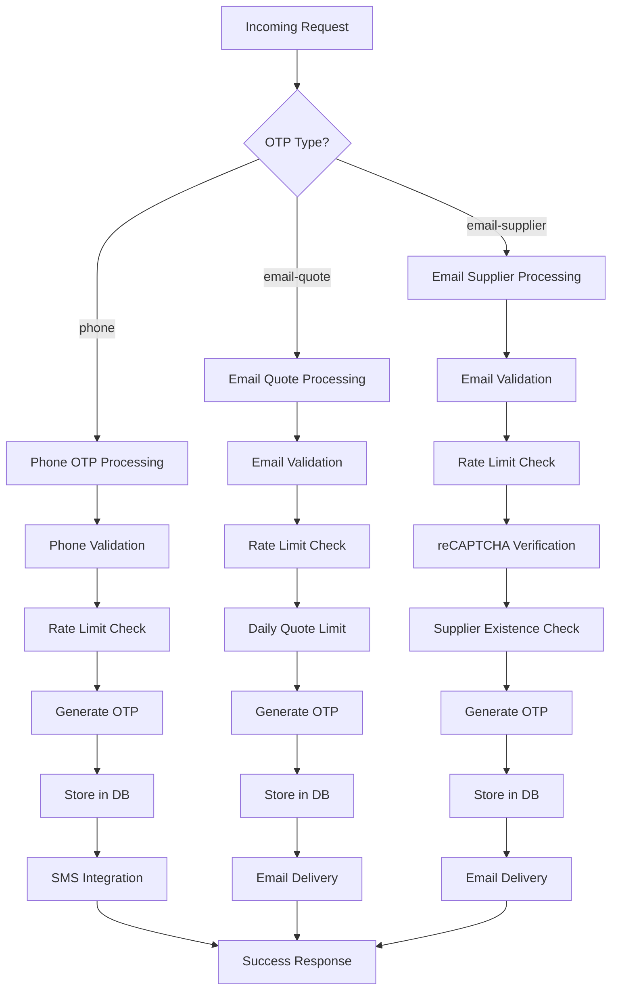
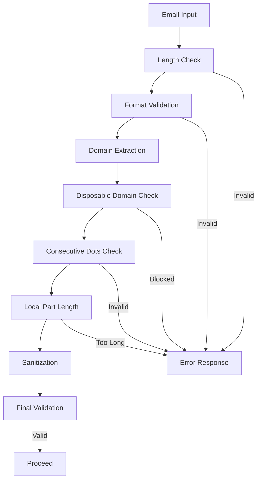
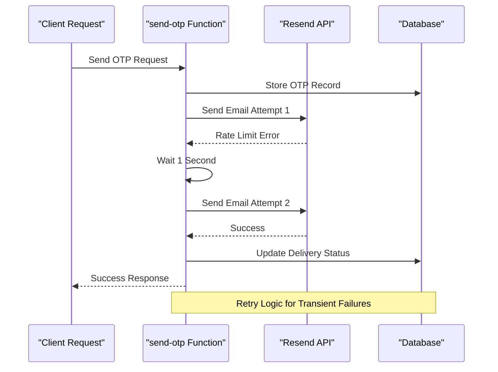

# Send OTP Function

<cite>
**Referenced Files in This Document**
- [supabase/functions/send-otp/index.ts](file://supabase/functions/send-otp/index.ts)
- [src/pages/JoinSupplier.tsx](file://src/pages/JoinSupplier.tsx)
- [src/pages/__tests__/Auth.test.tsx](file://src/pages/__tests__/Auth.test.tsx)
- [src/components/quote/EmailQuoteModal.tsx](file://src/components/quote/EmailQuoteModal.tsx)
- [supabase/TABLES_ONLY.sql](file://supabase/TABLES_ONLY.sql)
- [supabase/migrations/20251115150759_remix_migration_from_pg_dump.sql](file://supabase/migrations/20251115150759_remix_migration_from_pg_dump.sql)
</cite>

## Table of Contents
1. [Introduction](#introduction)
2. [Supported OTP Types](#supported-otp-types)
3. [Request/Response Schema](#requestresponse-schema)
4. [Validation Rules](#validation-rules)
5. [Rate Limiting Mechanism](#rate-limiting-mechanism)
6. [Email Delivery Retry Logic](#email-delivery-retry-logic)
7. [Database Schema](#database-schema)
8. [Client-Side Implementation](#client-side-implementation)
9. [Error Handling](#error-handling)
10. [Security Features](#security-features)
11. [Testing](#testing)

## Introduction

The send-otp edge function is a critical component of the Sleek Apparels authentication system, responsible for generating and delivering one-time passwords (OTPs) to users for various verification purposes. Built as a Deno-based Edge Function, it provides secure, scalable OTP generation with comprehensive validation, rate limiting, and retry mechanisms.

The function supports three distinct OTP types, each serving specific use cases within the application ecosystem while maintaining consistent security standards and user experience patterns.

## Supported OTP Types

The send-otp function supports three specialized OTP types, each designed for specific user scenarios:

### Phone OTP (`type: 'phone'`)
- **Use Case**: Mobile phone verification during user registration or login
- **Required Fields**: `type`, `phone`
- **Validation**: International phone number format validation
- **Delivery Method**: SMS integration placeholder (currently logs OTP for manual delivery)
- **Expiration**: 10 minutes
- **Rate Limit**: 5-minute cooldown period

### Email Quote OTP (`type: 'email-quote'`)
- **Use Case**: Email verification for quote requests and customer inquiries
- **Required Fields**: `type`, `email`
- **Additional Feature**: Daily quote limit enforcement (3 quotes per day)
- **Validation**: Comprehensive email format validation with disposable email blocking
- **Expiration**: 10 minutes
- **Rate Limit**: 5-minute cooldown period

### Email Supplier OTP (`type: 'email-supplier'`)
- **Use Case**: Supplier registration verification with anti-bot protection
- **Required Fields**: `type`, `email`, `captchaToken`
- **Security Features**: reCAPTCHA v3 integration, disposable email blocking, supplier existence check
- **Validation**: Full email validation with domain reputation filtering
- **Expiration**: 10 minutes
- **Rate Limit**: 5-minute cooldown period



**Diagram sources**
- [supabase/functions/send-otp/index.ts](file://supabase/functions/send-otp/index.ts#L131-L489)

**Section sources**
- [supabase/functions/send-otp/index.ts](file://supabase/functions/send-otp/index.ts#L36-L44)
- [supabase/functions/send-otp/index.ts](file://supabase/functions/send-otp/index.ts#L195-L489)

## Request/Response Schema

### Request Schema

The function accepts a JSON payload with the following structure:

| Field | Type | Required | Description |
|-------|------|----------|-------------|
| `type` | string | Yes | OTP type: 'phone', 'email-quote', or 'email-supplier' |
| `phone` | string | Conditional | Phone number (required for phone type) |
| `email` | string | Conditional | Email address (required for email types) |
| `country` | string | No | Country code for phone validation |
| `captchaToken` | string | Conditional | reCAPTCHA token (required for email-supplier type) |

### Response Formats

#### Success Response (200)
```json
{
  "success": true,
  "expiresAt": "2024-01-15T10:30:00Z",
  "message": "Verification code sent"
}
```

#### Error Responses

##### Validation Error (400)
```json
{
  "error": "Email is required"
}
```

##### Rate Limit Error (429)
```json
{
  "error": "Please wait 5 minutes before requesting another code",
  "retryAfter": 300
}
```

##### Daily Limit Error (429)
```json
{
  "error": "Daily quote limit reached. You can request 3 quotes per day.",
  "code": "DAILY_LIMIT_REACHED"
}
```

**Section sources**
- [supabase/functions/send-otp/index.ts](file://supabase/functions/send-otp/index.ts#L144-L151)
- [supabase/functions/send-otp/index.ts](file://supabase/functions/send-otp/index.ts#L249-L256)
- [supabase/functions/send-otp/index.ts](file://supabase/functions/send-otp/index.ts#L334-L340)

## Validation Rules

### Phone Number Validation
- **Format**: International phone number format with optional country code
- **Length**: Minimum 7 digits, maximum 15 digits
- **Characters**: Allow +, -, (), spaces, and digits only
- **Country Code**: Optional leading + or 00 prefix

### Email Validation
The function implements comprehensive email validation with multiple layers:

#### Basic Format Validation
- **Length**: 5-254 characters
- **Local Part**: Maximum 64 characters
- **Domain Part**: Valid domain format with proper TLD
- **Special Characters**: Prevents consecutive dots and invalid characters

#### Advanced Validation Rules
- **Regex Pattern**: Comprehensive RFC-compliant email validation
- **Disposable Domains**: Blocks common disposable email providers
- **Header Injection Prevention**: Sanitizes email to prevent header injection attacks
- **Domain Reputation**: Checks against known spam domains

### Supplier-Specific Validation
- **Unique Email**: Ensures no existing supplier accounts with the same email
- **Business Email**: Encourages professional email addresses for supplier registration



**Diagram sources**
- [supabase/functions/send-otp/index.ts](file://supabase/functions/send-otp/index.ts#L51-L94)

**Section sources**
- [supabase/functions/send-otp/index.ts](file://supabase/functions/send-otp/index.ts#L51-L94)
- [supabase/functions/send-otp/index.ts](file://supabase/functions/send-otp/index.ts#L154-L188)

## Rate Limiting Mechanism

The send-otp function implements a sophisticated rate limiting system to prevent abuse and ensure fair usage:

### Per-Identifier Rate Limiting
- **Time Window**: 5-minute sliding window
- **Identifier Types**: Phone numbers and email addresses
- **Storage**: Separate tables for phone and email OTPs
- **Granularity**: Individual user identifier level

### Implementation Details
- **Database Query**: Checks recent OTP requests for the same identifier
- **Timestamp Comparison**: Uses ISO 8601 timestamps for accurate time tracking
- **Limit Enforcement**: Returns 429 status with retry-after information
- **Grace Period**: 5-minute cooldown prevents immediate re-request

### Rate Limiting Flow
1. **Extract Identifier**: Phone number or email from request
2. **Query Recent Requests**: Check OTP table for recent entries
3. **Calculate Time Difference**: Compare timestamps with 5-minute threshold
4. **Enforce Limit**: Return error if limit exceeded, otherwise proceed

**Section sources**
- [supabase/functions/send-otp/index.ts](file://supabase/functions/send-otp/index.ts#L205-L222)
- [supabase/functions/send-otp/index.ts](file://supabase/functions/send-otp/index.ts#L297-L314)

## Email Delivery Retry Logic

The function implements robust email delivery retry mechanisms to handle transient failures:

### Retry Strategy
- **Max Retries**: 2 attempts
- **Backoff Strategy**: Exponential delay (1 second, 2 seconds)
- **Error Classification**: Identifies retryable vs. permanent failures
- **Failure Handling**: Updates database records with delivery status

### Retryable Error Detection
The system automatically identifies retryable errors based on error message patterns:
- **Rate Limit**: Service temporary unavailability
- **Timeout**: Network connectivity issues
- **Service Unavailable**: External service downtime
- **Temporary Unavailable**: Transient delivery failures

### Delivery Tracking
- **Status Updates**: Tracks delivery attempts in database
- **Error Logging**: Records detailed error information
- **Success Confirmation**: Updates with Resend API message ID
- **Failure Recovery**: Marks failed attempts for monitoring



**Diagram sources**
- [supabase/functions/send-otp/index.ts](file://supabase/functions/send-otp/index.ts#L104-L129)
- [supabase/functions/send-otp/index.ts](file://supabase/functions/send-otp/index.ts#L403-L478)

**Section sources**
- [supabase/functions/send-otp/index.ts](file://supabase/functions/send-otp/index.ts#L104-L129)
- [supabase/functions/send-otp/index.ts](file://supabase/functions/send-otp/index.ts#L403-L478)

## Database Schema

The OTP system utilizes two primary database tables for storage and tracking:

### Phone Verification OTPs
```sql
CREATE TABLE public.phone_verification_otps (
    id uuid DEFAULT gen_random_uuid() NOT NULL,
    phone text NOT NULL,
    otp text NOT NULL,
    expires_at timestamp with time zone NOT NULL,
    verified boolean DEFAULT false,
    created_at timestamp with time zone DEFAULT now(),
    attempt_count integer DEFAULT 0,
    ip_address text,
    session_id text
);
```

### Email Verification OTPs
```sql
CREATE TABLE public.email_verification_otps (
    id uuid DEFAULT gen_random_uuid() NOT NULL,
    email text NOT NULL,
    otp text NOT NULL,
    expires_at timestamp with time zone NOT NULL,
    verified boolean DEFAULT false,
    created_at timestamp with time zone DEFAULT now(),
    ip_address text,
    session_id text,
    attempt_count integer DEFAULT 0,
    delivery_status text,
    resend_email_id text,
    email_sent_at timestamp with time zone,
    delivery_error text
);
```

### Key Columns and Their Purposes

| Column | Purpose | Phone OTP | Email OTP |
|--------|---------|-----------|-----------|
| `id` | Unique identifier | ✓ | ✓ |
| `phone/email` | Target identifier | ✓ | ✓ |
| `otp` | Generated code | ✓ | ✓ |
| `expires_at` | Expiration timestamp | ✓ | ✓ |
| `verified` | Verification status | ✓ | ✓ |
| `created_at` | Creation timestamp | ✓ | ✓ |
| `attempt_count` | Retry attempts | ✓ | ✓ |
| `ip_address` | Client IP tracking | ✓ | ✓ |
| `session_id` | Session correlation | ✓ | ✓ |
| `delivery_status` | Email delivery status | ✗ | ✓ |
| `resend_email_id` | Resend API message ID | ✗ | ✓ |
| `email_sent_at` | Delivery timestamp | ✗ | ✓ |
| `delivery_error` | Error details | ✗ | ✓ |

**Section sources**
- [supabase/migrations/20251115150759_remix_migration_from_pg_dump.sql](file://supabase/migrations/20251115150759_remix_migration_from_pg_dump.sql#L1080-L1090)
- [supabase/TABLES_ONLY.sql](file://supabase/TABLES_ONLY.sql#L1080-L1090)

## Client-Side Implementation

### JoinSupplier.tsx Integration

The client-side implementation demonstrates comprehensive OTP handling with timeout management and error mapping:

#### Form Submission Flow
1. **Field Validation**: Validates email format and password requirements
2. **CAPTCHA Verification**: Integrates reCAPTCHA v3 for anti-bot protection
3. **Timeout Handling**: Implements 30-second timeout for network reliability
4. **Error Mapping**: Converts backend errors to user-friendly messages
5. **State Management**: Handles loading states and form progression

#### Timeout Implementation
```typescript
const timeoutPromise = new Promise((_, reject) => 
  setTimeout(() => reject(new Error('Request timed out. Please check your connection and try again.')), 30000)
);

const otpPromise = supabase.functions.invoke('send-otp', {
  body: { type: 'email-supplier', email: formData.email, captchaToken }
});

const { data, error } = await Promise.race([otpPromise, timeoutPromise]);
```

#### Error Handling Strategy
- **Network Errors**: Graceful degradation with retry suggestions
- **Validation Errors**: Immediate user feedback with specific guidance
- **Rate Limiting**: Clear messaging with retry timing
- **Business Logic Errors**: Context-aware error messages

### Authentication Test Coverage

The test suite validates critical functionality including phone number validation and form submission flows:

#### Phone Verification Tests
- **Successful OTP Generation**: Validates phone number format and OTP delivery
- **Validation Error Handling**: Tests invalid phone number scenarios
- **Rate Limiting Behavior**: Verifies 5-minute cooldown enforcement
- **OTP Verification Flow**: Completes full phone verification process

#### Form Submission Testing
- **Field Validation**: Tests all form field requirements and constraints
- **Error Propagation**: Ensures backend errors are properly displayed
- **State Management**: Validates form state transitions and loading indicators

**Section sources**
- [src/pages/JoinSupplier.tsx](file://src/pages/JoinSupplier.tsx#L79-L125)
- [src/pages/__tests__/Auth.test.tsx](file://src/pages/__tests__/Auth.test.tsx#L266-L378)

## Error Handling

The send-otp function implements comprehensive error handling across multiple layers:

### Validation-Level Errors
- **Missing Required Fields**: Clear error messages for missing parameters
- **Invalid Format**: Specific feedback for malformed input data
- **Business Logic Violations**: Meaningful errors for constraint violations

### System-Level Errors
- **Database Connectivity**: Graceful fallback with appropriate error codes
- **External Service Failures**: Retry logic for transient external service issues
- **Configuration Issues**: Environment variable validation and error reporting

### Error Response Patterns
```typescript
// Validation Error
return new Response(
  JSON.stringify({ error: 'Email is required' }),
  { status: 400, headers: { ...corsHeaders, 'Content-Type': 'application/json' } }
);

// Rate Limit Error  
return new Response(
  JSON.stringify({ 
    error: 'Please wait 5 minutes before requesting another code',
    retryAfter: 300
  }),
  { status: 429, headers: { ...corsHeaders, 'Content-Type': 'application/json' } }
);
```

### Logging and Monitoring
- **Structured Logging**: Comprehensive logging with contextual information
- **Error Classification**: Categorizes errors for monitoring and alerting
- **Debug Information**: Sensitive data masking for security

**Section sources**
- [supabase/functions/send-otp/index.ts](file://supabase/functions/send-otp/index.ts#L144-L151)
- [supabase/functions/send-otp/index.ts](file://supabase/functions/send-otp/index.ts#L214-L222)
- [supabase/functions/send-otp/index.ts](file://supabase/functions/send-otp/index.ts#L481-L489)

## Security Features

### Anti-Bot Protection
- **reCAPTCHA v3 Integration**: Automatic score-based bot detection for supplier registration
- **CAPTCHA Token Validation**: Secure verification of Google reCAPTCHA tokens
- **Score Thresholding**: Configurable bot detection thresholds

### Email Security
- **Disposable Email Blocking**: Comprehensive blacklist of disposable email providers
- **Header Injection Prevention**: Email sanitization to prevent header injection attacks
- **Domain Reputation Filtering**: Blocks known spam and low-reputation domains

### Rate Limiting Security
- **Sliding Window**: 5-minute rate limiting prevents brute force attacks
- **Identifier-Based**: Protects individual user accounts from targeted attacks
- **IP Tracking**: Correlates requests with IP addresses for enhanced security

### Data Protection
- **Sensitive Data Masking**: Logs sanitized versions of phone numbers and emails
- **Secure Storage**: OTP codes stored with appropriate encryption
- **Session Isolation**: Separate OTP records for different sessions

**Section sources**
- [supabase/functions/send-otp/index.ts](file://supabase/functions/send-otp/index.ts#L154-L188)
- [supabase/functions/send-otp/index.ts](file://supabase/functions/send-otp/index.ts#L18-L23)
- [supabase/functions/send-otp/index.ts](file://supabase/functions/send-otp/index.ts#L46-L49)

## Testing

### Unit Test Coverage
The test suite provides comprehensive coverage of the OTP functionality:

#### Phone Verification Tests
- **Successful OTP Generation**: Validates phone number format and OTP delivery
- **Validation Error Handling**: Tests invalid phone number scenarios
- **Rate Limiting Behavior**: Verifies 5-minute cooldown enforcement
- **OTP Verification Flow**: Completes full phone verification process

#### Email Quote Tests
- **Daily Limit Enforcement**: Tests 3-quote-per-day restriction
- **Email Validation**: Validates email format and domain restrictions
- **Rate Limiting**: Verifies 5-minute cooldown for email requests

#### Supplier Registration Tests
- **CAPTCHA Integration**: Tests reCAPTCHA v3 verification flow
- **Supplier Existence Check**: Validates unique email enforcement
- **Business Email Validation**: Tests disposable email blocking

### Integration Test Patterns
- **Mock Supabase**: Comprehensive mocking of database interactions
- **Error Simulation**: Tests various failure scenarios
- **Timeout Handling**: Validates network timeout behavior
- **State Management**: Tests form state transitions and loading states

**Section sources**
- [src/pages/__tests__/Auth.test.tsx](file://src/pages/__tests__/Auth.test.tsx#L266-L378)