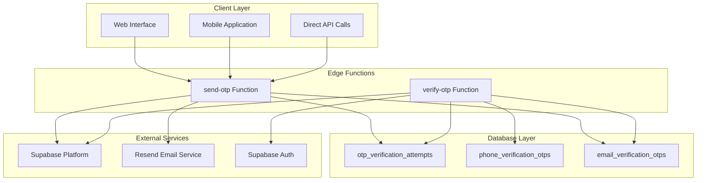
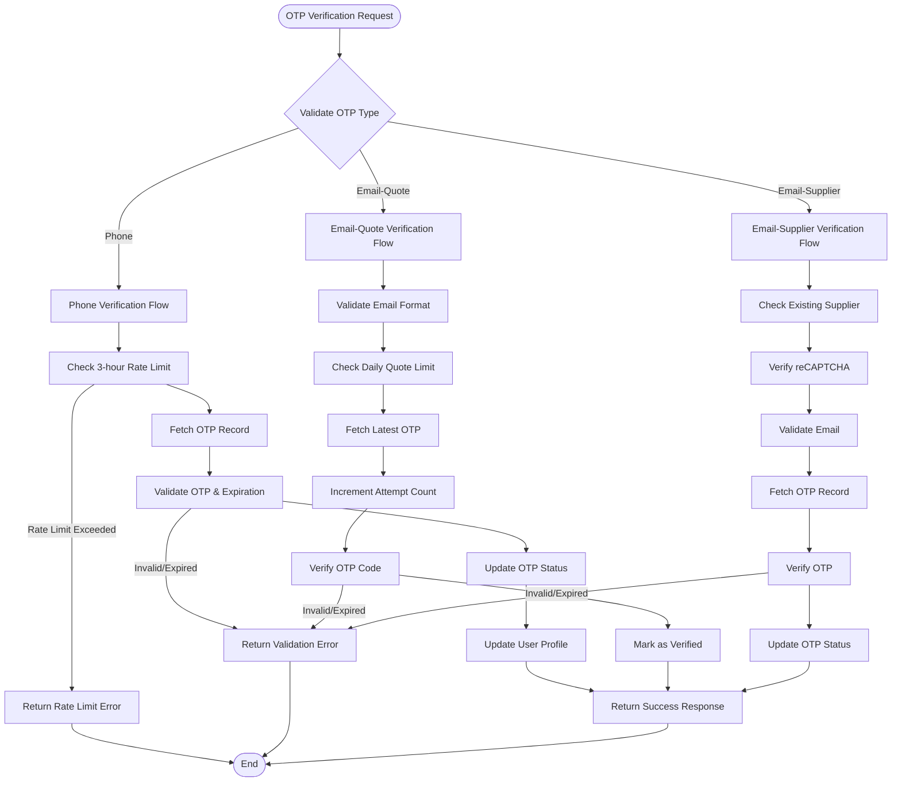
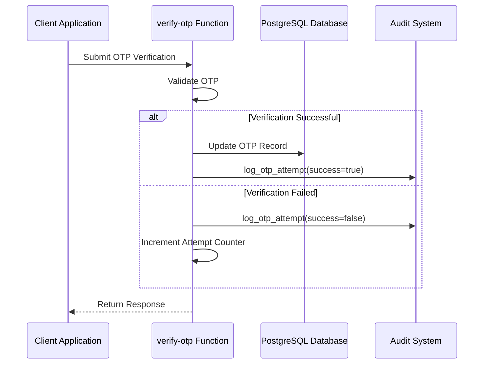
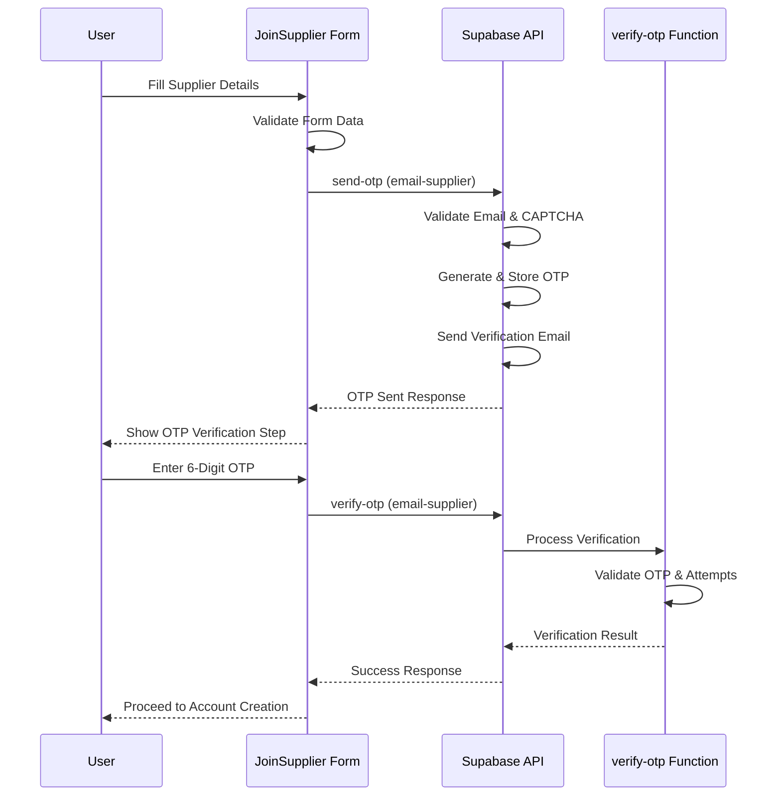
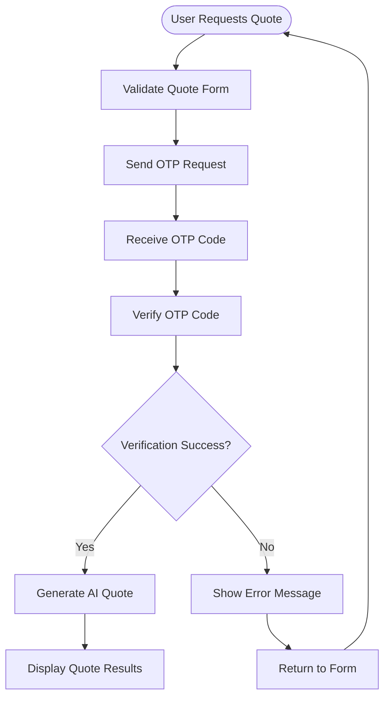

# Verify OTP Function

<cite>
**Referenced Files in This Document**
- [supabase/functions/verify-otp/index.ts](file://supabase/functions/verify-otp/index.ts)
- [supabase/functions/send-otp/index.ts](file://supabase/functions/send-otp/index.ts)
- [src/pages/JoinSupplier.tsx](file://src/pages/JoinSupplier.tsx)
- [src/components/AIQuoteGeneratorWithOTP.tsx](file://src/components/AIQuoteGeneratorWithOTP.tsx)
- [src/pages/__tests__/Auth.test.tsx](file://src/pages/__tests__/Auth.test.tsx)
- [supabase/COMPLETE_SETUP.sql](file://supabase/COMPLETE_SETUP.sql)
- [supabase/TABLES_ONLY.sql](file://supabase/TABLES_ONLY.sql)
</cite>

## Table of Contents
1. [Introduction](#introduction)
2. [System Architecture](#system-architecture)
3. [OTP Types and Verification Process](#otp-types-and-verification-process)
4. [Request and Response Schemas](#request-and-response-schemas)
5. [Security Mechanisms](#security-mechanisms)
6. [Database Schema](#database-schema)
7. [Client-Side Implementation](#client-side-implementation)
8. [Error Handling and Rate Limiting](#error-handling-and-rate-limiting)
9. [Testing and Validation](#testing-and-validation)
10. [Troubleshooting Guide](#troubleshooting-guide)

## Introduction

The verify-otp edge function is a critical component of the sleekapp-v100 authentication system, responsible for validating one-time passwords (OTPs) across three distinct verification types: phone verification, email-quote verification, and email-supplier verification. This function implements comprehensive security measures including rate limiting, attempt tracking, and audit logging to ensure secure and reliable OTP verification processes.

The function operates as a serverless edge function deployed on Supabase, providing real-time OTP validation with immediate feedback and comprehensive error handling. It integrates seamlessly with the broader authentication ecosystem, supporting both programmatic API access and interactive user experiences.

## System Architecture

The OTP verification system follows a layered architecture that separates concerns between presentation, business logic, and data persistence:



**Diagram sources**
- [supabase/functions/verify-otp/index.ts](file://supabase/functions/verify-otp/index.ts#L1-L356)
- [supabase/functions/send-otp/index.ts](file://supabase/functions/send-otp/index.ts#L1-L489)

**Section sources**
- [supabase/functions/verify-otp/index.ts](file://supabase/functions/verify-otp/index.ts#L1-L50)
- [supabase/functions/send-otp/index.ts](file://supabase/functions/send-otp/index.ts#L1-L50)

## OTP Types and Verification Process

The verify-otp function supports three distinct OTP verification types, each serving specific use cases within the application ecosystem:

### Phone Verification (`type: 'phone'`)
Phone verification enables secure user authentication through SMS-based OTP delivery. This process involves:

1. **Identifier Validation**: Validates phone number format and presence
2. **Rate Limiting**: Enforces 3 attempts per hour using the `check_otp_rate_limit` RPC
3. **OTP Matching**: Compares submitted OTP with stored phone OTP records
4. **Expiration Check**: Validates OTP hasn't exceeded 10-minute lifetime
5. **User Profile Update**: Updates Supabase Auth user profile with verified phone status

### Email-Quote Verification (`type: 'email-quote'`)
Email-quote verification provides access to AI-powered quote generation services with daily usage limits:

1. **Email Validation**: Comprehensive email format validation and disposable email detection
2. **Daily Limit Tracking**: Monitors and enforces 3 quotes per day per email address
3. **Attempt Management**: Tracks and limits verification attempts to 5 per OTP record
4. **Quote Usage Data**: Returns detailed usage statistics including remaining daily quota

### Email-Supplier Verification (`type: 'email-supplier'`)
Email-supplier verification facilitates supplier registration with enhanced security measures:

1. **Duplicate Prevention**: Checks for existing supplier accounts with the same email
2. **CAPTCHA Validation**: Integrates Google reCAPTCHA for bot protection during supplier registration
3. **Rate Limiting**: Implements 5-minute cooldown between verification requests
4. **Account Creation**: Supports subsequent account creation after successful verification



**Diagram sources**
- [supabase/functions/verify-otp/index.ts](file://supabase/functions/verify-otp/index.ts#L67-L356)

**Section sources**
- [supabase/functions/verify-otp/index.ts](file://supabase/functions/verify-otp/index.ts#L12-L18)
- [supabase/functions/verify-otp/index.ts](file://supabase/functions/verify-otp/index.ts#L90-L356)

## Request and Response Schemas

### Request Schema

The verify-otp function accepts a JSON payload with the following structure:

| Field | Type | Required | Description |
|-------|------|----------|-------------|
| `type` | `'phone' \| 'email-quote' \| 'email-supplier'` | Yes | Specifies the OTP verification type |
| `phone` | `string` | Conditional | Phone number for phone verification (required for type='phone') |
| `email` | `string` | Conditional | Email address for email verifications (required for type='email-quote' or 'email-supplier') |
| `otp` | `string` | Yes | 6-digit verification code to validate |

### Response Schema

#### Success Response (HTTP 200)
```typescript
{
  success: true,
  verified: true,
  message: string,
  phoneVerified?: boolean,
  quotesUsedToday?: number,
  quotesRemaining?: number
}
```

#### Error Responses

**Invalid OTP/Error Case (HTTP 400)**
```typescript
{
  error: string,
  verified: false,
  attemptsRemaining?: number,
  rateLimitExceeded?: boolean
}
```

**Rate Limit Exceeded (HTTP 429)**
```typescript
{
  error: string,
  verified: false,
  rateLimitExceeded: true,
  attemptsRemaining: 0
}
```

**Server Error (HTTP 500)**
```typescript
{
  error: string
}
```

### Type-Specific Response Data

#### Phone Verification Response
```typescript
{
  success: true,
  verified: true,
  phoneVerified: true,
  message: "Phone verified successfully"
}
```

#### Email-Quote Verification Response
```typescript
{
  success: true,
  verified: true,
  message: "Email verified successfully",
  quotesUsedToday: 2,
  quotesRemaining: 1
}
```

#### Email-Supplier Verification Response
```typescript
{
  success: true,
  verified: true,
  message: "Email verified successfully"
}
```

**Section sources**
- [supabase/functions/verify-otp/index.ts](file://supabase/functions/verify-otp/index.ts#L14-L19)
- [supabase/functions/verify-otp/index.ts](file://supabase/functions/verify-otp/index.ts#L338-L346)

## Security Mechanisms

The verify-otp function implements multiple layers of security to protect against abuse and ensure reliable operation:

### Rate Limiting

#### Hourly Rate Limiting (`check_otp_rate_limit` RPC)
- **Limit**: 3 attempts per hour per identifier
- **Scope**: Phone numbers and email addresses
- **Implementation**: Tracks attempts in the `otp_verification_attempts` table
- **Enforcement**: Prevents brute force attacks and abuse

#### Per-OTP Record Attempt Limits
- **Email OTPs**: Maximum 5 attempts per OTP record
- **Phone OTPs**: No explicit attempt limit (uses hourly rate limiting)
- **Tracking**: Maintains attempt count in database records

#### Temporal Rate Limiting
- **Email Verification**: 5-minute cooldown between requests
- **Phone Verification**: 5-minute cooldown between requests
- **Implementation**: Checks recent OTP records for timing constraints

### Audit Logging

The system maintains comprehensive audit trails through the `log_otp_attempt` RPC:



**Diagram sources**
- [supabase/functions/verify-otp/index.ts](file://supabase/functions/verify-otp/index.ts#L111-L118)
- [supabase/functions/verify-otp/index.ts](file://supabase/functions/verify-otp/index.ts#L272-L278)

### Data Protection

#### Identifier Sanitization
- **Phone Numbers**: Masked in logs using `sanitizePhone()` function
- **Email Addresses**: Masked in logs using `sanitizeEmail()` function
- **IP Addresses**: Logged with privacy considerations

#### Session Security
- **Phone Verification**: Integrates with Supabase Auth session management
- **User Context**: Maintains user session during verification process
- **Authorization**: Uses appropriate Supabase service roles

**Section sources**
- [supabase/functions/verify-otp/index.ts](file://supabase/functions/verify-otp/index.ts#L67-L88)
- [supabase/functions/verify-otp/index.ts](file://supabase/functions/verify-otp/index.ts#L111-L118)
- [supabase/functions/verify-otp/index.ts](file://supabase/functions/verify-otp/index.ts#L272-L278)

## Database Schema

The OTP verification system relies on several database tables and functions for secure operation:

### Core Tables

#### `otp_verification_attempts`
Tracks all OTP verification attempts for audit and rate limiting:

| Column | Type | Description |
|--------|------|-------------|
| `id` | `uuid` | Primary key |
| `identifier` | `text` | Phone number or email address |
| `identifier_type` | `text` | 'phone' or 'email' |
| `attempt_time` | `timestamp with time zone` | When attempt occurred |
| `success` | `boolean` | Whether verification succeeded |
| `ip_address` | `text` | Client IP address |
| `created_at` | `timestamp with time zone` | Record creation time |

#### `phone_verification_otps`
Stores phone-based OTP records:

| Column | Type | Description |
|--------|------|-------------|
| `id` | `uuid` | Primary key |
| `phone` | `text` | Target phone number |
| `otp` | `text` | Generated OTP code |
| `expires_at` | `timestamp with time zone` | OTP expiration time |
| `verified` | `boolean` | Verification status |
| `created_at` | `timestamp with time zone` | Record creation time |
| `attempt_count` | `integer` | Number of verification attempts |
| `ip_address` | `text` | Client IP address |
| `session_id` | `text` | Session identifier |

#### `email_verification_otps`
Stores email-based OTP records:

| Column | Type | Description |
|--------|------|-------------|
| `id` | `uuid` | Primary key |
| `email` | `text` | Target email address |
| `otp` | `text` | Generated OTP code |
| `expires_at` | `timestamp with time zone` | OTP expiration time |
| `verified` | `boolean` | Verification status |
| `created_at` | `timestamp with time zone` | Record creation time |
| `attempt_count` | `integer` | Number of verification attempts |
| `delivery_status` | `text` | Email delivery status |
| `resend_email_id` | `text` | Resend API email ID |
| `email_sent_at` | `timestamp with time zone` | Email delivery timestamp |

### Database Functions

#### `check_otp_rate_limit(p_identifier, p_identifier_type)`
RPC function for rate limiting enforcement:

```sql
CREATE FUNCTION check_otp_rate_limit(
  p_identifier text, 
  p_identifier_type text
) RETURNS jsonb
LANGUAGE plpgsql SECURITY DEFINER
```

**Parameters:**
- `p_identifier`: Target phone number or email
- `p_identifier_type`: 'phone' or 'email'

**Returns:** JSON object with rate limit information

#### `log_otp_attempt(p_identifier, p_identifier_type, p_success, p_ip_address)`
RPC function for audit logging:

```sql
CREATE FUNCTION log_otp_attempt(
  p_identifier text, 
  p_identifier_type text, 
  p_success boolean, 
  p_ip_address text
) RETURNS uuid
```

**Parameters:**
- `p_identifier`: Target identifier
- `p_identifier_type`: 'phone' or 'email'
- `p_success`: Verification success status
- `p_ip_address`: Client IP address

**Section sources**
- [supabase/TABLES_ONLY.sql](file://supabase/TABLES_ONLY.sql#L479-L506)
- [supabase/COMPLETE_SETUP.sql](file://supabase/COMPLETE_SETUP.sql#L245-L269)
- [supabase/COMPLETE_SETUP.sql](file://supabase/COMPLETE_SETUP.sql#L494-L516)

## Client-Side Implementation

### JoinSupplier.tsx Two-Step Registration Process

The JoinSupplier component demonstrates a sophisticated two-step registration process that prioritizes security and user experience:

#### Step 1: OTP Request and Validation


**Diagram sources**
- [src/pages/JoinSupplier.tsx](file://src/pages/JoinSupplier.tsx#L52-L126)
- [src/pages/JoinSupplier.tsx](file://src/pages/JoinSupplier.tsx#L128-L282)

#### Step 2: Account Creation and Supplier Profile
After successful OTP verification, the system proceeds with:
1. **User Authentication**: Creates Supabase Auth account with supplier metadata
2. **Profile Creation**: Establishes supplier profile with comprehensive details
3. **Auto-Confirmation**: Processes automatic supplier approval workflow
4. **Session Management**: Ensures authenticated session establishment

### AIQuoteGeneratorWithOTP.tsx Integration

The AIQuoteGenerator component showcases email-quote OTP verification for AI-powered quote generation:

#### Quote Generation Workflow


**Diagram sources**
- [src/components/AIQuoteGeneratorWithOTP.tsx](file://src/components/AIQuoteGeneratorWithOTP.tsx#L175-L331)

#### Key Features
- **Pre-filled Data**: Loads previous quote data from localStorage
- **File Upload Support**: Handles up to 3 files (images/PDFs, 20MB max each)
- **Dynamic Validation**: Real-time form validation with Zod schema
- **Loading States**: Comprehensive loading indicators and user feedback
- **Error Recovery**: Graceful error handling with user-friendly messages

**Section sources**
- [src/pages/JoinSupplier.tsx](file://src/pages/JoinSupplier.tsx#L128-L282)
- [src/components/AIQuoteGeneratorWithOTP.tsx](file://src/components/AIQuoteGeneratorWithOTP.tsx#L175-L331)

## Error Handling and Rate Limiting

### Comprehensive Error Categories

The verify-otp function implements granular error handling across multiple failure scenarios:

#### Validation Errors
- **Missing Type**: Invalid or missing OTP type parameter
- **Invalid OTP Format**: Non-6-digit OTP code
- **Missing Identifier**: Phone number or email required for respective types
- **Invalid Email Format**: Malformed email address
- **Expired OTP**: OTP exceeding 10-minute lifetime

#### Business Logic Errors
- **Invalid/Expired Code**: Incorrect OTP or expired verification code
- **Rate Limit Exceeded**: Too many attempts within time window
- **Max Attempts Reached**: Exceeded 5 attempts per OTP record
- **Daily Limit Exceeded**: Email-quote type exceeding daily quote limit

#### System Errors
- **Database Errors**: Failures during OTP record operations
- **Service Errors**: External service unavailability
- **Network Errors**: Connectivity issues with external services

### Rate Limiting Implementation

#### Hourly Rate Limiting
The `check_otp_rate_limit` RPC function implements sliding window rate limiting:

```sql
CREATE FUNCTION check_otp_rate_limit(p_identifier text, p_identifier_type text)
RETURNS jsonb
LANGUAGE plpgsql SECURITY DEFINER
```

**Logic:**
1. Counts attempts in last 1 hour for given identifier
2. Compares against maximum allowed attempts (3)
3. Returns rate limit information including attempts remaining

#### Attempt Count Management
For email OTPs, the system tracks individual OTP record attempts:
- **Initial State**: `attempt_count = 0`
- **Increment**: `attempt_count += 1` on each verification attempt
- **Limit**: Maximum 5 attempts per OTP record
- **Reset**: New OTP generation resets attempt counter

### Error Response Patterns

#### Standard Error Response
```typescript
{
  error: string,
  verified: false,
  attemptsRemaining?: number,
  rateLimitExceeded?: boolean
}
```

#### Rate Limit Error Response
```typescript
{
  error: "Too many verification attempts. Please try again in 1 hour.",
  verified: false,
  rateLimitExceeded: true,
  attemptsRemaining: 0
}
```

#### Validation Error Response
```typescript
{
  error: "Invalid verification code. Please try again.",
  verified: false,
  attemptsRemaining: 3
}
```

**Section sources**
- [supabase/functions/verify-otp/index.ts](file://supabase/functions/verify-otp/index.ts#L29-L41)
- [supabase/functions/verify-otp/index.ts](file://supabase/functions/verify-otp/index.ts#L67-L88)
- [supabase/functions/verify-otp/index.ts](file://supabase/functions/verify-otp/index.ts#L245-L262)

## Testing and Validation

### Unit Test Coverage

The Auth.test.tsx file provides comprehensive testing coverage for OTP verification scenarios:

#### Phone Verification Tests
- **Successful OTP Verification**: Validates correct OTP processing
- **Invalid OTP Handling**: Tests error responses for incorrect codes
- **Rate Limit Enforcement**: Verifies hourly rate limiting behavior
- **Phone Number Validation**: Tests various phone number formats

#### Email Verification Tests
- **Email Format Validation**: Tests various email formats and edge cases
- **Disposable Email Blocking**: Validates blocking of disposable email domains
- **Daily Quote Limit Testing**: Tests email-quote daily limit enforcement
- **Supplier Duplicate Prevention**: Validates supplier account uniqueness

#### General OTP Flow Tests
- **Error Boundary Handling**: Tests graceful error handling
- **Network Failure Simulation**: Validates error recovery mechanisms
- **Concurrent Request Handling**: Tests simultaneous request behavior
- **Session Management**: Validates authentication state preservation

### Test Scenarios

#### Phone Verification Test Cases
```typescript
describe('Phone Verification Flow', () => {
  it('sends OTP to phone number', async () => {
    // Mock OTP generation and delivery
    mockSupabase.functions.invoke.mockResolvedValue({
      data: { success: true, expiresAt: new Date().toISOString() },
      error: null
    });
    
    // Test OTP verification
    mockSupabase.functions.invoke.mockResolvedValue({
      data: { success: true, verified: true },
      error: null
    });
  });
});
```

#### Email Verification Test Cases
```typescript
describe('Email Verification Flow', () => {
  it('verifies OTP code', async () => {
    // Test successful verification
    mockSupabase.functions.invoke.mockResolvedValue({
      data: { success: true, verified: true },
      error: null
    });
    
    // Test invalid OTP handling
    mockSupabase.functions.invoke.mockResolvedValue({
      data: null,
      error: { message: 'Invalid verification code' }
    });
  });
});
```

### Integration Testing

#### End-to-End OTP Flow Testing
- **Full Registration Process**: Tests complete supplier registration workflow
- **Quote Generation**: Validates email-quote OTP integration
- **Authentication Integration**: Tests OTP verification with Supabase Auth
- **Database Consistency**: Validates data integrity across OTP operations

**Section sources**
- [src/pages/__tests__/Auth.test.tsx](file://src/pages/__tests__/Auth.test.tsx#L266-L460)

## Troubleshooting Guide

### Common Issues and Solutions

#### OTP Verification Failures

**Issue**: "Invalid or expired verification code"
- **Cause**: Incorrect OTP code or code expired (>10 minutes)
- **Solution**: Request new OTP and ensure timely verification
- **Prevention**: Implement proper user notification for OTP expiration

**Issue**: "Maximum verification attempts reached"
- **Cause**: Exceeded 5 attempts per OTP record
- **Solution**: Request new OTP to reset attempt counter
- **Prevention**: Educate users about attempt limits

**Issue**: "Verification code has expired"
- **Cause**: OTP exceeded 10-minute lifetime
- **Solution**: Request new OTP code
- **Prevention**: Implement OTP expiration warnings

#### Rate Limiting Issues

**Issue**: "Too many verification attempts. Please try again in 1 hour."
- **Cause**: Exceeded hourly rate limit (3 attempts)
- **Solution**: Wait for rate limit to reset or request new OTP
- **Prevention**: Implement user education about rate limits

**Issue**: "Please wait 5 minutes before requesting another code"
- **Cause**: Exceeded 5-minute cooldown period
- **Solution**: Wait for cooldown period to expire
- **Prevention**: Implement client-side countdown timers

#### Email Delivery Issues

**Issue**: "Failed to send verification email"
- **Cause**: Email delivery failure via Resend service
- **Solution**: Check email format and retry with different address
- **Prevention**: Implement email validation before OTP generation

#### Database Connection Issues

**Issue**: "Failed to verify code" (HTTP 500)
- **Cause**: Database connectivity or constraint violation
- **Solution**: Check database health and retry operation
- **Prevention**: Implement database health monitoring

### Debugging Strategies

#### Enable Debug Mode
For development environments, the system supports debug OTP mode:
```typescript
// Debug OTP response includes actual OTP code
{
  success: true,
  debug_otp: "123456",
  message: "OTP sent (Debug Mode)"
}
```

#### Monitor Audit Logs
Check the `otp_verification_attempts` table for:
- Failed verification attempts
- Rate limiting violations
- Suspicious activity patterns

#### Validate Database Constraints
Ensure proper database constraints are in place:
- Unique constraints on OTP records
- Proper indexing for rate limiting queries
- Foreign key relationships maintained

### Performance Optimization

#### Database Query Optimization
- **Indexing**: Ensure proper indexes on `identifier`, `identifier_type`, and `attempt_time`
- **Partitioning**: Consider partitioning large OTP tables by date
- **Query Optimization**: Optimize rate limiting queries for performance

#### Caching Strategies
- **Rate Limiting**: Implement Redis caching for rate limiting calculations
- **OTP Storage**: Consider caching frequently accessed OTP records
- **Audit Logging**: Implement batching for audit log writes

**Section sources**
- [supabase/functions/verify-otp/index.ts](file://supabase/functions/verify-otp/index.ts#L110-L122)
- [supabase/functions/verify-otp/index.ts](file://supabase/functions/verify-otp/index.ts#L226-L242)
- [supabase/functions/verify-otp/index.ts](file://supabase/functions/verify-otp/index.ts#L348-L356)