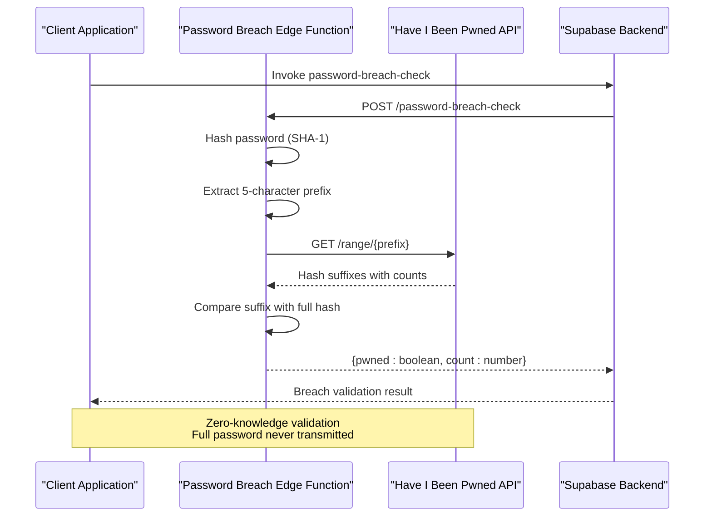
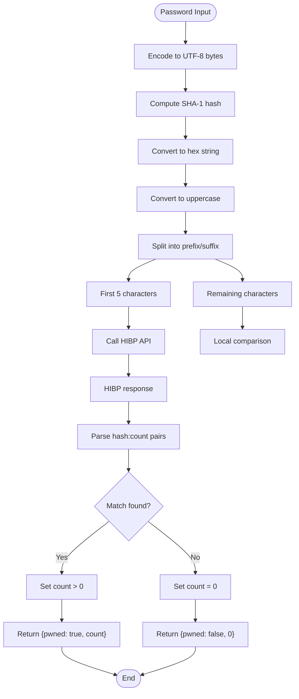
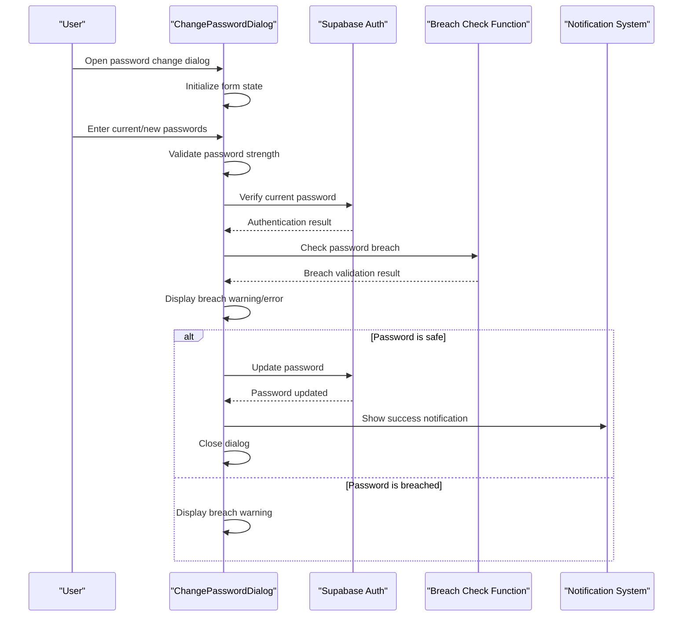
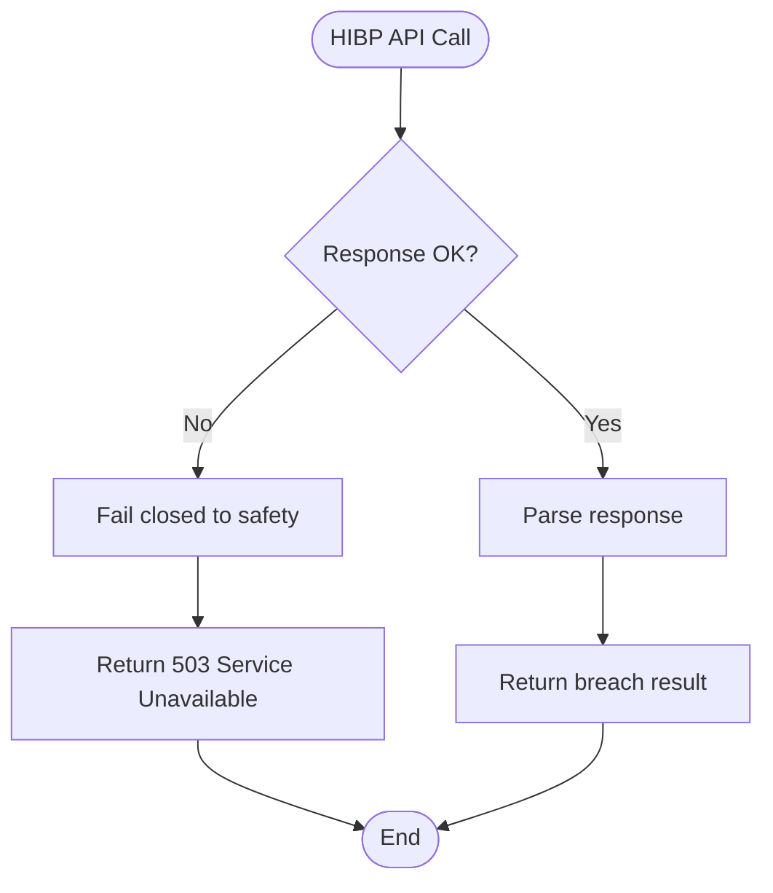
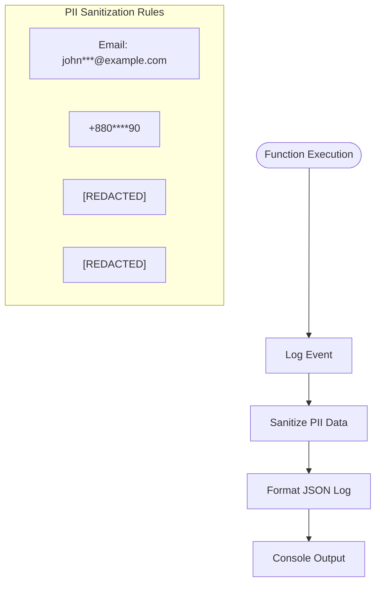

# Password Security Validation

<cite>
**Referenced Files in This Document**
- [supabase/functions/password-breach-check/index.ts](file://supabase/functions/password-breach-check/index.ts)
- [src/components/ChangePasswordDialog.tsx](file://src/components/ChangePasswordDialog.tsx)
- [supabase/config.toml](file://supabase/config.toml)
- [supabase/functions/_shared/logger.ts](file://supabase/functions/_shared/logger.ts)
- [DEPLOYMENT_SUMMARY.md](file://DEPLOYMENT_SUMMARY.md)
</cite>

## Table of Contents
1. [Introduction](#introduction)
2. [System Architecture](#system-architecture)
3. [Edge Function Implementation](#edge-function-implementation)
4. [Client-Side Integration](#client-side-integration)
5. [Security Considerations](#security-considerations)
6. [Error Handling and Resilience](#error-handling-and-resilience)
7. [Deployment Configuration](#deployment-configuration)
8. [Monitoring and Observability](#monitoring-and-observability)
9. [Best Practices](#best-practices)
10. [Troubleshooting Guide](#troubleshooting-guide)

## Introduction

The password breach detection system implements a comprehensive security mechanism using the Have I Been Pwned (HIBP) k-anonymity API to protect user accounts from compromised credentials. This system provides real-time password validation before account modifications, ensuring users cannot set passwords that have been previously exposed in data breaches.

The system operates on a zero-knowledge principle where the full password never leaves the client environment, and only a hashed representation is transmitted to the breach detection service. This approach maintains user privacy while providing robust security validation.

## System Architecture

The password breach detection system consists of two primary components working together to provide secure password validation:



**Diagram sources**
- [supabase/functions/password-breach-check/index.ts](file://supabase/functions/password-breach-check/index.ts#L107-L134)
- [src/components/ChangePasswordDialog.tsx](file://src/components/ChangePasswordDialog.tsx#L68-L76)

### Component Interaction Flow

The system follows a secure, asynchronous communication pattern:

1. **Client Request**: The frontend initiates a password breach check before any password change operation
2. **Edge Function Processing**: The serverless function performs SHA-1 hashing and HIBP API interaction
3. **Zero-Knowledge Transmission**: Only the first 5 characters of the hash are sent to HIBP
4. **Local Comparison**: The function compares the full hash suffix locally against HIBP response
5. **Validation Result**: Returns breach status and exposure count to the client

**Section sources**
- [supabase/functions/password-breach-check/index.ts](file://supabase/functions/password-breach-check/index.ts#L1-L142)
- [src/components/ChangePasswordDialog.tsx](file://src/components/ChangePasswordDialog.tsx#L1-L158)

## Edge Function Implementation

The password breach detection edge function implements the core logic for secure password validation using the HIBP k-anonymity model.

### Request/Response Format

The edge function accepts HTTP POST requests with the following structure:

**Request Format**:
```typescript
{
  "password": string
}
```

**Response Format**:
```typescript
{
  "pwned": boolean,
  "count": number
}
```

Where:
- `pwned`: Indicates whether the password has been exposed in data breaches
- `count`: Number of times the password has been exposed (0 if not breached)

### Core Implementation Details

The edge function implements several critical security and operational features:

#### SHA-1 Hashing Implementation

The function uses native Web Crypto API for SHA-1 hashing with proper encoding:



**Diagram sources**
- [supabase/functions/password-breach-check/index.ts](file://supabase/functions/password-breach-check/index.ts#L22-L29)
- [supabase/functions/password-breach-check/index.ts](file://supabase/functions/password-breach-check/index.ts#L107-L134)

#### CORS Configuration

The function implements comprehensive CORS support with flexible header configuration:

| Header | Value | Purpose |
|--------|-------|---------|
| `Access-Control-Allow-Origin` | `*` | Enables cross-origin requests |
| `Access-Control-Allow-Headers` | `authorization, x-client-info, apikey, content-type` | Permits required authentication headers |

#### Origin Validation

In production environments, the function enforces strict origin validation:

**Allowed Origins**:
- `https://sleekapparels.com` (primary domain)
- `https://www.sleekapparels.com` (www subdomain)
- `http://localhost:5173` (Vite development)
- `http://localhost:3000` (Next.js development)
- `lovableproject.com` (preview domains)
- `lovable.app` (deployed apps)
- `netlify.app` (Netlify deployments)
- `vercel.app` (Vercel deployments)

**Section sources**
- [supabase/functions/password-breach-check/index.ts](file://supabase/functions/password-breach-check/index.ts#L5-L20)
- [supabase/functions/password-breach-check/index.ts](file://supabase/functions/password-breach-check/index.ts#L31-L141)

## Client-Side Integration

The client-side implementation integrates the password breach detection system into the user authentication workflow, providing seamless security validation during password changes.

### ChangePasswordDialog Component

The `ChangePasswordDialog` component orchestrates the entire password change process with integrated breach detection:



**Diagram sources**
- [src/components/ChangePasswordDialog.tsx](file://src/components/ChangePasswordDialog.tsx#L38-L97)

### Password Validation Workflow

The client-side implementation follows a multi-stage validation process:

#### Stage 1: Form Validation
- Minimum 8-character requirement
- At least one uppercase letter
- At least one lowercase letter
- At least one numeric digit
- Password confirmation matching

#### Stage 2: Current Password Verification
The system re-authenticates the user with their current password before proceeding with any changes, preventing unauthorized password modifications.

#### Stage 3: Breach Detection
The system invokes the password breach check function with the proposed new password. The implementation includes graceful fallback behavior:

```typescript
// Graceful fallback for breach check failures
if (breachError) {
  console.error('Breach check error:', breachError);
  // Continue with password change if breach check fails
} else if (breachData?.pwned) {
  setErrors([`This password has been exposed in ${breachData.count.toLocaleString()} data breaches. Please choose a different password.`]);
  return;
}
```

#### Stage 4: Password Update
Only after successful breach detection does the system proceed to update the user's password through Supabase's authentication service.

**Section sources**
- [src/components/ChangePasswordDialog.tsx](file://src/components/ChangePasswordDialog.tsx#L19-L24)
- [src/components/ChangePasswordDialog.tsx](file://src/components/ChangePasswordDialog.tsx#L38-L97)

## Security Considerations

The password breach detection system implements multiple layers of security to protect user data and maintain system integrity.

### Zero-Knowledge Validation

The system adheres to the zero-knowledge principle by ensuring that:

1. **Full Password Never Leaves Client**: The original password remains on the client device
2. **Hash Transmission Only**: Only the SHA-1 hash is transmitted to the edge function
3. **Partial API Exposure**: Only the first 5 characters of the hash are sent to HIBP
4. **Local Processing**: Full hash comparison occurs locally within the edge function

### K-Anonymity Implementation

The system implements HIBP's k-anonymity model effectively:

- **Prefix-Based Lookup**: Only the first 5 characters of the SHA-1 hash are transmitted
- **Suffix Matching**: The complete hash suffix is compared locally against HIBP results
- **No Pattern Recognition**: Attackers cannot correlate requests with specific hashes
- **Privacy Protection**: Multiple hashes share the same prefix, protecting individual users

### Development vs Production Security

The system implements environment-aware security measures:

#### Development Environment
- **Relaxed Origin Policy**: Allows localhost origins for development
- **Flexible CORS**: Enables testing across different development setups
- **Debug Logging**: Provides detailed error information for troubleshooting

#### Production Environment
- **Strict Origin Validation**: Validates against approved production domains
- **Hostname Parsing**: Implements robust URL parsing for security
- **Referer Validation**: Supports referer header validation for additional security
- **Error Sanitization**: Masks sensitive information in production errors

### Authentication Security

The client-side implementation includes additional security measures:

- **Re-authentication Requirement**: Users must verify their current password before changing
- **Token Validation**: Uses Supabase JWT tokens for secure authentication
- **Rate Limiting**: Built-in protection against brute force attacks
- **Input Sanitization**: Validates and sanitizes all user inputs

**Section sources**
- [supabase/functions/password-breach-check/index.ts](file://supabase/functions/password-breach-check/index.ts#L37-L95)
- [src/components/ChangePasswordDialog.tsx](file://src/components/ChangePasswordDialog.tsx#L57-L66)

## Error Handling and Resilience

The system implements comprehensive error handling and resilience mechanisms to ensure reliable operation under various failure conditions.

### HIBP Service Availability

The edge function implements a fail-closed approach when the HIBP service is unavailable:



**Diagram sources**
- [supabase/functions/password-breach-check/index.ts](file://supabase/functions/password-breach-check/index.ts#L111-L118)

### Client-Side Fallback Behavior

The client-side implementation provides graceful degradation:

#### Breach Check Failure
When the breach check service is unavailable, the system continues with password change operations while logging the error:

```typescript
if (breachError) {
  console.error('Breach check error:', breachError);
  // Continue with password change if breach check fails
}
```

#### Network Errors
The system handles network connectivity issues gracefully, providing appropriate user feedback without blocking the authentication flow.

#### Validation Errors
Input validation errors are caught and presented to users in a friendly manner, guiding them toward valid inputs.

### Error Response Codes

| Status Code | Scenario | Client Behavior |
|-------------|----------|-----------------|
| 200 | Successful breach check | Display result to user |
| 400 | Invalid password format | Show validation errors |
| 403 | Unauthorized origin | Log error, prevent access |
| 503 | HIBP service unavailable | Continue with caution |
| 400 | General bad request | Show generic error message |

**Section sources**
- [supabase/functions/password-breach-check/index.ts](file://supabase/functions/password-breach-check/index.ts#L111-L118)
- [src/components/ChangePasswordDialog.tsx](file://src/components/ChangePasswordDialog.tsx#L73-L76)

## Deployment Configuration

The password breach detection system is deployed as a Supabase edge function with specific configuration requirements for optimal performance and security.

### Function Configuration

The edge function is configured in the Supabase configuration file with the following settings:

```toml
[functions.password-breach-check]
verify_jwt = true
```

This configuration ensures that:
- JWT verification is enabled for secure function invocation
- Only authenticated requests can access the breach detection service
- Proper authorization headers are validated

### Environment Variables

The system relies on several environment variables for proper operation:

| Variable | Purpose | Example Value |
|----------|---------|---------------|
| `DENO_ENV` | Environment identification | `production`, `development` |
| `SUPABASE_URL` | Supabase backend endpoint | `https://your-project.supabase.co` |
| `SUPABASE_SERVICE_ROLE_KEY` | Service role authentication | `your-service-key` |

### Deployment Pipeline

The deployment process follows these stages:

1. **Code Compilation**: TypeScript code is compiled to JavaScript
2. **Asset Optimization**: Function assets are optimized for edge deployment
3. **Environment Configuration**: Environment-specific settings are applied
4. **Security Hardening**: CORS and origin validation are configured
5. **Health Checks**: Automated tests verify function availability
6. **Rollback Preparation**: Backup configurations are maintained

**Section sources**
- [supabase/config.toml](file://supabase/config.toml#L1-L73)
- [DEPLOYMENT_SUMMARY.md](file://DEPLOYMENT_SUMMARY.md#L1-L371)

## Monitoring and Observability

The system incorporates comprehensive monitoring and logging capabilities to ensure operational visibility and facilitate troubleshooting.

### Structured Logging

The edge function utilizes a centralized logging system with PII sanitization:



**Diagram sources**
- [supabase/functions/_shared/logger.ts](file://supabase/functions/_shared/logger.ts#L61-L81)

### Log Categories

The logging system categorizes events by severity:

| Level | Purpose | Example Events |
|-------|---------|----------------|
| INFO | Operational events | Function starts, successful validations |
| WARN | Recoverable issues | Breach detected, service timeouts |
| ERROR | Failures and exceptions | API errors, validation failures |
| SUCCESS | Completed operations | Password changes, successful checks |

### Performance Metrics

Key metrics tracked for monitoring:

- **Response Times**: Average time for breach validation
- **Success Rates**: Percentage of successful breach checks
- **Error Rates**: Frequency of various error types
- **API Availability**: HIBP service uptime and response times
- **User Impact**: Number of blocked weak passwords

### Alerting Thresholds

Recommended alerting thresholds:

- **Response Time**: >500ms average response time
- **Error Rate**: >5% error rate in breach checks
- **Availability**: <99% API availability
- **Breached Passwords**: >10% of password changes being breached

**Section sources**
- [supabase/functions/_shared/logger.ts](file://supabase/functions/_shared/logger.ts#L1-L173)

## Best Practices

### Implementation Guidelines

#### Edge Function Development
- **Stateless Design**: Functions should be stateless for scalability
- **Error Handling**: Implement comprehensive error catching and logging
- **Resource Management**: Minimize memory usage and execution time
- **Security Headers**: Always include appropriate CORS and security headers

#### Client-Side Integration
- **Graceful Degradation**: Handle service failures without blocking user experience
- **User Feedback**: Provide clear, actionable error messages
- **Loading States**: Implement appropriate loading indicators
- **Validation Timing**: Perform client-side validation before server calls

#### Security Practices
- **Zero-Knowledge Principle**: Never transmit full passwords to external services
- **Input Validation**: Validate all inputs on both client and server sides
- **Rate Limiting**: Implement rate limiting to prevent abuse
- **Environment Awareness**: Adapt security policies based on environment

### Performance Optimization

#### Caching Strategies
- **Hash Caching**: Consider caching frequently checked password hashes
- **Response Caching**: Implement appropriate caching headers for successful responses
- **CDN Integration**: Use CDN for edge function distribution

#### Network Optimization
- **Compression**: Enable Brotli compression for function responses
- **Connection Pooling**: Reuse HTTP connections where possible
- **Timeout Configuration**: Set appropriate timeout values for external API calls

### Maintenance Procedures

#### Regular Updates
- **HIBP API Changes**: Monitor for API version updates
- **Security Patches**: Apply security updates promptly
- **Performance Tuning**: Optimize based on usage patterns

#### Monitoring Maintenance
- **Log Retention**: Implement appropriate log rotation policies
- **Metric Collection**: Continuously improve monitoring coverage
- **Alert Tuning**: Adjust alert thresholds based on historical data

## Troubleshooting Guide

### Common Issues and Solutions

#### Function Invocation Failures

**Symptom**: Client receives 400 or 500 errors from breach check function
**Causes**: 
- Invalid password format
- Network connectivity issues
- Function misconfiguration

**Solutions**:
1. Verify password meets minimum requirements (≥8 characters)
2. Check network connectivity to Supabase and HIBP APIs
3. Review function logs for specific error messages
4. Validate function configuration in Supabase dashboard

#### HIBP Service Unavailability

**Symptom**: 503 Service Unavailable responses
**Causes**:
- HIBP API downtime
- Network routing issues
- Rate limiting

**Solutions**:
1. Implement exponential backoff retry logic
2. Monitor HIBP service status
3. Consider alternative breach detection services
4. Review rate limiting policies

#### Origin Validation Errors

**Symptom**: 403 Forbidden responses in production
**Causes**:
- Incorrect origin configuration
- Development environment mismatch
- DNS resolution issues

**Solutions**:
1. Verify allowed origins in function configuration
2. Check environment variable settings
3. Validate DNS records for production domains
4. Test with different browser configurations

#### Client-Side Integration Issues

**Symptom**: Breach check not triggering or failing silently
**Causes**:
- Incorrect function invocation syntax
- Missing error handling
- Authentication issues

**Solutions**:
1. Verify function name matches exactly
2. Implement comprehensive error handling
3. Check Supabase authentication status
4. Review browser console for JavaScript errors

### Diagnostic Tools

#### Browser Developer Tools
- **Network Tab**: Monitor function invocation requests
- **Console Tab**: View error messages and warnings
- **Application Tab**: Inspect cookies and localStorage

#### Supabase Dashboard
- **Functions Logs**: Review function execution logs
- **Analytics**: Monitor function performance metrics
- **Settings**: Verify function configuration

#### Server-Side Monitoring
- **Edge Function Logs**: Access detailed execution logs
- **Metrics Dashboard**: Monitor response times and error rates
- **Alerts**: Set up notifications for critical issues

**Section sources**
- [supabase/functions/password-breach-check/index.ts](file://supabase/functions/password-breach-check/index.ts#L135-L140)
- [src/components/ChangePasswordDialog.tsx](file://src/components/ChangePasswordDialog.tsx#L73-L76)