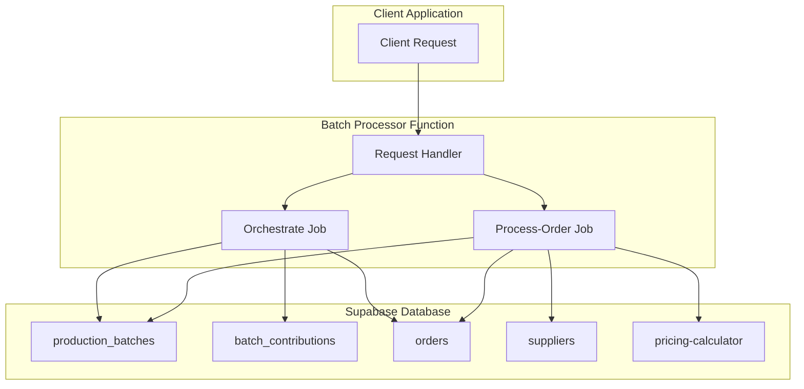
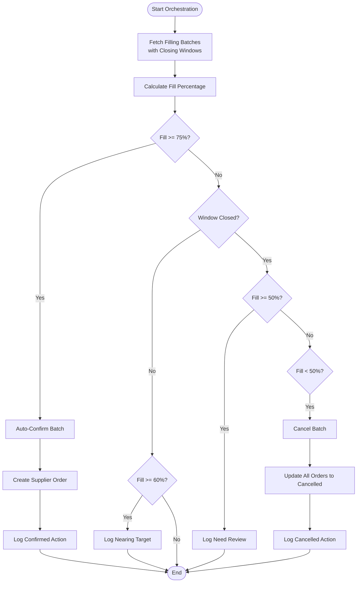
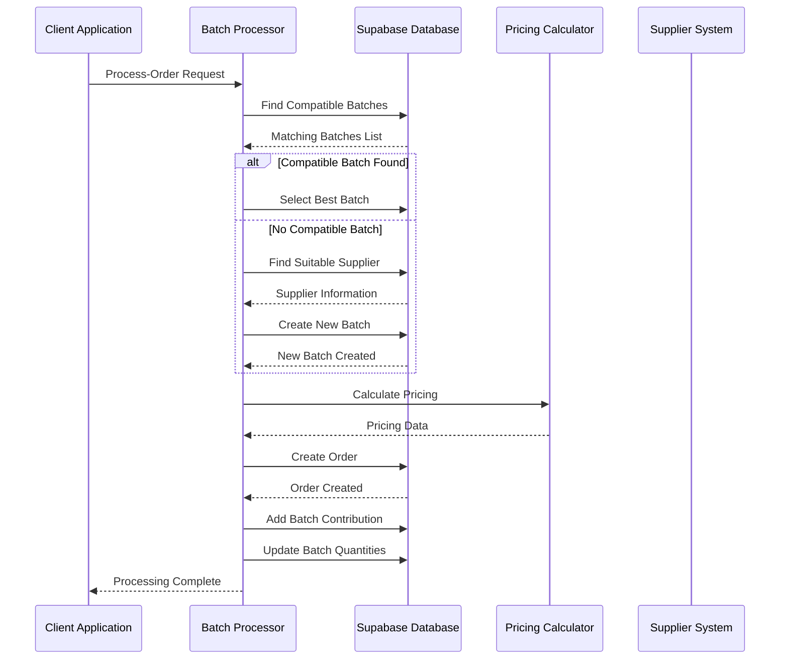

# Batch Processor API

<cite>
**Referenced Files in This Document**
- [index.ts](file://supabase/functions/batch-processor/index.ts)
- [useAggregation.ts](file://src/hooks/useAggregation.ts)
- [client.ts](file://src/integrations/supabase/client.ts)
- [supabaseHelpers.ts](file://src/lib/supabaseHelpers.ts)
- [bangladeshManufacturing.ts](file://src/lib/bangladeshManufacturing.ts)
</cite>

## Table of Contents
1. [Introduction](#introduction)
2. [API Overview](#api-overview)
3. [Job Types](#job-types)
4. [Request Format](#request-format)
5. [Response Structures](#response-structures)
6. [Orchestrate Job Type](#orchestrate-job-type)
7. [Process-Order Job Type](#process-order-job-type)
8. [Supabase Client Configuration](#supabase-client-configuration)
9. [Integration Examples](#integration-examples)
10. [Error Handling](#error-handling)
11. [Performance Considerations](#performance-considerations)

## Introduction

The Batch Processor is a serverless function that manages production batch operations for the Sleek Apparels platform. It handles two primary job types: 'orchestrate' for batch management and 'process-order' for order processing. The function automates batch filling logic, supplier assignment, pricing calculations, and order fulfillment while maintaining optimal production efficiency.

## API Overview

The Batch Processor API is built as a Deno-based serverless function that accepts JSON requests with a job type specification. It integrates with Supabase for database operations and utilizes the pricing-calculator function for dynamic pricing calculations.



**Diagram sources**
- [index.ts](file://supabase/functions/batch-processor/index.ts#L29-L55)
- [index.ts](file://supabase/functions/batch-processor/index.ts#L58-L176)
- [index.ts](file://supabase/functions/batch-processor/index.ts#L178-L343)

## Job Types

The Batch Processor supports two distinct job types, each serving different operational needs:

### Job Type Definitions

| Job Type | Purpose | Trigger | Frequency |
|----------|---------|---------|-----------|
| `orchestrate` | Batch management and status updates | Scheduled/Manual | Daily/Weekly |
| `process-order` | Order processing and batch assignment | User Order Placement | Real-time |

**Section sources**
- [index.ts](file://supabase/functions/batch-processor/index.ts#L9-L10)

## Request Format

All requests to the Batch Processor must follow a standardized JSON format with job type specification and data payload.

### Base Request Structure

```typescript
interface BatchProcessorRequest {
  jobType: JobType;
  data?: OrchestrationData | OrderProcessingData;
}

type JobType = 'orchestrate' | 'process-order';
```

### Orchestrate Job Request

```json
{
  "jobType": "orchestrate",
  "data": {}
}
```

### Process-Order Job Request

```json
{
  "jobType": "process-order",
  "data": {
    "productCategory": "t-shirts",
    "productVariantBase": "cotton",
    "quantity": 100,
    "styleDetails": {
      "variant": "blue",
      "size": "M",
      "print": "logo"
    },
    "buyerId": "user-123"
  }
}
```

**Section sources**
- [index.ts](file://supabase/functions/batch-processor/index.ts#L12-L27)

## Response Structures

### Common Response Headers

All responses include CORS headers for cross-origin requests:

```typescript
const corsHeaders = {
  'Access-Control-Allow-Origin': '*',
  'Access-Control-Allow-Headers': 'authorization, x-client-info, apikey, content-type'
};
```

### Orchestrate Job Response

```json
{
  "success": true,
  "processed": 5,
  "results": [
    {
      "batchId": "batch-123",
      "action": "confirmed",
      "fillPercentage": 78.5
    },
    {
      "batchId": "batch-456",
      "action": "needs_review",
      "fillPercentage": 65.2,
      "message": "Batch 50-75% filled, window closed"
    },
    {
      "batchId": "batch-789",
      "action": "cancelled",
      "fillPercentage": 45.0,
      "ordersCancelled": 3
    }
  ]
}
```

### Process-Order Job Response

```json
{
  "success": true,
  "orderId": "order-abc123",
  "batchId": "batch-def456",
  "isNewBatch": false,
  "pricing": {
    "unitPrice": 12.5,
    "totalPrice": 1250.0,
    "breakdown": {
      "basePrice": 10.0,
      "fabricMultiplier": 1.2,
      "complexityMultiplier": 1.1,
      "volumeDiscount": 0.05
    }
  },
  "batchFillPercentage": 62.5
}
```

**Section sources**
- [index.ts](file://supabase/functions/batch-processor/index.ts#L168-L175)
- [index.ts](file://supabase/functions/batch-processor/index.ts#L332-L342)

## Orchestrate Job Type

The Orchestrate job manages batch lifecycle operations, automatically handling batch statuses based on fill percentages and timing constraints.

### Batch Status Management Logic



**Diagram sources**
- [index.ts](file://supabase/functions/batch-processor/index.ts#L58-L176)

### Orchestrate Logic Details

The orchestrate job implements sophisticated batch management rules:

#### Auto-Confirmation Logic (≥75% Fill)
- **Condition**: Batch fill percentage ≥ 75%
- **Action**: Automatically confirm batch and create supplier order
- **Effect**: Batch moves to 'confirmed' status with immediate production start
- **Supplier Order**: Created with batch target quantity and unit price

#### Administrative Review Logic (50-74% Fill)
- **Condition**: Batch fill percentage between 50% and 75%
- **Action**: Flag for administrative review
- **Reason**: Window closed but insufficient fill for automatic completion
- **Outcome**: Requires manual intervention for decision

#### Automatic Cancellation Logic (<50% Fill)
- **Condition**: Batch fill percentage < 50%
- **Action**: Cancel batch and refund all contributing orders
- **Effect**: Orders marked as 'cancelled', funds returned to buyers
- **Cleanup**: Removes batch from production pipeline

#### Proactive Monitoring (≥60% Fill)
- **Condition**: Batch fill percentage ≥ 60%
- **Action**: Log for monitoring purposes
- **Purpose**: Track batches approaching target for promotional consideration

**Section sources**
- [index.ts](file://supabase/functions/batch-processor/index.ts#L58-L176)

## Process-Order Job Type

The Process-Order job handles individual order processing with intelligent batch assignment and pricing calculation.

### Order Processing Workflow



**Diagram sources**
- [index.ts](file://supabase/functions/batch-processor/index.ts#L178-L343)

### Process-Order Detailed Steps

#### Step 1: Batch Compatibility Search
- **Query**: Find existing batches with compatible product category
- **Filters**: 
  - Same product category
  - Current status: 'filling'
  - Style count < 4 (max styles limit)
  - Target quantity ≥ requested quantity
  - Sort by current quantity (descending)

#### Step 2: Style Compatibility Validation
- **Check**: Verify new style won't exceed max styles limit
- **Logic**: Count existing styles vs. max allowed styles
- **Constraint**: Cannot exceed supplier's max_styles_allowed

#### Step 3: Supplier Selection (New Batch Creation)
- **Criteria**: Find supplier with active MOU terms
- **Filter**: MOQ per batch ≥ requested quantity
- **Sort**: Lowest base price first
- **Lead Time**: Calculate estimated start date

#### Step 4: Pricing Calculation
- **Function**: Invokes 'pricing-calculator' function
- **Parameters**: Batch ID, quantity, style details
- **Output**: Unit price, total price, pricing breakdown

#### Step 5: Order Creation
- **Fields**: Buyer ID, product type, quantity, pricing, workflow status
- **Status**: Initially set to 'payment_pending'

#### Step 6: Batch Contribution Tracking
- **Record**: Link order to batch with contribution details
- **Update**: Increment batch quantities and style counts
- **Validation**: Ensure contribution fits within batch limits

**Section sources**
- [index.ts](file://supabase/functions/batch-processor/index.ts#L178-L343)

## Supabase Client Configuration

The Batch Processor uses different Supabase client configurations based on job type requirements.

### Service Role Client (Orchestrate Job)
```typescript
const supabase = createClient(
  Deno.env.get('SUPABASE_URL') ?? '',
  Deno.env.get('SUPABASE_SERVICE_ROLE_KEY') ?? ''
);
```

**Characteristics:**
- Full database access with service role privileges
- Can modify batch statuses, create supplier orders
- Used for administrative operations requiring elevated permissions

### Anonymous Client (Process-Order Job)
```typescript
const supabase = createClient(
  Deno.env.get('SUPABASE_URL') ?? '',
  Deno.env.get('SUPABASE_ANON_KEY') ?? '',
  {
    global: {
      headers: { Authorization: req.headers.get('Authorization')! },
    },
  }
);
```

**Characteristics:**
- Limited to authenticated user operations
- Uses client-side authentication headers
- Suitable for user-initiated order processing

### Environment Variable Security

The function relies on secure environment variable handling:

| Variable | Purpose | Access Level |
|----------|---------|--------------|
| `SUPABASE_URL` | Database connection URL | Public |
| `SUPABASE_SERVICE_ROLE_KEY` | Admin database access | Secret |
| `SUPABASE_ANON_KEY` | Client access key | Public |

**Section sources**
- [index.ts](file://supabase/functions/batch-processor/index.ts#L59-L62)
- [index.ts](file://supabase/functions/batch-processor/index.ts#L179-L187)

## Integration Examples

### Frontend Integration Example

Using the React hook for batch processing:

```typescript
import { useCreateAggregatedOrder } from '@/hooks/useAggregation';

const OrderPlacementComponent = () => {
  const createOrder = useCreateAggregatedOrder();
  
  const handlePlaceOrder = async () => {
    try {
      const result = await createOrder.mutateAsync({
        productCategory: 't-shirts',
        productVariantBase: 'cotton',
        quantity: 100,
        styleDetails: {
          variant: 'blue',
          size: 'M',
          print: 'logo'
        }
      });
      
      console.log('Order placed:', result);
    } catch (error) {
      console.error('Failed to place order:', error);
    }
  };
  
  return (
    <button onClick={handlePlaceOrder}>
      Place Order
    </button>
  );
};
```

### Direct API Invocation Example

```javascript
const batchProcessorUrl = 'https://your-supabase-url/functions/v1/batch-processor';

const processOrder = async (orderData) => {
  const response = await fetch(batchProcessorUrl, {
    method: 'POST',
    headers: {
      'Content-Type': 'application/json',
    },
    body: JSON.stringify({
      jobType: 'process-order',
      data: {
        ...orderData,
        buyerId: 'user-123'
      }
    })
  });
  
  const result = await response.json();
  return result;
};
```

**Section sources**
- [useAggregation.ts](file://src/hooks/useAggregation.ts#L78-L117)

## Error Handling

The Batch Processor implements comprehensive error handling for robust operation.

### Error Response Format

```json
{
  "error": "Specific error message describing the issue"
}
```

### Common Error Scenarios

| Error Type | HTTP Status | Cause | Resolution |
|------------|-------------|-------|------------|
| Invalid Job Type | 400 | Unsupported jobType value | Use 'orchestrate' or 'process-order' |
| Missing Parameters | 400 | Required data missing | Ensure complete request payload |
| Database Error | 500 | Supabase query failure | Check database connectivity |
| Pricing Calculation | 500 | Pricing function unavailable | Retry request or check pricing service |
| Supplier Not Found | 500 | No suitable supplier available | Verify supplier configuration |

### Error Logging

The function logs detailed error information for debugging:

```typescript
console.error('Error in batch-processor:', error);
const errorMessage = error instanceof Error ? error.message : 'Unknown error';
```

**Section sources**
- [index.ts](file://supabase/functions/batch-processor/index.ts#L48-L55)

## Performance Considerations

### Batch Processing Optimization

- **Parallel Processing**: Individual batch operations are processed sequentially within each job
- **Database Queries**: Efficient filtering reduces unnecessary data transfer
- **Memory Usage**: Streaming batch processing prevents memory overflow

### Scalability Features

- **Serverless Architecture**: Auto-scaling based on demand
- **Stateless Design**: No session persistence, reducing resource consumption
- **CORS Support**: Enables cross-domain client access

### Monitoring and Metrics

The function provides operational insights through logging:

- **Batch Processing Count**: Number of batches processed per orchestrate run
- **Fill Percentages**: Distribution of batch fill rates
- **Action Outcomes**: Success/failure rates for different operations

**Section sources**
- [index.ts](file://supabase/functions/batch-processor/index.ts#L166-L167)