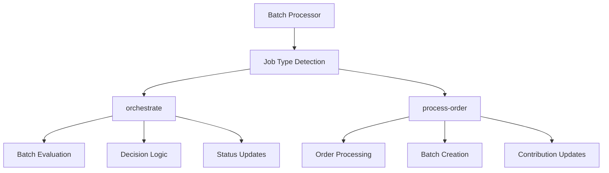
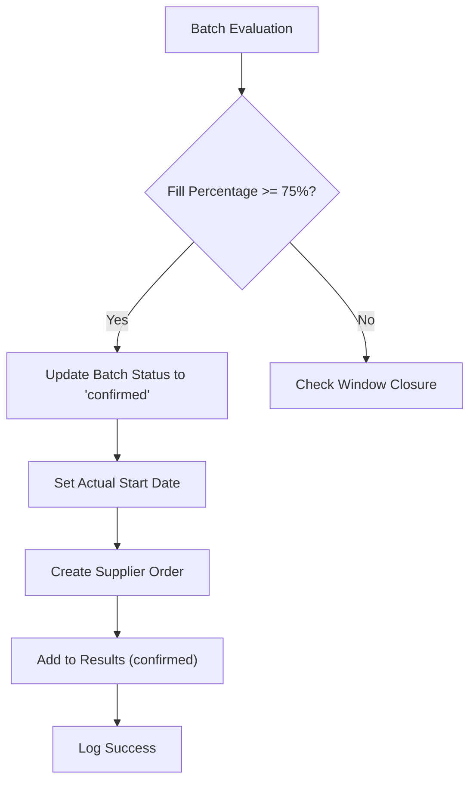
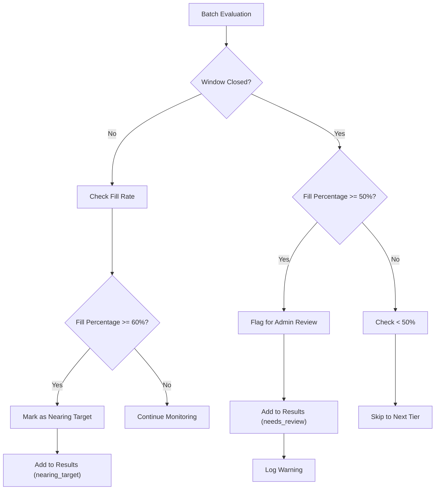
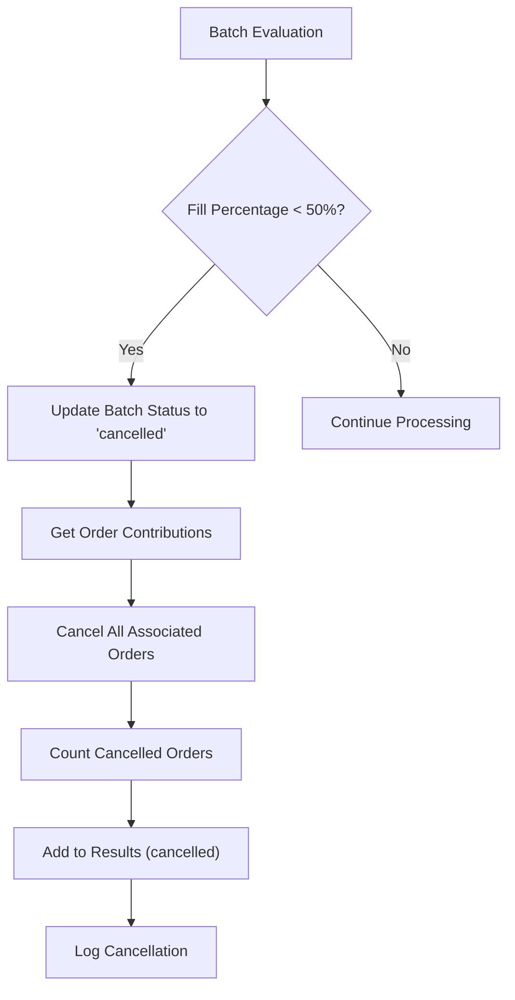
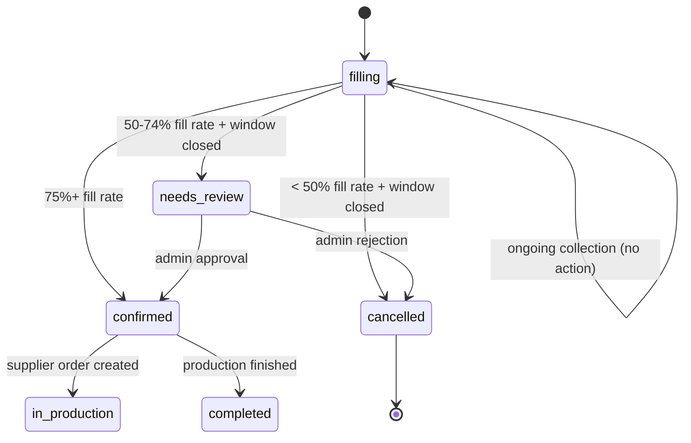
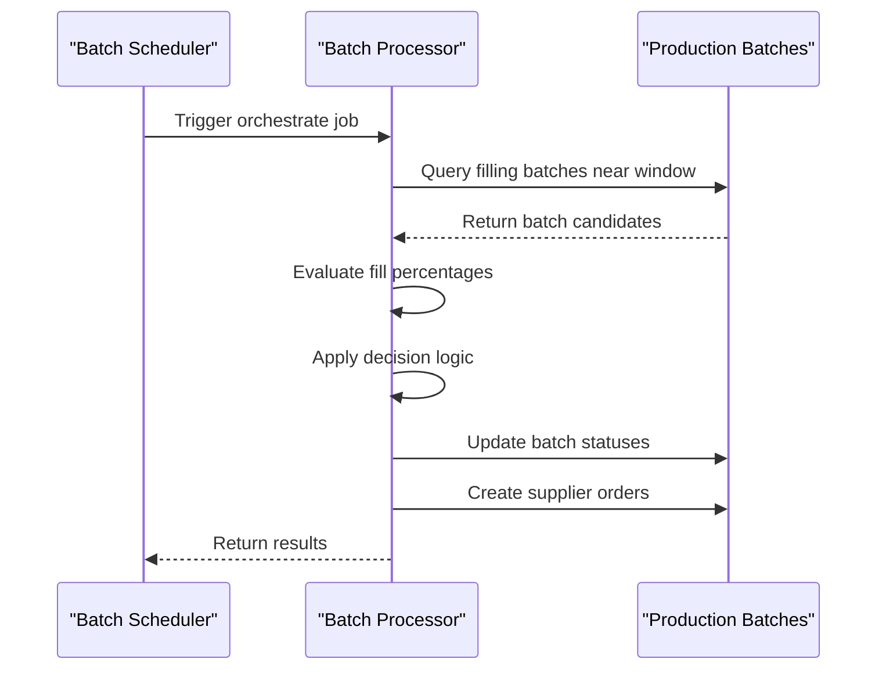
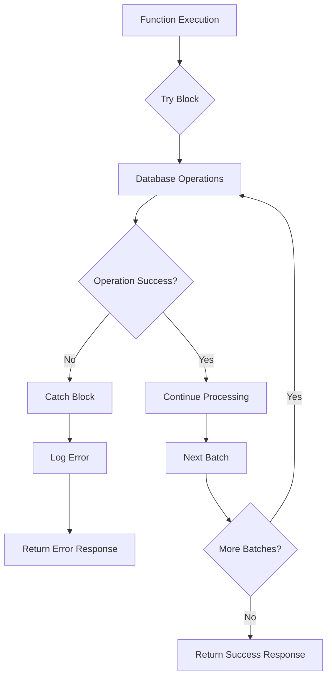
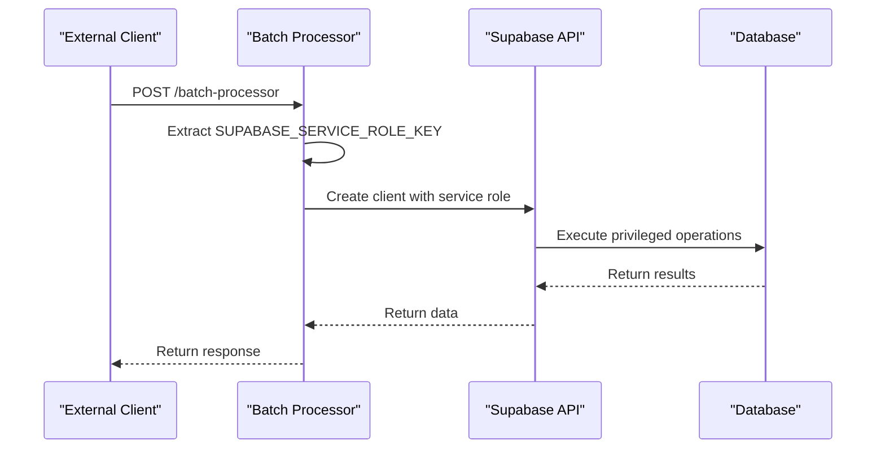

# Orchestrate Job API Documentation

<cite>
**Referenced Files in This Document**
- [index.ts](file://supabase/functions/batch-processor/index.ts)
- [logger.ts](file://supabase/functions/_shared/logger.ts)
- [config.toml](file://supabase/config.toml)
- [production_batches table schema](file://supabase/migrations/20251115150759_remix_migration_from_pg_dump.sql)
- [supplier_orders table schema](file://supabase/FIXED_SETUP_PART1.sql)
- [batch_contributions table schema](file://supabase/FIXED_SETUP_PART1.sql)
</cite>

## Table of Contents
1. [Introduction](#introduction)
2. [Job Type Overview](#job-type-overview)
3. [Request Format](#request-format)
4. [Response Structure](#response-structure)
5. [Three-Tier Decision System](#three-tier-decision-system)
6. [Batch Status Management](#batch-status-management)
7. [Integration with Batch Lifecycle](#integration-with-batch-lifecycle)
8. [Error Handling and Logging](#error-handling-and-logging)
9. [Security and Authentication](#security-and-authentication)
10. [Examples](#examples)
11. [Troubleshooting](#troubleshooting)

## Introduction

The 'orchestrate' job type is a critical serverless function within the batch-processor system that manages production batch lifecycle decisions. This function evaluates batches in 'filling' status that are nearing their window closure deadlines and applies intelligent automation rules to optimize production efficiency while minimizing risk.

The orchestration system operates on a three-tier decision framework that automatically handles different scenarios based on fill percentages and window closure timing, ensuring optimal resource utilization and customer satisfaction.

## Job Type Overview

The batch-processor supports two primary job types, with 'orchestrate' being specifically designed for automated batch lifecycle management:



**Diagram sources**
- [index.ts](file://supabase/functions/batch-processor/index.ts#L10-L11)
- [index.ts](file://supabase/functions/batch-processor/index.ts#L37-L42)

**Section sources**
- [index.ts](file://supabase/functions/batch-processor/index.ts#L10-L11)
- [index.ts](file://supabase/functions/batch-processor/index.ts#L37-L42)

## Request Format

The 'orchestrate' job accepts a simple JSON payload with no data requirements:

```json
{
  "jobType": "orchestrate"
}
```

### Request Structure

| Parameter | Type | Required | Description |
|-----------|------|----------|-------------|
| `jobType` | string | Yes | Must be set to "orchestrate" |
| `data` | object | No | Not used for orchestration jobs |

### Endpoint Configuration

The function supports CORS and expects JSON content type:

- **Method**: POST
- **Content-Type**: application/json
- **CORS Headers**: Access-Control-Allow-Origin: *
- **Authentication**: Uses Supabase service role key for elevated privileges

**Section sources**
- [index.ts](file://supabase/functions/batch-processor/index.ts#L12-L19)
- [index.ts](file://supabase/functions/batch-processor/index.ts#L4-L7)

## Response Structure

The orchestration function returns a structured response indicating the results of batch evaluations:

```json
{
  "success": true,
  "processed": 3,
  "results": [
    {
      "batchId": "uuid-string",
      "action": "confirmed",
      "fillPercentage": 78.5
    },
    {
      "batchId": "uuid-string",
      "action": "needs_review",
      "fillPercentage": 65.2,
      "message": "Batch 50-75% filled, window closed"
    },
    {
      "batchId": "uuid-string",
      "action": "cancelled",
      "fillPercentage": 45.0,
      "ordersCancelled": 12
    }
  ]
}
```

### Response Fields

| Field | Type | Description |
|-------|------|-------------|
| `success` | boolean | Indicates successful processing |
| `processed` | number | Total number of batches evaluated |
| `results` | array | Array of individual batch results |

### Individual Result Actions

Each batch result contains one of four possible actions:

| Action | Description | Additional Fields |
|--------|-------------|-------------------|
| `confirmed` | Batch meets 75% threshold and auto-completed | `fillPercentage` |
| `needs_review` | Batch 50-75% filled, window closed, requires admin intervention | `fillPercentage`, `message` |
| `cancelled` | Batch below 50% fill rate, cancelled with order refunds | `fillPercentage`, `ordersCancelled` |
| `nearing_target` | Batch approaching 60% fill rate, potential for promotion | `fillPercentage`, `message` |

**Section sources**
- [index.ts](file://supabase/functions/batch-processor/index.ts#L168-L175)
- [index.ts](file://supabase/functions/batch-processor/index.ts#L107-L111)
- [index.ts](file://supabase/functions/batch-processor/index.ts#L122-L127)
- [index.ts](file://supabase/functions/batch-processor/index.ts#L144-L149)
- [index.ts](file://supabase/functions/batch-processor/index.ts#L157-L162)

## Three-Tier Decision System

The orchestration function implements a sophisticated three-tier decision system that handles different batch scenarios based on fill percentage thresholds and window closure timing.

### Tier 1: Auto-Confirmation (75%+ Fill Rate)

Batches reaching 75% or higher fill rate are automatically confirmed and moved to production:



**Diagram sources**
- [index.ts](file://supabase/functions/batch-processor/index.ts#L83-L114)

#### Auto-Confirmation Process

1. **Status Update**: Changes batch status from 'filling' to 'confirmed'
2. **Start Date**: Records actual start date for production scheduling
3. **Supplier Order Creation**: Generates pending supplier order with full target quantity
4. **Result Recording**: Adds confirmed batch to processing results

### Tier 2: Admin Review (50-74% Fill Rate)

Batches with 50-74% fill rate that reach window closure require administrative review:



**Diagram sources**
- [index.ts](file://supabase/functions/batch-processor/index.ts#L116-L127)
- [index.ts](file://supabase/functions/batch-processor/index.ts#L155-L162)

#### Admin Review Criteria

- **Fill Range**: 50-74% filled
- **Timing**: Window closure reached
- **Outcome**: Flagged for manual administrator review
- **Message**: "Batch 50-75% filled, window closed"

### Tier 3: Cancellation (Below 50% Fill Rate)

Batches with less than 50% fill rate upon window closure are automatically cancelled:



**Diagram sources**
- [index.ts](file://supabase/functions/batch-processor/index.ts#L129-L153)

#### Cancellation Process

1. **Batch Status**: Updates to 'cancelled' status
2. **Order Cancellation**: Cancels all contributing orders
3. **Refund Processing**: Initiates order cancellation with refund preparation
4. **Statistics**: Tracks number of orders affected

### Additional Monitoring Tier

Batches approaching significant fill milestones receive monitoring notifications:

- **Threshold**: 60% fill rate
- **Condition**: Still within window
- **Action**: Logged as "nearing target" for potential promotion consideration
- **Message**: "Batch nearing target - consider promotion"

**Section sources**
- [index.ts](file://supabase/functions/batch-processor/index.ts#L83-L114)
- [index.ts](file://supabase/functions/batch-processor/index.ts#L116-L127)
- [index.ts](file://supabase/functions/batch-processor/index.ts#L129-L153)
- [index.ts](file://supabase/functions/batch-processor/index.ts#L155-L162)

## Batch Status Management

The orchestration function interacts with the production batch lifecycle through strategic status transitions:

### Current Status: 'filling'

Batches in 'filling' status are actively collecting contributions from orders and awaiting window closure.

### Status Transitions



**Diagram sources**
- [index.ts](file://supabase/functions/batch-processor/index.ts#L87-L91)
- [index.ts](file://supabase/functions/batch-processor/index.ts#L133-L134)
- [index.ts](file://supabase/functions/batch-processor/index.ts#L119-L127)

### Database Operations

The function performs several key database operations with elevated privileges:

1. **Batch Updates**: Modify batch status and timestamps
2. **Supplier Order Creation**: Generate production orders for confirmed batches
3. **Order Status Updates**: Cancel orders associated with cancelled batches

**Section sources**
- [index.ts](file://supabase/functions/batch-processor/index.ts#L87-L91)
- [index.ts](file://supabase/functions/batch-processor/index.ts#L133-L134)
- [index.ts](file://supabase/functions/batch-processor/index.ts#L140-L142)

## Integration with Batch Lifecycle

The orchestration function serves as a critical component in the overall batch lifecycle management system:

### Pre-Orchestration Phase

Before orchestration runs, the system identifies batches requiring attention:



**Diagram sources**
- [index.ts](file://supabase/functions/batch-processor/index.ts#L66-L72)
- [index.ts](file://supabase/functions/batch-processor/index.ts#L83-L114)

### Post-Orchestration Impact

Successful orchestration triggers downstream effects:

1. **Supplier Order Generation**: Confirmed batches immediately trigger supplier production orders
2. **Order Refunds**: Cancelled batches initiate refund processing for contributing buyers
3. **Admin Notifications**: Batches requiring review trigger administrative alerts
4. **Production Planning**: Confirmed batches update production scheduling systems

### Data Relationships

The orchestration function leverages several database relationships:

- **production_batches** ↔ **batch_contributions**: Links batches to contributing orders
- **production_batches** ↔ **supplier_orders**: Connects batches to supplier production orders
- **batch_contributions** ↔ **orders**: Tracks individual order contributions to batches

**Section sources**
- [index.ts](file://supabase/functions/batch-processor/index.ts#L66-L72)
- [index.ts](file://supabase/functions/batch-processor/index.ts#L138-L142)
- [index.ts](file://supabase/functions/batch-processor/index.ts#L95-L105)

## Error Handling and Logging

The orchestration function implements comprehensive error handling and logging mechanisms:

### Error Handling Strategy



**Diagram sources**
- [index.ts](file://supabase/functions/batch-processor/index.ts#L34-L55)

### Logging Implementation

The function uses structured logging with PII sanitization:

#### Log Levels and Usage

| Level | Purpose | Example |
|-------|---------|---------|
| INFO | General processing steps | "Processing batch {id}: {percentage}% filled" |
| WARN | Recoverable issues | "Batch {id} at {percentage}% - needs admin review" |
| ERROR | Failures and exceptions | Database connection errors, constraint violations |
| SUCCESS | Completed operations | "Batch {id} auto-confirmed" |

#### PII Sanitization

Sensitive data is automatically sanitized in logs:

- **Email Addresses**: `john.doe@example.com` → `joh***@example.com`
- **Phone Numbers**: `+8801234567890` → `+880****90`
- **Order IDs**: `550e8400-e29b-41d4-a716-446655440000` → `550e8400-****`

### Error Response Format

Failed requests return standardized error responses:

```json
{
  "error": "Database connection failed",
  "timestamp": "2024-01-15T10:30:00.000Z"
}
```

**Section sources**
- [index.ts](file://supabase/functions/batch-processor/index.ts#L34-L55)
- [logger.ts](file://supabase/functions/_shared/logger.ts#L1-L173)

## Security and Authentication

The orchestration function operates with elevated privileges through the Supabase service role key:

### Service Role Key Usage



**Diagram sources**
- [index.ts](file://supabase/functions/batch-processor/index.ts#L59-L62)

### Privilege Levels

The service role key provides:

- **Bypasses Row-Level Security (RLS)**: Direct database access without permission checks
- **Full CRUD Operations**: Complete read/write access to production data
- **Administrative Functions**: Ability to modify critical business logic data

### Security Considerations

1. **Environment Isolation**: Service role key stored securely in environment variables
2. **Limited Scope**: Function operates only on batch processing logic
3. **Audit Trail**: All operations logged with timestamps and user context
4. **Rate Limiting**: Built-in CORS protection prevents abuse

### Configuration Requirements

The function requires the following environment variables:

- `SUPABASE_URL`: Supabase project URL
- `SUPABASE_SERVICE_ROLE_KEY`: Secret service role key for elevated access

**Section sources**
- [index.ts](file://supabase/functions/batch-processor/index.ts#L59-L62)
- [config.toml](file://supabase/config.toml#L1-L73)

## Examples

### Successful Orchestration Response - Auto-Confirmation

```json
{
  "success": true,
  "processed": 1,
  "results": [
    {
      "batchId": "550e8400-e29b-41d4-a716-446655440000",
      "action": "confirmed",
      "fillPercentage": 78.5
    }
  ]
}
```

**Processing Details:**
- Batch ID: `550e8400-e29b-41d4-a716-446655440000`
- Fill Percentage: 78.5%
- Action: Auto-confirmed
- Outcome: Supplier order created, production initiated

### Successful Orchestration Response - Admin Review Required

```json
{
  "success": true,
  "processed": 1,
  "results": [
    {
      "batchId": "661f9522-f3a5-4b4e-8c2d-112233445566",
      "action": "needs_review",
      "fillPercentage": 65.2,
      "message": "Batch 50-75% filled, window closed"
    }
  ]
}
```

**Processing Details:**
- Batch ID: `661f9522-f3a5-4b4e-8c2d-112233445566`
- Fill Percentage: 65.2%
- Action: Needs admin review
- Message: Indicates window closure and partial fill
- Outcome: Administrative intervention required

### Successful Orchestration Response - Batch Cancellation

```json
{
  "success": true,
  "processed": 1,
  "results": [
    {
      "batchId": "772g8400-e29b-41d4-a716-446655440000",
      "action": "cancelled",
      "fillPercentage": 45.0,
      "ordersCancelled": 12
    }
  ]
}
```

**Processing Details:**
- Batch ID: `772g8400-e29b-41d4-a716-446655440000`
- Fill Percentage: 45.0%
- Action: Cancelled
- Orders Cancelled: 12
- Outcome: Refund processing initiated for all contributing orders

### Successful Orchestration Response - Near Target Threshold

```json
{
  "success": true,
  "processed": 1,
  "results": [
    {
      "batchId": "883e8400-e29b-41d4-a716-446655440000",
      "action": "nearing_target",
      "fillPercentage": 62.5,
      "message": "Batch nearing target - consider promotion"
    }
  ]
}
```

**Processing Details:**
- Batch ID: `883e8400-e29b-41d4-a716-446655440000`
- Fill Percentage: 62.5%
- Action: Nearing target
- Message: Indicates potential for promotional consideration
- Outcome: Monitored for possible early production initiation

## Troubleshooting

### Common Issues and Solutions

#### Issue: Function Returns Empty Results

**Symptoms**: Orchestration completes but returns empty results array

**Possible Causes**:
- No batches in 'filling' status
- All batches outside window closure criteria
- Database connectivity issues

**Solutions**:
1. Verify batch records exist with appropriate status
2. Check window closure timestamps
3. Validate database connection parameters

#### Issue: Database Operation Failures

**Symptoms**: Error responses with database-related messages

**Possible Causes**:
- Constraint violations
- Permission issues
- Network connectivity problems

**Solutions**:
1. Review database logs for specific constraint errors
2. Verify service role key permissions
3. Check network connectivity to Supabase

#### Issue: Unexpected Batch Actions

**Symptoms**: Batches receiving incorrect actions (e.g., confirmation when they shouldn't be)

**Possible Causes**:
- Incorrect fill percentage calculations
- Timing issues with window closures
- Data inconsistencies

**Solutions**:
1. Verify batch quantity and target calculations
2. Check timezone handling for window closure dates
3. Review batch contribution data integrity

### Debug Information

Enable detailed logging by checking function logs:

```bash
# View function logs
supabase functions logs batch-processor

# Monitor real-time logs
supabase functions logs batch-processor --tail
```

### Performance Considerations

- **Batch Size**: The function processes batches in sequence, which may impact performance with large batch counts
- **Database Load**: Multiple concurrent executions may increase database load
- **Memory Usage**: Large batch datasets may consume significant memory

### Monitoring and Alerting

Set up monitoring for:
- Function execution frequency
- Error rates and types
- Processing time metrics
- Database operation success rates

**Section sources**
- [index.ts](file://supabase/functions/batch-processor/index.ts#L34-L55)
- [logger.ts](file://supabase/functions/_shared/logger.ts#L100-L164)