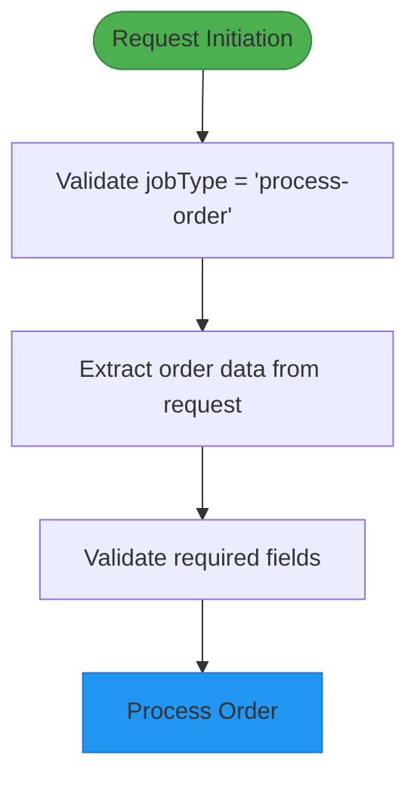
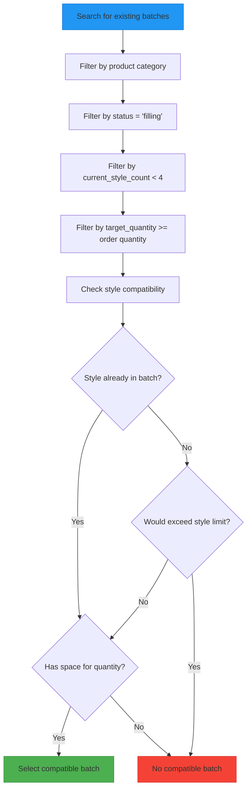
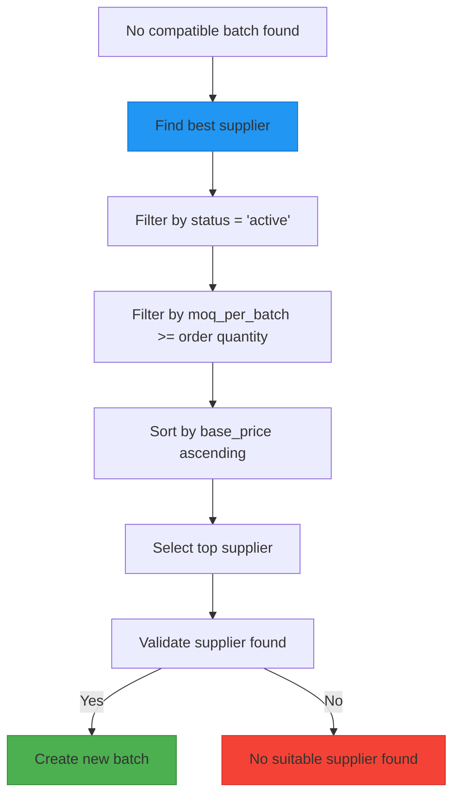
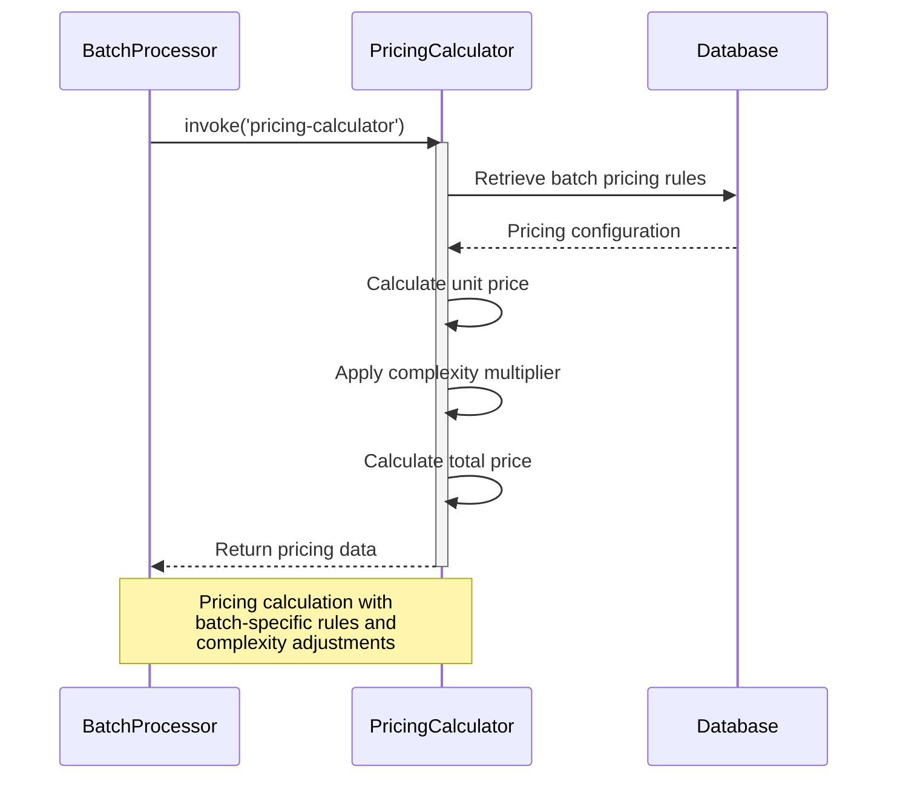
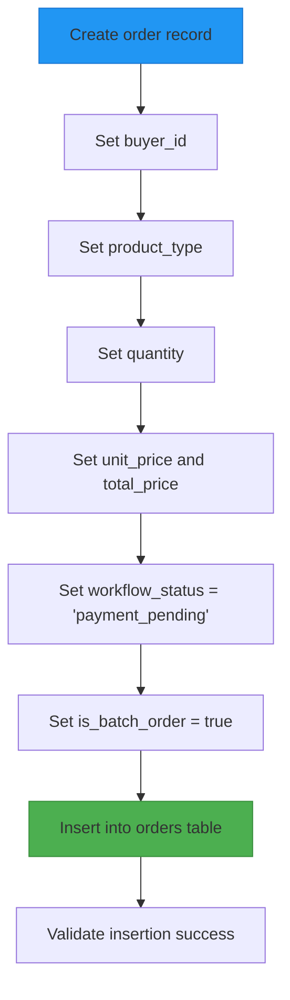
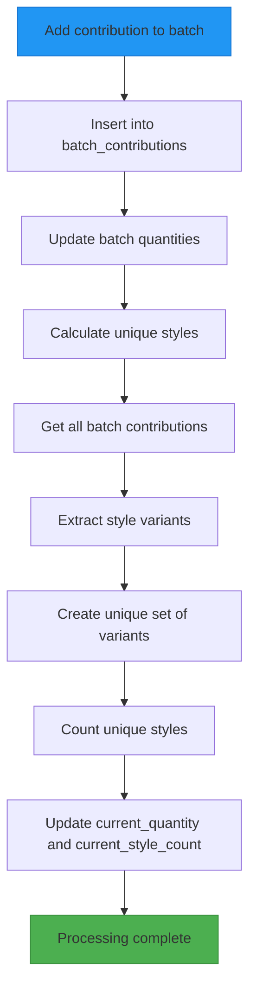
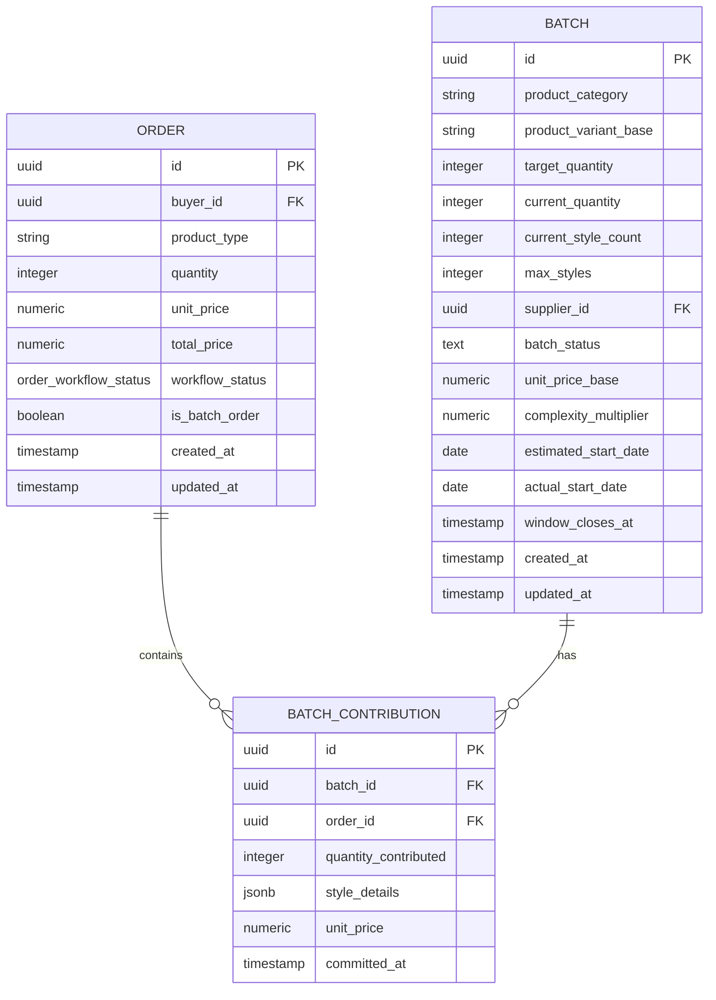
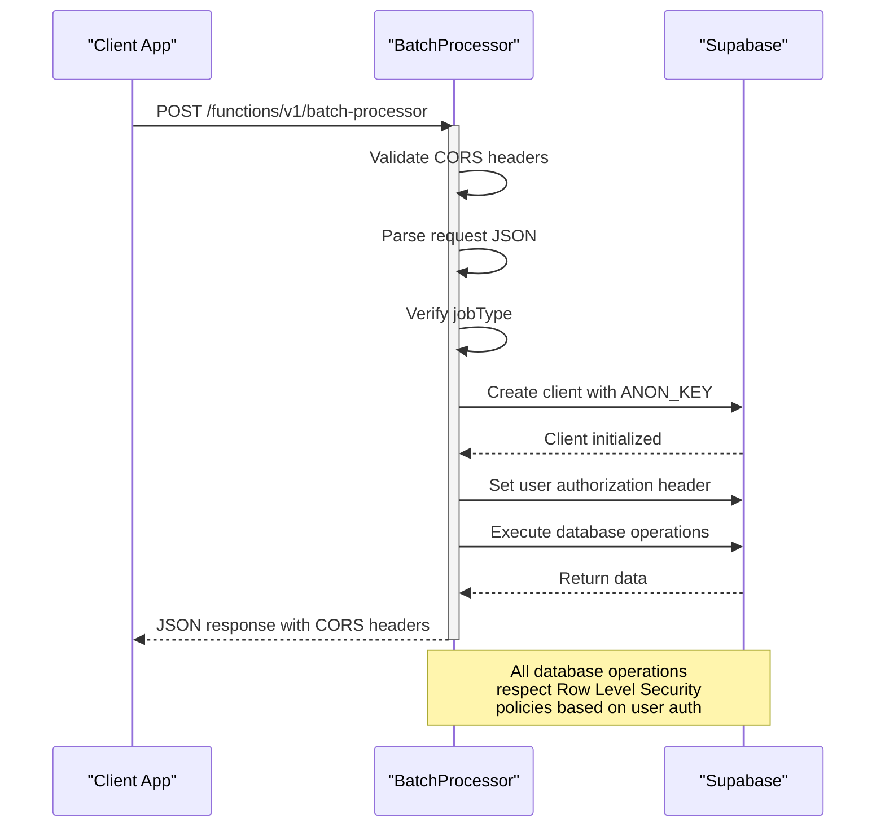
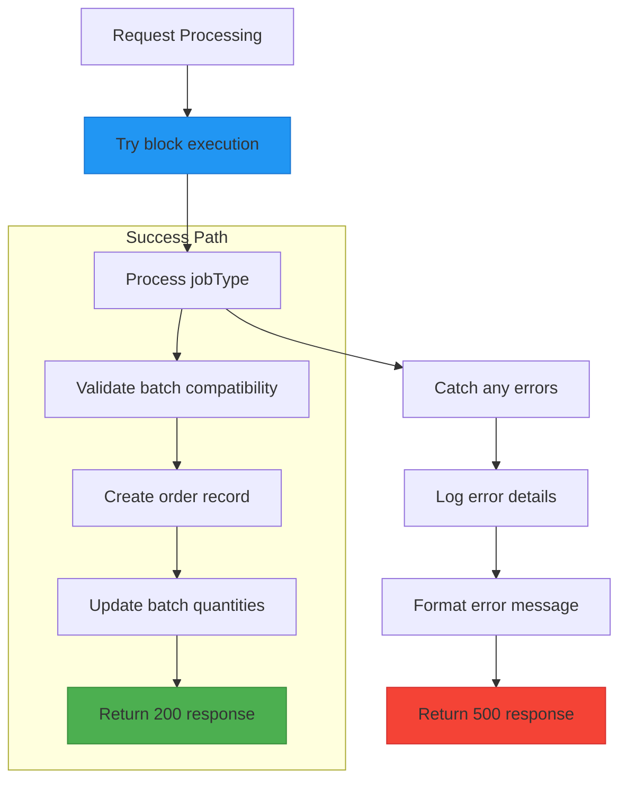

# Process Order Job

<cite>
**Referenced Files in This Document**   
- [batch-processor/index.ts](file://supabase/functions/batch-processor/index.ts)
- [useAggregation.ts](file://src/hooks/useAggregation.ts)
- [TABLES_ONLY.sql](file://supabase/TABLES_ONLY.sql)
</cite>

## Table of Contents
1. [Introduction](#introduction)
2. [Request Format](#request-format)
3. [Processing Workflow](#processing-workflow)
4. [Response Structure](#response-structure)
5. [Security Context](#security-context)
6. [Usage Examples](#usage-examples)
7. [Error Handling](#error-handling)

## Introduction
The 'process-order' job type of the batch-processor serverless function handles the creation and processing of aggregated orders within the production batching system. This function implements a five-step workflow to either assign orders to existing compatible batches or create new batches with optimal supplier selection. The system is designed to maximize production efficiency through batch aggregation while ensuring accurate pricing and proper batch management.

**Section sources**
- [batch-processor/index.ts](file://supabase/functions/batch-processor/index.ts#L1-L346)

## Request Format
The 'process-order' job requires a specific request structure with the job type and order data:

```json
{
  "jobType": "process-order",
  "data": {
    "productCategory": "string",
    "productVariantBase": "string",
    "quantity": "number",
    "styleDetails": "object",
    "buyerId": "string"
  }
}
```

The request must include:
- **jobType**: Must be 'process-order' to trigger the order processing workflow
- **data**: Contains the order processing parameters:
  - *productCategory*: The product category (e.g., "t-shirts", "hoodies")
  - *productVariantBase*: The base variant of the product
  - *quantity*: Number of units ordered
  - *styleDetails*: Object containing style-specific details including variant information
  - *buyerId*: UUID of the buyer placing the order



**Diagram sources**
- [batch-processor/index.ts](file://supabase/functions/batch-processor/index.ts#L12-L27)

**Section sources**
- [batch-processor/index.ts](file://supabase/functions/batch-processor/index.ts#L12-L27)

## Processing Workflow
The 'process-order' job executes a five-step workflow to process orders and manage production batches.

### Step 1: Find Compatible Existing Batch
The system searches for existing batches that can accommodate the new order based on multiple criteria:
- Same product category
- Status of 'filling'
- Current style count less than 4 (maximum allowed styles)
- Target quantity sufficient to accommodate the new order
- Style compatibility (does not exceed style limits)



**Diagram sources**
- [batch-processor/index.ts](file://supabase/functions/batch-processor/index.ts#L192-L225)

### Step 2: Create New Batch with Optimal Supplier
When no compatible batch exists, the system creates a new batch by selecting the optimal supplier based on:
- Active MOU terms
- MOQ per batch sufficient for the order quantity
- Lowest base price (ordered by ascending base_price)
- Only the top supplier is selected (limit 1)



**Diagram sources**
- [batch-processor/index.ts](file://supabase/functions/batch-processor/index.ts#L230-L265)

### Step 3: Invoke Pricing Calculator
The system invokes the pricing-calculator function to determine accurate pricing for the order, passing:
- batchId: The selected or newly created batch ID
- quantity: The order quantity
- styleDetails: The style details from the order request



**Diagram sources**
- [batch-processor/index.ts](file://supabase/functions/batch-processor/index.ts#L268-L274)

### Step 4: Create Order Record
The system creates an order record in the database with calculated pricing information:



**Diagram sources**
- [batch-processor/index.ts](file://supabase/functions/batch-processor/index.ts#L281-L293)

### Step 5: Update Batch with Order Contribution
The final step adds the order contribution to the batch and updates batch quantities:



**Diagram sources**
- [batch-processor/index.ts](file://supabase/functions/batch-processor/index.ts#L297-L324)

**Section sources**
- [batch-processor/index.ts](file://supabase/functions/batch-processor/index.ts#L191-L324)

## Response Structure
The 'process-order' job returns a standardized response with order and batch information:

```json
{
  "success": true,
  "orderId": "string",
  "batchId": "string",
  "isNewBatch": "boolean",
  "pricing": {
    "unitPrice": "number",
    "totalPrice": "number",
    "breakdown": "object"
  },
  "batchFillPercentage": "number"
}
```

The response includes:
- **success**: Boolean indicating successful processing
- **orderId**: UUID of the created order
- **batchId**: UUID of the assigned or created batch
- **isNewBatch**: Boolean indicating if a new batch was created
- **pricing**: Object containing pricing details from the pricing-calculator
- **batchFillPercentage**: The fill percentage of the batch after adding the order



**Diagram sources**
- [batch-processor/index.ts](file://supabase/functions/batch-processor/index.ts#L333-L341)
- [TABLES_ONLY.sql](file://supabase/TABLES_ONLY.sql#L507-L524)

**Section sources**
- [batch-processor/index.ts](file://supabase/functions/batch-processor/index.ts#L333-L341)

## Security Context
The 'process-order' job uses Supabase authentication with proper security context:

- **Client**: Uses SUPABASE_ANON_KEY for initial connection
- **Authorization**: Passes the request's Authorization header to ensure user context
- **Row Level Security**: Database policies enforce data access controls
- **Environment Variables**: Sensitive credentials stored in environment variables



**Diagram sources**
- [batch-processor/index.ts](file://supabase/functions/batch-processor/index.ts#L180-L186)

**Section sources**
- [batch-processor/index.ts](file://supabase/functions/batch-processor/index.ts#L180-L186)

## Usage Examples
### Example 1: Order Assigned to Existing Batch
```json
// Request
{
  "jobType": "process-order",
  "data": {
    "productCategory": "t-shirts",
    "productVariantBase": "crew-neck",
    "quantity": 150,
    "styleDetails": {
      "variant": "summer-collection-2025",
      "color": "navy",
      "size": "M"
    },
    "buyerId": "a1b2c3d4-e5f6-7890-g1h2-i3j4k5l6m7n8"
  }
}

// Response
{
  "success": true,
  "orderId": "b2c3d4e5-f6g7-8901-h2i3-j4k5l6m7n8o9",
  "batchId": "c3d4e5f6-g7h8-9012-i3j4-k5l6m7n8o9p0",
  "isNewBatch": false,
  "pricing": {
    "unitPrice": 12.50,
    "totalPrice": 1875.00,
    "breakdown": {
      "baseCost": 8.00,
      "complexityMultiplier": 1.2,
      "margin": 2.50
    }
  },
  "batchFillPercentage": 68.5
}
```

### Example 2: New Batch Created
```json
// Request
{
  "jobType": "process-order",
  "data": {
    "productCategory": "hoodies",
    "productVariantBase": "zip-up",
    "quantity": 250,
    "styleDetails": {
      "variant": "premium-line",
      "color": "black",
      "size": "L"
    },
    "buyerId": "a1b2c3d4-e5f6-7890-g1h2-i3j4k5l6m7n8"
  }
}

// Response
{
  "success": true,
  "orderId": "d4e5f6g7-h8i9-0123-j4k5-l6m7n8o9p0q1",
  "batchId": "e5f6g7h8-i9j0-1234-k5l6-m7n8o9p0q1r2",
  "isNewBatch": true,
  "pricing": {
    "unitPrice": 28.75,
    "totalPrice": 7187.50,
    "breakdown": {
      "baseCost": 20.00,
      "complexityMultiplier": 1.15,
      "margin": 5.75
    }
  },
  "batchFillPercentage": 55.6
}
```

**Section sources**
- [batch-processor/index.ts](file://supabase/functions/batch-processor/index.ts#L333-L341)
- [useAggregation.ts](file://src/hooks/useAggregation.ts#L82-L98)

## Error Handling
The 'process-order' job implements comprehensive error handling:



Common error scenarios include:
- Invalid job type (400 Bad Request)
- No suitable supplier found (500 Internal Server Error)
- Database operation failures (500 Internal Server Error)
- Pricing calculation failures (500 Internal Server Error)

All errors are logged with details for debugging and monitoring purposes.

**Section sources**
- [batch-processor/index.ts](file://supabase/functions/batch-processor/index.ts#L48-L55)