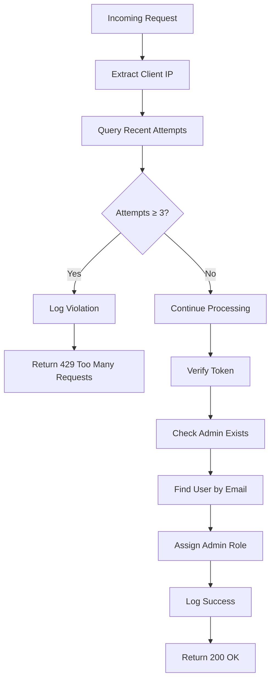
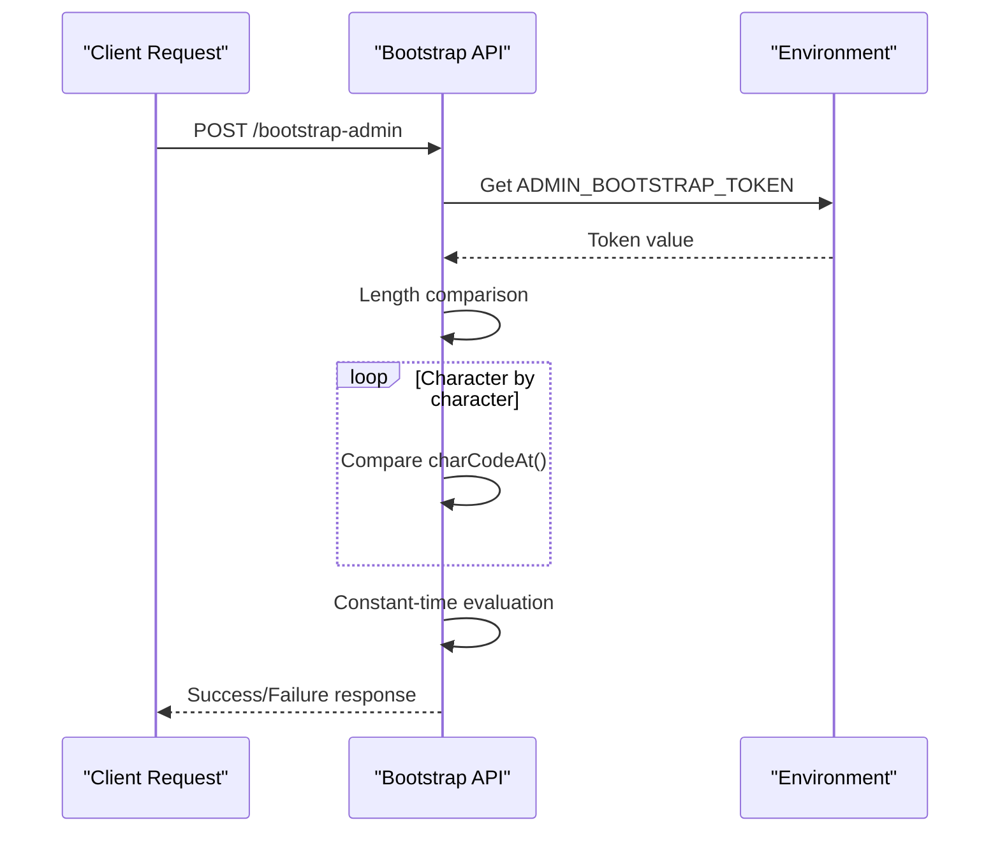
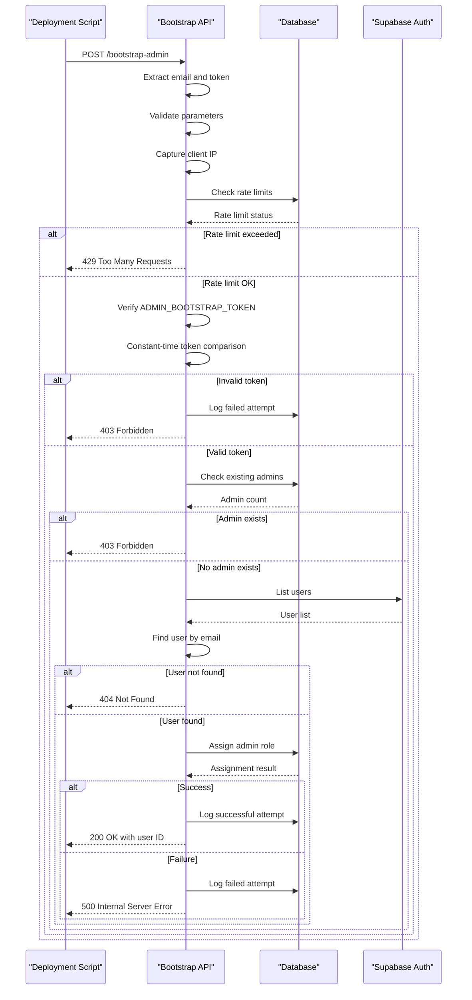

# Bootstrap Admin API

<cite>
**Referenced Files in This Document**
- [supabase/functions/bootstrap-admin/index.ts](file://supabase/functions/bootstrap-admin/index.ts)
- [supabase/config.toml](file://supabase/config.toml)
- [supabase/migrations/20251121152921_c535d0b2-b802-4dec-a8a5-e41029b44e99.sql](file://supabase/migrations/20251121152921_c535d0b2-b802-4dec-a8a5-e41029b44e99.sql)
- [scripts/setup-database.js](file://scripts/setup-database.js)
- [src/lib/env-validator.ts](file://src/lib/env-validator.ts)
</cite>

## Table of Contents
1. [Introduction](#introduction)
2. [API Endpoint Overview](#api-endpoint-overview)
3. [Security Mechanisms](#security-mechanisms)
4. [Request Format](#request-format)
5. [Response Formats](#response-formats)
6. [Workflow Implementation](#workflow-implementation)
7. [Database Schema](#database-schema)
8. [Deployment Examples](#deployment-examples)
9. [Security Best Practices](#security-best-practices)
10. [Troubleshooting](#troubleshooting)

## Introduction

The Bootstrap Admin API is a secure endpoint designed to initialize the first administrator user in the Sleek Apparels platform. This idempotent operation allows for the assignment of administrative privileges to a verified user account through a controlled bootstrap process that incorporates multiple security layers including rate limiting, constant-time token validation, and comprehensive audit logging.

The API serves as a critical component in the initial deployment and setup phase of the application, enabling automated provisioning of administrative access while maintaining strict security controls to prevent unauthorized access attempts.

## API Endpoint Overview

### Endpoint Details

- **URL**: `POST /functions/v1/bootstrap-admin`
- **Method**: POST
- **Content-Type**: `application/json`
- **Authentication**: None (intentionally open for bootstrap process)
- **Rate Limiting**: 3 attempts per IP address per hour
- **Environment Variables**: Requires `ADMIN_BOOTSTRAP_TOKEN` configuration

### CORS Configuration

The API supports cross-origin requests with the following headers:
- `Access-Control-Allow-Origin`: `*`
- `Access-Control-Allow-Headers`: `authorization, x-client-info, apikey, content-type`

**Section sources**
- [supabase/functions/bootstrap-admin/index.ts](file://supabase/functions/bootstrap-admin/index.ts#L3-L6)

## Security Mechanisms

### Rate Limiting

The API implements a sophisticated rate limiting mechanism to prevent brute force attacks:



**Diagram sources**
- [supabase/functions/bootstrap-admin/index.ts](file://supabase/functions/bootstrap-admin/index.ts#L28-L57)

**Rate Limiting Parameters:**
- Maximum attempts: 3
- Time window: 1 hour (3600000 milliseconds)
- Storage: `bootstrap_attempts` table
- Monitoring: IP address tracking with success/failure logging

### Constant-Time Token Comparison

To prevent timing attack vulnerabilities, the API implements cryptographic constant-time string comparison:



**Diagram sources**
- [supabase/functions/bootstrap-admin/index.ts](file://supabase/functions/bootstrap-admin/index.ts#L60-L75)

### IP Address Tracking

The API captures and logs client IP addresses for security monitoring:
- Uses `x-forwarded-for` header for proxy environments
- Falls back to `x-real-ip` header
- Defaults to "unknown" if neither header present

### Audit Logging

All bootstrap attempts are logged to the `bootstrap_attempts` table:
- IP address tracking
- Success/failure status
- Timestamp recording
- Security event correlation

**Section sources**
- [supabase/functions/bootstrap-admin/index.ts](file://supabase/functions/bootstrap-admin/index.ts#L28-L57)
- [supabase/functions/bootstrap-admin/index.ts](file://supabase/functions/bootstrap-admin/index.ts#L60-L75)
- [supabase/migrations/20251121152921_c535d0b2-b802-4dec-a8a5-e41029b44e99.sql](file://supabase/migrations/20251121152921_c535d0b2-b802-4dec-a8a5-e41029b44e99.sql#L6-L25)

## Request Format

### Required Parameters

The API expects a JSON payload with the following structure:

| Parameter | Type | Required | Description |
|-----------|------|----------|-------------|
| `email` | string | Yes | Email address of the user to become admin |
| `token` | string | Yes | Bootstrap token for authentication |

### Example Request

```json
{
  "email": "admin@example.com",
  "token": "your-bootstrap-token-here"
}
```

### Content-Type Header

The request must include the appropriate content type:
```
Content-Type: application/json
```

**Section sources**
- [supabase/functions/bootstrap-admin/index.ts](file://supabase/functions/bootstrap-admin/index.ts#L19-L25)

## Response Formats

### Success Response (200 OK)

When the bootstrap process completes successfully:

```json
{
  "success": true,
  "message": "Admin role assigned successfully",
  "userId": "user-uuid-here"
}
```

### Error Responses

#### Missing Parameters (400 Bad Request)
```json
{
  "error": "Missing email or token"
}
```

#### Invalid Token (403 Forbidden)
```json
{
  "error": "Invalid token"
}
```

#### Admin Already Exists (403 Forbidden)
```json
{
  "error": "Admin already exists. Bootstrap disabled for security."
}
```

#### User Not Found (404 Not Found)
```json
{
  "error": "User not found with that email"
}
```

#### Rate Limit Exceeded (429 Too Many Requests)
```json
{
  "error": "Too many attempts. Try again in 1 hour."
}
```

#### Server Configuration Error (500 Internal Server Error)
```json
{
  "error": "Server configuration error"
}
```

#### Database Error (500 Internal Server Error)
```json
{
  "error": "Database error"
}
```

#### General Server Error (500 Internal Server Error)
```json
{
  "error": "Internal server error"
}
```

**Section sources**
- [supabase/functions/bootstrap-admin/index.ts](file://supabase/functions/bootstrap-admin/index.ts#L21-L25)
- [supabase/functions/bootstrap-admin/index.ts](file://supabase/functions/bootstrap-admin/index.ts#L45-L57)
- [supabase/functions/bootstrap-admin/index.ts](file://supabase/functions/bootstrap-admin/index.ts#L62-L67)
- [supabase/functions/bootstrap-admin/index.ts](file://supabase/functions/bootstrap-admin/index.ts#L98-L103)
- [supabase/functions/bootstrap-admin/index.ts](file://supabase/functions/bootstrap-admin/index.ts#L116-L121)
- [supabase/functions/bootstrap-admin/index.ts](file://supabase/functions/bootstrap-admin/index.ts#L126-L130)
- [supabase/functions/bootstrap-admin/index.ts](file://supabase/functions/bootstrap-admin/index.ts#L138-L150)
- [supabase/functions/bootstrap-admin/index.ts](file://supabase/functions/bootstrap-admin/index.ts#L170-L175)

## Workflow Implementation

### Complete Bootstrap Process



**Diagram sources**
- [supabase/functions/bootstrap-admin/index.ts](file://supabase/functions/bootstrap-admin/index.ts#L13-L177)

### Step-by-Step Process

1. **Parameter Validation**
   - Verify both `email` and `token` parameters are present
   - Return 400 if either parameter is missing

2. **Rate Limiting**
   - Extract client IP address from request headers
   - Query `bootstrap_attempts` table for recent attempts
   - Enforce 3 attempts per hour limit
   - Log and reject if limit exceeded

3. **Token Verification**
   - Retrieve `ADMIN_BOOTSTRAP_TOKEN` from environment
   - Perform constant-time string comparison
   - Reject with 403 if token is invalid

4. **Admin Existence Check**
   - Query `user_roles` table for existing admin users
   - Return 403 if admin already exists
   - Proceed if no admin found

5. **User Discovery**
   - Use Supabase Auth admin API to list users
   - Find user matching provided email address
   - Return 404 if user not found

6. **Role Assignment**
   - Insert record into `user_roles` table
   - Assign `admin` role to target user
   - Log success or failure accordingly

**Section sources**
- [supabase/functions/bootstrap-admin/index.ts](file://supabase/functions/bootstrap-admin/index.ts#L13-L177)

## Database Schema

### Bootstrap Attempts Table

The `bootstrap_attempts` table tracks all bootstrap operations for security monitoring:

| Column | Type | Constraints | Description |
|--------|------|-------------|-------------|
| `id` | UUID | PRIMARY KEY | Unique identifier |
| `ip_address` | TEXT | NOT NULL | Client IP address |
| `success` | BOOLEAN | NOT NULL, DEFAULT false | Operation success status |
| `created_at` | TIMESTAMPTZ | NOT NULL, DEFAULT now() | Timestamp of attempt |

### User Roles Table

The `user_roles` table manages user permissions:

| Column | Type | Constraints | Description |
|--------|------|-------------|-------------|
| `user_id` | UUID | NOT NULL, FK | Reference to auth.users |
| `role` | app_role | NOT NULL | Role identifier (admin, staff, buyer, supplier) |

### Security Policies

The database enforces strict access controls:
- Only service_role can access bootstrap_attempts
- Row-level security prevents unauthorized access
- Index on (ip_address, created_at DESC) for efficient queries

**Section sources**
- [supabase/migrations/20251121152921_c535d0b2-b802-4dec-a8a5-e41029b44e99.sql](file://supabase/migrations/20251121152921_c535d0b2-b802-4dec-a8a5-e41029b44e99.sql#L6-L25)

## Deployment Examples

### cURL Command Example

```bash
curl -X POST \
  -H "Content-Type: application/json" \
  -d '{"email":"admin@example.com","token":"your-secret-bootstrap-token"}' \
  https://your-supabase-url/functions/v1/bootstrap-admin
```

### Bash Script Example

```bash
#!/bin/bash

# Bootstrap admin user
BOOTSTRAP_EMAIL="admin@company.com"
BOOTSTRAP_TOKEN="your-secret-token"
SUPABASE_URL="https://your-project.supabase.co"

echo "Initializing admin user..."

RESPONSE=$(curl -s -w "\n%{http_code}" -X POST \
  -H "Content-Type: application/json" \
  -d "{\"email\":\"$BOOTSTRAP_EMAIL\",\"token\":\"$BOOTSTRAP_TOKEN\"}" \
  "$SUPABASE_URL/functions/v1/bootstrap-admin")

HTTP_CODE=$(echo "$RESPONSE" | tail -n1)
BODY=$(echo "$RESPONSE" | sed '$d')

if [ "$HTTP_CODE" -eq 200 ]; then
    echo "✅ Admin role assigned successfully"
    echo "User ID: $(echo "$BODY" | jq -r '.userId')"
else
    echo "❌ Bootstrap failed with status $HTTP_CODE"
    echo "Response: $BODY"
fi
```

### Node.js Example

```javascript
const axios = require('axios');

async function bootstrapAdmin() {
    const url = 'https://your-supabase-url/functions/v1/bootstrap-admin';
    const payload = {
        email: 'admin@example.com',
        token: process.env.ADMIN_BOOTSTRAP_TOKEN
    };
    
    try {
        const response = await axios.post(url, payload, {
            headers: { 'Content-Type': 'application/json' }
        });
        
        console.log('Admin bootstrap successful:', response.data);
        return response.data.userId;
    } catch (error) {
        console.error('Bootstrap failed:', error.response?.data || error.message);
        throw error;
    }
}

// Usage
bootstrapAdmin().then(userId => {
    console.log('Admin user ID:', userId);
}).catch(err => {
    process.exit(1);
});
```

### Docker Compose Example

```yaml
version: '3.8'
services:
  bootstrap-admin:
    image: curlimages/curl:latest
    command: >
      sh -c "
        sleep 10 &&
        curl -X POST \
          -H 'Content-Type: application/json' \
          -d '{\"email\":\"admin@company.com\",\"token\":\"'$ADMIN_BOOTSTRAP_TOKEN'\"}' \
          https://your-supabase-url/functions/v1/bootstrap-admin
      "
    environment:
      - ADMIN_BOOTSTRAP_TOKEN=${ADMIN_BOOTSTRAP_TOKEN}
    depends_on:
      - supabase
```

## Security Best Practices

### Token Management

1. **Secure Token Generation**
   ```bash
   # Generate cryptographically secure token
   openssl rand -hex 32
   ```

2. **Environment Variable Security**
   ```bash
   # Store securely in CI/CD pipeline secrets
   export ADMIN_BOOTSTRAP_TOKEN="your-generated-token"
   
   # Never commit tokens to version control
   echo "ADMIN_BOOTSTRAP_TOKEN" >> .gitignore
   ```

3. **Token Rotation**
   - Rotate bootstrap tokens regularly
   - Implement token expiration mechanisms
   - Monitor token usage patterns

### Network Security

1. **HTTPS Enforcement**
   - Always use HTTPS in production
   - Implement proper certificate validation
   - Configure security headers

2. **Network Isolation**
   - Deploy in private networks during bootstrap
   - Use VPN or bastion hosts for access
   - Implement network-level rate limiting

### Monitoring and Auditing

1. **Security Event Monitoring**
   ```sql
   -- Monitor bootstrap attempts
   SELECT 
       ip_address, 
       success, 
       COUNT(*) as attempt_count,
       MAX(created_at) as last_attempt
   FROM bootstrap_attempts
   GROUP BY ip_address, success
   ORDER BY last_attempt DESC;
   ```

2. **Rate Limiting Alerts**
   - Monitor for unusual rate limit violations
   - Alert on multiple failed attempts from same IP
   - Track geographic patterns of access

3. **Success Rate Tracking**
   - Monitor successful bootstrap rates
   - Identify potential automation scripts
   - Detect suspicious patterns

### Deployment Security

1. **Principle of Least Privilege**
   - Use dedicated service accounts
   - Implement role-based access controls
   - Regular privilege reviews

2. **Infrastructure as Code**
   ```yaml
   # Terraform example for secure deployment
   resource "supabase_function" "bootstrap_admin" {
     name        = "bootstrap-admin"
     runtime     = "deno"
     source_code = file("bootstrap-admin/index.ts")
     
     environment_variables = {
       ADMIN_BOOTSTRAP_TOKEN = sensitive(var.admin_bootstrap_token)
       SUPABASE_URL         = var.supabase_url
       SUPABASE_SERVICE_ROLE_KEY = var.supabase_service_role_key
     }
     
     # Restrict access to specific IPs
     allowed_ips = ["192.168.1.0/24"]
   }
   ```

3. **Backup and Recovery**
   - Backup bootstrap tokens securely
   - Document recovery procedures
   - Test disaster recovery scenarios

**Section sources**
- [supabase/functions/bootstrap-admin/index.ts](file://supabase/functions/bootstrap-admin/index.ts#L60-L75)
- [scripts/setup-database.js](file://scripts/setup-database.js#L56-L62)

## Troubleshooting

### Common Issues and Solutions

#### Issue: "Missing email or token" (400)

**Cause**: Missing required parameters in request body
**Solution**: Ensure both `email` and `token` are provided in JSON payload

```bash
# Correct request format
curl -X POST \
  -H "Content-Type: application/json" \
  -d '{"email":"admin@example.com","token":"your-token"}' \
  https://your-supabase-url/functions/v1/bootstrap-admin
```

#### Issue: "Invalid token" (403)

**Cause**: Provided token doesn't match `ADMIN_BOOTSTRAP_TOKEN`
**Solution**: Verify token matches exactly (including case sensitivity)

```bash
# Check environment variable
echo $ADMIN_BOOTSTRAP_TOKEN

# Verify token matches exactly
TOKEN="your-provided-token"
if [ "$TOKEN" = "$ADMIN_BOOTSTRAP_TOKEN" ]; then
    echo "Tokens match!"
else
    echo "Tokens do not match!"
fi
```

#### Issue: "Too many attempts" (429)

**Cause**: Rate limit exceeded (3 attempts per hour per IP)
**Solution**: Wait for rate limit to reset or use different IP

```bash
# Check rate limit status
curl -X GET \
  -H "Authorization: Bearer $SERVICE_ROLE_KEY" \
  "https://your-supabase-url/rest/v1/bootstrap_attempts?ip_address=your-ip&created_at=gte.2024-01-01T00:00:00Z"
```

#### Issue: "Admin already exists" (403)

**Cause**: Bootstrap attempted when admin user already exists
**Solution**: This is expected behavior - no action needed

```bash
# Check existing admins
curl -X GET \
  -H "Authorization: Bearer $SERVICE_ROLE_KEY" \
  "https://your-supabase-url/rest/v1/user_roles?role=eq.admin"
```

#### Issue: "User not found with that email" (404)

**Cause**: Specified email doesn't exist in Supabase Auth
**Solution**: Verify user exists and email is correct

```bash
# List users to verify existence
curl -X POST \
  -H "Authorization: Bearer $SERVICE_ROLE_KEY" \
  -H "Content-Type: application/json" \
  -d '{"email":"admin@example.com"}' \
  "https://your-supabase-url/auth/v1/admin/users"
```

#### Issue: "Server configuration error" (500)

**Cause**: `ADMIN_BOOTSTRAP_TOKEN` environment variable not set
**Solution**: Configure environment variable in Supabase dashboard

```bash
# Set environment variable in Supabase
# Dashboard → Project Settings → API → Environment Variables
ADMIN_BOOTSTRAP_TOKEN=your-secret-token
```

### Debugging Commands

1. **Check Function Status**
   ```bash
   curl -X GET \
     "https://your-supabase-url/functions/v1/bootstrap-admin"
   ```

2. **Monitor Logs**
   ```bash
   # Check Supabase function logs
   # Dashboard → Functions → bootstrap-admin → Logs
   ```

3. **Test Connectivity**
   ```bash
   # Test basic connectivity
   curl -X OPTIONS \
     -H "Access-Control-Allow-Origin: *" \
     https://your-supabase-url/functions/v1/bootstrap-admin
   ```

### Performance Considerations

1. **Rate Limiting Impact**
   - 3 attempts per hour per IP
   - Consider batch processing for multiple users
   - Implement exponential backoff in scripts

2. **Database Performance**
   - Index optimization for `bootstrap_attempts` table
   - Monitor query performance during peak loads
   - Consider caching for frequently accessed data

3. **Network Latency**
   - Deploy function close to Supabase region
   - Use CDN for static assets
   - Implement connection pooling for database connections

**Section sources**
- [supabase/functions/bootstrap-admin/index.ts](file://supabase/functions/bootstrap-admin/index.ts#L21-L25)
- [supabase/functions/bootstrap-admin/index.ts](file://supabase/functions/bootstrap-admin/index.ts#L45-L57)
- [supabase/functions/bootstrap-admin/index.ts](file://supabase/functions/bootstrap-admin/index.ts#L62-L67)
- [supabase/functions/bootstrap-admin/index.ts](file://supabase/functions/bootstrap-admin/index.ts#L98-L103)