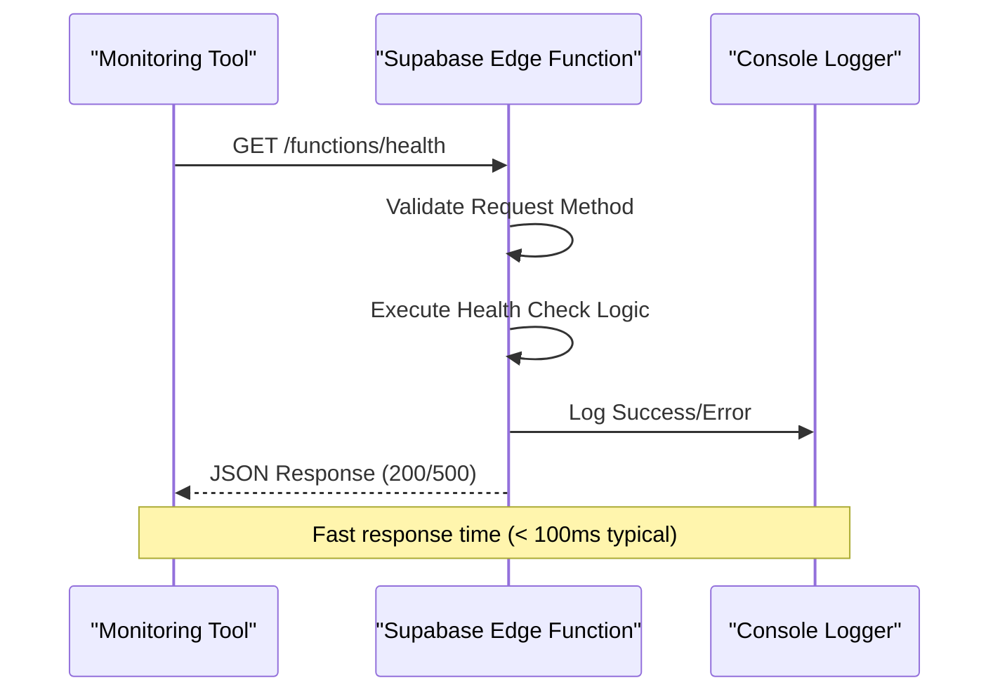
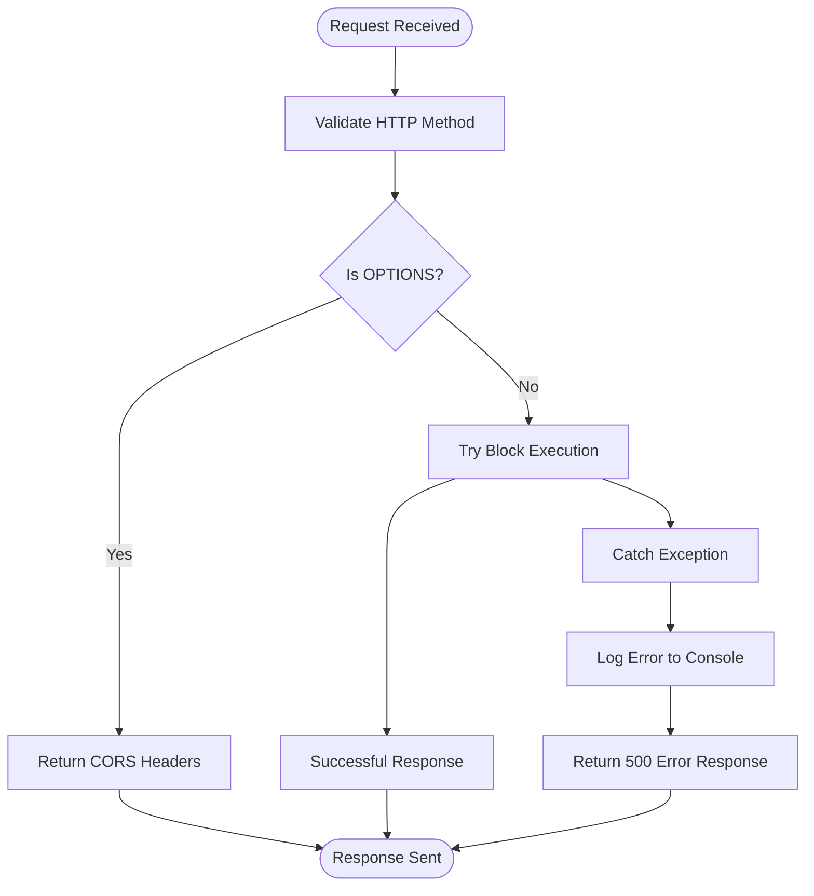
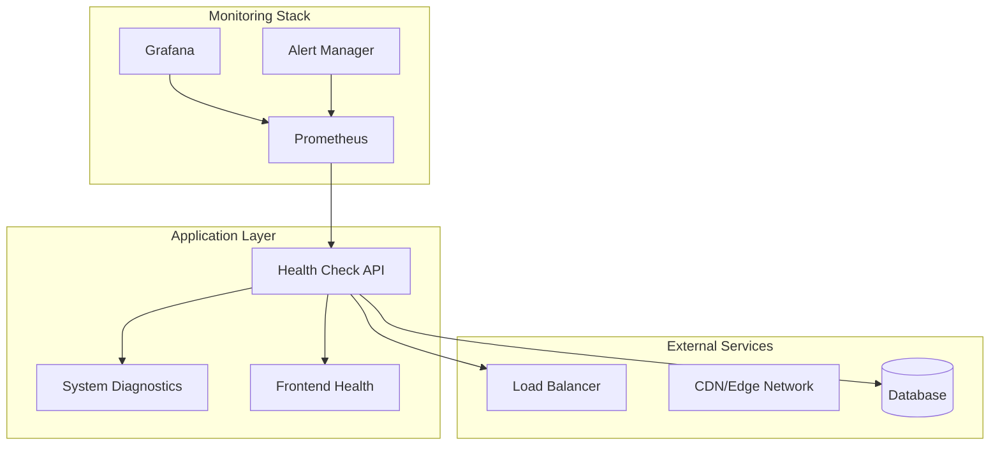
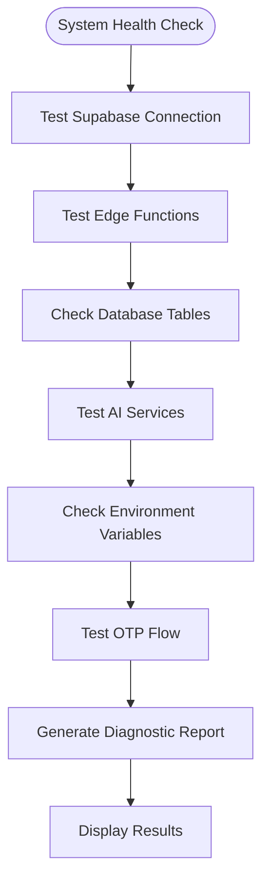

# Health Check API Documentation

<cite>
**Referenced Files in This Document**
- [supabase/functions/health/index.ts](file://supabase/functions/health/index.ts)
- [src/components/SystemHealthCheck.tsx](file://src/components/SystemHealthCheck.tsx)
- [src/pages/Health.tsx](file://src/pages/Health.tsx)
- [src/lib/diagnostics.ts](file://src/lib/diagnostics.ts)
- [src/lib/api/aiQuote.ts](file://src/lib/api/aiQuote.ts)
- [package.json](file://package.json)
</cite>

## Table of Contents
1. [Introduction](#introduction)
2. [API Endpoint Overview](#api-endpoint-overview)
3. [Implementation Details](#implementation-details)
4. [Response Formats](#response-formats)
5. [CORS Configuration](#cors-configuration)
6. [Error Handling](#error-handling)
7. [Deployment Monitoring Use Cases](#deployment-monitoring-use-cases)
8. [Frontend Integration Examples](#frontend-integration-examples)
9. [Security Considerations](#security-considerations)
10. [Testing and Validation](#testing-and-validation)
11. [Troubleshooting Guide](#troubleshooting-guide)
12. [Best Practices](#best-practices)

## Introduction

The Sleek App Health Check API provides a standardized endpoint for monitoring system status, uptime verification, and deployment health across the application stack. Built on Deno's serverless platform, this endpoint serves as a critical component for infrastructure monitoring, automated health checks, and system status verification.

The health check API operates on two primary levels:
- **Edge Function Health**: Direct verification of Supabase Edge Function deployment and accessibility
- **System Diagnostics**: Comprehensive backend connectivity testing including database, AI services, and external integrations

## API Endpoint Overview

### Primary Health Check Endpoint
- **URL**: `/functions/health`
- **Method**: `GET`
- **Content-Type**: `application/json`
- **Authentication**: Public (no authentication required)

### Secondary Health Page
- **URL**: `/health`
- **Method**: `GET`
- **Content-Type**: `application/json`
- **Purpose**: Frontend application health display

## Implementation Details

The health check API is implemented as a Deno serverless function using Supabase Edge Functions platform. The implementation follows a minimalist approach focused on reliability and speed.



**Diagram sources**
- [supabase/functions/health/index.ts](file://supabase/functions/health/index.ts#L6-L33)

**Section sources**
- [supabase/functions/health/index.ts](file://supabase/functions/health/index.ts#L1-L34)

## Response Formats

### Successful Health Check Response (200 OK)

**Structure**:
```json
{
  "ok": true,
  "timestamp": "2024-01-15T10:30:45.123Z",
  "service": "edge-functions"
}
```

**Field Descriptions**:
- `ok`: Boolean indicating overall system health status
- `timestamp`: ISO 8601 formatted UTC timestamp of response generation
- `service`: Identifies the service component being checked

### Error Response (500 Internal Server Error)

**Structure**:
```json
{
  "ok": false,
  "error": "Health check failed"
}
```

**Field Descriptions**:
- `ok`: Boolean set to false indicating failure
- `error`: Human-readable error description

**Section sources**
- [supabase/functions/health/index.ts](file://supabase/functions/health/index.ts#L12-L31)

## CORS Configuration

The health check endpoint implements comprehensive Cross-Origin Resource Sharing (CORS) support to enable seamless integration across different domains and origins.

### CORS Headers Configuration

```typescript
const corsHeaders = {
  'Access-Control-Allow-Origin': '*',           // Allow all origins
  'Access-Control-Allow-Headers': 'authorization, x-client-info, apikey, content-type'
};
```

### Supported Headers

| Header | Purpose | Values |
|--------|---------|---------|
| `Access-Control-Allow-Origin` | Origin restriction | `*` (allow all) |
| `Access-Control-Allow-Headers` | Permitted request headers | `authorization, x-client-info, apikey, content-type` |

### Preflight Request Handling

The implementation automatically handles OPTIONS requests for CORS preflight:

```typescript
if (req.method === 'OPTIONS') {
  return new Response(null, { headers: corsHeaders });
}
```

**Section sources**
- [supabase/functions/health/index.ts](file://supabase/functions/health/index.ts#L1-L5)

## Error Handling

The health check implementation includes robust error handling to ensure reliable operation under various failure conditions.



**Diagram sources**
- [supabase/functions/health/index.ts](file://supabase/functions/health/index.ts#L6-L33)

### Error Scenarios

1. **Function Execution Failure**: Caught exceptions during health check logic
2. **Serialization Errors**: JSON serialization failures
3. **Network Issues**: Edge function communication problems
4. **Environment Configuration**: Missing environment variables

### Error Logging

All errors are logged to the console with detailed error information for debugging purposes.

**Section sources**
- [supabase/functions/health/index.ts](file://supabase/functions/health/index.ts#L23-L31)

## Deployment Monitoring Use Cases

### Infrastructure Monitoring

The health check API serves as a foundational component for comprehensive infrastructure monitoring:



### Uptime Verification

**Common Monitoring Patterns**:
- **Interval Checks**: Automated health checks every 30-60 seconds
- **Threshold Monitoring**: Alert thresholds for response times and availability
- **Geographic Distribution**: Multi-region health monitoring
- **Service Dependencies**: Chain health checks for dependent services

### System Status Verification

The health check API enables verification of:
- **Edge Function Deployment**: Confirm function availability and responsiveness
- **Backend Connectivity**: Verify database and external service connections
- **Application Health**: Monitor frontend application status
- **Integration Points**: Validate third-party service integrations

## Frontend Integration Examples

### Basic Health Check Implementation

```javascript
// Simple health check function
async function checkBackendHealth() {
  try {
    const response = await fetch('/functions/health');
    if (!response.ok) {
      throw new Error(`HTTP error! status: ${response.status}`);
    }
    const data = await response.json();
    return data.ok;
  } catch (error) {
    console.error('Health check failed:', error);
    return false;
  }
}
```

### React Component Integration

```typescript
import React, { useState, useEffect } from 'react';

const HealthStatus = () => {
  const [isHealthy, setIsHealthy] = useState<boolean | null>(null);
  
  useEffect(() => {
    const checkHealth = async () => {
      const healthy = await checkBackendHealth();
      setIsHealthy(healthy);
    };
    
    checkHealth();
    const interval = setInterval(checkHealth, 30000); // Check every 30 seconds
    return () => clearInterval(interval);
  }, []);
  
  return (
    <div className={`health-indicator ${isHealthy ? 'healthy' : 'unhealthy'}`}>
      {isHealthy === null ? 'Checking...' : isHealthy ? 'Healthy' : 'Unhealthy'}
    </div>
  );
};
```

### Monitoring Dashboard Integration

```javascript
// Health metrics collection
const collectHealthMetrics = async () => {
  const startTime = performance.now();
  
  try {
    const response = await fetch('/functions/health');
    const endTime = performance.now();
    
    return {
      healthy: response.ok,
      responseTime: endTime - startTime,
      timestamp: new Date().toISOString()
    };
  } catch (error) {
    return {
      healthy: false,
      responseTime: null,
      timestamp: new Date().toISOString(),
      error: error.message
    };
  }
};
```

**Section sources**
- [src/components/SystemHealthCheck.tsx](file://src/components/SystemHealthCheck.tsx#L21-L39)

## Security Considerations

### Public Endpoint Security

As a public health endpoint, the health check API requires careful security consideration despite its benign nature:

#### Advantages of Public Access
- **Easy Integration**: No authentication overhead for monitoring systems
- **Fast Response Times**: Minimal processing overhead
- **Broad Compatibility**: Works with any monitoring tool or service

#### Security Implications
- **Information Disclosure**: May reveal system operational status
- **Denial of Service**: Potential for abuse through excessive requests
- **Infrastructure Mapping**: Could aid attackers in understanding system topology

### Mitigation Strategies

#### Rate Limiting
While not implemented in the current version, consider adding rate limiting:
```typescript
// Example rate limiting implementation (not currently active)
const rateLimitKey = req.headers.get('x-forwarded-for') || 'unknown';
const rateLimitWindow = new Date(Date.now() - 60000).toISOString();

// Check rate limit in database
const { data: rateLimit } = await supabase
  .from('health_check_limits')
  .select('*')
  .eq('key', rateLimitKey)
  .gte('window_start', rateLimitWindow)
  .single();

if (rateLimit && rateLimit.count >= 100) {
  return new Response(
    JSON.stringify({ error: 'Rate limit exceeded' }),
    { status: 429, headers: corsHeaders }
  );
}
```

#### Production Environment Enhancements

For production deployments, consider implementing additional security measures:

1. **IP Whitelisting**: Restrict access to known monitoring IPs
2. **Authentication**: Require API keys for health checks
3. **Logging**: Comprehensive request logging for security auditing
4. **Metrics**: Track health check patterns for anomaly detection

### Authentication Alternatives

#### API Key Authentication
```typescript
const apiKey = req.headers.get('X-Health-API-Key');
const validApiKey = Deno.env.get('HEALTH_CHECK_API_KEY');

if (apiKey !== validApiKey) {
  return new Response(
    JSON.stringify({ error: 'Unauthorized' }),
    { status: 401, headers: corsHeaders }
  );
}
```

#### IP-Based Restrictions
```typescript
const allowedIPs = ['192.168.1.0/24', '10.0.0.0/8'];
const clientIP = req.headers.get('x-forwarded-for')?.split(',')[0];

if (!isAllowedIP(clientIP, allowedIPs)) {
  return new Response(
    JSON.stringify({ error: 'Access denied' }),
    { status: 403, headers: corsHeaders }
  );
}
```

## Testing and Validation

### Manual Testing with cURL

#### Basic Health Check
```bash
# Standard health check
curl -X GET https://your-app.supabase.co/functions/v1/health \
  -H "Content-Type: application/json"

# With verbose output
curl -v -X GET https://your-app.supabase.co/functions/v1/health \
  -H "Content-Type: application/json"
```

#### CORS Preflight Test
```bash
# Test CORS preflight
curl -X OPTIONS https://your-app.supabase.co/functions/v1/health \
  -H "Access-Control-Request-Method: GET" \
  -H "Origin: https://monitoring-tool.com"
```

#### Error Simulation Test
```bash
# Test error response (simulate function failure)
# This requires modifying the function code temporarily
curl -X GET https://your-app.supabase.co/functions/v1/health \
  -H "Content-Type: application/json"
```

### Automated Testing

#### Health Check Script
```bash
#!/bin/bash
# health-check.sh

API_URL="https://your-app.supabase.co/functions/v1/health"
TIMEOUT=10

echo "Testing health check endpoint..."

# Make request with timeout
RESPONSE=$(timeout $TIMEOUT curl -s -o /dev/null -w "%{http_code}" \
  -H "Content-Type: application/json" \
  $API_URL)

if [ "$RESPONSE" = "200" ]; then
  echo "✅ Health check passed (HTTP $RESPONSE)"
  exit 0
else
  echo "❌ Health check failed (HTTP $RESPONSE)"
  exit 1
fi
```

#### Monitoring Integration Test
```javascript
// health-monitor-test.js
const axios = require('axios');

async function testHealthEndpoint() {
  try {
    const response = await axios.get('https://your-app.supabase.co/functions/v1/health', {
      timeout: 5000,
      headers: {
        'Content-Type': 'application/json'
      }
    });
    
    console.log('Health check response:', response.data);
    return response.status === 200 && response.data.ok === true;
  } catch (error) {
    console.error('Health check failed:', error.message);
    return false;
  }
}
```

### System Diagnostics Testing

The frontend health check component provides comprehensive system diagnostics:



**Diagram sources**
- [src/lib/diagnostics.ts](file://src/lib/diagnostics.ts#L148-L169)

**Section sources**
- [src/components/SystemHealthCheck.tsx](file://src/components/SystemHealthCheck.tsx#L21-L40)

## Troubleshooting Guide

### Common Issues and Solutions

#### 1. CORS Errors
**Symptom**: Browser console shows CORS-related errors
**Solution**: Verify CORS headers are properly configured
```bash
curl -I https://your-app.supabase.co/functions/v1/health
```

#### 2. 500 Internal Server Error
**Symptom**: Health check returns 500 status code
**Debugging Steps**:
1. Check function logs in Supabase dashboard
2. Verify environment variables are set
3. Test edge function deployment status

#### 3. Timeout Issues
**Symptom**: Health check requests timeout
**Solutions**:
- Increase timeout values in monitoring tools
- Check network connectivity to Supabase
- Verify edge function performance

#### 4. Authentication Failures
**Symptom**: Expected authentication prompts or 401 responses
**Solution**: Health check should not require authentication
- Verify endpoint URL is correct
- Check for proxy or load balancer authentication

### Debug Information Collection

#### Console Logs
```javascript
// Enable debug logging
console.log('Health check request initiated');
console.log('Response received:', response);
console.log('Response status:', response.status);
```

#### Network Analysis
```bash
# Detailed network analysis
curl -v https://your-app.supabase.co/functions/v1/health \
  -H "Content-Type: application/json" \
  2>&1 | tee health-check.log
```

**Section sources**
- [src/lib/diagnostics.ts](file://src/lib/diagnostics.ts#L234-L269)

## Best Practices

### Monitoring Implementation

#### 1. Health Check Frequency
- **Critical Systems**: Every 30 seconds
- **Standard Systems**: Every 60 seconds  
- **Non-Critical**: Every 5 minutes

#### 2. Alert Thresholds
```yaml
# Example monitoring configuration
alerts:
  - name: health_check_failure
    condition: health_status == false
    duration: 30s
    severity: critical
  
  - name: slow_health_check
    condition: response_time > 2000ms
    duration: 10s
    severity: warning
```

#### 3. Geographic Distribution
- Deploy monitoring agents across multiple regions
- Use cloud provider health check services
- Implement cross-platform monitoring

### Performance Optimization

#### Response Time Targets
- **95th percentile**: < 100ms
- **99th percentile**: < 500ms
- **P99.9**: < 2000ms

#### Caching Considerations
```typescript
// Consider caching health check responses for frequently monitored systems
const cacheKey = 'health-check-cache';
const cachedResponse = await cache.get(cacheKey);

if (cachedResponse) {
  return new Response(cachedResponse, { headers: corsHeaders });
}
```

### Production Deployment

#### Environment-Specific Configuration
```typescript
// Environment-aware health check
const environment = Deno.env.get('ENVIRONMENT') || 'development';

const healthData = {
  ok: true,
  timestamp: new Date().toISOString(),
  service: 'edge-functions',
  environment: environment,
  version: Deno.env.get('APP_VERSION') || 'unknown'
};
```

#### Graceful Degradation
```typescript
// Implement fallback mechanisms for critical systems
try {
  // Primary health check logic
} catch (error) {
  // Fallback to basic connectivity test
  const basicResponse = {
    ok: true,
    timestamp: new Date().toISOString(),
    service: 'basic-connectivity'
  };
  return new Response(JSON.stringify(basicResponse), { headers: corsHeaders });
}
```

### Maintenance Procedures

#### Regular Health Check Validation
1. **Weekly**: Manual testing of all health endpoints
2. **Monthly**: Review and update monitoring thresholds
3. **Quarterly**: Audit security configurations
4. **Annually**: Complete system health check review

#### Documentation Updates
- Keep health check documentation synchronized with implementation
- Document any custom error codes or response variations
- Maintain change logs for health check modifications

**Section sources**
- [src/lib/diagnostics.ts](file://src/lib/diagnostics.ts#L1-L269)