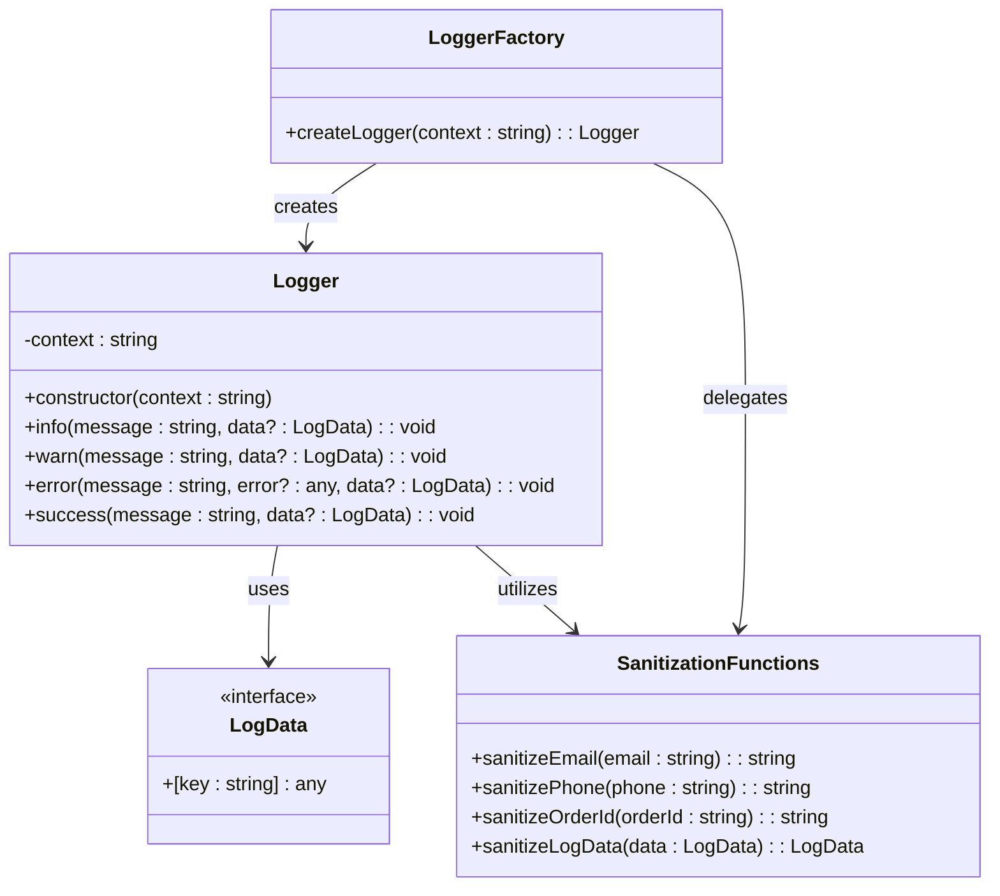
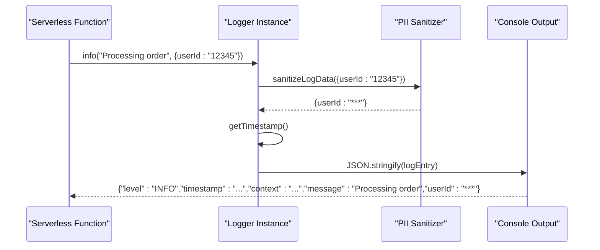
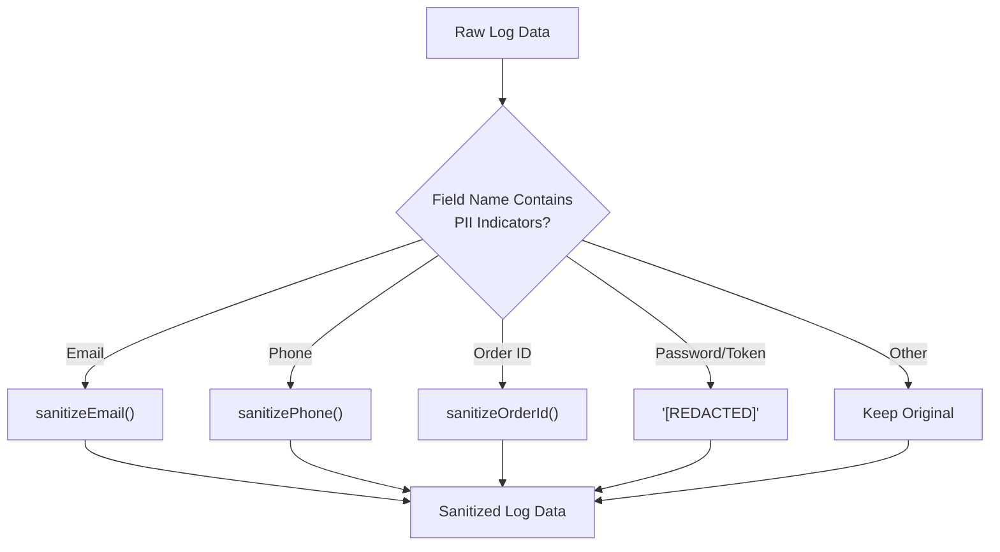

# Logger Utility

<cite>
**Referenced Files in This Document**
- [logger.ts](file://supabase/functions/_shared/logger.ts)
- [create-payment-intent/index.ts](file://supabase/functions/create-payment-intent/index.ts)
- [send-otp/index.ts](file://supabase/functions/send-otp/index.ts)
- [ai-quote-generator/index.ts](file://supabase/functions/ai-quote-generator/index.ts)
- [email-service/index.ts](file://supabase/functions/email-service/index.ts)
- [analytics-service/index.ts](file://supabase/functions/analytics-service/index.ts)
</cite>

## Table of Contents
1. [Introduction](#introduction)
2. [Core Architecture](#core-architecture)
3. [Logger Class Implementation](#logger-class-implementation)
4. [PII Sanitization Functions](#pii-sanitization-functions)
5. [Structured Logging Format](#structured-logging-format)
6. [Factory Function](#factory-function)
7. [Usage Patterns in Serverless Functions](#usage-patterns-in-serverless-functions)
8. [Security Considerations](#security-considerations)
9. [Performance Implications](#performance-implications)
10. [Best Practices](#best-practices)
11. [Error Handling](#error-handling)
12. [Integration with Supabase Infrastructure](#integration-with-supabase-infrastructure)
13. [Troubleshooting Guide](#troubleshooting-guide)

## Introduction

The Sleek Apparels logger utility is a comprehensive structured logging solution designed specifically for serverless functions in the Supabase ecosystem. It provides robust PII (Personally Identifiable Information) sanitization, standardized log formatting, and context-aware logging capabilities essential for production-grade applications.

The logger serves as a centralized logging mechanism that ensures sensitive data is automatically redacted while maintaining full debuggability for development and monitoring purposes. It integrates seamlessly with Supabase's logging infrastructure and provides consistent logging patterns across all serverless functions.

## Core Architecture

The logger utility follows a modular architecture with clear separation of concerns:



**Diagram sources**
- [logger.ts](file://supabase/functions/_shared/logger.ts#L6-L173)

**Section sources**
- [logger.ts](file://supabase/functions/_shared/logger.ts#L1-L173)

## Logger Class Implementation

The Logger class provides four primary log levels, each serving specific operational purposes:

### INFO Level Logging
Used for general operational messages that provide insight into system behavior without indicating problems or successes.

### WARN Level Logging  
Used for recoverable issues or conditions that may require attention but don't prevent normal operation.

### ERROR Level Logging
Reserved for failures, exceptions, and critical issues that impact system functionality. Includes comprehensive error context and stack traces.

### SUCCESS Level Logging
Used to mark completed operations and successful outcomes, providing clear visibility into positive system events.



**Diagram sources**
- [logger.ts](file://supabase/functions/_shared/logger.ts#L103-L113)
- [logger.ts](file://supabase/functions/_shared/logger.ts#L119-L129)
- [logger.ts](file://supabase/functions/_shared/logger.ts#L135-L147)
- [logger.ts](file://supabase/functions/_shared/logger.ts#L153-L163)

**Section sources**
- [logger.ts](file://supabase/functions/_shared/logger.ts#L93-L173)

## PII Sanitization Functions

The logger includes sophisticated PII sanitization functions that automatically redact sensitive information from logs:

### Email Sanitization
Redacts email addresses by showing only the first three characters of the local part and preserving the domain structure.

### Phone Number Sanitization  
Preserves the prefix and suffix while masking intermediate digits, maintaining enough context for identification while protecting privacy.

### Order ID Sanitization
Shortens UUIDs and order identifiers, keeping the beginning portion for correlation while hiding the full identifier.

### Automatic Field Detection
The sanitizer automatically detects and processes common PII field names including email, phone, order ID, password, tokens, and secrets.



**Diagram sources**
- [logger.ts](file://supabase/functions/_shared/logger.ts#L61-L81)

**Section sources**
- [logger.ts](file://supabase/functions/_shared/logger.ts#L14-L81)

## Structured Logging Format

All logs follow a consistent JSON structure with standardized fields:

| Field | Type | Description | Example |
|-------|------|-------------|---------|
| `level` | string | Log severity level | `"INFO"`, `"WARN"`, `"ERROR"`, `"SUCCESS"` |
| `timestamp` | string | ISO 8601 formatted timestamp | `"2024-01-15T10:30:45.123Z"` |
| `context` | string | Function/module context identifier | `"create-payment-intent"` |
| `message` | string | Human-readable log message | `"Creating payment intent"` |
| `error` | string | Error message (ERROR level only) | `"Stripe API error"` |
| `stack` | string | Stack trace (ERROR level only) | `"Error: ..."` |
| Additional fields | any | Contextual data (automatically sanitized) | `{orderId: "abc123", amount: 100}` |

The structured format enables efficient log parsing, filtering, and analysis in production monitoring systems.

**Section sources**
- [logger.ts](file://supabase/functions/_shared/logger.ts#L103-L163)

## Factory Function

The `createLogger` factory function provides a clean interface for creating context-specific logger instances:

```typescript
// Basic usage
const logger = createLogger('create-payment-intent');

// Usage with custom context
const analyticsLogger = createLogger('analytics-service');
```

The factory function ensures consistent logger creation patterns and allows for easy mocking in testing scenarios.

**Section sources**
- [logger.ts](file://supabase/functions/_shared/logger.ts#L169-L173)

## Usage Patterns in Serverless Functions

The logger is extensively used across various serverless functions in the Sleek Apparels ecosystem:

### Payment Processing
Payment functions utilize the logger for transaction tracking, security monitoring, and error reporting:

```typescript
// Security logging during payment processing
logger.error('Unauthorized payment attempt', null, { 
  userId: user.id, 
  orderId: sanitizeOrderId(orderId),
  orderBuyerId: order.buyer_id
});
```

### OTP Generation and Verification
Authentication flows include comprehensive logging for security auditing and debugging:

```typescript
// Authentication flow logging
logger.info('Phone OTP request', { phone: maskPhone(phone) });
logger.success('Phone OTP generated', { phone: maskPhone(phone) });
```

### Email Service Operations
Email delivery tracking includes retry logic and error handling:

```typescript
// Email delivery logging
logger.error('Resend API error', emailResponse.error, { 
  email: maskEmail(sanitizedEmail) 
});
```

### AI Service Integration
AI-powered functions include detailed logging for cost tracking and performance monitoring:

```typescript
// AI usage logging
logger.logAIUsage(sessionId, userId, estimatedCost, requestData);
```

**Section sources**
- [create-payment-intent/index.ts](file://supabase/functions/create-payment-intent/index.ts#L88-L279)
- [send-otp/index.ts](file://supabase/functions/send-otp/index.ts#L118-L488)

## Security Considerations

The logger implements several security measures to protect sensitive information:

### Automatic PII Redaction
Sensitive data is automatically identified and redacted based on field name patterns, preventing accidental exposure of personal information.

### Context Isolation
Each logger instance operates with a specific context, enabling granular access control and audit trails.

### Error Message Sanitization
Error messages are automatically sanitized to prevent information disclosure while maintaining debugging capability.

### Secure Timestamp Generation
Timestamps are generated using the system clock with proper timezone handling to prevent timing attacks.

**Section sources**
- [logger.ts](file://supabase/functions/_shared/logger.ts#L61-L81)

## Performance Implications

The logger is designed with performance considerations for serverless environments:

### Minimal Overhead
JSON serialization occurs only when logging, minimizing CPU overhead during normal execution.

### Asynchronous Processing
Log output is written synchronously to console, leveraging Node.js runtime optimizations.

### Memory Efficiency
Log data is processed in-place without creating unnecessary intermediate objects.

### Context Reuse
Logger instances maintain context internally, reducing memory allocation for repeated logging calls.

**Section sources**
- [logger.ts](file://supabase/functions/_shared/logger.ts#L86-L173)

## Best Practices

### Context Naming Conventions
Use descriptive, hierarchical context names that reflect the function's purpose:

- `create-payment-intent`
- `email-service/quote-notification`
- `analytics-service/order-insights`

### Log Message Composition
Write clear, actionable log messages that provide sufficient context for debugging:

```typescript
// Good: Descriptive and actionable
logger.info('Processing order payment', { 
  orderId: sanitizeOrderId(orderId), 
  amount: `$${(amount/100).toFixed(2)}`,
  paymentType: paymentType 
});

// Avoid: Generic messages
logger.info('Processing');
```

### Error Handling Patterns
Always include relevant context when logging errors:

```typescript
try {
  // Operation that might fail
} catch (error) {
  logger.error('Payment processing failed', error, { 
    orderId: sanitizeOrderId(orderId),
    userId: user?.id
  });
}
```

### Data Sanitization
The logger automatically handles PII sanitization, but be aware of custom data structures that might contain sensitive information.

**Section sources**
- [create-payment-intent/index.ts](file://supabase/functions/create-payment-intent/index.ts#L88-L279)
- [send-otp/index.ts](file://supabase/functions/send-otp/index.ts#L118-L488)

## Error Handling

The logger provides robust error handling mechanisms:

### Graceful Degradation
If logging fails, the application continues normal operation without interruption.

### Error Context Preservation
Error logs include comprehensive context including stack traces and sanitized data.

### Retry Logic Integration
Logging functions can be integrated with retry mechanisms for critical operations.

### Monitoring Integration
Structured logs enable effective monitoring and alerting based on log patterns and error frequencies.

**Section sources**
- [create-payment-intent/index.ts](file://supabase/functions/create-payment-intent/index.ts#L279-L288)
- [send-otp/index.ts](file://supabase/functions/send-otp/index.ts#L480-L489)

## Integration with Supabase Infrastructure

The logger integrates seamlessly with Supabase's serverless platform:

### Function Context
Each serverless function receives its own logger instance with appropriate context.

### Environment Variables
The logger respects Supabase environment variable patterns for configuration.

### Deployment Compatibility
The logger works consistently across different deployment environments and regions.

### Monitoring Integration
Logs are automatically captured by Supabase's monitoring infrastructure for analysis.

**Section sources**
- [ai-quote-generator/index.ts](file://supabase/functions/ai-quote-generator/index.ts#L136-L753)
- [email-service/index.ts](file://supabase/functions/email-service/index.ts#L186-L555)
- [analytics-service/index.ts](file://supabase/functions/analytics-service/index.ts#L29-L220)

## Troubleshooting Guide

### Common Issues and Solutions

#### Logger Not Available
**Problem**: Logger functions are not recognized
**Solution**: Ensure proper import statement:
```typescript
import { createLogger } from '../_shared/logger.ts';
```

#### PII Not Being Sanitized
**Problem**: Sensitive data appears in logs
**Solution**: Verify field names contain PII indicators (email, phone, order_id, etc.)

#### Context Not Set
**Problem**: Logs lack context information
**Solution**: Create logger with appropriate context:
```typescript
const logger = createLogger('function-name');
```

#### Performance Issues
**Problem**: Logging causing performance degradation
**Solution**: Review log frequency and ensure minimal data in log entries

#### Missing Error Information
**Problem**: Error logs lack sufficient context
**Solution**: Include relevant data in error logs:
```typescript
logger.error('Operation failed', error, { contextData });
```

### Debugging Tips

1. **Enable Verbose Logging**: Temporarily increase log levels for debugging
2. **Check Context Names**: Verify context names match function names
3. **Validate PII Detection**: Test PII sanitization with sample data
4. **Monitor Log Volume**: Ensure logging doesn't overwhelm monitoring systems

**Section sources**
- [logger.ts](file://supabase/functions/_shared/logger.ts#L169-L173)