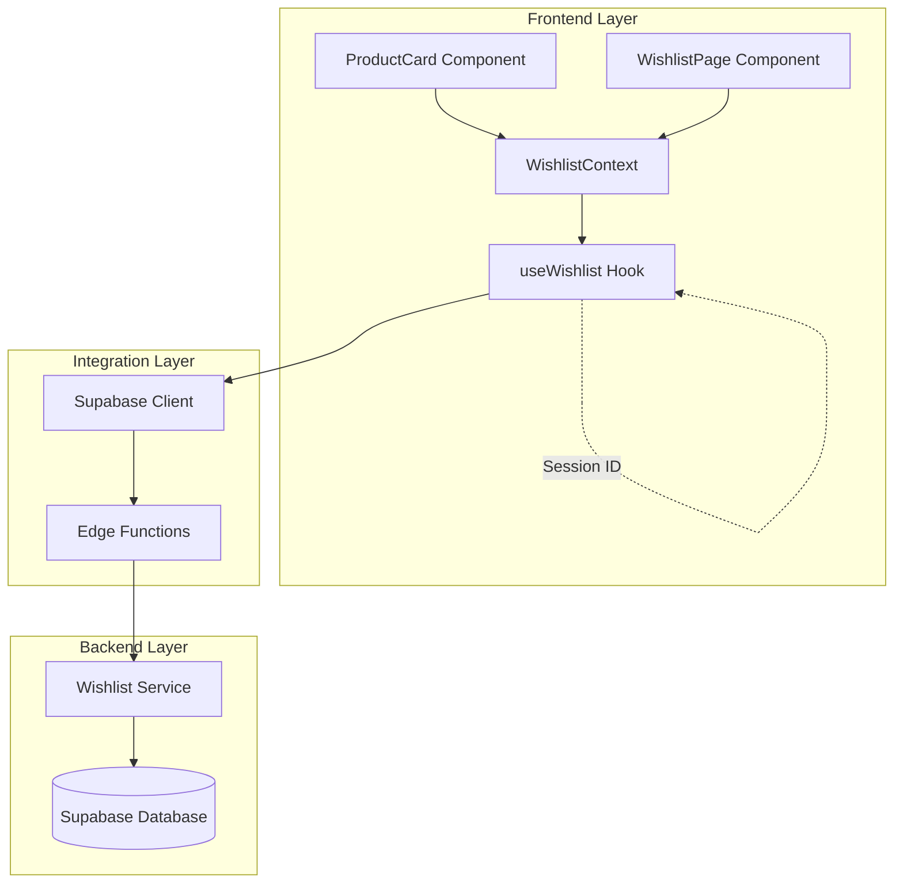
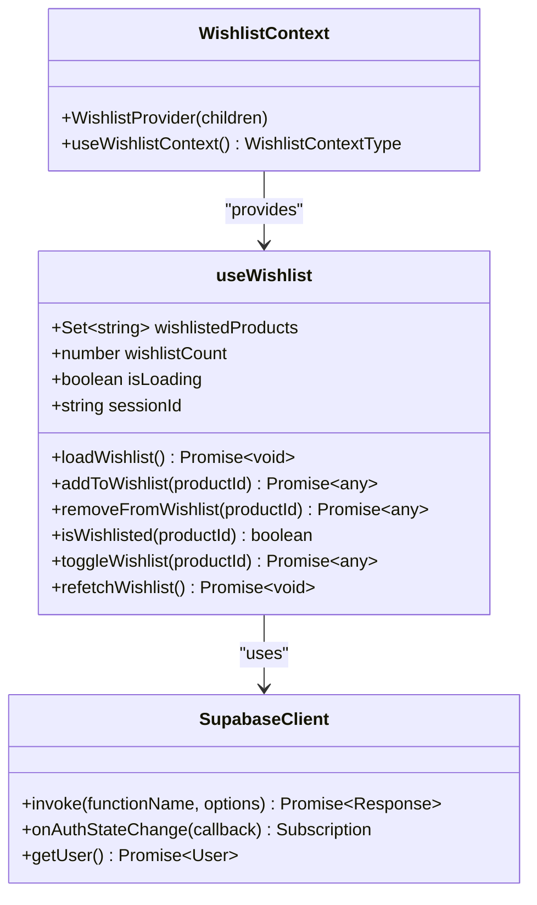
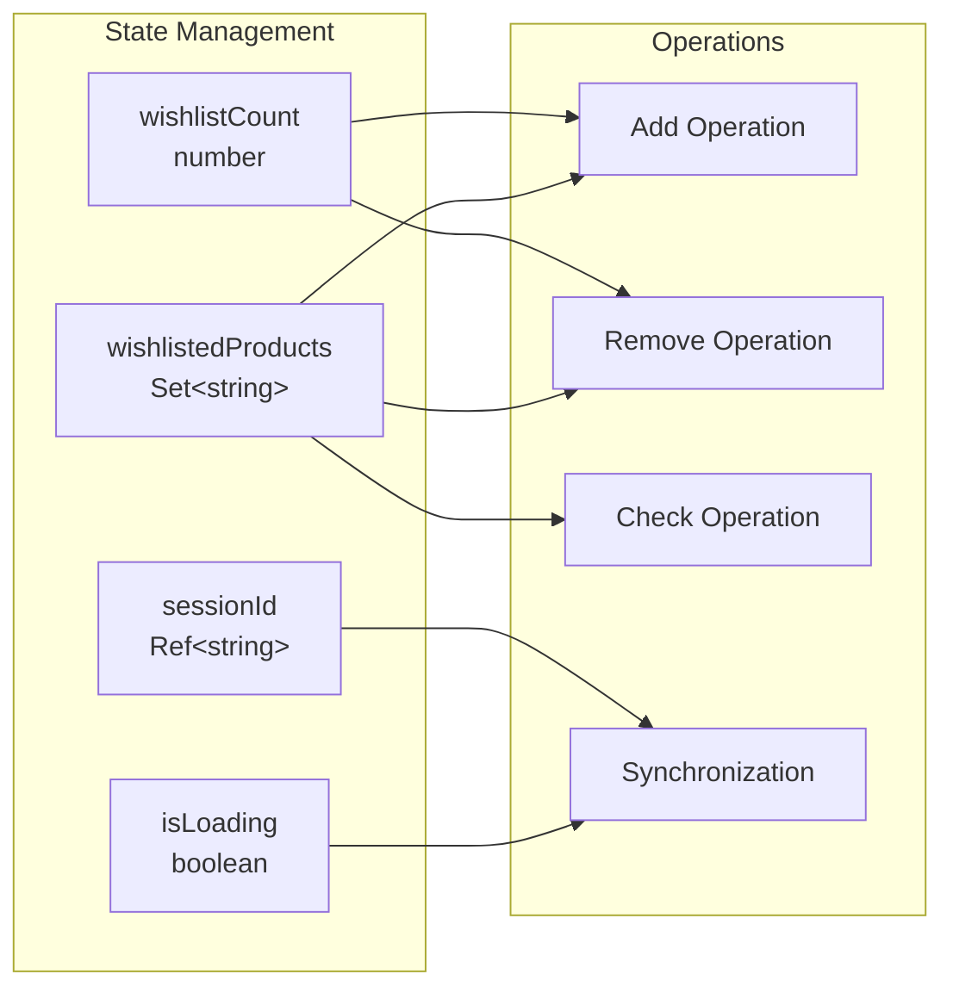
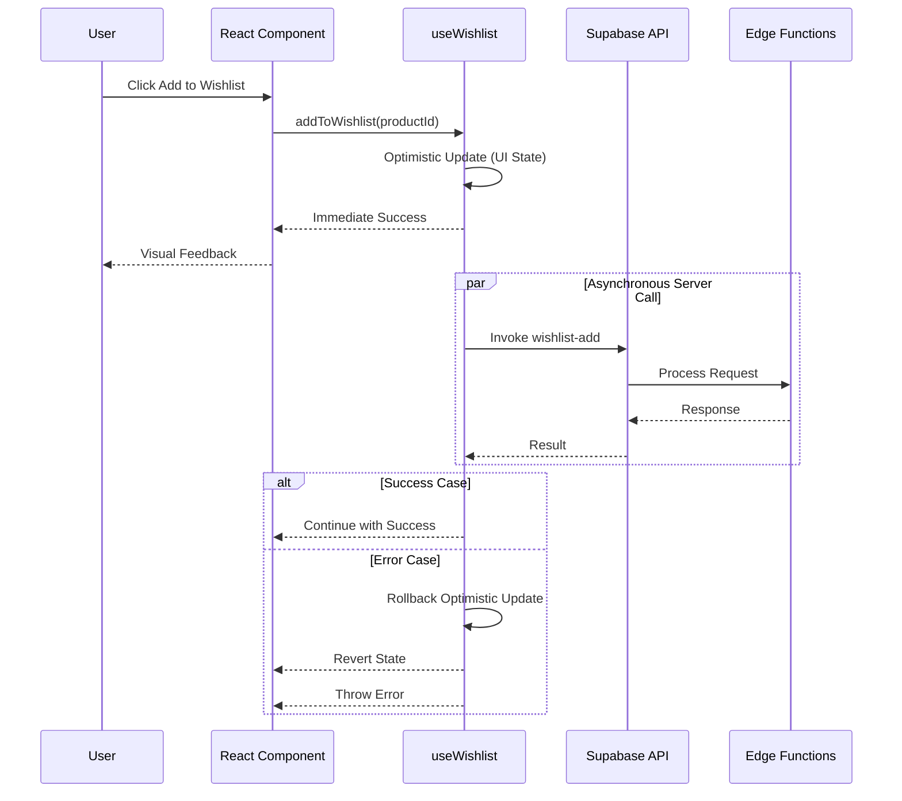
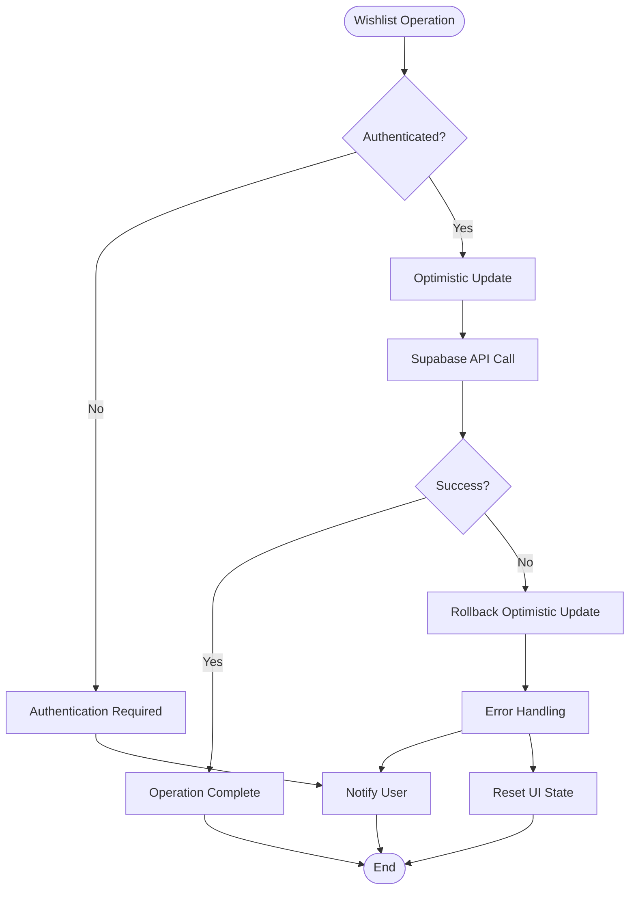

# Frontend Integration with useWishlist Hook

<cite>
**Referenced Files in This Document**
- [src/hooks/useWishlist.ts](file://src/hooks/useWishlist.ts)
- [src/contexts/WishlistContext.tsx](file://src/contexts/WishlistContext.tsx)
- [src/components/products/ProductCard.tsx](file://src/components/products/ProductCard.tsx)
- [src/pages/Wishlist.tsx](file://src/pages/Wishlist.tsx)
- [src/integrations/supabase/client.ts](file://src/integrations/supabase/client.ts)
- [supabase/functions/wishlist-get/index.ts](file://supabase/functions/wishlist-get/index.ts)
- [supabase/functions/wishlist-add/index.ts](file://supabase/functions/wishlist-add/index.ts)
- [supabase/functions/wishlist-remove/index.ts](file://supabase/functions/wishlist-remove/index.ts)
- [supabase/functions/wishlist-check/index.ts](file://supabase/functions/wishlist-check/index.ts)
- [src/App.tsx](file://src/App.tsx)
</cite>

## Table of Contents
1. [Introduction](#introduction)
2. [Architecture Overview](#architecture-overview)
3. [Core Components](#core-components)
4. [State Management Pattern](#state-management-pattern)
5. [Optimistic Update Strategy](#optimistic-update-strategy)
6. [Integration Patterns](#integration-patterns)
7. [Best Practices](#best-practices)
8. [Error Handling and Recovery](#error-handling-and-recovery)
9. [Performance Considerations](#performance-considerations)
10. [Troubleshooting Guide](#troubleshooting-guide)

## Introduction

The useWishlist custom hook serves as the primary interface between React components and the Supabase wishlist functionality in the Sleek Apparels platform. This comprehensive integration enables seamless wishlist management with real-time synchronization, optimistic updates, and robust error handling. The system provides a unified state management solution that enhances user experience through immediate feedback while maintaining data consistency.

The hook integrates with Supabase Edge Functions for server-side operations, implements sophisticated caching strategies, and provides multiple consumption patterns through both direct hook usage and context-based access. This architecture ensures optimal performance while delivering a responsive user experience across all wishlist-related interactions.

## Architecture Overview

The wishlist integration follows a layered architecture pattern that separates concerns between presentation, business logic, and data persistence layers.



**Diagram sources**
- [src/hooks/useWishlist.ts](file://src/hooks/useWishlist.ts#L4-L131)
- [src/contexts/WishlistContext.tsx](file://src/contexts/WishlistContext.tsx#L17-L33)
- [src/integrations/supabase/client.ts](file://src/integrations/supabase/client.ts#L14-L20)

The architecture implements several key design patterns:

- **Hook Composition Pattern**: Centralized state management through custom hooks
- **Provider Pattern**: Global state access through React Context
- **Observer Pattern**: Real-time synchronization via Supabase auth events
- **Command Pattern**: Structured wishlist operations (add, remove, toggle)

## Core Components

### useWishlist Hook Implementation

The useWishlist hook serves as the central orchestrator for all wishlist functionality, managing both local state and remote synchronization.



**Diagram sources**
- [src/hooks/useWishlist.ts](file://src/hooks/useWishlist.ts#L4-L131)
- [src/contexts/WishlistContext.tsx](file://src/contexts/WishlistContext.tsx#L17-L33)

**Section sources**
- [src/hooks/useWishlist.ts](file://src/hooks/useWishlist.ts#L4-L131)
- [src/contexts/WishlistContext.tsx](file://src/contexts/WishlistContext.tsx#L1-L33)

### Exported Functions

The hook exposes seven primary functions that provide comprehensive wishlist management capabilities:

| Function | Purpose | Return Type | Optimistic Update |
|----------|---------|-------------|-------------------|
| `addToWishlist` | Adds product to wishlist | `Promise<any>` | Yes |
| `removeFromWishlist` | Removes product from wishlist | `Promise<any>` | Yes |
| `isWishlisted` | Checks if product is in wishlist | `boolean` | No |
| `toggleWishlist` | Toggles product wishlist status | `Promise<any>` | Yes |
| `refetchWishlist` | Reloads wishlist data | `Promise<void>` | No |
| `wishlistedProducts` | Current wishlist set | `Set<string>` | Reactive |
| `wishlistCount` | Number of wishlist items | `number` | Reactive |

Each function is designed with specific responsibilities and error handling characteristics, ensuring predictable behavior across different usage scenarios.

## State Management Pattern

The useWishlist hook implements a sophisticated state management pattern using React's useState hook with specialized data structures for optimal performance.

### Data Structure Design



**Diagram sources**
- [src/hooks/useWishlist.ts](file://src/hooks/useWishlist.ts#L5-L8)

### State Initialization

The hook initializes four distinct state variables:

1. **wishlistedProducts**: A Set<string> containing all product IDs currently in the user's wishlist
2. **wishlistCount**: A numeric counter representing the total number of items in the wishlist
3. **isLoading**: A boolean flag indicating whether wishlist data is being loaded
4. **sessionId**: A cryptographically random UUID for session identification and debugging

This design choice provides O(1) lookup performance for the `isWishlisted` operation and maintains referential stability for efficient re-renders.

**Section sources**
- [src/hooks/useWishlist.ts](file://src/hooks/useWishlist.ts#L5-L8)

## Optimistic Update Strategy

The wishlist system implements an aggressive optimistic update strategy to enhance perceived performance and user experience during wishlist operations.

### Optimistic Update Flow



**Diagram sources**
- [src/hooks/useWishlist.ts](file://src/hooks/useWishlist.ts#L53-L78)
- [src/hooks/useWishlist.ts](file://src/hooks/useWishlist.ts#L81-L106)

### Implementation Details

The optimistic update strategy operates through several mechanisms:

#### Immediate UI Feedback
- **Visual State Changes**: Components immediately reflect the new state
- **Loading Indicators**: Operations show loading states during processing
- **Immediate Reactions**: User actions produce instant visual responses

#### Automatic Rollback
- **Error Detection**: Network failures trigger automatic state restoration
- **Consistency Maintenance**: UI state remains synchronized with server state
- **User Experience Preservation**: No confusing visual inconsistencies

#### Performance Benefits
- **Reduced Latency Perception**: Users perceive faster response times
- **Improved Responsiveness**: Components remain interactive during operations
- **Enhanced User Confidence**: Immediate feedback builds trust in the system

**Section sources**
- [src/hooks/useWishlist.ts](file://src/hooks/useWishlist.ts#L53-L106)

## Integration Patterns

### Direct Hook Usage

Components can consume the useWishlist hook directly for localized wishlist management:

```typescript
// Example integration pattern
const ProductCard = ({ product }: { product: Product }) => {
  const { isWishlisted, toggleWishlist } = useWishlist();
  
  const handleWishlistToggle = async () => {
    try {
      await toggleWishlist(product.id);
      // Handle success (toast, analytics, etc.)
    } catch (error) {
      // Handle error (rollback UI state)
    }
  };
};
```

### Context Provider Pattern

The WishlistContext provides global access to wishlist state across the application:

```typescript
// Provider setup in App.tsx
const App = () => (
  <QueryClientProvider client={queryClient}>
    <WishlistProvider>
      {/* Application routes */}
    </WishlistProvider>
  </QueryClientProvider>
);
```

### Component Integration Examples

#### ProductCard Integration
The ProductCard component demonstrates comprehensive wishlist integration with authentication checks, loading states, and error handling.

**Section sources**
- [src/components/products/ProductCard.tsx](file://src/components/products/ProductCard.tsx#L24-L65)
- [src/contexts/WishlistContext.tsx](file://src/contexts/WishlistContext.tsx#L17-L33)

#### WishlistPage Integration
The WishlistPage component showcases bulk operations and comprehensive state management.

**Section sources**
- [src/pages/Wishlist.tsx](file://src/pages/Wishlist.tsx#L47-L98)

## Best Practices

### Component-Level Consumption

When integrating with the useWishlist hook, follow these best practices:

#### Authentication Validation
Always check user authentication before performing wishlist operations:

```typescript
const handleWishlistClick = async (e: React.MouseEvent) => {
  const { data: { user } } = await supabase.auth.getUser();
  if (!user) {
    toast({
      title: "Sign in required",
      description: "Please sign in to save items to your wishlist"
    });
    return;
  }
  
  // Proceed with wishlist operation
};
```

#### Loading State Management
Implement appropriate loading states to prevent user confusion:

```typescript
const [isWishlistLoading, setIsWishlistLoading] = useState(false);

// During operations
setIsWishlistLoading(true);
try {
  await toggleWishlist(productId);
} finally {
  setIsWishlistLoading(false);
}
```

#### Error Handling
Provide meaningful error messages and recovery options:

```typescript
try {
  await toggleWishlist(productId);
  toast({
    title: isWishlisted(productId) ? "Removed from wishlist" : "Added to wishlist",
    description: `${product.title} ${isWishlisted(productId) ? "removed" : "saved"} to your wishlist`
  });
} catch (error) {
  toast({
    title: "Error",
    description: "Failed to update wishlist. Please try again.",
    variant: "destructive"
  });
}
```

### Performance Optimization

#### Efficient State Updates
Use the Set data structure for O(1) lookup operations and immutable update patterns:

```typescript
// Optimized state updates
setWishlistedProducts(prev => new Set([...prev, productId]));
setWishlistCount(prev => prev + 1);
```

#### Debounced Operations
Consider debouncing frequent wishlist operations to reduce API calls:

```typescript
const debouncedToggle = useCallback(debounce(toggleWishlist, 300), [toggleWishlist]);
```

#### Selective Re-rendering
Leverage React.memo and useMemo for expensive computations:

```typescript
const isProductWishlisted = useMemo(() => isWishlisted(productId), [productId]);
```

## Error Handling and Recovery

### Comprehensive Error Management

The wishlist system implements multi-layered error handling to ensure robust operation under various failure conditions.



**Diagram sources**
- [src/hooks/useWishlist.ts](file://src/hooks/useWishlist.ts#L53-L106)

### Error Categories and Responses

| Error Type | Cause | Response Strategy | User Impact |
|------------|-------|-------------------|-------------|
| Authentication | User not logged in | Redirect to login | Immediate feedback |
| Network | Connection timeout | Retry with exponential backoff | Loading indicator |
| Server | API failure | Rollback optimistic update | Seamless recovery |
| Validation | Invalid product ID | Show error message | Clear guidance |
| Rate Limiting | Too many requests | Inform user and suggest retry | Fair usage enforcement |

### Recovery Mechanisms

#### Automatic State Synchronization
The system automatically synchronizes state when authentication changes or network connectivity is restored.

#### Manual Refresh Capability
Users can manually refresh their wishlist through the `refetchWishlist` function.

#### Graceful Degradation
When wishlist functionality fails, the system continues operating with reduced features rather than complete failure.

**Section sources**
- [src/hooks/useWishlist.ts](file://src/hooks/useWishlist.ts#L38-L51)
- [src/hooks/useWishlist.ts](file://src/hooks/useWishlist.ts#L129-L131)

## Performance Considerations

### Optimization Strategies

#### Efficient Data Structures
The use of Set<string> for wishlistedProducts provides optimal lookup performance with O(1) complexity for membership testing.

#### Minimal Re-renders
State updates are designed to minimize unnecessary component re-renders through careful selection of state granularity.

#### Lazy Loading
Wishlist data is loaded on-demand and cached appropriately to balance performance and freshness.

#### Concurrent Operations
Multiple wishlist operations can occur concurrently without blocking the UI thread.

### Monitoring and Metrics

The system tracks several performance metrics:

- **Operation Latency**: Time taken for wishlist operations
- **Success Rates**: Percentage of successful operations
- **Error Rates**: Frequency of various error types
- **Cache Hit Rates**: Effectiveness of optimistic updates

### Scalability Factors

- **Database Constraints**: UNIQUE constraints prevent duplicate entries
- **Rate Limiting**: Built-in protection against abuse
- **Pagination**: Efficient handling of large wishlists
- **Caching**: Strategic caching of frequently accessed data

## Troubleshooting Guide

### Common Issues and Solutions

#### Issue: Wishlist Not Loading
**Symptoms**: Empty wishlist despite having saved items
**Causes**: 
- Authentication issues
- Network connectivity problems
- Server-side errors

**Solutions**:
1. Verify user authentication status
2. Check network connectivity
3. Review browser console for error messages
4. Use `refetchWishlist()` to reload data

#### Issue: Add/Remove Operations Fail
**Symptoms**: UI shows success but wishlist doesn't change
**Causes**:
- Network timeouts
- Server-side validation failures
- Rate limiting

**Solutions**:
1. Implement retry logic with exponential backoff
2. Check product existence before adding
3. Monitor rate limit headers
4. Provide user-friendly error messages

#### Issue: State Inconsistencies
**Symptoms**: UI shows incorrect wishlist state
**Causes**:
- Optimistic update rollbacks
- Race conditions
- Synchronization delays

**Solutions**:
1. Implement proper loading states
2. Use atomic operations where possible
3. Refresh state after critical operations
4. Monitor for concurrent modification conflicts

### Debugging Tools

#### Session ID Tracking
The `sessionId` field provides unique identification for debugging purposes:

```typescript
console.log('Session ID:', sessionId.current);
```

#### State Inspection
Monitor the complete wishlist state:

```typescript
console.log('Wishlist State:', {
  products: Array.from(wishlistedProducts),
  count: wishlistCount,
  loading: isLoading
});
```

#### Network Monitoring
Track API call performance and errors:

```typescript
const startTime = Date.now();
try {
  await addToWishlist(productId);
  console.log('Operation took:', Date.now() - startTime, 'ms');
} catch (error) {
  console.error('Operation failed after:', Date.now() - startTime, 'ms');
}
```

**Section sources**
- [src/hooks/useWishlist.ts](file://src/hooks/useWishlist.ts#L8)

### Development Best Practices

#### Testing Strategies
- Unit tests for individual hook functions
- Integration tests for complete workflows
- Mock Supabase API responses
- Test error handling scenarios

#### Development Environment
- Enable Supabase debug logging
- Use React Developer Tools for state inspection
- Monitor network requests in browser dev tools
- Implement comprehensive error boundaries

#### Production Monitoring
- Track wishlist operation success rates
- Monitor authentication state changes
- Log performance metrics
- Implement user feedback collection