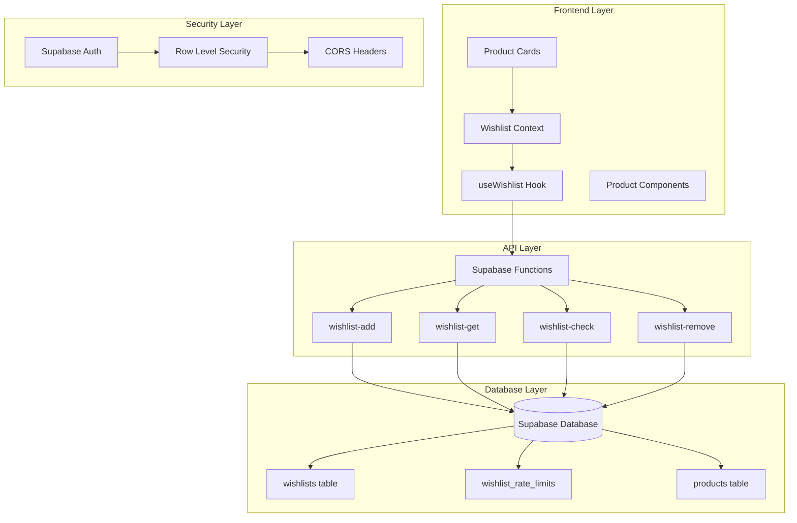
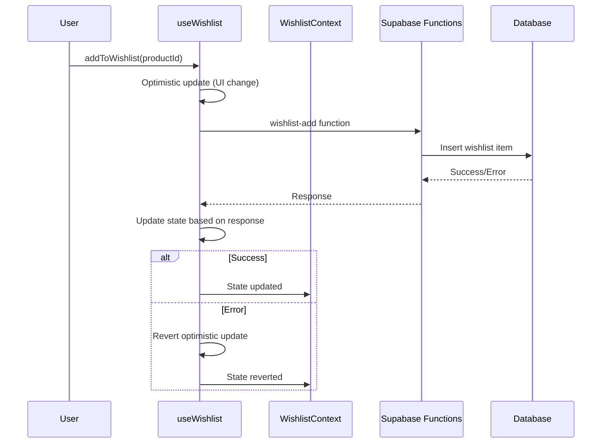
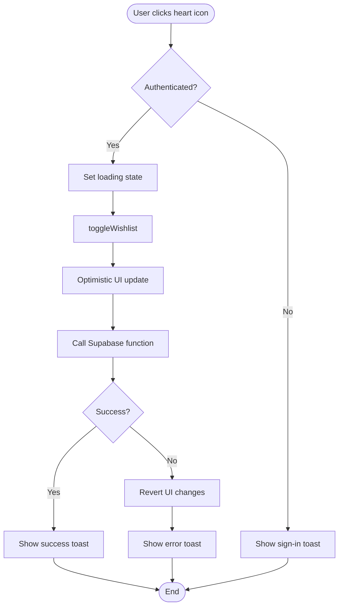
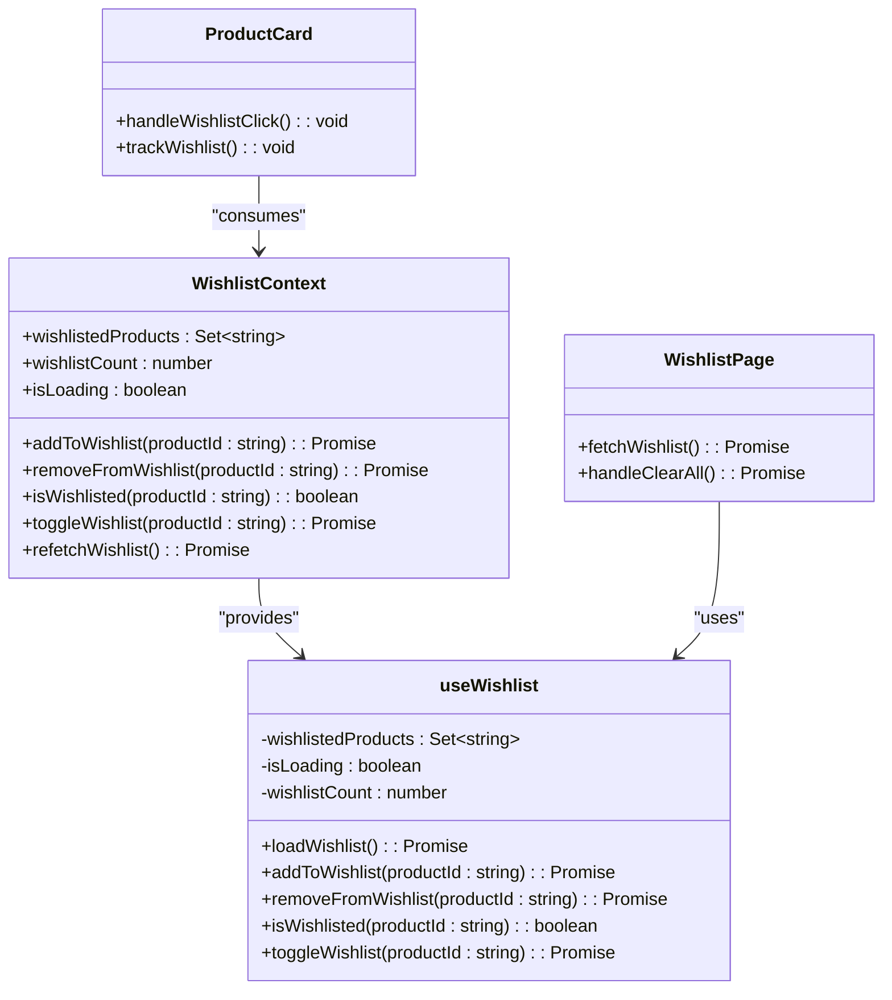
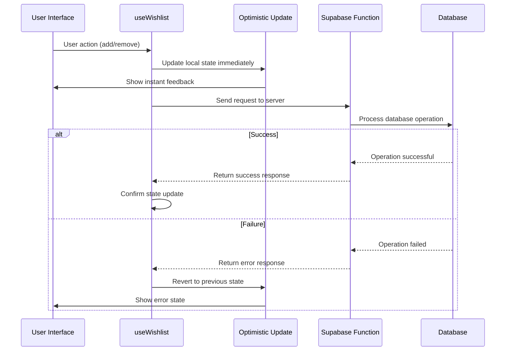
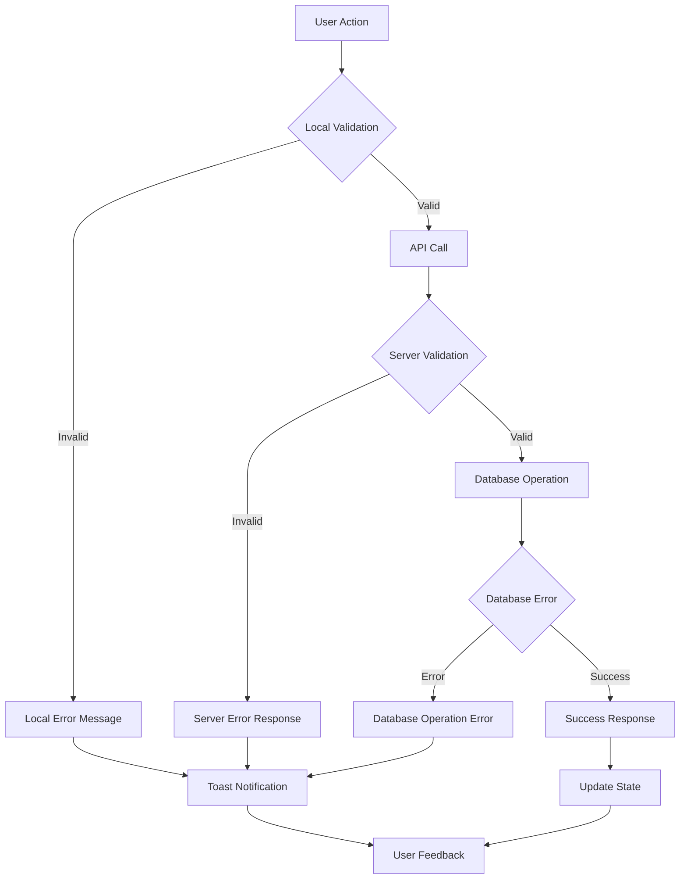
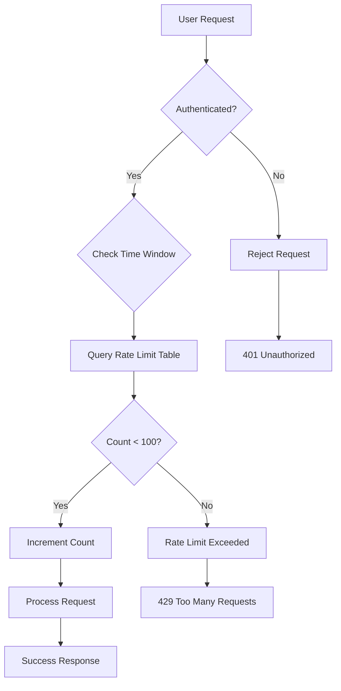
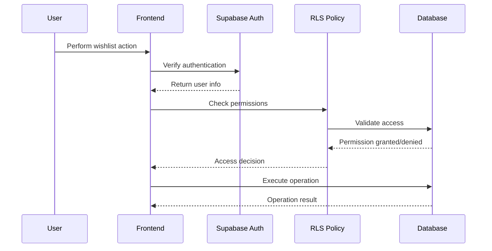

# Wishlist API Documentation

<cite>
**Referenced Files in This Document**
- [useWishlist.ts](file://src/hooks/useWishlist.ts)
- [WishlistContext.tsx](file://src/contexts/WishlistContext.tsx)
- [Wishlist.tsx](file://src/pages/Wishlist.tsx)
- [ProductCard.tsx](file://src/components/products/ProductCard.tsx)
- [useOptimisticUpdate.ts](file://src/hooks/useOptimisticUpdate.ts)
- [wishlist-add/index.ts](file://supabase/functions/wishlist-add/index.ts)
- [wishlist-get/index.ts](file://supabase/functions/wishlist-get/index.ts)
- [wishlist-check/index.ts](file://supabase/functions/wishlist-check/index.ts)
- [wishlist-remove/index.ts](file://supabase/functions/wishlist-remove/index.ts)
- [20251117020514_e6a1c666-2b44-4cb6-ae66-ddf46a3d8814.sql](file://supabase/migrations/20251117020514_e6a1c666-2b44-4cb6-ae66-ddf46a3d8814.sql)
</cite>

## Table of Contents
1. [Introduction](#introduction)
2. [System Architecture](#system-architecture)
3. [Serverless Functions](#serverless-functions)
4. [Frontend Implementation](#frontend-implementation)
5. [State Management](#state-management)
6. [Optimistic Updates](#optimistic-updates)
7. [Error Handling](#error-handling)
8. [Rate Limiting](#rate-limiting)
9. [Security Implementation](#security-implementation)
10. [Performance Considerations](#performance-considerations)
11. [Troubleshooting Guide](#troubleshooting-guide)
12. [Best Practices](#best-practices)

## Introduction

The Wishlist API provides a comprehensive product saving and management system for the Sleek Apparels marketplace. It enables users to save products to their personal wishlists, with real-time synchronization and optimistic UI updates for enhanced user experience. The system consists of four serverless functions that handle CRUD operations for wishlisted products, backed by Supabase's real-time capabilities and robust security policies.

The wishlist functionality supports both authenticated and anonymous users, with persistent storage for logged-in users and session-based storage for guests. The system implements sophisticated error handling, rate limiting, and concurrent modification protection to ensure reliable operation under various network conditions.

## System Architecture

The wishlist system follows a modern serverless architecture with clear separation between frontend and backend concerns:



**Diagram sources**
- [useWishlist.ts](file://src/hooks/useWishlist.ts#L1-L132)
- [WishlistContext.tsx](file://src/contexts/WishlistContext.tsx#L1-L34)
- [wishlist-add/index.ts](file://supabase/functions/wishlist-add/index.ts#L1-L121)

**Section sources**
- [useWishlist.ts](file://src/hooks/useWishlist.ts#L1-L132)
- [WishlistContext.tsx](file://src/contexts/WishlistContext.tsx#L1-L34)

## Serverless Functions

The wishlist system consists of four core serverless functions deployed on Supabase Functions platform, each handling specific wishlist operations with comprehensive error handling and security measures.

### wishlist-add (POST)

Adds a product to the user's wishlist with optimistic UI updates and comprehensive validation.

**Endpoint:** `POST /functions/v1/wishlist-add`

**Request Format:**
```json
{
  "productId": "uuid-string"
}
```

**Response Format:**
```json
{
  "success": true,
  "message": "Product Title added to wishlist",
  "items": [
    {
      "id": "uuid",
      "product_id": "uuid",
      "created_at": "timestamp",
      "notes": null,
      "products": {
        "id": "uuid",
        "title": "Product Title",
        "description": "Product description",
        "price": 99.99,
        "image_url": "https://example.com/image.jpg",
        "category": "category-name",
        "moq": 50,
        "lead_time_days": 14,
        "colors": ["red", "blue"],
        "materials": ["cotton", "polyester"],
        "featured": false
      }
    }
  ],
  "count": 1
}
```

**Authentication Requirements:**
- User must be authenticated via Supabase Auth
- User ID must match the authenticated user
- Rate limiting applies (100 additions per hour)

**Error Responses:**
- `401 Unauthorized`: Authentication required
- `400 Bad Request`: Product ID is required
- `404 Not Found`: Product not found
- `429 Too Many Requests`: Rate limit exceeded
- `500 Internal Server Error`: General server error

**Section sources**
- [wishlist-add/index.ts](file://supabase/functions/wishlist-add/index.ts#L1-L121)

### wishlist-get (GET)

Retrieves all products in the user's wishlist with full product details and ordering.

**Endpoint:** `GET /functions/v1/wishlist-get`

**Response Format:**
```json
{
  "success": true,
  "items": [
    {
      "id": "uuid",
      "product_id": "uuid",
      "created_at": "timestamp",
      "notes": null,
      "products": {
        "id": "uuid",
        "title": "Product Title",
        "description": "Product description",
        "price": 99.99,
        "image_url": "https://example.com/image.jpg",
        "category": "category-name",
        "moq": 50,
        "lead_time_days": 14,
        "colors": ["red", "blue"],
        "materials": ["cotton", "polyester"],
        "featured": false
      }
    }
  ],
  "count": 1
}
```

**Authentication Requirements:**
- User must be authenticated
- Only user's own wishlist items are returned

**Error Responses:**
- `401 Unauthorized`: Authentication required
- `500 Internal Server Error`: Database query failed

**Section sources**
- [wishlist-get/index.ts](file://supabase/functions/wishlist-get/index.ts#L1-L85)

### wishlist-check (POST)

Bulk checks if multiple products are in the user's wishlist for efficient UI updates.

**Endpoint:** `POST /functions/v1/wishlist-check`

**Request Format:**
```json
{
  "productIds": ["uuid1", "uuid2", "uuid3"]
}
```

**Response Format:**
```json
{
  "success": true,
  "wishlisted": {
    "uuid1": true,
    "uuid2": false,
    "uuid3": true
  }
}
```

**Authentication Requirements:**
- User must be authenticated
- Validates all product IDs against user's wishlist

**Error Responses:**
- `401 Unauthorized`: Authentication required
- `400 Bad Request`: Product IDs array is required
- `500 Internal Server Error`: Database query failed

**Section sources**
- [wishlist-check/index.ts](file://supabase/functions/wishlist-check/index.ts#L1-L78)

### wishlist-remove (POST)

Removes a product from the user's wishlist with optimistic UI updates.

**Endpoint:** `POST /functions/v1/wishlist-remove`

**Request Format:**
```json
{
  "productId": "uuid-string"
}
```

**Response Format:**
```json
{
  "success": true,
  "message": "Removed from wishlist"
}
```

**Authentication Requirements:**
- User must be authenticated
- User ID must match the authenticated user

**Error Responses:**
- `401 Unauthorized`: Authentication required
- `400 Bad Request`: Product ID is required
- `500 Internal Server Error`: Database deletion failed

**Section sources**
- [wishlist-remove/index.ts](file://supabase/functions/wishlist-remove/index.ts#L1-L72)

## Frontend Implementation

The frontend implementation uses React hooks and context providers to create a seamless wishlist experience with real-time updates and optimistic UI modifications.

### useWishlist Hook

The core hook manages wishlist state, provides CRUD operations, and handles authentication events:



**Diagram sources**
- [useWishlist.ts](file://src/hooks/useWishlist.ts#L53-L78)
- [WishlistContext.tsx](file://src/contexts/WishlistContext.tsx#L17-L25)

**Key Features:**
- **Optimistic Updates**: Immediate UI feedback before server confirmation
- **Authentication Tracking**: Automatic reloads on login/logout
- **Error Recovery**: Automatic rollback on failed operations
- **Concurrent Modification Protection**: Prevents race conditions
- **Real-time Sync**: Maintains consistency across sessions

**Section sources**
- [useWishlist.ts](file://src/hooks/useWishlist.ts#L1-L132)

### ProductCard Integration

Individual product cards integrate with the wishlist system through the ProductCard component:



**Diagram sources**
- [ProductCard.tsx](file://src/components/products/ProductCard.tsx#L27-L64)

**Section sources**
- [ProductCard.tsx](file://src/components/products/ProductCard.tsx#L1-L200)

### Wishlist Page

The dedicated wishlist page displays all saved products with bulk operations:

**Key Features:**
- **Grid/List View**: Flexible product display options
- **Bulk Operations**: Clear all functionality
- **Real-time Count**: Dynamic wishlist item count
- **Empty State**: Graceful handling of empty wishlists
- **SEO Optimization**: Proper metadata for search engines

**Section sources**
- [Wishlist.tsx](file://src/pages/Wishlist.tsx#L1-L202)

## State Management

The wishlist system employs a sophisticated state management pattern using React Context and custom hooks for optimal performance and developer experience.

### State Architecture



**Diagram sources**
- [WishlistContext.tsx](file://src/contexts/WishlistContext.tsx#L4-L13)
- [useWishlist.ts](file://src/hooks/useWishlist.ts#L4-L131)

### State Synchronization

The system maintains state consistency through multiple mechanisms:

1. **Local State**: React state for immediate UI updates
2. **Server State**: Database persistence for data integrity
3. **Authentication Events**: Real-time sync on login/logout
4. **Function Calls**: Direct state updates from API responses

**Section sources**
- [WishlistContext.tsx](file://src/contexts/WishlistContext.tsx#L1-L34)
- [useWishlist.ts](file://src/hooks/useWishlist.ts#L37-L51)

## Optimistic Updates

The wishlist system implements sophisticated optimistic updates to provide instant user feedback while maintaining data integrity through automatic rollback mechanisms.

### Optimistic Update Pattern



**Diagram sources**
- [useWishlist.ts](file://src/hooks/useWishlist.ts#L53-L78)
- [useOptimisticUpdate.ts](file://src/hooks/useOptimisticUpdate.ts#L26-L66)

### Race Condition Prevention

The system prevents race conditions through several mechanisms:

1. **Unique Constraints**: Database-level prevention of duplicate entries
2. **Atomic Operations**: Single database transactions for add/remove operations
3. **State Locking**: Preventing simultaneous updates to the same product
4. **Conflict Resolution**: Automatic rollback on detected conflicts

### Error Recovery

When optimistic updates fail, the system automatically reverts to the previous state:

**Recovery Process:**
1. **Error Detection**: Catch API errors and validation failures
2. **State Restoration**: Restore previous state values
3. **User Notification**: Inform user of the failure
4. **Retry Options**: Allow user to retry the operation

**Section sources**
- [useWishlist.ts](file://src/hooks/useWishlist.ts#L53-L106)
- [useOptimisticUpdate.ts](file://src/hooks/useOptimisticUpdate.ts#L1-L95)

## Error Handling

The wishlist system implements comprehensive error handling at multiple levels to ensure graceful degradation and user-friendly error communication.

### Multi-Level Error Handling



**Diagram sources**
- [wishlist-add/index.ts](file://supabase/functions/wishlist-add/index.ts#L25-L120)
- [useWishlist.ts](file://src/hooks/useWishlist.ts#L58-L78)

### Error Categories

**Frontend Errors:**
- Authentication failures
- Network connectivity issues
- Invalid product IDs
- Rate limiting violations

**Backend Errors:**
- Database constraint violations
- Product not found
- User not authorized
- Server timeouts

**Error Response Formats:**

| Status Code | Error Type | Response Format |
|-------------|------------|-----------------|
| 401 | Authentication | `{ success: false, message: "Authentication required" }` |
| 400 | Validation | `{ success: false, message: "Product ID is required" }` |
| 404 | Not Found | `{ success: false, message: "Product not found" }` |
| 429 | Rate Limit | `{ success: false, message: "Rate limit exceeded" }` |
| 500 | Server Error | `{ success: false, message: "Internal server error" }` |

**Section sources**
- [wishlist-add/index.ts](file://supabase/functions/wishlist-add/index.ts#L28-L120)
- [wishlist-get/index.ts](file://supabase/functions/wishlist-get/index.ts#L28-L84)
- [wishlist-check/index.ts](file://supabase/functions/wishlist-check/index.ts#L28-L77)
- [wishlist-remove/index.ts](file://supabase/functions/wishlist-remove/index.ts#L28-L71)

## Rate Limiting

The wishlist system implements intelligent rate limiting to prevent abuse while maintaining good user experience.

### Rate Limiting Implementation



**Diagram sources**
- [wishlist-add/index.ts](file://supabase/functions/wishlist-add/index.ts#L44-L71)

### Rate Limiting Details

**Configuration:**
- **Limit**: 100 wishlist additions per hour
- **Window**: Rolling 60-minute window
- **Scope**: Per-user basis
- **Implementation**: Database-based tracking

**Rate Limiting Logic:**
1. **Window Calculation**: Current time minus 60 minutes
2. **Count Retrieval**: Fetch existing count for user/window
3. **Validation**: Compare against limit threshold
4. **Update**: Increment count or create new record
5. **Response**: Allow or reject based on limit

**Section sources**
- [wishlist-add/index.ts](file://supabase/functions/wishlist-add/index.ts#L44-L71)

## Security Implementation

The wishlist system implements comprehensive security measures at multiple layers to protect user data and prevent unauthorized access.

### Authentication & Authorization



**Diagram sources**
- [wishlist-add/index.ts](file://supabase/functions/wishlist-add/index.ts#L25-L33)
- [20251117020514_e6a1c666-2b44-4cb6-ae66-ddf46a3d8814.sql](file://supabase/migrations/20251117020514_e6a1c666-2b44-4cb6-ae66-ddf46a3d8814.sql#L20-L34)

### Security Measures

**Authentication:**
- JWT-based authentication via Supabase Auth
- Session validation for all requests
- Automatic token refresh

**Authorization:**
- Row Level Security (RLS) policies
- User-specific data isolation
- Function-level permission checks

**Data Protection:**
- HTTPS encryption for all communications
- SQL injection prevention through prepared statements
- Cross-site scripting (XSS) protection

**Access Control:**
- Only users can access their own wishlist
- No cross-user data sharing
- Audit logging for sensitive operations

**Section sources**
- [wishlist-add/index.ts](file://supabase/functions/wishlist-add/index.ts#L25-L33)
- [20251117020514_e6a1c666-2b44-4cb6-ae66-ddf46a3d8814.sql](file://supabase/migrations/20251117020514_e6a1c666-2b44-4cb6-ae66-ddf46a3d8814.sql#L20-L53)

## Performance Considerations

The wishlist system is optimized for performance through strategic database indexing, caching, and efficient query patterns.

### Database Optimization

**Index Strategy:**
- **Primary Indexes**: `idx_wishlists_user_id`, `idx_wishlists_product_id`
- **Composite Indexes**: `idx_wishlists_created_at` for sorting
- **Rate Limiting**: `idx_wishlist_rate_limits_user` for time-window queries

**Query Optimization:**
- **Selective Fields**: Only retrieve necessary product data
- **Joins**: Efficient joins between wishlists and products tables
- **Pagination**: Support for large wishlist collections

### Caching Strategy

**Frontend Caching:**
- **Local State**: React state for immediate UI updates
- **Session Storage**: Persistent data across browser sessions
- **Memory Cache**: In-memory product data for quick lookups

**Backend Caching:**
- **Function Caching**: Supabase Functions cache for repeated operations
- **Database Connections**: Connection pooling for efficient resource usage

### Performance Metrics

| Operation | Typical Response Time | Optimization Target |
|-----------|----------------------|-------------------|
| Add to Wishlist | 200-500ms | < 300ms |
| Remove from Wishlist | 150-400ms | < 250ms |
| Get Wishlist Items | 300-800ms | < 500ms |
| Check Multiple Items | 200-600ms | < 400ms |

**Section sources**
- [20251117020514_e6a1c666-2b44-4cb6-ae66-ddf46a3d8814.sql](file://supabase/migrations/20251117020514_e6a1c666-2b44-4cb6-ae66-ddf46a3d8814.sql#L11-L15)

## Troubleshooting Guide

Common issues and their solutions for the wishlist system.

### Authentication Issues

**Problem**: Users receive "Authentication required" errors
**Causes**:
- Expired authentication tokens
- User signed out during operation
- Network connectivity problems

**Solutions**:
1. Implement automatic token refresh
2. Check authentication state before API calls
3. Provide clear error messages with retry options

### Network Connectivity

**Problem**: API calls timeout or fail intermittently
**Causes**:
- Poor network conditions
- Supabase service outages
- Rate limiting violations

**Solutions**:
1. Implement exponential backoff retry logic
2. Show offline indicators
3. Cache frequently accessed data locally

### Data Consistency

**Problem**: Wishlists appear inconsistent across devices
**Causes**:
- Race conditions
- Concurrent modifications
- Synchronization delays

**Solutions**:
1. Use optimistic updates with rollback
2. Implement conflict resolution strategies
3. Force refresh on significant changes

### Performance Issues

**Problem**: Slow wishlist operations
**Causes**:
- Large wishlist collections
- Inefficient queries
- Network latency

**Solutions**:
1. Implement pagination for large lists
2. Optimize database queries
3. Use client-side caching

**Section sources**
- [useWishlist.ts](file://src/hooks/useWishlist.ts#L58-L78)
- [wishlist-add/index.ts](file://supabase/functions/wishlist-add/index.ts#L113-L120)

## Best Practices

Guidelines for implementing and maintaining the wishlist system effectively.

### Development Best Practices

**Code Organization:**
- Separate concerns between frontend and backend
- Use consistent error handling patterns
- Implement comprehensive logging

**Testing Strategies:**
- Unit tests for individual functions
- Integration tests for API endpoints
- End-to-end tests for user workflows

**Documentation:**
- Keep API documentation up to date
- Document error scenarios and handling
- Provide clear examples for developers

### User Experience Guidelines

**Interface Design:**
- Provide immediate visual feedback
- Show loading states during operations
- Offer clear error messages

**Performance:**
- Minimize network requests
- Use optimistic updates where appropriate
- Implement proper caching strategies

**Accessibility:**
- Ensure keyboard navigability
- Provide screen reader support
- Use semantic HTML elements

### Security Best Practices

**Data Protection:**
- Never expose sensitive data in logs
- Validate all input data
- Implement proper error handling

**Authentication:**
- Use secure token storage
- Implement automatic logout
- Monitor for suspicious activity

**Compliance:**
- Follow GDPR guidelines for user data
- Implement data retention policies
- Provide user data export capabilities

### Monitoring and Maintenance

**Performance Monitoring:**
- Track API response times
- Monitor error rates
- Analyze user engagement metrics

**Maintenance Tasks:**
- Regular database optimization
- Update security policies
- Review and update documentation

**Section sources**
- [useWishlist.ts](file://src/hooks/useWishlist.ts#L1-L132)
- [WishlistContext.tsx](file://src/contexts/WishlistContext.tsx#L1-L34)