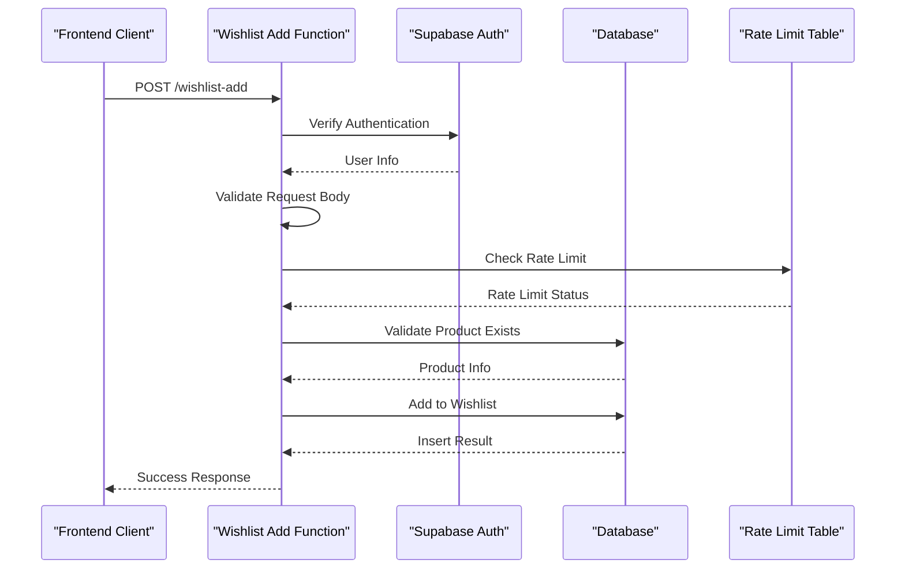
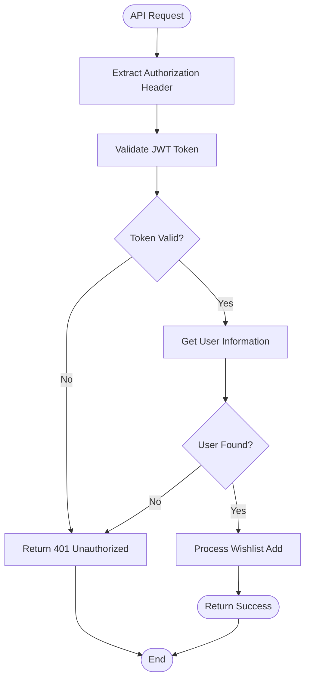
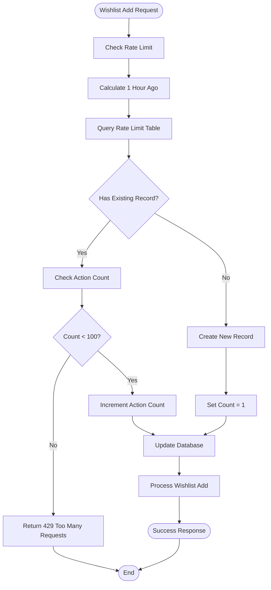
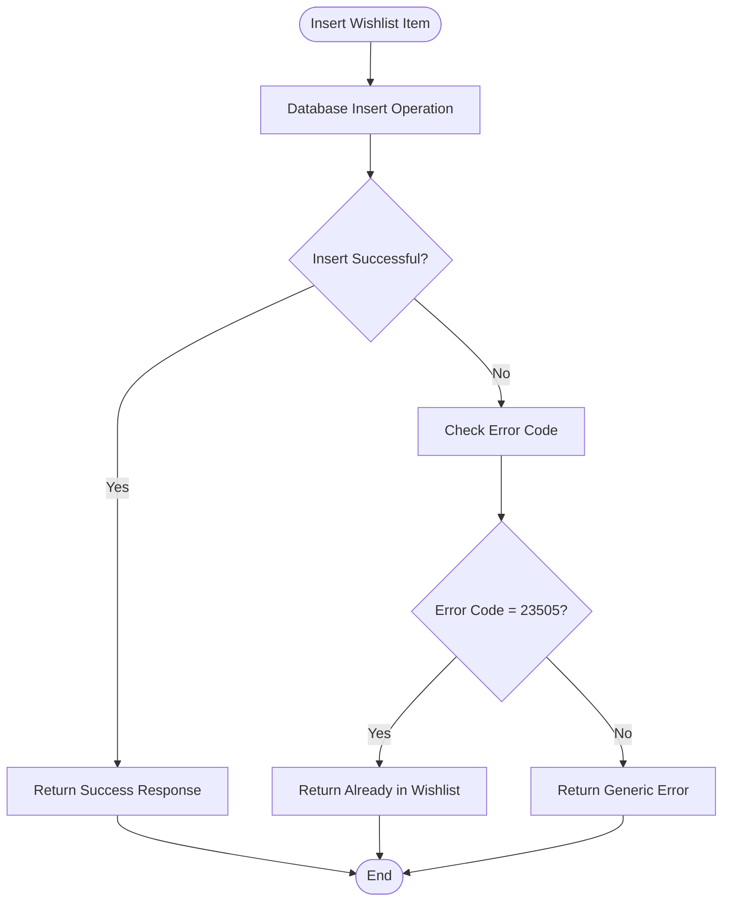
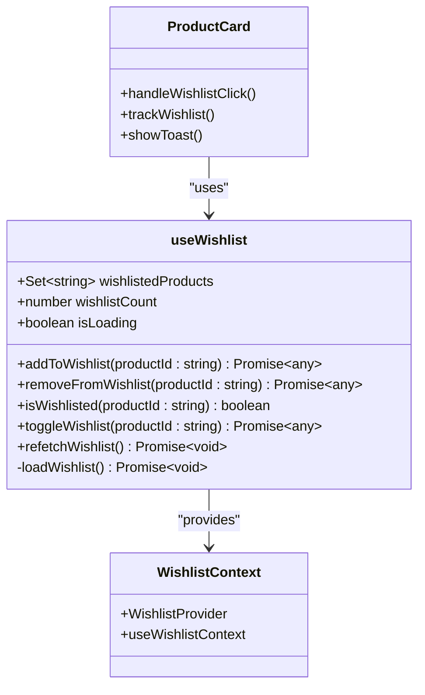
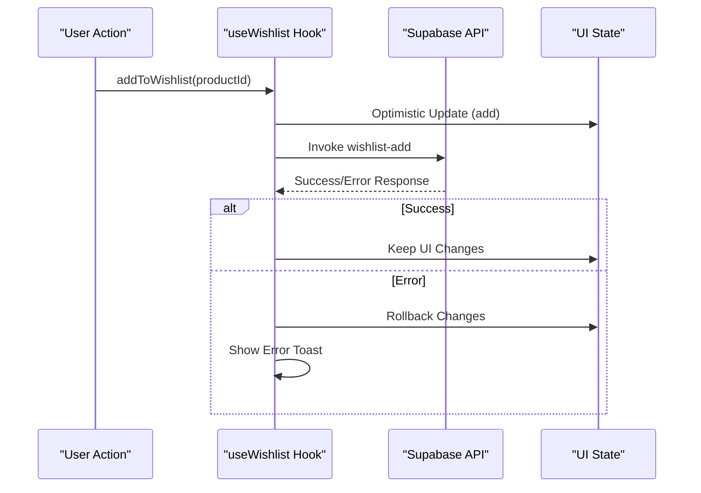
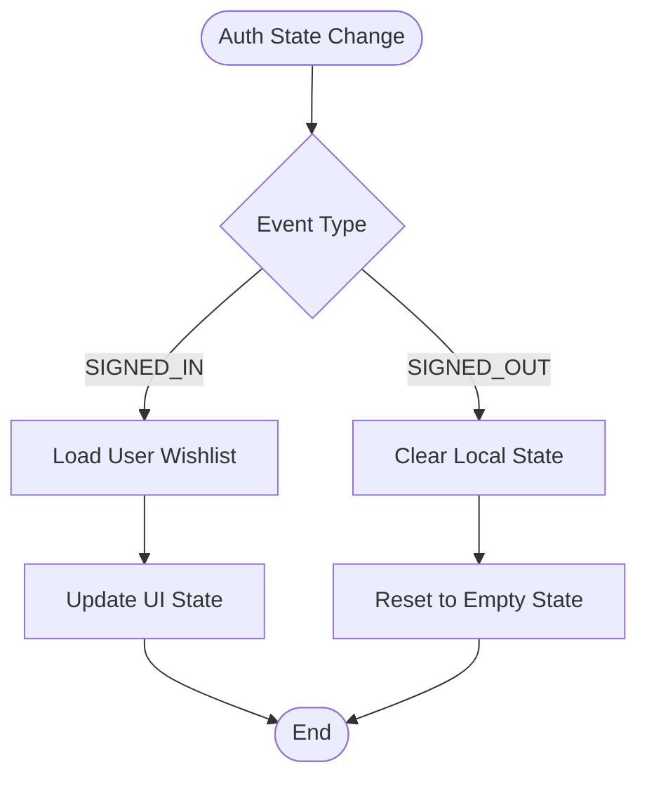

# Wishlist Add API

<cite>
**Referenced Files in This Document**
- [supabase/functions/wishlist-add/index.ts](file://supabase/functions/wishlist-add/index.ts)
- [src/hooks/useWishlist.ts](file://src/hooks/useWishlist.ts)
- [src/contexts/WishlistContext.tsx](file://src/contexts/WishlistContext.tsx)
- [src/components/products/ProductCard.tsx](file://src/components/products/ProductCard.tsx)
- [src/pages/Wishlist.tsx](file://src/pages/Wishlist.tsx)
- [supabase/migrations/20251117020514_e6a1c666-2b44-4cb6-ae66-ddf46a3d8814.sql](file://supabase/migrations/20251117020514_e6a1c666-2b44-4cb6-ae66-ddf46a3d8814.sql)
- [supabase/COMPLETE_SETUP.sql](file://supabase/COMPLETE_SETUP.sql)
- [src/integrations/supabase/client.ts](file://src/integrations/supabase/client.ts)
</cite>

## Table of Contents
1. [Introduction](#introduction)
2. [API Endpoint Overview](#api-endpoint-overview)
3. [Technical Implementation](#technical-implementation)
4. [Authentication and Security](#authentication-and-security)
5. [Rate Limiting](#rate-limiting)
6. [Error Handling](#error-handling)
7. [Integration with Frontend](#integration-with-frontend)
8. [Real-time Synchronization](#real-time-synchronization)
9. [Security Considerations](#security-considerations)
10. [Performance Optimization](#performance-optimization)
11. [Troubleshooting Guide](#troubleshooting-guide)
12. [Best Practices](#best-practices)

## Introduction

The Wishlist Add API is a Supabase Edge Function that enables authenticated users to add products to their personal wishlists. This API serves as the backend component for the wishlist functionality in the Sleek Apparels marketplace, providing a secure and efficient way to manage user preferences for products they're interested in purchasing.

The API is designed with robust error handling, rate limiting, and real-time synchronization capabilities to ensure optimal user experience and system performance. It integrates seamlessly with the frontend React application through optimistic UI updates and comprehensive error recovery mechanisms.

## API Endpoint Overview

### Endpoint Details

**URL**: `POST https://your-supabase-url/functions/v1/wishlist-add`

**Authentication**: Required (Bearer Token)

**Content-Type**: `application/json`

**Body Schema**:
```typescript
interface WishlistAddRequest {
  productId: string; // UUID of the product to add
}
```

**Response Format**:
```typescript
interface WishlistAddResponse {
  success: boolean;
  message: string;
}
```

### Success Response
```json
{
  "success": true,
  "message": "Premium Cotton T-Shirt added to wishlist"
}
```

### Error Responses

| Status Code | Message | Description |
|-------------|---------|-------------|
| 400 | "Product ID is required" | Missing or invalid productId parameter |
| 401 | "Authentication required" | User not authenticated |
| 404 | "Product not found" | Specified product does not exist |
| 429 | "Rate limit exceeded. Please try again later." | Too many requests within time window |
| 500 | "Failed to add to wishlist" | Database operation failed |
| 500 | "Internal server error" | Unexpected server error |

**Section sources**
- [supabase/functions/wishlist-add/index.ts](file://supabase/functions/wishlist-add/index.ts#L35-L110)

## Technical Implementation

### Backend Implementation

The wishlist-add function is implemented as a Deno-based Edge Function that provides comprehensive validation and database operations.



**Diagram sources**
- [supabase/functions/wishlist-add/index.ts](file://supabase/functions/wishlist-add/index.ts#L9-L120)

### Database Schema

The wishlist system utilizes two primary tables with comprehensive indexing and row-level security policies.

#### Wishlists Table Structure
```sql
CREATE TABLE wishlists (
  id UUID PRIMARY KEY DEFAULT gen_random_uuid(),
  user_id UUID NOT NULL REFERENCES auth.users(id) ON DELETE CASCADE,
  product_id UUID NOT NULL REFERENCES products(id) ON DELETE CASCADE,
  created_at TIMESTAMPTZ NOT NULL DEFAULT now(),
  notes TEXT,
  UNIQUE(user_id, product_id)
);
```

#### Rate Limits Table Structure
```sql
CREATE TABLE wishlist_rate_limits (
  id UUID PRIMARY KEY DEFAULT gen_random_uuid(),
  user_id UUID NOT NULL,
  action_count INTEGER DEFAULT 1,
  window_start TIMESTAMPTZ NOT NULL DEFAULT now(),
  UNIQUE(user_id, window_start)
);
```

### Validation Logic

The function implements multiple validation layers:

1. **Authentication Verification**: Ensures user is properly authenticated
2. **Input Validation**: Validates productId parameter presence and format
3. **Product Existence**: Verifies the product exists in the products table
4. **Rate Limiting**: Enforces 100 additions per hour per user
5. **Duplicate Prevention**: Handles UNIQUE constraint violations gracefully

**Section sources**
- [supabase/functions/wishlist-add/index.ts](file://supabase/functions/wishlist-add/index.ts#L25-L110)
- [supabase/migrations/20251117020514_e6a1c666-2b44-4cb6-ae66-ddf46a3d8814.sql](file://supabase/migrations/20251117020514_e6a1c666-2b44-4cb6-ae66-ddf46a3d8814.sql#L1-L53)

## Authentication and Security

### Authentication Flow

The API requires user authentication through Supabase's JWT tokens. The function extracts the Authorization header and validates the user's identity.



**Diagram sources**
- [supabase/functions/wishlist-add/index.ts](file://supabase/functions/wishlist-add/index.ts#L25-L33)

### Row-Level Security

Both the wishlists and rate_limits tables implement comprehensive RLS policies:

#### Wishlists RLS Policies
- **View Policy**: Users can only view their own wishlist items
- **Insert Policy**: Users can only add items to their own wishlist
- **Delete Policy**: Users can only remove items from their own wishlist
- **Update Policy**: Users can only modify their own wishlist entries

#### Rate Limits RLS Policy
- **System Management**: The system can manage rate limits for all users
- **Isolation**: Rate limits are user-specific and cannot be bypassed

**Section sources**
- [supabase/migrations/20251117020514_e6a1c666-2b44-4cb6-ae66-ddf46a3d8814.sql](file://supabase/migrations/20251117020514_e6a1c666-2b44-4cb6-ae66-ddf46a3d8814.sql#L19-L53)

## Rate Limiting

### Implementation Details

The API implements a sliding window rate limiting mechanism with the following characteristics:

- **Limit**: 100 wishlist additions per hour per user
- **Window**: 60-minute sliding window
- **Storage**: Dedicated rate_limits table with user_id and window_start
- **Granularity**: Per-user, per-hour basis



**Diagram sources**
- [supabase/functions/wishlist-add/index.ts](file://supabase/functions/wishlist-add/index.ts#L44-L71)

### Rate Limiting Algorithm

The rate limiting implementation follows these steps:

1. **Calculate Time Window**: Determine the start of the 60-minute window
2. **Query Existing Record**: Check if a rate limit record exists for the user
3. **Evaluate Limit**: Compare current count against the 100-item threshold
4. **Update Counter**: Either increment existing record or create new one
5. **Enforce Limit**: Reject requests that exceed the rate limit

**Section sources**
- [supabase/functions/wishlist-add/index.ts](file://supabase/functions/wishlist-add/index.ts#L44-L71)

## Error Handling

### Comprehensive Error Management

The API implements layered error handling with appropriate HTTP status codes and meaningful error messages.

#### Error Categories

| Error Type | HTTP Status | Message | Recovery Strategy |
|------------|-------------|---------|-------------------|
| Authentication | 401 | "Authentication required" | Redirect to login |
| Missing Parameter | 400 | "Product ID is required" | Validate input format |
| Product Not Found | 404 | "Product not found" | Show product unavailable |
| Rate Limit Exceeded | 429 | "Rate limit exceeded" | Retry after delay |
| Database Error | 500 | "Failed to add to wishlist" | Retry with exponential backoff |
| Internal Error | 500 | "Internal server error" | Log and notify support |

### Duplicate Handling

The API gracefully handles duplicate wishlist additions through PostgreSQL's UNIQUE constraint:



**Diagram sources**
- [supabase/functions/wishlist-add/index.ts](file://supabase/functions/wishlist-add/index.ts#L92-L105)

**Section sources**
- [supabase/functions/wishlist-add/index.ts](file://supabase/functions/wishlist-add/index.ts#L35-L120)

## Integration with Frontend

### React Hook Implementation

The frontend integration utilizes a custom React hook (`useWishlist`) that provides comprehensive wishlist management functionality.



**Diagram sources**
- [src/hooks/useWishlist.ts](file://src/hooks/useWishlist.ts#L4-L131)
- [src/contexts/WishlistContext.tsx](file://src/contexts/WishlistContext.tsx#L1-L33)

### Optimistic UI Updates

The frontend implements optimistic updates to enhance user experience:

#### Add to Wishlist Flow
1. **Immediate UI Update**: Add product to local state immediately
2. **Network Request**: Send API request in background
3. **Success Case**: Keep UI change permanent
4. **Error Case**: Rollback UI change and show error

#### Remove from Wishlist Flow
1. **Immediate UI Update**: Remove product from local state immediately
2. **Network Request**: Send API request in background
3. **Success Case**: Keep UI change permanent
4. **Error Case**: Restore UI change and show error

### Error Recovery Mechanism

The optimistic update system includes comprehensive error recovery:



**Diagram sources**
- [src/hooks/useWishlist.ts](file://src/hooks/useWishlist.ts#L53-L78)

**Section sources**
- [src/hooks/useWishlist.ts](file://src/hooks/useWishlist.ts#L53-L78)
- [src/components/products/ProductCard.tsx](file://src/components/products/ProductCard.tsx#L27-L64)

## Real-time Synchronization

### State Management Architecture

The wishlist system employs a sophisticated state management approach that ensures consistency across the application:

#### Provider Pattern
- **WishlistProvider**: Centralizes wishlist state management
- **useWishlistContext**: Provides access to wishlist functionality
- **useWishlist**: Implements core wishlist operations with optimistic updates

#### Authentication State Monitoring
The system listens for authentication state changes to maintain accurate wishlist state:



**Diagram sources**
- [src/hooks/useWishlist.ts](file://src/hooks/useWishlist.ts#L40-L48)

### Component Integration

Multiple components integrate with the wishlist system:

#### ProductCard Component
- **Wishlist Toggle**: Click-to-add/remove functionality
- **Visual Feedback**: Heart icon changes state immediately
- **Analytics Tracking**: Records user interactions
- **Error Handling**: Provides user feedback for failures

#### Wishlist Page
- **Full List Display**: Shows all wishlist items with product details
- **Individual Actions**: Remove items from wishlist
- **Bulk Operations**: Clear all items option
- **Loading States**: Handles loading and error states gracefully

**Section sources**
- [src/hooks/useWishlist.ts](file://src/hooks/useWishlist.ts#L40-L48)
- [src/components/products/ProductCard.tsx](file://src/components/products/ProductCard.tsx#L27-L64)
- [src/pages/Wishlist.tsx](file://src/pages/Wishlist.tsx#L45-L95)

## Security Considerations

### Input Validation

The API implements comprehensive input validation to prevent various attack vectors:

#### Product ID Validation
- **Format Check**: Ensures productId is a valid UUID
- **Existence Check**: Verifies product exists in database
- **Access Control**: Confirms user has permission to access product

#### Rate Limiting Security
- **Per-User Limiting**: Prevents abuse by individual users
- **Sliding Window**: Prevents circumvention through timing attacks
- **Database Isolation**: Rate limits are stored securely in database

### Authentication Security

#### JWT Token Validation
- **Signature Verification**: Ensures token authenticity
- **Expiration Checking**: Prevents replay attacks
- **Scope Validation**: Confirms appropriate permissions

#### Session Management
- **Secure Storage**: Tokens stored securely in browser
- **Automatic Refresh**: Handles token expiration transparently
- **Logout Handling**: Proper cleanup of authentication state

### Database Security

#### Row-Level Security
- **User Isolation**: Each user can only access their own data
- **Principle of Least Privilege**: Minimal permissions granted
- **Audit Trail**: All operations logged for security monitoring

#### SQL Injection Prevention
- **Parameterized Queries**: All database operations use prepared statements
- **Input Sanitization**: Automatic escaping of user inputs
- **Schema Validation**: Strict schema enforcement prevents malformed data

**Section sources**
- [supabase/functions/wishlist-add/index.ts](file://supabase/functions/wishlist-add/index.ts#L25-L33)
- [supabase/migrations/20251117020514_e6a1c666-2b44-4cb6-ae66-ddf46a3d8814.sql](file://supabase/migrations/20251117020514_e6a1c666-2b44-4cb6-ae66-ddf46a3d8814.sql#L19-L53)

## Performance Optimization

### Database Optimization

#### Indexing Strategy
The wishlist system employs strategic indexing for optimal performance:

| Index | Purpose | Columns |
|-------|---------|---------|
| idx_wishlists_user_id | User-specific queries | user_id |
| idx_wishlists_product_id | Product lookups | product_id |
| idx_wishlists_created_at | Recent items sorting | created_at |
| idx_wishlist_rate_limits_user | Rate limiting queries | user_id, window_start |

#### Query Optimization
- **Single Query Operations**: Minimize database round trips
- **Selective Field Retrieval**: Only fetch necessary data
- **Efficient Joins**: Optimize relationships between tables

### Caching Strategy

#### Frontend Caching
- **Local State Management**: Store wishlist in React state
- **Optimistic Updates**: Reduce perceived latency
- **Batch Operations**: Group related operations

#### Rate Limiting Efficiency
- **Memory-Based Sliding Window**: Efficient time-based calculations
- **Database Deduplication**: Prevent redundant rate limit records
- **Index Utilization**: Fast lookups for rate limit checks

### Network Optimization

#### Request Batching
- **Concurrent Operations**: Parallel API calls where possible
- **Debounced Actions**: Prevent excessive API calls
- **Retry Logic**: Intelligent retry with exponential backoff

#### Response Optimization
- **Minimal Payloads**: Return only essential data
- **Compression**: Enable gzip compression for responses
- **CDN Distribution**: Edge function deployment for low latency

**Section sources**
- [supabase/migrations/20251117020514_e6a1c666-2b44-4cb6-ae66-ddf46a3d8814.sql](file://supabase/migrations/20251117020514_e6a1c666-2b44-4cb6-ae66-ddf46a3d8814.sql#L11-L14)

## Troubleshooting Guide

### Common Issues and Solutions

#### Authentication Failures
**Symptoms**: 401 Unauthorized responses
**Causes**: Expired tokens, invalid credentials, network issues
**Solutions**:
- Check browser console for authentication errors
- Verify user is logged in
- Clear browser cache and cookies
- Check network connectivity

#### Rate Limit Exceeded
**Symptoms**: 429 Too Many Requests responses
**Causes**: Too many wishlist additions in short period
**Solutions**:
- Wait for rate limit window to reset (60 minutes)
- Implement client-side throttling
- Batch wishlist operations
- Monitor user behavior patterns

#### Product Not Found
**Symptoms**: 404 Product not found responses
**Causes**: Invalid product ID, deleted products, access restrictions
**Solutions**:
- Verify product ID format (UUID)
- Check product availability
- Confirm user permissions
- Refresh product catalog

#### Database Connection Issues
**Symptoms**: 500 Internal server error responses
**Causes**: Database timeouts, connection pool exhaustion, schema issues
**Solutions**:
- Check database health metrics
- Review connection pool settings
- Verify database schema integrity
- Monitor database performance

### Debugging Tools

#### Frontend Debugging
```typescript
// Enable debug logging
console.log('Wishlist state:', useWishlist());

// Monitor API calls
fetch('/functions/v1/wishlist-add', {
  method: 'POST',
  headers: { 'Content-Type': 'application/json' },
  body: JSON.stringify({ productId: 'test-id' })
}).then(response => {
  console.log('API Response:', response);
});
```

#### Backend Debugging
```typescript
// Enable detailed logging
console.log('User ID:', user?.id);
console.log('Product ID:', productId);
console.log('Rate limit data:', rateLimitData);
```

### Monitoring and Alerting

#### Key Metrics to Monitor
- **API Response Times**: Target < 200ms
- **Error Rates**: Target < 1%
- **Rate Limit Violations**: Monitor for unusual patterns
- **Database Performance**: Track query execution times

#### Alert Configuration
- **High Error Rates**: > 5% error rate
- **Rate Limit Exhaustion**: > 90% rate limit utilization
- **Database Failures**: Connection timeouts, query failures
- **Performance Degradation**: Response time > 500ms

**Section sources**
- [supabase/functions/wishlist-add/index.ts](file://supabase/functions/wishlist-add/index.ts#L113-L120)

## Best Practices

### Development Guidelines

#### API Usage Patterns
1. **Always Validate Inputs**: Never trust client-side validation
2. **Implement Retry Logic**: Handle transient failures gracefully
3. **Use Meaningful Error Messages**: Help users understand issues
4. **Monitor Performance**: Track API response times and error rates

#### Frontend Integration
1. **Implement Optimistic Updates**: Enhance user experience
2. **Provide Immediate Feedback**: Show loading states and success messages
3. **Handle Errors Gracefully**: Never break the user experience
4. **Maintain State Consistency**: Sync local state with server state

#### Security Best Practices
1. **Validate All Inputs**: Prevent injection attacks
2. **Implement Proper Authentication**: Use secure token management
3. **Enforce Rate Limiting**: Protect against abuse
4. **Monitor for Anomalies**: Detect unusual patterns

### Deployment Considerations

#### Environment Configuration
- **Development**: Local Supabase instance with test data
- **Staging**: Production-like environment with sanitized data
- **Production**: Full-scale deployment with monitoring

#### Scaling Strategies
- **Horizontal Scaling**: Deploy multiple function instances
- **Database Scaling**: Implement read replicas for heavy loads
- **Caching Layers**: Add Redis caching for frequently accessed data
- **CDN Integration**: Distribute static assets globally

#### Maintenance Procedures
- **Regular Backups**: Automated backup of critical data
- **Performance Monitoring**: Continuous monitoring of key metrics
- **Security Audits**: Regular security assessments
- **Documentation Updates**: Keep API documentation current

### Testing Strategies

#### Unit Testing
- **Function Tests**: Test individual function logic
- **Validation Tests**: Verify input validation works correctly
- **Error Handling Tests**: Ensure proper error responses
- **Rate Limiting Tests**: Verify rate limiting functionality

#### Integration Testing
- **API Integration**: Test complete API workflows
- **Database Integration**: Verify database operations
- **Frontend Integration**: Test UI interactions
- **Authentication Integration**: Verify auth flows

#### Performance Testing
- **Load Testing**: Simulate high user concurrency
- **Stress Testing**: Test system limits
- **Endurance Testing**: Monitor long-term performance
- **Scalability Testing**: Verify scaling capabilities

This comprehensive API documentation provides developers with all necessary information to effectively implement, integrate, and maintain the wishlist-add functionality in the Sleek Apparels marketplace system.