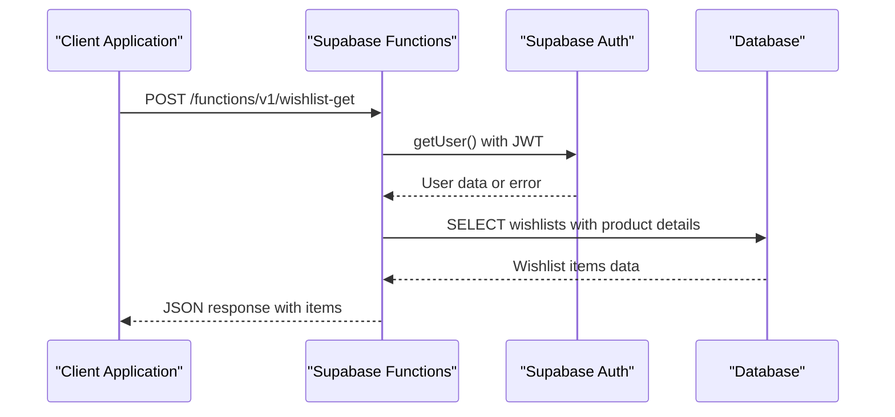
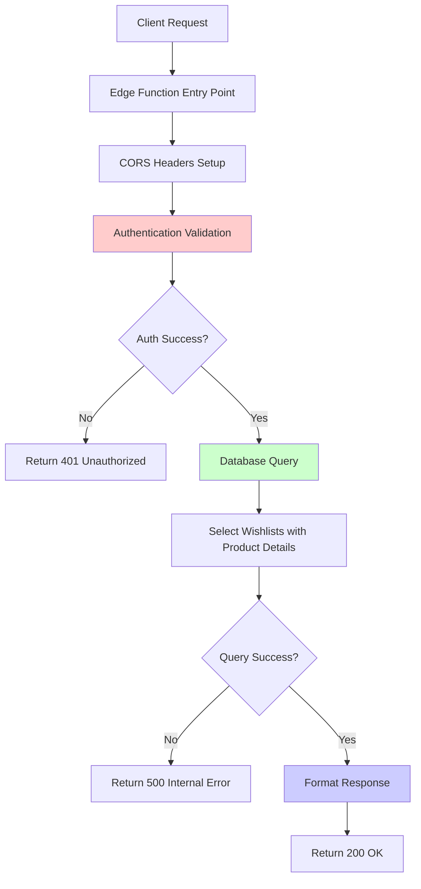
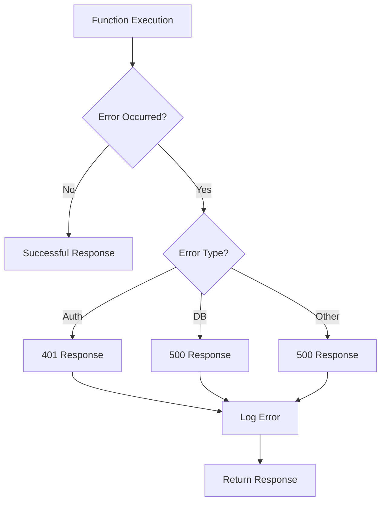
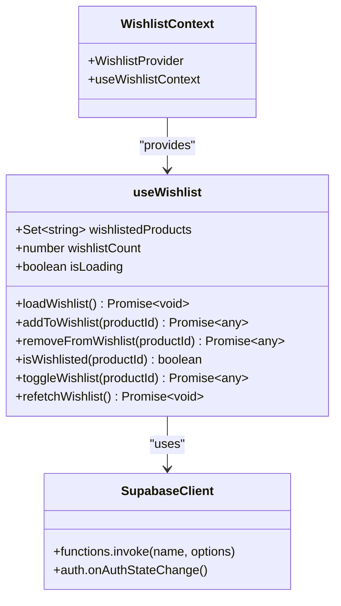
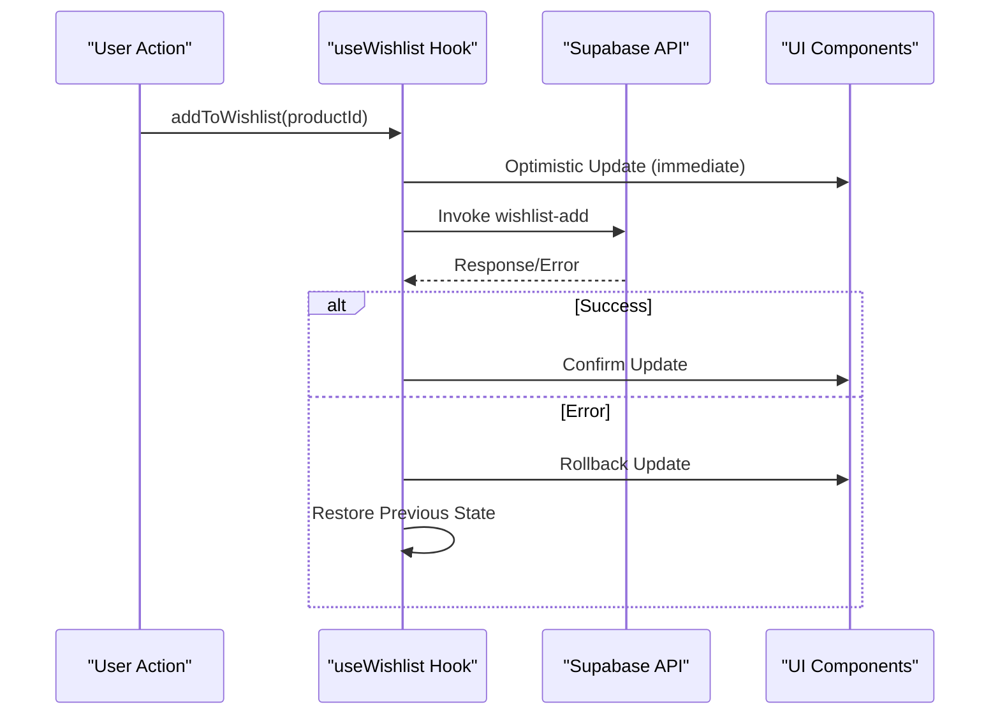

# Wishlist Get API

<cite>
**Referenced Files in This Document**
- [supabase/functions/wishlist-get/index.ts](file://supabase/functions/wishlist-get/index.ts)
- [src/hooks/useWishlist.ts](file://src/hooks/useWishlist.ts)
- [src/contexts/WishlistContext.tsx](file://src/contexts/WishlistContext.tsx)
- [src/pages/Wishlist.tsx](file://src/pages/Wishlist.tsx)
- [src/integrations/supabase/client.ts](file://src/integrations/supabase/client.ts)
- [supabase/migrations/20251117020514_e6a1c666-2b44-4cb6-ae66-ddf46a3d8814.sql](file://supabase/migrations/20251117020514_e6a1c666-2b44-4cb6-ae66-ddf46a3d8814.sql)
- [supabase/COMPLETE_SETUP.sql](file://supabase/COMPLETE_SETUP.sql)
</cite>

## Table of Contents
1. [Introduction](#introduction)
2. [API Endpoint Specification](#api-endpoint-specification)
3. [Implementation Architecture](#implementation-architecture)
4. [Response Format](#response-format)
5. [Error Handling](#error-handling)
6. [Integration with Frontend Hooks](#integration-with-frontend-hooks)
7. [Performance Considerations](#performance-considerations)
8. [Optimistic Updates and Caching](#optimistic-updates-and-caching)
9. [Security and Authentication](#security-and-authentication)
10. [Usage Examples](#usage-examples)
11. [Troubleshooting](#troubleshooting)

## Introduction

The Wishlist Get API is a Supabase Edge Function that retrieves all wishlist items for the currently authenticated user. This function serves as the core endpoint for loading user-specific wishlist data, providing essential functionality for the product wishlist feature in the Sleek Apparels marketplace system.

The API operates as a GET operation that is invoked via POST to the Supabase Functions API, following the pattern of Supabase Edge Functions which use HTTP POST requests to trigger serverless functions. This design choice allows for consistent API patterns while maintaining the flexibility of Edge Functions.

## API Endpoint Specification

### Endpoint Details

**URL Pattern**: `POST https://your-supabase-url/functions/v1/wishlist-get`

**Method**: POST (invokes GET operation)

**Authentication**: Required (Bearer Token in Authorization header)

**CORS Headers**: Enabled for cross-origin requests

### Request Format

The function accepts no request body parameters. Authentication is handled through the Authorization header containing a valid JWT token.



**Diagram sources**
- [supabase/functions/wishlist-get/index.ts](file://supabase/functions/wishlist-get/index.ts#L9-L84)

## Implementation Architecture

The Wishlist Get function follows a layered architecture pattern with clear separation of concerns:



**Diagram sources**
- [supabase/functions/wishlist-get/index.ts](file://supabase/functions/wishlist-get/index.ts#L14-L84)

### Core Components

1. **Authentication Layer**: Validates JWT token and extracts user context
2. **Data Access Layer**: Executes database queries with proper filtering
3. **Response Formatting**: Transforms raw database data into API response format
4. **Error Handling**: Comprehensive error management with appropriate HTTP status codes

**Section sources**
- [supabase/functions/wishlist-get/index.ts](file://supabase/functions/wishlist-get/index.ts#L1-L85)

## Response Format

The API returns a standardized JSON response format that includes both data and metadata about the wishlist:

### Success Response Structure

```typescript
{
  success: boolean;           // Always true for successful requests
  items: Array<{           // Array of wishlist items
    id: string;            // Unique identifier for the wishlist entry
    product_id: string;    // Reference to the product in the products table
    created_at: string;    // ISO 8601 timestamp of creation
    notes: string | null;  // Optional notes attached to the wishlist item
    products: {           // Embedded product details
      id: string;
      title: string;
      description: string | null;
      price: number | null;
      image_url: string;
      category: string;
      moq: number | null;
      lead_time_days: number | null;
      colors: string[] | null;
      materials: string[] | null;
      featured: boolean | null;
    }
  }>;
  count: number;           // Total number of items in the wishlist
}
```

### Example Response

```json
{
  "success": true,
  "items": [
    {
      "id": "550e8400-e29b-41d4-a716-446655440000",
      "product_id": "98765432-1234-5678-9abc-123456789abc",
      "created_at": "2024-01-15T10:30:00Z",
      "notes": "Great deal!",
      "products": {
        "id": "98765432-1234-5678-9abc-123456789abc",
        "title": "Premium Cotton T-Shirt",
        "description": "High-quality cotton t-shirt with modern design",
        "price": 29.99,
        "image_url": "/images/products/tshirt.jpg",
        "category": "T-Shirts",
        "moq": 50,
        "lead_time_days": 7,
        "colors": ["Black", "White", "Blue"],
        "materials": ["100% Cotton"],
        "featured": true
      }
    }
  ],
  "count": 1
}
```

**Section sources**
- [supabase/functions/wishlist-get/index.ts](file://supabase/functions/wishlist-get/index.ts#L68-L74)

## Error Handling

The API implements comprehensive error handling with appropriate HTTP status codes and meaningful error messages:

### Authentication Errors

**401 Unauthorized**: Returned when authentication fails or user is not authenticated

```json
{
  "success": false,
  "message": "Authentication required",
  "items": [],
  "count": 0
}
```

### Database Errors

**500 Internal Server Error**: Returned when database operations fail

```json
{
  "success": false,
  "message": "Failed to fetch wishlist",
  "items": [],
  "count": 0
}
```

### General Error Handling

**500 Internal Server Error**: Catch-all for unexpected errors

```json
{
  "success": false,
  "message": "Internal server error",
  "items": [],
  "count": 0
}
```

### Error Response Flow



**Diagram sources**
- [supabase/functions/wishlist-get/index.ts](file://supabase/functions/wishlist-get/index.ts#L28-L84)

**Section sources**
- [supabase/functions/wishlist-get/index.ts](file://supabase/functions/wishlist-get/index.ts#L28-L84)

## Integration with Frontend Hooks

The API integrates seamlessly with React hooks that provide a reactive and efficient way to manage wishlist state:

### useWishlist Hook Architecture



**Diagram sources**
- [src/hooks/useWishlist.ts](file://src/hooks/useWishlist.ts#L4-L131)
- [src/contexts/WishlistContext.tsx](file://src/contexts/WishlistContext.tsx#L1-L34)

### Automatic Re-fetching Mechanism

The useWishlist hook implements automatic re-fetching of wishlist data when authentication state changes:

```typescript
// Listen for auth changes
const { data: { subscription } } = supabase.auth.onAuthStateChange((event) => {
  if (event === 'SIGNED_IN') {
    loadWishlist(); // Auto-refresh on login
  } else if (event === 'SIGNED_OUT') {
    setWishlistedProducts(new Set()); // Clear on logout
    setWishlistCount(0);
  }
});
```

### Local State Management

The hook maintains several pieces of local state for optimal performance:

- **wishlistedProducts**: A Set<string> containing product IDs for O(1) lookup
- **wishlistCount**: A numeric counter for quick display updates
- **isLoading**: Boolean flag for loading state management

**Section sources**
- [src/hooks/useWishlist.ts](file://src/hooks/useWishlist.ts#L37-L51)
- [src/hooks/useWishlist.ts](file://src/hooks/useWishlist.ts#L5-L7)

## Performance Considerations

### Database Query Optimization

The API implements several performance optimizations:

1. **Selective Field Selection**: Only retrieves necessary fields from the database
2. **Embedded Product Details**: Joins product data in a single query to minimize round trips
3. **Proper Indexing**: Utilizes indexes on user_id, product_id, and created_at fields

### Query Structure

```sql
SELECT id, product_id, created_at, notes, 
       products (id, title, description, price, image_url, category, moq, lead_time_days, colors, materials, featured)
FROM wishlists
WHERE user_id = $1
ORDER BY created_at DESC
```

### Response Size Limitations

The API is designed to handle reasonable wishlist sizes efficiently:

- **Default Limit**: No explicit limit, but practical limits apply based on user behavior
- **Pagination**: Not implemented yet, but could be added for very large wishlists
- **Field Filtering**: Only includes essential product information to minimize payload size

### Caching Strategies

While the API itself doesn't implement caching, the frontend hooks provide several caching mechanisms:

1. **Local State Caching**: React state persists until component unmounts
2. **Optimistic Updates**: Immediate UI updates before server confirmation
3. **Automatic Refresh**: Re-fetches on authentication state changes

**Section sources**
- [supabase/functions/wishlist-get/index.ts](file://supabase/functions/wishlist-get/index.ts#L35-L58)

## Optimistic Updates and Caching

### Optimistic Update Implementation

The useWishlist hook implements optimistic updates for improved user experience:



**Diagram sources**
- [src/hooks/useWishlist.ts](file://src/hooks/useWishlist.ts#L54-L78)

### Automatic Re-fetching

The system automatically re-fetches wishlist data when:

1. **Component Mount**: Initial load of wishlist data
2. **Authentication Changes**: Login/logout events
3. **Manual Refresh**: Explicit refetch requests

### Session-Based State Management

Each session maintains its own state using a unique session ID:

```typescript
const sessionId = useRef(crypto.randomUUID());
```

This ensures that state management works correctly across page reloads and navigation.

**Section sources**
- [src/hooks/useWishlist.ts](file://src/hooks/useWishlist.ts#L8-L9)
- [src/hooks/useWishlist.ts](file://src/hooks/useWishlist.ts#L37-L51)

## Security and Authentication

### Authentication Requirements

The API enforces strict authentication requirements:

1. **JWT Validation**: Validates bearer token against Supabase Auth
2. **User Context**: Extracts user ID from validated token
3. **Row-Level Security**: Ensures users can only access their own data

### Database Security

The Supabase database implements comprehensive security measures:

```sql
-- RLS Policy: Users can view own wishlist
CREATE POLICY "Users can view own wishlist"
  ON wishlists FOR SELECT
  USING (auth.uid() = user_id);

-- Rate limiting for abuse prevention
CREATE TABLE wishlist_rate_limits (
  user_id UUID NOT NULL,
  action_count INTEGER DEFAULT 1,
  window_start TIMESTAMPTZ NOT NULL DEFAULT now(),
  UNIQUE(user_id, window_start)
);
```

### Rate Limiting

The system implements rate limiting to prevent abuse:

- **Limit**: 100 add operations per hour per user
- **Window**: 1-hour sliding window
- **Implementation**: Separate rate limit table with RLS policies

**Section sources**
- [supabase/functions/wishlist-get/index.ts](file://supabase/functions/wishlist-get/index.ts#L25-L33)
- [supabase/migrations/20251117020514_e6a1c666-2b44-4cb6-ae66-ddf46a3d8814.sql](file://supabase/migrations/20251117020514_e6a1c666-2b44-4cb6-ae66-ddf46a3d8814.sql#L20-L34)

## Usage Examples

### Basic Usage in React Components

Here's how the wishlist-get function is used in practice:

#### Component Mount Example

```typescript
// From useWishlist.ts - automatic loading on mount
useEffect(() => {
  loadWishlist();
}, []);

// From Wishlist.tsx - manual loading
useEffect(() => {
  fetchWishlist();
}, []);
```

#### Hook Usage Example

```typescript
const { 
  wishlistedProducts, 
  wishlistCount, 
  addToWishlist, 
  removeFromWishlist, 
  refetchWishlist 
} = useWishlistContext();

// Check if product is in wishlist
const isWishlisted = wishlistedProducts.has(productId);

// Toggle wishlist state
await toggleWishlist(productId);

// Manual refresh
await refetchWishlist();
```

### Error Handling Example

```typescript
const fetchWishlist = async () => {
  try {
    const { data, error } = await supabase.functions.invoke('wishlist-get');
    
    if (error) {
      console.error('Wishlist fetch failed:', error);
      // Handle error appropriately
      return;
    }
    
    // Process successful response
    setWishlistItems(data?.items || []);
  } catch (error) {
    console.error('Unexpected error:', error);
  }
};
```

**Section sources**
- [src/hooks/useWishlist.ts](file://src/hooks/useWishlist.ts#L10-L35)
- [src/pages/Wishlist.tsx](file://src/pages/Wishlist.tsx#L50-L76)

## Troubleshooting

### Common Issues and Solutions

#### Authentication Failures

**Problem**: 401 Unauthorized responses
**Causes**: Expired JWT tokens, missing Authorization header
**Solution**: 
- Verify JWT token is present and valid
- Check token expiration and refresh if needed
- Ensure proper header format: `Authorization: Bearer <token>`

#### Empty Results

**Problem**: Successful response with empty items array
**Causes**: User has no wishlist items, query filtering issues
**Solution**:
- Verify user has created wishlist items
- Check database records for user_id correlation
- Review RLS policies if applicable

#### Performance Issues

**Problem**: Slow response times
**Causes**: Large wishlist collections, inefficient queries
**Solution**:
- Monitor query execution plans
- Consider implementing pagination
- Review database indexing strategy

#### State Synchronization Issues

**Problem**: UI not reflecting latest wishlist state
**Causes**: Stale local state, missed re-fetches
**Solution**:
- Trigger manual refetch when needed
- Verify authentication state change listeners
- Check for concurrent modification conflicts

### Debugging Tools

1. **Console Logging**: Enable detailed logging in development
2. **Network Monitoring**: Use browser developer tools to inspect API calls
3. **Database Queries**: Monitor query execution in Supabase dashboard
4. **Error Tracking**: Implement comprehensive error reporting

### Monitoring and Observability

The API includes built-in monitoring capabilities:

- **Error Logging**: Comprehensive error logging with stack traces
- **Performance Metrics**: Response time tracking
- **Usage Analytics**: Authentication success/failure rates

**Section sources**
- [supabase/functions/wishlist-get/index.ts](file://supabase/functions/wishlist-get/index.ts#L61-L84)
- [src/pages/Wishlist.tsx](file://src/pages/Wishlist.tsx#L55-L76)