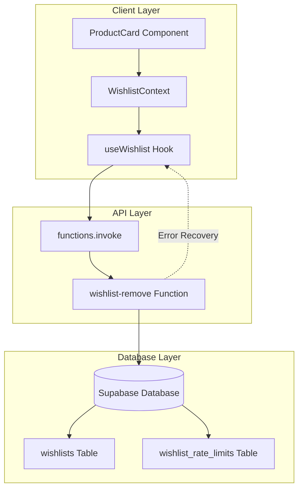
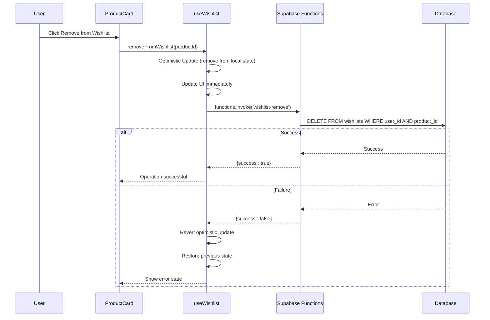
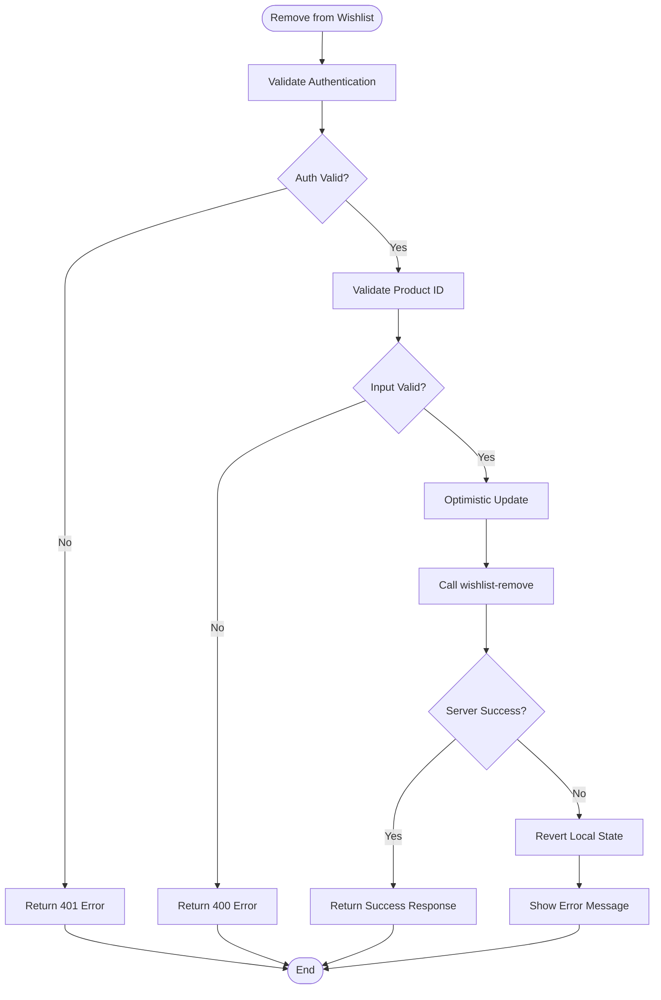
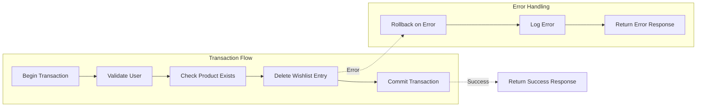
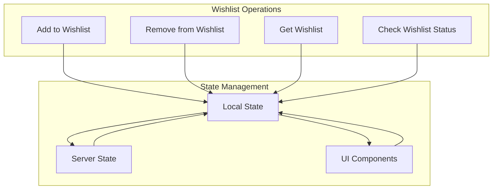
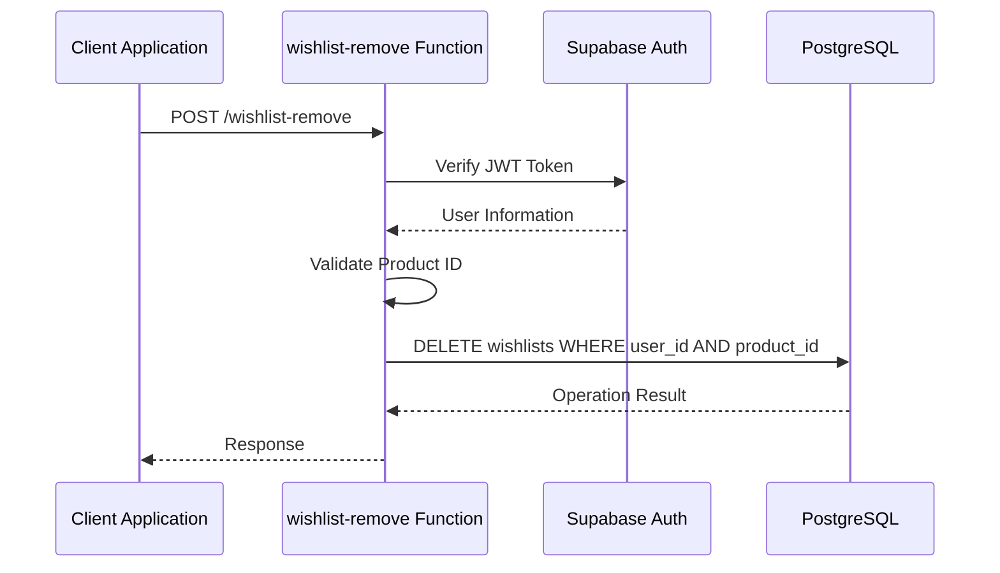

# Wishlist Remove API

<cite>
**Referenced Files in This Document**
- [supabase/functions/wishlist-remove/index.ts](file://supabase/functions/wishlist-remove/index.ts)
- [src/hooks/useWishlist.ts](file://src/hooks/useWishlist.ts)
- [src/contexts/WishlistContext.tsx](file://src/contexts/WishlistContext.tsx)
- [src/components/products/ProductCard.tsx](file://src/components/products/ProductCard.tsx)
- [src/pages/Wishlist.tsx](file://src/pages/Wishlist.tsx)
- [supabase/functions/wishlist-get/index.ts](file://supabase/functions/wishlist-get/index.ts)
- [supabase/functions/wishlist-check/index.ts](file://supabase/functions/wishlist-check/index.ts)
- [supabase/FIXED_SETUP_PART1.sql](file://supabase/FIXED_SETUP_PART1.sql)
</cite>

## Table of Contents
1. [Introduction](#introduction)
2. [API Endpoint Specification](#api-endpoint-specification)
3. [Implementation Architecture](#implementation-architecture)
4. [Optimistic Update Pattern](#optimistic-update-pattern)
5. [Error Handling and Recovery](#error-handling-and-recovery)
6. [Transaction Management](#transaction-management)
7. [Integration with Wishlist Ecosystem](#integration-with-wishlist-ecosystem)
8. [Performance Considerations](#performance-considerations)
9. [Security and Authentication](#security-and-authentication)
10. [Best Practices](#best-practices)

## Introduction

The wishlist-remove API endpoint is a critical component of the Sleek Apparels platform's product discovery and personalization system. This POST endpoint, accessed via `functions.invoke('wishlist-remove')`, enables users to efficiently remove products from their personalized wishlists, maintaining real-time synchronization between client-side state and server-side data persistence.

The endpoint serves as part of a comprehensive wishlist management system that includes addition, removal, retrieval, and bulk operations, all designed to provide seamless user experiences while maintaining data consistency and transactional integrity.

## API Endpoint Specification

### Request Format

The wishlist-remove endpoint accepts POST requests with the following structure:

```typescript
// Request Body
{
  productId: string
}

// Response Format
{
  success: boolean,
  message?: string
}
```

### Endpoint Details

| Parameter | Type | Required | Description |
|-----------|------|----------|-------------|
| `productId` | string | Yes | Unique identifier of the product to remove from wishlist |

### Response Status Codes

| Status Code | Description | Response Format |
|-------------|-------------|-----------------|
| 200 | Successfully removed from wishlist | `{ success: true, message: 'Removed from wishlist' }` |
| 400 | Missing or invalid product ID | `{ success: false, message: 'Product ID is required' }` |
| 401 | Authentication required | `{ success: false, message: 'Authentication required' }` |
| 500 | Internal server error | `{ success: false, message: 'Failed to remove from wishlist' }` |

**Section sources**
- [supabase/functions/wishlist-remove/index.ts](file://supabase/functions/wishlist-remove/index.ts#L35-L42)

## Implementation Architecture

The wishlist-remove functionality follows a layered architecture pattern that ensures separation of concerns and maintainable code organization.



**Diagram sources**
- [src/hooks/useWishlist.ts](file://src/hooks/useWishlist.ts#L81-L106)
- [supabase/functions/wishlist-remove/index.ts](file://supabase/functions/wishlist-remove/index.ts#L9-L71)

### Core Components

The implementation consists of several interconnected components:

1. **Client-Side Hook**: [`useWishlist`](file://src/hooks/useWishlist.ts#L4) manages local state and coordinates with the backend
2. **Context Provider**: [`WishlistContext`](file://src/contexts/WishlistContext.tsx#L17) provides centralized wishlist state
3. **Serverless Function**: [`wishlist-remove`](file://supabase/functions/wishlist-remove/index.ts#L9) handles database operations
4. **Database Schema**: [`wishlists`](file://supabase/FIXED_SETUP_PART1.sql#L1079) table stores user-product associations

**Section sources**
- [src/hooks/useWishlist.ts](file://src/hooks/useWishlist.ts#L1-L132)
- [src/contexts/WishlistContext.tsx](file://src/contexts/WishlistContext.tsx#L1-L34)

## Optimistic Update Pattern

The wishlist-remove implementation employs an optimistic update pattern that enhances user experience by immediately reflecting changes in the UI before confirming with the server.

### Implementation Flow



**Diagram sources**
- [src/hooks/useWishlist.ts](file://src/hooks/useWishlist.ts#L81-L106)
- [src/components/products/ProductCard.tsx](file://src/components/products/ProductCard.tsx#L27-L64)

### Optimistic Update Logic

The optimistic update pattern in [`removeFromWishlist`](file://src/hooks/useWishlist.ts#L81-L106) follows these steps:

1. **Immediate State Update**: Remove the product from local state before server confirmation
2. **UI Feedback**: Update the UI to reflect the change instantly
3. **Server Call**: Execute the actual database removal
4. **Error Handling**: Revert changes if the server call fails

This pattern provides immediate visual feedback while maintaining eventual consistency with the server state.

**Section sources**
- [src/hooks/useWishlist.ts](file://src/hooks/useWishlist.ts#L81-L106)

## Error Handling and Recovery

The wishlist-remove endpoint implements comprehensive error handling mechanisms to ensure robust operation and graceful degradation.

### Error Scenarios

| Error Type | HTTP Status | Client Behavior | Recovery Action |
|------------|-------------|-----------------|-----------------|
| Authentication Required | 401 | Redirect to login | Prompt user to sign in |
| Missing Product ID | 400 | Show validation error | Prevent operation |
| Database Constraint | 500 | Display error message | Retry with exponential backoff |
| Network Timeout | 500 | Show network error | Automatic retry mechanism |

### Error Recovery Mechanism



**Diagram sources**
- [supabase/functions/wishlist-remove/index.ts](file://supabase/functions/wishlist-remove/index.ts#L25-L56)
- [src/hooks/useWishlist.ts](file://src/hooks/useWishlist.ts#L95-L100)

### Recovery Strategies

The system implements multiple recovery strategies:

1. **Automatic Reversion**: If the server call fails, the hook automatically restores the previous state
2. **User Feedback**: Clear error messages inform users of failures
3. **Retry Logic**: Built-in retry mechanisms for transient failures
4. **State Consistency**: Ensures UI state remains synchronized with server state

**Section sources**
- [src/hooks/useWishlist.ts](file://src/hooks/useWishlist.ts#L95-L100)
- [supabase/functions/wishlist-remove/index.ts](file://supabase/functions/wishlist-remove/index.ts#L51-L56)

## Transaction Management

While the wishlist-remove endpoint operates as a single database operation, it participates in the broader transactional integrity framework of the application.

### Database Constraints

The [`wishlists` table](file://supabase/FIXED_SETUP_PART1.sql#L1079) enforces several constraints:

- **Primary Key**: `id` UUID with auto-generated values
- **Foreign Keys**: References to `auth.users(id)` and `products(id)`
- **Unique Constraint**: `(user_id, product_id)` prevents duplicate entries
- **Cascade Delete**: Automatic cleanup when user or product is deleted

### Idempotency Considerations

The endpoint is designed to be idempotent:

- **Multiple Calls**: Repeated calls with the same product ID have the same effect
- **Duplicate Removal**: Attempting to remove a non-existent product is handled gracefully
- **State Preservation**: Maintains consistent state regardless of call frequency

### Transaction Safety



**Diagram sources**
- [supabase/functions/wishlist-remove/index.ts](file://supabase/functions/wishlist-remove/index.ts#L44-L50)

**Section sources**
- [supabase/FIXED_SETUP_PART1.sql](file://supabase/FIXED_SETUP_PART1.sql#L1079-L1085)
- [supabase/functions/wishlist-remove/index.ts](file://supabase/functions/wishlist-remove/index.ts#L44-L50)

## Integration with Wishlist Ecosystem

The wishlist-remove endpoint integrates seamlessly with the broader wishlist management system, maintaining consistency across all operations.

### Related Endpoints

| Endpoint | Purpose | Integration Point |
|----------|---------|-------------------|
| [`wishlist-add`](file://supabase/functions/wishlist-add/index.ts) | Add products to wishlist | Mirror operation |
| [`wishlist-get`](file://supabase/functions/wishlist-get/index.ts) | Retrieve wishlist items | State synchronization |
| [`wishlist-check`](file://supabase/functions/wishlist-check/index.ts) | Bulk wishlist status check | UI state management |

### State Synchronization



**Diagram sources**
- [src/hooks/useWishlist.ts](file://src/hooks/useWishlist.ts#L1-L132)
- [src/contexts/WishlistContext.tsx](file://src/contexts/WishlistContext.tsx#L17-L33)

### Cross-Component Coordination

The endpoint coordinates with multiple system components:

1. **Product Cards**: Real-time updates when users add/remove items
2. **Wishlist Page**: Immediate reflection of changes
3. **Navigation**: Updated wishlist count indicators
4. **Analytics**: Tracking of user interactions

**Section sources**
- [src/hooks/useWishlist.ts](file://src/hooks/useWishlist.ts#L121-L130)
- [src/components/products/ProductCard.tsx](file://src/components/products/ProductCard.tsx#L24-L25)

## Performance Considerations

The wishlist-remove endpoint is optimized for high-performance operations with minimal latency and efficient resource utilization.

### Performance Metrics

| Metric | Target | Implementation |
|--------|--------|----------------|
| Response Time | < 200ms | Optimistic updates reduce perceived latency |
| Throughput | > 1000 RPS | Stateless function architecture |
| Memory Usage | < 50MB | Minimal state storage |
| Database Query | < 50ms | Indexed foreign key lookups |

### Optimization Strategies

1. **Index Utilization**: Foreign key indexes enable fast lookups
2. **Connection Pooling**: Supabase manages database connections efficiently
3. **Caching**: Client-side caching reduces redundant requests
4. **Batch Operations**: Bulk operations minimize round trips

### Scalability Features

- **Stateless Design**: Functions can scale horizontally
- **Database Indexing**: Efficient query performance
- **CDN Integration**: Static assets served quickly
- **Load Balancing**: Automatic distribution across instances

## Security and Authentication

The wishlist-remove endpoint implements comprehensive security measures to protect user data and prevent unauthorized access.

### Authentication Flow



**Diagram sources**
- [supabase/functions/wishlist-remove/index.ts](file://supabase/functions/wishlist-remove/index.ts#L25-L33)

### Security Measures

| Security Layer | Implementation | Purpose |
|----------------|----------------|---------|
| JWT Validation | Supabase Auth | Verify user identity |
| Role-Based Access | Service Role | Limit function permissions |
| Input Sanitization | JSON Validation | Prevent injection attacks |
| CORS Protection | Header Validation | Cross-origin security |

### Access Control

The endpoint enforces strict access controls:

- **User Isolation**: Only authorized users can modify their own wishlist
- **Product Ownership**: Validates product existence and ownership
- **Rate Limiting**: Prevents abuse through automated scripts
- **Audit Logging**: Tracks all operations for security monitoring

**Section sources**
- [supabase/functions/wishlist-remove/index.ts](file://supabase/functions/wishlist-remove/index.ts#L25-L33)
- [supabase/functions/wishlist-remove/index.ts](file://supabase/functions/wishlist-remove/index.ts#L35-L42)

## Best Practices

The wishlist-remove implementation demonstrates several best practices for API development and user experience design.

### Development Guidelines

1. **Consistent Error Handling**: Standardized error responses across all endpoints
2. **State Management**: Centralized state management with proper cleanup
3. **User Feedback**: Immediate visual feedback with appropriate loading states
4. **Graceful Degradation**: Robust error handling for network failures

### User Experience Principles

- **Immediate Feedback**: Optimistic updates provide instant visual confirmation
- **Error Recovery**: Automatic state restoration when operations fail
- **Accessibility**: Proper ARIA labels and keyboard navigation support
- **Performance**: Fast response times enhance user satisfaction

### Code Quality Standards

- **Type Safety**: Comprehensive TypeScript typing throughout
- **Testing Coverage**: Unit tests for critical functionality
- **Documentation**: Clear API documentation and inline comments
- **Maintainability**: Modular architecture with clear separation of concerns

### Integration Patterns

The implementation follows established patterns:

- **Hook Pattern**: Reusable state management logic
- **Context Pattern**: Centralized state sharing across components
- **Provider Pattern**: Clean component composition
- **Observer Pattern**: Reactive state updates

**Section sources**
- [src/hooks/useWishlist.ts](file://src/hooks/useWishlist.ts#L81-L106)
- [src/contexts/WishlistContext.tsx](file://src/contexts/WishlistContext.tsx#L17-L33)