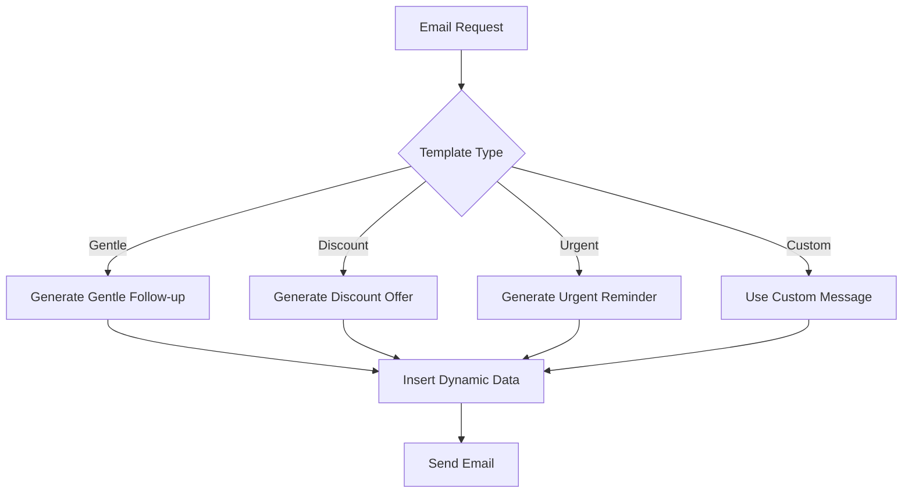
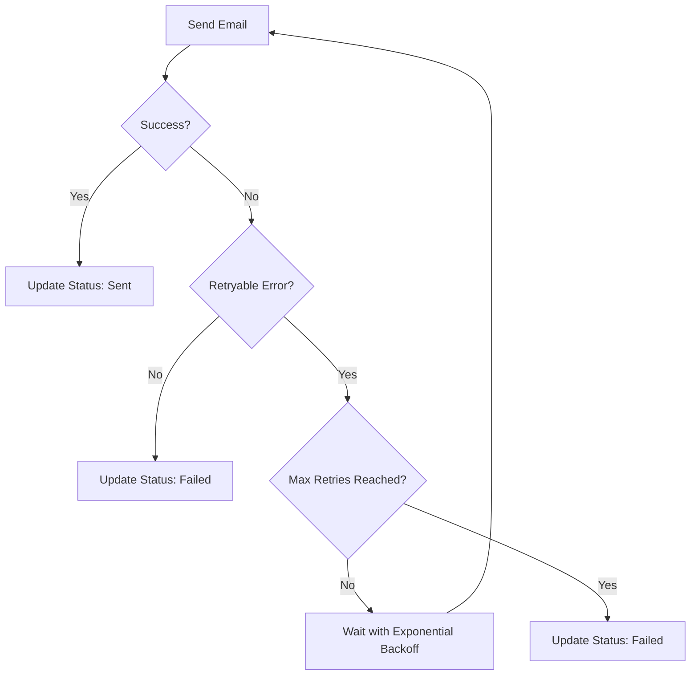
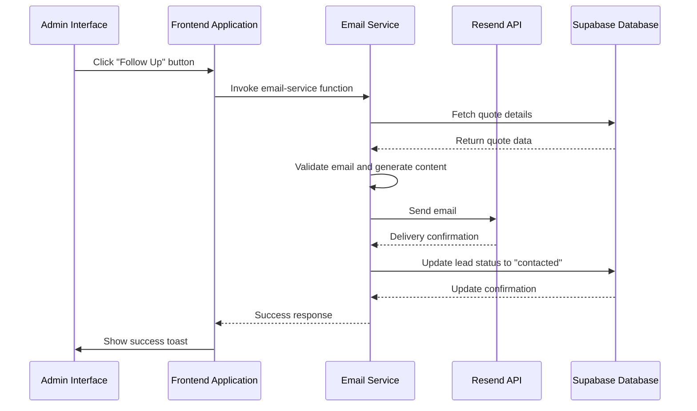

# Email Service Integration

<cite>
**Referenced Files in This Document**   
- [email-service/index.ts](file://supabase/functions/email-service/index.ts)
- [resend-webhook/index.ts](file://supabase/functions/resend-webhook/index.ts)
- [send-otp/index.ts](file://supabase/functions/send-otp/index.ts)
- [LeadFollowupEmailDialog.tsx](file://src/components/LeadFollowupEmailDialog.tsx)
- [20251119140029_887f03c6-bdb2-46d4-ac7b-4b4868f9a169.sql](file://supabase/migrations/20251119140029_887f03c6-bdb2-46d4-ac7b-4b4868f9a169.sql)
</cite>

## Table of Contents
1. [Introduction](#introduction)
2. [Email Types and Templates](#email-types-and-templates)
3. [Template System and Dynamic Content](#template-system-and-dynamic-content)
4. [Email Validation System](#email-validation-system)
5. [Resend API Integration](#resend-api-integration)
6. [Error Handling and Retry Mechanisms](#error-handling-and-retry-mechanisms)
7. [Lead Follow-up Workflow](#lead-follow-up-workflow)
8. [Configuration and Testing](#configuration-and-testing)
9. [Security Considerations](#security-considerations)
10. [Delivery Monitoring](#delivery-monitoring)

## Introduction
The email service integration in sleekapp-v100 provides a robust system for managing automated email communications across three primary use cases: quote confirmations, lead follow-ups, and supplier status notifications. The system leverages the Resend API for reliable email delivery and incorporates comprehensive validation, security measures, and delivery tracking. This documentation details the implementation of the email service, including template systems, validation mechanisms, error handling, and workflow integration.

## Email Types and Templates
The email service supports three primary email types, each serving a distinct business purpose within the manufacturing and supplier ecosystem.

### Quote Confirmations
Quote confirmation emails are automatically sent when a customer submits a quote request through the platform. These emails serve dual purposes: providing the customer with their quote details and notifying the internal team about the new request. The customer receives a detailed breakdown of their requested manufacturing specifications, pricing, and next steps, while the internal team receives a comprehensive notification with all customer information for follow-up.

### Lead Follow-ups
Lead follow-up emails are initiated by sales representatives through the admin interface to re-engage potential customers who have previously requested quotes. This system provides three distinct follow-up strategies to accommodate different customer engagement scenarios. The follow-up process is designed to nurture leads through the sales funnel by providing timely reminders, special offers, or urgency-based messaging.

### Supplier Status Notifications
Supplier status notifications are automated emails sent to suppliers regarding their application status or account changes. These emails cover three primary status updates: verification (approval), rejection, and suspension. Each status triggers a specific email template with appropriate messaging and calls to action, ensuring clear communication with suppliers about their relationship with the platform.

**Section sources**
- [email-service/index.ts](file://supabase/functions/email-service/index.ts#L68-L70)

## Template System and Dynamic Content
The email template system in sleekapp-v100 employs a flexible approach to content generation, combining predefined templates with dynamic data insertion to create personalized communications.

### Follow-up Strategies
The lead follow-up system offers three distinct template types, each designed for a specific engagement strategy:

- **Gentle Follow-up**: A friendly reminder that checks if the customer has questions about their quote, maintaining a low-pressure approach to engagement.
- **Discount Offer**: A promotional message that includes a time-limited 10% discount incentive to encourage quick decision-making.
- **Urgent Reminder**: A time-sensitive message that emphasizes the limited availability of quoted pricing due to market fluctuations.

These templates can be selected through the admin interface, allowing sales representatives to choose the most appropriate strategy based on their assessment of the lead's readiness to purchase.

### Dynamic Content Generation
Email templates incorporate dynamic content by using JavaScript template literals that interpolate data from the application context. The system automatically populates template variables with relevant information such as customer name, product details, pricing, and timelines. For example, quote confirmation emails dynamically include the specific product type, quantity, unit price, total price, and estimated delivery timeline based on the customer's request.

Customization is also supported through an optional custom message field, which allows administrators to override the template content with personalized messaging when needed. This flexibility enables both standardized communication and personalized outreach within the same system.

**Diagram sources**
- [email-service/index.ts](file://supabase/functions/email-service/index.ts#L111-L183)
- [LeadFollowupEmailDialog.tsx](file://src/components/LeadFollowupEmailDialog.tsx#L67-L71)

## Email Validation System
The email service implements a comprehensive validation system to ensure email quality and prevent abuse of the communication channels.

### Format Checks
All email addresses undergo rigorous format validation using a comprehensive regular expression that verifies the structural correctness of the email address. The validation checks for proper syntax including the presence of an @ symbol, valid characters in both the local and domain parts, and a properly formatted domain with a valid top-level domain.

### Disposable Domain Blocking
To maintain communication quality and prevent abuse, the system maintains a blocklist of known disposable email domains. When an email address from a disposable domain is detected, the system rejects the request with a clear message explaining that permanent email addresses are required. The current blocklist includes domains such as tempmail.com, throwaway.email, 10minutemail.com, guerrillamail.com, mailinator.com, maildrop.cc, trashmail.com, yopmail.com, temp-mail.org, fakeinbox.com, sharklasers.com, and getnada.com.

### Length Constraints
The validation system enforces multiple length constraints to comply with email standards and prevent potential issues:
- Minimum length of 5 characters to ensure valid email structure
- Maximum total length of 254 characters as per RFC 5321
- Maximum local part (before @) length of 64 characters as per RFC 5321

Additional validation checks include ensuring no consecutive dots are present in the email address and verifying that the email address contains no carriage return or line feed characters that could enable header injection attacks.

**Section sources**
- [email-service/index.ts](file://supabase/functions/email-service/index.ts#L22-L64)
- [send-otp/index.ts](file://supabase/functions/send-otp/index.ts#L51-L93)

## Resend API Integration
The email service integrates with the Resend email delivery API to ensure reliable and trackable email communications.

### API Configuration
The integration is configured through environment variables, with the RESEND_API_KEY stored securely in the Deno environment. The Resend client is initialized at the start of the email service function, creating a connection to the email delivery service. The system uses the official Resend TypeScript library for Deno, ensuring compatibility and access to the full feature set.

### Email Sending Process
Emails are sent through the Resend API using the emails.send method, which accepts a structured object containing the sender, recipient, subject, and HTML content. The system specifies different sender addresses based on the email type:
- Quote confirmations use "Sleek Apparels <quotes@sleekapparels.com>"
- Lead follow-ups use "Sales Team <leads@sleekapparels.com>"
- Supplier notifications use "Sleek Apparels <onboarding@resend.dev>"

The HTML content is carefully formatted with inline CSS for consistent rendering across email clients, while maintaining a professional appearance that aligns with the brand identity.

**Section sources**
- [email-service/index.ts](file://supabase/functions/email-service/index.ts#L10-L11)
- [email-service/index.ts](file://supabase/functions/email-service/index.ts#L258-L320)

## Error Handling and Retry Mechanisms
The email service implements robust error handling and retry mechanisms to ensure reliable delivery even during transient failures.

### Error Classification
The system distinguishes between different types of errors to determine the appropriate response:
- Validation errors (400 status) for issues like invalid email format or missing required fields
- Server errors (500 status) for unexpected issues in the email service
- Delivery errors from the Resend API that may be temporary or permanent

### Retry Logic
For transient delivery failures, the system implements a retry mechanism with exponential backoff. The retry logic identifies retryable errors based on specific keywords in the error message such as "rate_limit", "timeout", "service_unavailable", or "temporarily unavailable". When a retryable error occurs, the system automatically attempts to resend the email up to two additional times, with increasing delays between attempts (1 second for the first retry, 2 seconds for the second retry).

The retry mechanism is implemented as a reusable function that can be applied to different email sending operations throughout the system, ensuring consistent behavior across all email communications.

**Diagram sources**
- [send-otp/index.ts](file://supabase/functions/send-otp/index.ts#L96-L128)
- [email-service/index.ts](file://supabase/functions/email-service/index.ts#L211-L218)

## Lead Follow-up Workflow
The lead follow-up workflow connects the admin interface with the email service to enable sales representatives to re-engage potential customers.

### Admin Interface Integration
The workflow begins in the admin interface with the LeadFollowupEmailDialog component, which provides a user-friendly form for selecting follow-up templates and adding custom messages. When a sales representative clicks the "Follow Up" button on a quote record, the dialog appears with options to select from the three follow-up strategies or provide a custom message.

### Email Delivery and Status Update
When the send action is triggered, the frontend makes a request to the email-service Supabase function with the selected template type and quote ID. The backend then:
1. Retrieves the quote details from the ai_quotes table
2. Validates the customer's email address
3. Generates the email content using the selected template
4. Sends the email via the Resend API
5. Updates the lead status to "contacted" in the database

This automated status update ensures that the sales team can track their follow-up activities and avoid duplicate outreach to the same lead.

**Diagram sources**
- [LeadFollowupEmailDialog.tsx](file://src/components/LeadFollowupEmailDialog.tsx#L31-L46)
- [email-service/index.ts](file://supabase/functions/email-service/index.ts#L355-L411)

## Configuration and Testing
Proper configuration and testing are essential for ensuring the email service functions correctly in different environments.

### Environment Configuration
The primary configuration requirement is the RESEND_API_KEY environment variable, which must be set in the Deno environment for the email service to authenticate with the Resend API. Without this key, the service returns a 500 error with a specific code (EMAIL_001) indicating the configuration issue.

### Testing Email Templates
Email templates can be tested through the admin interface by using the LeadFollowupEmailDialog component with test quotes. The system's modular design allows templates to be modified and tested without affecting other email types. When testing, developers should verify both the visual appearance of the emails and the proper insertion of dynamic content.

### Monitoring Delivery Rates
Delivery rates can be monitored through the email_verification_otps table in the database, which tracks the delivery status of all sent emails. The table includes a delivery_status field with values such as 'pending', 'sent', 'failed', 'bounced', or 'delivered', allowing administrators to track the success rate of email communications.

**Section sources**
- [email-service/index.ts](file://supabase/functions/email-service/index.ts#L10)
- [send-otp/index.ts](file://supabase/functions/send-otp/index.ts#L132-L137)

## Security Considerations
The email service implements multiple security measures to protect against common vulnerabilities and ensure the integrity of communications.

### Input Sanitization
All email addresses are sanitized before processing to prevent header injection attacks. The sanitizeEmail function removes carriage return and line feed characters (\r\n) that could be used to inject additional email headers. Email addresses are also converted to lowercase and whitespace is trimmed to ensure consistent processing.

### Rate Limiting
The system implements rate limiting at multiple levels to prevent abuse:
- A 5-minute cooldown between OTP requests for the same email address
- A daily limit of 3 quote requests per email address
- Built-in rate limiting from the Resend API that is handled by the retry mechanism

### Protection Against Email Header Injection
In addition to input sanitization, the system uses parameterized email sending through the Resend API rather than string concatenation, which prevents injection attacks. The email content is structured as a JSON object with separate fields for from, to, subject, and html, ensuring that email headers cannot be manipulated through the content.

**Section sources**
- [send-otp/index.ts](file://supabase/functions/send-otp/index.ts#L47-L49)
- [send-otp/index.ts](file://supabase/functions/send-otp/index.ts#L306-L314)
- [send-otp/index.ts](file://supabase/functions/send-otp/index.ts#L332-L341)

## Delivery Monitoring
The system includes comprehensive delivery monitoring capabilities through integration with Resend webhooks and database tracking.

### Webhook Integration
The resend-webhook function receives delivery event notifications from Resend and updates the database accordingly. The webhook is secured with signature verification using HMAC-SHA256 to ensure that only legitimate events from Resend are processed. The system listens for three types of delivery events:
- email.delivered: Updates the delivery_status to 'delivered'
- email.bounced: Updates the delivery_status to 'bounced' and records the error
- email.delivery_delayed: Updates the delivery_status to 'delayed' and records the error

### Database Tracking
The email_verification_otps table includes several fields for monitoring delivery:
- resend_email_id: Stores the Resend API email ID for tracking
- email_sent_at: Timestamp when the email was successfully sent
- delivery_status: Current status of the email delivery
- delivery_error: Error message if delivery failed

Indexes are created on the delivery_status and resend_email_id fields to enable efficient querying for monitoring and reporting purposes.

**Section sources**
- [resend-webhook/index.ts](file://supabase/functions/resend-webhook/index.ts#L69-L98)
- [20251119140029_887f03c6-bdb2-46d4-ac7b-4b4868f9a169.sql](file://supabase/migrations/20251119140029_887f03c6-bdb2-46d4-ac7b-4b4868f9a169.sql#L1-L21)