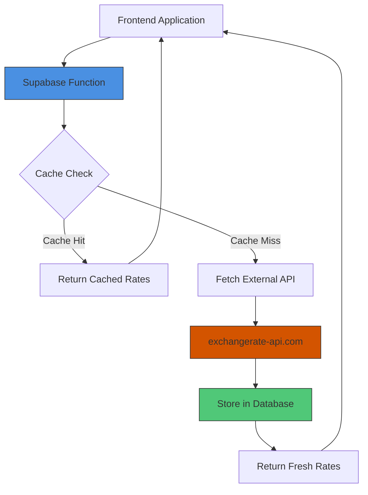
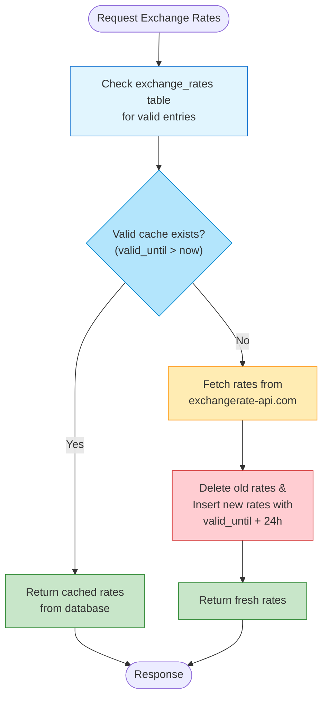
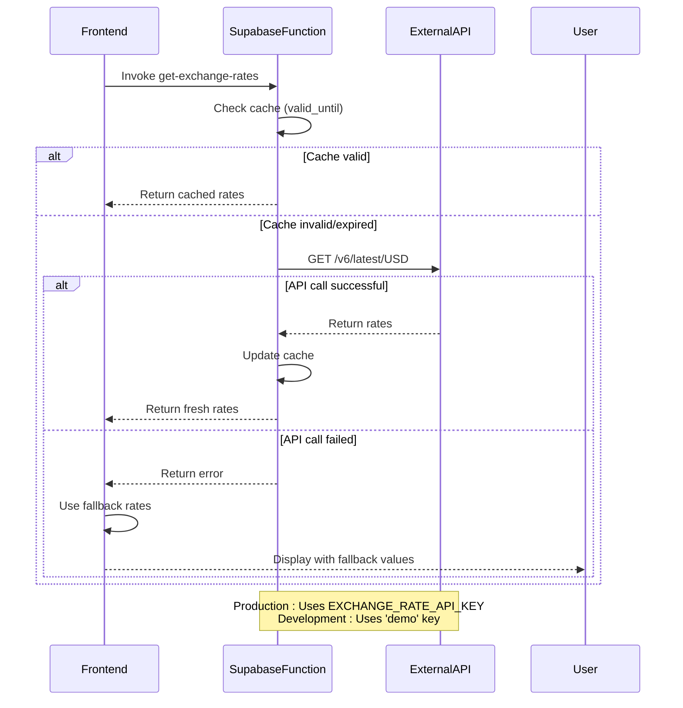
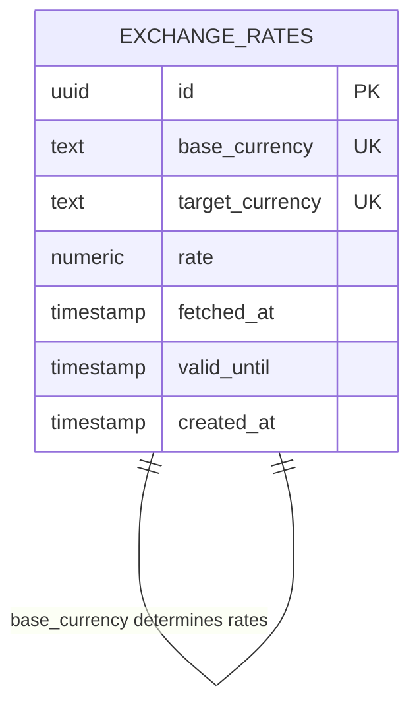
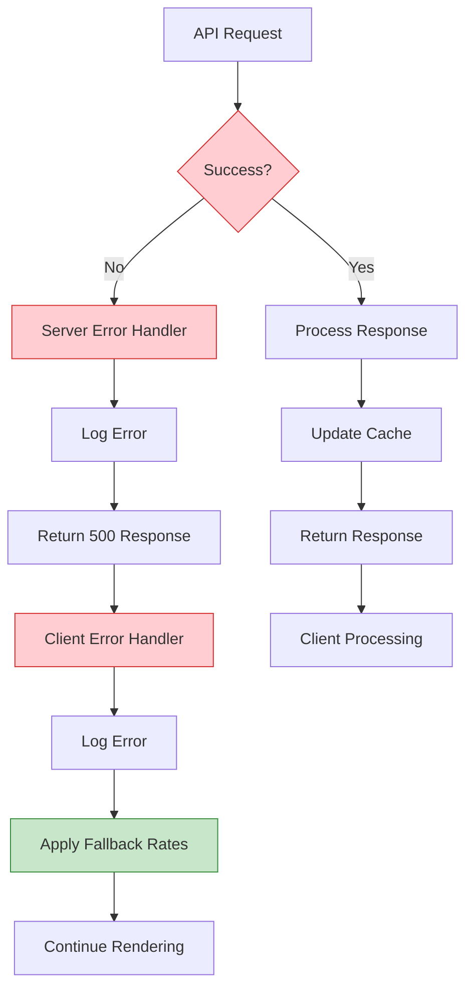
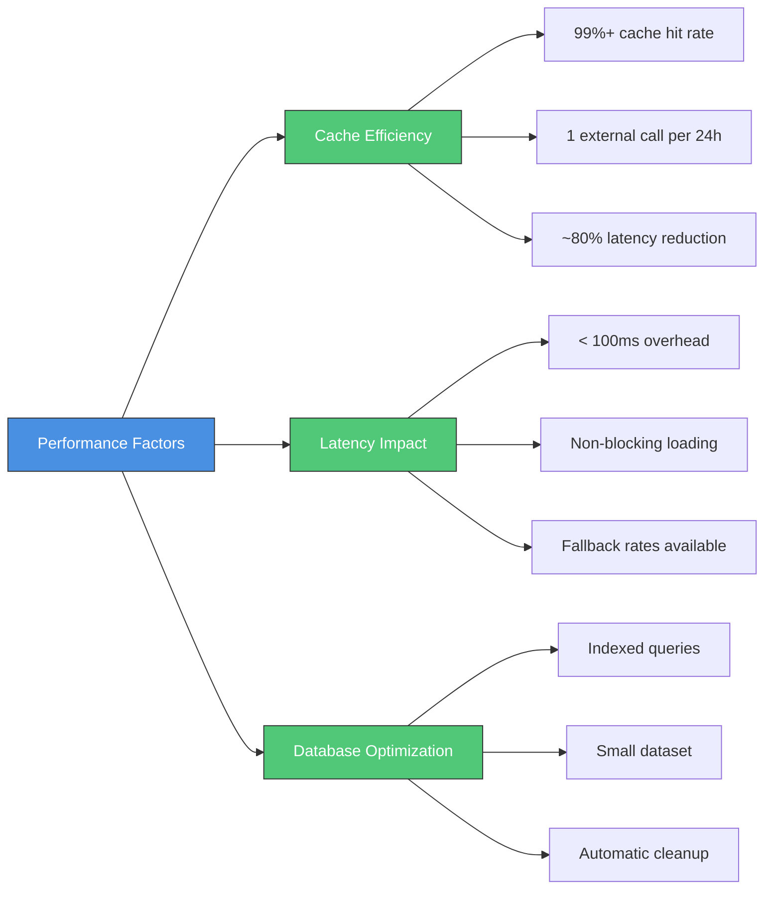

# Exchange Rates API Integration

<cite>
**Referenced Files in This Document**   
- [get-exchange-rates/index.ts](file://supabase/functions/get-exchange-rates/index.ts)
- [CurrencyDisplay.tsx](file://src/components/quote/CurrencyDisplay.tsx)
- [TABLES_ONLY.sql](file://supabase/TABLES_ONLY.sql)
- [COMPLETE_SETUP.sql](file://supabase/COMPLETE_SETUP.sql)
</cite>

## Table of Contents
1. [Introduction](#introduction)
2. [Architecture Overview](#architecture-overview)
3. [Caching Mechanism](#caching-mechanism)
4. [Fallback Strategy](#fallback-strategy)
5. [Currency Conversion Process](#currency-conversion-process)
6. [Error Handling and Rate Limiting](#error-handling-and-rate-limiting)
7. [Configuration and Testing](#configuration-and-testing)
8. [Performance Considerations](#performance-considerations)

## Introduction
The exchange rates API integration in sleekapp-v100 provides real-time currency conversion functionality for quote generation and financial calculations. This system minimizes external API calls through an efficient caching mechanism while ensuring reliability through fallback strategies. The implementation supports USD, EUR, CAD, AUD, GBP, and BDT currencies with a 24-hour cache duration, balancing accuracy with performance requirements.

## Architecture Overview
The exchange rates system follows a serverless architecture pattern with Supabase functions handling the backend logic. The architecture consists of a Deno-based serverless function that serves as the intermediary between the frontend application and the external exchange rate API.

**Diagram sources**
- [get-exchange-rates/index.ts](file://supabase/functions/get-exchange-rates/index.ts#L9-L88)
- [CurrencyDisplay.tsx](file://src/components/quote/CurrencyDisplay.tsx#L16-L23)

**Section sources**
- [get-exchange-rates/index.ts](file://supabase/functions/get-exchange-rates/index.ts#L9-L88)
- [CurrencyDisplay.tsx](file://src/components/quote/CurrencyDisplay.tsx#L16-L23)

## Caching Mechanism
The system implements a database-backed caching mechanism using the `exchange_rates` table to minimize external API calls and improve response times. The cache is managed through a timestamp-based validity system using the `valid_until` field.

The caching workflow operates as follows:
1. When a request is received, the system first checks for valid cached rates in the database
2. Validity is determined by comparing the current time with the `valid_until` timestamp
3. If valid rates exist for all required currencies, they are returned immediately
4. If no valid cache exists, fresh rates are fetched and stored with a new expiration time

**Diagram sources**
- [get-exchange-rates/index.ts](file://supabase/functions/get-exchange-rates/index.ts#L22-L36)
- [TABLES_ONLY.sql](file://supabase/TABLES_ONLY.sql#L320-L328)

**Section sources**
- [get-exchange-rates/index.ts](file://supabase/functions/get-exchange-rates/index.ts#L22-L36)
- [TABLES_ONLY.sql](file://supabase/TABLES_ONLY.sql#L320-L328)

## Fallback Strategy
The system implements a comprehensive fallback strategy to ensure uninterrupted service when the external API is unavailable. This strategy includes both development-time and runtime fallback mechanisms.

For development environments, the system uses a demo API key from exchangerate-api.com when no production key is configured. This allows developers to test currency conversion functionality without requiring a paid API subscription.

At runtime, if the external API call fails, the frontend component provides hardcoded fallback exchange rates to ensure the application remains functional. These fallback rates are used temporarily until the external service is restored.

**Diagram sources**
- [get-exchange-rates/index.ts](file://supabase/functions/get-exchange-rates/index.ts#L39-L44)
- [CurrencyDisplay.tsx](file://src/components/quote/CurrencyDisplay.tsx#L26-L35)

**Section sources**
- [get-exchange-rates/index.ts](file://supabase/functions/get-exchange-rates/index.ts#L39-L44)
- [CurrencyDisplay.tsx](file://src/components/quote/CurrencyDisplay.tsx#L26-L35)

## Currency Conversion Process
The currency conversion system supports USD, EUR, CAD, AUD, GBP, and BDT with USD as the base currency. The conversion process is designed to be efficient and reliable, with a 24-hour cache duration to balance freshness with API usage limits.

The exchange_rates database table stores conversion rates with the following schema:
- **base_currency**: The reference currency (defaults to USD)
- **target_currency**: The currency being converted to
- **rate**: The conversion rate as a numeric value (precision 10, scale 6)
- **fetched_at**: Timestamp when the rate was retrieved
- **valid_until**: Expiration timestamp for cache validity
- **created_at**: Record creation timestamp

The conversion process follows these steps:
1. Client requests exchange rates via Supabase function invocation
2. Server checks for valid cached rates in the database
3. If cache is valid and complete, returns cached rates
4. If cache is invalid, fetches fresh rates from exchangerate-api.com
5. Stores fresh rates in database with 24-hour validity
6. Returns rates to client for currency display

**Section sources**
- [TABLES_ONLY.sql](file://supabase/TABLES_ONLY.sql#L320-L328)
- [get-exchange-rates/index.ts](file://supabase/functions/get-exchange-rates/index.ts#L19-L20)

## Error Handling and Rate Limiting
The system implements robust error handling to ensure graceful degradation when external services are unavailable. The error handling strategy operates at both the server and client levels.

On the server side, the Supabase function catches any errors during the external API fetch process and returns a 500 error response. This prevents unhandled exceptions from crashing the function.

On the client side, the CurrencyDisplay component implements a comprehensive error handling strategy:
- Catches errors when invoking the Supabase function
- Logs errors for debugging purposes
- Applies hardcoded fallback exchange rates
- Continues rendering the component with approximate values
- Provides a smooth user experience even when rates cannot be retrieved

The system also protects against rate limiting by:
- Caching results for 24 hours to minimize API calls
- Using the free tier of exchangerate-api.com (1,500 requests/month)
- Falling back to cached or hardcoded values when needed

**Section sources**
- [get-exchange-rates/index.ts](file://supabase/functions/get-exchange-rates/index.ts#L81-L87)
- [CurrencyDisplay.tsx](file://src/components/quote/CurrencyDisplay.tsx#L24-L35)

## Configuration and Testing
The exchange rates system requires proper configuration for production deployment while supporting development workflows.

### Environment Configuration
The system uses the following environment variables:
- **EXCHANGE_RATE_API_KEY**: Production API key for exchangerate-api.com (required for production)
- **SUPABASE_URL**: Supabase project URL
- **SUPABASE_SERVICE_ROLE_KEY**: Supabase service role key with full database access

For development, the `EXCHANGE_RATE_API_KEY` can be omitted, causing the system to use the 'demo' key which has limited functionality but allows testing.

### Testing Cache Invalidation
To test cache invalidation:
1. Manually update the `valid_until` field in the exchange_rates table to a past timestamp
2. Or delete records from the exchange_rates table
3. Trigger a new exchange rate request from the frontend
4. Verify that fresh rates are fetched and stored

### Monitoring API Usage
API usage can be monitored through:
- Supabase function invocation logs
- Database audit logs for exchange_rates table operations
- External API provider dashboard (exchangerate-api.com)
- Application error logs for failed API calls

**Section sources**
- [get-exchange-rates/index.ts](file://supabase/functions/get-exchange-rates/index.ts#L15-L17)
- [get-exchange-rates/index.ts](file://supabase/functions/get-exchange-rates/index.ts#L39-L39)

## Performance Considerations
The exchange rates integration has been designed with performance optimization as a key priority, particularly regarding its impact on quote generation latency.

### Cache Efficiency
The 24-hour cache duration significantly improves system efficiency by:
- Reducing external API calls from potentially thousands to just one per day
- Decreasing average response time from ~300-500ms (external API) to ~50-100ms (database lookup)
- Minimizing dependency on external service availability
- Reducing costs associated with API usage

Cache hit rate is expected to be over 99% during normal operation, as most requests occur within the 24-hour validity window.

### Quote Generation Latency
The integration is optimized to minimize impact on quote generation:
- Asynchronous rate loading prevents blocking of main quote calculation
- Fallback rates ensure currency display never delays quote presentation
- Database caching keeps response times consistent
- The system adds minimal overhead (typically < 100ms) to quote generation

### Database Performance
The exchange_rates table is optimized for the access pattern:
- Indexed on base_currency and valid_until for efficient cache lookups
- Small dataset size (6 records per base currency) ensures fast queries
- Regular cleanup of expired records maintains performance
- UUID primary key ensures efficient record management

**Section sources**
- [get-exchange-rates/index.ts](file://supabase/functions/get-exchange-rates/index.ts#L48-L48)
- [CurrencyDisplay.tsx](file://src/components/quote/CurrencyDisplay.tsx#L13-L40)