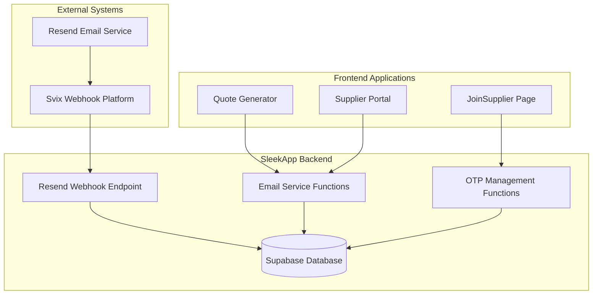
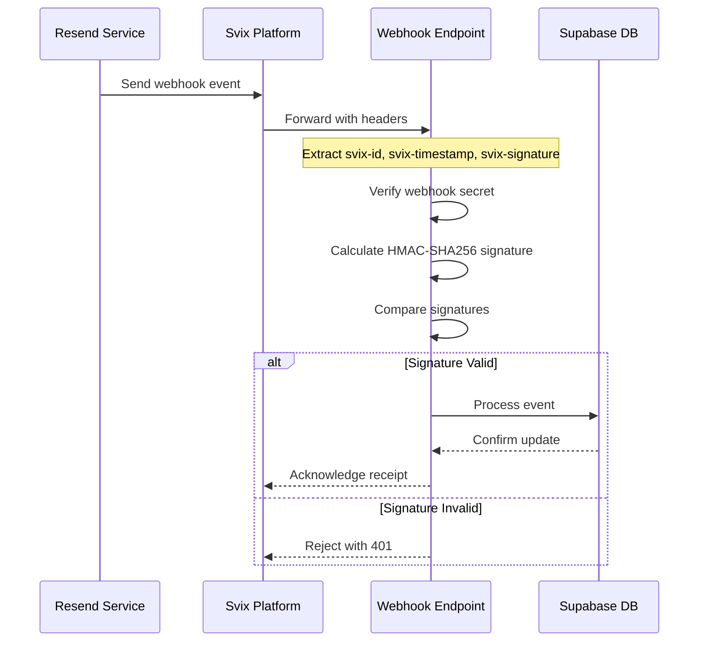
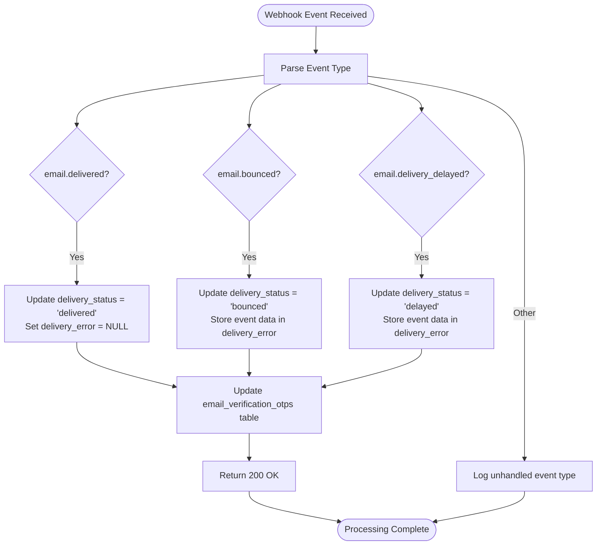
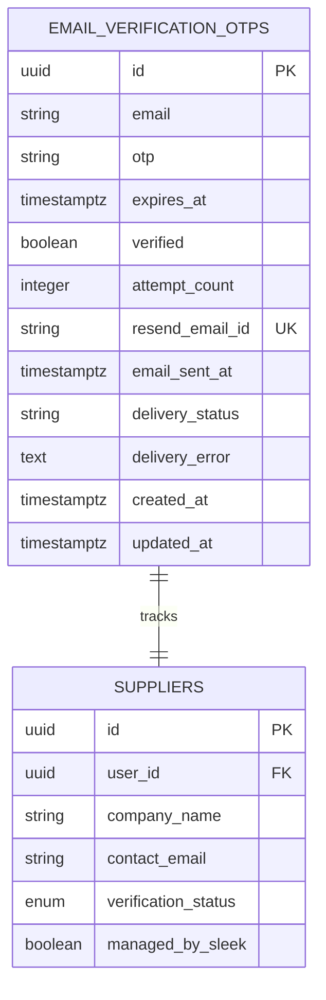
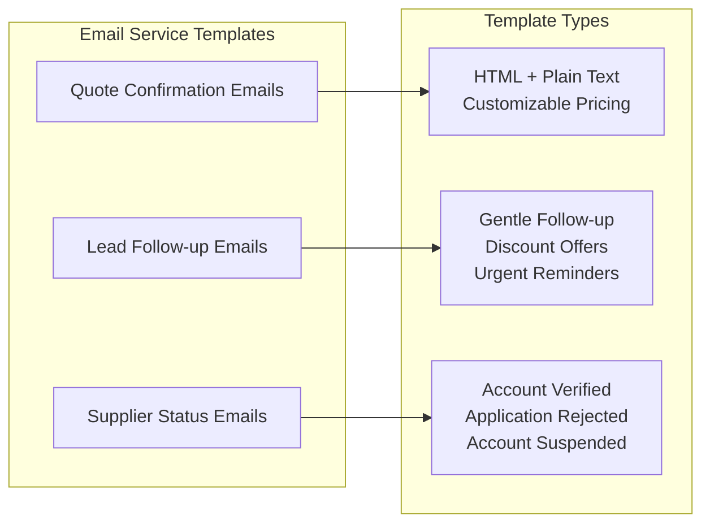
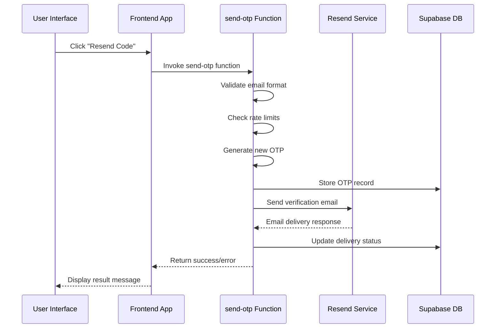
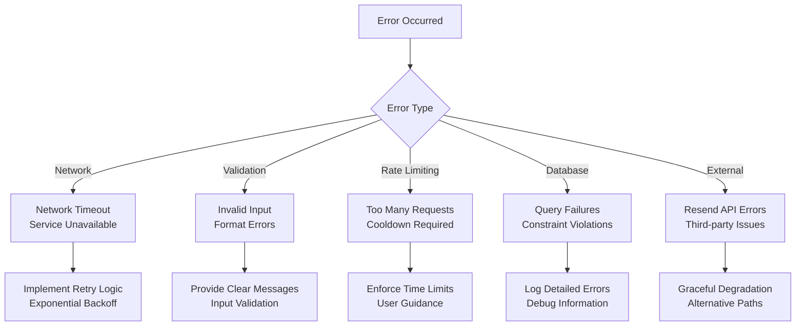
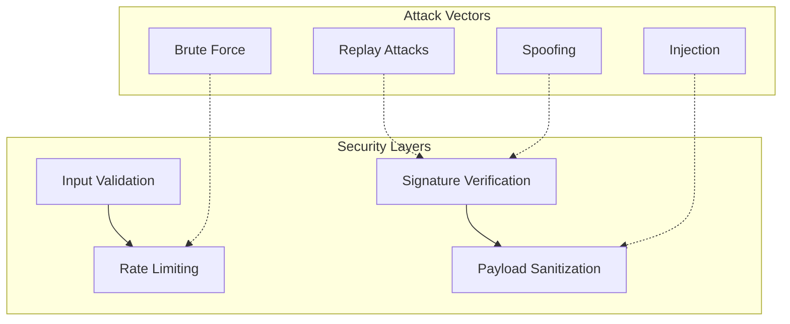
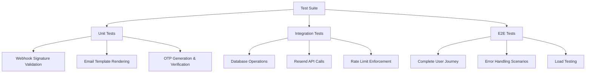

# Resend Webhook Integration

<cite>
**Referenced Files in This Document**
- [resend-webhook/index.ts](file://supabase/functions/resend-webhook/index.ts)
- [email-service/index.ts](file://supabase/functions/email-service/index.ts)
- [JoinSupplier.tsx](file://src/pages/JoinSupplier.tsx)
- [send-otp/index.ts](file://supabase/functions/send-otp/index.ts)
- [verify-otp/index.ts](file://supabase/functions/verify-otp/index.ts)
- [config.toml](file://supabase/config.toml)
- [20251119140029_887f03c6-bdb2-46d4-ac7b-4b4868f9a169.sql](file://supabase/migrations/20251119140029_887f03c6-bdb2-46d4-ac7b-4b4868f9a169.sql)
</cite>

## Table of Contents
1. [Introduction](#introduction)
2. [System Architecture](#system-architecture)
3. [Signature Verification with Svix](#signature-verification-with-svix)
4. [Event Handling](#event-handling)
5. [Database Integration](#database-integration)
6. [Transactional Email Templates](#transactional-email-templates)
7. [OTP Resend Functionality](#otp-resend-functionality)
8. [Error Handling Patterns](#error-handling-patterns)
9. [Configuration Guide](#configuration-guide)
10. [Security Considerations](#security-considerations)
11. [Testing and Monitoring](#testing-and-monitoring)
12. [Troubleshooting](#troubleshooting)

## Introduction

The Resend webhook integration in sleekapp-v100 provides comprehensive email delivery tracking and status updates through a robust Svix-based signature verification system. This integration enables real-time monitoring of email delivery status, automated OTP resend functionality, and enhanced security through cryptographic signature validation.

The system handles three primary email events: `email.delivered`, `email.bounced`, and `email.delivery_delayed`, updating the `email_verification_otps` table with delivery status information and error details. This enables sophisticated email delivery monitoring and automated retry mechanisms for failed deliveries.

## System Architecture

The Resend webhook integration follows a multi-layered architecture that ensures secure, reliable email delivery tracking:

**Diagram sources**
- [resend-webhook/index.ts](file://supabase/functions/resend-webhook/index.ts#L1-L117)
- [email-service/index.ts](file://supabase/functions/email-service/index.ts#L1-L555)
- [send-otp/index.ts](file://supabase/functions/send-otp/index.ts#L1-L489)

## Signature Verification with Svix

The webhook endpoint implements Svix-based signature verification to ensure the authenticity and integrity of incoming webhook events. This cryptographic verification prevents unauthorized access and protects against replay attacks.

### Svix Header Processing

The webhook endpoint extracts and validates Svix-specific headers that contain the signature information:

**Diagram sources**
- [resend-webhook/index.ts](file://supabase/functions/resend-webhook/index.ts#L25-L58)

### Signature Validation Implementation

The signature verification process uses HMAC-SHA256 with the `RESEND_WEBHOOK_SECRET` environment variable:

| Component | Description | Purpose |
|-----------|-------------|---------|
| `svix-id` | Unique webhook event identifier | Prevents replay attacks |
| `svix-timestamp` | Unix timestamp of event creation | Ensures freshness |
| `svix-signature` | Base64-encoded HMAC signature | Authenticates event source |
| `RESEND_WEBHOOK_SECRET` | Shared secret key | Cryptographic verification |

**Section sources**
- [resend-webhook/index.ts](file://supabase/functions/resend-webhook/index.ts#L16-L58)

## Event Handling

The webhook endpoint processes three primary email events, each with specific handling logic and database update requirements:

### Email Delivery Events

**Diagram sources**
- [resend-webhook/index.ts](file://supabase/functions/resend-webhook/index.ts#L69-L102)

### Event-Specific Handling Logic

| Event Type | Delivery Status | Error Storage | Use Case |
|------------|----------------|---------------|----------|
| `email.delivered` | `delivered` | `NULL` | Successful delivery confirmation |
| `email.bounced` | `bounced` | JSON event data | Permanent delivery failure |
| `email.delivery_delayed` | `delayed` | JSON event data | Temporary delivery delay |

**Section sources**
- [resend-webhook/index.ts](file://supabase/functions/resend-webhook/index.ts#L69-L102)

## Database Integration

The integration maintains comprehensive email delivery tracking through the `email_verification_otps` table, which stores delivery status and error information alongside OTP records.

### Database Schema Enhancements

The database schema includes specialized columns for email delivery tracking:

**Diagram sources**
- [20251119140029_887f03c6-bdb2-46d4-ac7b-4b4868f9a169.sql](file://supabase/migrations/20251119140029_887f03c6-bdb2-46d4-ac7b-4b4868f9a169.sql#L1-L21)

### Delivery Status Tracking

The system maintains detailed delivery status information:

| Field | Type | Purpose | Constraints |
|-------|------|---------|-------------|
| `resend_email_id` | TEXT | Resend API email identifier | UNIQUE constraint |
| `email_sent_at` | TIMESTAMPTZ | Delivery timestamp | NULLABLE |
| `delivery_status` | TEXT | Current delivery status | CHECK constraint |
| `delivery_error` | TEXT | Error details when failed | NULLABLE |

**Section sources**
- [20251119140029_887f03c6-bdb2-46d4-ac7b-4b4868f9a169.sql](file://supabase/migrations/20251119140029_887f03c6-bdb2-46d4-ac7b-4b4868f9a169.sql#L1-L21)

## Transactional Email Templates

The email service provides comprehensive transactional email templates for various business scenarios, including quote confirmations and supplier status notifications.

### Template Categories

**Diagram sources**
- [email-service/index.ts](file://supabase/functions/email-service/index.ts#L72-L108)

### Quote Confirmation Template Features

The quote confirmation template includes comprehensive pricing and product information:

| Information Category | Template Section | Dynamic Content |
|---------------------|------------------|-----------------|
| Customer Details | Personalized greeting | Name, company, phone |
| Product Specifications | Detailed breakdown | Type, quantity, material |
| Pricing Information | Cost summary | Unit price, total price, timeline |
| Additional Requests | Customer preferences | Swatch kit, newsletter subscription |

**Section sources**
- [email-service/index.ts](file://supabase/functions/email-service/index.ts#L221-L352)

## OTP Resend Functionality

The OTP resend functionality provides seamless reissuance of verification codes with comprehensive error handling and rate limiting.

### Resend Workflow

**Diagram sources**
- [JoinSupplier.tsx](file://src/pages/JoinSupplier.tsx#L285-L305)
- [send-otp/index.ts](file://supabase/functions/send-otp/index.ts#L480-L488)

### Rate Limiting and Validation

The resend functionality implements comprehensive validation and rate limiting:

| Validation Type | Implementation | Purpose |
|----------------|----------------|---------|
| Email Format | Regex validation | Prevent malformed emails |
| Domain Blacklist | Disposable email check | Block temporary addresses |
| Rate Limits | 5-minute cooldown | Prevent abuse |
| Daily Limits | Quote requests per day | Control usage |

**Section sources**
- [JoinSupplier.tsx](file://src/pages/JoinSupplier.tsx#L285-L305)
- [send-otp/index.ts](file://supabase/functions/send-otp/index.ts#L260-L342)

## Error Handling Patterns

The system implements comprehensive error handling patterns across all components to ensure reliability and provide meaningful feedback to users.

### Error Classification

**Diagram sources**
- [send-otp/index.ts](file://supabase/functions/send-otp/index.ts#L96-L128)
- [verify-otp/index.ts](file://supabase/functions/verify-otp/index.ts#L348-L355)

### Error Response Patterns

| Error Category | HTTP Status | Response Format | User Action |
|---------------|-------------|-----------------|-------------|
| Validation | 400 | `{ error: "message" }` | Fix input |
| Rate Limit | 429 | `{ error: "message", retryAfter: seconds }` | Wait period |
| Internal Error | 500 | `{ error: "message" }` | Try again later |
| Authentication | 401 | `{ error: "Unauthorized" }` | Re-authenticate |

**Section sources**
- [send-otp/index.ts](file://supabase/functions/send-otp/index.ts#L480-L488)
- [verify-otp/index.ts](file://supabase/functions/verify-otp/index.ts#L348-L355)

## Configuration Guide

Proper configuration is essential for the Resend webhook integration to function correctly.

### Environment Variables

| Variable | Purpose | Required | Example |
|----------|---------|----------|---------|
| `RESEND_API_KEY` | Resend API authentication | Yes | `re_xxxxxxxxxxxxxxxxxxxxxxxxxxxxxxxx` |
| `RESEND_WEBHOOK_SECRET` | Svix webhook signature verification | Yes | `whsec_xxxxxxxxxxxxxxxxxxxxxxxxxxxxxxxx` |
| `SUPABASE_URL` | Supabase database endpoint | Yes | `https://xxxxxxxx.supabase.co` |
| `SUPABASE_SERVICE_ROLE_KEY` | Database access credentials | Yes | `eyJhbGciOiJIUzI1NiIs...` |
| `RECAPTCHA_SECRET_KEY` | Anti-bot protection | No | `6LcP_RMsAAAAAAyzUVk22XySYyE5zhKuWMotskop` |

### Resend Dashboard Configuration

Configure webhook endpoints in the Resend dashboard:

1. **Webhook URL**: `https://your-domain.com/.netlify/functions/resend-webhook`
2. **Events to Subscribe**: `email.delivered`, `email.bounced`, `email.delivery_delayed`
3. **Signing Secret**: Use the `RESEND_WEBHOOK_SECRET` value
4. **HTTP Headers**: Include Svix headers (`svix-id`, `svix-timestamp`, `svix-signature`)

### Supabase Function Configuration

The webhook function is configured in Supabase with specific settings:

| Setting | Value | Purpose |
|---------|-------|---------|
| JWT Verification | Disabled | Public webhook endpoint |
| CORS Headers | Standard | Cross-origin support |
| Timeout | 30 seconds | Prevent hanging requests |

**Section sources**
- [config.toml](file://supabase/config.toml#L36-L38)
- [resend-webhook/index.ts](file://supabase/functions/resend-webhook/index.ts#L5-L8)

## Security Considerations

The integration implements multiple layers of security to protect against various attack vectors.

### Signature Validation Security

### Security Measures

| Security Layer | Implementation | Protection Against |
|---------------|----------------|-------------------|
| HMAC-SHA256 Signatures | Svix webhook verification | Message tampering, spoofing |
| Rate Limiting | Per-user request limits | Brute force attacks |
| Input Validation | Email format and length checks | Injection attacks |
| Disposable Email Blocking | Domain blacklist filtering | Bot registrations |
| CORS Headers | Origin restriction | Cross-site scripting |

### Email Enumeration Protection

The system implements several measures to prevent email enumeration attacks:

- **Generic Error Messages**: Consistent error responses regardless of whether email exists
- **Rate Limiting**: Prevents rapid-fire testing of email addresses  
- **Masked Logging**: Sanitized logging of sensitive information
- **Delayed Responses**: Randomized response timing to prevent timing attacks

**Section sources**
- [send-otp/index.ts](file://supabase/functions/send-otp/index.ts#L51-L94)
- [verify-otp/index.ts](file://supabase/functions/verify-otp/index.ts#L30-L40)

## Testing and Monitoring

Comprehensive testing and monitoring ensure the reliability and performance of the webhook integration.

### Testing Strategies

### Monitoring Metrics

Key metrics to monitor for webhook integration health:

| Metric Category | Specific Metrics | Purpose |
|----------------|------------------|---------|
| Delivery Status | Success rate, Failure rate, Delay rate | Email deliverability |
| Performance | Response time, Throughput, Error rate | System performance |
| Security | Signature validation failures, Rate limit hits | Security monitoring |
| Usage | Daily OTP requests, Active users, Error trends | Usage patterns |

### Webhook Replay Tools

Use Resend's webhook replay functionality for testing:

1. **Replay Failed Events**: Test error handling scenarios
2. **Simulate Events**: Test different event types
3. **Validate Processing**: Ensure proper event handling
4. **Performance Testing**: Load testing with multiple events

## Troubleshooting

Common issues and their solutions for the Resend webhook integration.

### Common Issues

| Issue | Symptoms | Solution |
|-------|----------|----------|
| Signature Verification Failed | 401 Unauthorized responses | Verify `RESEND_WEBHOOK_SECRET` configuration |
| Webhook Not Received | No logs in webhook function | Check Resend dashboard webhook configuration |
| Database Updates Failed | Delivery status not updating | Verify Supabase connection and permissions |
| Email Delivery Issues | High bounce rates | Review email content and recipient lists |

### Debugging Steps

1. **Check Environment Variables**: Verify all required environment variables are set
2. **Validate Webhook Configuration**: Confirm Resend dashboard settings
3. **Review Logs**: Check Supabase function logs for errors
4. **Test Connectivity**: Verify database and external service connectivity
5. **Monitor Metrics**: Track delivery statistics and error rates

### Recovery Procedures

For critical issues requiring immediate resolution:

1. **Immediate Actions**: Stop problematic email campaigns
2. **Investigation**: Review logs and error patterns
3. **Temporary Fixes**: Implement workarounds while permanent fixes are developed
4. **Communication**: Notify affected users of delays or issues
5. **Post-mortem**: Document lessons learned and prevention strategies

**Section sources**
- [resend-webhook/index.ts](file://supabase/functions/resend-webhook/index.ts#L110-L116)
- [send-otp/index.ts](file://supabase/functions/send-otp/index.ts#L480-L488)