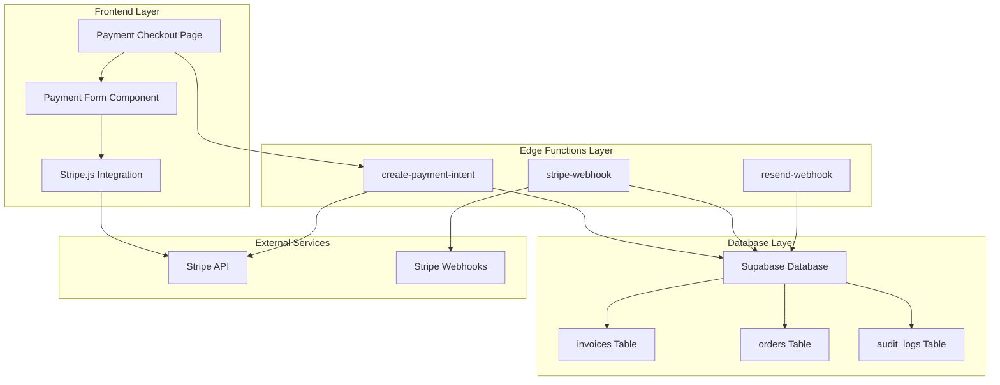
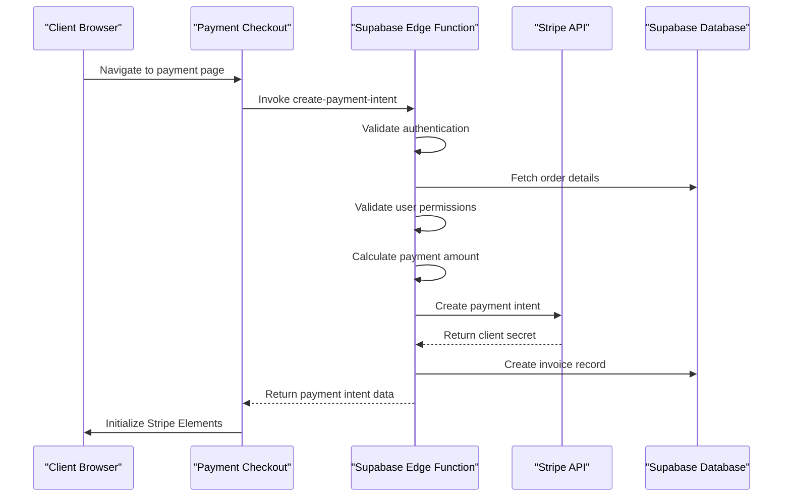
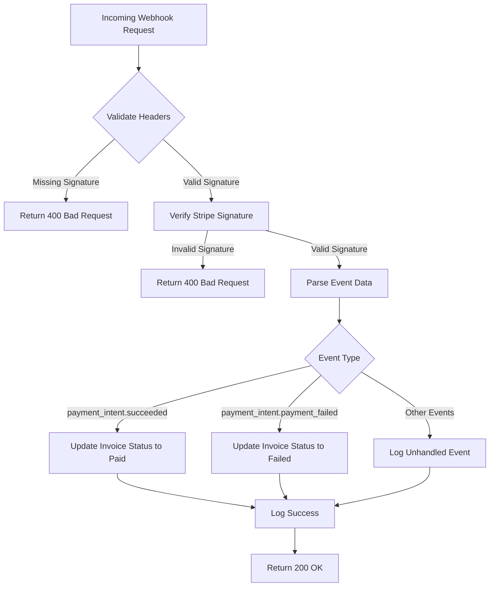
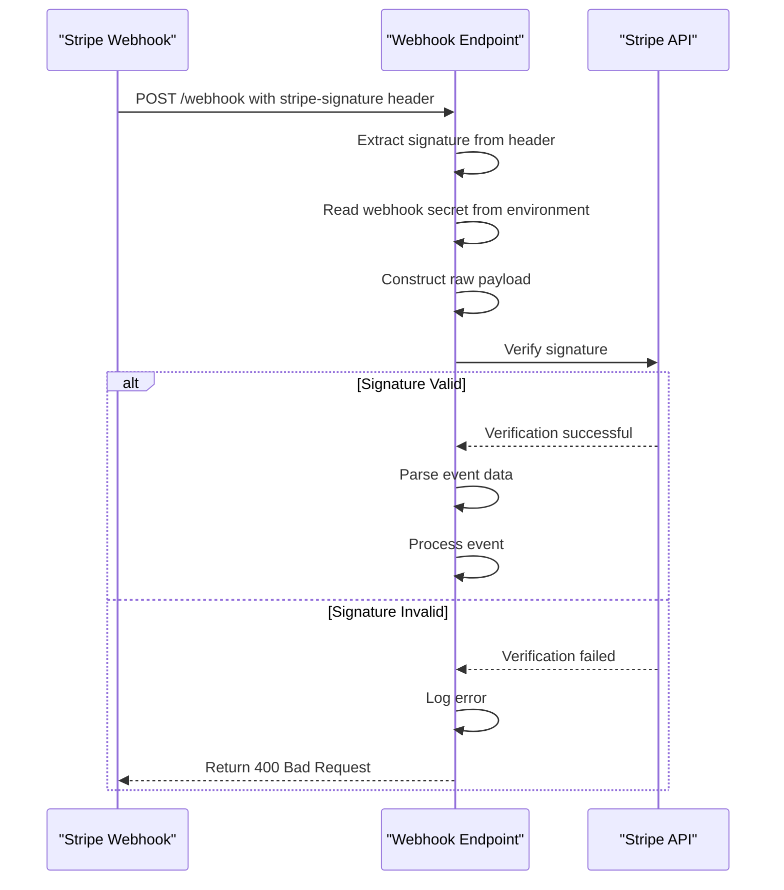
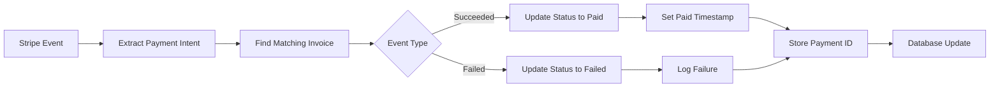
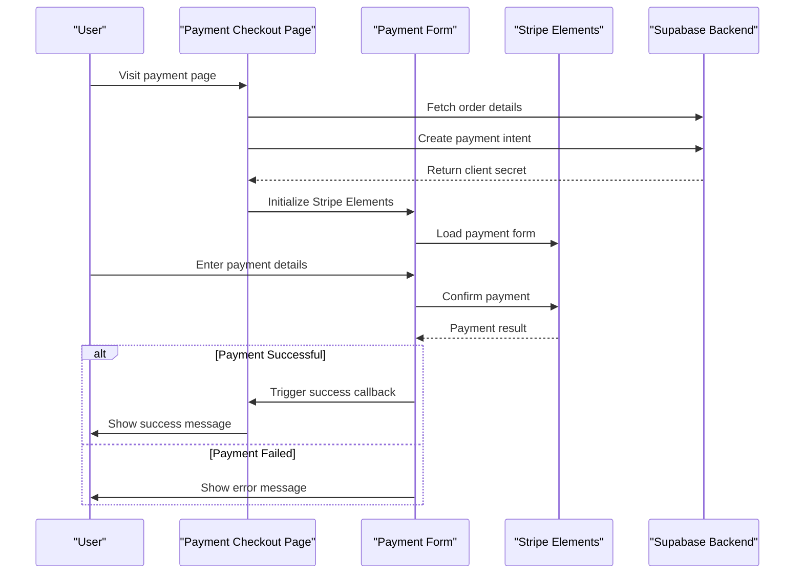

# Stripe Webhook Integration

<cite>
**Referenced Files in This Document**
- [supabase/functions/stripe-webhook/index.ts](file://supabase/functions/stripe-webhook/index.ts)
- [supabase/functions/create-payment-intent/index.ts](file://supabase/functions/create-payment-intent/index.ts)
- [src/hooks/usePayment.ts](file://src/hooks/usePayment.ts)
- [src/components/payment/PaymentForm.tsx](file://src/components/payment/PaymentForm.tsx)
- [src/pages/PaymentCheckout.tsx](file://src/pages/PaymentCheckout.tsx)
- [supabase/functions/resend-webhook/index.ts](file://supabase/functions/resend-webhook/index.ts)
- [supabase/functions/_shared/logger.ts](file://supabase/functions/_shared/logger.ts)
- [src/integrations/supabase/types.ts](file://src/integrations/supabase/types.ts)
- [supabase/FIXED_SETUP_PART1.sql](file://supabase/FIXED_SETUP_PART1.sql)
- [supabase/migrations/20251121040812_6c4fea3b-d195-422d-83c9-ade0c9dc73db.sql](file://supabase/migrations/20251121040812_6c4fea3b-d195-422d-83c9-ade0c9dc73db.sql)
</cite>

## Table of Contents
1. [Introduction](#introduction)
2. [System Architecture](#system-architecture)
3. [Environment Configuration](#environment-configuration)
4. [Payment Intent Creation](#payment-intent-creation)
5. [Webhook Endpoint Configuration](#webhook-endpoint-configuration)
6. [Signature Verification Process](#signature-verification-process)
7. [Event Handling](#event-handling)
8. [Database Integration](#database-integration)
9. [Frontend Integration](#frontend-integration)
10. [Security Considerations](#security-considerations)
11. [Testing and Monitoring](#testing-and-monitoring)
12. [Troubleshooting Guide](#troubleshooting-guide)
13. [Best Practices](#best-practices)

## Introduction

The Stripe webhook integration in sleekapp-v100 provides a comprehensive payment processing system that synchronizes payment status updates between Stripe and the Supabase database. This integration handles payment intents, webhook verification, and real-time status synchronization for invoices and orders.

The system implements robust security measures including signature verification, rate limiting, and PCI compliance boundaries. It supports multiple payment types (deposit, balance, full payment) and provides seamless integration with the frontend checkout process.

## System Architecture

The Stripe integration follows a serverless architecture with Supabase Edge Functions handling both payment creation and webhook processing:

**Diagram sources**
- [src/pages/PaymentCheckout.tsx](file://src/pages/PaymentCheckout.tsx#L1-L174)
- [supabase/functions/create-payment-intent/index.ts](file://supabase/functions/create-payment-intent/index.ts#L1-L288)
- [supabase/functions/stripe-webhook/index.ts](file://supabase/functions/stripe-webhook/index.ts#L1-L114)

## Environment Configuration

The system requires several environment variables for proper operation:

| Variable | Purpose | Required | Example |
|----------|---------|----------|---------|
| `VITE_STRIPE_PUBLISHABLE_KEY` | Frontend Stripe publishable key | Yes | `pk_test_123...` |
| `STRIPE_SECRET_KEY` | Backend Stripe secret key | Yes | `sk_test_123...` |
| `STRIPE_WEBHOOK_SECRET` | Webhook signature verification secret | Yes | `whsec_123...` |
| `SUPABASE_URL` | Supabase project URL | Yes | `https://your-project.supabase.co` |
| `SUPABASE_SERVICE_ROLE_KEY` | Service role key for database operations | Yes | `eyJhbGciOiJIUzI1NiIs...` |

**Section sources**
- [supabase/functions/stripe-webhook/index.ts](file://supabase/functions/stripe-webhook/index.ts#L16-L18)
- [src/pages/PaymentCheckout.tsx](file://src/pages/PaymentCheckout.tsx#L12-L13)

## Payment Intent Creation

The payment intent creation process involves multiple security checks and database operations:

**Diagram sources**
- [supabase/functions/create-payment-intent/index.ts](file://supabase/functions/create-payment-intent/index.ts#L18-L287)
- [src/hooks/usePayment.ts](file://src/hooks/usePayment.ts#L9-L34)

### Implementation Details

The payment intent creation process includes comprehensive security validations:

1. **Authentication Verification**: Validates user authentication using Supabase JWT tokens
2. **Permission Checking**: Ensures users can only create payments for their own orders or are admins
3. **Price Integrity Validation**: Compares order prices against original quotes with ±0.5% tolerance
4. **Amount Calculation**: Supports deposit (30%), balance (70%), and full payment scenarios
5. **Customer Management**: Creates or reuses Stripe customers with metadata linking to orders

**Section sources**
- [supabase/functions/create-payment-intent/index.ts](file://supabase/functions/create-payment-intent/index.ts#L18-L287)

## Webhook Endpoint Configuration

The webhook endpoint is configured to handle Stripe payment events with comprehensive security measures:

**Diagram sources**
- [supabase/functions/stripe-webhook/index.ts](file://supabase/functions/stripe-webhook/index.ts#L10-L113)

### Endpoint Configuration

The webhook endpoint implements CORS headers and security measures:

- **CORS Headers**: Allows cross-origin requests with appropriate headers
- **Signature Validation**: Uses Stripe's webhook signing secret for authenticity
- **Content-Type Validation**: Requires `application/json` content type
- **Rate Limiting**: Built-in protection against excessive requests

**Section sources**
- [supabase/functions/stripe-webhook/index.ts](file://supabase/functions/stripe-webhook/index.ts#L5-L13)

## Signature Verification Process

The signature verification process ensures webhook authenticity using Stripe's webhook signing mechanism:

**Diagram sources**
- [supabase/functions/stripe-webhook/index.ts](file://supabase/functions/stripe-webhook/index.ts#L40-L51)

### Security Implementation

The verification process includes multiple security layers:

1. **Signature Extraction**: Retrieves `stripe-signature` from request headers
2. **Secret Validation**: Verifies presence of `STRIPE_WEBHOOK_SECRET` environment variable
3. **Payload Construction**: Reads raw request body for signature verification
4. **Error Handling**: Provides detailed error messages for debugging

**Section sources**
- [supabase/functions/stripe-webhook/index.ts](file://supabase/functions/stripe-webhook/index.ts#L16-L51)

## Event Handling

The system handles specific Stripe events with appropriate database updates:

### payment_intent.succeeded

When a payment succeeds, the system performs the following operations:

1. **Status Update**: Changes invoice status to 'paid'
2. **Timestamp Recording**: Sets `paid_at` timestamp to current time
3. **Payment ID Storage**: Stores Stripe payment intent ID for reference
4. **Error Logging**: Logs any database update errors

### payment_intent.payment_failed

When a payment fails, the system:

1. **Status Update**: Changes invoice status to 'failed'
2. **Error Tracking**: Logs failure details for investigation
3. **No Compensation**: Maintains failed status for audit purposes

**Section sources**
- [supabase/functions/stripe-webhook/index.ts](file://supabase/functions/stripe-webhook/index.ts#L61-L98)

## Database Integration

The system maintains synchronization between Stripe payment events and the Supabase database through structured field mappings:

### Invoices Table Structure

| Field | Type | Purpose | Example Value |
|-------|------|---------|---------------|
| `stripe_payment_intent_id` | Text | Stripe payment reference | `pi_1234567890` |
| `status` | Text | Current payment status | `'paid'`, `'failed'`, `'pending'` |
| `paid_at` | Timestamp | Payment completion time | `'2024-01-15T10:30:00Z'` |
| `amount` | Numeric | Payment amount | `1500.00` |
| `payment_type` | Text | Payment type | `'deposit'`, `'balance'`, `'full'` |

### Field Mapping Process

**Diagram sources**
- [supabase/functions/stripe-webhook/index.ts](file://supabase/functions/stripe-webhook/index.ts#L66-L98)

**Section sources**
- [src/integrations/supabase/types.ts](file://src/integrations/supabase/types.ts#L1210-L1252)
- [supabase/FIXED_SETUP_PART1.sql](file://supabase/FIXED_SETUP_PART1.sql#L381-L397)

## Frontend Integration

The frontend integration uses Stripe.js with React components for secure payment processing:

### Payment Checkout Flow

**Diagram sources**
- [src/pages/PaymentCheckout.tsx](file://src/pages/PaymentCheckout.tsx#L27-L64)
- [src/components/payment/PaymentForm.tsx](file://src/components/payment/PaymentForm.tsx#L20-L56)

### Component Architecture

The frontend consists of several key components:

1. **PaymentCheckout**: Main page component handling order loading and payment initialization
2. **PaymentForm**: React component using Stripe Elements for secure payment input
3. **Stripe Integration**: Uses `@stripe/react-stripe-js` for seamless payment processing

**Section sources**
- [src/pages/PaymentCheckout.tsx](file://src/pages/PaymentCheckout.tsx#L1-L174)
- [src/components/payment/PaymentForm.tsx](file://src/components/payment/PaymentForm.tsx#L1-L94)

## Security Considerations

The system implements multiple layers of security to protect against various attack vectors:

### Signature Validation Security

1. **Webhook Authentication**: Uses Stripe's webhook signing mechanism
2. **Secret Management**: Environment variable storage for sensitive keys
3. **Request Validation**: Comprehensive header and payload validation
4. **Error Handling**: Graceful error responses without information leakage

### Rate Limiting Implementation

The system implements tiered rate limiting:

| Level | User Type | Daily Limit | Session Limit |
|-------|-----------|-------------|---------------|
| Basic | Anonymous | 3 quotes/day | 3 quotes/session |
| Standard | Authenticated | 20 quotes/day | N/A |
| Premium | Admin | Unlimited | N/A |

### PCI Compliance Boundaries

1. **Tokenization**: Never stores card details on the platform
2. **Secure Transmission**: All payment data transmitted via HTTPS
3. **PII Protection**: Automatic sanitization of sensitive data in logs
4. **Access Control**: Role-based access to sensitive operations

**Section sources**
- [supabase/functions/_shared/logger.ts](file://supabase/functions/_shared/logger.ts#L1-L173)
- [supabase/functions/create-payment-intent/index.ts](file://supabase/functions/create-payment-intent/index.ts#L39-L287)

## Testing and Monitoring

### Testing Webhooks with Stripe CLI

To test webhooks locally during development:

1. **Install Stripe CLI**: `npm install -g stripe`
2. **Forward Webhooks**: `stripe listen --forward-to localhost:3000/webhook`
3. **Trigger Events**: Use Stripe CLI commands to simulate events
4. **Verify Delivery**: Check logs for successful webhook processing

### Monitoring Failed Deliveries

The system provides comprehensive monitoring capabilities:

1. **Structured Logging**: Centralized logging with PII sanitization
2. **Error Tracking**: Automatic error capture and reporting
3. **Audit Trails**: Complete transaction history for compliance
4. **Performance Metrics**: Response time and success rate monitoring

### Replay Attack Protection

The system implements several protections against replay attacks:

1. **Event Deduplication**: Idempotent event processing
2. **Timestamp Validation**: Recent event filtering
3. **State Validation**: Database state consistency checks
4. **Signature Verification**: Cryptographic authenticity verification

**Section sources**
- [supabase/functions/_shared/logger.ts](file://supabase/functions/_shared/logger.ts#L93-L172)

## Troubleshooting Guide

### Common Issues and Solutions

#### Webhook Signature Verification Failures

**Symptoms**: 400 Bad Request responses from webhook endpoint
**Causes**: 
- Incorrect webhook secret configuration
- Network issues causing partial payload transmission
- Clock skew between systems

**Solutions**:
1. Verify `STRIPE_WEBHOOK_SECRET` environment variable
2. Check network connectivity and timeout settings
3. Ensure system clocks are synchronized

#### Payment Intent Creation Failures

**Symptoms**: Payment initialization errors
**Causes**:
- Insufficient order permissions
- Invalid order state
- Price integrity violations

**Solutions**:
1. Verify user authentication and permissions
2. Check order status and payment state
3. Validate price calculations and tolerances

#### Database Update Failures

**Symptoms**: Payments processed but status not updated
**Causes**:
- Database connectivity issues
- Constraint violations
- Race conditions

**Solutions**:
1. Monitor database connection health
2. Review database constraints and indexes
3. Implement retry logic for transient failures

**Section sources**
- [supabase/functions/stripe-webhook/index.ts](file://supabase/functions/stripe-webhook/index.ts#L106-L113)
- [supabase/functions/create-payment-intent/index.ts](file://supabase/functions/create-payment-intent/index.ts#L279-L287)

## Best Practices

### Development Guidelines

1. **Environment Separation**: Use separate Stripe accounts for development and production
2. **Logging Standards**: Implement structured logging with appropriate log levels
3. **Error Handling**: Provide meaningful error messages without exposing sensitive data
4. **Testing Coverage**: Comprehensive unit and integration testing for webhook handlers

### Production Deployment

1. **Monitoring Setup**: Implement comprehensive monitoring and alerting
2. **Backup Strategies**: Regular database backups and disaster recovery procedures
3. **Security Updates**: Regular updates to Stripe SDK and dependencies
4. **Performance Optimization**: CDN usage and caching strategies for improved response times

### Maintenance Procedures

1. **Regular Audits**: Periodic security audits and compliance checks
2. **Log Rotation**: Automated log rotation and archival procedures
3. **Capacity Planning**: Monitor usage patterns and scale resources accordingly
4. **Documentation Updates**: Keep integration documentation current with system changes