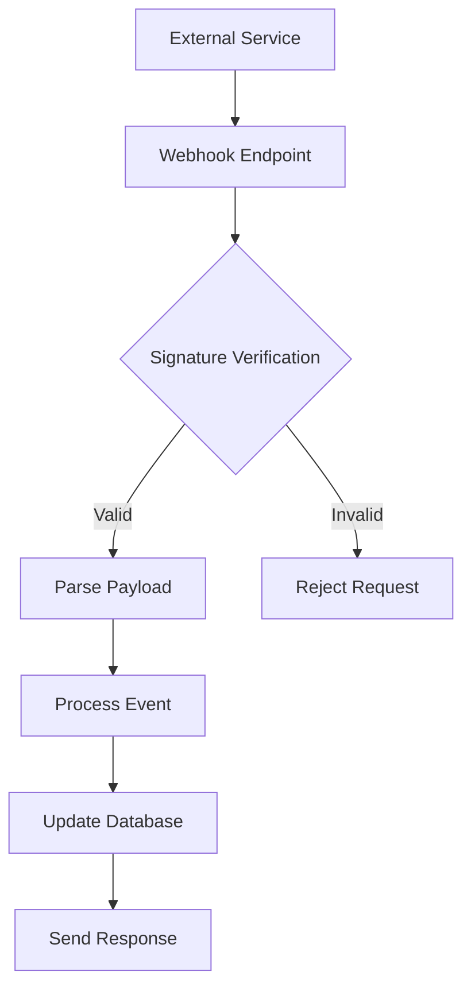
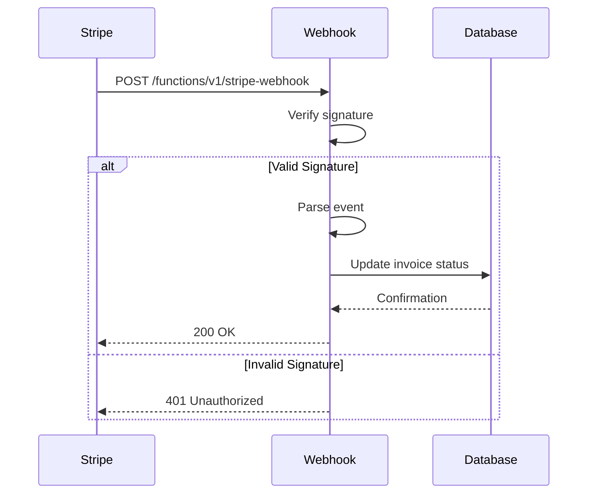
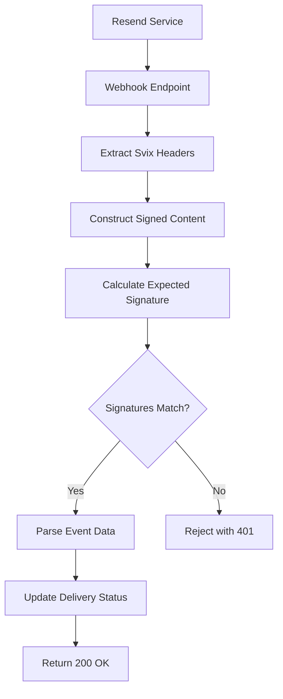
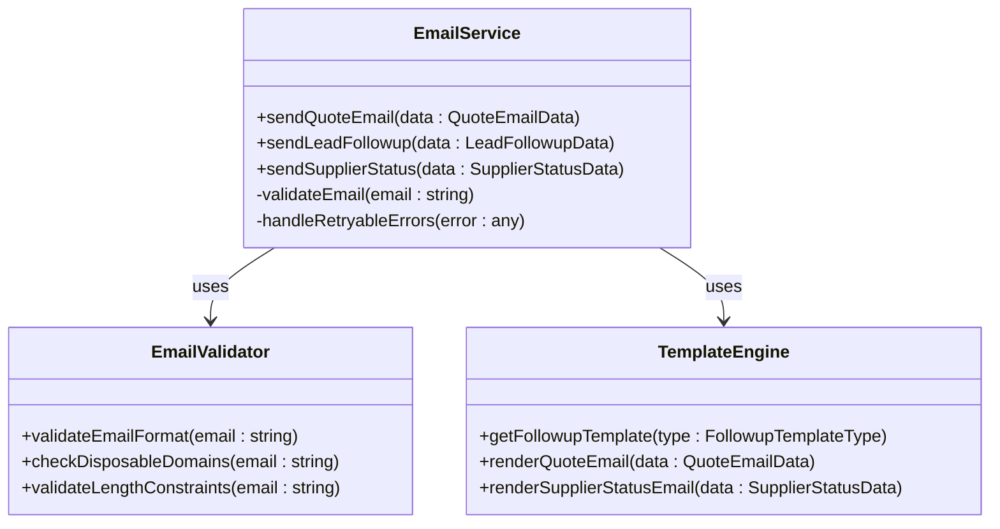
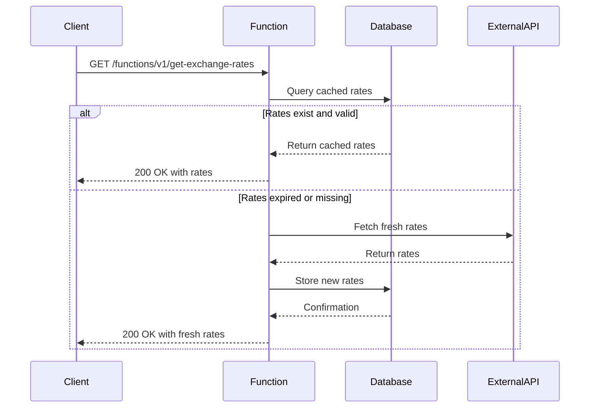
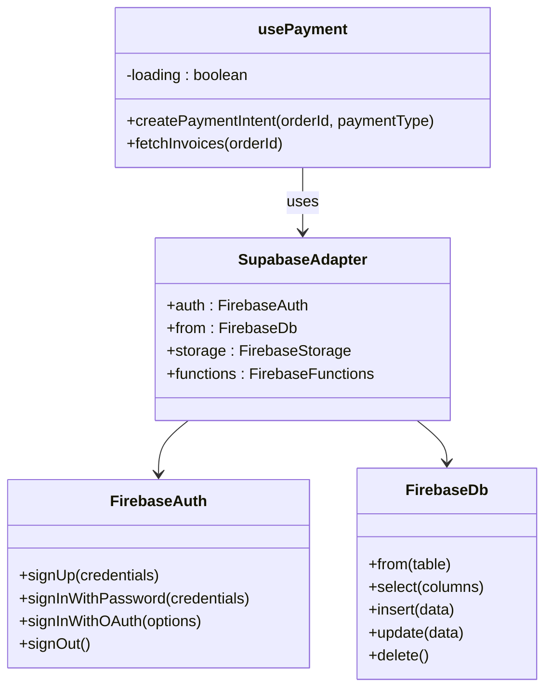
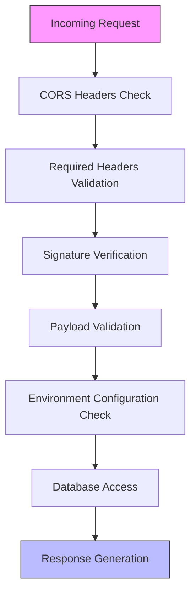
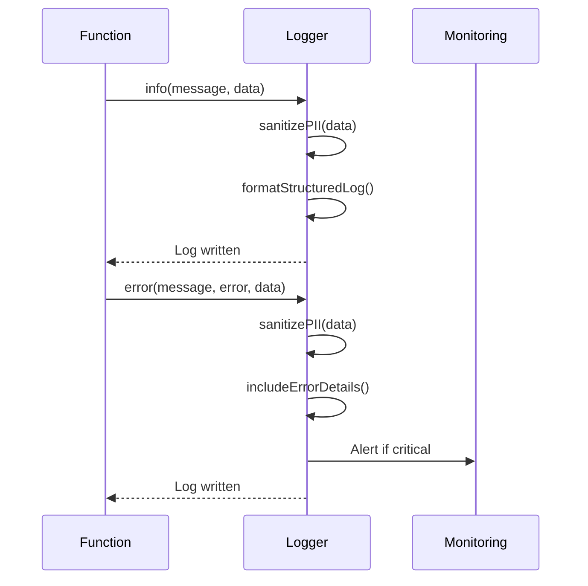

# Webhook and External Integrations API

<cite>
**Referenced Files in This Document**   
- [stripe-webhook/index.ts](file://supabase/functions/stripe-webhook/index.ts)
- [resend-webhook/index.ts](file://supabase/functions/resend-webhook/index.ts)
- [email-service/index.ts](file://supabase/functions/email-service/index.ts)
- [get-exchange-rates/index.ts](file://supabase/functions/get-exchange-rates/index.ts)
- [usePayment.ts](file://src/hooks/usePayment.ts)
- [supabase-adapter.ts](file://src/lib/firebase/supabase-adapter.ts)
- [logger.ts](file://supabase/functions/_shared/logger.ts)
- [config.toml](file://supabase/config.toml)
</cite>

## Table of Contents
1. [Introduction](#introduction)
2. [Webhook Integration Endpoints](#webhook-integration-endpoints)
3. [Stripe Webhook Implementation](#stripe-webhook-implementation)
4. [Resend Webhook Implementation](#resend-webhook-implementation)
5. [Email Service Function](#email-service-function)
6. [Exchange Rates Service](#exchange-rates-service)
7. [Client-Side Integration](#client-side-integration)
8. [Security and Validation](#security-and-validation)
9. [Error Handling and Logging](#error-handling-and-logging)
10. [Configuration and Environment Variables](#configuration-and-environment-variables)
11. [Testing and Monitoring](#testing-and-monitoring)

## Introduction

The sleekapp-v100 platform integrates with multiple third-party services through webhook endpoints and API functions to handle payment processing, email delivery notifications, transactional email sending, and currency conversion data. This documentation provides comprehensive details on the implementation, security measures, and integration patterns for these external services.

The system uses Supabase Edge Functions to create secure, serverless endpoints that receive webhook payloads from external services, validate them, and update the application state accordingly. Each integration follows a consistent pattern of signature verification, payload validation, database updates, and error handling.

**Section sources**
- [stripe-webhook/index.ts](file://supabase/functions/stripe-webhook/index.ts#L1-L114)
- [resend-webhook/index.ts](file://supabase/functions/resend-webhook/index.ts#L1-L118)
- [email-service/index.ts](file://supabase/functions/email-service/index.ts#L1-L555)

## Webhook Integration Endpoints

The platform exposes several webhook endpoints to receive notifications from third-party services. These endpoints are configured in the Supabase environment and protected with signature verification to ensure authenticity.

**Diagram sources**
- [stripe-webhook/index.ts](file://supabase/functions/stripe-webhook/index.ts#L1-L114)
- [resend-webhook/index.ts](file://supabase/functions/resend-webhook/index.ts#L1-L118)

**Section sources**
- [stripe-webhook/index.ts](file://supabase/functions/stripe-webhook/index.ts#L1-L114)
- [resend-webhook/index.ts](file://supabase/functions/resend-webhook/index.ts#L1-L118)
- [config.toml](file://supabase/config.toml#L18-L38)

## Stripe Webhook Implementation

The Stripe webhook endpoint processes payment events from Stripe, including successful payments and payment failures. The endpoint verifies the webhook signature using the Stripe-provided signature header and updates the corresponding invoice status in the database.

The implementation handles two primary event types:
- `payment_intent.succeeded`: Updates the invoice status to "paid" and records the payment timestamp
- `payment_intent.payment_failed`: Updates the invoice status to "failed"

The function uses the Stripe library to verify the webhook signature and ensures that the webhook secret is configured in the environment variables.

**Diagram sources**
- [stripe-webhook/index.ts](file://supabase/functions/stripe-webhook/index.ts#L1-L114)

**Section sources**
- [stripe-webhook/index.ts](file://supabase/functions/stripe-webhook/index.ts#L1-L114)

## Resend Webhook Implementation

The Resend webhook endpoint receives email delivery notifications from Resend, including delivery, bounce, and delay events. The endpoint uses Svix signature verification to authenticate incoming requests and updates the delivery status in the database.

The implementation processes the following event types:
- `email.delivered`: Updates the delivery status to "delivered" and clears any delivery error
- `email.bounced`: Updates the delivery status to "bounced" and records the bounce details
- `email.delivery_delayed`: Updates the delivery status to "delayed" and records the delay details

The signature verification follows the Svix protocol, combining the `svix-id`, `svix-timestamp`, and request body to create a signed content string that is compared against the provided signature.

**Diagram sources**
- [resend-webhook/index.ts](file://supabase/functions/resend-webhook/index.ts#L1-L118)

**Section sources**
- [resend-webhook/index.ts](file://supabase/functions/resend-webhook/index.ts#L1-L118)

## Email Service Function

The email service function provides a centralized interface for sending transactional emails through Resend. It supports multiple email types including quote confirmations, lead follow-ups, and supplier status notifications.

The service implements comprehensive email validation, including:
- Format validation using a comprehensive regex pattern
- Disposable email domain blocking
- Length constraints for local part and full email
- Prevention of consecutive dots in the email address

The function supports three email types with different templates and use cases:
- Quote emails: Sent to customers and internal teams when a quote is requested
- Lead follow-up emails: Sent to customers with different messaging strategies
- Supplier status emails: Sent to suppliers regarding their application status

**Diagram sources**
- [email-service/index.ts](file://supabase/functions/email-service/index.ts#L1-L555)

**Section sources**
- [email-service/index.ts](file://supabase/functions/email-service/index.ts#L1-L555)

## Exchange Rates Service

The get-exchange-rates function provides currency conversion data by fetching rates from an external API and caching them in the database. The service implements a cache-first strategy to minimize external API calls and improve performance.

The service caches rates for 24 hours and supports the following currencies:
- USD (base currency)
- EUR
- CAD
- AUD
- GBP
- BDT

The function first checks for cached rates in the database. If valid cached rates exist, they are returned immediately. Otherwise, fresh rates are fetched from the external API, stored in the database, and returned to the client.

**Diagram sources**
- [get-exchange-rates/index.ts](file://supabase/functions/get-exchange-rates/index.ts#L1-L88)

**Section sources**
- [get-exchange-rates/index.ts](file://supabase/functions/get-exchange-rates/index.ts#L1-L88)

## Client-Side Integration

The client-side integration with these services is facilitated through React hooks and Firebase adapters that provide a consistent interface for interacting with the backend functions.

The `usePayment` hook provides a clean interface for creating payment intents and fetching invoices, handling loading states and error notifications through the toast system.

The Firebase adapter mimics the Supabase client interface, allowing for seamless migration between the two services while maintaining consistent API patterns across the application.

**Diagram sources**
- [usePayment.ts](file://src/hooks/usePayment.ts#L1-L68)
- [supabase-adapter.ts](file://src/lib/firebase/supabase-adapter.ts#L1-L235)

**Section sources**
- [usePayment.ts](file://src/hooks/usePayment.ts#L1-L68)
- [supabase-adapter.ts](file://src/lib/firebase/supabase-adapter.ts#L1-L235)

## Security and Validation

The integration functions implement multiple layers of security and validation to protect against unauthorized access and data corruption.

Key security measures include:
- CORS headers to control cross-origin access
- Signature verification for webhook authenticity
- Input validation for all incoming data
- PII sanitization in logs
- Rate limiting considerations
- Environment variable validation

The system uses different signature verification methods for different services:
- Stripe webhooks use Stripe's signature verification
- Resend webhooks use Svix signature verification

All sensitive data in logs is automatically redacted using the structured logging utility.

**Diagram sources**
- [stripe-webhook/index.ts](file://supabase/functions/stripe-webhook/index.ts#L1-L114)
- [resend-webhook/index.ts](file://supabase/functions/resend-webhook/index.ts#L1-L118)
- [logger.ts](file://supabase/functions/_shared/logger.ts#L1-L173)

**Section sources**
- [stripe-webhook/index.ts](file://supabase/functions/stripe-webhook/index.ts#L1-L114)
- [resend-webhook/index.ts](file://supabase/functions/resend-webhook/index.ts#L1-L118)
- [logger.ts](file://supabase/functions/_shared/logger.ts#L1-L173)

## Error Handling and Logging

The system implements comprehensive error handling and logging to ensure reliability and facilitate debugging. The structured logging utility automatically sanitizes sensitive information and provides consistent log formatting.

The logger provides multiple log levels:
- INFO: General operational messages
- WARN: Recoverable issues
- ERROR: Failures and exceptions
- SUCCESS: Completed operations

PII fields are automatically sanitized in logs:
- Email addresses: Show only first 3 characters and domain
- Phone numbers: Show only first 4 and last 2 digits
- Order IDs: Show only first 8 characters
- Passwords, tokens, and secrets: Completely redacted

The logging system ensures that sensitive customer data is never exposed in logs while maintaining sufficient information for debugging purposes.

**Diagram sources**
- [logger.ts](file://supabase/functions/_shared/logger.ts#L1-L173)

**Section sources**
- [logger.ts](file://supabase/functions/_shared/logger.ts#L1-L173)

## Configuration and Environment Variables

The integration functions rely on several environment variables for configuration. These variables are securely stored in the Supabase environment and accessed at runtime.

### Required Environment Variables

| Variable | Purpose | Required For |
|--------|-------|-------------|
| STRIPE_SECRET_KEY | Stripe API secret key | stripe-webhook |
| STRIPE_WEBHOOK_SECRET | Stripe webhook signing secret | stripe-webhook |
| RESEND_API_KEY | Resend API key for sending emails | email-service |
| RESEND_WEBHOOK_SECRET | Resend webhook signing secret | resend-webhook |
| SUPABASE_URL | Supabase project URL | All functions |
| SUPABASE_SERVICE_ROLE_KEY | Supabase service role key | All functions |
| EXCHANGE_RATE_API_KEY | API key for exchange rate service | get-exchange-rates |

The system includes validation for required environment variables, with appropriate error handling when configuration is missing. The config.toml file defines the JWT verification settings for each function, with webhook endpoints typically having JWT verification disabled to allow external services to send requests.

**Section sources**
- [stripe-webhook/index.ts](file://supabase/functions/stripe-webhook/index.ts#L1-L114)
- [resend-webhook/index.ts](file://supabase/functions/resend-webhook/index.ts#L1-L118)
- [email-service/index.ts](file://supabase/functions/email-service/index.ts#L1-L555)
- [get-exchange-rates/index.ts](file://supabase/functions/get-exchange-rates/index.ts#L1-L88)
- [config.toml](file://supabase/config.toml#L1-L73)

## Testing and Monitoring

The webhook and integration functions include several features to support testing and monitoring of system health.

### Testing Strategies
- Use Stripe CLI to replay webhook events during development
- Use Resend webhook testing tools to simulate delivery events
- Implement comprehensive unit tests for email validation logic
- Use Supabase local development environment for end-to-end testing

### Monitoring and Health Checks
- Structured logs with consistent formatting for easy parsing
- Error tracking for failed webhook deliveries
- Performance monitoring for external API calls
- Cache hit/miss metrics for exchange rate service
- Email delivery success/failure rates

The system is designed to be observable, with clear logging of all significant events and errors. The structured logging format enables easy integration with monitoring and alerting systems.

**Section sources**
- [stripe-webhook/index.ts](file://supabase/functions/stripe-webhook/index.ts#L1-L114)
- [resend-webhook/index.ts](file://supabase/functions/resend-webhook/index.ts#L1-L118)
- [email-service/index.ts](file://supabase/functions/email-service/index.ts#L1-L555)
- [get-exchange-rates/index.ts](file://supabase/functions/get-exchange-rates/index.ts#L1-L88)
- [logger.ts](file://supabase/functions/_shared/logger.ts#L1-L173)