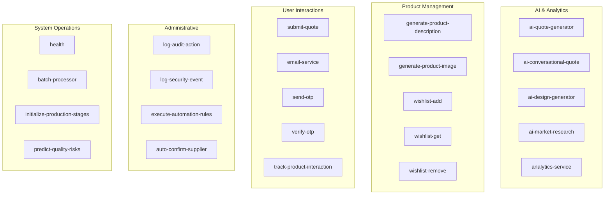
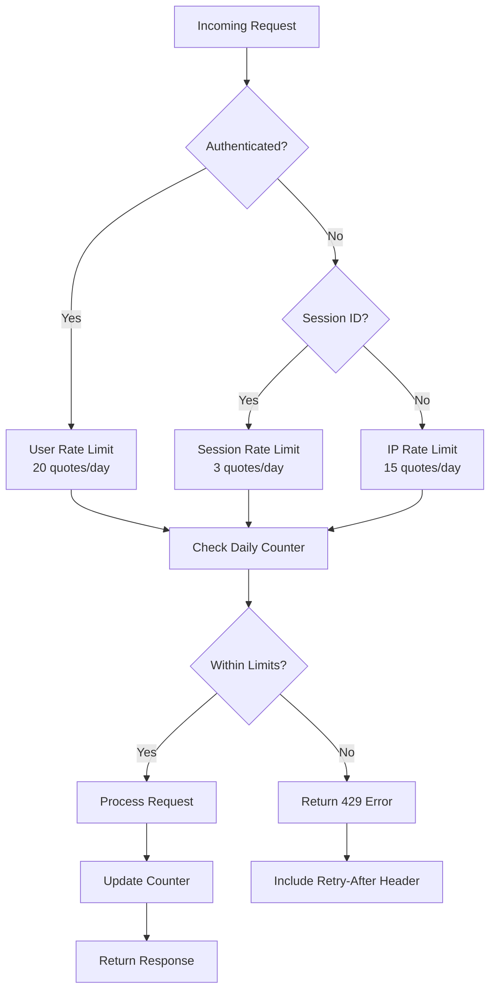

# API Reference

<cite>
**Referenced Files in This Document**
- [src/lib/api/aiQuote.ts](file://src/lib/api/aiQuote.ts)
- [src/integrations/supabase/client.ts](file://src/integrations/supabase/client.ts)
- [supabase/functions/ai-quote-generator/index.ts](file://supabase/functions/ai-quote-generator/index.ts)
- [supabase/functions/submit-quote/index.ts](file://supabase/functions/submit-quote/index.ts)
- [supabase/functions/email-service/index.ts](file://supabase/functions/email-service/index.ts)
- [supabase/functions/analytics-service/index.ts](file://supabase/functions/analytics-service/index.ts)
- [supabase/functions/wishlist-add/index.ts](file://supabase/functions/wishlist-add/index.ts)
- [supabase/functions/send-otp/index.ts](file://supabase/functions/send-otp/index.ts)
- [supabase/functions/health/index.ts](file://supabase/functions/health/index.ts)
- [supabase/functions/generate-product-description/index.ts](file://supabase/functions/generate-product-description/index.ts)
- [supabase/functions/log-audit-action/index.ts](file://supabase/functions/log-audit-action/index.ts)
- [supabase/functions/shared/securityLogger.ts](file://supabase/functions/shared/securityLogger.ts)
- [src/components/AIQuoteGenerator.tsx](file://src/components/AIQuoteGenerator.tsx)
</cite>

## Table of Contents
1. [Introduction](#introduction)
2. [Edge Functions Overview](#edge-functions-overview)
3. [Core API Clients](#core-api-clients)
4. [AI Quote Generation API](#ai-quote-generation-api)
5. [Supporting APIs](#supporting-apis)
6. [Authentication & Security](#authentication--security)
7. [Rate Limiting & Error Handling](#rate-limiting--error-handling)
8. [Frontend Implementation](#frontend-implementation)
9. [Performance Optimization](#performance-optimization)
10. [Monitoring & Health Checks](#monitoring--health-checks)
11. [Client Implementation Guidelines](#client-implementation-guidelines)

## Introduction

This API reference documents the complete Supabase Edge Functions ecosystem and internal API clients for Sleek Apparels. The platform provides comprehensive AI-powered quote generation, product management, and administrative services through a robust edge computing architecture.

The API consists of 43 Edge Functions organized into functional categories including AI services, product management, user interactions, and administrative operations. All functions are built on Deno runtime with TypeScript support and integrate seamlessly with Supabase for database operations and authentication.

## Edge Functions Overview

The Edge Functions ecosystem provides 43 distinct endpoints organized across multiple functional domains:



**Diagram sources**
- [supabase/functions/ai-quote-generator/index.ts](file://supabase/functions/ai-quote-generator/index.ts#L1-L50)
- [supabase/functions/analytics-service/index.ts](file://supabase/functions/analytics-service/index.ts#L1-L50)
- [supabase/functions/email-service/index.ts](file://supabase/functions/email-service/index.ts#L1-L50)

### Function Categories

| Category | Count | Purpose | Authentication |
|----------|-------|---------|----------------|
| **AI Services** | 12 | AI-powered quote generation, design creation, market research | Optional |
| **Product Management** | 5 | Product descriptions, images, wishlists | Required |
| **User Interactions** | 10 | Quote submissions, email notifications, OTP verification | Optional |
| **Administrative** | 8 | Audit logging, security monitoring, automation | Required |
| **System Operations** | 8 | Health monitoring, batch processing, production stages | Required |

**Section sources**
- [supabase/functions/ai-quote-generator/index.ts](file://supabase/functions/ai-quote-generator/index.ts#L1-L100)
- [supabase/functions/analytics-service/index.ts](file://supabase/functions/analytics-service/index.ts#L1-L100)

## Core API Clients

### Supabase Client Wrapper

The primary Supabase client provides centralized database access with enhanced configuration:

```typescript
// Configuration and initialization
const supabase = createClient<Database>(SUPABASE_URL, SUPABASE_PUBLISHABLE_KEY, {
  auth: {
    storage: localStorage,
    persistSession: true,
    autoRefreshToken: true,
  }
});
```

**Key Features:**
- Persistent session management
- Automatic token refresh
- Local storage integration
- Type-safe database operations

**Section sources**
- [src/integrations/supabase/client.ts](file://src/integrations/supabase/client.ts#L1-L20)

### AI Quote API Client

The enhanced AI Quote API provides sophisticated quote generation with retry logic and timeout handling:

```typescript
interface AIQuoteRequest {
  productType: string;
  quantity: number;
  complexityLevel?: 'simple' | 'medium' | 'complex';
  fabricType?: string;
  gsm?: string;
  printType?: string;
  additionalRequirements?: string;
  customerEmail: string;
  customerName?: string;
  targetDate?: string;
  files?: Array<{
    name: string;
    type: string;
    data: string;
  }>;
}

interface AIQuoteResponse {
  success: boolean;
  quote: {
    id: string;
    total_price: number;
    estimated_delivery_days: number;
    quote_data: any;
    ai_suggestions: string;
  };
  timeline: Array<{
    stage: string;
    days: number;
    startDate: string;
    endDate: string;
  }>;
  aiInsights: string;
}
```

**Section sources**
- [src/lib/api/aiQuote.ts](file://src/lib/api/aiQuote.ts#L9-L43)

## AI Quote Generation API

### Endpoint: `/functions/ai-quote-generator`

**HTTP Method:** `POST`

**URL Pattern:** `https://your-supabase-url/functions/v1/ai-quote-generator`

**Authentication:** Optional (supports both authenticated and anonymous sessions)

**Request Schema:**

| Field | Type | Required | Validation | Description |
|-------|------|----------|------------|-------------|
| `productType` | string | Yes | Min 1, Max 100 chars | Product category name |
| `quantity` | number | Yes | Min 50, Max 100,000 | Order quantity |
| `complexityLevel` | enum | No | simple/medium/complex | Manufacturing complexity |
| `fabricType` | string | No | Max 100 chars | Fabric specification |
| `additionalRequirements` | string | No | Max 2000 chars | Special requirements |
| `customerEmail` | string | Yes | Valid email format | Recipient email |
| `customerName` | string | No | Max 100 chars | Customer name |
| `targetDate` | string | No | ISO date format | Desired delivery date |
| `files` | array | No | Max 3 files, 20MB total | Design files for analysis |

**Response Schema:**

```json
{
  "success": true,
  "quote": {
    "id": "uuid",
    "total_price": 1250.75,
    "estimated_delivery_days": 45,
    "quote_data": {
      "breakdown": {
        "baseUnitPrice": 5.5,
        "complexityFactor": 1.3,
        "volumeDiscount": 0.95,
        "finalUnitPrice": 5.225,
        "totalPrice": 1250.75
      },
      "timeline": {
        "samplingDays": 5,
        "productionDays": 30,
        "bufferDays": 10,
        "totalDays": 45,
        "estimatedDeliveryDate": "2024-02-15"
      },
      "moqRange": {
        "min": 50,
        "max": 1000,
        "requested": 250
      }
    },
    "ai_suggestions": "Recommended: Increase quantity to 500+ for better pricing..."
  },
  "timeline": [
    {
      "stage": "Sampling & Approval",
      "days": 5,
      "startDate": "2024-01-10",
      "endDate": "2024-01-15"
    }
  ],
  "aiInsights": "Based on your requirements, we recommend...",
  "requestId": "uuid"
}
```

**Rate Limiting:**
- **IP-based:** 15 quotes per IP per day
- **User-based:** 20 quotes per user per day (authenticated)
- **Session-based:** 3 quotes per session per day (anonymous)

**Error Responses:**

| Status | Code | Description |
|--------|------|-------------|
| 400 | VALIDATION_ERROR | Invalid input data |
| 403 | UNAUTHORIZED_ORIGIN | Blocked from unauthorized domain |
| 429 | RATE_LIMIT_EXCEEDED | Daily quota exceeded |
| 500 | ENV_CONFIG_ERROR | Service configuration issue |
| 503 | DATABASE_ERROR | Temporary database issue |
| 504 | TIMEOUT_ERROR | Request timeout |

**Section sources**
- [supabase/functions/ai-quote-generator/index.ts](file://supabase/functions/ai-quote-generator/index.ts#L1-L807)
- [src/lib/api/aiQuote.ts](file://src/lib/api/aiQuote.ts#L49-L146)

## Supporting APIs

### Submit Quote API

**Endpoint:** `/functions/submit-quote`

**Purpose:** Handles traditional quote requests without AI analysis

**Authentication:** Optional

**Request Schema:**
```typescript
interface SubmitQuoteRequest {
  name: string;
  email: string;
  company?: string;
  whatsapp?: string;
  productType: string;
  quantity: number;
  gauge?: string;
  targetDate?: string;
  notes: string;
  sessionId?: string;
}
```

### Email Service API

**Endpoint:** `/functions/email-service`

**Purpose:** Sends automated emails for quotes, follow-ups, and supplier notifications

**Supported Email Types:**
- `quote`: New quote notifications
- `lead-followup`: Customer follow-up sequences
- `supplier-status`: Supplier verification updates

### Analytics Service API

**Endpoint:** `/functions/analytics-service`

**Purpose:** Provides AI-powered analytics for orders and quality control

**Supported Analysis Types:**
- `order-insights`: Production progress analysis
- `quality-analysis`: Defect pattern analysis

**Section sources**
- [supabase/functions/submit-quote/index.ts](file://supabase/functions/submit-quote/index.ts#L1-L222)
- [supabase/functions/email-service/index.ts](file://supabase/functions/email-service/index.ts#L1-L555)
- [supabase/functions/analytics-service/index.ts](file://supabase/functions/analytics-service/index.ts#L1-L220)

## Authentication & Security

### JWT Token Validation

All authenticated endpoints require Bearer token validation:

```typescript
// Token extraction and validation
const authHeader = req.headers.get('Authorization');
if (authHeader) {
  const token = authHeader.replace('Bearer ', '');
  const { data: { user } } = await supabaseClient.auth.getUser(token);
  userId = user?.id || null;
}
```

### Origin Validation

Functions implement strict origin validation for security:

```typescript
const allowedOrigins = [
  'https://sleekapparels.com',
  'https://www.sleekapparels.com', 
  'http://localhost:5173',
  'lovableproject.com',
  'netlify.app'
];
```

### Security Logging

Comprehensive security event logging tracks suspicious activities:

```typescript
interface SecurityEventParams {
  event_type: 'captcha_failure' | 'rate_limit_violation' | 'suspicious_pattern' | 'cost_alert';
  severity: 'low' | 'medium' | 'high' | 'critical';
  source: string;
  details?: any;
  user_id?: string;
  session_id?: string;
}
```

**Section sources**
- [supabase/functions/ai-quote-generator/index.ts](file://supabase/functions/ai-quote-generator/index.ts#L155-L202)
- [supabase/functions/shared/securityLogger.ts](file://supabase/functions/shared/securityLogger.ts#L1-L88)

## Rate Limiting & Error Handling

### Tiered Rate Limiting

The system implements a sophisticated rate limiting strategy:



**Diagram sources**
- [supabase/functions/ai-quote-generator/index.ts](file://supabase/functions/ai-quote-generator/index.ts#L284-L368)

### Error Classification

| Error Type | HTTP Status | Retryable | Recovery Strategy |
|------------|-------------|-----------|-------------------|
| Validation | 400 | No | Fix input data |
| Rate Limit | 429 | Yes | Wait and retry |
| Database | 503 | Yes | Exponential backoff |
| Timeout | 504 | Yes | Retry with shorter request |
| Internal | 500 | Maybe | Check service health |

### Retry Logic Implementation

The client implements intelligent retry mechanisms:

```typescript
// Maximum 2 retries with exponential backoff
const maxRetries = 2;
let lastError: Error | null = null;

for (let attempt = 0; attempt <= maxRetries; attempt++) {
  try {
    // Attempt request
    const response = await supabase.functions.invoke('ai-quote-generator', {
      body: request,
      timeout: 30000
    });
    
    if (response.error) {
      // Handle retryable errors
      if (response.error.retryable && attempt < maxRetries) {
        const delay = response.error.retryAfter 
          ? response.error.retryAfter * 1000 
          : (attempt + 1) * 1000;
        await new Promise(resolve => setTimeout(resolve, delay));
        continue;
      }
      throw new Error(response.error.message);
    }
    
    return response.data;
  } catch (error) {
    lastError = error;
    if (attempt === maxRetries) throw error;
  }
}
```

**Section sources**
- [src/lib/api/aiQuote.ts](file://src/lib/api/aiQuote.ts#L59-L146)
- [supabase/functions/ai-quote-generator/index.ts](file://supabase/functions/ai-quote-generator/index.ts#L37-L94)

## Frontend Implementation

### AI Quote Generator Component

The frontend implementation demonstrates best practices for API consumption:

```typescript
// Form validation with Zod
const quoteFormSchema = z.object({
  productType: z.string().min(1, "Product type is required"),
  quantity: z.number().int().min(50, "Minimum order: 50 units").max(100000),
  complexityLevel: z.enum(['simple', 'medium', 'complex']).optional(),
  customerEmail: z.string().email("Valid email required"),
  // ... additional fields
});

// File upload handling with validation
const handleFileUpload = (e: React.ChangeEvent<HTMLInputElement>) => {
  const files = Array.from(e.target.files || []);
  const validFiles = files.filter(file => {
    const isImage = file.type.startsWith('image/');
    const isPDF = file.type === 'application/pdf';
    const isUnder20MB = file.size <= 20 * 1024 * 1024;
    return (isImage || isPDF) && isUnder20MB;
  });
  
  setUploadedFiles(prev => [...prev, ...validFiles].slice(0, 3));
};
```

### Progressive Loading Implementation

```typescript
// Simulated progress for better UX
const [loadingProgress, setLoadingProgress] = useState(0);

const progressInterval = setInterval(() => {
  setLoadingProgress(prev => {
    if (prev >= 90) return prev;
    return prev + 10;
  });
}, 3000);

// Client-side timeout with fallback
const timeoutId = setTimeout(() => {
  clearInterval(progressInterval);
  setLoading(false);
  setLoadingProgress(0);
  toast({
    title: "Request Timeout",
    description: "Try simplifying requirements or contact support.",
    variant: "destructive"
  });
}, 35000);
```

**Section sources**
- [src/components/AIQuoteGenerator.tsx](file://src/components/AIQuoteGenerator.tsx#L1-L200)

## Performance Optimization

### AI Cost Tracking

The system implements comprehensive cost monitoring:

```typescript
// Cost calculation per function
const COST_PER_MILLION_TOKENS: Record<string, { input: number; output: number }> = {
  'google/gemini-2.5-flash': { input: 0.075, output: 0.30 },
  'google/gemini-2.5-pro': { input: 1.25, output: 5.00 }
};

const estimatedCost = (params.request_tokens / 1_000_000) * costConfig.input +
                     (params.response_tokens / 1_000_000) * costConfig.output;
```

### Caching Strategies

- **Session-based caching:** Local storage for quote sessions
- **IP-based rate limiting:** Memory cache for temporary counters
- **Product configuration caching:** Database query optimization

### Optimization Tips

1. **Minimize file uploads:** Keep design files under 20MB
2. **Batch requests:** Group related operations when possible
3. **Use appropriate models:** Choose Gemini Flash for text-only, Pro for complex analysis
4. **Implement client-side validation:** Reduce server load with early validation

**Section sources**
- [supabase/functions/shared/securityLogger.ts](file://supabase/functions/shared/securityLogger.ts#L49-L88)

## Monitoring & Health Checks

### Health Check Endpoint

**Endpoint:** `/functions/health`

**Purpose:** Monitors Edge Function availability and basic connectivity

**Response:**
```json
{
  "ok": true,
  "timestamp": "2024-01-15T10:30:00Z",
  "service": "edge-functions"
}
```

### Audit Logging

Comprehensive audit trails for administrative actions:

```typescript
interface AuditLogRequest {
  action: string;
  resource_type: string;
  resource_id?: string;
  details?: Record<string, any>;
  user_id?: string;
}
```

### Security Event Monitoring

Track and log security-related events:

```typescript
// Security event types
const SECURITY_EVENTS = [
  'captcha_failure',
  'rate_limit_violation', 
  'suspicious_pattern',
  'cost_alert'
];

// Severity levels
const SEVERITY_LEVELS = ['low', 'medium', 'high', 'critical'];
```

**Section sources**
- [supabase/functions/health/index.ts](file://supabase/functions/health/index.ts#L1-L34)
- [supabase/functions/log-audit-action/index.ts](file://supabase/functions/log-audit-action/index.ts#L1-L97)

## Client Implementation Guidelines

### Frontend Client Setup

```typescript
// Initialize Supabase client
import { createClient } from '@supabase/supabase-js';

const supabase = createClient(
  'https://your-supabase-url.supabase.co',
  'your-anon-key'
);

// Enhanced API wrapper with retry logic
export const generateAIQuote = async (request: AIQuoteRequest): Promise<AIQuoteResponse> => {
  const maxRetries = 2;
  let lastError: Error | null = null;
  
  for (let attempt = 0; attempt <= maxRetries; attempt++) {
    try {
      const { data, error } = await supabase.functions.invoke('ai-quote-generator', {
        body: request,
        timeout: 30000
      });
      
      if (error) {
        if (error.retryable && attempt < maxRetries) {
          await new Promise(resolve => setTimeout(resolve, 1000 * (attempt + 1)));
          continue;
        }
        throw new Error(error.message);
      }
      
      return data;
    } catch (error) {
      lastError = error;
      if (attempt === maxRetries) throw error;
    }
  }
};
```

### External System Integration

For external systems integrating with the API:

1. **Environment Configuration:**
   ```bash
   SUPABASE_URL=https://your-supabase-url.supabase.co
   SUPABASE_SERVICE_ROLE_KEY=your-service-role-key
   LOVABLE_API_KEY=your-lovable-api-key
   ```

2. **Authentication Headers:**
   ```http
   Authorization: Bearer your-jwt-token
   Content-Type: application/json
   ```

3. **Rate Limit Compliance:**
   - Monitor `Retry-After` headers
   - Implement exponential backoff
   - Respect daily quotas

4. **Error Handling Best Practices:**
   ```typescript
   try {
     const response = await fetch('/functions/ai-quote-generator', {
       method: 'POST',
       headers: { 'Content-Type': 'application/json' },
       body: JSON.stringify(request)
     });
     
     if (!response.ok) {
       const errorData = await response.json();
       if (response.status === 429) {
         // Handle rate limiting
         const retryAfter = response.headers.get('Retry-After');
         await wait(parseInt(retryAfter) * 1000);
         return retryRequest();
       }
       throw new Error(errorData.error);
     }
     
     return await response.json();
   } catch (error) {
     // Implement circuit breaker pattern
     if (errorCount > MAX_ERRORS) {
       throw new CircuitBreakerError('API unavailable');
     }
     throw error;
   }
   ```

### Testing & Development

1. **Local Development:**
   - Use `DENO_ENV=development` for relaxed origin validation
   - Mock AI responses for testing
   - Implement comprehensive unit tests

2. **Integration Testing:**
   - Test rate limiting scenarios
   - Validate error handling paths
   - Verify authentication flows

3. **Performance Testing:**
   - Load test with concurrent requests
   - Monitor response times
   - Validate cost tracking accuracy

**Section sources**
- [src/lib/api/aiQuote.ts](file://src/lib/api/aiQuote.ts#L49-L146)
- [supabase/functions/ai-quote-generator/index.ts](file://supabase/functions/ai-quote-generator/index.ts#L131-L200)