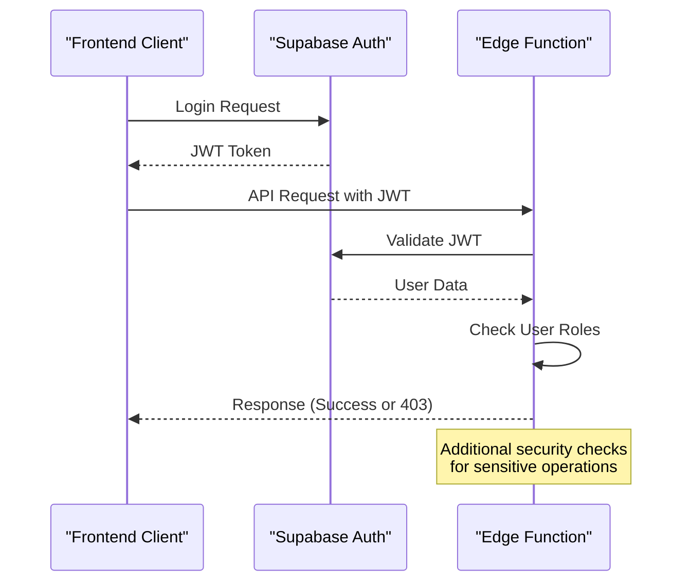
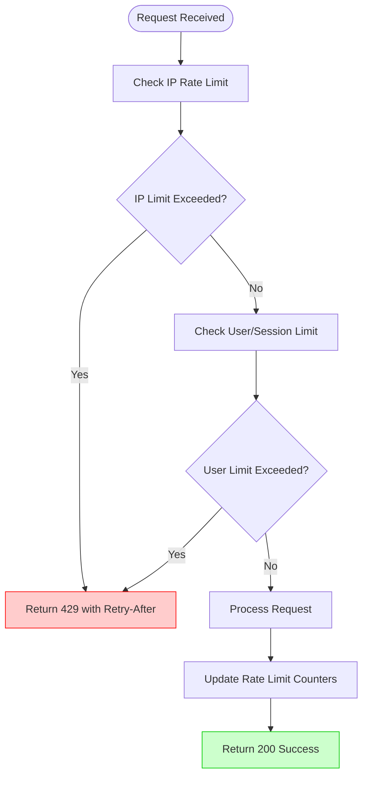
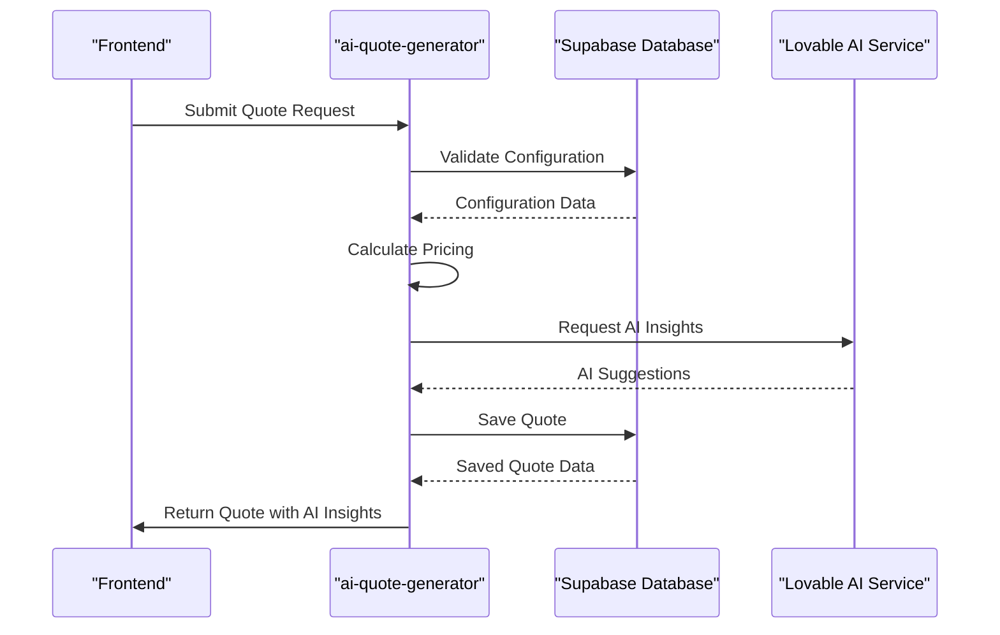
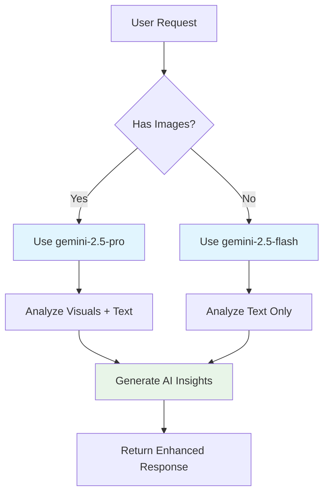
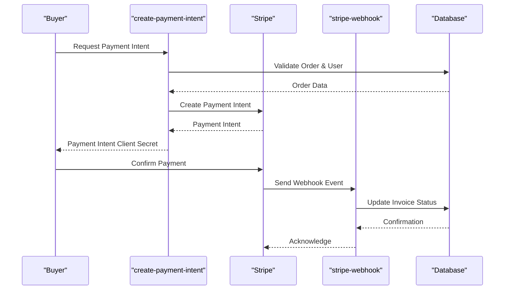
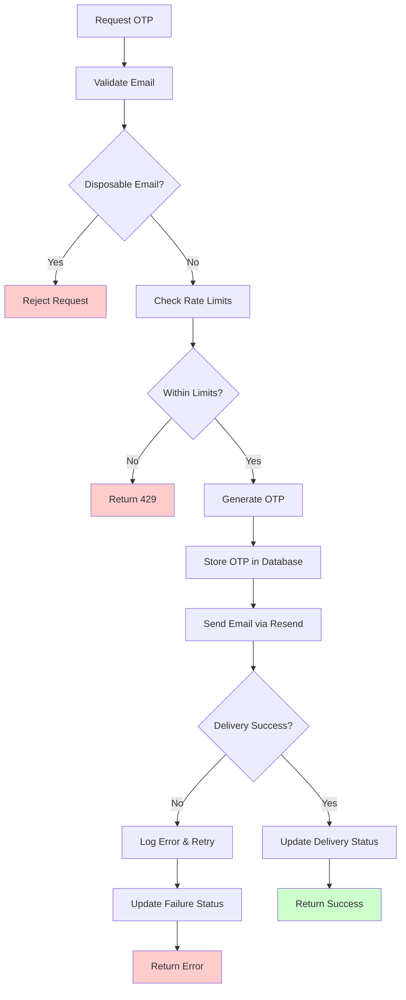
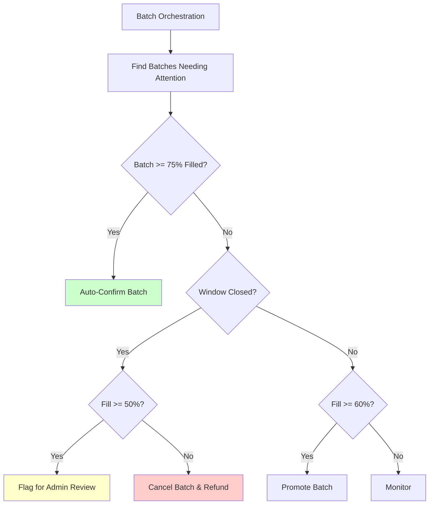
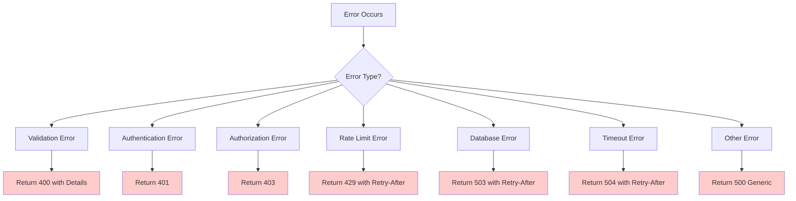
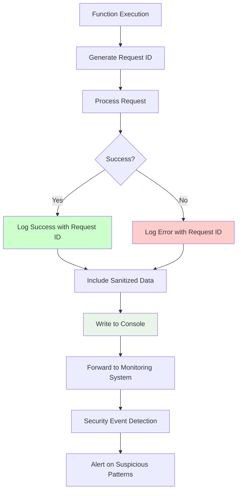

# Edge Functions API

<cite>
**Referenced Files in This Document**   
- [ai-quote-generator/index.ts](file://supabase/functions/ai-quote-generator/index.ts)
- [convert-quote-to-order/index.ts](file://supabase/functions/convert-quote-to-order/index.ts)
- [stripe-webhook/index.ts](file://supabase/functions/stripe-webhook/index.ts)
- [send-otp/index.ts](file://supabase/functions/send-otp/index.ts)
- [verify-otp/index.ts](file://supabase/functions/verify-otp/index.ts)
- [admin-check/index.ts](file://supabase/functions/admin-check/index.ts)
- [bootstrap-admin/index.ts](file://supabase/functions/bootstrap-admin/index.ts)
- [create-payment-intent/index.ts](file://supabase/functions/create-payment-intent/index.ts)
- [generate-invoice/index.ts](file://supabase/functions/generate-invoice/index.ts)
- [analytics-service/index.ts](file://supabase/functions/analytics-service/index.ts)
- [batch-processor/index.ts](file://supabase/functions/batch-processor/index.ts)
- [ai-conversational-quote/index.ts](file://supabase/functions/ai-conversational-quote/index.ts)
- [ai-design-generator/index.ts](file://supabase/functions/ai-design-generator/index.ts)
- [ai-market-research/index.ts](file://supabase/functions/ai-market-research/index.ts)
- [ai-supplier-assignment/index.ts](file://supabase/functions/ai-supplier-assignment/index.ts)
- [auto-confirm-supplier/index.ts](file://supabase/functions/auto-confirm-supplier/index.ts)
- [email-service/index.ts](file://supabase/functions/email-service/index.ts)
- [execute-automation-rules/index.ts](file://supabase/functions/execute-automation-rules/index.ts)
- [generate-product-description/index.ts](file://supabase/functions/generate-product-description/index.ts)
- [generate-product-image/index.ts](file://supabase/functions/generate-product-image/index.ts)
- [get-exchange-rates/index.ts](file://supabase/functions/get-exchange-rates/index.ts)
- [health/index.ts](file://supabase/functions/health/index.ts)
- [initialize-production-stages/index.ts](file://supabase/functions/initialize-production-stages/index.ts)
- [log-ai-cost/index.ts](file://supabase/functions/log-ai-cost/index.ts)
- [log-audit-action/index.ts](file://supabase/functions/log-audit-action/index.ts)
- [log-security-event/index.ts](file://supabase/functions/log-security-event/index.ts)
- [parse-quote-description/index.ts](file://supabase/functions/parse-quote-description/index.ts)
- [password-breach-check/index.ts](file://supabase/functions/password-breach-check/index.ts)
- [predict-quality-risks/index.ts](file://supabase/functions/predict-quality-risks/index.ts)
- [resend-webhook/index.ts](file://supabase/functions/resend-webhook/index.ts)
- [submit-blog-comment/index.ts](file://supabase/functions/submit-blog-comment/index.ts)
- [submit-quote/index.ts](file://supabase/functions/submit-quote/index.ts)
- [track-product-interaction/index.ts](file://supabase/functions/track-product-interaction/index.ts)
- [track-social-share/index.ts](file://supabase/functions/track-social-share/index.ts)
- [wishlist-add/index.ts](file://supabase/functions/wishlist-add/index.ts)
- [wishlist-check/index.ts](file://supabase/functions/wishlist-check/index.ts)
- [wishlist-get/index.ts](file://supabase/functions/wishlist-get/index.ts)
- [wishlist-remove/index.ts](file://supabase/functions/wishlist-remove/index.ts)
- [shared/securityLogger.ts](file://supabase/functions/shared/securityLogger.ts)
- [_shared/logger.ts](file://supabase/functions/_shared/logger.ts)
</cite>

## Table of Contents
1. [Introduction](#introduction)
2. [Authentication and Security](#authentication-and-security)
3. [Rate Limiting](#rate-limiting)
4. [Core Functionality](#core-functionality)
5. [AI-Powered Functions](#ai-powered-functions)
6. [Order and Payment Functions](#order-and-payment-functions)
7. [Communication Functions](#communication-functions)
8. [Utility and System Functions](#utility-and-system-functions)
9. [Error Handling](#error-handling)
10. [Monitoring and Logging](#monitoring-and-logging)
11. [Performance Optimization](#performance-optimization)

## Introduction

The Supabase Edge Functions API provides a comprehensive suite of 43 serverless functions that power the core functionality of the Sleek Apparels application. These functions handle critical operations including AI-powered pricing, order creation, payment processing, authentication, and various business workflows. All functions follow a consistent API pattern with POST as the primary HTTP method, accessible via the endpoint pattern `/functions/v1/[function-name]`. The API is designed with security, scalability, and reliability in mind, incorporating robust authentication, rate limiting, input validation, and error handling mechanisms.

The Edge Functions are implemented using Deno and leverage Supabase's ecosystem for database operations, authentication, and storage. They integrate with third-party services such as Stripe for payments, Resend for email delivery, and Lovable AI for generative AI capabilities. The functions are organized into logical categories based on their functionality, including AI services, order management, communication, analytics, and system utilities.

**Section sources**
- [ai-quote-generator/index.ts](file://supabase/functions/ai-quote-generator/index.ts)
- [convert-quote-to-order/index.ts](file://supabase/functions/convert-quote-to-order/index.ts)
- [stripe-webhook/index.ts](file://supabase/functions/stripe-webhook/index.ts)

## Authentication and Security

All Edge Functions that require user authentication enforce JWT-based authentication through the Authorization header. The Supabase Auth system manages user sessions and provides JWT tokens that are validated by the functions. Functions that handle sensitive operations, such as payment processing or admin actions, require valid JWT tokens to ensure only authorized users can access them.

The `admin-check` function specifically validates whether a user has administrative privileges by checking the user_roles table for the 'admin' role. This function is used by frontend components to conditionally render admin interfaces. The `bootstrap-admin` function provides a secure mechanism to assign admin roles during initial setup, with rate limiting and token validation to prevent abuse.

For enhanced security, several functions implement additional verification mechanisms. The `send-otp` and `verify-otp` functions provide a two-factor authentication flow using one-time passwords sent via email or SMS. The `password-breach-check` function validates passwords against known breach databases to prevent the use of compromised credentials. The `shared/securityLogger.ts` utility is used across functions to log security events such as CAPTCHA failures, rate limit violations, and suspicious patterns.

**Diagram sources**
- [admin-check/index.ts](file://supabase/functions/admin-check/index.ts)
- [bootstrap-admin/index.ts](file://supabase/functions/bootstrap-admin/index.ts)
- [shared/securityLogger.ts](file://supabase/functions/shared/securityLogger.ts)

**Section sources**
- [admin-check/index.ts](file://supabase/functions/admin-check/index.ts)
- [bootstrap-admin/index.ts](file://supabase/functions/bootstrap-admin/index.ts)
- [send-otp/index.ts](file://supabase/functions/send-otp/index.ts)
- [verify-otp/index.ts](file://supabase/functions/verify-otp/index.ts)
- [password-breach-check/index.ts](file://supabase/functions/password-breach-check/index.ts)

## Rate Limiting

The Edge Functions API implements comprehensive rate limiting at multiple levels to prevent abuse and ensure fair usage. Each function enforces a rate limit of 100 requests per 10 seconds, with appropriate HTTP 429 responses when limits are exceeded. The rate limiting is implemented using database-stored counters that track requests by IP address, user ID, session ID, or email address, depending on the function's requirements.

The `ai-quote-generator` function implements tiered rate limiting: authenticated users are allowed 20 quotes per day, while anonymous users are limited to 3 quotes per day per session. Additionally, all users are subject to an IP-based limit of 15 quotes per day. The `send-otp` function limits OTP requests to 5 per hour per IP address and 10 per day per email address to prevent spam and abuse.

Rate limit information is communicated to clients through standard HTTP headers including `X-RateLimit-Limit`, `X-RateLimit-Remaining`, and `X-RateLimit-Reset`. The `Retry-After` header is also included in 429 responses to inform clients when they can retry their request. Functions return detailed error responses with retry information to help clients implement appropriate backoff strategies.

**Diagram sources**
- [ai-quote-generator/index.ts](file://supabase/functions/ai-quote-generator/index.ts)
- [send-otp/index.ts](file://supabase/functions/send-otp/index.ts)

**Section sources**
- [ai-quote-generator/index.ts](file://supabase/functions/ai-quote-generator/index.ts)
- [send-otp/index.ts](file://supabase/functions/send-otp/index.ts)

## Core Functionality

The core functionality of the application is centered around the quote-to-order workflow, which begins with the `ai-quote-generator` function and culminates in the `convert-quote-to-order` function. These functions handle the primary business process of generating pricing quotes and converting them into production orders.

The `ai-quote-generator` function accepts product specifications and generates AI-powered pricing estimates with detailed breakdowns. It validates input data, calculates base pricing based on product type and complexity, applies volume discounts, and generates timeline predictions. The function also integrates with the Lovable AI service to provide intelligent suggestions and insights based on the request parameters.

The `convert-quote-to-order` function transforms a quote into a formal order in the system. It validates that the quote hasn't already been converted, generates a unique order number, creates a corresponding record in the orders table, and updates the quote status. The function also handles buyer management by either associating the order with an existing user or creating a new user account if necessary.

**Diagram sources**
- [ai-quote-generator/index.ts](file://supabase/functions/ai-quote-generator/index.ts)
- [convert-quote-to-order/index.ts](file://supabase/functions/convert-quote-to-order/index.ts)

**Section sources**
- [ai-quote-generator/index.ts](file://supabase/functions/ai-quote-generator/index.ts)
- [convert-quote-to-order/index.ts](file://supabase/functions/convert-quote-to-order/index.ts)

## AI-Powered Functions

The application leverages several AI-powered functions to enhance user experience and provide intelligent insights. These functions integrate with the Lovable AI service through the `LOVABLE_API_KEY` environment variable and use various Gemini models for different use cases.

The `ai-quote-generator` function uses AI to provide cost optimization suggestions, alternative options, risk factors, and value-add recommendations based on the quote parameters. When design files are uploaded, it uses the more powerful `google/gemini-2.5-pro` model for visual analysis; otherwise, it uses the faster `google/gemini-2.5-flash` model for text-based analysis.

The `ai-conversational-quote` function provides a conversational interface for quote generation, integrating with the `ai-market-research` function to provide market intelligence. The `ai-design-generator` function creates apparel designs based on user prompts, style preferences, and color palettes, returning high-quality images suitable for printing.

The `analytics-service` function provides AI-powered insights for order management and quality control, analyzing production data to predict delivery timelines, forecast quality, and recommend improvements. The `ai-supplier-assignment` function uses AI to match quotes with the most suitable suppliers based on capabilities, capacity, and historical performance.

**Diagram sources**
- [ai-quote-generator/index.ts](file://supabase/functions/ai-quote-generator/index.ts)
- [ai-conversational-quote/index.ts](file://supabase/functions/ai-conversational-quote/index.ts)
- [ai-design-generator/index.ts](file://supabase/functions/ai-design-generator/index.ts)
- [analytics-service/index.ts](file://supabase/functions/analytics-service/index.ts)

**Section sources**
- [ai-quote-generator/index.ts](file://supabase/functions/ai-quote-generator/index.ts)
- [ai-conversational-quote/index.ts](file://supabase/functions/ai-conversational-quote/index.ts)
- [ai-design-generator/index.ts](file://supabase/functions/ai-design-generator/index.ts)
- [ai-market-research/index.ts](file://supabase/functions/ai-market-research/index.ts)
- [ai-supplier-assignment/index.ts](file://supabase/functions/ai-supplier-assignment/index.ts)
- [analytics-service/index.ts](file://supabase/functions/analytics-service/index.ts)

## Order and Payment Functions

The order and payment functions handle the financial and fulfillment aspects of the application. These functions ensure secure processing of payments, generation of invoices, and proper state management of orders throughout their lifecycle.

The `create-payment-intent` function creates Stripe payment intents for orders, with support for full payment, deposit, or balance payments. It implements comprehensive security checks to verify that the requesting user is either the order buyer or an administrator. The function also validates price integrity by comparing the order price against the original quote to prevent tampering.

The `stripe-webhook` function processes webhook events from Stripe, updating invoice statuses when payments are successful or failed. It validates webhook signatures to ensure the authenticity of events and handles various event types including `payment_intent.succeeded` and `payment_intent.payment_failed`.

The `generate-invoice` function creates professional invoice documents using AI, populating them with order and buyer details. It stores the generated HTML invoices in Supabase storage and sends them to customers via email using the Resend service.

**Diagram sources**
- [create-payment-intent/index.ts](file://supabase/functions/create-payment-intent/index.ts)
- [stripe-webhook/index.ts](file://supabase/functions/stripe-webhook/index.ts)
- [generate-invoice/index.ts](file://supabase/functions/generate-invoice/index.ts)

**Section sources**
- [create-payment-intent/index.ts](file://supabase/functions/create-payment-intent/index.ts)
- [stripe-webhook/index.ts](file://supabase/functions/stripe-webhook/index.ts)
- [generate-invoice/index.ts](file://supabase/functions/generate-invoice/index.ts)
- [convert-quote-to-order/index.ts](file://supabase/functions/convert-quote-to-order/index.ts)

## Communication Functions

The communication functions handle all outbound messaging for the application, including email notifications, OTP delivery, and customer communications. These functions ensure timely and reliable delivery of important information to users.

The `send-otp` function sends one-time passwords via email for various use cases including quote verification and supplier registration. It implements comprehensive email validation, blocking disposable email domains and enforcing rate limits. The function uses the Resend service for email delivery and includes retry logic to handle transient delivery failures.

The `email-service` function serves as a general-purpose email delivery mechanism, while specialized functions like `generate-invoice` and `convert-quote-to-order` include their own email functionality for specific workflows. The `submit-blog-comment` function handles blog comment submissions, sending notifications to administrators.

All email functions use templated HTML emails with responsive design to ensure good rendering across devices. They include appropriate headers and tracking parameters to monitor delivery and engagement.

**Diagram sources**
- [send-otp/index.ts](file://supabase/functions/send-otp/index.ts)
- [email-service/index.ts](file://supabase/functions/email-service/index.ts)
- [convert-quote-to-order/index.ts](file://supabase/functions/convert-quote-to-order/index.ts)

**Section sources**
- [send-otp/index.ts](file://supabase/functions/send-otp/index.ts)
- [email-service/index.ts](file://supabase/functions/email-service/index.ts)
- [submit-blog-comment/index.ts](file://supabase/functions/submit-blog-comment/index.ts)

## Utility and System Functions

The utility and system functions provide essential infrastructure services that support the overall operation of the application. These functions handle health monitoring, data processing, automation, and various administrative tasks.

The `health` function provides a simple health check endpoint that verifies the basic functionality of the Edge Functions environment. It returns a 200 status when healthy and 500 when unhealthy, making it suitable for uptime monitoring and load balancer health checks.

The `batch-processor` function orchestrates batch production workflows, automatically confirming or canceling production batches based on fill percentages and deadlines. It implements complex business logic to manage the batch lifecycle and coordinate with suppliers.

The `execute-automation-rules` function processes automation rules defined in the system, triggering actions based on specific conditions. The `initialize-production-stages` function sets up the production stage timeline for new orders, creating the necessary records for tracking progress.

**Diagram sources**
- [health/index.ts](file://supabase/functions/health/index.ts)
- [batch-processor/index.ts](file://supabase/functions/batch-processor/index.ts)
- [execute-automation-rules/index.ts](file://supabase/functions/execute-automation-rules/index.ts)
- [initialize-production-stages/index.ts](file://supabase/functions/initialize-production-stages/index.ts)

**Section sources**
- [health/index.ts](file://supabase/functions/health/index.ts)
- [batch-processor/index.ts](file://supabase/functions/batch-processor/index.ts)
- [execute-automation-rules/index.ts](file://supabase/functions/execute-automation-rules/index.ts)
- [initialize-production-stages/index.ts](file://supabase/functions/initialize-production-stages/index.ts)
- [get-exchange-rates/index.ts](file://supabase/functions/get-exchange-rates/index.ts)

## Error Handling

The Edge Functions API implements comprehensive error handling with standardized response formats and appropriate HTTP status codes. Errors are categorized and handled differently based on their type, with detailed client-facing messages for validation errors and generic messages for security-related errors to prevent information disclosure.

Validation errors from Zod schema validation are returned with a 400 status code and include details about which fields failed validation. Database errors are typically treated as retryable (503) with a Retry-After header, while timeout errors are also retryable (504). Authentication and authorization errors return 401 or 403 status codes respectively.

The functions use structured error responses that include an error message, error code, request ID for correlation, and additional metadata when appropriate. For security reasons, detailed error information is logged server-side but not exposed to clients to prevent information leakage.

**Diagram sources**
- [ai-quote-generator/index.ts](file://supabase/functions/ai-quote-generator/index.ts)
- [convert-quote-to-order/index.ts](file://supabase/functions/convert-quote-to-order/index.ts)
- [stripe-webhook/index.ts](file://supabase/functions/stripe-webhook/index.ts)

**Section sources**
- [ai-quote-generator/index.ts](file://supabase/functions/ai-quote-generator/index.ts)
- [convert-quote-to-order/index.ts](file://supabase/functions/convert-quote-to-order/index.ts)
- [stripe-webhook/index.ts](file://supabase/functions/stripe-webhook/index.ts)

## Monitoring and Logging

The application implements comprehensive monitoring and logging through multiple mechanisms. The `shared/securityLogger.ts` utility provides structured logging with PII sanitization, automatically redacting sensitive information such as email addresses, phone numbers, and order IDs from logs.

Security events such as CAPTCHA failures, rate limit violations, and suspicious patterns are logged to the security_events table for monitoring and analysis. AI cost tracking is implemented through the `logAICost` function, which records estimated costs for AI operations based on token usage and model pricing.

The built-in Deno logging is used with structured JSON output, making logs easily parseable by monitoring systems. Request IDs are generated for each request to enable tracing across function invocations. The `_shared/logger.ts` utility provides consistent logging patterns across functions with automatic PII sanitization.

**Diagram sources**
- [shared/securityLogger.ts](file://supabase/functions/shared/securityLogger.ts)
- [_shared/logger.ts](file://supabase/functions/_shared/logger.ts)
- [ai-quote-generator/index.ts](file://supabase/functions/ai-quote-generator/index.ts)

**Section sources**
- [shared/securityLogger.ts](file://supabase/functions/shared/securityLogger.ts)
- [_shared/logger.ts](file://supabase/functions/_shared/logger.ts)
- [log-security-event/index.ts](file://supabase/functions/log-security-event/index.ts)
- [log-ai-cost/index.ts](file://supabase/functions/log-ai-cost/index.ts)

## Performance Optimization

The Edge Functions are optimized for performance through various techniques including input validation, efficient database queries, caching, and asynchronous processing where appropriate. Functions validate input data early using Zod schemas to prevent unnecessary processing of invalid requests.

Database operations use targeted SELECT statements to retrieve only necessary fields and employ appropriate indexing for performance. The `ai-quote-generator` function implements a fallback strategy for product configurations, first attempting an exact match, then a singular form, and finally a generic category to ensure availability while minimizing database queries.

For AI operations, functions use the most appropriate model based on the use case—using the faster `google/gemini-2.5-flash` for text-only analysis and the more capable `google/gemini-2.5-pro` for image analysis. AI requests include timeouts to prevent hanging operations and implement retry logic for transient failures.

Functions that perform multiple operations, such as `convert-quote-to-order`, handle non-critical tasks like email sending asynchronously to ensure the primary operation completes quickly. This approach improves response times and user experience while maintaining reliability.

**Section sources**
- [ai-quote-generator/index.ts](file://supabase/functions/ai-quote-generator/index.ts)
- [convert-quote-to-order/index.ts](file://supabase/functions/convert-quote-to-order/index.ts)
- [create-payment-intent/index.ts](file://supabase/functions/create-payment-intent/index.ts)
- [analytics-service/index.ts](file://supabase/functions/analytics-service/index.ts)