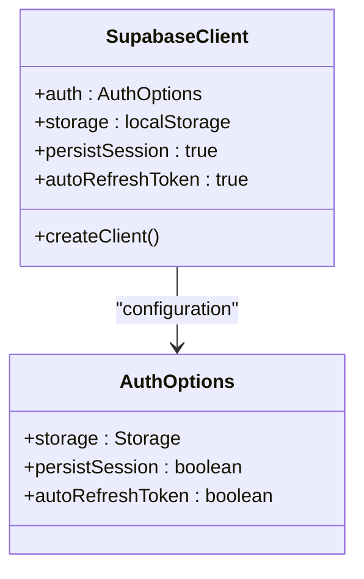
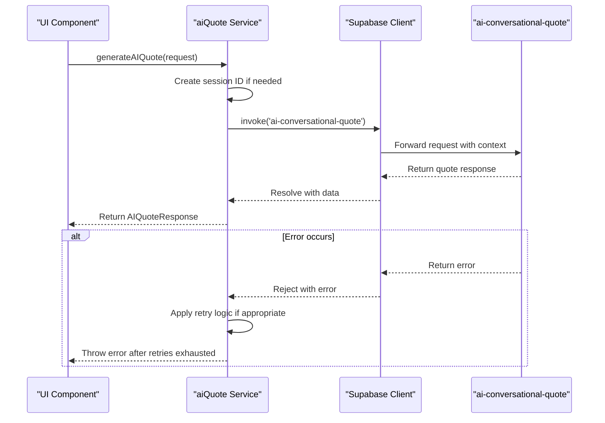
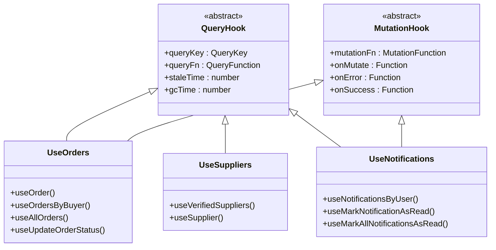
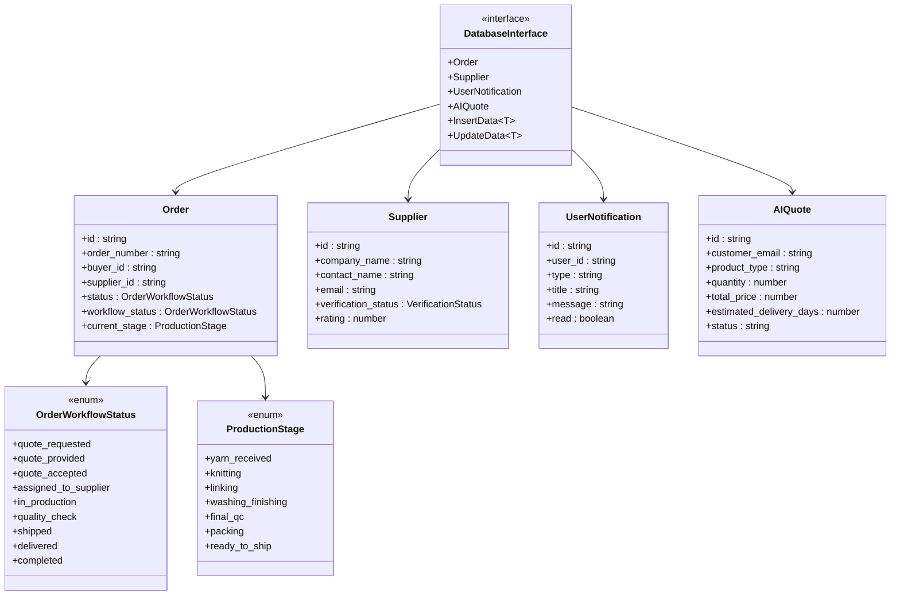
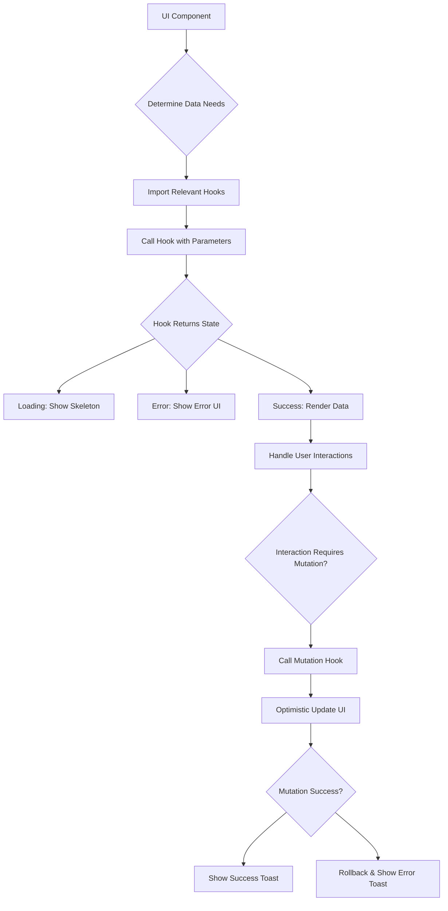

# Internal API Clients

<cite>
**Referenced Files in This Document**   
- [client.ts](file://src/integrations/supabase/client.ts)
- [aiQuote.ts](file://src/lib/api/aiQuote.ts)
- [useOrders.ts](file://src/hooks/queries/useOrders.ts)
- [useSuppliers.ts](file://src/hooks/queries/useSuppliers.ts)
- [useNotifications.ts](file://src/hooks/queries/useNotifications.ts)
- [database.ts](file://src/types/database.ts)
- [supabaseHelpers.ts](file://src/lib/supabaseHelpers.ts)
- [ConversationalQuoteBuilder.tsx](file://src/components/quote/ConversationalQuoteBuilder.tsx)
- [AIQuoteDashboard.tsx](file://src/components/admin/AIQuoteDashboard.tsx)
</cite>

## Table of Contents
1. [Introduction](#introduction)
2. [Supabase Client Configuration](#supabase-client-configuration)
3. [AI Quote Service](#ai-quote-service)
4. [Custom React Query Hooks](#custom-react-query-hooks)
5. [Type Safety and Database Interface](#type-safety-and-database-interface)
6. [Error Handling Strategies](#error-handling-strategies)
7. [Performance Considerations](#performance-considerations)
8. [Component Integration Examples](#component-integration-examples)
9. [Conclusion](#conclusion)

## Introduction
This document provides comprehensive documentation for the internal API client layer that abstracts direct Supabase interactions in the SleekApparels application. The API layer is designed to provide a type-safe, efficient, and maintainable interface between the frontend application and the Supabase backend services. The architecture follows a layered approach with clear separation of concerns, where the Supabase client instance handles authentication and persistence, specialized services manage domain-specific operations like AI quote generation, and custom React Query hooks provide data fetching and caching capabilities with optimal performance characteristics.

The system is built around several key principles: type safety through comprehensive TypeScript interfaces, resilience through robust error handling and retry mechanisms, performance optimization through strategic caching and background refetching, and developer experience through well-structured hooks and utilities. This documentation will explore each component of the API layer in detail, explaining its purpose, implementation, and integration patterns.

## Supabase Client Configuration
The Supabase client instance is configured in `src/integrations/supabase/client.ts` as a singleton export that provides a centralized connection to the Supabase backend. This client is configured with authentication persistence and automatic token refresh capabilities to ensure seamless user experiences across sessions.

The client is initialized with environment variables validated through the application's configuration system, ensuring that sensitive credentials are properly managed and validated at runtime. Authentication state is persisted in localStorage with the `persistSession` option set to true, allowing users to maintain their authenticated state across browser sessions. The `autoRefreshToken` option is enabled to automatically refresh authentication tokens before they expire, preventing unexpected authentication failures during active user sessions.

**Diagram sources**
- [client.ts](file://src/integrations/supabase/client.ts#L1-L20)

**Section sources**
- [client.ts](file://src/integrations/supabase/client.ts#L1-L20)

## AI Quote Service
The AI quote generation service, implemented in `src/lib/api/aiQuote.ts`, provides a robust interface for interacting with the `ai-conversational-quote` Edge Function. This service handles the complete lifecycle of AI-powered quote requests, from initial submission to response processing and error recovery.

The service implements several advanced patterns to ensure reliability and performance. It includes automatic retry logic with exponential backoff for transient failures, request timeout handling to prevent hanging operations, and session management to maintain conversation context across multiple interactions. The service also incorporates local pricing estimation to provide contextual information to the AI model, improving the accuracy and relevance of generated quotes.

The API follows a promise-based pattern with comprehensive error handling, converting Supabase function invocation errors into meaningful application errors. Success responses are typed with the `AIQuoteResponse` interface, ensuring type safety throughout the application. The service also provides additional utility functions for retrieving user quote history and converting quotes to orders, creating a complete workflow for quote management.

**Diagram sources**
- [aiQuote.ts](file://src/lib/api/aiQuote.ts#L49-L145)
- [ConversationalQuoteBuilder.tsx](file://src/components/quote/ConversationalQuoteBuilder.tsx#L127-L141)

**Section sources**
- [aiQuote.ts](file://src/lib/api/aiQuote.ts#L6-L274)

## Custom React Query Hooks
The application implements a comprehensive set of custom React Query hooks in the `src/hooks/queries/` directory to provide type-safe data fetching and caching for key entities. These hooks follow a consistent pattern across the application, abstracting away the complexity of direct Supabase interactions while providing optimized caching and background refetching.

The hooks are organized around key entities such as orders, suppliers, and notifications, with each hook module exporting both query and mutation functions. Query hooks use structured query keys that incorporate entity types, filters, and identifiers, enabling precise cache invalidation and data consistency. Mutation hooks implement optimistic updates where appropriate, providing immediate UI feedback while ensuring data consistency through error rollback mechanisms.

The hook architecture includes several performance optimizations. Query keys are structured hierarchically to enable selective invalidation, with base keys for entity types and derived keys for specific queries. Stale time is configured appropriately for each data type, with frequently changing data having shorter stale periods than relatively static data. Background refetching is enabled to keep data fresh without disrupting the user experience.

**Diagram sources**
- [useOrders.ts](file://src/hooks/queries/useOrders.ts#L6-L152)
- [useSuppliers.ts](file://src/hooks/queries/useSuppliers.ts#L5-L49)
- [useNotifications.ts](file://src/hooks/queries/useNotifications.ts#L6-L135)

**Section sources**
- [useOrders.ts](file://src/hooks/queries/useOrders.ts#L1-L152)
- [useSuppliers.ts](file://src/hooks/queries/useSuppliers.ts#L1-L49)
- [useNotifications.ts](file://src/hooks/queries/useNotifications.ts#L1-L135)

## Type Safety and Database Interface
Type safety is a core principle of the API layer, achieved through comprehensive TypeScript interfaces defined in `src/types/database.ts`. These interfaces provide compile-time type checking for all database operations, reducing runtime errors and improving developer productivity.

The database interface includes type definitions for all major tables in the application, including orders, suppliers, notifications, and AI quotes. Each interface defines the exact shape of the data, including field names, types, and relationships. The interfaces also include helper types for insert and update operations, automatically omitting read-only fields like IDs and timestamps.

The Supabase client is configured to use these types through generic parameters, ensuring that all database operations return properly typed results. This type safety extends throughout the application, from the Supabase helpers in `supabaseHelpers.ts` to the custom React Query hooks and UI components. The type system also includes enum definitions for common fields like order status and production stages, ensuring consistency across the application.

**Diagram sources**
- [database.ts](file://src/types/database.ts#L5-L579)
- [supabaseHelpers.ts](file://src/lib/supabaseHelpers.ts#L7-L20)

**Section sources**
- [database.ts](file://src/types/database.ts#L1-L579)

## Error Handling Strategies
The API layer implements comprehensive error handling strategies across all components to ensure application resilience and provide meaningful feedback to users. Errors are handled at multiple levels, from low-level network failures to high-level business logic validation.

For Supabase interactions, the application uses try-catch blocks around all asynchronous operations, with specific error handling for different error types. Network errors and timeouts are handled with retry mechanisms, while validation errors are presented directly to users with specific guidance. The React Query hooks implement error boundaries and toast notifications to ensure users are informed of failures without disrupting the overall application flow.

The AI quote service includes sophisticated error handling with automatic retry logic for transient failures. The service distinguishes between retryable and non-retryable errors, avoiding unnecessary retries for validation errors while implementing exponential backoff for temporary service issues. Timeout handling ensures that requests don't hang indefinitely, with appropriate user feedback when operations take longer than expected.

Mutation operations implement optimistic updates with rollback capabilities. When a mutation is initiated, the UI is updated immediately to provide responsive feedback, while the actual operation proceeds in the background. If the operation fails, the previous state is restored automatically, maintaining data consistency. This pattern is implemented consistently across all mutation hooks, providing a seamless user experience.

**Section sources**
- [aiQuote.ts](file://src/lib/api/aiQuote.ts#L59-L145)
- [useOrders.ts](file://src/hooks/queries/useOrders.ts#L113-L149)
- [useNotifications.ts](file://src/hooks/queries/useNotifications.ts#L27-L71)

## Performance Considerations
The API layer incorporates several performance optimizations to ensure responsive user experiences and efficient resource utilization. These optimizations are implemented at multiple levels, from query configuration to caching strategies and network optimization.

Query key organization follows a hierarchical pattern that enables precise cache invalidation and data consistency. Base keys identify entity types, while derived keys incorporate filters and parameters, allowing for selective refetching and invalidation. This structure minimizes unnecessary network requests and ensures that data updates are propagated efficiently throughout the application.

Stale time configuration is tailored to the volatility of different data types. Frequently changing data, such as order status updates, has shorter stale times to ensure freshness, while relatively static data like supplier information has longer stale periods to reduce network overhead. Background refetching is enabled for key queries, automatically refreshing data when the application regains focus or the user's network connection is restored.

The application implements strategic pre-fetching for anticipated data needs, such as loading order details when a user navigates to an order management page. This reduces perceived latency and creates a more responsive user experience. The React Query configuration also includes garbage collection settings to prevent memory leaks from unused query data.

**Section sources**
- [useOrders.ts](file://src/hooks/queries/useOrders.ts#L6-L17)
- [useSuppliers.ts](file://src/hooks/queries/useSuppliers.ts#L5-L13)
- [useNotifications.ts](file://src/hooks/queries/useNotifications.ts#L6-L10)

## Component Integration Examples
The API layer is integrated into UI components through a consistent pattern of hook usage, loading state management, and error handling. Components consume data through the custom React Query hooks, which provide loading, error, and data states that can be used to render appropriate UI.

For example, the `ConversationalQuoteBuilder` component uses the Supabase client directly to invoke the `ai-conversational-quote` Edge Function, managing loading states and displaying appropriate feedback to users. The component handles both successful quote generation and error scenarios, providing clear guidance for users when issues occur.

Administrative components like `AIQuoteDashboard` use the custom React Query hooks to fetch and display data, implementing search, filtering, and pagination through query parameters. These components handle loading states with skeleton screens and provide toast notifications for mutation results, creating a polished user experience.

The integration pattern emphasizes separation of concerns, with components focused on presentation and user interaction, while data fetching and business logic are handled by the API layer. This separation enables reusable components and simplifies testing and maintenance.

**Diagram sources**
- [ConversationalQuoteBuilder.tsx](file://src/components/quote/ConversationalQuoteBuilder.tsx#L43-L363)
- [AIQuoteDashboard.tsx](file://src/components/admin/AIQuoteDashboard.tsx#L68-L107)

**Section sources**
- [ConversationalQuoteBuilder.tsx](file://src/components/quote/ConversationalQuoteBuilder.tsx#L1-L363)
- [AIQuoteDashboard.tsx](file://src/components/admin/AIQuoteDashboard.tsx#L1-L410)

## Conclusion
The internal API client layer in the SleekApparels application provides a robust, type-safe, and performant interface between the frontend and backend services. By abstracting direct Supabase interactions behind a well-designed layer of utilities and hooks, the application achieves several key benefits: improved type safety, enhanced error handling, optimized performance, and simplified component integration.

The architecture demonstrates best practices in modern web application development, with clear separation of concerns, comprehensive type definitions, and thoughtful performance optimizations. The use of React Query for data fetching and caching provides a powerful foundation for managing server state, while the custom hooks create a consistent and intuitive API for consuming data throughout the application.

Future enhancements could include additional monitoring and analytics for API performance, more sophisticated caching strategies for offline support, and expanded type safety through runtime validation. However, the current implementation provides a solid foundation for a scalable and maintainable application architecture.