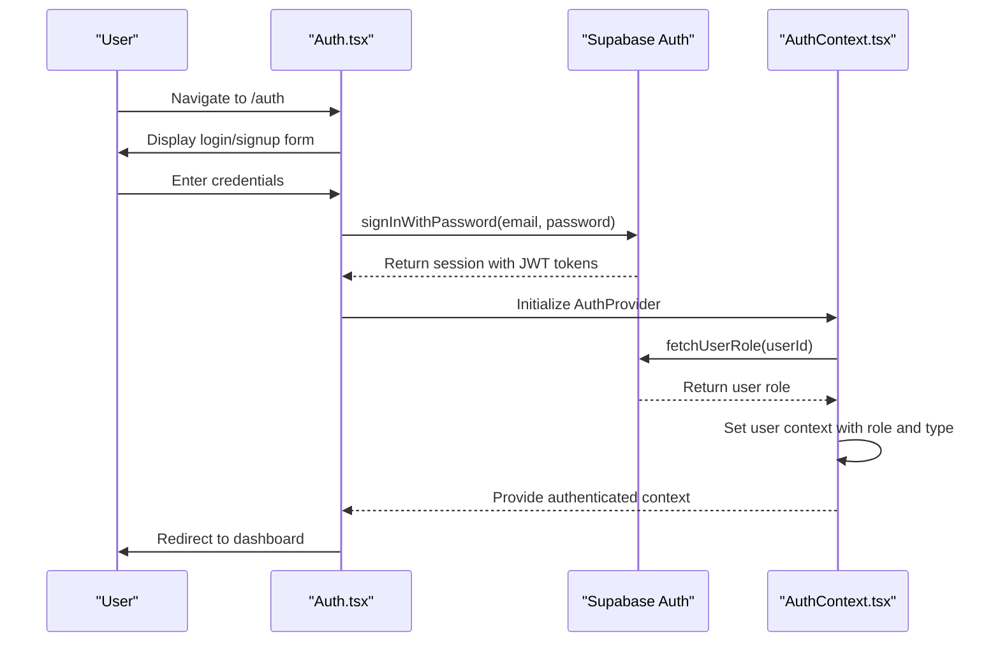
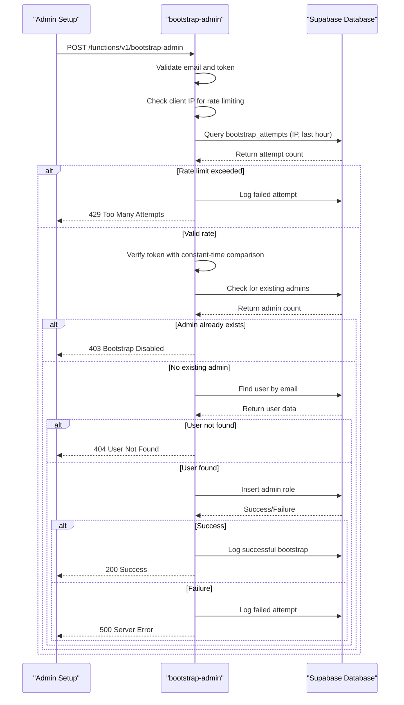
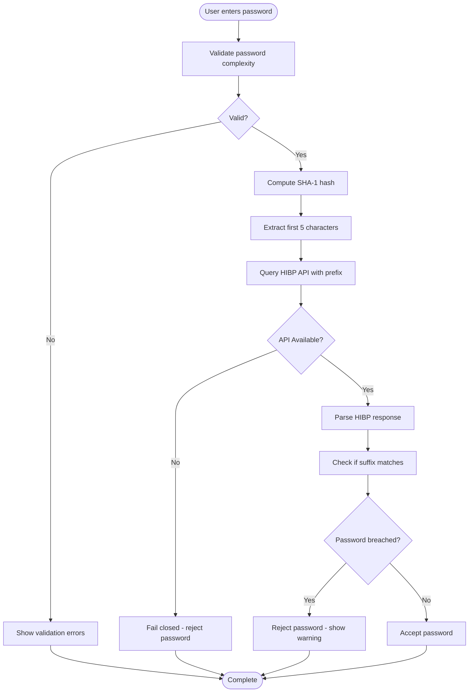
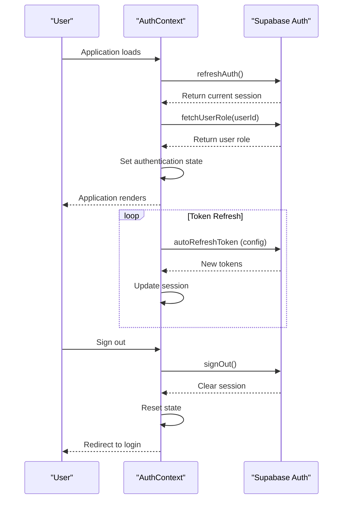

# Authentication & Authorization

<cite>
**Referenced Files in This Document**   
- [AuthContext.tsx](file://src/contexts/AuthContext.tsx)
- [client.ts](file://src/integrations/supabase/client.ts)
- [Auth.tsx](file://src/pages/Auth.tsx)
- [ProtectedRoute.tsx](file://src/components/routes/ProtectedRoute.tsx)
- [RoleBasedRoute.tsx](file://src/components/routes/RoleBasedRoute.tsx)
- [useAdminAuth.ts](file://src/hooks/useAdminAuth.ts)
- [bootstrap-admin/index.ts](file://supabase/functions/bootstrap-admin/index.ts)
- [admin-check/index.ts](file://supabase/functions/admin-check/index.ts)
- [password-breach-check/index.ts](file://supabase/functions/password-breach-check/index.ts)
- [create_marketplace_system.sql](file://supabase/migrations/20250122000000_create_marketplace_system.sql)
- [remix_migration_from_pg_dump.sql](file://supabase/migrations/20251115150759_remix_migration_from_pg_dump.sql)
- [supabaseHelpers.ts](file://src/lib/supabaseHelpers.ts)
</cite>

## Table of Contents
1. [Introduction](#introduction)
2. [Authentication Flow](#authentication-flow)
3. [Authorization System](#authorization-system)
4. [Role-Based Access Control](#role-based-access-control)
5. [Admin Verification Process](#admin-verification-process)
6. [Password Security](#password-security)
7. [Session Management](#session-management)
8. [Database Schema](#database-schema)
9. [Security Considerations](#security-considerations)

## Introduction

The authentication and authorization system for Sleek Apparels is built on Supabase Authentication with JWT tokens and Row Level Security (RLS) policies. This comprehensive system provides secure user management, role-based access control, and data isolation across the platform. The architecture leverages Supabase's robust authentication features while extending them with custom business logic for the specific needs of a B2B marketplace connecting buyers and suppliers.

The system implements a multi-layered security approach with client-side React components, server-side Edge Functions, and database-level RLS policies working in concert to ensure data integrity and access control. User roles are strictly enforced through the `user_roles` table, with RLS policies preventing unauthorized access to sensitive data. The authentication flow is designed to be seamless for users while maintaining high security standards through JWT token validation, password breach checking, and secure session management.

**Section sources**
- [AuthContext.tsx](file://src/contexts/AuthContext.tsx#L1-L166)
- [client.ts](file://src/integrations/supabase/client.ts#L1-L20)

## Authentication Flow

The authentication flow begins with user login through the Auth.tsx component, which provides both Google OAuth and email/password authentication options. When a user attempts to sign in, the system uses Supabase's authentication API to validate credentials and establish a session. Upon successful authentication, Supabase issues JWT tokens that are stored securely in the browser's localStorage.



**Diagram sources**
- [Auth.tsx](file://src/pages/Auth.tsx#L30-L688)
- [AuthContext.tsx](file://src/contexts/AuthContext.tsx#L47-L106)

The authentication process includes several security measures:
- Password validation with minimum complexity requirements (8 characters, uppercase, lowercase, number)
- Integration with the password-breach-check Edge Function to verify passwords against known breaches
- Email verification requirement before full account activation
- Secure token storage using Supabase's default localStorage configuration

After authentication, the AuthContext provider initializes and fetches the user's role from the `user_roles` table, establishing the user's permissions within the application. This context is then available throughout the application via the useAuth hook, enabling components to adapt their behavior based on the user's authentication status and role.

**Section sources**
- [Auth.tsx](file://src/pages/Auth.tsx#L30-L688)
- [AuthContext.tsx](file://src/contexts/AuthContext.tsx#L121-L145)

## Authorization System

The authorization system is built on a combination of client-side React components and server-side Supabase RLS policies. The core of the system is the AuthContext provider, which maintains the user's authentication state, role, and permissions throughout the application lifecycle. This context provides computed properties like isAdmin, isSupplier, and isBuyer that simplify conditional rendering and access control in components.

```mermaid
classDiagram
class AuthContext {
+user : User | null
+session : Session | null
+role : UserRole | null
+userType : UserType | null
+isAdmin : boolean
+isSupplier : boolean
+isBuyer : boolean
+loading : boolean
+signOut() : Promise~void~
+refreshAuth() : Promise~void~
}
class ProtectedRoute {
+children : ReactNode
+redirectTo : string
}
class RoleBasedRoute {
+children : ReactNode
+allowedRoles : UserRole[]
+allowedUserTypes : UserType[]
+redirectTo : string
+fallback : ReactNode
}
class useAdminAuth {
+isAdmin : boolean
+loading : boolean
+checkAdminStatus() : Promise~void~
}
AuthContext --> ProtectedRoute : "provides authentication state"
AuthContext --> RoleBasedRoute : "provides role information"
AuthContext --> useAdminAuth : "provides user data"
useAdminAuth --> "admin-check" : "invokes edge function"
```

**Diagram sources**
- [AuthContext.tsx](file://src/contexts/AuthContext.tsx#L17-L28)
- [ProtectedRoute.tsx](file://src/components/routes/ProtectedRoute.tsx#L5-L36)
- [RoleBasedRoute.tsx](file://src/components/routes/RoleBasedRoute.tsx#L5-L60)
- [useAdminAuth.ts](file://src/hooks/useAdminAuth.ts#L5-L47)

The system implements two main authorization components:
1. **ProtectedRoute**: Ensures users are authenticated before accessing protected routes, redirecting unauthenticated users to the login page.
2. **RoleBasedRoute**: Extends ProtectedRoute by checking user roles and types, allowing fine-grained access control based on the user's permissions.

These components work together to create a robust authorization layer that prevents unauthorized access to sensitive areas of the application. The useAdminAuth hook provides an additional layer of security for admin-only functionality by validating admin status through the admin-check Edge Function, preventing client-side role manipulation.

**Section sources**
- [AuthContext.tsx](file://src/contexts/AuthContext.tsx#L17-L28)
- [ProtectedRoute.tsx](file://src/components/routes/ProtectedRoute.tsx#L5-L36)
- [RoleBasedRoute.tsx](file://src/components/routes/RoleBasedRoute.tsx#L5-L60)
- [useAdminAuth.ts](file://src/hooks/useAdminAuth.ts#L5-L47)

## Role-Based Access Control

The role-based access control system implements three primary user roles: buyer, supplier, and admin, with additional subtypes for specialized buyer categories. These roles are defined in the UserRole type and are stored in the `user_roles` table in the database. The system uses a combination of client-side role determination and server-side RLS policies to enforce data isolation and access permissions.

```mermaid
erDiagram
USER ||--o{ USER_ROLES : "has"
USER_ROLES }|--|| APP_ROLE : "is"
USER_ROLES ||--o{ MARKETPLACE_PRODUCTS : "owns"
USER_ROLES ||--o{ PRODUCT_INQUIRIES : "creates/responds"
USER_ROLES ||--o{ PRODUCT_WISHLIST : "manages"
class USER {
id: UUID PK
email: TEXT UK
created_at: TIMESTAMPTZ
}
class USER_ROLES {
id: UUID PK
user_id: UUID FK
role: app_role
created_at: TIMESTAMPTZ
}
class APP_ROLE {
role: ENUM
description: TEXT
}
class MARKETPLACE_PRODUCTS {
id: UUID PK
supplier_id: UUID FK
status: TEXT
created_at: TIMESTAMPTZ
}
class PRODUCT_INQUIRIES {
id: UUID PK
product_id: UUID FK
buyer_id: UUID FK
status: TEXT
}
class PRODUCT_WISHLIST {
id: UUID PK
user_id: UUID FK
product_id: UUID FK
}
```

**Diagram sources**
- [AuthContext.tsx](file://src/contexts/AuthContext.tsx#L5-L13)
- [create_marketplace_system.sql](file://supabase/migrations/20250122000000_create_marketplace_system.sql#L21-L36)
- [remix_migration_from_pg_dump.sql](file://supabase/migrations/20251115150759_remix_migration_from_pg_dump.sql#L30-L36)

The role hierarchy is structured as follows:
- **Admin**: Full access to all system functionality and data
- **Supplier**: Access to supplier-specific features and their own products/inquiries
- **Buyer**: Access to buyer-specific features with subtypes including retailer, wholesaler, educational, corporate, and sports_team

The system determines the user type from their role using the determineUserType function in AuthContext:
- Admin role maps to admin user type
- Supplier or factory role maps to supplier user type
- All other roles map to buyer user type

RLS policies enforce data isolation at the database level, ensuring users can only access data they are authorized to see. For example, suppliers can only view and modify their own products, while buyers can only view inquiries they have created. Admins have elevated privileges through specific RLS policies that allow them to access all data across the system.

**Section sources**
- [AuthContext.tsx](file://src/contexts/AuthContext.tsx#L5-L13)
- [create_marketplace_system.sql](file://supabase/migrations/20250122000000_create_marketplace_system.sql#L257-L327)
- [remix_migration_from_pg_dump.sql](file://supabase/migrations/20251115150759_remix_migration_from_pg_dump.sql#L30-L36)

## Admin Verification Process

The admin verification process is a critical security component that ensures only authorized users can gain administrative privileges. The system implements a secure bootstrap process through the bootstrap-admin Edge Function, which follows a strict security protocol to prevent unauthorized admin creation.



**Diagram sources**
- [bootstrap-admin/index.ts](file://supabase/functions/bootstrap-admin/index.ts#L1-L178)
- [admin-check/index.ts](file://supabase/functions/admin-check/index.ts#L1-L74)

The bootstrap-admin function implements several security measures:
- **Rate limiting**: Maximum of 3 attempts per IP address per hour to prevent brute force attacks
- **Token validation**: Uses constant-time string comparison to prevent timing attacks
- **Singleton enforcement**: Prevents creation of additional admins once an admin account exists
- **IP logging**: Records all attempts for security monitoring and audit purposes

Once an admin account is created, the admin-check Edge Function provides server-side validation of admin status. This function is called by the useAdminAuth hook to verify admin privileges, preventing client-side manipulation of role data. The admin-check function queries the user_roles table directly, ensuring that only users with the 'admin' role in the database are granted admin privileges.

**Section sources**
- [bootstrap-admin/index.ts](file://supabase/functions/bootstrap-admin/index.ts#L1-L178)
- [admin-check/index.ts](file://supabase/functions/admin-check/index.ts#L1-L74)
- [useAdminAuth.ts](file://src/hooks/useAdminAuth.ts#L5-L47)

## Password Security

The password security system implements multiple layers of protection to safeguard user credentials and prevent the use of compromised passwords. The core component is the password-breach-check Edge Function, which integrates with the Have I Been Pwned (HIBP) k-anonymity API to check passwords against known data breaches without exposing the full password.



**Diagram sources**
- [password-breach-check/index.ts](file://supabase/functions/password-breach-check/index.ts#L1-L142)
- [Auth.tsx](file://src/pages/Auth.tsx#L137-L153)

The password breach checking process follows these steps:
1. When a user enters a password during signup, the client invokes the password-breach-check Edge Function
2. The function computes the SHA-1 hash of the password and extracts the first 5 characters (prefix)
3. It queries the HIBP API using only the prefix, which returns a list of hash suffixes and their breach counts
4. The function checks if the full password hash suffix appears in the response
5. If found, the password has been exposed in a data breach and is rejected

Additional security measures include:
- **Origin validation**: The function validates the request origin against a whitelist of allowed domains to prevent abuse
- **Development bypass**: Origin validation is disabled in development environments for easier testing
- **Fail-closed approach**: If the HIBP service is unavailable, the function rejects the password to maintain security
- **Client-side integration**: The Auth.tsx component calls this function before submitting passwords to Supabase

The system also enforces password complexity requirements on the client side, requiring at least 8 characters with uppercase, lowercase, and numeric characters. These measures work together to ensure that users cannot create accounts with weak or compromised passwords.

**Section sources**
- [password-breach-check/index.ts](file://supabase/functions/password-breach-check/index.ts#L1-L142)
- [Auth.tsx](file://src/pages/Auth.tsx#L137-L153)

## Session Management

The session management system leverages Supabase's built-in authentication features with additional client-side enhancements for a seamless user experience. Sessions are managed through JWT tokens that are automatically refreshed and securely stored in the browser's localStorage.



**Diagram sources**
- [client.ts](file://src/integrations/supabase/client.ts#L14-L20)
- [AuthContext.tsx](file://src/contexts/AuthContext.tsx#L76-L106)

Key session management features include:
- **Automatic token refresh**: Configured in the Supabase client with `autoRefreshToken: true`, ensuring users remain authenticated during extended sessions
- **Persistent sessions**: Sessions are persisted across browser restarts using `persistSession: true`
- **Real-time session updates**: The AuthContext listens for auth state changes using Supabase's `onAuthStateChange` event, immediately updating the application state when authentication status changes
- **Secure storage**: JWT tokens are stored in localStorage with Supabase's default security settings

The AuthContext provider handles session initialization on application load by calling the refreshAuth function, which retrieves the current session and user role. This ensures that users who have previously authenticated can seamlessly continue their session without re-entering credentials. The context also provides a signOut function that properly terminates the session by calling Supabase's signOut method and resetting the local state.

**Section sources**
- [client.ts](file://src/integrations/supabase/client.ts#L14-L20)
- [AuthContext.tsx](file://src/contexts/AuthContext.tsx#L76-L119)

## Database Schema

The authentication and authorization system relies on a well-structured database schema that supports role-based access control and secure user management. The core tables include user_roles for storing user permissions, profiles for user information, and various RLS policies that enforce data isolation.

```mermaid
erDiagram
USER ||--o{ USER_ROLES : "has"
USER ||--o{ PROFILES : "has"
USER_ROLES }|--|| APP_ROLE : "is"
USER_ROLES ||--o{ MARKETPLACE_PRODUCTS : "owns"
USER_ROLES ||--o{ PRODUCT_INQUIRIES : "creates/responds"
USER_ROLES ||--o{ PRODUCT_WISHLIST : "manages"
USER_ROLES ||--o{ ADMIN_AUDIT_LOGS : "generates"
USER_ROLES ||--o{ BOOTSTRAP_ATTEMPTS : "triggers"
class USER {
id: UUID PK
email: TEXT UK
encrypted_password: TEXT
created_at: TIMESTAMPTZ
updated_at: TIMESTAMPTZ
}
class PROFILES {
id: UUID PK
full_name: TEXT
company_name: TEXT
phone: TEXT
created_at: TIMESTAMPTZ
updated_at: TIMESTAMPTZ
}
class USER_ROLES {
id: UUID PK
user_id: UUID FK
role: app_role
created_at: TIMESTAMPTZ
}
class APP_ROLE {
role: ENUM
description: TEXT
}
class MARKETPLACE_PRODUCTS {
id: UUID PK
supplier_id: UUID FK
title: TEXT
status: TEXT
created_at: TIMESTAMPTZ
updated_at: TIMESTAMPTZ
}
class PRODUCT_INQUIRIES {
id: UUID PK
product_id: UUID FK
buyer_id: UUID FK
quantity: INTEGER
status: TEXT
created_at: TIMESTAMPTZ
updated_at: TIMESTAMPTZ
}
class PRODUCT_WISHLIST {
id: UUID PK
user_id: UUID FK
product_id: UUID FK
created_at: TIMESTAMPTZ
}
class ADMIN_AUDIT_LOGS {
id: UUID PK
admin_id: UUID FK
action: TEXT
resource_type: TEXT
created_at: TIMESTAMPTZ
ip_address: TEXT
}
class BOOTSTRAP_ATTEMPTS {
id: UUID PK
ip_address: TEXT
success: BOOLEAN
created_at: TIMESTAMPTZ
}
```

**Diagram sources**
- [remix_migration_from_pg_dump.sql](file://supabase/migrations/20251115150759_remix_migration_from_pg_dump.sql#L1880-L1900)
- [create_marketplace_system.sql](file://supabase/migrations/20250122000000_create_marketplace_system.sql#L42-L118)
- [remix_migration_from_pg_dump.sql](file://supabase/migrations/20251115150759_remix_migration_from_pg_dump.sql#L30-L36)

The key database components are:

### User Roles Table
The `user_roles` table establishes the relationship between users and their roles, supporting multiple roles per user if needed. This table is central to the RLS policies that enforce data access controls.

### Profiles Table
The `profiles` table stores user profile information (full name, company name, phone) and is linked to the auth.users table via the user ID. This separation of authentication data from profile data enhances security.

### RLS Policies
Row Level Security policies are defined for various tables to enforce data isolation:
- **Marketplace Products**: Suppliers can only access their own products, buyers can view approved products, and admins have full access
- **Product Inquiries**: Buyers can manage their inquiries, suppliers can respond to inquiries on their products, and admins have full access
- **Wishlist**: Users can only manage their own wishlist items

### Audit and Security Tables
- **admin_audit_logs**: Tracks all admin actions for accountability and security monitoring
- **bootstrap_attempts**: Records attempts to create admin accounts, supporting rate limiting and security analysis

The schema design follows security best practices by minimizing direct access to sensitive data and relying on RLS policies to enforce access controls at the database level.

**Section sources**
- [remix_migration_from_pg_dump.sql](file://supabase/migrations/20251115150759_remix_migration_from_pg_dump.sql#L1880-L1900)
- [create_marketplace_system.sql](file://supabase/migrations/20250122000000_create_marketplace_system.sql#L42-L118)
- [remix_migration_from_pg_dump.sql](file://supabase/migrations/20251115150759_remix_migration_from_pg_dump.sql#L30-L36)

## Security Considerations

The authentication and authorization system incorporates multiple security measures to protect user data and prevent unauthorized access. These considerations address potential attack vectors and ensure compliance with security best practices.

### Attack Vectors and Mitigations

| Attack Vector | Mitigation Strategy | Implementation |
|--------------|-------------------|---------------|
| Brute Force Attacks | Rate Limiting | bootstrap_attempts table limits to 3 attempts per IP per hour |
| Timing Attacks | Constant-time Comparison | Admin bootstrap token verification uses character-by-character comparison |
| Password Reuse | Breach Checking | Integration with HIBP k-anonymity API prevents compromised passwords |
| Role Manipulation | Server-side Validation | admin-check Edge Function validates admin status server-side |
| Session Hijacking | Secure Token Storage | JWT tokens stored in localStorage with Supabase's secure defaults |
| CSRF Attacks | CORS Configuration | Edge Functions implement proper CORS headers and origin validation |
| Privilege Escalation | Singleton Admin | bootstrap-admin prevents creation of additional admins once one exists |

### Compliance Requirements

The system addresses key compliance requirements:

**GDPR Compliance**
- User data is stored with clear ownership and access controls
- Users can delete their accounts and associated data
- Data processing is documented in the SECURITY.md file

**Security Best Practices**
- Passwords are never stored or transmitted in plaintext
- Sensitive operations are logged for audit purposes
- Regular security reviews are documented in SECURITY.md
- Third-party dependencies are monitored for vulnerabilities

**Operational Security**
- Environment variables are properly configured and protected
- Service role keys are restricted to server-side operations
- Regular security audits are conducted and documented
- Incident response procedures are established

The system also implements defense in depth by combining multiple security layers:
- **Client-side**: Input validation, secure context management
- **Server-side**: Edge Functions with input validation and error handling
- **Database-level**: RLS policies, audit logging, and secure function definitions

These security considerations ensure that the authentication and authorization system protects user data while providing a seamless experience for legitimate users.

**Section sources**
- [bootstrap-admin/index.ts](file://supabase/functions/bootstrap-admin/index.ts#L1-L178)
- [password-breach-check/index.ts](file://supabase/functions/password-breach-check/index.ts#L1-L142)
- [admin-check/index.ts](file://supabase/functions/admin-check/index.ts#L1-L74)
- [create_marketplace_system.sql](file://supabase/migrations/20250122000000_create_marketplace_system.sql#L257-L327)
- [remix_migration_from_pg_dump.sql](file://supabase/migrations/20251115150759_remix_migration_from_pg_dump.sql#L3646-L3680)