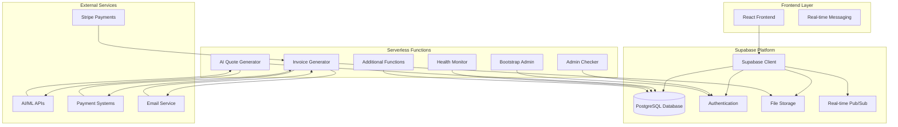
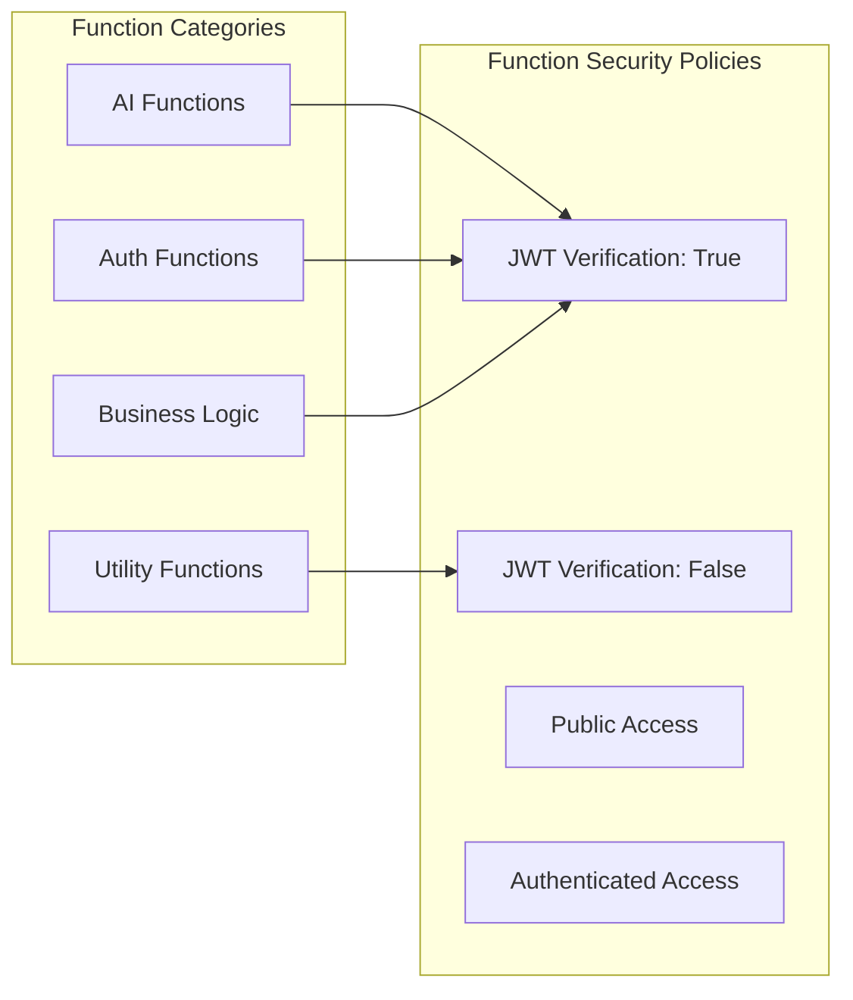
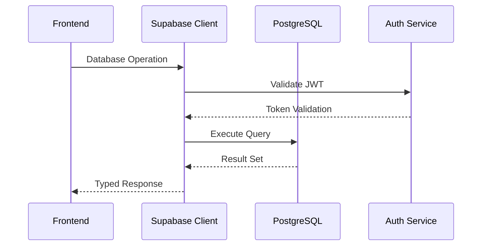
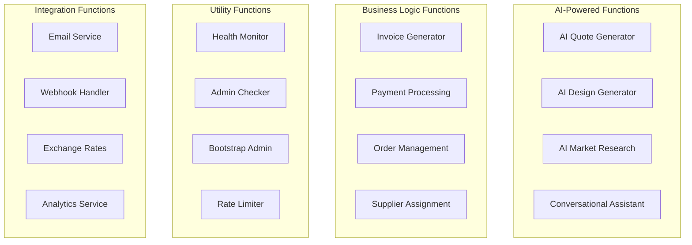
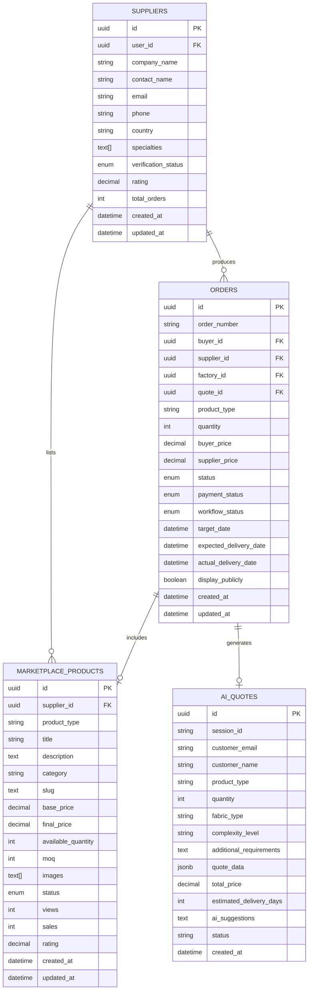
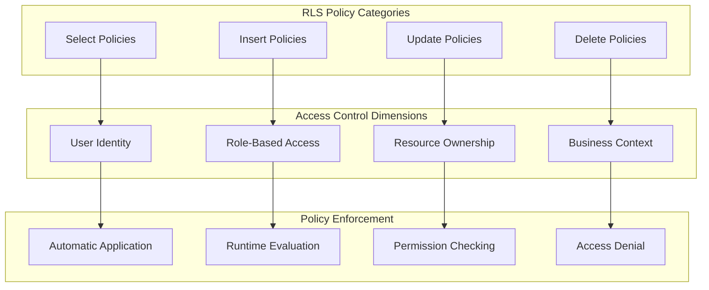
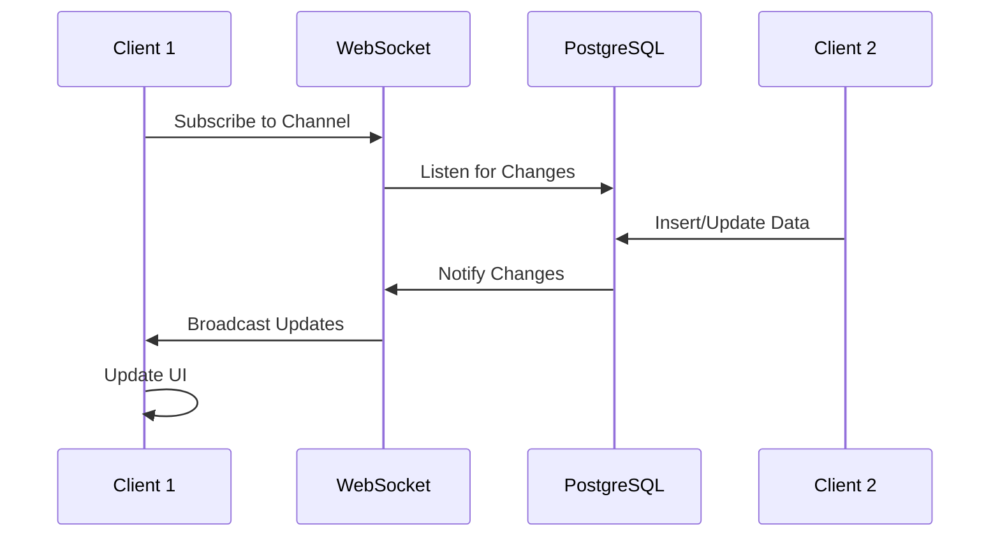

# Backend Architecture

<cite>
**Referenced Files in This Document**
- [supabase/config.toml](file://supabase/config.toml)
- [package.json](file://package.json)
- [src/integrations/supabase/client.ts](file://src/integrations/supabase/client.ts)
- [src/lib/supabaseHelpers.ts](file://src/lib/supabaseHelpers.ts)
- [src/types/database.ts](file://src/types/database.ts)
- [supabase/migrations/20250122000000_create_marketplace_system.sql](file://supabase/migrations/20250122000000_create_marketplace_system.sql)
- [supabase/migrations/20251123052149_create_lead_capture_system.sql](file://supabase/migrations/20251123052149_create_lead_capture_system.sql)
- [supabase/functions/ai-quote-generator/index.ts](file://supabase/functions/ai-quote-generator/index.ts)
- [supabase/functions/generate-invoice/index.ts](file://supabase/functions/generate-invoice/index.ts)
- [supabase/functions/admin-check/index.ts](file://supabase/functions/admin-check/index.ts)
- [supabase/functions/health/index.ts](file://supabase/functions/health/index.ts)
- [supabase/functions/bootstrap-admin/index.ts](file://supabase/functions/bootstrap-admin/index.ts)
- [src/hooks/useRealtimeMessages.ts](file://src/hooks/useRealtimeMessages.ts)
- [supabase/seed.sql](file://supabase/seed.sql)
</cite>

## Table of Contents
1. [Introduction](#introduction)
2. [System Overview](#system-overview)
3. [Architecture Foundation](#architecture-foundation)
4. [Supabase Platform Integration](#supabase-platform-integration)
5. [Serverless Functions Architecture](#serverless-functions-architecture)
6. [Database Design and Migration Strategy](#database-design-and-migration-strategy)
7. [Row-Level Security Implementation](#row-level-security-implementation)
8. [Real-Time Features and WebSockets](#real-time-features-and-websockets)
9. [Cross-Cutting Concerns](#cross-cutting-concerns)
10. [Technology Stack and Dependencies](#technology-stack-and-dependencies)
11. [Deployment and Infrastructure](#deployment-and-infrastructure)
12. [Performance and Monitoring](#performance-and-monitoring)
13. [Security Architecture](#security-architecture)
14. [Data Flow and API Patterns](#data-flow-and-api-patterns)
15. [Conclusion](#conclusion)

## Introduction

SleekApparels v100 implements a sophisticated backend architecture built around the Supabase platform, providing a comprehensive B2B marketplace solution for garment manufacturing. The architecture leverages Supabase's Backend-as-a-Service (BaaS) capabilities while incorporating custom serverless functions for specialized business logic, real-time communication, and complex data processing workflows.

The system serves as a digital marketplace connecting garment manufacturers in Bangladesh with international buyers, featuring AI-powered quote generation, real-time order tracking, supplier management, and automated invoice processing. Built with modern cloud-native principles, the architecture emphasizes scalability, security, and developer productivity.

## System Overview

The backend architecture follows a distributed microservice pattern with Supabase serving as the central platform hub. The system consists of several interconnected components that work together to provide a seamless marketplace experience.

**Diagram sources**
- [src/integrations/supabase/client.ts](file://src/integrations/supabase/client.ts#L1-L20)
- [supabase/config.toml](file://supabase/config.toml#L1-L73)

**Section sources**
- [src/integrations/supabase/client.ts](file://src/integrations/supabase/client.ts#L1-L20)
- [supabase/config.toml](file://supabase/config.toml#L1-L73)

## Architecture Foundation

The foundation of the backend architecture rests on Supabase's comprehensive platform offering, which provides essential services including database management, authentication, storage, and real-time capabilities. This choice enables rapid development while maintaining enterprise-grade reliability and security.

### Core Platform Services

The Supabase platform provides several critical services that form the backbone of the architecture:

- **PostgreSQL Database**: Relational database with advanced features including JSONB support, full-text search, and spatial data types
- **Authentication Service**: JWT-based authentication with role-based access control
- **Storage Service**: Object storage with fine-grained access control and CDN integration
- **Real-time Engine**: WebSocket-based pub/sub system for live data synchronization
- **Edge Functions**: Serverless compute platform for custom business logic

### Architectural Patterns

The system implements several key architectural patterns:

**Event-Driven Architecture**: Functions respond to database changes and external events, enabling loose coupling and high scalability.

**CQRS Pattern**: Read and write operations are separated, optimizing for different performance characteristics and scaling requirements.

**Microservices Pattern**: Domain-specific functions handle specialized business logic, promoting modularity and independent deployment.

**Layered Architecture**: Clear separation between presentation, business logic, and data access layers ensures maintainability and testability.

## Supabase Platform Integration

Supabase serves as the central integration point for all backend services, providing a unified API surface that simplifies development and deployment.

### Configuration Management

The Supabase configuration defines function-level security policies and runtime behavior:

**Diagram sources**
- [supabase/config.toml](file://supabase/config.toml#L3-L73)

### Database Client Integration

The frontend integrates with Supabase through a type-safe client that provides compile-time guarantees for database operations:

**Diagram sources**
- [src/integrations/supabase/client.ts](file://src/integrations/supabase/client.ts#L14-L20)
- [src/lib/supabaseHelpers.ts](file://src/lib/supabaseHelpers.ts#L26-L28)

**Section sources**
- [src/integrations/supabase/client.ts](file://src/integrations/supabase/client.ts#L1-L20)
- [src/lib/supabaseHelpers.ts](file://src/lib/supabaseHelpers.ts#L1-L376)

## Serverless Functions Architecture

The serverless functions layer provides custom business logic that extends Supabase's capabilities. Each function is designed as a stateless, horizontally scalable microservice.

### Function Categories and Responsibilities

The system organizes functions into distinct categories based on their primary responsibilities:

**Diagram sources**
- [supabase/functions/ai-quote-generator/index.ts](file://supabase/functions/ai-quote-generator/index.ts#L1-L753)
- [supabase/functions/generate-invoice/index.ts](file://supabase/functions/generate-invoice/index.ts#L1-L243)

### Function Security and Authentication

Each function implements appropriate security measures based on its access requirements:

**JWT-Based Authentication**: Functions requiring user context validate JWT tokens and extract user information for authorization decisions.

**Public Functions**: Functions like health checks and lead capture accept anonymous access with appropriate rate limiting.

**Service Role Access**: Administrative functions use service role keys for privileged database operations while maintaining proper isolation.

**Section sources**
- [supabase/functions/ai-quote-generator/index.ts](file://supabase/functions/ai-quote-generator/index.ts#L268-L282)
- [supabase/functions/generate-invoice/index.ts](file://supabase/functions/generate-invoice/index.ts#L18-L47)
- [supabase/functions/admin-check/index.ts](file://supabase/functions/admin-check/index.ts#L14-L42)

## Database Design and Migration Strategy

The database design follows a relational model optimized for the garment manufacturing marketplace domain, with careful consideration for scalability and maintainability.

### Core Entity Model

The system's data model centers around several key entities that represent the marketplace ecosystem:

**Diagram sources**
- [src/types/database.ts](file://src/types/database.ts#L1-L579)
- [supabase/migrations/20250122000000_create_marketplace_system.sql](file://supabase/migrations/20250122000000_create_marketplace_system.sql#L42-L118)

### Migration Strategy and Versioning

The system employs a comprehensive migration strategy that ensures database schema evolution while maintaining data integrity:

**Sequential Migration Approach**: Each change is encapsulated in a separate migration file with a timestamp prefix, enabling ordered execution and rollback capability.

**Safe Migration Practices**: Critical migrations include backup strategies, data validation, and rollback procedures to minimize risk during deployments.

**Incremental Schema Evolution**: New features are introduced through additive migrations that preserve existing functionality while extending capabilities.

**Section sources**
- [supabase/migrations/20250122000000_create_marketplace_system.sql](file://supabase/migrations/20250122000000_create_marketplace_system.sql#L1-L532)
- [supabase/migrations/20251123052149_create_lead_capture_system.sql](file://supabase/migrations/20251123052149_create_lead_capture_system.sql#L1-L188)

## Row-Level Security Implementation

The system implements comprehensive Row-Level Security (RLS) policies to ensure data isolation and access control at the database level, providing defense-in-depth security measures.

### Security Policy Architecture

RLS policies are implemented as declarative rules that automatically apply to all database operations, ensuring consistent access control regardless of the application layer:

**Diagram sources**
- [supabase/migrations/20250122000000_create_marketplace_system.sql](file://supabase/migrations/20250122000000_create_marketplace_system.sql#L247-L328)

### Policy Implementation Examples

The system implements granular access controls for different resource types:

**Marketplace Products**: Suppliers can view and modify their own products, while administrators have full access to all products with approval capabilities.

**Order Management**: Buyers can access orders they've placed, suppliers can view orders assigned to them, and administrators can oversee all operations.

**User Data**: Personal information is protected through role-based access, ensuring that users can only access their own data and relevant business information.

**Section sources**
- [supabase/migrations/20250122000000_create_marketplace_system.sql](file://supabase/migrations/20250122000000_create_marketplace_system.sql#L257-L328)

## Real-Time Features and WebSockets

The real-time capabilities enable instant communication and updates across the marketplace, providing a responsive user experience that mimics traditional messaging applications.

### Real-Time Architecture

The system leverages Supabase's built-in real-time engine to provide low-latency data synchronization:

**Diagram sources**
- [src/hooks/useRealtimeMessages.ts](file://src/hooks/useRealtimeMessages.ts#L23-L57)

### Real-Time Event Types

The system handles various real-time event types to provide comprehensive live functionality:

**Message Notifications**: Instant delivery of new messages with automatic read receipts and typing indicators.

**Order Status Updates**: Real-time synchronization of order state changes for both buyers and suppliers.

**Production Stage Updates**: Live tracking of manufacturing progress with visual indicators and notifications.

**Inventory Changes**: Immediate updates to product availability and stock levels across all connected clients.

**Section sources**
- [src/hooks/useRealtimeMessages.ts](file://src/hooks/useRealtimeMessages.ts#L1-L61)

## Cross-Cutting Concerns

The architecture addresses several cross-cutting concerns that are essential for production readiness and operational excellence.

### Monitoring and Observability

The system implements comprehensive monitoring through multiple layers:

**Function Logging**: Structured logging in serverless functions captures business events, errors, and performance metrics.

**Database Monitoring**: Query performance tracking and connection pooling monitoring ensure optimal database operation.

**Real-time Monitoring**: WebSocket connection health and message delivery tracking provide visibility into real-time functionality.

**Application Metrics**: Custom metrics for business KPIs enable data-driven decision making and performance optimization.

### Rate Limiting and Throttling

Multiple layers of rate limiting protect the system from abuse while ensuring fair resource allocation:

**IP-Based Rate Limiting**: Protection against malicious actors through per-IP request limiting with exponential backoff.

**User-Based Rate Limiting**: Fair usage policies for authenticated users with tiered limits based on account type.

**Function-Level Rate Limiting**: Specific limits for AI-intensive functions to control costs and prevent abuse.

**Section sources**
- [supabase/functions/ai-quote-generator/index.ts](file://supabase/functions/ai-quote-generator/index.ts#L38-L94)
- [supabase/functions/bootstrap-admin/index.ts](file://supabase/functions/bootstrap-admin/index.ts#L33-L58)

### Disaster Recovery and Backup

The system implements robust disaster recovery mechanisms:

**Database Backups**: Automated daily backups with retention policies ensure data protection against accidental deletion or corruption.

**Function Deployment**: Blue-green deployment strategies minimize downtime during function updates and rollbacks.

**Storage Redundancy**: Multi-region storage replication protects against regional failures and ensures high availability.

**Section sources**
- [supabase/functions/health/index.ts](file://supabase/functions/health/index.ts#L1-L34)

## Technology Stack and Dependencies

The technology stack is carefully selected to provide optimal developer experience, performance, and maintainability while leveraging proven technologies.

### Core Technologies

**Supabase Platform**: Central platform providing database, authentication, storage, and real-time capabilities with minimal operational overhead.

**TypeScript**: Strongly typed JavaScript development ensures code quality and maintainability across the full stack.

**React**: Modern React framework with hooks and concurrent features provides excellent user experience and development productivity.

**PostgreSQL**: Enterprise-grade relational database with advanced features including JSONB support and full-text search.

### Third-Party Integrations

**AI/ML Services**: Integration with external AI providers for intelligent quote generation and design assistance.

**Payment Processing**: Stripe integration for secure payment processing with webhook handling for transaction updates.

**Email Services**: Resend integration for reliable email delivery including invoices and notifications.

**Storage Services**: Cloud storage integration for file uploads and media management.

**Section sources**
- [package.json](file://package.json#L1-L115)

## Deployment and Infrastructure

The deployment architecture emphasizes simplicity, scalability, and operational efficiency through modern cloud-native practices.

### Infrastructure Components

**Edge Functions**: Serverless functions deployed at edge locations for low latency and high availability.

**Managed Database**: Fully managed PostgreSQL with automatic backups, scaling, and maintenance.

**Global CDN**: Content delivery network for static assets and media files with caching strategies.

**Container Orchestration**: Kubernetes-based deployment for complex workloads with horizontal scaling.

### Deployment Strategies

**Continuous Integration**: Automated testing and deployment pipelines ensure code quality and rapid iteration.

**Blue-Green Deployment**: Zero-downtime deployments with instant rollback capabilities for critical updates.

**Canary Releases**: Gradual rollout of new features with monitoring and automatic rollback on issues.

**Section sources**
- [supabase/functions/bootstrap-admin/index.ts](file://supabase/functions/bootstrap-admin/index.ts#L1-L178)

## Performance and Monitoring

The system implements comprehensive performance optimization and monitoring strategies to ensure optimal user experience and operational efficiency.

### Performance Optimization

**Database Optimization**: Careful indexing, query optimization, and connection pooling maximize database performance.

**Caching Strategies**: Multi-level caching reduces database load and improves response times for frequently accessed data.

**CDN Integration**: Global content delivery network reduces latency and improves asset loading performance.

**Function Optimization**: Efficient serverless function design minimizes cold start times and execution costs.

### Monitoring and Alerting

**Application Performance Monitoring**: Comprehensive monitoring of application performance with alerting for anomalies.

**Infrastructure Monitoring**: System-level monitoring ensures infrastructure health and capacity planning.

**Business Metrics**: Key performance indicators provide insight into business health and user engagement.

**Section sources**
- [supabase/functions/health/index.ts](file://supabase/functions/health/index.ts#L1-L34)

## Security Architecture

The security architecture implements defense-in-depth principles with multiple layers of protection for data, applications, and infrastructure.

### Authentication and Authorization

**JWT-Based Authentication**: Secure token-based authentication with automatic refresh and expiration handling.

**Role-Based Access Control**: Fine-grained permissions based on user roles and business context.

**Multi-Factor Authentication**: Optional additional authentication factors for sensitive operations.

**Session Management**: Secure session handling with automatic logout and session validation.

### Data Protection

**Encryption**: End-to-end encryption for sensitive data both in transit and at rest.

**Data Masking**: Personal information masking for non-essential use cases.

**Audit Logging**: Comprehensive audit trails for compliance and security investigations.

**Section sources**
- [supabase/functions/admin-check/index.ts](file://supabase/functions/admin-check/index.ts#L1-L74)
- [supabase/functions/bootstrap-admin/index.ts](file://supabase/functions/bootstrap-admin/index.ts#L60-L89)

## Data Flow and API Patterns

The system implements consistent data flow patterns that ensure reliability, scalability, and maintainability across all API interactions.

### Request-Response Patterns

**Synchronous Operations**: Immediate responses for CRUD operations with optimistic concurrency control.

**Asynchronous Processing**: Background processing for long-running operations with progress tracking.

**Event-Driven Architecture**: Event-based processing enables loose coupling and high scalability.

**Section sources**
- [src/lib/supabaseHelpers.ts](file://src/lib/supabaseHelpers.ts#L26-L376)

### Error Handling and Resilience

**Graceful Degradation**: System continues operating with reduced functionality during partial failures.

**Circuit Breaker Pattern**: Automatic failure detection prevents cascading failures across services.

**Retry Mechanisms**: Intelligent retry logic with exponential backoff for transient failures.

**Section sources**
- [supabase/functions/ai-quote-generator/index.ts](file://supabase/functions/ai-quote-generator/index.ts#L730-L753)

## Conclusion

The sleekapp-v100 backend architecture demonstrates a modern, scalable approach to building enterprise-grade applications using Supabase as the foundation. The architecture successfully balances rapid development with production-ready features, providing a solid foundation for the garment manufacturing marketplace.

Key architectural strengths include:

**Scalability**: Horizontal scaling through serverless functions and managed database services ensures the system can grow with demand.

**Security**: Comprehensive security implementation through RLS policies, JWT authentication, and multi-layered protection measures.

**Developer Experience**: Type-safe database operations, comprehensive tooling, and rapid iteration capabilities accelerate development.

**Operational Excellence**: Monitoring, logging, and automated deployment processes ensure reliable operation in production environments.

The architecture provides a robust foundation for the B2B marketplace while maintaining flexibility for future enhancements and feature additions. The combination of Supabase's platform capabilities with custom serverless functions creates a powerful and efficient backend solution that meets the complex requirements of the garment manufacturing industry.

Future evolution of the architecture should focus on expanding AI capabilities, enhancing real-time features, and implementing advanced analytics to drive business intelligence and operational efficiency improvements.