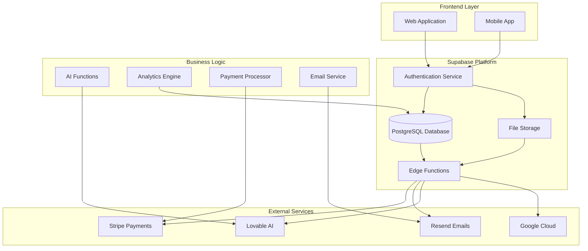
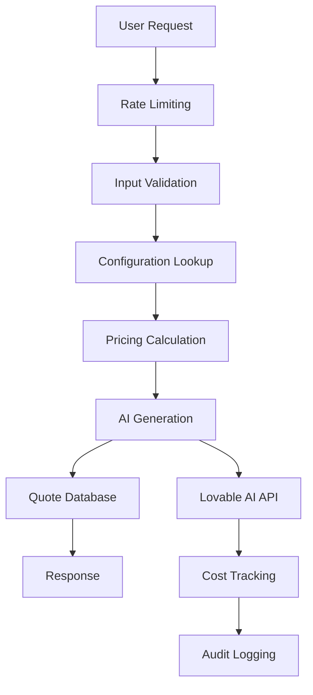
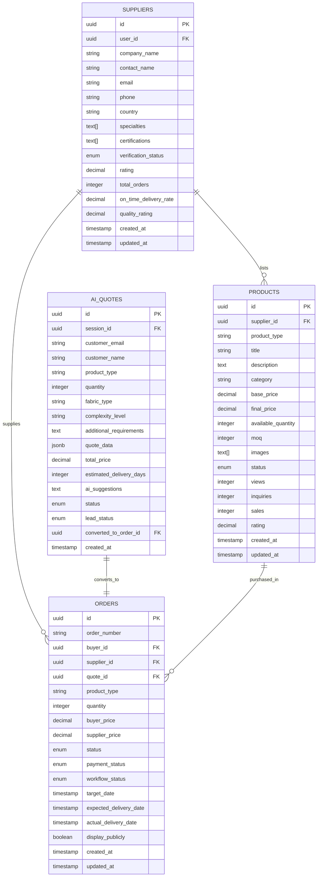
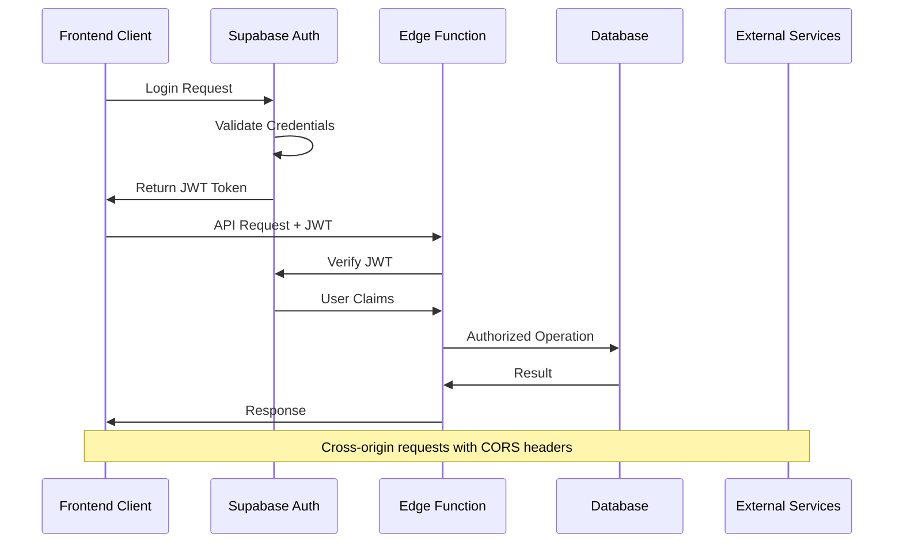
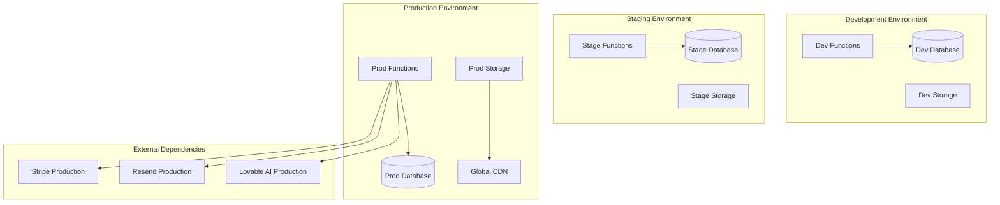

# Backend Architecture

<cite>
**Referenced Files in This Document**
- [supabase/config.toml](file://supabase/config.toml)
- [package.json](file://package.json)
- [src/integrations/supabase/client.ts](file://src/integrations/supabase/client.ts)
- [src/types/database.ts](file://src/types/database.ts)
- [supabase/functions/ai-quote-generator/index.ts](file://supabase/functions/ai-quote-generator/index.ts)
- [supabase/functions/email-service/index.ts](file://supabase/functions/email-service/index.ts)
- [supabase/functions/analytics-service/index.ts](file://supabase/functions/analytics-service/index.ts)
- [supabase/functions/generate-invoice/index.ts](file://supabase/functions/generate-invoice/index.ts)
- [supabase/functions/create-payment-intent/index.ts](file://supabase/functions/create-payment-intent/index.ts)
- [supabase/functions/health/index.ts](file://supabase/functions/health/index.ts)
- [supabase/functions/bootstrap-admin/index.ts](file://supabase/functions/bootstrap-admin/index.ts)
- [supabase/migrations/20250122000000_create_marketplace_system.sql](file://supabase/migrations/20250122000000_create_marketplace_system.sql)
- [supabase/migrations/20251120131648_76091c3c-ec15-4a1a-a0bc-3d265c494103.sql](file://supabase/migrations/20251120131648_76091c3c-ec15-4a1a-a0bc-3d265c494103.sql)
- [supabase/migrations/add_supplier_to_quotes.sql](file://supabase/migrations/add_supplier_to_quotes.sql)
</cite>

## Table of Contents
1. [Introduction](#introduction)
2. [System Overview](#system-overview)
3. [Supabase Backend-as-a-Service Architecture](#supabase-backend-as-a-service-architecture)
4. [Edge Functions Ecosystem](#edge-functions-ecosystem)
5. [Database Schema and Evolution](#database-schema-and-evolution)
6. [Authentication and Authorization](#authentication-and-authorization)
7. [Infrastructure Requirements](#infrastructure-requirements)
8. [Scalability Considerations](#scalability-considerations)
9. [Deployment Topology](#deployment-topology)
10. [Security Architecture](#security-architecture)
11. [Performance Monitoring](#performance-monitoring)
12. [Troubleshooting Guide](#troubleshooting-guide)

## Introduction

The Sleek Apparels backend system is built on Supabase as a comprehensive Backend-as-a-Service (BaaS) platform, providing a robust foundation for a B2B apparel manufacturing marketplace. The architecture leverages Supabase's integrated database, authentication, storage, and Edge Functions capabilities to deliver a scalable, secure, and feature-rich platform for garment manufacturers and buyers.

The system handles complex business logic including AI-powered quote generation, automated supplier assignment, real-time analytics, payment processing, and comprehensive marketplace functionality. With 43 Edge Functions managing various aspects of the business, the architecture demonstrates a modern serverless approach to enterprise-grade applications.

## System Overview

The backend architecture follows a distributed, event-driven design pattern that separates concerns across multiple specialized components:

**Diagram sources**
- [supabase/config.toml](file://supabase/config.toml#L1-L80)
- [src/integrations/supabase/client.ts](file://src/integrations/supabase/client.ts#L1-L20)

**Section sources**
- [package.json](file://package.json#L1-L115)
- [src/integrations/supabase/client.ts](file://src/integrations/supabase/client.ts#L1-L20)

## Supabase Backend-as-a-Service Architecture

### Core Components

Supabase serves as the central backbone of the system, providing:

#### PostgreSQL Database
- **Primary Data Store**: ACID-compliant transactional database with advanced indexing and full-text search capabilities
- **JSONB Support**: Flexible schema design for dynamic product specifications and user preferences
- **Geospatial Functions**: Location-based supplier matching and logistics optimization
- **Advanced Analytics**: Built-in support for complex reporting and business intelligence queries

#### Authentication Service
- **JWT-based Authentication**: Stateless token-based authentication with automatic refresh
- **Role-based Access Control**: Multi-tier permission system supporting admin, buyer, supplier, and factory roles
- **Social Login**: OAuth integration with major providers
- **Two-factor Authentication**: Optional security enhancement for sensitive operations

#### Storage Service
- **Object Storage**: Secure file upload and retrieval for product images, documents, and media
- **CDN Integration**: Global content delivery with automatic compression and optimization
- **Access Control**: Fine-grained permissions for private and public assets
- **Versioning**: Automatic backup and rollback capabilities for critical files

#### Edge Functions
- **Serverless Compute**: Event-driven functions for business logic processing
- **Cold Start Optimization**: Efficient resource allocation and warm-up strategies
- **Environment Isolation**: Separate environments for development, staging, and production
- **Built-in Monitoring**: Real-time performance tracking and error reporting

**Section sources**
- [supabase/config.toml](file://supabase/config.toml#L1-L80)
- [src/types/database.ts](file://src/types/database.ts#L1-L579)

## Edge Functions Ecosystem

The system employs 43 Edge Functions organized into specialized categories, each handling specific business logic requirements:

### AI-Powered Features

**Diagram sources**
- [supabase/functions/ai-quote-generator/index.ts](file://supabase/functions/ai-quote-generator/index.ts#L1-L807)
- [supabase/functions/analytics-service/index.ts](file://supabase/functions/analytics-service/index.ts#L1-L220)

#### Core AI Functions
- **AI Quote Generator**: Intelligent pricing and timeline estimation with Lovable AI integration
- **AI Design Generator**: Automated garment design creation with image analysis
- **AI Market Research**: Industry trend analysis and competitive intelligence
- **AI Conversational Assistant**: Natural language quote building and customer support

#### Business Logic Functions
- **Supplier Assignment**: Automated supplier matching based on capabilities and availability
- **Quality Prediction**: Risk assessment and quality forecasting using historical data
- **Automation Rules**: Business rule engine for workflow automation
- **Batch Processing**: Large-scale data processing and synchronization

#### Service Functions
- **Email Service**: Comprehensive email orchestration with templating and delivery tracking
- **Analytics Service**: Real-time business intelligence and reporting
- **Payment Processing**: Stripe integration for secure transactions
- **Invoice Generation**: AI-powered invoice creation and delivery

#### Utility Functions
- **Health Monitoring**: System health checks and performance monitoring
- **Security Logging**: Comprehensive audit trails and security event tracking
- **Rate Limiting**: Sophisticated throttling mechanisms for API protection
- **Bootstrap Admin**: Secure initial admin setup and role assignment

**Section sources**
- [supabase/functions/ai-quote-generator/index.ts](file://supabase/functions/ai-quote-generator/index.ts#L1-L807)
- [supabase/functions/email-service/index.ts](file://supabase/functions/email-service/index.ts#L1-L555)
- [supabase/functions/analytics-service/index.ts](file://supabase/functions/analytics-service/index.ts#L1-L220)
- [supabase/functions/generate-invoice/index.ts](file://supabase/functions/generate-invoice/index.ts#L1-L243)

## Database Schema and Evolution

### Primary Schema Structure

The database evolves through a comprehensive migration system that maintains data integrity while enabling feature development:

**Diagram sources**
- [src/types/database.ts](file://src/types/database.ts#L1-L579)
- [supabase/migrations/20250122000000_create_marketplace_system.sql](file://supabase/migrations/20250122000000_create_marketplace_system.sql#L1-L532)

### Migration Evolution

The database schema has evolved through strategic migrations that enhance functionality while maintaining backward compatibility:

#### Phase 1: Core Marketplace Foundation
- **Initial Setup**: Basic supplier, order, and quote management
- **Product Catalog**: Structured product listings with categorization
- **User Roles**: Multi-tier permission system for different user types

#### Phase 2: Advanced Features
- **Supplier Capabilities**: Detailed supplier skill matrices and specialization tracking
- **Marketplace Enhancement**: Product approval workflows and quality controls
- **Analytics Integration**: Engagement metrics and performance tracking

#### Phase 3: Operational Excellence
- **Automated Workflows**: Supplier assignment and quality control automation
- **Payment Integration**: Stripe payment processing and invoice generation
- **Communication Systems**: Real-time messaging and notification frameworks

**Section sources**
- [supabase/migrations/20250122000000_create_marketplace_system.sql](file://supabase/migrations/20250122000000_create_marketplace_system.sql#L1-L532)
- [supabase/migrations/20251120131648_76091c3c-ec15-4a1a-a0bc-3d265c494103.sql](file://supabase/migrations/20251120131648_76091c3c-ec15-4a1a-a0bc-3d265c494103.sql#L1-L31)
- [supabase/migrations/add_supplier_to_quotes.sql](file://supabase/migrations/add_supplier_to_quotes.sql#L1-L28)

## Authentication and Authorization

### JWT-based Authentication System

The authentication system implements a comprehensive security framework with multiple layers of protection:

**Diagram sources**
- [supabase/functions/create-payment-intent/index.ts](file://supabase/functions/create-payment-intent/index.ts#L1-L288)
- [src/contexts/AuthContext.tsx](file://src/contexts/AuthContext.tsx#L83-L133)

### Role-Based Access Control

The system implements a sophisticated RBAC model with granular permissions:

#### User Roles
- **Admin**: Full system administration with database-level access
- **Buyer**: Order management, quote requests, and product browsing
- **Supplier**: Product catalog management, order fulfillment, and supplier dashboard
- **Factory**: Production stage management and quality control

#### Permission Matrix
- **Data Access**: Row-level security ensures users only access their data
- **Operation Permissions**: CRUD operations restricted by role and ownership
- **Cross-System Access**: Controlled inter-service communication

### Security Features

#### Rate Limiting and Protection
- **IP-based Throttling**: Prevents abuse and DDoS attacks
- **Session Management**: Secure token handling with automatic refresh
- **CSRF Protection**: Cross-site request forgery prevention
- **Input Validation**: Comprehensive sanitization and validation

#### Audit and Monitoring
- **Activity Logging**: Complete audit trail for compliance and security
- **Security Events**: Real-time monitoring of suspicious activities
- **Compliance Reporting**: Automated compliance documentation

**Section sources**
- [supabase/functions/create-payment-intent/index.ts](file://supabase/functions/create-payment-intent/index.ts#L1-L288)
- [supabase/functions/bootstrap-admin/index.ts](file://supabase/functions/bootstrap-admin/index.ts#L1-L178)
- [src/contexts/AuthContext.tsx](file://src/contexts/AuthContext.tsx#L83-L133)

## Infrastructure Requirements

### Compute Resources

The Edge Functions ecosystem requires careful resource planning to ensure optimal performance:

#### Function Runtime Specifications
- **Memory Allocation**: 128MB-512MB per function depending on complexity
- **Execution Time**: 10-second maximum execution time with cold start optimization
- **Concurrency Limits**: 100 concurrent executions per function
- **Storage**: 10GB persistent storage per function

#### Database Requirements
- **Storage**: 100GB SSD storage with automatic backups
- **Connections**: 100 concurrent connections
- **Replication**: Active-passive replication for high availability
- **Backup**: Daily automated backups with 30-day retention

### Network Infrastructure

#### CDN and Edge Locations
- **Global Distribution**: Multiple edge locations for reduced latency
- **SSL/TLS Termination**: End-to-end encryption with modern cipher suites
- **Compression**: Automatic gzip and brotli compression
- **Caching**: Intelligent caching strategies for static and dynamic content

#### Load Balancing
- **Auto-scaling**: Dynamic scaling based on traffic patterns
- **Health Checks**: Continuous health monitoring with automatic failover
- **Geographic Routing**: Intelligent routing based on user location

**Section sources**
- [supabase/config.toml](file://supabase/config.toml#L1-L80)
- [package.json](file://package.json#L1-L115)

## Scalability Considerations

### Horizontal Scaling Strategy

The architecture is designed for horizontal scalability across multiple dimensions:

#### Function-Level Scaling
- **Auto-scaling**: Functions automatically scale based on request volume
- **Warm-up Strategies**: Pre-warming critical functions during peak hours
- **Resource Optimization**: Dynamic memory allocation based on function requirements

#### Database Scaling
- **Read Replicas**: Asynchronous replication for read-heavy workloads
- **Partitioning**: Logical partitioning of large tables by date or region
- **Index Optimization**: Strategic indexing for query performance

#### Storage Scaling
- **Object Versioning**: Automatic versioning for content management
- **Tiered Storage**: Hot, warm, and cold storage tiers based on access patterns
- **Geographic Distribution**: Regional storage for compliance and performance

### Performance Optimization

#### Caching Strategies
- **Edge Caching**: Static content caching at edge locations
- **Application Caching**: Redis-based caching for frequently accessed data
- **Database Caching**: Query result caching and connection pooling

#### Monitoring and Alerting
- **Real-time Metrics**: Comprehensive monitoring of all system components
- **Performance Baselines**: Automated baseline establishment and deviation detection
- **Proactive Alerts**: Intelligent alerting before performance degradation

**Section sources**
- [supabase/functions/ai-quote-generator/index.ts](file://supabase/functions/ai-quote-generator/index.ts#L38-L94)
- [supabase/functions/create-payment-intent/index.ts](file://supabase/functions/create-payment-intent/index.ts#L135-L149)

## Deployment Topology

### Multi-Environment Architecture

The system operates across multiple environments with strict separation of concerns:

**Diagram sources**
- [supabase/config.toml](file://supabase/config.toml#L1-L80)
- [supabase/functions/health/index.ts](file://supabase/functions/health/index.ts#L1-L34)

### Deployment Pipeline

#### CI/CD Integration
- **Automated Testing**: Comprehensive test suites for all Edge Functions
- **Environment Promotion**: Automated deployment to staging and production
- **Rollback Mechanisms**: Quick rollback capabilities for failed deployments
- **Feature Flags**: Gradual feature rollouts with A/B testing capabilities

#### Infrastructure as Code
- **Terraform Modules**: Infrastructure provisioning and management
- **Environment Variables**: Secure configuration management
- **Secret Rotation**: Automated secret rotation for security
- **Compliance Automation**: Automated compliance checking and reporting

**Section sources**
- [supabase/functions/health/index.ts](file://supabase/functions/health/index.ts#L1-L34)
- [supabase/functions/bootstrap-admin/index.ts](file://supabase/functions/bootstrap-admin/index.ts#L1-L178)

## Security Architecture

### Defense-in-Depth Strategy

The security architecture implements multiple layers of protection:

#### Network Security
- **TLS Encryption**: End-to-end encryption for all communications
- **Firewall Rules**: Strict ingress and egress firewall configurations
- **DDoS Protection**: Automatic mitigation of distributed denial-of-service attacks
- **VPN Access**: Secure remote access for administrative tasks

#### Application Security
- **Input Sanitization**: Comprehensive input validation and sanitization
- **SQL Injection Prevention**: Parameterized queries and prepared statements
- **XSS Protection**: Content Security Policy and output encoding
- **CSRF Protection**: Anti-forgery tokens for state-changing operations

#### Data Security
- **Encryption at Rest**: AES-256 encryption for all stored data
- **Encryption in Transit**: TLS 1.3 for all network communications
- **Access Controls**: Role-based access controls with least privilege principle
- **Audit Trails**: Comprehensive logging and monitoring of all data access

### Compliance Framework

#### Regulatory Compliance
- **GDPR**: Data protection and privacy compliance
- **SOC 2**: Security and operational controls certification
- **ISO 27001**: Information security management systems
- **PCI DSS**: Payment card industry data security standards

#### Internal Controls
- **Security Reviews**: Regular security assessments and penetration testing
- **Incident Response**: Comprehensive incident response procedures
- **Training Programs**: Security awareness training for all team members
- **Documentation**: Complete security documentation and procedures

**Section sources**
- [supabase/functions/ai-quote-generator/index.ts](file://supabase/functions/ai-quote-generator/index.ts#L131-L202)
- [supabase/functions/bootstrap-admin/index.ts](file://supabase/functions/bootstrap-admin/index.ts#L60-L89)

## Performance Monitoring

### Observability Stack

The system implements comprehensive observability across all components:

#### Metrics Collection
- **Function Metrics**: Execution time, memory usage, and error rates
- **Database Metrics**: Query performance, connection pools, and I/O statistics
- **Network Metrics**: Latency, throughput, and error rates
- **Business Metrics**: Conversion rates, user engagement, and revenue metrics

#### Tracing and Debugging
- **Distributed Tracing**: End-to-end request tracing across all services
- **Structured Logging**: Centralized logging with correlation IDs
- **Error Tracking**: Real-time error monitoring and alerting
- **Performance Profiling**: CPU and memory profiling for optimization

#### Alerting and Incident Management
- **Threshold-based Alerts**: Automated alerts for performance deviations
- **Anomaly Detection**: Machine learning-based anomaly detection
- **Escalation Procedures**: Automated escalation based on alert severity
- **Incident Response**: Integrated incident management workflows

**Section sources**
- [supabase/functions/health/index.ts](file://supabase/functions/health/index.ts#L1-L34)
- [supabase/functions/analytics-service/index.ts](file://supabase/functions/analytics-service/index.ts#L1-L220)

## Troubleshooting Guide

### Common Issues and Solutions

#### Authentication Problems
- **Expired Tokens**: Automatic token refresh with exponential backoff
- **Invalid Credentials**: Comprehensive error messaging with recovery guidance
- **Permission Denied**: Clear error messages indicating required permissions
- **Rate Limiting**: Graceful degradation with retry-after headers

#### Database Connectivity
- **Connection Pool Exhaustion**: Automatic connection pooling with monitoring
- **Query Performance**: Query optimization with execution plan analysis
- **Deadlocks**: Transaction isolation level optimization
- **Backup Restoration**: Automated backup verification and restoration

#### Edge Function Failures
- **Cold Start Issues**: Function warming and optimization strategies
- **Timeout Errors**: Configurable timeouts with graceful degradation
- **Memory Limits**: Memory optimization and chunking strategies
- **External Service Failures**: Circuit breaker patterns and fallback mechanisms

### Diagnostic Tools

#### Built-in Monitoring
- **Health Checks**: Comprehensive health monitoring endpoints
- **Performance Metrics**: Real-time performance monitoring dashboards
- **Error Tracking**: Centralized error tracking and analysis
- **Usage Analytics**: Detailed usage analytics and trend analysis

#### Debugging Capabilities
- **Logging Levels**: Configurable logging levels for different environments
- **Debug Mode**: Development-specific debugging features
- **Performance Profiling**: Built-in performance profiling tools
- **Integration Testing**: Comprehensive integration testing frameworks

**Section sources**
- [supabase/functions/ai-quote-generator/index.ts](file://supabase/functions/ai-quote-generator/index.ts#L748-L807)
- [supabase/functions/create-payment-intent/index.ts](file://supabase/functions/create-payment-intent/index.ts#L279-L288)